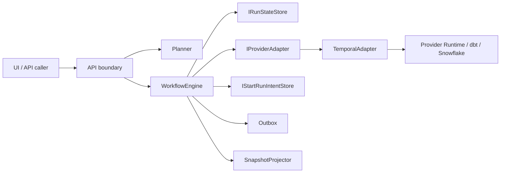
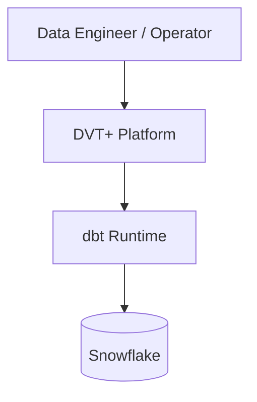
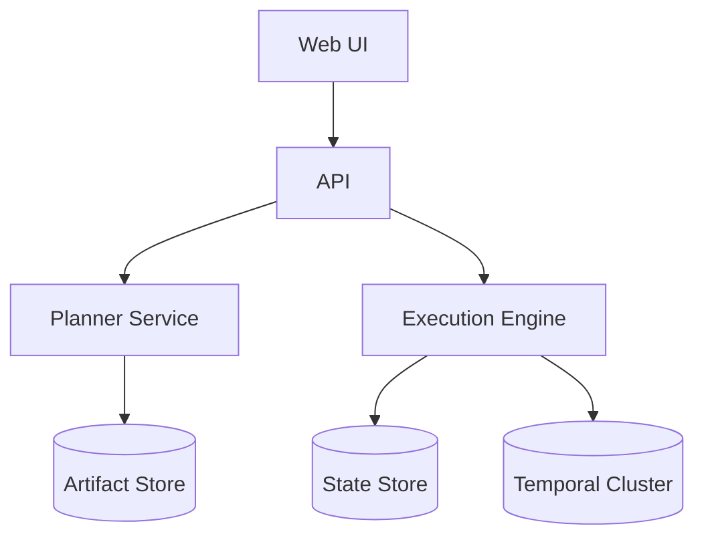
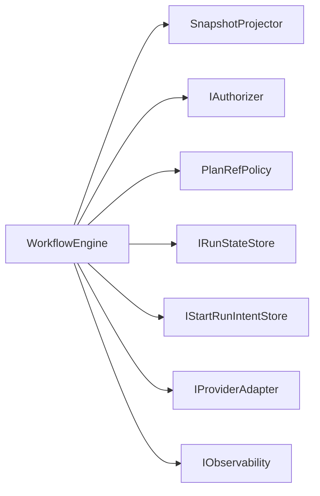
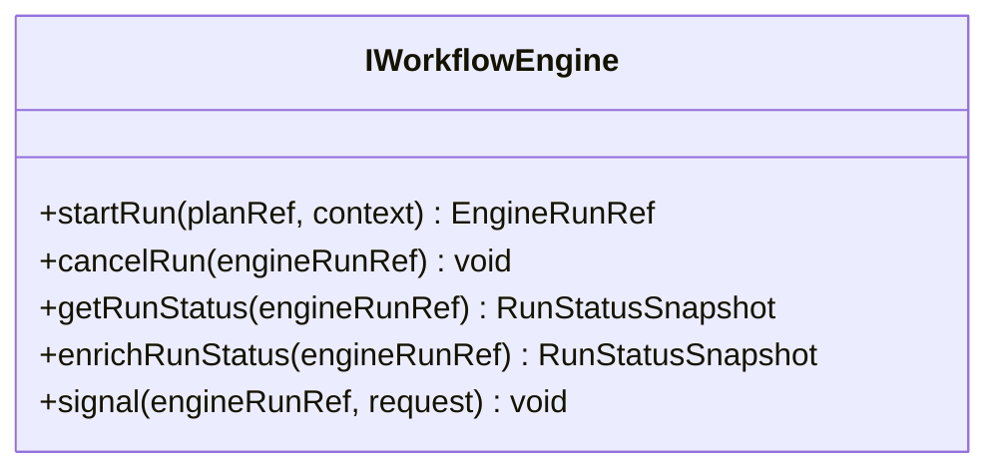
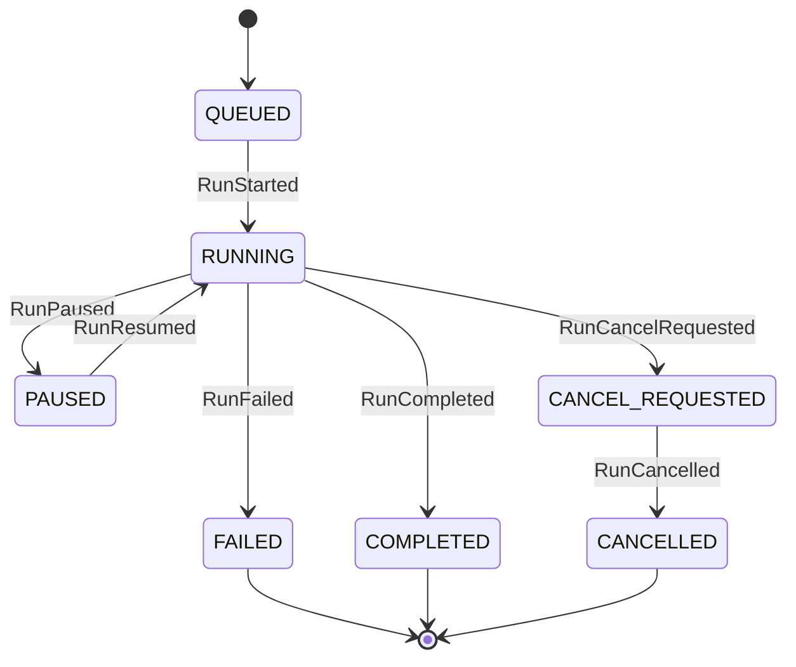
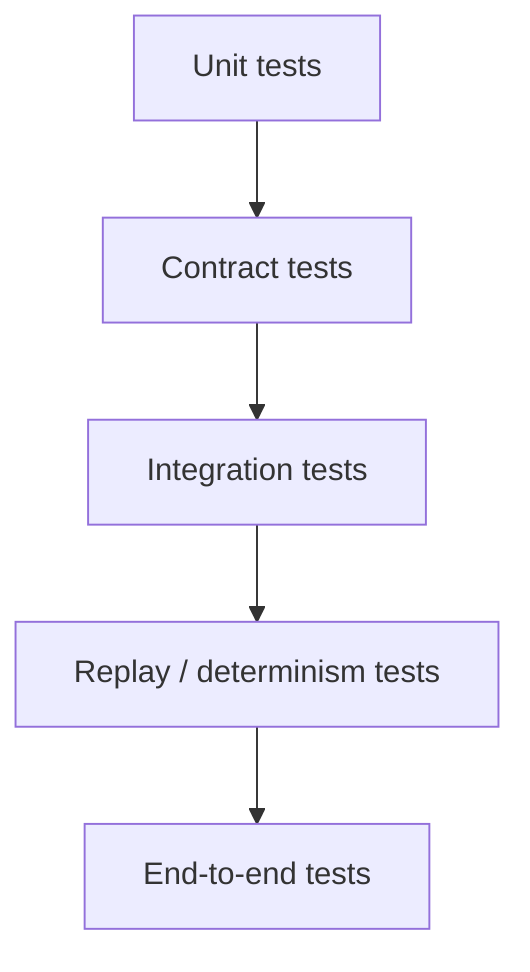

# DVT+ Execution Model Specification

**Status:** Working normative draft  
**Date:** 2026-03-06  
**Scope:** ExecutionPlan, run events, state transitions, idempotency, retries, invariants, tests, ADR alignment

---

## 1. Purpose

This document defines the formal execution contract for DVT+.

It is intended to be the implementation-facing specification that sits between:

- planner
- execution engine
- provider adapters
- state store
- read models
- API / UI

The goal is to make execution deterministic, replayable, testable, and replaceable without leaking provider runtime details into the domain core.

---

## 2. Architectural stance

DVT+ execution follows these rules:

- **Hexagonal architecture**: domain core depends on ports, never on provider SDKs.
- **DDD bounded contexts**: planner, execution, state, artifacts, UX, platform remain separate.
- **SOLID**:
  - single responsibility per module
  - small interfaces
  - dependency inversion through ports
- **OOP with explicit contracts**: behavior is modeled as ports, services, aggregates, value objects, and policies.
- **CQRS/event-sourced execution state**: write path emits immutable events; read path consumes snapshots/projected state.
- **Determinism first**: provider runtimes execute, but they do not decide.

### Consequences

**Positive**

- provider replacement is possible
- replay is possible
- failures are diagnosable
- tests can target boundaries precisely

**Negative**

- more contracts
- more up-front design discipline
- versioning overhead is unavoidable

---

## 3. Bounded contexts

| Context   | Responsibility                              | Must not do                                 |
| --------- | ------------------------------------------- | ------------------------------------------- |
| Planner   | Build `ExecutionPlan` from canonical inputs | Read runtime state to alter plan generation |
| Execution | Orchestrate run lifecycle from plan         | Redesign plan or infer business policy      |
| State     | Persist run metadata, events, snapshots     | Execute provider logic                      |
| Artifacts | Parse/store dbt artifacts                   | Decide execution                            |
| UX        | Render read models and submit commands      | Execute workflows directly                  |
| Platform  | Observability, authz, auditing, cost hooks  | Become source of truth for run state        |

---

## 4. Core execution principles

1. **UI does not execute.**
2. **Engine does not invent plan topology or provider semantics, but it does own execution-policy governance at the system boundary.**
3. **Planner does not persist.**
4. **State is the source of truth for run status.**
5. **Provider status is enrichment, not authority.**
6. **Events are immutable once persisted.**
7. **Ordering is authoritative and monotonic per run.**
8. **Idempotency is mandatory on every write boundary.**
9. **Snapshots accelerate reads but do not replace the event log.**
10. **Adapters receive validated contracts, not internal aggregates.**

---

## 5. Hexagonal execution model



### Why

This keeps orchestration policy in the domain layer and runtime concerns in adapters.

### Consequences

The engine can be tested without Temporal, and Temporal can be tested against contract conformance instead of core behavior ownership.

---

## 6. C4 model

### 6.1 System context



### 6.2 Container view



### 6.3 Component view — execution



---

## 7. Domain model

### 7.1 Main entities

- `ExecutionPlan`
- `Run`
- `Step`
- `RunMetadata`
- `RunEvent`

### 7.2 Value objects

- `PlanRef`
- `EngineRunRef`
- `RunContext`
- `SignalRequest`
- `RunStatusSnapshot`

### 7.3 Aggregate boundary

`Run` is the effective execution aggregate from the perspective of persisted lifecycle state.

It is reconstructed from:

- metadata
- ordered event log
- optional snapshot

---

## 8. Formal contract surfaces

### 8.1 IWorkflowEngine

Normative operations:

- `startRun(planRef, context)`
- `cancelRun(engineRunRef)`
- `getRunStatus(engineRunRef)`
- `enrichRunStatus(engineRunRef)`
- `signal(engineRunRef, request)`



### 8.2 IRunStateStore

Normative responsibilities:

- atomic bootstrap of run metadata + first events
- atomic append + outbox enqueue
- metadata lookup by `(tenantId, runId)`
- event listing ordered by `runSeq`
- snapshot read
- run listing

### 8.3 IProviderAdapter

Normative responsibilities:

- provider-native `startRun`
- provider-native `cancelRun`
- provider-native `signal`
- provider-native `getRunStatus` for enrichment only
- capability disclosure where implemented

---

## 9. ExecutionPlan contract

### 9.1 Intent

`ExecutionPlan` is the deterministic execution contract emitted by the planner and consumed by the engine/adapter boundary.

### 9.2 Required properties

At minimum:

- `planId`
- `planVersion`
- `schemaVersion`
- `contractVersion`
- `inputHashSha256`
- ordered or dependency-structured steps

Runtime compatibility and capability requirements do not belong to
`ExecutionPlan`. They belong to `RunExecutionPolicy`, while adapter selection
remains owned by `RunContext.targetAdapter`.

### 9.3 Rule set

- The engine must validate `schemaVersion`.
- The engine must validate `PlanRef` integrity policy before dispatch.
- The adapter must not reinterpret business meaning of steps.
- The provider may execute physically in its own way, but the semantic order visible to state must remain consistent with the plan and event invariants.

### 9.4 Example abstract shape

```json
{
  "metadata": {
    "planId": "plan_123",
    "planVersion": "1.0",
    "schemaVersion": "v1.2",
    "contractVersion": "1.0.0",
    "inputHashSha256": "abc123...",
    "createdAtIso": "2026-04-07T00:00:00.000Z"
  },
  "steps": [
    {
      "stepId": "compile",
      "kind": "task",
      "dependsOn": []
    },
    {
      "stepId": "run_models",
      "kind": "task",
      "dependsOn": ["compile"]
    }
  ]
}
```

The corresponding runtime policy is separate:

```json
{
  "requiresCapabilities": ["pause", "resume"],
  "pluginCompatibilityFingerprint": "def456..."
}
```

`PlanRef` is a transport reference to the persisted plan artifact and carries:

```json
{
  "uri": "artifact://plans/plan_123.json",
  "sha256": "abc123...",
  "schemaVersion": "v1.2",
  "planId": "plan_123",
  "planVersion": "1.0"
}
```

````

---

## 10. Run identity model

Every run must be scoped by:

- `tenantId`
- `projectId`
- `environmentId`
- `runId`

Additional execution identity:

- `logicalAttemptId`
- provider identity in `EngineRunRef`
- `workflowId` / provider-native IDs

### Why

This prevents cross-tenant ambiguity and makes replay, audit, and retries explicit.

---

## 11. Start-run lifecycle

```mermaid
sequenceDiagram
    participant API
    participant Engine
    participant Intent as StartRunIntentStore
    participant Adapter
    participant State
    participant Outbox

    API->>Engine: startRun(planRef, context)
    Engine->>Engine: validate planRef/context/authz
    Engine->>Intent: createIntent(...)
    Engine->>Adapter: startRun(...)
    Adapter-->>Engine: EngineRunRef
    Engine->>Intent: markDispatched(...)
    Engine->>State: bootstrapRunTx(metadata, firstEvents)
    State->>Outbox: enqueue initial events
    Engine->>Intent: markResolved(...)
    Engine-->>API: EngineRunRef
````

### Why

This pattern reduces crash windows and makes pre-dispatch intent visible.

### Consequences

You gain crash consistency and explicit compensation, but start-up becomes a multi-step transactional pattern that must be tested aggressively.

---

## 12. Run event model

### 12.1 Event categories

#### Run-level events

- `RunQueued`
- `RunStarted`
- `RunCancelRequested`
- `RunCancelled`
- `RunPaused`
- `RunResumed`
- `RunCompleted`
- `RunFailed`

#### Step-level events

- `StepStarted`
- `StepCompleted`
- `StepFailed`
- `StepSkipped`

### 12.2 Event envelope

Every event write should carry, at minimum:

- `eventId`
- `eventType`
- `emittedAt`
- `tenantId`
- `projectId`
- `environmentId`
- `runId`
- `planId`
- `planVersion`
- `logicalAttemptId`
- `engineAttemptId`
- `idempotencyKey`
- optional `stepId`
- optional `payload`

Persisted records additionally carry:

- `runSeq`
- `persistedAt`

### 12.3 Write shape vs persisted shape

```mermaid
flowchart LR
    Write[RunEventInput
no runSeq / no persistedAt]
    Append[Append Authority]
    Persisted[RunEventPersisted
with runSeq / persistedAt]

    Write --> Append --> Persisted
```

### Why

`runSeq` and `persistedAt` are storage authority concerns. Allowing callers to provide them would break ordering and auditability.

---

## 13. State transitions

### 13.1 High-level run state machine



### 13.2 Rules

- `RunCompleted` is terminal.
- `RunFailed` is terminal for that execution attempt.
- `RunCancelled` is terminal.
- `RunCancelRequested` is not terminal.
- `RunPaused` is not terminal.
- Terminal transitions must be unique per `(runId, logicalAttemptId)` unless the contract explicitly defines continuation semantics.

---

## 14. Ordering invariants

### 14.1 Authoritative ordering

`runSeq` is the only authoritative per-run ordering key.

### 14.2 Normative invariants

- `runSeq` is strictly increasing per `runId`.
- no two persisted events for the same `runId` may share the same `runSeq`
- readers must consume events in ascending `runSeq`
- snapshots must represent a prefix-consistent projection of the event stream

### 14.3 Why

Provider timestamps can be late, duplicated, or reordered. The persistent append authority must define the single source of event order.

---

## 15. Idempotency model

### 15.1 Scope

Idempotency is mandatory at:

- run bootstrap
- event append
- signal-derived event emission
- outbox delivery

### 15.2 Key rule

The uniqueness boundary is effectively:

- `(runId, idempotencyKey)`

### 15.3 Consequences

If the same logical write is retried due to crash or duplicate delivery:

- no second semantic event is created
- the store returns existing metadata
- projections remain stable

### 15.4 Example idempotency domains

- run-level event key
- signal-derived event key
- step event key
- provider retry should not create a new semantic key when it represents the same domain fact

---

## 16. Retry semantics

### 16.1 Two retry layers exist

#### A. Provider/runtime retry

Managed by Temporal or provider infrastructure.

#### B. Business/logical retry

Modeled explicitly through `logicalAttemptId`.

### 16.2 Normative rule

Infrastructure retry must **not** silently change the business identity of the attempt.

### 16.3 Consequences

- provider retries are opaque operational behavior
- business retries remain visible to the domain and analytics
- audit logs can distinguish instability from intentional rerun

---

## 17. Status read model

### 17.1 Default status path

`getRunStatus` must use:

- snapshot first
- event replay fallback only when snapshot is absent

It must **not** call the provider adapter on the default path.

### 17.2 Enriched status path

`enrichRunStatus` may call the provider adapter to obtain:

- substatus
- transient message
- runtime-native diagnostics

### 17.3 Why

The authoritative read path must remain available even when the provider is degraded.

---

## 18. Snapshot model

### 18.1 Purpose

Snapshots accelerate reads and reduce replay cost.

### 18.2 Rules

- snapshots are derived, never authoritative over events
- null snapshot must trigger replay fallback
- snapshot content must be reconstructible from persisted events
- snapshot rebuild processes must be deterministic

### 18.3 Consequences

You gain performance, but you now need rebuild tooling and consistency checks.

---

## 19. Outbox model

### 19.1 Purpose

Ensure reliable downstream publication of persisted domain events.

### 19.2 Rules

- append and enqueue must be atomic from the perspective of the state store contract
- outbox failure must not imply loss of persisted event
- delivery retries must be idempotent
- outbox should be rate-limited per tenant if required operationally

---

## 20. Authorization and tenancy

### 20.1 Rules

- tenant scope is mandatory at engine boundaries
- engine operations must call authorizer before accessing tenant run state
- allow-all authorizers are acceptable only for controlled non-production contexts

### 20.2 Consequences

Execution remains architecture-correct only if tenant checks happen before any metadata or status exposure.

---

## 21. Plugin/runtime policy

Plugins must not gain authority over:

- event ordering
- run state truth
- tenant boundary bypass
- core execution decisions

Plugin runtime should be treated as:

- isolated
- capability-scoped
- auditable
- deny-by-default

---

## 22. Testing strategy

### 22.1 Test pyramid



### 22.2 Required suites

#### Domain / engine

- startRun happy path
- duplicate run rejection
- invalid schema rejection
- capability mismatch rejection
- cancel path
- signal path
- status path without provider access
- enrichment path with provider access

#### State store

- monotonic `runSeq`
- duplicate `idempotencyKey` returns existing record
- snapshot null fallback path
- append + outbox atomicity
- tenant isolation

#### Adapter

- provider status mapping
- cancel semantics
- workflow restart/crash recovery
- no duplicate semantic events on retry

#### Replay / determinism

- same event stream → same snapshot
- same plan → same behavioral ordering
- restart during execution does not violate idempotency

### 22.3 Definition of done for execution changes

A change is not done until:

- contract surface updated if needed
- ADR added/updated if architectural
- tests added at the correct boundary
- invariants preserved
- docs updated

---

## 23. Four-sprint implementation plan

### Sprint 1 — Contract closure and execution/state hardening

**Goal:** close normative boundaries and stabilize engine/state core.

#### Team A — Execution

- close `IWorkflowEngine` semantics
- remove boundary ambiguity between status and enriched status
- harden start/cancel/signal flows
- add contract tests

#### Team B — State

- close `IRunStateStore` behavior
- enforce write-shape guardrails
- verify append authority invariants
- snapshot fallback tests

#### Team C — UX/read side

- define canonical read model from state + artifacts
- stop adding new UI mocks
- align graph/runtime types to contracts

#### Team D — Platform

- replace observability placeholders with real OTel bindings
- define trace/metric labels and cardinality rules

**Sprint 1 exit criteria**

- authoritative engine and state contracts documented
- deterministic test baseline green
- no new execution-path mocks introduced

---

### Sprint 2 — Artifact/store/API integration

**Goal:** connect real artifact ingestion and real read paths.

#### Team A

- integrate dbt runner boundary
- define step activity payloads and result mapping
- formalize failure/retry mapping

#### Team B

- implement real ArtifactStore boundary
- define artifact refs and retention policy
- expose read APIs for run/artifact lookup

#### Team C

- build parser → graph builder → runtime model pipeline
- lineage and run overlay from real data
- diff semantics draft

#### Team D

- audit hook envelope
- run metrics dashboard
- delivery lag / queue metrics

**Sprint 2 exit criteria**

- UI can render real run state and artifacts
- artifacts are stored and referenced immutably
- audit envelope exists

---

### Sprint 3 — Tenancy, cost, and productization

**Goal:** move from prototype-quality surfaces to platform-quality boundaries.

#### Team A

- business retry semantics with explicit attempt identity
- richer cancel/resume/pause semantics if supported
- replay safety tests

#### Team B

- production authorizer integration
- tenant isolation enforcement end-to-end
- API auth context hardening

#### Team C

- diff viewer from real artifact versions
- lineage confidence indicators
- operational error surface in UI

#### Team D

- cost attribution hooks from query history / provider metadata
- audit-to-observability correlation

**Sprint 3 exit criteria**

- tenant isolation enforced
- cost attribution baseline exists
- read-side no longer depends on provisional mock structures

---

### Sprint 4 — Hardening and extension readiness

**Goal:** make the execution platform safe to extend.

#### Team A

- determinism/replay certification suite
- failure injection tests
- crash-recovery scenarios

#### Team B

- SSE/WS streaming for status updates
- snapshot rebuild tooling
- operational maintenance surfaces

#### Team C

- workflow editing constraints aligned to domain invariants
- UX states for paused/cancel-requested/enriched status

#### Team D

- plugin runtime base with deny-by-default capability model
- sandbox architecture POC
- security review pack

**Sprint 4 exit criteria**

- live read-side updates available
- replay and crash-recovery evidence exists
- plugin runtime does not violate execution authority boundaries

---

## 24. ADRs to create or update

The following ADRs are recommended as part of this program:

1. **ADR — Normative ExecutionPlan Schema**
2. **ADR — Run Event Envelope and Persisted Write Shape**
3. **ADR — Status Read Path vs Enriched Provider Path**
4. **ADR — Logical Retry Identity Model**
5. **ADR — ArtifactStore Boundary and Reference Model**
6. **ADR — Tenant Authorization Enforcement Strategy**
7. **ADR — Snapshot Rebuild and Consistency Policy**
8. **ADR — Plugin Capability and Isolation Model**
9. **ADR — Cost Attribution Source of Truth**
10. **ADR — SSE/WS Read-Model Streaming Contract**

### ADR template

```md
# ADR-XXXX Title

## Status

Proposed | Accepted | Superseded

## Context

What problem exists, and why it matters.

## Decision

Chosen approach.

## Consequences

Positive:

- ...

Negative:

- ...

## Alternatives considered

- ...
```

---

## 25. Project artifacts to maintain

Recommended project artifacts beyond code:

- `docs/architecture/execution-model-spec.md`
- `docs/architecture/state-model.md`
- `docs/architecture/artifact-store.md`
- `docs/architecture/read-models.md`
- `docs/architecture/observability-model.md`
- `docs/architecture/security/tenant-isolation.md`
- `docs/architecture/security/plugin-sandbox.md`
- `docs/adr/ADR-xxxx-*.md`
- `specs/contracts/execution-plan.schema.json`
- `specs/contracts/run-events.schema.json`
- `specs/contracts/read-model-run-status.schema.json`
- `specs/contracts/streaming-status-events.schema.json`
- `docs/testing/execution-test-matrix.md`
- `docs/testing/replay-certification.md`
- `docs/planning/parallel-stream-roadmap.md`

---

## 26. Source alignment checklist

Before merging any execution architecture change, verify:

- does it preserve planner purity?
- does it preserve engine non-decision semantics?
- does it preserve state authority?
- does it preserve tenant isolation?
- does it preserve idempotency?
- does it preserve replayability?
- does it preserve adapter replaceability?
- does it preserve observability at the boundary?

If any answer is "no" or "unclear", the change needs ADR review.

---

## 27. Final judgment

The current repository is strongest in:

- execution engine core
- Temporal adapter direction
- state-store contract direction

It is weaker in:

- artifact-store closure
- production-grade authz/tenancy
- read-side real-model maturity
- non-placeholder observability
- plugin runtime implementation

Therefore the correct program is **not** equal investment everywhere.  
The right sequence is:

1. execution + state hardening
2. real artifact/read integration
3. authz + productization
4. extension/runtime hardening

That is the shortest path to a system that is architecturally credible, testable, and extensible without turning into accidental complexity.
