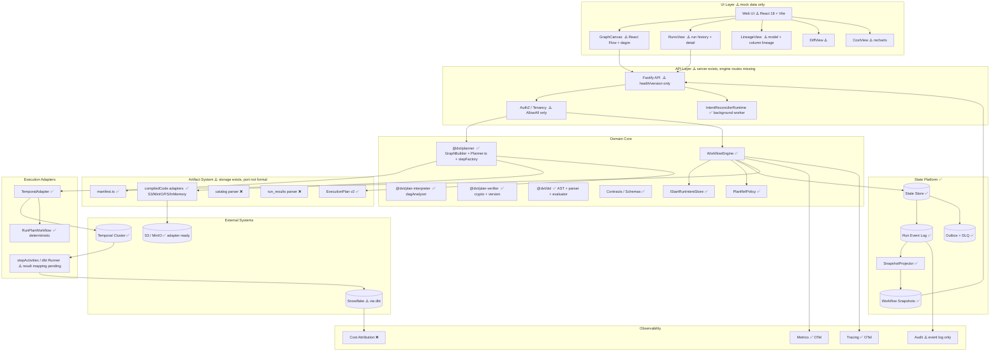
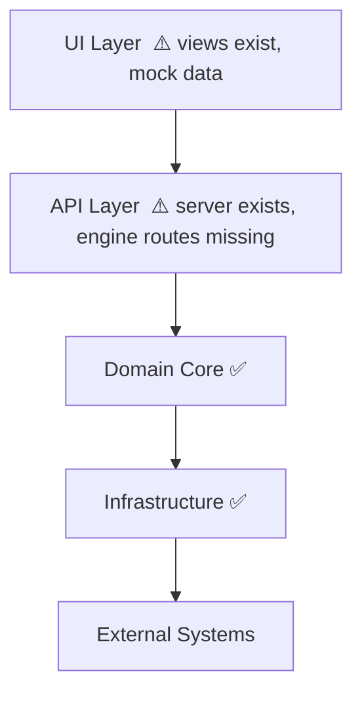
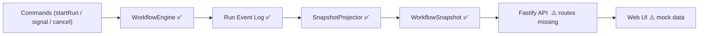
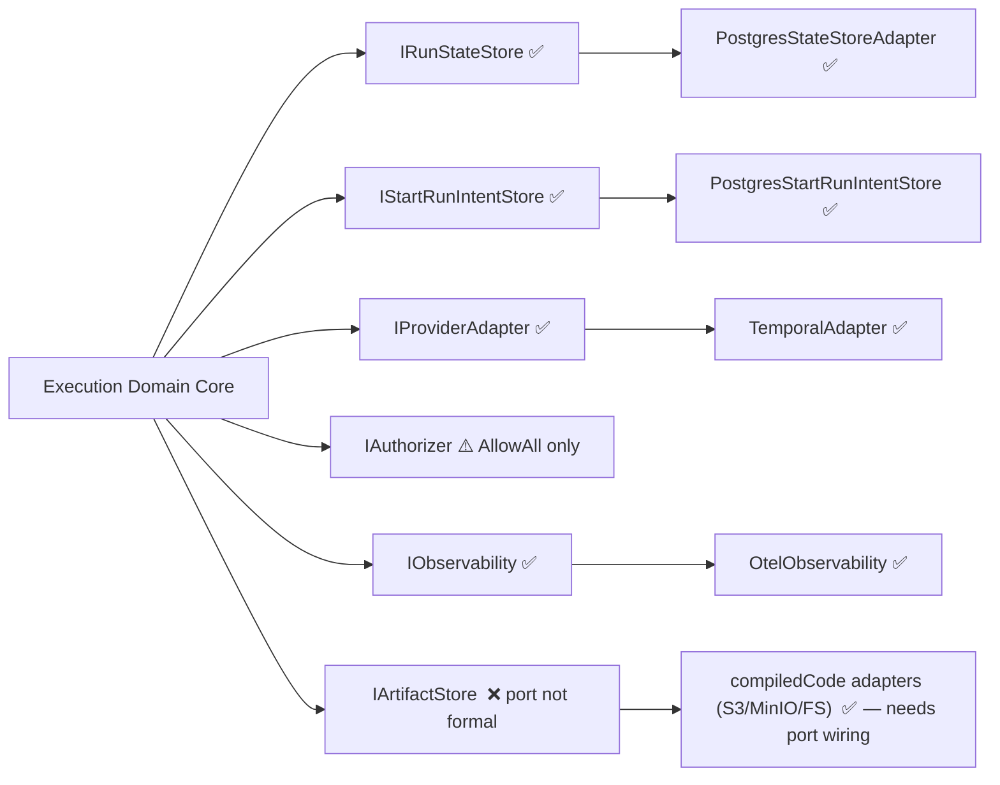
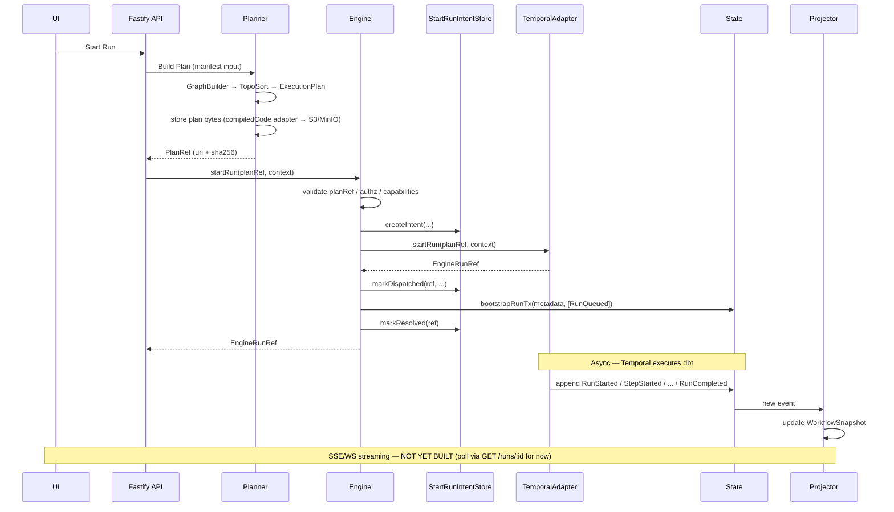

# DVT+ System Map ("God Diagram")

Date: 2026-03-06
Last updated: 2026-03-05 — full codebase audit including apps/web, apps/api, @dvt/planner
Status: Architecture master overview

F-12 note, 2026-05-18: the active web Canvas stack is now `Canvas.tsx`,
`CanvasShell`, `useCanvasController`, and plugin graph strategy registration.
Any `GraphCanvas` labels in this older draft are historical drift and must not
be read as an active source file or route owner.

This diagram shows the **entire DVT+ system in one view**:

- domain modules
- adapters
- state
- artifacts
- CQRS separation
- external systems

> **Implementation status legend:**
>
> - ✅ Implemented
> - ⚠️ Partial
> - ❌ Not yet built / not wired

---

## Complete System Diagram

---

## Architecture Layers

---

## CQRS Model

> Write path (Commands → Engine → EventLog → Projector → Snapshots) is **fully implemented**.
> Read surface (API engine routes → UI) is **not yet wired** — UI runs on mock data.

---

## Hexagonal Boundaries

> `IArtifactStore` as a formal port does not exist yet. The storage implementations
> (S3/MinIO/FileSystem/InMemory) exist inside `@dvt/planner/compiledCode/` — they
> need to be elevated to a domain-level port contract.

---

## Event Flow

> The engine receives a `PlanRef` (uri + sha256), not plan bytes (ADR-0012).
> The planner stores plans via `compiledCode` adapters; the adapter fetches + verifies.
> SSE/WS streaming (Projector → UI) is **not yet built**.

---

## Critical System Invariants

All invariants are ADR-backed and reflected in the implementation.

- **Planner is pure and deterministic.** Builds `ExecutionPlan` from manifest inputs;
  does not read runtime state. ✅ (`@dvt/planner`, `GraphBuilder`, `TopoSort`)
- **Engine executes but does not decide.** Orchestration policy in domain core;
  adapters own runtime concerns. ✅ (ADR-0003/0014)
- **State store owns event ordering.** `runSeq` is the only authoritative per-run
  ordering key; provider timestamps are not trusted. ✅ (ADR-0004)
- **Artifact store owns immutability.** Plans are content-addressed by SHA-256;
  engine receives only a `PlanRef`. ✅ (ADR-0012, `@dvt/plan-verifier`, `@dvt/crypto`)
- **Projector builds derived read models.** `WorkflowSnapshot` is derived, never
  authoritative over the event log. ✅ (`SnapshotProjector`)
- **UI never executes workflows.** Commands flow through API → Engine boundary only. ✅

---

## Key Architectural Modules

Module Responsibility Status

---

WorkflowEngine Orchestrate workflow execution ✅ Implemented
IRunStateStore Persist metadata and events ✅ Implemented
IStartRunIntentStore Pre-dispatch crash consistency log ✅ Implemented (ADR-0030)
IProviderAdapter Integrate runtime systems ✅ Temporal; Conductor stub
SnapshotProjector Build derived read models ✅ Implemented
IOutboxStorage Reliable downstream event delivery ✅ Implemented + DLQ + rate limiter
IObservability Metrics / traces / logs ✅ OTel implemented
IAuthorizer Tenant-scoped authorization ⚠️ AllowAll only
PlanRefPolicy URI allowlist / plan integrity ✅ Implemented
@dvt/planner Generate ExecutionPlan from manifest ✅ GraphBuilder + Planner + stepFactory
@dvt/plan-interpreter DAG analysis and step interpretation ✅ dagAnalyzer
@dvt/plan-verifier Cryptographic plan verification ✅ crypto + planVersion + verify
@dvt/dsl Gateway conditions / dynamic selection ✅ AST + parser + evaluator
compiledCode adapters Plan artifact storage (S3/MinIO/FS/Memory) ✅ Implemented — needs IArtifactStore port
IArtifactStore port Formal hexagonal port for artifact storage ❌ Port not defined
Fastify API server Command + query HTTP surface ⚠️ Server exists; engine routes missing
IntentReconcilerRuntime Background orphan intent reconciliation ✅ Implemented in apps/api
Web UI (views) Canvas, Runs, Lineage, Diff, Cost, Admin ⚠️ All views exist on mock data
GraphCanvas DAG visualization (React Flow + dagre) ⚠️ Implemented on mock data
LineageView Model + column-level lineage ⚠️ Implemented on mock data
Plugin Runtime Isolated capability sandbox ❌ Not yet built

---

## Implementation Coverage Summary

| Layer                             | %        | Notes                                                                   |
| --------------------------------- | -------- | ----------------------------------------------------------------------- |
| State Platform                    | **90%**  | Missing: snapshot rebuild tooling, delivery lag metrics                 |
| Domain Core — Engine              | **90%**  | Missing: IRetryPolicy port for business reruns                          |
| Domain Core — Planner             | **75%**  | GraphBuilder ✅, Planner.ts ✅, stepFactory ✅, manifest ✅             |
| plan-interpreter + verifier + dsl | **60%**  | Implemented; integration coverage TBD                                   |
| Execution Adapters (Temporal)     | **70%**  | dbt step result/failure mapping incomplete                              |
| Observability                     | **60%**  | OTel ✅; engine instrumentation points missing                          |
| Artifact System                   | **55%**  | Storage adapters ✅; IArtifactStore port ❌; catalog/results parsers ❌ |
| API Layer                         | **35%**  | Fastify server ✅, worker ✅; engine routes ❌, AuthZ real ❌           |
| UI Layer                          | **30%**  | All views ✅ on mock data; no API wiring; no tests                      |
| CQRS write path                   | **90%**  | —                                                                       |
| CQRS read surface (API routes→UI) | **15%**  | Views exist; wiring missing                                             |
| Hexagonal ports                   | **70%**  | IArtifactStore port not formal                                          |
| Tests — engine                    | **85%**  | 78+ tests green                                                         |
| Tests — API                       | **20%**  | health + observability only                                             |
| Tests — web                       | **0%**   | No tests in apps/web                                                    |
| **Overall**                       | **~68%** | Core engine + state + planner = 80–90%                                  |

---

## Known Gaps (priority order)

1. **Engine routes in API** — `POST /runs`, `GET /runs/:id`, `DELETE /runs/:id`, `POST /runs/:id/signal` — engine is imported but not wired
2. **JwtAuthorizer** — `IAuthorizer` real implementation; `AllowAll` is not production-safe
3. **IArtifactStore port** — elevate `compiledCode` adapters to formal hexagonal port
4. **UI → API wiring** — replace `mockData.ts` with `@tanstack/react-query` calls
5. **dbt step result mapping** — `DbtExecutionResult` type + `StepFailed(reason)` structured
6. **WorkflowEngine instrumentation** — 5 metric points; pattern already established in `intentReconcilerRuntime.ts`
7. **SnapshotRebuildService** — operational tooling for production incidents
8. **SSE/WS streaming** — real-time status updates (after API routes + UI wiring)
9. **catalog.json + run_results.json parsers** — complete the artifact ingestion pipeline
10. **Frontend tests** — zero coverage in `apps/web`
11. **Plugin runtime** — post-MVP

---

## Final Architecture Goal

The system behaves as:

- **deterministic planner** — pure function from manifest inputs to `ExecutionPlan` via `GraphBuilder` + `TopoSort`
- **event-sourced execution** — immutable append-only event log, `runSeq`-ordered, `logicalAttemptId`-tracked
- **content-addressed artifacts** — plans stored via compiledCode adapters (S3/MinIO/FS), identified by `PlanRef` (uri + sha256)
- **CQRS read side** — `SnapshotProjector` builds derived `WorkflowSnapshot`; event log is always authoritative
- **hexagonal infrastructure isolation** — domain core depends only on ports; all adapters are replaceable
- **observable and multi-tenant** — OTel bindings, tenant-scoped storage, AuthZ enforcement at every boundary
