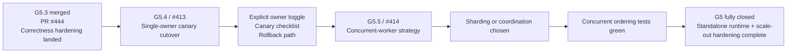

# G5 - AI Execution Tracker

Operational tracker for AI-assisted execution of the remaining `G5` work.

## Authority Rule

- Canonical spec: [G5 - Outbox Worker Consolidated Plan](G5-OUTBOX-WORKER-CONSOLIDATED-PLAN.md)
- Active status doc: [DVT+ - Gap Execution Plans](GAP_EXECUTION_PLANS.md)
- Last completed slice contract: [G5 / US-G5.3 Correctness Hardening Plan](G5-US-G5.3-CORRECTNESS-HARDENING-PLAN.md)

This file is not a second source of truth.

Its job is narrower:

- record the current execution pointer for AI work;
- show what remains in `G5` after `#412`;
- make the next validation lane explicit;
- leave a short execution log.

If this tracker conflicts with the canonical plan, update the canonical plan
first and then sync this tracker.

## Current Pointer

Update this section before any substantial implementation turn.

- `as_of`: `2026-03-10`
- `gap`: `G5`
- `epic`: `#409`
- `current_focus`: `G5.4A / #446 - automated standalone worker canary acceptance test`
- `state`: `In progress`
- `currently_working_on`: `Automated repo-side canary acceptance now exercises passive bootstrap plus active delivery through the production host/runtime composition, with a controlled PostgreSQL-adapter fixture limited to the public outbox methods the runtime actually consumes, deterministic admin-port retry on bind collisions, and #447 CI wiring plus #448 docs alignment still pending`
- `next_after_current`: `G5.4B / #447 - CI lane for automated outbox worker canary validation`
- `blocking_dependencies`: `#410`, `#411`, and `#412` are closed; no remaining GitHub blocker is declared on `#413`
- `last_completed`: `G5.3 / #412 merged via PR #444 on 2026-03-10`

## Remaining G5 Roadmap

- `PR-4 / #413`
  scope: single-owner canary cutover, explicit standalone ownership mode, rollback wiring
  current status: in progress; repo-side ownership contract landed, external canary evidence still pending
  exit signal: one environment runs the standalone worker as sole active owner and rollback is documented/testable
- `PR-5 / #414`
  scope: choose and implement one ADR-0009 concurrent-worker strategy
  current status: pending after PR-4
  exit signal: concurrent workers cannot reorder events for the same `runId` and horizontal scale-out is no longer blocked

## Execution Protocol For AI

1. Before code changes, update [Current Pointer](#current-pointer).
2. If scope or acceptance changes, update [G5 - Outbox Worker Consolidated Plan](G5-OUTBOX-WORKER-CONSOLIDATED-PLAN.md) first, then update this tracker.
3. Keep the current stage tied to one GitHub issue at a time.
4. Record the touched-files plan before implementation for the active stage.
5. After each validation batch, append an execution-log entry with exact commands and pass/fail state.
6. When a stage closes, sync this tracker, [GAP_EXECUTION_PLANS.md](GAP_EXECUTION_PLANS.md), and any affected runbook/deployment docs in the same change.

## Stage Detail

### PR-4 / G5.4 - Canary cutover and rollback wiring

Goal:
make ownership of outbox delivery explicit in one environment and prove that the
standalone worker can be enabled and rolled back without ambiguous dual-active
behavior.

Working checklist:

- [x] think-first note written for `#413`
- [x] pre-implementation brief written for `#413`
- [x] current ownership path identified in code and runtime/deployment docs
- [x] environment-scoped worker enablement surface identified
- [x] canary ownership surface identified without inventing a nonexistent embedded owner path
- [x] canary checklist written
- [x] rollback instructions written
- [x] implementation and docs updated
- [x] validation commands run and reported
- [x] repo-side negative host-path coverage complete
- [ ] external canary evidence captured for one environment
- [ ] rollback evidence captured against the real deployment wiring
- [ ] status docs synced after closure

Short canary evidence checklist:

- [ ] environment name and rollout window recorded
- [ ] `DVT_OUTBOX_OWNERSHIP_MODE=active` applied only to the chosen standalone worker
- [ ] no second active outbox publisher path observed during the same window
- [ ] `/readyz` returned `200` during the canary
- [ ] `dvt_outbox_delivered_records_total` increased after enqueueing a test event
- [ ] `dvt_outbox_runtime_errors_total` stayed flat during the observation window
- [ ] rollback step and post-rollback state captured if rollback is exercised

Expected touched-system candidates:

- `apps/outbox-worker/src/**`
- `apps/outbox-worker/README.md`
- `docs/runbooks/outbox-worker-g5.md`
- deployment/runtime wiring under `apps/api` only if the current owner path still lives there
- status/planning docs for `G5`

Primary validation lane:

- `pnpm --filter dvt-outbox-worker typecheck`
- `pnpm --filter dvt-outbox-worker build`
- `pnpm --filter dvt-outbox-worker test`
- any additional canary-toggle validation command added by the implementation

Current think-first analysis:

- problem summary: the repository already has a standalone worker, but the
  ownership of that worker is not yet explicit at host start-up; a deployment
  can still treat process start as implicit ownership
- constraints and invariants:
  - do not move ownership policy into `@dvt/engine`
  - do not invent a second embedded owner path in `apps/api` that does not
    really exist
  - keep readiness `false` whenever the process is non-owning
  - keep one active owner only
- options considered:
  - boolean enable flag with fail-fast startup
  - host-level ownership mode with `active|passive`
  - runtime-level ownership branching
- selected option and rationale:
  - use host-level ownership mode with `active|passive`
  - rationale: it keeps ownership in the standalone host boundary, preserves the
    reusable runtime/core, supports canary plus rollback, and avoids hidden
    dual-active ambiguity
- rejected alternatives:
  - runtime-level branching was rejected because ownership is a host concern,
    not an engine concern
  - a fake "old embedded owner" implementation was rejected because that would
    create a synthetic path not present in the repo

Current pre-implementation brief:

- scope:
  - parse explicit ownership mode from worker env
  - surface passive ownership in runtime health/metrics
  - allow passive startup without runtime polling ownership
  - document canary and rollback semantics around that mode
- touched files or paths:
  - `apps/outbox-worker/src/host/runOutboxWorkerHost.ts`
  - `apps/outbox-worker/src/server.ts`
  - `apps/outbox-worker/src/plugins/env.ts`
  - `apps/outbox-worker/src/ops/OutboxWorkerMonitor.ts`
  - `apps/outbox-worker/src/lifecycle/stopRuntimeAndOperationalServer.ts`
  - `apps/outbox-worker/src/runtime/createOutboxWorkerRuntime.ts`
  - `apps/outbox-worker/test/host/runOutboxWorkerHost.test.ts`
  - `apps/outbox-worker/test/plugins/env.test.ts`
  - `apps/outbox-worker/test/ops/OperationalServer.test.ts`
  - `apps/outbox-worker/test/ops/OutboxWorkerMonitor.test.ts`
  - `apps/outbox-worker/test/lifecycle/stopRuntimeAndOperationalServer.test.ts`
  - `apps/outbox-worker/test/runtime/createOutboxWorkerRuntime.test.ts`
  - `apps/outbox-worker/README.md`
  - `docs/runbooks/outbox-worker-g5.md`
- expected outcome:
  - one explicit env-controlled owner mode for the standalone worker
  - passive mode remains observable but never owns polling
  - rollback can disable ownership without introducing a second owner
- risks and mitigations:
  - risk: passive mode looks healthy when it should not be ready
  - mitigation: `ready=false` in passive mode, explicit metrics state, and
    runbook language aligned with owner semantics
  - risk: host logic starts bleeding into engine/runtime contracts
  - mitigation: keep ownership branching at `apps/outbox-worker` boundary only
- validation plan:
  - `pnpm --filter dvt-outbox-worker test`
  - `pnpm --filter dvt-outbox-worker typecheck`
  - `pnpm --filter dvt-outbox-worker build`
  - `pnpm lint:md`
  - `pnpm docs:quality:check`
  - `pnpm docs:canonical:check`

### Active substep / G5.4A - #446 automated repo-side canary acceptance

Think-first analysis:

- problem summary: `#413` still needs canary evidence, but the repository lacked
  an executable acceptance that proves `passive -> active -> stop` through the
  standalone worker without manual steps
- constraints and invariants:
  - keep the canary automation inside `apps/outbox-worker`
  - use the production host/runtime composition rather than a separate runtime
    harness
  - do not require a real PostgreSQL service for the default local test lane
  - do not invent a fake second owner path or browser automation
- options considered:
  - keep the first acceptance harness with a custom runtime factory
  - require a real PostgreSQL service in the worker test lane
  - patch the PostgreSQL adapter boundary in test while keeping
    `createOutboxWorkerRuntime()` and `runOutboxWorkerHost()` real
- selected option and rationale:
  - patch the PostgreSQL adapter boundary only inside the test
  - rationale: this preserves the production host/runtime composition, keeps the
    test deterministic, and avoids adding environment-coupled infrastructure to
    the default worker lane
- rejected alternatives:
  - the custom runtime factory was rejected because it bypassed the active-mode
    assembly that `#446` is supposed to exercise
  - a mandatory real PostgreSQL dependency was rejected because the repository
    does not provide an auto-started database for `dvt-outbox-worker test`

Pre-implementation brief:

- scope:
  - cover `passive` bootstrap probes
  - cover `active` delivery through `runOutboxWorkerHost()` with the default
    `createOutboxWorkerRuntime()`
  - use a controlled PostgreSQL-adapter fixture to enqueue pending records
  - keep stop semantics observable at the end of the same automated flow
- touched files or paths:
  - `apps/outbox-worker/test/canary/standaloneCanaryAcceptance.test.ts`
  - `docs/planning/gaps/G5-AI-EXECUTION-TRACKER.md`
  - `docs/planning/status/generated-code-state.md`
- expected outcome:
  - repo-side canary acceptance proves passive probes, active readiness, active
    delivery, downstream rejection observability, metrics transitions, and stop
    semantics through the production host/runtime composition
  - validation evidence no longer overclaims `docs:status:check`
- risks and mitigations:
  - risk: the canary harness drifts from production composition
  - mitigation: keep `runOutboxWorkerHost()` and `createOutboxWorkerRuntime()`
    real and confine the fake behavior to patched adapter methods inside the
    test
  - risk: acceptance starts depending on private adapter fields or a port
    reservation race that flakes in CI
  - mitigation: keep the fixture keyed to public adapter methods only and use a
    retrying candidate-port binder instead of reserve-then-rebind
  - risk: generated status drift is reported as green when it is not
  - mitigation: record `docs:status:generate` during in-progress work and only
    claim `docs:status:check` once the generated file is staged/committed with
    the slice
- validation plan:
  - `pnpm exec eslint apps/outbox-worker/test/canary/standaloneCanaryAcceptance.test.ts --max-warnings 0`
  - `pnpm --filter dvt-outbox-worker typecheck`
  - `pnpm --filter dvt-outbox-worker build`
  - `pnpm --filter dvt-outbox-worker test`
  - `pnpm lint:md`
  - `pnpm docs:canonical:check`
  - `pnpm docs:status:check`

### PR-5 / G5.5 - Multi-worker strategy before horizontal scale-out

Goal:
close the remaining scale-out risk by implementing exactly one concurrency
strategy that preserves per-`runId` order across more than one worker instance.

Working checklist:

- [ ] strategy chosen: `runId` sharding or locking/coordination
- [ ] strategy documented in code and deployment config
- [ ] concurrent-worker tests added
- [ ] horizontal scale-out remains blocked until tests pass
- [ ] status docs synced after closure

Primary validation lane:

- `pnpm test:engine`
- `pnpm --filter dvt-outbox-worker test`
- `pnpm test:adapter-postgres`
- any new concurrency-specific validation command added by the chosen strategy

## Mermaid State Map

## Execution Log

- `2026-03-10` `G5.3 / #412` `done`
  summary: merged via PR `#444`; correctness hardening landed in engine, runtime, PostgreSQL adapter, and planning docs
  validation: `pnpm test:engine`; `pnpm --filter dvt-outbox-worker test`; `pnpm --filter dvt-outbox-worker typecheck`; `pnpm --filter dvt-outbox-worker build`; `pnpm test:adapter-postgres`; `pnpm verify:prepush`; `pnpm docs:ci`
- `2026-03-10` `G5.4 / #413` `ready to start`
  summary: tracker created to drive the next G5 stage from the canonical plan
  validation: `pnpm lint:md`; `pnpm docs:quality:check`; `pnpm docs:canonical:check`
- `2026-03-10` `G5.4 / #413` `in progress`
  summary: selected host-level `active/passive` ownership mode as the clean seam for canary and rollback
  validation: repo inspection of `apps/outbox-worker`, `apps/api`, runbook, and issue state
- `2026-03-10` `G5.4 / #413` `in progress`
  summary: implemented explicit ownership mode in the standalone host and aligned passive health/readiness semantics
  validation: `pnpm --filter dvt-outbox-worker test`; `pnpm --filter dvt-outbox-worker typecheck`; `pnpm --filter dvt-outbox-worker build`; `pnpm lint:md`; `pnpm docs:quality:check`; `pnpm docs:canonical:check`
- `2026-03-10` `G5.4 / #413` `in progress`
  summary: corrected the ownership contract after QA review: ownership mode is explicit, passive bootstrap is decoupled from runtime-only config, and host boot-path tests now cover active vs passive startup
  validation: `pnpm --filter dvt-outbox-worker typecheck`; `pnpm --filter dvt-outbox-worker test`; `pnpm --filter dvt-outbox-worker build`; `pnpm exec eslint apps/outbox-worker/src/server.ts apps/outbox-worker/src/plugins/env.ts apps/outbox-worker/src/runtime/createOutboxWorkerRuntime.ts apps/outbox-worker/src/host/runOutboxWorkerHost.ts apps/outbox-worker/test/plugins/env.test.ts apps/outbox-worker/test/runtime/createOutboxWorkerRuntime.test.ts apps/outbox-worker/test/host/runOutboxWorkerHost.test.ts --max-warnings 0`; `pnpm lint:md`; `pnpm docs:quality:check`; `pnpm docs:canonical:check`
- `2026-03-10` `G5.4 / #413` `in progress`
  summary: added negative host-path coverage for bootstrap/runtime failures, normalized cleanup error reporting, and corrected tracker wording so repo-side progress does not masquerade as canary completion
  validation: `pnpm --filter dvt-outbox-worker typecheck`; `pnpm --filter dvt-outbox-worker test`; `pnpm --filter dvt-outbox-worker build`; `pnpm exec eslint apps/outbox-worker/src/lifecycle/stopRuntimeAndOperationalServer.ts apps/outbox-worker/test/lifecycle/stopRuntimeAndOperationalServer.test.ts apps/outbox-worker/test/host/runOutboxWorkerHost.test.ts --max-warnings 0`; `pnpm lint:md`; `pnpm docs:canonical:check`
- `2026-03-10` `G5.4 / #413` `in progress`
  summary: removed the fictitious “old embedded owner” wording from PR-4 governance surfaces and replaced it with a concrete canary evidence checklist tied to the standalone worker as sole active owner
  validation: `pnpm lint:md`; `pnpm docs:canonical:check`
- `2026-03-10` `G5.4A / #446` `in progress`
  summary: added a fully automated repo-side canary acceptance test that exercises passive bootstrap and active delivery through the production host/runtime composition, with a controlled PostgreSQL-adapter fixture providing deterministic pending outbox records
  validation: `pnpm exec eslint apps/outbox-worker/test/canary/standaloneCanaryAcceptance.test.ts --max-warnings 0`; `pnpm --filter dvt-outbox-worker typecheck`; `pnpm --filter dvt-outbox-worker build`; `pnpm --filter dvt-outbox-worker test`; `pnpm lint:md`; `pnpm docs:canonical:check`; `pnpm docs:status:generate`
- `2026-03-10` `G5.4A / #446` `in progress`
  summary: simplified the canary fixture to seed pending records without patching the adapter write path, removed the admin-port reserve/rebind race, and integrated the generated status file so the documentation gate is now executable for this slice
  validation: `pnpm exec eslint apps/outbox-worker/test/canary/standaloneCanaryAcceptance.test.ts --max-warnings 0`; `pnpm --filter dvt-outbox-worker typecheck`; `pnpm --filter dvt-outbox-worker build`; `pnpm --filter dvt-outbox-worker test`; `pnpm lint:md`; `pnpm docs:canonical:check`; `pnpm docs:status:check`
- `2026-03-11` `G5.4A / #446` `in progress`
  summary: extended the automated canary acceptance with a downstream-rejection path that proves the standalone worker surfaces failing readiness plus retry metrics without claiming a runtime-loop error
  validation: `pnpm exec eslint apps/outbox-worker/test/canary/standaloneCanaryAcceptance.test.ts --max-warnings 0`; `pnpm --filter dvt-outbox-worker test`
