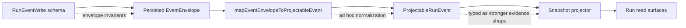

# Contract mapper event boundary study

## Summary

This proposal opens a dedicated study slice for the relationship between the
write-side event contract, the domain mapper, and the projected read-model
evidence shape.

The immediate trigger is small but structurally important:

- `StepFailed` evidence is typed as `RunFailureEvidence`
- the mapper currently performs partial normalization
- the contract and mapper do not enforce exactly the same invariants

That seam is not a one-off bug. It is a boundary-ownership problem.

## Governing Sources

- [ADR-0004](../../adr/ADR-0004-event-sourcing-strategy.md)
- [ADR-0005](../../adr/ADR-0005-contract-formalization-tooling.md)
- [ADR-0006](../../adr/ADR-0006-contract-tooling-governance.md)
- [Run Events Contract v1](../../architecture/components/engine/contracts/engine/RunEvents.v1.md)
- [TF-C2-B read-surface evidence closeout](../closeouts/20260408-tf-c2-b-read-surface-evidence-closeout.md)
- [TF-C2-B runtime read-surface evidence](../../evidence/ED-20260408-tf-c2-b-read-surface-evidence.md)
- [IRunStateStore.v1.ts](../../../packages/@dvt/contracts/src/engine/IRunStateStore.v1.ts)
- [applyRunEvent.ts](../../../packages/@dvt/run-domain/src/applyRunEvent.ts)
- [mapEventEnvelopeToProjectableEvent.ts](../../../packages/@dvt/run-domain/src/mapEventEnvelopeToProjectableEvent.ts)

## Problem Statement

Today the same semantic claim can be expressed at three different layers:

1. the event envelope contract
2. the mapper that converts event envelopes into projectable run events
3. the read-model evidence contract consumed by projectors and callers

The ownership line is blurred.

### Concrete mismatch now

| Field / rule              | Event write/read side now            | Mapper now                                       | Evidence contract now                                        | Effect                                                                |
| ------------------------- | ------------------------------------ | ------------------------------------------------ | ------------------------------------------------------------ | --------------------------------------------------------------------- |
| `stepId` on step events   | `z.string().min(1)` in event schemas | `requireStepId()` accepts `length > 0`           | `RunFailureEvidenceSchema.stepId` is non-blank               | whitespace-only values are possible upstream of the evidence contract |
| `emittedAt`               | `z.string().min(1)`                  | forwarded unchanged                              | `failedAt` falls back to `emittedAt`                         | mapper fallback can preserve a weak timestamp invariant               |
| `reason` / `message`      | payload is loosely shaped            | `asNonBlankString()` trims away blank strings    | `RunFailureEvidenceSchema` allows optional non-blank strings | mapper owns normalization here, not the write boundary                |
| failure evidence validity | no canonical per-field owner         | mapper may normalize but does not fully validate | projector receives `RunFailureEvidence` type                 | type strength and runtime guarantees can drift apart                  |

## Current Flow

## Repository-Grounded Rationale

The rationale for the next slice is not "be stricter because it feels cleaner".

It is this:

the persisted event boundary must own the invariants that the projector is
allowed to trust, because the mapper was introduced to normalize shape for
projection, not to repair invalid write-side facts.

That is already the architectural intent of the current slice:

- `mapEventEnvelopeToProjectableEvent.ts` says raw envelopes are normalized into
  projector-specific events and that contracts remain the source of validation
  truth
- the TF-C2-B closeout records the mapper-first split as a way to keep payload
  parsing and evidence extraction out of the projector, not as a second hidden
  contract authority
- `applyRunEvent.ts` explicitly frames the split as mapper for normalization and
  projector for deterministic mutation

## Root Cause

The codebase is mixing three responsibilities that should be assigned once:

1. **admission validation**: what the append boundary is allowed to persist
2. **normalization / translation**: how raw persisted envelopes become
   projector-friendly domain events
3. **consumer contract**: what downstream read models may rely on as already
   canonical

When those roles are not explicit, two bad outcomes appear:

- duplicated validation that does not repair anything
- strong TypeScript types that overstate real runtime guarantees

## Core Rule For This Study

Use one rule to answer the boundary questions:

if the projector mutates canonical read state from a field without revalidation,
that field's semantic validity belongs to the append boundary, not to the
mapper.

This rule fits the current repository because:

- contracts are declared as validation truth, not mappers
- the mapper exists to remove payload inspection from projector logic, not to
  become a second validator authority
- the projector consumes mapped evidence as trusted input and writes it directly
  into snapshot state
- the shared evidence schemas are already stricter than some write-side event
  schemas, which proves the drift exists today

## Why The Mapper Is Not The Admission Seam

Today the mapper does more than structural translation:

- `requireStepId()` accepts any string with `length > 0`, so whitespace-only
  `stepId` passes there
- `readFailureEvidence()` trims `reason` and `message`
- `readFailureEvidence()` derives `failedAt` from `emittedAt` when it is absent

That means the mapper is already partially repairing weak write-side data.

But the repository's own stated intent is that contracts remain the source of
validation truth while the mapper keeps projection code clean. If mapper policy
starts deciding semantic validity, ownership drifts away from the append
boundary.

## Why `StepFailed.failure` Must Be Treated As Strong

`ProjectableStepFailedEvent` carries:

- `failure: RunFailureEvidence`

not a weaker intermediate shape.

Then `applyRunEvent()` stores that failure directly into snapshot execution
evidence without revalidation.

So the current code already behaves as if:

- mapper output is trustworthy enough for projector mutation
- projector consumers can rely on `RunFailureEvidence`

That leaves only two coherent choices:

1. the append boundary guarantees those invariants
2. the mapper output type becomes weaker

Given the current development posture, the cleaner answer is to strengthen the
boundary and keep the mapper simple.

## Why The Contracts Already Point In That Direction

The contracts package already contains the stronger semantics the runtime read
surface expects:

- `NonBlankStringSchema` rejects whitespace-only strings
- `RunFailureEvidenceSchema` already uses the stronger rule for `stepId`,
  optional `reason`, and optional `message`

But the write-side event schemas still allow weaker equivalents in key places:

- `StepFailedEventWriteSchema.stepId` is `z.string().min(1)` rather than
  `NonBlankStringSchema`
- `RunEventCommonSchema.emittedAt` is only `z.string().min(1)`
- `StepFailedPayloadSchema` does not emit `failedAt` today

So the repository already shows the mismatch clearly: the downstream evidence
contract is stronger than the upstream event admission contract.

## No-History Implication

This repository is not carrying historical invalid-event compatibility as a
requirement for this slice.

That changes the option calculus:

- we do not need tolerant reprojection of old invalid events
- we do not need lenient transition handling for legacy snapshots
- we do not need a dual-shape compatibility model just to keep old bad data
  alive

With no historical compatibility pressure, fail-closed at the append boundary
is the more coherent choice.

## Boundary Questions To Decide

1. Which invariants must be enforced before an event can exist in the log?
2. Which transformations are legitimate mapper concerns, and which are hidden
   write-boundary validation in disguise?
3. Should projectable domain events reuse the read-model contract types
   directly, or should they have their own weaker intermediate shape?
4. Should timestamp fields at this seam be validated as ISO UTC at the
   append boundary only, or also rechecked in mapper translation?
5. Is blank-string normalization a contract concern or a mapper concern?

## Field Ownership Recommendation

| Concern                                           | Recommended owner                        | Rationale                                                                                                                                                     |
| ------------------------------------------------- | ---------------------------------------- | ------------------------------------------------------------------------------------------------------------------------------------------------------------- |
| `stepId`                                          | append boundary                          | step events are identity-bearing facts; projector mutation and step indexing should never depend on later repair                                              |
| `emittedAt` minimum validity                      | append boundary                          | projector transitions use `emittedAt` as deterministic time for state mutation                                                                                |
| `reason` / `message` non-blank semantics          | prefer append boundary                   | the shared evidence contract already treats these as non-blank when present                                                                                   |
| `failedAt`                                        | mapper derivation is acceptable          | current `StepFailed` payload does not emit `failedAt`, so deriving it from accepted `emittedAt` is deterministic projection logic rather than semantic repair |
| `RunFailureEvidence` strength promised downstream | contract package after boundary decision | projectors and read surfaces should consume a shape whose guarantees match reality                                                                            |

## Options

### Option A: Boundary-authoritative invariants, simple mapper

- strengthen the append boundary so persisted step events already satisfy the
  invariants needed by projection
- keep the mapper structural and unsurprising
- allow mapper derivation only for deterministic convenience fields such as
  `failedAt`
- make projectable events depend on already-valid event data

Pros:

- aligns with ADR-0004 append authority
- minimizes hidden normalization
- makes mapper logic easier to reason about and test
- matches the repository's existing claim that contracts are the source of
  validation truth

Cons:

- may require wider contract tightening and adapter test updates

### Option B: Mapper-authoritative normalization

- allow a wider event envelope shape
- make the mapper canonicalize into stricter projectable/read evidence

Pros:

- smaller write-boundary blast radius
- allows tolerant ingestion when upstream emitters are weak

Cons:

- hides semantic repair in the read path
- duplicates contract logic outside the contract package
- makes projector behavior depend on mapper-specific policy
- conflicts with the mapper-first rationale already documented for TF-C2-B

### Option C: Dual validation

- validate at the write boundary
- validate again in the mapper

Pros:

- catches accidental drift

Cons:

- easy to turn into redundant ceremony
- unclear which layer owns fallback behavior
- under the current no-history posture, it adds more overlap than value

## Recommended Direction For The Next Slice

Default working hypothesis: **Option A**.

The rationale is repository-specific:

- if the projector consumes a field as trusted input, the append boundary should
  own its semantic validity
- the mapper should remain a translation seam, not an admission seam
- `failedAt` may still be mapper-derived from `emittedAt` because that is
  deterministic derivation from an already accepted boundary fact, not hidden
  repair

The study slice should prove or reject this with a narrow field-level ownership
matrix before any code change:

- `stepId` non-blank semantics:
  verify as an event schema / append-boundary concern because step identity
  should not be repaired later.
- `emittedAt` minimum validity:
  verify as an event schema / append-boundary concern because projector
  transitions treat time as a boundary fact.
- `reason` / `message` non-blank semantics:
  verify as an append-boundary concern unless we explicitly choose to weaken the
  downstream evidence contract.
- `failedAt` derivation from payload vs envelope:
  keep as mapper-owned only if it remains a deterministic derivation from
  accepted envelope time.
- `RunFailureEvidence` strength promised to projectors:
  settle in the contract package after the field-ownership decision is made.

## Proposed Follow-up Slice

### Study output

Produce one short decision package that answers:

1. which fields are append-boundary invariants
2. which fields are mapper-derived
3. whether `ProjectableRunEvent` should keep using `RunFailureEvidence`
4. what negative-path tests must exist at each layer

### Likely touched files in the implementation slice

- `packages/@dvt/contracts/src/schemas.ts`
- `packages/@dvt/contracts/src/types/contracts.ts`
- `packages/@dvt/contracts/src/engine/IRunStateStore.v1.ts`
- `packages/@dvt/run-domain/src/mapEventEnvelopeToProjectableEvent.ts`
- write-boundary tests in contracts / engine / adapter layers

## Out Of Scope

- provider-ref modeling
- snapshot schema versioning
- read-surface API redesign unrelated to event-to-projector translation
- non-failure evidence fields outside the ownership matrix unless needed for
  consistency

## Exit Criteria

The follow-up slice is ready to start when this study yields:

1. one field-by-field ownership matrix
2. one explicit recommendation on Option A vs B vs C
3. one concrete implementation sequence
4. one validation matrix covering boundary, mapper, and projector tests
