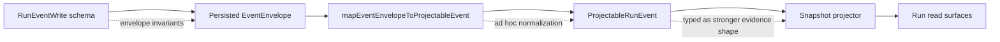

# Contract mapper event boundary study

## Summary

This proposal opens a dedicated study slice for the relationship between the
write-side event contract, the domain mapper, and the projected read-model
evidence shape.

The immediate trigger is small but structurally important:

- `StepFailed` evidence is typed as `RunFailureEvidence`
- the mapper currently performs partial normalization
- the contract and mapper do not enforce exactly the same invariants

That seam is not a one-off bug. It is a boundary-ownership problem.

## Governing Sources

- [ADR-0004](../../adr/ADR-0004-event-sourcing-strategy.md)
- [ADR-0005](../../adr/ADR-0005-contract-formalization-tooling.md)
- [ADR-0006](../../adr/ADR-0006-contract-tooling-governance.md)
- [Run Events Contract v1](../../architecture/components/engine/contracts/engine/RunEvents.v1.md)
- [IRunStateStore.v1.ts](../../../packages/@dvt/contracts/src/engine/IRunStateStore.v1.ts)
- [mapEventEnvelopeToProjectableEvent.ts](../../../packages/@dvt/run-domain/src/mapEventEnvelopeToProjectableEvent.ts)

## Problem Statement

Today the same semantic claim can be expressed at three different layers:

1. the event envelope contract
2. the mapper that converts event envelopes into projectable run events
3. the read-model evidence contract consumed by projectors and callers

The ownership line is blurred.

### Concrete mismatch now

| Field / rule              | Event write/read side now            | Mapper now                                       | Evidence contract now                                        | Effect                                                                |
| ------------------------- | ------------------------------------ | ------------------------------------------------ | ------------------------------------------------------------ | --------------------------------------------------------------------- |
| `stepId` on step events   | `z.string().min(1)` in event schemas | `requireStepId()` accepts `length > 0`           | `RunFailureEvidenceSchema.stepId` is non-blank               | whitespace-only values are possible upstream of the evidence contract |
| `emittedAt`               | `z.string().min(1)`                  | forwarded unchanged                              | `failedAt` falls back to `emittedAt`                         | mapper fallback can preserve a weak timestamp invariant               |
| `reason` / `message`      | payload is loosely shaped            | `asNonBlankString()` trims away blank strings    | `RunFailureEvidenceSchema` allows optional non-blank strings | mapper owns normalization here, not the write boundary                |
| failure evidence validity | no canonical per-field owner         | mapper may normalize but does not fully validate | projector receives `RunFailureEvidence` type                 | type strength and runtime guarantees can drift apart                  |

## Current Flow

## Root Cause

The codebase is mixing three responsibilities that should be assigned once:

1. **admission validation**: what the append boundary is allowed to persist
2. **normalization / translation**: how raw persisted envelopes become
   projector-friendly domain events
3. **consumer contract**: what downstream read models may rely on as already
   canonical

When those roles are not explicit, two bad outcomes appear:

- duplicated validation that does not repair anything
- strong TypeScript types that overstate real runtime guarantees

## Boundary Questions To Decide

1. Which invariants must be enforced before an event can exist in the log?
2. Which transformations are legitimate mapper concerns, and which are hidden
   write-boundary validation in disguise?
3. Should projectable domain events reuse the read-model contract types
   directly, or should they have their own weaker intermediate shape?
4. Should timestamp fields at this seam be validated as ISO UTC at the
   append boundary only, or also rechecked in mapper translation?
5. Is blank-string normalization a contract concern or a mapper concern?

## Options

### Option A: Boundary-authoritative invariants, simple mapper

- strengthen the append boundary so persisted step events already satisfy the
  invariants needed by projection
- keep the mapper structural and unsurprising
- make projectable events depend on already-valid event data

Pros:

- aligns with ADR-0004 append authority
- minimizes hidden normalization
- makes mapper logic easier to reason about and test

Cons:

- may require wider contract tightening and adapter test updates

### Option B: Mapper-authoritative normalization

- allow a wider event envelope shape
- make the mapper canonicalize into stricter projectable/read evidence

Pros:

- smaller write-boundary blast radius
- allows tolerant ingestion when upstream emitters are weak

Cons:

- hides semantic repair in the read path
- duplicates contract logic outside the contract package
- makes projector behavior depend on mapper-specific policy

### Option C: Dual validation

- validate at the write boundary
- validate again in the mapper

Pros:

- catches accidental drift

Cons:

- easy to turn into redundant ceremony
- unclear which layer owns fallback behavior

## Recommended Direction For The Next Slice

Default working hypothesis: **Option A**.

The study slice should try to prove or reject this with a narrow field-level
ownership matrix before any code change:

| Concern                                           | Preferred owner to verify                    | Why                                                                              |
| ------------------------------------------------- | -------------------------------------------- | -------------------------------------------------------------------------------- |
| `stepId` non-blank semantics                      | event schema / append boundary               | step event identity should not be repaired later                                 |
| `emittedAt` minimum validity                      | event schema / append boundary               | persisted envelope timestamps are boundary facts                                 |
| `reason` / `message` blank trimming               | needs explicit decision                      | could be boundary normalization or rejected input                                |
| `failedAt` derivation from payload vs envelope    | mapper, but only as deterministic derivation | derived read evidence may legitimately reuse envelope time when payload omits it |
| `RunFailureEvidence` shape promised to projectors | contract package after owner decisions       | downstream contract must reflect real guarantees                                 |

## Proposed Follow-up Slice

### Study output

Produce one short decision package that answers:

1. which fields are append-boundary invariants
2. which fields are mapper-derived
3. whether `ProjectableRunEvent` should keep using `RunFailureEvidence`
4. what negative-path tests must exist at each layer

### Likely touched files in the implementation slice

- `packages/@dvt/contracts/src/schemas.ts`
- `packages/@dvt/contracts/src/types/contracts.ts`
- `packages/@dvt/contracts/src/engine/IRunStateStore.v1.ts`
- `packages/@dvt/run-domain/src/mapEventEnvelopeToProjectableEvent.ts`
- write-boundary tests in contracts / engine / adapter layers

## Out Of Scope

- provider-ref modeling
- snapshot schema versioning
- read-surface API redesign unrelated to event-to-projector translation
- non-failure evidence fields outside the ownership matrix unless needed for
  consistency

## Exit Criteria

The follow-up slice is ready to start when this study yields:

1. one field-by-field ownership matrix
2. one explicit recommendation on Option A vs B vs C
3. one concrete implementation sequence
4. one validation matrix covering boundary, mapper, and projector tests
