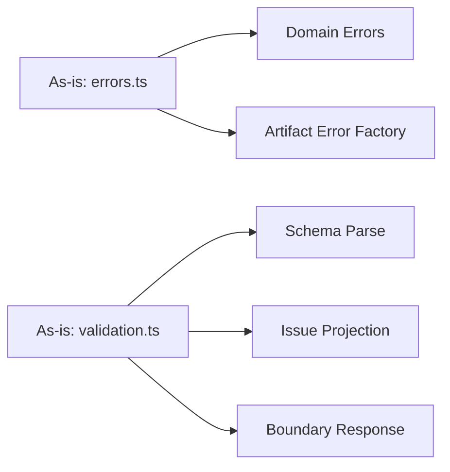
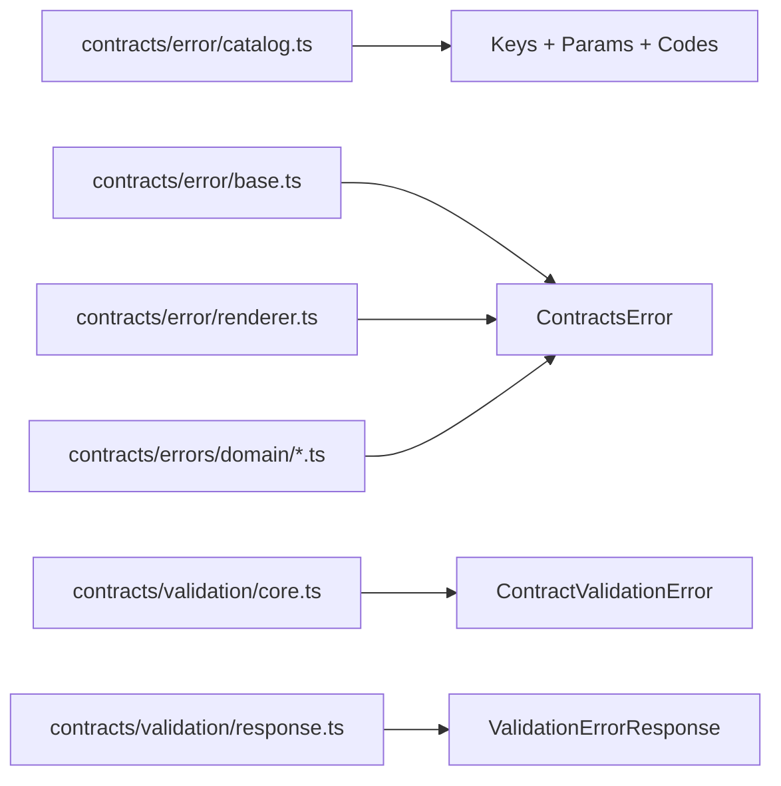

# Contracts error boundary SRP refactor plan

## Summary

The structured metadata rollout from ADR-0044 is directionally correct, but the
current implementation still concentrates unrelated responsibilities in
`@dvt/contracts` error and validation modules.

This plan defines the next slice: split error catalog, rendering, domain error
types, and boundary serialization into explicit modules with single
responsibility and typed ownership.

No compatibility shim is planned. This is a clean internal cutover aligned with
the existing breaking rollout policy for semantic error contracts.

## Governing Sources

- [ADR-0018](../../adr/ADR-0018_Shared_Kernel_Ownership_Governance.md)
- [ADR-0034](../../adr/ADR-0034-bounded-context-boundaries-and-communication-rules.md)
- [ADR-0039](../../adr/ADR-0039-hexagonal-port-hardening-and-solid-remediation.md)
- [ADR-0041](../../adr/ADR-0041-global-domain-state-model-and-boundary-contracts.md)
- [ADR-0044](../../adr/ADR-0044-structured-contracts-error-metadata.md)

## Problem Statement

The current `@dvt/contracts` package still has SRP drift:

1. `errors.ts` mixes domain error declarations and artifact error factory logic.
2. `errorContract.ts` mixes message catalogs, rendering, base class semantics,
   and mapping helpers.
3. `validation.ts` mixes parsing, issue projection, and HTTP-style boundary
   response shaping.

This increases coupling and makes consumers import broad modules for narrow
tasks.

## Objectives

1. Enforce single responsibility per module.
2. Keep semantic contract in `code/messageKey/messageParams`.
3. Isolate boundary transport shape from validation core logic.
4. Remove message-based assertions and branching in direct consumers.
5. Keep public behavior consistent while reducing module coupling.

## Non-goals

1. No i18n or localization runtime in this slice.
2. No new domain features.
3. No migration of planner or engine ownership boundaries.
4. No message text normalization across all historical errors.

## As-is vs Target

## Implementation Plan

### CE-SRP-1: Split error catalog from error base

Create:

- `packages/@dvt/contracts/src/error/catalog.ts`
- `packages/@dvt/contracts/src/error/renderer.ts`
- `packages/@dvt/contracts/src/error/base.ts`

Rules:

- Catalog exports only constants/types.
- Renderer maps metadata to human diagnostic text.
- Base class carries metadata and delegates rendering.

### CE-SRP-2: Isolate domain error types

Create domain-focused files:

- `packages/@dvt/contracts/src/errors/authorizationErrors.ts`
- `packages/@dvt/contracts/src/errors/intentErrors.ts`
- `packages/@dvt/contracts/src/errors/storeErrors.ts`
- `packages/@dvt/contracts/src/errors/artifactErrors.ts`

Rules:

- No cross-domain factory logic in generic files.
- Artifact integrity helper stays in `artifactErrors.ts`.

### CE-SRP-3: Split validation core and boundary serialization

Split `validation.ts` into:

- `packages/@dvt/contracts/src/validation/core.ts`
- `packages/@dvt/contracts/src/validation/response.ts`

Rules:

- `core.ts`: schema validation and typed issue mapping only.
- `response.ts`: structured boundary envelope mapping only.

### CE-SRP-4: Consumer cutover to typed semantics

Update direct consumers to assert semantics via:

- `instanceof`
- `code`
- `messageKey`
- `messageParams`

Stop assertions on free-form `message` in tests and control flow.

### CE-SRP-5: Exports and docs alignment

- Update `packages/@dvt/contracts/src/index.ts` exports after split.
- Update contracts docs to reflect module boundaries.
- Run `pnpm docs:sync`.

## Acceptance Criteria

1. No file in `@dvt/contracts` mixes catalog + renderer + error classes.
2. No file in `@dvt/contracts` mixes validation core and boundary response
   shaping.
3. Artifact-specific error construction is isolated to artifact error module.
4. Direct consumers do not branch on `Error.message`.
5. Public structured error fields remain unchanged from ADR-0044.

## Validation Baseline

- `pnpm --filter @dvt/contracts test`
- `pnpm --filter @dvt/contracts type-check`
- `pnpm --filter @dvt/contracts lint`
- `pnpm --filter @dvt/engine test`
- `pnpm --filter @dvt/planner test`
- `pnpm docs:sync`
- `pnpm verify:prepush`

## Risks And Mitigations

| Risk                                     | Impact                    | Mitigation                                                             |
| ---------------------------------------- | ------------------------- | ---------------------------------------------------------------------- |
| Export breakage during module split      | Consumer compile failures | Keep an explicit export map and run affected package type-checks       |
| Hidden message-based coupling in tests   | CI regressions            | Run repo search for message assertions and migrate to typed assertions |
| Oversplitting into accidental complexity | Maintenance overhead      | Keep split limited to ownership seams defined in this plan             |

## Definition Of Done

1. CE-SRP-1..5 merged with passing validations.
2. No TODO/FIXME placeholders added.
3. No lint/type/test gates relaxed.
4. Final PR shows SRP split with unchanged semantic contract fields.
