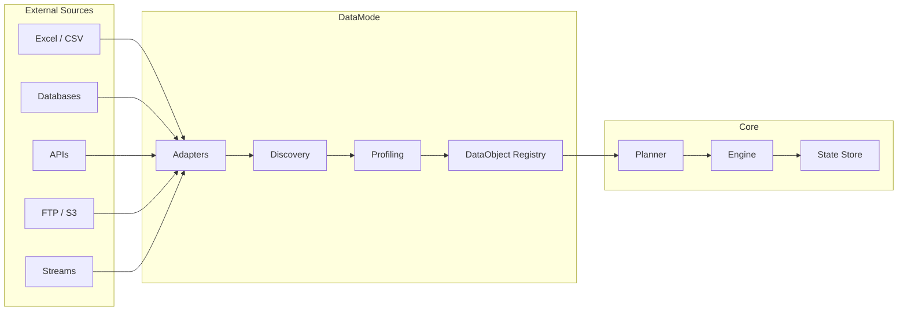
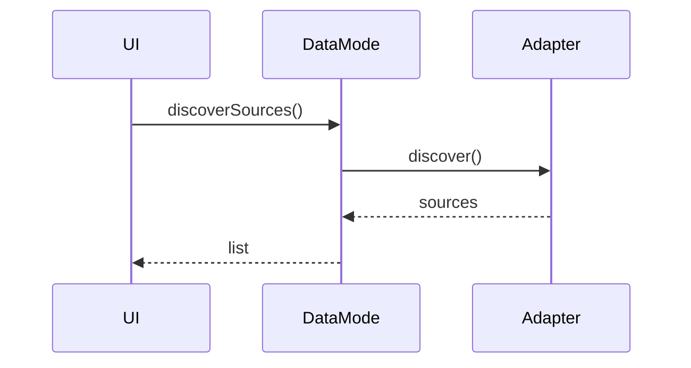
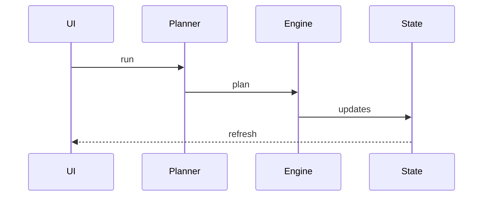

Umm que es esto. dbt?

# DataMode — Source Discovery & DataObject Layer

## 1. Overview

DataMode is an application state in DVT+ responsible for:

- Discovering data sources
- Profiling and normalizing them
- Converting them into DataObjects
- Registering them into the execution graph

It is NOT an ingestion tool.

DataMode transforms external data sources into first-class citizens of the execution graph.

---

## 2. Core Concept

### DataObject

```ts
interface DataObject {
  id: string;
  type: 'table' | 'file' | 'api' | 'stream';
  schema: Column[];
  location: string;
  metadata: {
    size?: number;
    freshness?: number;
    sourceType: string;
  };
}
```

---

## 3. Architecture



---

## 4. Plugin / Adapter Model

```ts
interface ISourceAdapter {
  type: string;

  discover(): Promise<any[]>;

  profile(sourceId: string): Promise<DataObject>;

  toExecutionSteps(dataObject: DataObject): any[];
}
```

---

## 5. Sequence: Discovery



---

## 6. Sequence: Execution



---

## 7. Summary

DataMode is the abstraction layer that:

- Converts sources into graph nodes
- Enables planning
- Integrates with execution
