# DVT+ — Propuesta de cambio UI/DDD: Canvas contextual + Project Assets — V2 validada contra repo

**Estado:** propuesta técnica validada contra `dunay2/dvt`  
**Ámbito:** arquitectura de UI, modelo de dominio, dependencias entre vistas, estados y contratos  
**Producto:** DVT+ / dbt Cloud improved V2  
**Fecha:** 2026-05-03  
**Audiencia:** arquitectura, producto, frontend, backend, plataforma, QA

---

## 0. Resumen ejecutivo

La UI actual expresa `Canvas`, `Lineage`, `Code`, `Diff`, `Artifacts` y `Runs` como menús equivalentes. Esa expresión visual es ambigua porque varias de esas vistas **dependen del contexto activo del Canvas / Graph / Workflow**, no son capabilities globales independientes.

La propuesta es reorganizar la arquitectura de UI en dos niveles:

1. **Project Scope / Registry**  
   Elementos preparados para el proyecto pero todavía no colocados en ningún canvas. Ejemplos: sources definidas, conexiones, plantillas, tipos de nodo, assets importados desde dbt, plugins disponibles.

2. **Workspace / Canvas Context**  
   Graph activo con nodos instanciados, edges, selección activa, layout, código asociado, lineage derivado, runs, artifacts y diff.

El cambio clave es separar estrictamente:

```text
Node Type         = capacidad de crear algo
Project Resource  = asset preparado en el proyecto
Graph Node        = instancia dentro de un canvas
Run Node State    = estado de ejecución de una instancia durante un run
```

Esto mantiene el principio estructural de DVT+:

```text
La UI no ejecuta.
El engine no decide.
El planner no persiste estado.
La UI refleja estado persistido.
```

---

## 1. Decisión propuesta

### 1.1 Nueva jerarquía de navegación

**Antes:**

```text
Sidebar
 ├─ Canvas
 ├─ Lineage
 ├─ Code
 ├─ Diff
 ├─ Artifacts
 └─ Runs
```

**Después:**

```text
Sidebar global
 ├─ Workspaces / Graphs
 ├─ Project Assets
 ├─ Runs globales
 ├─ Observability
 └─ Settings

Workbench activo
 ├─ Graph / Canvas
 ├─ Code
 ├─ Lineage
 ├─ Diff
 ├─ Artifacts
 └─ Runs
```

### 1.2 Regla de dependencia

`Code`, `Lineage`, `Diff`, `Artifacts` y `Runs` deben resolverse desde un `ViewContext`:

```text
ViewContext = tenantId + projectId + environmentId + graphId + gitRef + selection + runId?
```

No deben depender directamente de memoria local del canvas ni de estado efímero del frontend.

---

## 2. Rationale

### 2.1 Problema actual

La UI actual mezcla tres conceptos:

| Concepto            | Ejemplo visible                   | Problema                                            |
| ------------------- | --------------------------------- | --------------------------------------------------- |
| Tipo de nodo        | `Source`, `SQL transform`, `Sink` | Es una capability o plantilla, no una instancia.    |
| Asset preparado     | `Source SALES_RAW`                | Pertenece al proyecto, puede no estar en el canvas. |
| Instancia en canvas | `Source_1`, `Transform_3`         | Tiene posición, edges y participa en planificación. |

Esto genera una dependencia visual incorrecta:

```text
Project Nodes -> Canvas
```

La dependencia correcta es:

```text
NodeTypeRegistry + ProjectAssetRegistry -> CreateNodeCommand -> GraphState -> CanvasRender
```

### 2.2 Riesgos si no se cambia

- Lógica de negocio filtrada en frontend.
- Dificultad para añadir plugins con tipos de nodo propios.
- Ambigüedad entre assets preparados y nodos ejecutables.
- Lineage, code y artifacts pueden leer contextos incorrectos.
- El planner podría recibir modelos mezclados: registry + instancia + estado de ejecución.
- Dificultad para versionar y auditar cambios.

### 2.3 Beneficios del cambio

- UI coherente con modelo state-driven.
- Soporte natural para assets no usados todavía en canvas.
- Preparación para plugins y custom node types.
- Mejor DDD: bounded contexts claros.
- Contratos backend/frontend más limpios.
- Planner recibe un `GraphSnapshot`, no una mezcla de recursos de proyecto.
- Lineage puede operar en dos modos: `canvas` y `project`.

---

## 3. Principios arquitectónicos aplicados

1. **Canvas no es el proyecto.**  
   El canvas es una vista/editable graph sobre un subconjunto del proyecto.

2. **Registry no es canvas.**  
   Un asset preparado puede existir sin posición, edges ni estado de ejecución.

3. **Menú no implica ownership.**  
   Un menú abre una vista. No define quién posee el dato.

4. **La UI refleja ViewModels persistidos.**  
   El canvas renderiza `GraphViewModel`; no calcula realidad del sistema.

5. **El planner sólo planifica instancias.**  
   No planifica todos los assets preparados del proyecto.

6. **Los artifacts de dbt son fuente de verdad para compatibilidad dbt.**  
   `manifest.json`, `run_results.json` y `catalog.json` alimentan metadata, lineage y estado.

7. **Plugins agregan capacidades, no rompen el core.**  
   Un plugin registra tipos de nodo, validadores o paneles mediante contratos.

---

## 4. Glosario operativo

| Término         | Definición                                                         |
| --------------- | ------------------------------------------------------------------ |
| `Workspace`     | Contexto de trabajo activo: tenant, project, env, git ref y graph. |
| `Canvas`        | Vista gráfica editable de un `Graph`.                              |
| `Graph`         | Modelo persistido de nodos instanciados y edges.                   |
| `GraphSnapshot` | Versión inmutable usada por planner o diff.                        |
| `ProjectAsset`  | Elemento preparado en el proyecto; puede no estar en ningún graph. |
| `NodeType`      | Tipo o plantilla de nodo registrable por core o plugin.            |
| `GraphNode`     | Instancia de un `NodeType` dentro de un `Graph`.                   |
| `NodeState`     | Estado runtime de un `GraphNode` durante un `Run`.                 |
| `ViewContext`   | Scope con el que una vista resuelve datos.                         |
| `LineageMode`   | `canvas`, `project` o `run`.                                       |
| `Run`           | Ejecución basada en un `ExecutionPlan`.                            |
| `ExecutionPlan` | Plan versionado producido por el planner y consumido por engine.   |

---

## 5. Arquitectura de información propuesta

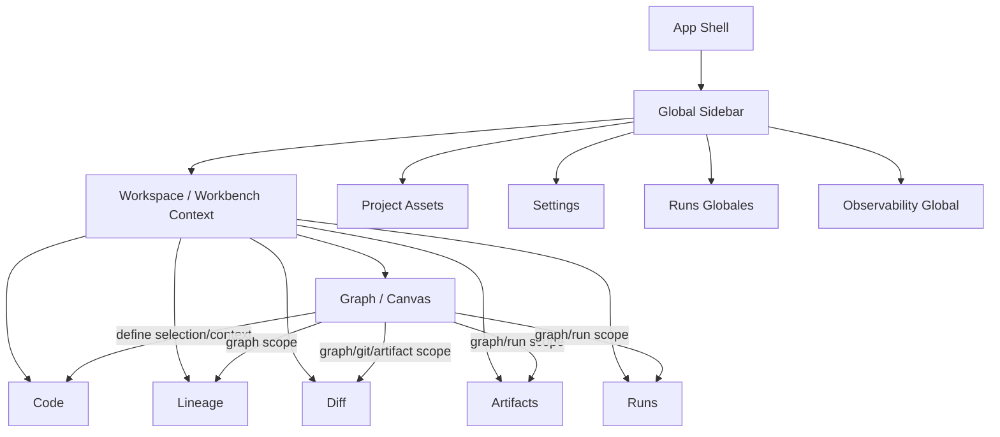

### Interpretación

- `Project Assets` puede mostrar elementos preparados que no están en canvas.
- `Graph / Canvas` muestra sólo instancias del graph activo.
- `Code`, `Lineage`, `Diff`, `Artifacts` y `Runs` son tabs del workbench activo.
- `Runs globales` puede existir como vista agregada, pero al abrir un run debe entrar al contexto de graph/run.

---

## 6. Dependencias correctas entre vistas

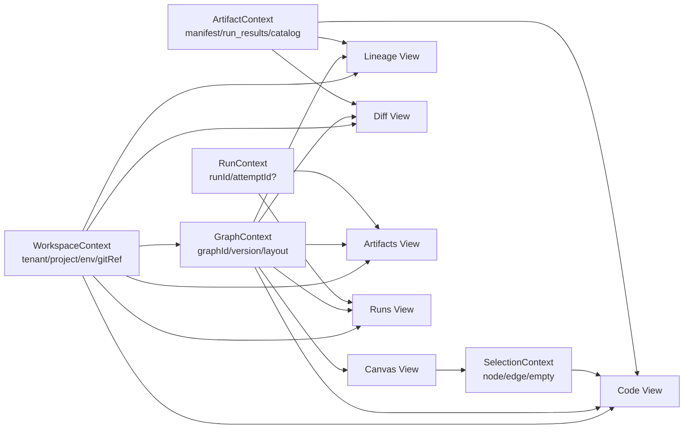

### Matriz de dependencias

| Vista     | Scope mínimo        | Scope opcional        | Fuente principal                         |
| --------- | ------------------- | --------------------- | ---------------------------------------- |
| Canvas    | projectId + graphId | gitRef, environmentId | Graph Store / Metadata Store             |
| Code      | graphId + selection | artifactId, gitRef    | GraphNode + compiled SQL + dbt artifacts |
| Lineage   | projectId           | graphId, runId        | manifest/catalog + graph snapshot        |
| Diff      | gitRef/baseRef      | graphId, artifactId   | Git + artifacts + graph snapshot         |
| Artifacts | projectId           | graphId, runId        | Artifact Store                           |
| Runs      | projectId           | graphId, runId        | RunState Store                           |

---

## 7. Separación de Project Assets vs Canvas Nodes

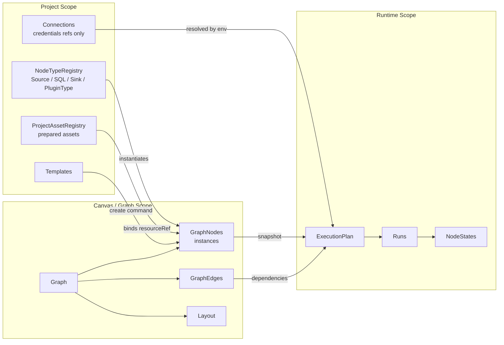

### Regla

Un `ProjectAsset` puede existir con cardinalidad cero:

```text
ProjectAsset 1 ---- 0..N GraphNode
```

Eso permite preparar assets antes de colocarlos en el canvas.

---

## 8. DDD — Bounded Contexts

```mermaid
flowchart LR
  subgraph IdentityBC["Identity & Access BC"]
    Tenant["Tenant"]
    User["User"]
    Role["Role"]
    Policy["Policy"]
  end

  subgraph ProjectBC["Project Management BC"]
    Project["Project"]
    Environment["Environment"]
    GitRef["GitRef"]
  end

  subgraph AssetBC["Project Asset Registry BC"]
    ProjectAsset["ProjectAsset"]
    Connection["ConnectionRef"]
    NodeType["NodeType"]
    Template["Template"]
  end

  subgraph GraphBC["Graph Modeling BC"]
    Graph["Graph Aggregate"]
    GraphNode["GraphNode"]
    GraphEdge["GraphEdge"]
    Selection["Selection"]
  end

  subgraph ArtifactBC["Artifacts & Metadata BC"]
    Manifest["manifest.json"]
    Catalog["catalog.json"]
    RunResults["run_results.json"]
    LineageSnapshot["LineageSnapshot"]
  end

  subgraph PlanningBC["Execution Planning BC"]
    Plan["ExecutionPlan"]
    CostEstimate["CostEstimate"]
    PartialSelection["PartialSelection"]
  end

  subgraph RuntimeBC["Run Runtime BC"]
    Run["Run"]
    Attempt["Attempt"]
    NodeState["NodeState"]
  end

  subgraph PluginBC["Plugin Extension BC"]
    PluginManifest["PluginManifest"]
    Capability["Capability"]
    PermissionGrant["PermissionGrant"]
  end

  IdentityBC -->|authorizes| ProjectBC
  ProjectBC -->|owns| AssetBC
  ProjectBC -->|owns| GraphBC
  AssetBC -->|provides refs/types| GraphBC
  ArtifactBC -->|hydrates metadata| GraphBC
  GraphBC -->|snapshot| PlanningBC
  PlanningBC -->|plan| RuntimeBC
  RuntimeBC -->|produces| ArtifactBC
  PluginBC -->|registers node types/panels| AssetBC
  PluginBC -->|extends under contracts| PlanningBC
```

---

## 9. DDD — Aggregates, Entities y Value Objects

### 9.1 Aggregates

| Aggregate      | Root                   | Invariantes                                                            |
| -------------- | ---------------------- | ---------------------------------------------------------------------- |
| Project        | `Project`              | Tenant scope obligatorio; environments versionados.                    |
| Asset Registry | `ProjectAssetRegistry` | Assets preparados no tienen layout ni runtime state.                   |
| Graph          | `Graph`                | Edges sólo entre nodos del mismo graph; layout no define dependencias. |
| Run            | `Run`                  | Run usa un `ExecutionPlan` versionado e inmutable.                     |
| Plugin         | `PluginRegistration`   | Capabilities y permisos explícitos.                                    |

### 9.2 Entidades

| Entidad        | Pertenece a             | Descripción                              |
| -------------- | ----------------------- | ---------------------------------------- |
| `ProjectAsset` | Asset Registry          | Asset preparado del proyecto.            |
| `NodeType`     | Asset Registry / Plugin | Define schema, renderer y capability.    |
| `GraphNode`    | Graph                   | Instancia en canvas.                     |
| `GraphEdge`    | Graph                   | Dependencia explícita o relación visual. |
| `RunAttempt`   | Run                     | Intento de ejecución.                    |
| `NodeRunState` | Run                     | Estado por nodo.                         |

### 9.3 Value Objects

| Value Object   | Ejemplo                                              |
| -------------- | ---------------------------------------------------- |
| `TenantId`     | `tenant_acme`                                        |
| `ProjectId`    | `project_sales`                                      |
| `GraphId`      | `graph_monthly_revenue`                              |
| `GitRef`       | `branch/main@sha`                                    |
| `ArtifactRef`  | `artifact://run/123/manifest.json`                   |
| `ResourceRef`  | `asset://source/sales_raw`                           |
| `NodePosition` | `{ x, y }`                                           |
| `ViewContext`  | `{ tenantId, projectId, envId, graphId, selection }` |

---

## 10. DDD — Domain Events

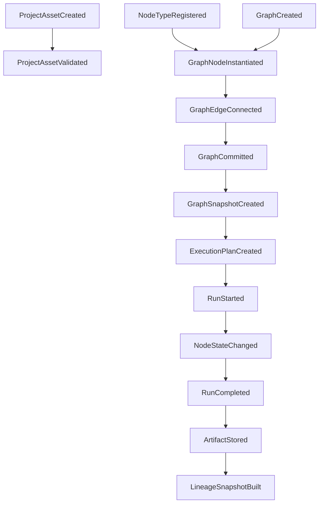

---

## 11. Modelo de clases de dominio

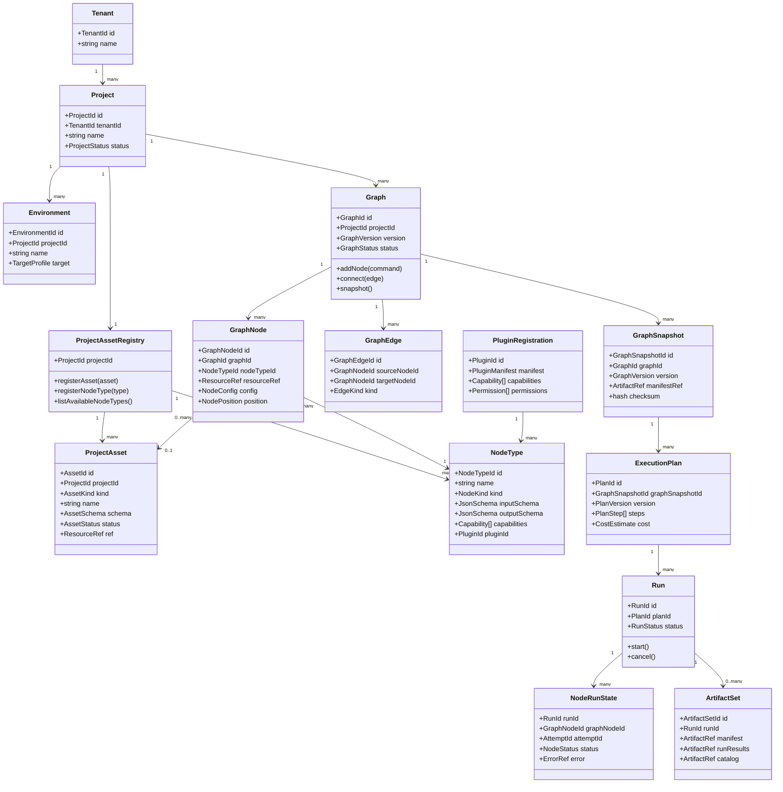

---

## 12. Máquinas de estado

### 12.1 Workspace / Workbench state

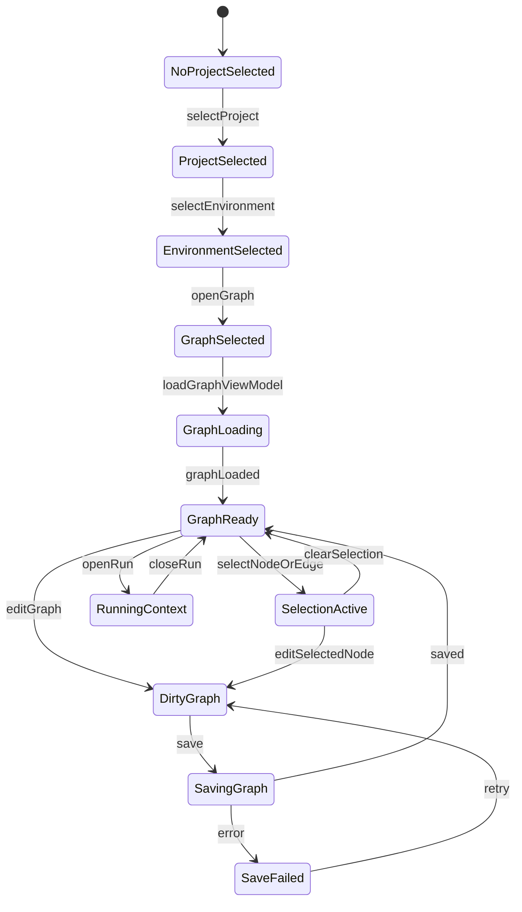

### 12.2 ProjectAsset lifecycle

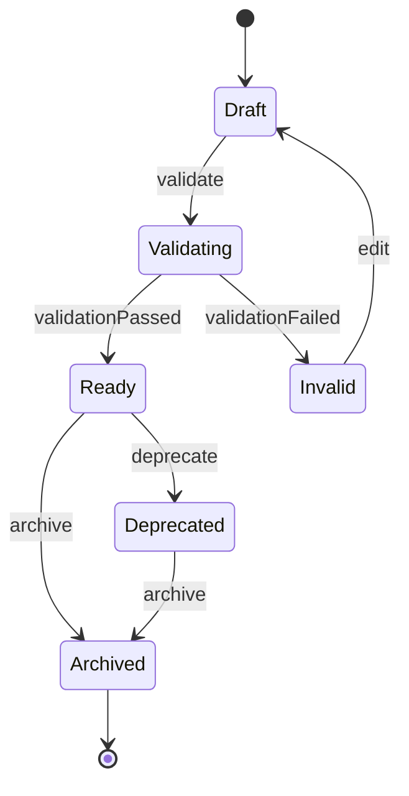

### 12.3 Graph lifecycle

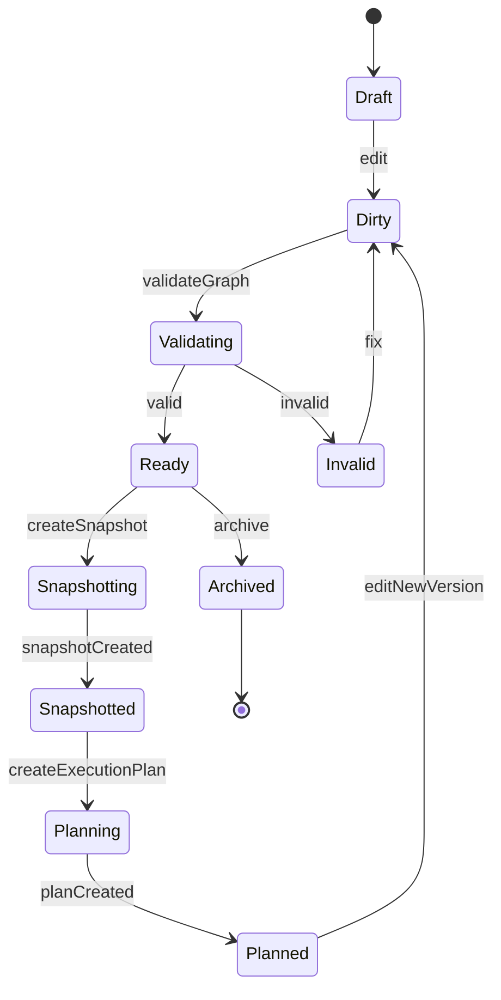

### 12.4 GraphNode lifecycle

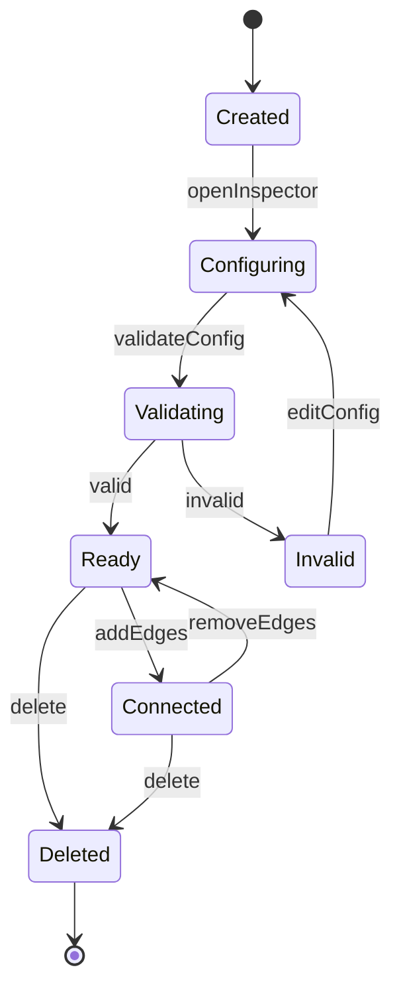

### 12.5 Run lifecycle

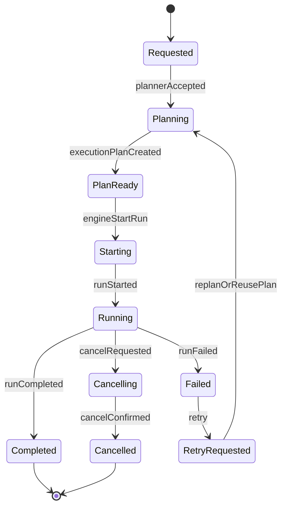

### 12.6 NodeRunState lifecycle

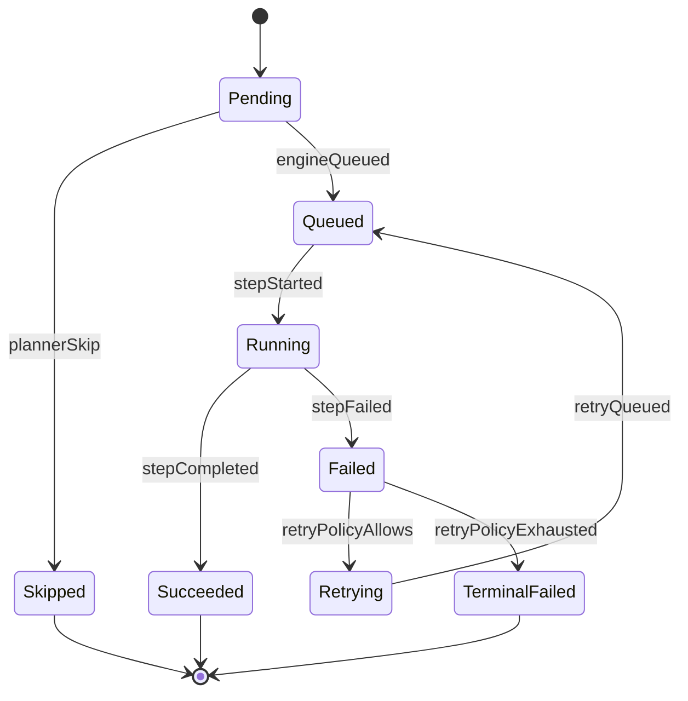

### 12.7 Plugin lifecycle

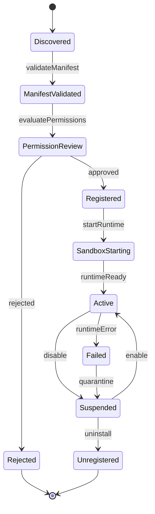

---

## 13. Diagramas de secuencia

### 13.1 Abrir workspace y renderizar canvas

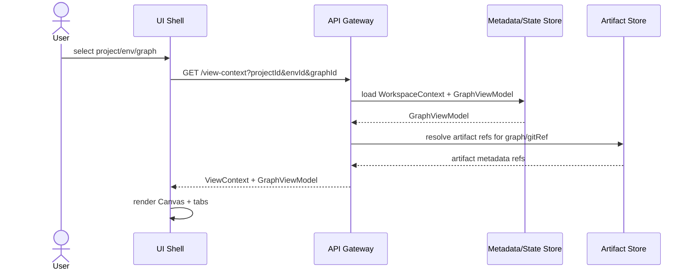

### 13.2 Asset preparado se convierte en nodo de canvas

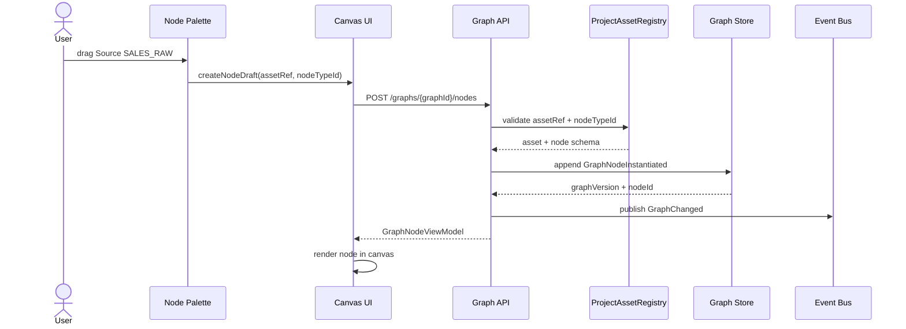

### 13.3 Abrir Code View para un nodo seleccionado

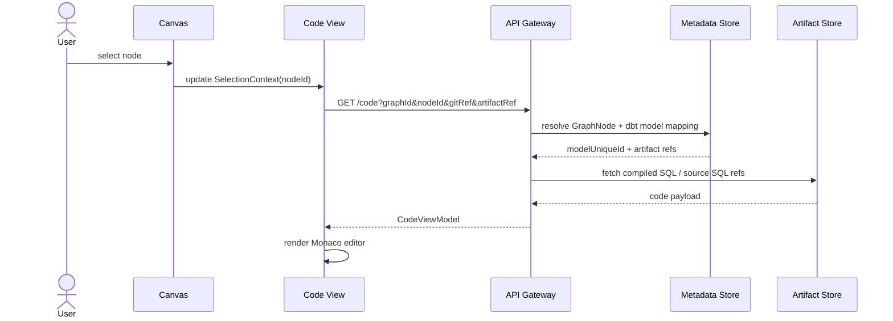

### 13.4 Abrir Lineage View en modo canvas o proyecto

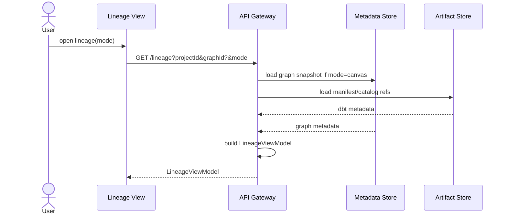

### 13.5 Ejecutar graph activo

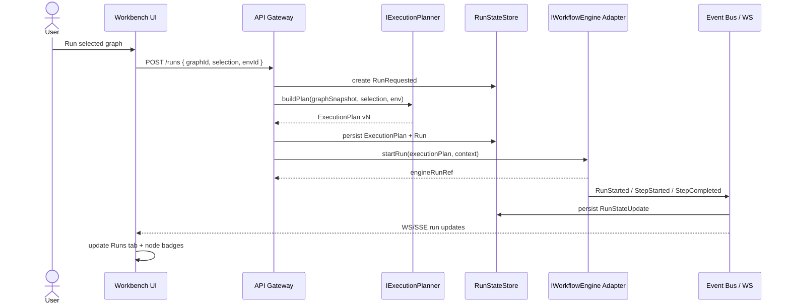

### 13.6 Plugin registra nuevo tipo de nodo

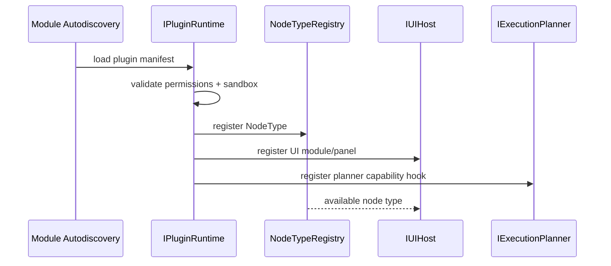

---

## 14. Flujos funcionales

### 14.1 Resolver una vista desde el menú

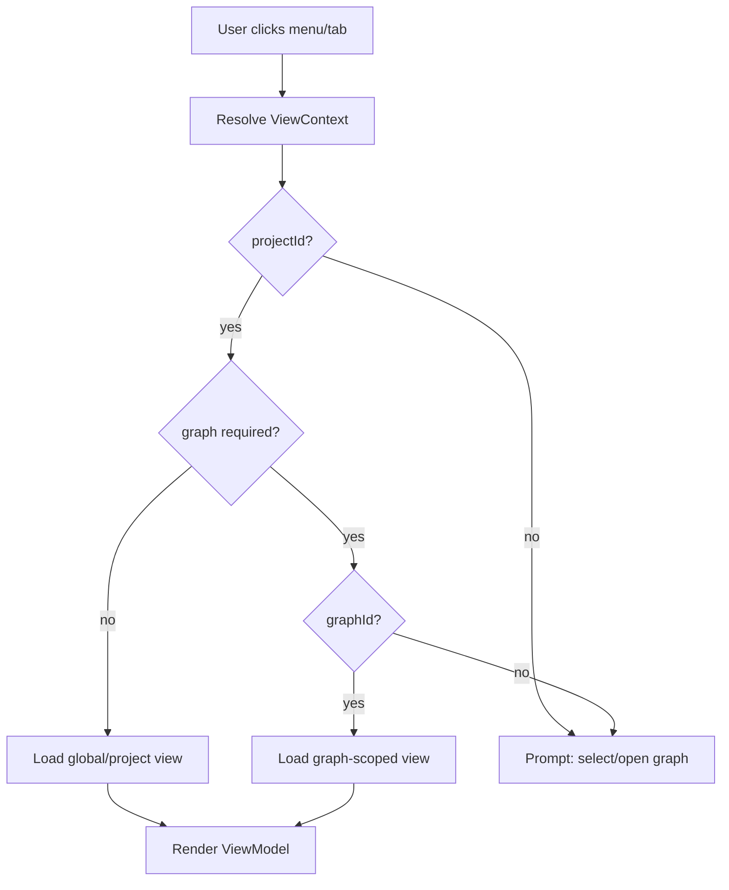

### 14.2 Crear nodo desde asset preparado

```mermaid
flowchart TD
  Start["Open Add Node / Palette"]
  Search["Search NodeTypes + ProjectAssets"]
  Pick{"Pick type or asset?"}
  PickType["Pick NodeType only"]
  PickAsset["Pick ProjectAsset"]
  Config["Create node config draft"]
  Validate["Validate schema + permissions"]
  Persist["Persist GraphNode"]
  Render["Render node"]

  Start --> Search
  Search --> Pick
  Pick -->|NodeType| PickType
  Pick -->|ProjectAsset| PickAsset
  PickType --> Config
  PickAsset --> Config
  Config --> Validate
  Validate -->|valid| Persist
  Validate -->|invalid| Config
  Persist --> Render
```

### 14.3 Planner recibe graph snapshot, no canvas mutable

```mermaid
flowchart LR
  UI["UI Run Command"]
  GraphStore["Graph Store"]
  Snapshot["GraphSnapshot immutable"]
  Manifest["dbt manifest/catalog"]
  Planner["IExecutionPlanner"]
  Plan["ExecutionPlan vN"]
  Engine["IWorkflowEngine"]

  UI -->|run request| GraphStore
  GraphStore -->|create snapshot| Snapshot
  Manifest -->|artifact refs| Snapshot
  Snapshot --> Planner
  Planner -->|plan steps/cost/skip/retry| Plan
  Plan --> Engine
```

### 14.4 Estado runtime actualiza UI

```mermaid
flowchart LR
  Engine["Workflow Engine Adapter"]
  Event["RunStateUpdate"]
  State["RunStateStore"]
  API["API WebSocket/SSE"]
  UI["Workbench UI"]
  Canvas["Canvas badges"]
  Runs["Runs tab"]
  Logs["Logs panel"]

  Engine --> Event
  Event --> State
  State --> API
  API --> UI
  UI --> Canvas
  UI --> Runs
  UI --> Logs
```

---

## 15. Componentes UI propuestos

```mermaid
flowchart TD
  AppShell["AppShell"]
  GlobalSidebar["GlobalSidebar"]
  Workbench["Workbench"]
  ContextProvider["ViewContextProvider"]
  AssetPanel["ProjectAssetPanel"]
  Palette["NodePalette / Command Palette"]
  GraphCanvas["GraphCanvas React Flow"]
  Inspector["NodeInspector JSON Schema"]
  Tabs["WorkbenchTabs"]
  Code["CodePanel Monaco"]
  Lineage["LineagePanel"]
  Diff["DiffPanel"]
  Artifacts["ArtifactsPanel"]
  Runs["RunsPanel"]
  ApiClient["API Client"]
  EventClient["WS/SSE Client"]

  AppShell --> GlobalSidebar
  AppShell --> Workbench
  Workbench --> ContextProvider
  ContextProvider --> AssetPanel
  ContextProvider --> Palette
  ContextProvider --> GraphCanvas
  ContextProvider --> Inspector
  ContextProvider --> Tabs
  Tabs --> Code
  Tabs --> Lineage
  Tabs --> Diff
  Tabs --> Artifacts
  Tabs --> Runs
  Workbench --> ApiClient
  Workbench --> EventClient
```

### Responsabilidades

| Componente          | Responsabilidad                           | No debe hacer                                       |
| ------------------- | ----------------------------------------- | --------------------------------------------------- |
| `AppShell`          | Layout global, tenant/project/env switch. | Decidir ejecución.                                  |
| `Workbench`         | Resolver contexto activo.                 | Persistir dominio directamente.                     |
| `ProjectAssetPanel` | Mostrar assets preparados.                | Mezclar assets con GraphNodes.                      |
| `NodePalette`       | Buscar tipos/assets y crear comandos.     | Mutar graph local sin backend.                      |
| `GraphCanvas`       | Renderizar nodos/edges y layout.          | Ser fuente de verdad.                               |
| `NodeInspector`     | Editar config mediante schema.            | Validar reglas de planner.                          |
| `CodePanel`         | Mostrar código asociado al contexto.      | Inferir artifacts no resueltos.                     |
| `LineagePanel`      | Renderizar lineage canvas/project/run.    | Usar edges visuales como única verdad.              |
| `RunsPanel`         | Mostrar estado persistido.                | Consultar engine directamente como fuente primaria. |

---

## 16. Contratos frontend/backend

### 16.1 ViewContext

```ts
export type ViewMode = 'graph' | 'code' | 'lineage' | 'diff' | 'artifacts' | 'runs';
export type LineageMode = 'canvas' | 'project' | 'run';

export interface ViewContext {
  tenantId: string;
  projectId: string;
  environmentId: string;
  graphId?: string;
  graphVersion?: number;
  gitRef?: string;
  selection?: SelectionContext;
  runId?: string;
  artifactSetId?: string;
  mode?: ViewMode;
}

export interface SelectionContext {
  kind: 'none' | 'node' | 'edge' | 'run' | 'artifact';
  id?: string;
}
```

### 16.2 ProjectAsset

```ts
export type AssetKind = 'dbt_source' | 'dbt_model' | 'connection' | 'template' | 'custom_resource';

export type AssetStatus = 'draft' | 'ready' | 'invalid' | 'deprecated' | 'archived';

export interface ProjectAsset {
  assetId: string;
  tenantId: string;
  projectId: string;
  kind: AssetKind;
  name: string;
  resourceRef: string;
  schemaVersion: string;
  configSchema: Record<string, unknown>;
  status: AssetStatus;
  createdAt: string;
  updatedAt: string;
}
```

### 16.3 NodeType

```ts
export interface NodeType {
  nodeTypeId: string;
  name: string;
  category: 'source' | 'transform' | 'sink' | 'plugin';
  provider: 'core' | 'dbt' | 'plugin';
  pluginId?: string;
  inputSchema: Record<string, unknown>;
  outputSchema: Record<string, unknown>;
  uiComponentRef?: string;
  plannerCapabilityRef?: string;
  runtimeCapabilityRef?: string;
}
```

### 16.4 GraphNode

```ts
export interface GraphNode {
  graphNodeId: string;
  graphId: string;
  nodeTypeId: string;
  resourceRef?: string;
  label: string;
  config: Record<string, unknown>;
  position: { x: number; y: number };
  metadata: Record<string, unknown>;
}
```

### 16.5 GraphViewModel

```ts
export interface GraphViewModel {
  tenantId: string;
  projectId: string;
  environmentId: string;
  graphId: string;
  graphVersion: number;
  nodes: GraphNodeViewModel[];
  edges: GraphEdgeViewModel[];
  availableNodeTypes: NodeType[];
  availableAssets: ProjectAssetSummary[];
  runOverlay?: RunOverlayViewModel;
}

export interface GraphNodeViewModel {
  graphNodeId: string;
  nodeTypeId: string;
  label: string;
  position: { x: number; y: number };
  status?: 'idle' | 'queued' | 'running' | 'succeeded' | 'failed' | 'skipped';
  badges: string[];
  configSummary: Record<string, string>;
}
```

### 16.6 Commands

```ts
export interface CreateGraphNodeCommand {
  tenantId: string;
  projectId: string;
  graphId: string;
  nodeTypeId: string;
  resourceRef?: string;
  initialConfig: Record<string, unknown>;
  position: { x: number; y: number };
  idempotencyKey: string;
}

export interface OpenViewCommand {
  view: ViewMode;
  context: ViewContext;
}

export interface RequestRunCommand {
  tenantId: string;
  projectId: string;
  environmentId: string;
  graphId: string;
  graphVersion?: number;
  selection?: string[];
  gitRef?: string;
  idempotencyKey: string;
}
```

---

## 17. API propuesta

| Método  | Endpoint                           | Uso                               |
| ------- | ---------------------------------- | --------------------------------- |
| `GET`   | `/projects/{projectId}/assets`     | Lista assets preparados.          |
| `GET`   | `/projects/{projectId}/node-types` | Lista tipos de nodo core/plugin.  |
| `GET`   | `/graphs/{graphId}`                | Obtiene GraphViewModel.           |
| `POST`  | `/graphs/{graphId}/nodes`          | Crea instancia de nodo en canvas. |
| `PATCH` | `/graphs/{graphId}/nodes/{nodeId}` | Actualiza config/layout.          |
| `POST`  | `/graphs/{graphId}/edges`          | Crea edge.                        |
| `POST`  | `/graphs/{graphId}/snapshots`      | Crea snapshot inmutable.          |
| `GET`   | `/views/code`                      | Resuelve CodeViewModel.           |
| `GET`   | `/views/lineage`                   | Resuelve LineageViewModel.        |
| `GET`   | `/views/diff`                      | Resuelve DiffViewModel.           |
| `GET`   | `/views/artifacts`                 | Resuelve ArtifactViewModel.       |
| `GET`   | `/views/runs`                      | Resuelve RunsViewModel.           |
| `POST`  | `/runs`                            | Solicita run.                     |
| `GET`   | `/runs/{runId}`                    | Estado persistido de run.         |
| `GET`   | `/events`                          | SSE/WS para cambios de graph/run. |

---

## 18. Modelo de persistencia sugerido

```mermaid
erDiagram
  TENANT ||--o{ PROJECT : owns
  PROJECT ||--o{ ENVIRONMENT : has
  PROJECT ||--o{ PROJECT_ASSET : has
  PROJECT ||--o{ NODE_TYPE_REGISTRATION : has
  PROJECT ||--o{ GRAPH : has
  GRAPH ||--o{ GRAPH_NODE : contains
  GRAPH ||--o{ GRAPH_EDGE : contains
  GRAPH ||--o{ GRAPH_SNAPSHOT : versions
  GRAPH_SNAPSHOT ||--o{ EXECUTION_PLAN : produces
  EXECUTION_PLAN ||--o{ RUN : executed_by
  RUN ||--o{ RUN_ATTEMPT : has
  RUN ||--o{ NODE_RUN_STATE : has
  RUN ||--o{ ARTIFACT_SET : produces
  PROJECT ||--o{ LINEAGE_SNAPSHOT : has
  PROJECT ||--o{ AUDIT_EVENT : records

  TENANT {
    string tenant_id PK
    string name
  }

  PROJECT {
    string project_id PK
    string tenant_id FK
    string name
  }

  ENVIRONMENT {
    string environment_id PK
    string project_id FK
    string name
    string target_profile_ref
  }

  PROJECT_ASSET {
    string asset_id PK
    string project_id FK
    string kind
    string name
    string resource_ref
    string status
    json config_schema
  }

  NODE_TYPE_REGISTRATION {
    string node_type_id PK
    string project_id FK
    string provider
    string plugin_id
    json input_schema
    json output_schema
  }

  GRAPH {
    string graph_id PK
    string project_id FK
    int current_version
    string status
  }

  GRAPH_NODE {
    string graph_node_id PK
    string graph_id FK
    string node_type_id FK
    string resource_ref
    json config
    json position
  }

  GRAPH_EDGE {
    string graph_edge_id PK
    string graph_id FK
    string source_node_id FK
    string target_node_id FK
    string kind
  }

  GRAPH_SNAPSHOT {
    string snapshot_id PK
    string graph_id FK
    int version
    string checksum
    string manifest_ref
  }

  EXECUTION_PLAN {
    string plan_id PK
    string snapshot_id FK
    int plan_version
    json plan_payload
  }

  RUN {
    string run_id PK
    string plan_id FK
    string status
    string engine_run_ref
  }

  NODE_RUN_STATE {
    string node_state_id PK
    string run_id FK
    string graph_node_id FK
    string status
    int attempt_no
  }

  ARTIFACT_SET {
    string artifact_set_id PK
    string run_id FK
    string manifest_ref
    string run_results_ref
    string catalog_ref
  }
```

---

## 19. Lineage: doble modo obligatorio

`Lineage` es el caso especial más importante. Puede depender del canvas, pero también puede existir a nivel proyecto.

### 19.1 Modos

| Modo      | Scope                        | Uso                                        |
| --------- | ---------------------------- | ------------------------------------------ |
| `canvas`  | graphId + artifact refs      | Ver lineage del graph activo.              |
| `project` | projectId + manifest/catalog | Ver todo el lineage del proyecto.          |
| `run`     | runId + artifact set         | Ver lineage efectivo producido por un run. |

### 19.2 Flujo de resolución

```mermaid
flowchart TD
  Open["Open Lineage"]
  Mode{"mode?"}
  Canvas["canvas mode"]
  Project["project mode"]
  Run["run mode"]
  NeedGraph{"graphId exists?"}
  NeedRun{"runId exists?"}
  LoadGraph["Load GraphSnapshot + manifest/catalog"]
  LoadProject["Load project manifest/catalog latest"]
  LoadRun["Load artifact set by runId"]
  Build["Build LineageViewModel"]

  Open --> Mode
  Mode -->|canvas| Canvas
  Mode -->|project| Project
  Mode -->|run| Run
  Canvas --> NeedGraph
  NeedGraph -->|yes| LoadGraph
  NeedGraph -->|no| Project
  Project --> LoadProject
  Run --> NeedRun
  NeedRun -->|yes| LoadRun
  NeedRun -->|no| Project
  LoadGraph --> Build
  LoadProject --> Build
  LoadRun --> Build
```

---

## 20. Code View: dependencia correcta

`Code` no debe ser simplemente un menú global. Debe resolverse según selección:

| Selección      | Resultado esperado                                                     |
| -------------- | ---------------------------------------------------------------------- |
| Nodo dbt model | SQL fuente + compiled SQL + manifest metadata.                         |
| Nodo source    | YAML/source definition + freshness/config.                             |
| Nodo sink      | Config de destino + contrato de salida.                                |
| Edge           | Dependencia, mapping o contrato entre nodos.                           |
| Sin selección  | Resumen de graph, archivos dbt relacionados o prompt para seleccionar. |

```mermaid
flowchart TD
  OpenCode["Open Code"]
  Selection{"selection kind"}
  Node["node"]
  Edge["edge"]
  Empty["none"]
  ResolveNode["Resolve nodeType + resourceRef + artifactRef"]
  ResolveEdge["Resolve edge contract"]
  GraphSummary["Show graph code summary"]
  Monaco["Render Monaco CodeView"]

  OpenCode --> Selection
  Selection -->|node| Node
  Selection -->|edge| Edge
  Selection -->|none| Empty
  Node --> ResolveNode
  Edge --> ResolveEdge
  Empty --> GraphSummary
  ResolveNode --> Monaco
  ResolveEdge --> Monaco
  GraphSummary --> Monaco
```

---

## 21. Diff View: no es sólo Git

`Diff` debe comparar varias dimensiones:

| Tipo de diff  | Entradas                         |
| ------------- | -------------------------------- |
| Git diff      | `baseRef`, `headRef`             |
| Graph diff    | `graphVersionA`, `graphVersionB` |
| Artifact diff | `artifactSetA`, `artifactSetB`   |
| Run diff      | `runIdA`, `runIdB`               |

```mermaid
flowchart LR
  DiffRequest["DiffRequest"]
  Git["Git Diff"]
  Graph["Graph Diff"]
  Artifact["Artifact Diff"]
  Run["Run Diff"]
  DiffVM["DiffViewModel"]

  DiffRequest --> Git
  DiffRequest --> Graph
  DiffRequest --> Artifact
  DiffRequest --> Run
  Git --> DiffVM
  Graph --> DiffVM
  Artifact --> DiffVM
  Run --> DiffVM
```

---

## 22. Runs: global vs contextual

Hay dos vistas válidas:

1. **Runs globales**  
   Lista agregada del proyecto o tenant.

2. **Runs contextualizados**  
   Runs asociados al graph activo, selección o run abierto.

```mermaid
flowchart TD
  RunsGlobal["Runs Global View"]
  RunsContext["Runs Contextual Tab"]
  ProjectRuns["projectId"]
  GraphRuns["graphId"]
  NodeRuns["nodeId"]
  RunDetail["runId"]

  RunsGlobal --> ProjectRuns
  RunsContext --> GraphRuns
  RunsContext --> NodeRuns
  RunsContext --> RunDetail
```

---

## 23. Artifacts: scope recomendado

Artifacts deberían navegarse por:

```text
Project -> Graph -> Run -> ArtifactSet -> ArtifactFile
```

No por menú plano.

```mermaid
flowchart LR
  Project["Project"]
  Graph["Graph"]
  Run["Run"]
  ArtifactSet["ArtifactSet"]
  Manifest["manifest.json"]
  RunResults["run_results.json"]
  Catalog["catalog.json"]
  Logs["logs / pointers"]

  Project --> Graph
  Graph --> Run
  Run --> ArtifactSet
  ArtifactSet --> Manifest
  ArtifactSet --> RunResults
  ArtifactSet --> Catalog
  ArtifactSet --> Logs
```

---

## 24. Plugin readiness

El cambio propuesto habilita plugins porque el plugin no necesita mutar la estructura global de menús. Registra capacidades en lugares explícitos:

| Capability plugin      | Dónde aparece                       |
| ---------------------- | ----------------------------------- |
| Custom node type       | Node Palette / Asset Registry       |
| Custom inspector panel | Node Inspector contextual           |
| Validator              | Graph validation / Asset validation |
| Planner extension      | Execution Planning Layer            |
| Visualization panel    | Workbench tab o node panel          |
| Cost policy            | Planner / Observability             |

```mermaid
flowchart LR
  Plugin["Plugin Manifest"]
  Runtime["Sandboxed Plugin Runtime"]
  NodeType["NodeTypeRegistry"]
  UIHost["IUIHost"]
  Planner["IExecutionPlanner"]
  RuntimeAdapter["Runtime Adapter"]

  Plugin --> Runtime
  Runtime --> NodeType
  Runtime --> UIHost
  Runtime --> Planner
  Runtime --> RuntimeAdapter
```

---

## 25. Decisiones técnicas recomendadas

### 25.1 Frontend

| Área           | Recomendación                                            |
| -------------- | -------------------------------------------------------- |
| Graph canvas   | React Flow                                               |
| Code editor    | Monaco Editor                                            |
| Form engine    | JSON Schema + validator tipo zod/Ajv                     |
| State UI       | Zustand o Redux Toolkit, pero sólo para cache/view state |
| Server state   | TanStack Query o equivalente                             |
| Live updates   | WebSocket o SSE                                          |
| State machines | XState opcional para workbench/run UI                    |

### 25.2 Backend

| Área                 | Recomendación                                          |
| -------------------- | ------------------------------------------------------ |
| Transactional state  | Postgres                                               |
| Artifact persistence | Object storage + refs en Postgres                      |
| Execution engine     | Temporal primero, Conductor después                    |
| Event bus            | NATS/Kafka/Redis PubSub según escala                   |
| Observability        | OpenTelemetry + Prometheus/Grafana + Loki/Tempo/Jaeger |
| Secrets              | Vault-like provider; no secretos en DB de app          |

---

## 26. Alternativas consideradas

### Alternativa A — Mantener menú plano actual

```text
Canvas / Lineage / Code / Diff / Artifacts / Runs al mismo nivel
```

**Ventaja:** simple visualmente.  
**Problema:** oculta dependencias reales y mezcla contexto global con contexto de graph.

**Decisión:** descartada.

### Alternativa B — Todo dentro de Canvas

```text
Canvas como único módulo y todo lo demás como panel interno
```

**Ventaja:** expresa dependencia del canvas.  
**Problema:** `Project Assets`, `Runs globales` y `Lineage project-wide` también existen fuera de un canvas.

**Decisión:** parcialmente aceptada: tabs contextuales dentro de Workbench, no todo dentro del Canvas técnico.

### Alternativa C — Workbench contextual + Project Assets separados

**Ventaja:** expresa bien registry, graph, runtime y artifacts.  
**Problema:** requiere refactor de navegación y contratos.

**Decisión:** recomendada.

---

## 27. Refactor UX propuesto

### 27.1 Sidebar global

```text
Raven / DVT+
 ├─ Workspaces
 ├─ Project Assets
 ├─ Runs
 ├─ Observability
 └─ Settings
```

### 27.2 Workbench activo

```text
Project: X | Env: dev | Graph: Transformation canvas | Git: branch@sha

Tabs:
 [Graph] [Code] [Lineage] [Diff] [Artifacts] [Runs]
```

### 27.3 Panel izquierdo dentro de Graph

```text
Graph panel
 ├─ Add node / command palette
 ├─ Project assets
 │   ├─ Sources
 │   ├─ Connections
 │   ├─ Templates
 │   └─ Plugin assets
 └─ Canvas nodes
     ├─ Source_1
     ├─ Transform_1
     └─ Sink_1
```

### 27.4 Inspector derecho

```text
Inspector
 ├─ Selected node
 ├─ Config form
 ├─ Validation
 ├─ Code preview
 ├─ Runtime state
 └─ Artifacts refs
```

---

## 28. Reglas de naming UI

| No recomendado                  | Recomendado                       | Motivo                                 |
| ------------------------------- | --------------------------------- | -------------------------------------- |
| `Project Nodes`                 | `Project Assets`                  | Evita confundir assets con instancias. |
| `Source 4` en registry          | `4 canvas nodes` separado         | Contadores deben indicar scope.        |
| `Add Node` como menú permanente | `Command Palette / Add Node`      | Es acción contextual.                  |
| `Lineage` global único          | `Lineage: Canvas / Project / Run` | Diferentes scopes.                     |
| `Code` global                   | `Code for selection`              | Depende de selección o graph.          |

---

## 29. Validaciones e invariantes

### 29.1 Invariantes de Graph

- Un edge no puede conectar nodos de graphs distintos.
- Un GraphNode debe tener `nodeTypeId` válido.
- Si `resourceRef` existe, debe apuntar a asset accesible en el proyecto.
- Una posición de canvas no implica dependencia de ejecución.
- La dependencia de ejecución viene del graph/model/artifacts y planner.

### 29.2 Invariantes de Registry

- Un ProjectAsset no tiene `position`.
- Un ProjectAsset no tiene `runStatus`.
- Un ProjectAsset puede estar sin uso.
- Un ProjectAsset puede instanciarse en varios graphs.

### 29.3 Invariantes de Run

- Un Run referencia un ExecutionPlan versionado.
- Un NodeRunState referencia GraphNode de un snapshot compatible.
- El engine no es fuente primaria de estado.

---

## 30. Plan de migración

### Fase 1 — Renombrado y separación visual

- Cambiar `Project Nodes` por `Project Assets`.
- Crear sección separada `Canvas Nodes`.
- Mover `Code`, `Lineage`, `Diff`, `Artifacts`, `Runs` a tabs del workbench.
- Mantener rutas antiguas con redirect temporal.

### Fase 2 — Introducir ViewContext

- Crear `ViewContextProvider`.
- Todas las vistas leen contexto desde provider.
- Evitar props sueltas tipo `projectId`, `nodeId` por todos lados.

### Fase 3 — Introducir comandos

- `CreateGraphNodeCommand`
- `OpenViewCommand`
- `RequestRunCommand`
- `UpdateNodeConfigCommand`

### Fase 4 — Persistencia correcta

- Tabla/colección para `project_assets`.
- Tabla/colección para `graph_nodes`.
- Separar `node_types` de `project_assets`.

### Fase 5 — Plugins y lineage avanzado

- NodeTypeRegistry extensible.
- Lineage modes: canvas/project/run.
- Plugin panels contextuales.

---

## 31. Criterios de aceptación

| Criterio           | Resultado esperado                                          |
| ------------------ | ----------------------------------------------------------- |
| Asset no usado     | Puede existir en Project Assets sin aparecer en Canvas.     |
| Drag asset         | Crea GraphNode con `resourceRef`.                           |
| Code sin selección | Muestra resumen o pide seleccionar nodo.                    |
| Code con nodo      | Muestra código/config/artifacts del nodo.                   |
| Lineage canvas     | Usa graphId + artifacts.                                    |
| Lineage project    | Funciona sin graphId.                                       |
| Run graph          | Crea snapshot, plan y run.                                  |
| Estado run         | Se refleja vía RunStateStore + WS/SSE.                      |
| Plugin node        | Aparece en palette sin cambiar core.                        |
| Diff               | Permite comparar git, graph, artifact o run según contexto. |

---

## 32. Test strategy

### 32.1 Unit tests

- Resolver de `ViewContext`.
- Reducers/view-model builders.
- Validaciones de `CreateGraphNodeCommand`.
- Separación de ProjectAsset vs GraphNode.

### 32.2 Integration tests

- Crear asset y no instanciarlo.
- Instanciar asset en canvas.
- Abrir CodeView con selección.
- Abrir Lineage project sin graph.
- Abrir Lineage canvas con graph.
- Ejecutar run y validar actualización en UI.

### 32.3 Contract tests

- `GraphViewModel`.
- `CodeViewModel`.
- `LineageViewModel`.
- `RunStateUpdate`.
- `NodeTypeRegistration` de plugin.

### 32.4 E2E tests

```text
1. Crear proyecto.
2. Importar/crear Source en Project Assets.
3. Abrir graph vacío.
4. Arrastrar Source al canvas.
5. Crear SQL Transform.
6. Conectar Source -> Transform.
7. Abrir Code tab.
8. Abrir Lineage canvas.
9. Ejecutar run.
10. Ver badges en canvas y detalle en Runs tab.
```

---

## 33. Riesgos y mitigaciones

| Riesgo                           | Mitigación                                       |
| -------------------------------- | ------------------------------------------------ |
| UI más compleja                  | Workbench claro + tabs contextuales.             |
| Usuarios esperan Lineage global  | Ofrecer modo `project` visible.                  |
| Confusión entre Asset y Node     | Naming estricto: Project Assets vs Canvas Nodes. |
| Duplicación de estado frontend   | Server state cache, no source of truth local.    |
| Plugins inseguros                | Sandbox + permisos + contratos.                  |
| Planner recibe datos incompletos | Siempre usar GraphSnapshot + artifact refs.      |

---

## 34. Checklist de implementación

```text
[ ] Renombrar panel Project Nodes -> Project Assets
[ ] Añadir panel Canvas Nodes separado
[ ] Implementar ViewContextProvider
[ ] Mover Code/Lineage/Diff/Artifacts/Runs a WorkbenchTabs
[ ] Implementar Lineage modes: canvas/project/run
[ ] Implementar ProjectAsset model
[ ] Implementar NodeTypeRegistry
[ ] Implementar CreateGraphNodeCommand
[ ] Persistir GraphNode separado de ProjectAsset
[ ] Añadir GraphSnapshot antes de run
[ ] Exponer RunStateUpdate por WS/SSE
[ ] Añadir tests de separación asset/node/run-state
```

---

## 35. Decisión final recomendada

Adoptar la arquitectura:

```text
Global Shell
  -> Project / Environment / Workspace selection
  -> Project Assets registry
  -> Workbench contextual
       -> Graph Canvas
       -> Code
       -> Lineage
       -> Diff
       -> Artifacts
       -> Runs
```

Y formalizar el modelo:

```text
ProjectAsset != GraphNode != NodeRunState
```

Esta separación es necesaria para que DVT+ pueda soportar:

- assets preparados no usados,
- múltiples canvases por proyecto,
- lineage por proyecto/canvas/run,
- ejecución planificada por snapshot,
- plugins seguros,
- UI state-driven,
- auditoría y versionado.

---

## 36. Referencias externas

- C4 Model: https://c4model.com/
- Domain-Driven Design Reference: https://www.domainlanguage.com/ddd/reference/
- Mermaid diagrams: https://mermaid.js.org/
- React Flow: https://reactflow.dev/
- Monaco Editor: https://microsoft.github.io/monaco-editor/
- dbt artifacts: https://docs.getdbt.com/reference/artifacts/dbt-artifacts
- Temporal: https://temporal.io/
- Temporal TypeScript SDK: https://docs.temporal.io/develop/typescript
- Conductor: https://conductor.netflix.com/
- Orkes Conductor: https://orkes.io/
- OpenTelemetry: https://opentelemetry.io/
- Prometheus: https://prometheus.io/
- Grafana: https://grafana.com/
- Loki: https://grafana.com/oss/loki/
- Tempo: https://grafana.com/oss/tempo/
- Jaeger: https://www.jaegertracing.io/
- XState: https://stately.ai/docs/xstate
- JSON Schema: https://json-schema.org/
- Ajv JSON Schema Validator: https://ajv.js.org/
- Zod: https://zod.dev/

---

## 37. Fuentes internas usadas

- `DVT_Product_Definition_V0.txt`
- `dvt_v2_architecture_explanation.txt`
- `dvt_workflow_engine_artifact.txt`
- `dvt_v2_mermaid_diagram_prompt-4.txt`

---

## 38. Apéndice — Diagrama compacto de decisión

```mermaid
flowchart TD
  Project["Project"]
  Registry["Project Asset Registry"]
  NodeTypes["Node Type Registry"]
  Graph["Graph / Canvas"]
  Views["Contextual Views"]
  Snapshot["GraphSnapshot"]
  Planner["Execution Planner"]
  Engine["Workflow Engine"]
  State["RunStateStore"]
  UI["UI"]

  Project --> Registry
  Project --> NodeTypes
  Registry -->|prepared assets| Graph
  NodeTypes -->|instantiation rules| Graph
  Graph -->|ViewContext| Views
  Graph --> Snapshot
  Snapshot --> Planner
  Planner --> Engine
  Engine --> State
  State --> UI
  UI -->|renders| Graph
  UI -->|renders| Views
```

---

## 39. Apéndice — Regla de oro para el equipo

```text
Si un elemento tiene posición o edges, es parte del Graph.
Si no tiene posición ni edges, es Project Asset o Node Type.
Si tiene estado running/succeeded/failed, es NodeRunState.
Si se puede ejecutar, debe venir de un GraphSnapshot planificado.
```

---

# Actualización V2 — Validación contra `dunay2/dvt`, riesgos y migración

**Estado de esta actualización:** validada contra el repositorio `dunay2/dvt` en rama `main`  
**Fecha:** 2026-05-03  
**Objetivo:** convertir la propuesta conceptual anterior en un plan viable de implementación incremental sobre el código actual.

---

## 40. Resumen de validación contra el repo

La propuesta es **viable** y no requiere una reescritura. El repositorio ya contiene los bloques arquitectónicos necesarios para ejecutar el cambio de forma incremental:

- monorepo `pnpm` / `turbo` con paquetes y apps separadas;
- `apps/web` como aplicación React/Vite;
- `@xyflow/react` para Canvas/React Flow;
- `@monaco-editor/react` para Code View;
- `@tanstack/react-query` para read models;
- `zustand` para estado local;
- contratos compartidos en `@dvt/contracts`;
- API protegida;
- store Postgres para el draft de Canvas;
- plugin registry;
- runtime policy de Canvas;
- sistema de authoring draft con CAS, idempotencia y permisos.

La conclusión técnica es:

```text
Contrato: ya permite separar nodos semánticos y nodos visibles.
Implementación actual: todavía trata el draft principalmente como visible-canvas-only.
Migración recomendada: activar esa separación existente antes de crear un registry nuevo.
```

---

## 41. Evidencia del repositorio

| Área                   | Evidencia                                                                          | Lectura arquitectónica                                                                            |
| ---------------------- | ---------------------------------------------------------------------------------- | ------------------------------------------------------------------------------------------------- |
| Monorepo               | `package.json`, `pnpm-workspace.yaml`                                              | La arquitectura ya está preparada para dividir contratos, web, API y adapters.                    |
| Web stack              | `apps/web/package.json`                                                            | Ya existen React Flow, Monaco, React Query, Zustand y React Router.                               |
| Canvas bounded context | `docs/architecture/components/web/graph/graph-frontend-architecture.md`            | El Canvas ya está definido como bounded frontend authoring context, no como runtime truth.        |
| Explorer actual        | `apps/web/src/app/components/DbtExplorer.tsx`                                      | Mezcla Project Nodes, Add Data, Add Node y nodos agrupados. Es el principal punto de deuda UI.    |
| Draft contract         | `packages/@dvt/contracts/src/contracts/planner/WorkspaceGraphAuthoringDraft.v1.ts` | `nodes` y `nodeIds` ya permiten separar assets semánticos de nodos visibles.                      |
| Persistencia actual    | `canvasDraftAuthoring.ts`, `canvasDraftLifecycleSnapshot.ts`                       | La implementación actual persiste/proyecta casi todo desde `nodeIds`; bloquea assets no visibles. |
| Navegación actual      | `dbtContributions.ts`, `monitoringContributions.ts`, `shellNavigationModel.ts`     | Code, Lineage, Diff, Artifacts y Runs se publican como rutas globales.                            |
| Lineage actual         | `LineageView.tsx`, `useLineageViewData.ts`                                         | Lineage lee un snapshot de workspace, no un ViewContext específico de canvas.                     |
| Code actual            | `CodeView.tsx`                                                                     | Code lee archivos de workspace y todavía no está modelado como tab contextual.                    |
| API/store draft        | `PostgresWorkspaceGraphDraftStore.ts`, `workspaceGraphDraft.ts`                    | Ya hay persistencia protegida con revision, idempotency y scope tenant/project/environment.       |

Links relevantes:

- Root package: https://github.com/dunay2/dvt/blob/main/package.json
- Workspace: https://github.com/dunay2/dvt/blob/main/pnpm-workspace.yaml
- Web package: https://github.com/dunay2/dvt/blob/main/apps/web/package.json
- Graph frontend architecture: https://github.com/dunay2/dvt/blob/main/docs/architecture/components/web/graph/graph-frontend-architecture.md
- Current explorer: https://github.com/dunay2/dvt/blob/main/apps/web/src/app/components/DbtExplorer.tsx
- Draft contract: https://github.com/dunay2/dvt/blob/main/packages/@dvt/contracts/src/contracts/planner/WorkspaceGraphAuthoringDraft.v1.ts
- Draft builder: https://github.com/dunay2/dvt/blob/main/apps/web/src/app/views/canvas/canvasDraftAuthoring.ts
- Draft lifecycle snapshot: https://github.com/dunay2/dvt/blob/main/apps/web/src/app/views/canvas/canvasDraftLifecycleSnapshot.ts
- dbt contributions: https://github.com/dunay2/dvt/blob/main/apps/web/src/app/plugins/dbt/dbtContributions.ts
- monitoring contributions: https://github.com/dunay2/dvt/blob/main/apps/web/src/app/plugins/monitoring/monitoringContributions.ts
- Shell navigation model: https://github.com/dunay2/dvt/blob/main/apps/web/src/app/shell/shellNavigationModel.ts
- Workspace graph draft API port: https://github.com/dunay2/dvt/blob/main/apps/api/src/application/ports/workspaceGraphDraft.ts
- Postgres draft store: https://github.com/dunay2/dvt/blob/main/apps/api/src/infrastructure/workspaceGraphDraft/PostgresWorkspaceGraphDraftStore.ts

---

## 42. Decisión técnica actualizada

La propuesta original introducía un `ProjectAssetRegistry` explícito. Tras revisar el repo, la decisión actualizada es más incremental:

```text
No crear todavía un registry persistente nuevo.
Usar primero WorkspaceGraphAuthoringDraft.nodes como Project Assets semánticos.
Usar WorkspaceGraphAuthoringDraft.nodeIds como Canvas Nodes visibles.
```

Esto permite validar el modelo sin crear nuevas tablas ni nuevos bounded contexts prematuramente.

### 42.1 Semántica objetivo

```text
WorkspaceGraphAuthoringDraft
 ├─ canvas: documento activo
 ├─ nodes: catálogo semántico del draft/workspace
 ├─ nodeIds: subset visible en canvas
 ├─ nodePositions: posiciones sólo para nodeIds
 └─ edges: relaciones semánticas entre nodos declarados
```

### 42.2 Regla nueva

```text
preparedProjectNodes = draft.nodes - draft.nodeIds
visibleCanvasNodes  = draft.nodeIds ∩ draft.nodes
```

### 42.3 Regla de ejecución

```text
Sólo visibleCanvasNodes participan en el GraphSnapshot ejecutable.
preparedProjectNodes pueden alimentar autocompletado, palette, lineage project-level o futuras acciones de importación.
```

---

## 43. Modelo objetivo actualizado

```mermaid
flowchart LR
  Draft["WorkspaceGraphAuthoringDraft"]
  SemanticNodes["draft.nodes<br/>Semantic / prepared nodes"]
  VisibleIds["draft.nodeIds<br/>Visible canvas subset"]
  Positions["draft.nodePositions<br/>Only visible nodes"]
  Edges["draft.edges<br/>Semantic edges"]

  Prepared["Project Assets<br/>nodes - nodeIds"]
  CanvasNodes["Canvas Nodes<br/>nodeIds projected to React Flow"]
  CanvasGraph["Canvas Graph ViewModel"]
  PlannerSnapshot["Executable GraphSnapshot"]

  Draft --> SemanticNodes
  Draft --> VisibleIds
  Draft --> Positions
  Draft --> Edges

  SemanticNodes --> Prepared
  SemanticNodes --> CanvasNodes
  VisibleIds --> CanvasNodes
  Positions --> CanvasNodes
  Edges --> CanvasGraph
  CanvasNodes --> CanvasGraph
  CanvasGraph --> PlannerSnapshot

  Prepared -.not executable.-> CanvasGraph
```

---

## 44. Estado actual vs estado objetivo

| Concern           | Estado actual                                  | Estado objetivo                                | Cambio                  |
| ----------------- | ---------------------------------------------- | ---------------------------------------------- | ----------------------- |
| Explorer rail     | Un único `DbtExplorer` mezcla creación y lista | `CanvasExplorerRail` con secciones separadas   | Refactor UI             |
| Node kinds        | `authoringNodeKinds` desde canvas kind activo  | Igual, pero bajo sección `Authoring Catalog`   | Cambio de copy/props    |
| Project assets    | No hay sección explícita                       | `Project Assets = draft.nodes - draft.nodeIds` | Nuevo read model        |
| Canvas nodes      | `explorerNodes = graphModel.canonicalNodes`    | `canvasNodes = visibleCanvasNodes`             | Proyección separada     |
| Draft nodes       | Persistidos desde `nodeIds`                    | Persistidos desde catálogo semántico completo  | Cambio en draft builder |
| Projectability    | `nodes.length === visibleNodeIds.length`       | `nodes.length >= visibleNodeIds.length`        | Cambio de invariant     |
| Code/Lineage/Diff | Rutas globales                                 | Tabs o vistas workbench-contextual             | Evolución shell         |
| Runs              | Global route                                   | Global + canvas-scoped tab                     | Evolución gradual       |

---

## 45. DDD actualizado

### 45.1 Bounded contexts

```mermaid
flowchart LR
  subgraph ShellContext["Shell Context"]
    ShellNav["Navigation Model"]
    RouteRegistry["Plugin View Contributions"]
  end

  subgraph CanvasAuthoringContext["Canvas Authoring Context"]
    DraftAggregate["WorkspaceGraphAuthoringDraft"]
    CanvasRuntimePolicy["CanvasRuntimePolicy"]
    NodeAdmission["Node Admission"]
    EdgeAdmission["Edge Admission"]
  end

  subgraph ProjectAssetsContext["Project Assets Context"]
    PreparedAssets["Prepared Project Assets"]
    NodeTypeCatalog["Node Type Catalog"]
    ImportData["Data Import / Source Import"]
  end

  subgraph WorkbenchViewContext["Workbench View Context"]
    ViewContext["ViewContext"]
    CodeView["Code"]
    LineageView["Lineage"]
    DiffView["Diff"]
    ArtifactsView["Artifacts"]
    RunsView["Runs"]
  end

  subgraph ExecutionContext["Execution Context"]
    Planner["Execution Planner"]
    Engine["Workflow Engine"]
    RunState["RunStateStore"]
  end

  ShellContext --> CanvasAuthoringContext
  CanvasAuthoringContext --> ProjectAssetsContext
  CanvasAuthoringContext --> WorkbenchViewContext
  CanvasAuthoringContext --> ExecutionContext
  ProjectAssetsContext -.feeds.-> CanvasAuthoringContext
  ExecutionContext -.state updates.-> WorkbenchViewContext
```

### 45.2 Aggregates

| Aggregate                      | Ownership        | Invariants                                                                                          |
| ------------------------------ | ---------------- | --------------------------------------------------------------------------------------------------- |
| `WorkspaceGraphAuthoringDraft` | Canvas authoring | `nodeIds` subset of `nodes`; `nodePositions` exactly for `nodeIds`; edges reference declared nodes. |
| `CanvasWorkbenchReadModel`     | Presentation     | Splits prepared assets, visible canvas nodes, selection, view context.                              |
| `NodeTypeCatalog`              | Plugin/runtime   | Declares what can be created; does not persist instances.                                           |
| `ExecutionPlan`                | Planner          | Contains executable steps only; no prepared-only nodes.                                             |
| `RunState`                     | Engine/state     | Runtime state by run/node/attempt; not authoring state.                                             |

---

## 46. Clase objetivo

```mermaid
classDiagram
  class WorkspaceGraphAuthoringDraft {
    +canvas: CanvasDocument
    +nodeIds: string[]
    +nodePositions: Record~string, Position~
    +nodes: AuthoringNode[]
    +edges: AuthoringEdge[]
  }

  class CanvasWorkbenchReadModel {
    +authoringNodeKinds: NodeKindRegistration[]
    +preparedProjectNodes: CanonicalNode[]
    +visibleCanvasNodes: CanonicalNode[]
    +canvasEdges: CanonicalEdge[]
    +selection: CanvasSelection
    +viewContext: ViewContext
  }

  class NodeKindRegistration {
    +kind: string
    +pluginId: string
    +role: string
    +label: string
  }

  class CanonicalNode {
    +id: string
    +name: string
    +pluginId: string
    +kind: string
    +role: string
    +status: string
    +metadata: object
  }

  class ViewContext {
    +tenantId: string
    +projectId: string
    +environmentId: string
    +canvasKind: string
    +canvasTitle: string
    +gitRef: string
    +selection: Selection
    +runId: string?
  }

  class ExecutionPlan {
    +planId: string
    +planVersion: string
    +steps: ExecutionStep[]
  }

  WorkspaceGraphAuthoringDraft --> CanonicalNode : projects to
  WorkspaceGraphAuthoringDraft --> CanvasWorkbenchReadModel : read model
  NodeKindRegistration --> CanvasWorkbenchReadModel : authoring catalog
  CanvasWorkbenchReadModel --> ViewContext : carries
  CanvasWorkbenchReadModel --> ExecutionPlan : executable subset only
```

---

## 47. Secuencia: crear asset preparado sin meterlo al Canvas

```mermaid
sequenceDiagram
  participant User
  participant UI as Project Assets Panel
  participant Port as WorkspaceGraphDraftAuthoringPort
  participant Draft as WorkspaceGraphAuthoringDraft
  participant Store as PostgresWorkspaceGraphDraftStore

  User->>UI: Import / prepare source
  UI->>Draft: add semantic node to draft.nodes
  Draft-->>UI: node not added to nodeIds
  UI->>Port: saveGraphDraft(expectedRevision, draft)
  Port->>Store: CAS save + idempotencyKey
  Store-->>Port: saved revision
  Port-->>UI: ok
  UI-->>User: asset visible under Project Assets
```

### Invariant

```text
Prepared asset no tiene nodePosition.
Prepared asset no aparece en React Flow.
Prepared asset no entra al planner.
```

---

## 48. Secuencia: añadir asset preparado al Canvas

```mermaid
sequenceDiagram
  participant User
  participant Assets as Project Assets Panel
  participant Policy as CanvasRuntimePolicy
  participant Admission as NodeAdmissionCommand
  participant Draft as WorkspaceGraphAuthoringDraft
  participant View as React Flow Viewport
  participant Port as WorkspaceGraphDraftAuthoringPort

  User->>Assets: Add to canvas / drag asset
  Assets->>Policy: allowsCanonicalNode(asset)
  Policy-->>Assets: allowed
  Assets->>Admission: admit existing semantic node
  Admission->>Draft: add node.id to nodeIds
  Admission->>Draft: add nodePositions[node.id]
  Draft-->>View: visibleCanvasNodes projection
  Draft->>Port: saveGraphDraft(expectedRevision, draft)
  View-->>User: node visible in canvas
```

### Invariant

```text
No se duplica el semantic node.
Sólo se añade visibilidad + posición.
```

---

## 49. Máquina de estado: Project Asset

```mermaid
stateDiagram-v2
  [*] --> Discovered
  Discovered --> Prepared: import/confirm
  Prepared --> VisibleInCanvas: add_to_canvas
  VisibleInCanvas --> Prepared: remove_from_canvas
  Prepared --> Archived: archive/delete
  VisibleInCanvas --> ExecutableSnapshot: graph_snapshot_created
  ExecutableSnapshot --> Prepared: snapshot_finished
  Archived --> [*]

  note right of Prepared
    Exists in draft.nodes
    Does not exist in draft.nodeIds
  end note

  note right of VisibleInCanvas
    Exists in draft.nodes
    Exists in draft.nodeIds
    Has nodePositions entry
  end note
```

---

## 50. Máquina de estado: Workbench view context

```mermaid
stateDiagram-v2
  [*] --> NoWorkspace
  NoWorkspace --> WorkspaceSelected: select workspace
  WorkspaceSelected --> DraftLoading: open canvas
  DraftLoading --> ContextReady: draft loaded
  ContextReady --> SelectionScoped: select node/edge
  SelectionScoped --> ContextReady: clear selection
  ContextReady --> RunScoped: select run
  RunScoped --> ContextReady: clear run
  ContextReady --> Stale: draft conflict or revision drift
  Stale --> DraftLoading: reload latest
```

### Interpretación

`Code`, `Lineage`, `Diff`, `Artifacts` y `Runs` deberían leer un `ViewContext` en estado `ContextReady`, `SelectionScoped` o `RunScoped`.

---

## 51. Nueva proyección recomendada

### 51.1 Tipo propuesto

```ts
type CanvasWorkbenchReadModel = Readonly<{
  authoringNodeKinds: readonly NodeKindRegistration[];
  preparedProjectNodes: readonly CanonicalNode[];
  visibleCanvasNodes: readonly CanonicalNode[];
  canvasEdges: readonly CanonicalEdge[];
  canvasNodesById: ReadonlyMap<string, CanonicalNode>;
  preparedNodesById: ReadonlyMap<string, CanonicalNode>;
  viewContext: CanvasViewContext;
}>;
```

### 51.2 Derivación

```ts
function buildCanvasWorkbenchReadModel(
  draft: WorkspaceGraphAuthoringDraft,
  nodeKinds: readonly NodeKindRegistration[]
): CanvasWorkbenchReadModel {
  const visibleIds = new Set(draft.nodeIds);
  const allNodes = draft.nodes.map(projectAuthoringNodeToCanonical);

  return {
    authoringNodeKinds: nodeKinds,
    preparedProjectNodes: allNodes.filter((node) => !visibleIds.has(node.id)),
    visibleCanvasNodes: draft.nodeIds
      .map((id) => allNodes.find((node) => node.id === id))
      .filter((node): node is CanonicalNode => node != null),
    canvasEdges: draft.edges
      .filter((edge) => visibleIds.has(edge.sourceId) && visibleIds.has(edge.targetId))
      .map(projectAuthoringEdgeToCanonical),
    canvasNodesById: new Map(),
    preparedNodesById: new Map(),
    viewContext: deriveCanvasViewContext(draft),
  };
}
```

---

## 52. Cambios mínimos por archivo

### 52.1 `DbtExplorer.tsx`

Refactor semántico:

```text
DbtExplorer
  -> CanvasExplorerRail
      -> AuthoringCatalogSection
      -> ProjectAssetsSection
      -> CanvasNodesSection
```

Props objetivo:

```ts
type CanvasExplorerRailProps = Readonly<{
  authoringNodeKinds: readonly NodeKindRegistration[];
  preparedProjectNodes: readonly CanonicalNode[];
  canvasNodes: readonly CanonicalNode[];
  canEditGraph: boolean;
  onCreateAuthoringNode: (registration: NodeKindRegistration) => void;
  onAddPreparedAssetToCanvas: (node: CanonicalNode) => void;
  onOpenDataRegistry?: () => void;
  onHide?: () => void;
}>;
```

### 52.2 `canvasControllerViewModel.ts`

Cambiar:

```ts
explorerNodes: graphModel.canonicalNodes;
```

por:

```ts
explorer: {
  (preparedProjectNodes, visibleCanvasNodes, authoringNodeKinds);
}
```

### 52.3 `canvasShellPanelsBuilder.ts`

Mantener `authoringNodeKinds`, pero separar:

```ts
preparedProjectNodes;
canvasNodes;
```

### 52.4 `canvasAuthoringGraphProjection.ts`

Separar la proyección en:

```text
semanticGraph.allNodes
semanticGraph.preparedNodes
semanticGraph.visibleNodes
viewportGraph.nodes
```

### 52.5 `canvasDraftAuthoring.ts`

Cambiar `buildCanvasAuthoringDraft` para aceptar `allSemanticNodes` además de `visibleNodeIds`.

De:

```ts
nodes: input.nodeIds.map(...)
```

A:

```ts
nodes: input.semanticNodes.map(projectCanonicalNodeToAuthoringNode);
```

Con validación:

```ts
for (const nodeId of input.nodeIds) {
  assert(input.semanticNodes.some((node) => node.id === nodeId));
}
```

### 52.6 `canvasDraftLifecycleSnapshot.ts`

Cambiar invariant de projectability:

```ts
currentDraftPayload.nodes.length === draftSession.workingSet.visibleNodeIds.length;
```

por:

```ts
currentDraftPayload.nodes.length >= draftSession.workingSet.visibleNodeIds.length;
```

Y validar que todos los visibles están declarados:

```ts
visibleNodeIds.every((id) => semanticNodeIds.has(id));
```

---

## 53. Plan de migración incremental

```mermaid
flowchart TD
  P0["P0: Baseline y tests"]
  P1["P1: Separar Explorer UI"]
  P2["P2: Nuevo CanvasWorkbenchReadModel"]
  P3["P3: Activar prepared nodes en draft.nodes"]
  P4["P4: Add prepared asset to canvas"]
  P5["P5: ViewContext para Code/Lineage/Diff/Artifacts/Runs"]
  P6["P6: Workbench tabs"]
  P7["P7: Limpieza y ADR"]

  P0 --> P1 --> P2 --> P3 --> P4 --> P5 --> P6 --> P7
```

### P0 — Baseline y tests

**Objetivo:** congelar comportamiento actual antes de refactor.

Tareas:

- Añadir tests que documenten el estado actual de `DbtExplorer`.
- Añadir test de contrato para demostrar que `draft.nodes` puede contener nodos no presentes en `nodeIds`.
- Añadir test negativo: un asset preparado no debe aparecer en React Flow.

Resultado esperado:

```text
No hay cambio funcional visible.
Se establece red de seguridad.
```

### P1 — Separar Explorer UI

**Objetivo:** corregir semántica visual sin tocar persistencia.

Tareas:

- Renombrar `DbtExplorer` a `CanvasExplorerRail` o crear wrapper nuevo.
- Dividir secciones:
  - `Authoring Catalog`
  - `Project Assets`
  - `Canvas Nodes`
- Mantener temporalmente `Project Assets` vacío o derivado del mock.

Resultado esperado:

```text
La UI deja de mezclar tipo, asset e instancia.
```

### P2 — Nuevo `CanvasWorkbenchReadModel`

**Objetivo:** crear read model explícito.

Tareas:

- Crear builder puro:
  - `buildCanvasWorkbenchReadModel.ts`
- Inputs:
  - `draftReadModel`
  - `availableCanvasKinds`
  - `runtimePolicy`
- Outputs:
  - `preparedProjectNodes`
  - `visibleCanvasNodes`
  - `authoringNodeKinds`
  - `viewContext`

Resultado esperado:

```text
El Controller ya no pasa un único explorerNodes ambiguo.
```

### P3 — Activar prepared nodes en `draft.nodes`

**Objetivo:** permitir assets preparados no visibles.

Tareas:

- Cambiar `buildCanvasAuthoringDraft`.
- Cambiar `buildCurrentDraftPayload`.
- Cambiar `isCurrentDraftProjectable`.
- Añadir tests de persistencia con:

```json
{
  "nodes": ["source_1", "source_prepared"],
  "nodeIds": ["source_1"]
}
```

Resultado esperado:

```text
Un draft puede guardar assets preparados sin posición.
```

### P4 — Add prepared asset to canvas

**Objetivo:** añadir asset existente al canvas sin duplicarlo.

Tareas:

- Añadir comando:

```ts
type AddPreparedAssetToCanvasCommand = Readonly<{
  nodeId: string;
  position: { x: number; y: number };
}>;
```

- Reutilizar `CanvasRuntimePolicy.admission.allowsCanonicalNode`.
- Añadir `nodeId` a `nodeIds`.
- Añadir `nodePositions[nodeId]`.
- No modificar `nodes` salvo si falta metadata actualizada.

Resultado esperado:

```text
Asset preparado -> Canvas node visible.
```

### P5 — `ViewContext` para vistas dependientes

**Objetivo:** que Code/Lineage/Diff/Artifacts/Runs reciban contexto explícito.

Tareas:

- Crear:

```ts
type CanvasViewContext = Readonly<{
  tenantId: string;
  projectId: string;
  environmentId: string;
  canvasKind: string;
  canvasTitle: string;
  selectedNodeIds: readonly string[];
  runId?: string;
}>;
```

- Adaptar `LineageView` para soportar:
  - `mode: 'canvas'`
  - `mode: 'project'`
- Adaptar `CodeView` para aceptar selección/path cuando exista.

Resultado esperado:

```text
Las vistas dejan de ser implícitamente globales.
```

### P6 — Workbench tabs

**Objetivo:** mover vistas dependientes al workbench activo.

Tareas:

- Extender `ViewContribution`:

```ts
type ViewPlacement =
  | { kind: 'shell-nav'; level: 'core' | 'extended' | 'admin' }
  | { kind: 'workbench-tab'; workbench: 'canvas'; order: number };
```

- Migrar:
  - `Code`
  - `Lineage`
  - `Diff`
  - `Artifacts`
  - `Runs canvas-scoped`

Resultado esperado:

```text
Sidebar global más limpia.
Workbench expresa dependencia de Canvas.
```

### P7 — Limpieza y ADR

**Objetivo:** formalizar la decisión.

Tareas:

- Crear ADR:
  - `ADR-00XX-canvas-workbench-context-and-project-assets.md`
- Actualizar docs de Graph Frontend Architecture.
- Actualizar tests de navegación.
- Retirar naming `Project Nodes` ambiguo.

---

## 54. Risk register

| ID  |                                                  Riesgo | Prob. | Impacto | Severidad | Mitigación                                                                      | Owner sugerido       |
| --- | ------------------------------------------------------: | ----: | ------: | --------: | ------------------------------------------------------------------------------- | -------------------- |
| R1  |                          Romper fitness tests de Canvas |  Alta |   Media |      Alta | P0 con baseline tests; cambios por PR pequeños                                  | Frontend             |
| R2  |       Confundir assets preparados con nodos ejecutables | Media |    Alta |      Alta | Regla: sólo `nodeIds` entra en GraphSnapshot ejecutable                         | Arquitectura/Planner |
| R3  |                Duplicar nodos al añadir asset al Canvas | Media |   Media |     Media | Comando `AddPreparedAssetToCanvas` por `nodeId`, no create nuevo                | Frontend             |
| R4  |         Persistir nodos sin posición en `nodePositions` | Media |    Alta |      Alta | Schema mantiene `nodePositions` exactamente para `nodeIds`; tests contractuales | Contracts/API        |
| R5  |                              Lineage pierda modo global | Media |   Media |     Media | Implementar `LineageMode = canvas/project/run`                                  | Frontend/Product     |
| R6  |                 Shell navigation rompe rutas existentes | Media |   Media |     Media | Mantener rutas URL; cambiar placement visual por feature flag                   | Frontend             |
| R7  |            Incremento de complejidad en draft lifecycle |  Alta |   Media |      Alta | Read model puro + tests sobre `buildCurrentDraftPayload`                        | Frontend             |
| R8  |                Planner consume prepared nodes por error |  Baja |    Alta |     Media | Builder de `ExecutableGraphSnapshot` usa sólo `visibleCanvasNodes`              | Planner              |
| R9  |                     API no soporte registry real futuro |  Baja |   Media |     Media | No crear tabla nueva ahora; dejar extensión ADR para registry v2                | Backend              |
| R10 | UX confusa al separar `Project Assets` y `Canvas Nodes` | Media |   Media |     Media | Copy explícito: "prepared but not on canvas"                                    | Product/UX           |
| R11 |           Import source en API mode sigue no disponible |  Alta |    Baja |     Media | Mantener capability gate actual; Project Assets puede estar vacío               | Backend              |
| R12 |  Tests e2e dependientes de texto `Project Nodes` fallan | Media |    Baja |     Media | Actualizar selectors por `data-slot`, no por copy                               | QA                   |

---

## 55. Matriz de impacto por componente

| Componente                           |    Impacto | Tipo de cambio                     | Prioridad |
| ------------------------------------ | ---------: | ---------------------------------- | --------: |
| `DbtExplorer.tsx`                    |       Alto | Refactor presentación              |        P1 |
| `CanvasShell.tsx`                    | Bajo/medio | Props nuevas                       |        P1 |
| `canvasShellPanelsBuilder.ts`        |      Medio | Separar panels model               |     P1/P2 |
| `canvasControllerViewModel.ts`       |      Medio | Nuevo read model                   |        P2 |
| `canvasAuthoringGraphProjection.ts`  |       Alto | Separar all/prepared/visible       |     P2/P3 |
| `canvasDraftAuthoring.ts`            |       Alto | Persistir semantic nodes completos |        P3 |
| `canvasDraftLifecycleSnapshot.ts`    |       Alto | Relax projectability invariant     |        P3 |
| `WorkspaceGraphAuthoringDraft.v1.ts` |       Bajo | Puede no requerir cambio           |        P3 |
| `dbtContributions.ts`                |      Medio | Placement workbench                |        P6 |
| `monitoringContributions.ts`         |      Medio | Runs global + contextual           |        P6 |
| `shellNavigationModel.ts`            |      Medio | Filtrar shell-nav vs tabs          |        P6 |
| `PluginManifest.ts`                  |      Medio | Extender ViewContribution          |        P6 |
| `LineageView.tsx`                    |      Medio | Modo canvas/project                |        P5 |
| `CodeView.tsx`                       | Bajo/medio | Context path/selection             |        P5 |

---

## 56. Criterios de aceptación

### 56.1 UI

- La barra izquierda global ya no mezcla vistas globales con dependencias del Canvas.
- El rail del Canvas muestra tres conceptos separados:
  - tipos disponibles;
  - assets preparados;
  - nodos visibles del canvas.
- Un asset preparado puede existir sin estar visible en el Canvas.
- Un asset preparado se puede añadir al Canvas sin duplicar su semantic node.

### 56.2 Dominio

- `draft.nodes` puede contener más nodos que `draft.nodeIds`.
- `draft.nodePositions` sólo contiene claves para `draft.nodeIds`.
- `draft.edges` no referencia nodos inexistentes.
- `preparedProjectNodes = nodes - nodeIds`.
- `visibleCanvasNodes = nodeIds ∩ nodes`.

### 56.3 Planner

- El planner no recibe prepared-only nodes.
- El `ExecutionPlan` se genera desde snapshot visible/ejecutable.
- Un prepared asset no puede tener estado runtime salvo que haya sido incluido en un GraphSnapshot ejecutado.

### 56.4 Tests

- Tests unitarios para read model.
- Tests contractuales para draft con prepared nodes.
- Tests de UI para secciones separadas.
- Test e2e: importar/preparar asset, verificar que no aparece en Canvas, añadirlo al Canvas, verificar que aparece.

---

## 57. Estrategia de testing

```mermaid
flowchart TD
  Unit["Unit tests<br/>pure builders"]
  Contract["Contract tests<br/>WorkspaceGraphAuthoringDraft"]
  Component["Component tests<br/>CanvasExplorerRail"]
  Integration["Integration tests<br/>draft save/read"]
  E2E["E2E<br/>prepared asset -> canvas"]
  Arch["Architecture fitness tests"]

  Unit --> Contract
  Contract --> Component
  Component --> Integration
  Integration --> E2E
  Unit --> Arch
  Contract --> Arch
```

### Tests mínimos

```text
[ ] buildCanvasWorkbenchReadModel splits prepared and visible nodes
[ ] WorkspaceGraphAuthoringDraft accepts nodes not present in nodeIds
[ ] nodePositions rejects prepared-only node positions
[ ] prepared asset is not projected to React Flow nodes
[ ] AddPreparedAssetToCanvas adds nodeId and position only
[ ] buildExecutableGraphSnapshot excludes preparedProjectNodes
[ ] Lineage supports canvas and project modes
[ ] Shell nav excludes workbench-tab views
```

---

## 58. Feature flags recomendadas

| Flag                                   | Uso                                            |
| -------------------------------------- | ---------------------------------------------- |
| `VITE_DVT_CANVAS_EXPLORER_SPLIT=true`  | Activa rail separado.                          |
| `VITE_DVT_PREPARED_PROJECT_NODES=true` | Permite `nodes - nodeIds`.                     |
| `VITE_DVT_WORKBENCH_TABS=true`         | Mueve Code/Lineage/Diff/Artifacts/Runs a tabs. |

Estrategia:

```text
P1 y P2 pueden ir activados por defecto en dev.
P3 debe entrar con flag hasta completar tests e2e.
P6 debe entrar con flag para no romper navegación existente.
```

---

## 59. ADR propuesta

**Título:** `ADR-00XX — Canvas Workbench Context and Project Assets Separation`

### Decisión

Separar explícitamente:

```text
NodeType != ProjectAsset != CanvasNode != RunNodeState
```

Y representar assets preparados inicialmente mediante:

```text
WorkspaceGraphAuthoringDraft.nodes - WorkspaceGraphAuthoringDraft.nodeIds
```

### Consecuencias

- `DbtExplorer` deja de ser un explorer ambiguo.
- `CanvasWorkbenchReadModel` se convierte en la fuente de presentación del rail.
- El planner consume sólo el subconjunto visible/ejecutable.
- Las vistas `Code`, `Lineage`, `Diff`, `Artifacts` y `Runs` pasan a depender de `ViewContext`.

---

## 60. Checklist de migración para PRs

```text
PR-01 Baseline
[ ] Añadir test de draft con prepared-only node
[ ] Añadir test de explorer actual
[ ] Añadir test de Graph projection visible-only

PR-02 Explorer split
[ ] Crear CanvasExplorerRail
[ ] Crear AuthoringCatalogSection
[ ] Crear ProjectAssetsSection
[ ] Crear CanvasNodesSection
[ ] Sustituir copy "Project Nodes"

PR-03 Read model
[ ] Crear buildCanvasWorkbenchReadModel
[ ] Sustituir explorerNodes ambiguo
[ ] Añadir tests unitarios

PR-04 Prepared nodes persistence
[ ] Cambiar buildCanvasAuthoringDraft
[ ] Cambiar buildCurrentDraftPayload
[ ] Cambiar isCurrentDraftProjectable
[ ] Añadir tests de CAS/read/write

PR-05 Add prepared asset command
[ ] Crear AddPreparedAssetToCanvasCommand
[ ] Reutilizar runtime policy/admission
[ ] Añadir drag/add desde ProjectAssetsSection

PR-06 ViewContext
[ ] Crear CanvasViewContext
[ ] Adaptar Lineage mode canvas/project
[ ] Adaptar Code selection/path context

PR-07 Workbench tabs
[ ] Extender ViewContribution placement
[ ] Ajustar shellNavigationModel
[ ] Mover Code/Lineage/Diff/Artifacts/Runs visualmente
[ ] Mantener rutas compatibles

PR-08 Documentation
[ ] Crear ADR
[ ] Actualizar Graph Frontend Architecture
[ ] Actualizar tests de arquitectura
```

---

## 61. Decisión final tras validación

La propuesta queda aprobada con esta modificación:

```text
Primero explotar la separación ya existente en WorkspaceGraphAuthoringDraft.
Después evaluar si hace falta un ProjectAssetRegistry persistente independiente.
```

Motivo:

- reduce riesgo;
- evita tablas prematuras;
- aprovecha contratos actuales;
- mantiene CAS/idempotencia/auditoría ya implementados;
- permite validar UX y DDD antes de ampliar backend.

---

## 62. Regla de oro actualizada

```text
NodeType: lo que se puede crear.
ProjectAsset: lo que existe semánticamente pero no está necesariamente en canvas.
CanvasNode: ProjectAsset visible en nodeIds con posición.
RunNodeState: estado runtime de un CanvasNode dentro de un Run.
ExecutionPlan: sólo se genera desde CanvasNodes ejecutables, nunca desde todos los ProjectAssets.
```

---

## 63. Diagrama final actualizado

```mermaid
flowchart TD
  subgraph Shell["Global Shell"]
    GlobalNav["Shell Navigation"]
    WorkspaceEntry["Workspace / Canvas entry"]
    GlobalRuns["Runs globales"]
    Settings["Settings / Admin / Plugins"]
  end

  subgraph Workbench["Canvas Workbench"]
    Tabs["Workbench Tabs"]
    GraphTab["Graph"]
    CodeTab["Code"]
    LineageTab["Lineage"]
    DiffTab["Diff"]
    ArtifactsTab["Artifacts"]
    RunsTab["Runs scoped"]
  end

  subgraph Rail["Canvas Explorer Rail"]
    Catalog["Authoring Catalog<br/>NodeKindRegistration"]
    Assets["Project Assets<br/>draft.nodes - draft.nodeIds"]
    CanvasList["Canvas Nodes<br/>draft.nodeIds"]
  end

  subgraph Draft["Protected Draft"]
    Nodes["nodes"]
    NodeIds["nodeIds"]
    Positions["nodePositions"]
    Edges["edges"]
  end

  subgraph Execution["Execution"]
    Snapshot["Executable GraphSnapshot"]
    Planner["Execution Planner"]
    Engine["Workflow Engine"]
    RunState["RunStateStore"]
  end

  GlobalNav --> WorkspaceEntry
  WorkspaceEntry --> Workbench
  Workbench --> Tabs
  Tabs --> GraphTab
  Tabs --> CodeTab
  Tabs --> LineageTab
  Tabs --> DiffTab
  Tabs --> ArtifactsTab
  Tabs --> RunsTab

  GraphTab --> Rail
  Draft --> Nodes
  Draft --> NodeIds
  Draft --> Positions
  Draft --> Edges

  Nodes --> Assets
  NodeIds --> CanvasList
  Catalog --> Rail
  CanvasList --> GraphTab
  GraphTab --> Snapshot
  Snapshot --> Planner
  Planner --> Engine
  Engine --> RunState
  RunState --> RunsTab
```
