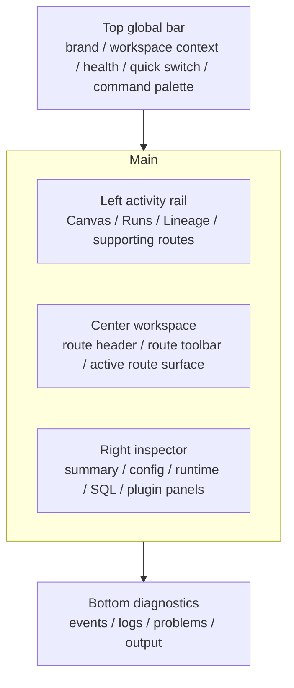
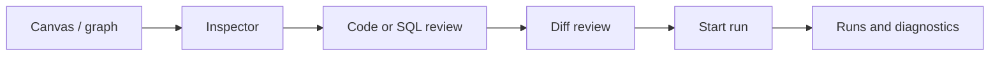

# 03. Target Product Grammar And Flows

This document defines the target product grammar for the operator-facing DVT
workbench.

It is proposal material that must stay aligned with the active Lane E shell and
route-workbench contract. It does not replace the canonical web architecture
docs.

## 3.1. Target Product Grammar

The shell should stabilize around five zones:

1. Top global bar
2. Left activity rail
3. Center workspace
4. Right contextual inspector
5. Bottom diagnostics panel

## 3.2. Target Shell Layout

## 3.3. Zone Ownership Rules

### Top Global Bar

Allowed:

- tenant, project, and environment context;
- shell health and degraded signaling;
- quick switching between stable work contexts;
- command-palette or other shell-global actions.

Not allowed:

- route-local graph commands;
- route-specific toggles that belong in a local toolbar;
- permanent chrome for one feature only.

### Left Activity Rail

Allowed:

- stable task families;
- route switching;
- governed plugin-contributed route entries;
- low-noise shell-owned utilities.

Not allowed:

- one entry per minor subtool;
- navigation shaped around implementation details instead of operator tasks.

### Center Workspace

The center workspace is where real work happens:

- graph authoring;
- run investigation;
- lineage review;
- code, diff, and artifact inspection;
- future source-generation workbenches.

### Right Contextual Inspector

The inspector is contextual, not decorative. It answers:

- what is selected;
- how it is configured;
- what happened to it;
- what affects it;
- what extra context a plugin contributes.

### Bottom Diagnostics

The bottom panel concentrates dense supporting output that should not fragment
across the shell:

- logs;
- events;
- problems;
- outputs;
- runtime diagnostics.

## 3.4. Recommended Route Taxonomy

### Core Operator Workbenches

- `Canvas`
- `Runs`
- `Lineage`

### Supporting Review Surfaces

- `Code`
- `Diff`
- `Artifacts`

### Extended Operator Surfaces

- `Plugins`
- `Cost`

### System Or Administration

- `Admin`

## 3.5. Decision On `Code` And `Diff`

`Code` and `Diff` should remain product surfaces, but their long-term posture is
supporting and contextual rather than shell-defining.

They work best when opened from:

- a selected node;
- a run detail flow;
- an artifact review flow;
- a route-level tab or explicit handoff.

Rationale:

- operators think in terms of "show me this node's SQL" or "compare this
  revision";
- they do not naturally think in terms of navigating to a separate "Code app";
- keeping `Code` and `Diff` contextual reduces shell noise without deleting
  review capability.

## 3.6. Screen Patterns

### A. Route Workbench

Use for:

- `Canvas`
- future source-generation workbenches;
- dense plugin-oriented authoring surfaces.

Shape:

- route header;
- local toolbar;
- primary center work area;
- optional right inspector;
- optional bottom diagnostics.

### B. Dense Data Route

Use for:

- `Runs`
- `Plugins`
- `Admin`
- `Cost`

Shape:

- route header;
- sticky filter bar;
- table-or-list plus detail split;
- optional secondary drawer or panel.

### C. Catalog Plus Preview Route

Use for:

- `Artifacts`
- `Code`

Shape:

- left catalog or tree;
- right preview;
- top actions;
- optional contextual metadata.

## 3.7. Main Flows

### Flow 1. Design To Run Investigation

### Flow 2. Runtime Investigation Back To Graph Context

- open a run;
- inspect events or problems;
- jump to the affected node or route context;
- return to Canvas with preserved context.

### Flow 3. Understand Plugin Then Use Contribution

- open `Plugins`;
- inspect declared capabilities and backend availability;
- understand which route or dock the contribution belongs to;
- use it in-place instead of learning a second shell.

## 3.8. Large-Board Iteration Patterns

Large boards need more than zoom and pan. The operator needs fast return to the
same working zone.

Recommended patterns:

- saved views;
- frames or named zones;
- recent focus points;
- filter presets;
- quick jump;
- selection history.

## 3.9. Object Placement Rules

Actions:

- shell-global -> top bar
- route-global -> route header
- route-local -> local toolbar
- selection-driven -> inspector or contextual menu
- diagnostics or playback -> bottom panel

Badges and status:

- compact in lists;
- persistent but low-noise in navigation;
- richer in inspector or detail panes.

Canvas overlays:

- few in number;
- explicitly named;
- plugin-compatible;
- semantically distinct;
- never all competing at once.

## 3.10. Golden Routing Question

Before adding a new capability, answer this first:

**Does it belong to the shell, the route, the current context, or diagnostics?**

If that answer is not clear, the interface is likely about to lose coherence.
