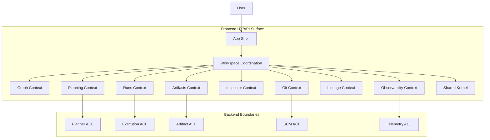
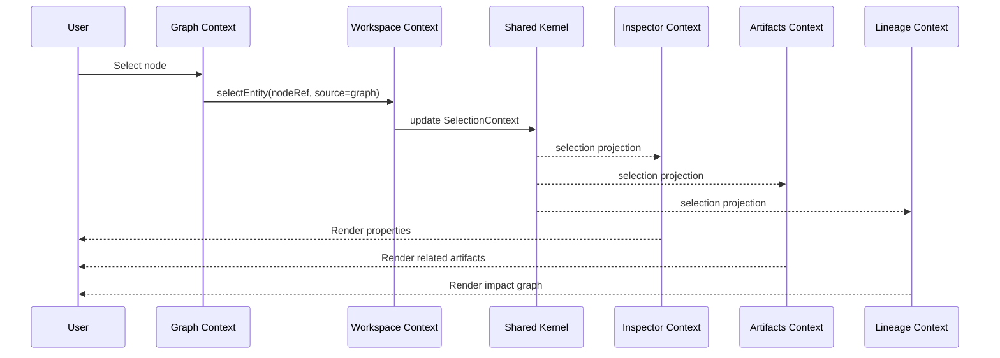
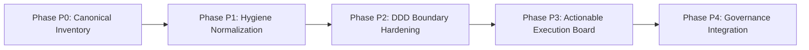

# Frontend Canonicity And Hygiene Improvement Plan

## 1. Purpose

This proposal defines an executable architecture program to close two open
gaps in the frontend documentation corpus:

1. canonicity: one clear source of truth per topic
2. hygiene: consistent quality, metadata, naming, and cross-link integrity

The plan uses DDD boundaries and Fowler-style incremental remediation so each
step is shippable and auditable.

## 2. Governing Sources

- [Governance Document And Rule Inventory](../status/governance-document-rule-inventory.md)
- [Reference Architecture](../../architecture/reference-architecture.md)
- [ADR-0034 Bounded Context Boundaries And Communication Rules](../../adr/ADR-0034-bounded-context-boundaries-and-communication-rules.md)
- [Frontend DDD Target Architecture](../../architecture/frontend/frontend-ddd-target-architecture.md)
- [Frontend Architecture Review And Critical Action Plan](../../architecture/frontend/review/frontend-architecture-review-and-critical-action-plan.md)
- [AI Work Protocol](../../guides/ai-work-protocol.md)

## 3. Baseline Quality Assessment

Current state is materially better than before, but still not closed:

- Strengths:
  - DDD target architecture exists and is coherent.
  - Critical refactor backlog exists with named smells and sequencing.
  - Workspace mediation and ACL direction are documented.
- Remaining gaps:
  - Canonical-vs-supporting document boundaries are still implicit in places.
  - Metadata and terminology are not yet normalized across all frontend docs.
  - Some review and architecture files still show editorial drift and encoding
    hygiene issues.
  - Task execution and architecture documents are not fully synchronized in one
    operational board.

## 4. Target State (Definition Of Done)

The frontend documentation set is considered closed when all conditions hold:

1. every frontend topic has one canonical owner document
2. every supporting document links to the owner document and states its role
3. DDD context boundaries and mediated interactions are explicit and consistent
4. all frontend docs pass hygiene gates (naming, frontmatter, links, markdown)
5. execution board is actionable, prioritized, and dependency-accurate

## 5. DDD Context Map (Target)

## 6. Domain Sequence (DDD, Mediated Interaction)

## 7. Fowler-Style Remediation Strategy

Refactoring mechanics are applied to documentation architecture, not only code:

- Extract Class:
  split mixed-purpose docs into canonical spec + review artifact + execution
  board, each with explicit responsibility.
- Move Method / Move Field:
  move duplicated definitions (terms, ownership, decision points) into canonical
  owner docs and replace duplicates with references.
- Rename Variable:
  normalize overloaded terms (`moduleId`, `workbenchMode`, `selection`,
  `projection`) across all frontend docs.
- Introduce Parameter Object:
  standardize frontmatter and governance metadata as a reusable document
  contract.
- Strangler Fig:
  deprecate legacy or overlapping frontend notes gradually through index-based
  replacement, not big-bang rewrites.

## 8. Execution Phases

| Phase | Objective                   | Main Deliverables                                          | Exit Criteria                          |
| ----- | --------------------------- | ---------------------------------------------------------- | -------------------------------------- |
| P0    | Canonical inventory closure | frontend canonical map, role tags per doc                  | each topic maps to one owner doc       |
| P1    | Hygiene normalization       | frontmatter, naming, encoding, link repair                 | frontend docs pass docs hygiene checks |
| P2    | DDD boundary hardening      | updated context map + mediated sequences in canonical docs | cross-context rules are consistent     |
| P3    | Actionable execution board  | prioritized task board with dependencies and staffing      | board is execution-ready               |
| P4    | Governance integration      | planning surfaces and indexes synchronized                 | docs sync and quality gates pass       |

## 9. Program Dependency Graph

## 10. Validation Baseline

Minimum closure checks for this plan and derived docs:

1. `pnpm docs:sync`
2. `pnpm lint:md`
3. `pnpm verify:prepush`

## 11. References

- Evans, Eric. _Domain-Driven Design: Tackling Complexity in the Heart of
  Software_. Addison-Wesley, 2003.
- Fowler, Martin. _Refactoring: Improving the Design of Existing Code (2nd
  Edition)_. Addison-Wesley, 2018.
- Fowler, Martin. _Patterns of Enterprise Application Architecture_.
  Addison-Wesley, 2002.
- [Frontend DDD Target Architecture](../../architecture/frontend/frontend-ddd-target-architecture.md)
- [Frontend Architecture Review And Critical Action Plan](../../architecture/frontend/review/frontend-architecture-review-and-critical-action-plan.md)
