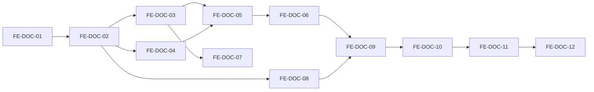
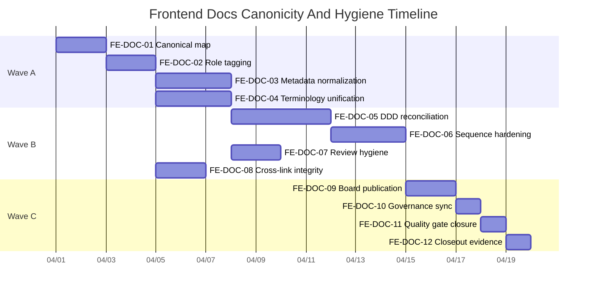
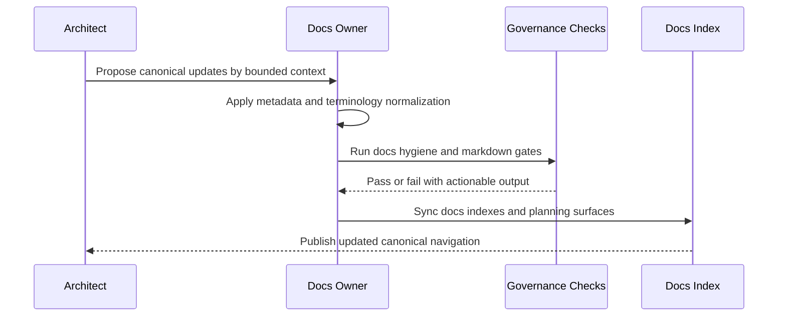

# Frontend Canonicity And Hygiene Task Board

## 1. Scope

This board operationalizes the plan in:

- [Frontend Canonicity And Hygiene Improvement Plan](./frontend-canonicity-hygiene-improvement-plan-20260331.md)

All tasks are defined for execution readiness: priority, criticality, effort,
recommended staffing, complexity, dependencies, and measurable outputs.

## 2. Estimation Scales

- Priority: `P0` (immediate), `P1` (next), `P2` (follow-up)
- Criticality: `Critical`, `High`, `Medium`
- Effort: person-days (`pd`)
- Staffing: recommended concurrent contributors
- Complexity: `Low`, `Medium`, `High`, `Very High`

## 3. Executable Task Board

| Task ID   | Workstream                 | Priority | Criticality | Effort | Staffing | Complexity | Dependencies         | Deliverable                                                     |
| --------- | -------------------------- | -------- | ----------- | ------ | -------- | ---------- | -------------------- | --------------------------------------------------------------- |
| FE-DOC-01 | Canonical map              | P0       | Critical    | 2 pd   | 1        | Medium     | None                 | Canonical topic-to-document map for frontend corpus             |
| FE-DOC-02 | Role tagging               | P0       | Critical    | 2 pd   | 1        | Medium     | FE-DOC-01            | Each frontend doc tagged as canonical, supporting, or reference |
| FE-DOC-03 | Metadata normalization     | P0       | High        | 3 pd   | 1        | Medium     | FE-DOC-02            | Frontmatter normalized across frontend docs                     |
| FE-DOC-04 | Terminology unification    | P0       | High        | 3 pd   | 1        | High       | FE-DOC-02            | Glossary-aligned language (`moduleId`, `workbenchMode`, etc.)   |
| FE-DOC-05 | DDD context reconciliation | P1       | High        | 4 pd   | 2        | High       | FE-DOC-03, FE-DOC-04 | Consistent DDD context map across architecture docs             |
| FE-DOC-06 | Sequence hardening         | P1       | High        | 3 pd   | 1        | High       | FE-DOC-05            | Mediated domain sequences updated and cross-linked              |
| FE-DOC-07 | Review corpus hygiene      | P1       | Medium      | 2 pd   | 1        | Medium     | FE-DOC-03            | Review files cleaned for encoding/editorial drift               |
| FE-DOC-08 | Cross-link integrity       | P1       | High        | 2 pd   | 1        | Medium     | FE-DOC-02            | All frontend cross-links resolve and point to owner docs        |
| FE-DOC-09 | Action board publication   | P1       | Medium      | 2 pd   | 1        | Low        | FE-DOC-06, FE-DOC-08 | Published execution board with dependencies and staffing        |
| FE-DOC-10 | Governance sync            | P1       | High        | 1 pd   | 1        | Low        | FE-DOC-09            | Planning indexes and generated views synced                     |
| FE-DOC-11 | Quality gate closure       | P0       | Critical    | 1 pd   | 1        | Low        | FE-DOC-10            | Markdown and pre-push validation evidence                       |
| FE-DOC-12 | Closeout evidence          | P2       | Medium      | 1 pd   | 1        | Low        | FE-DOC-11            | Closeout note with findings, residual risk, and next iteration  |

## 4. Delivery Waves

| Wave                    | Included Tasks                             | Goal                                          |
| ----------------------- | ------------------------------------------ | --------------------------------------------- |
| Wave A (Stabilize)      | FE-DOC-01, FE-DOC-02, FE-DOC-03, FE-DOC-04 | close canonicity and language drift           |
| Wave B (Harden)         | FE-DOC-05, FE-DOC-06, FE-DOC-07, FE-DOC-08 | enforce DDD consistency and hygiene integrity |
| Wave C (Operationalize) | FE-DOC-09, FE-DOC-10, FE-DOC-11, FE-DOC-12 | publish, validate, and close with evidence    |

## 5. Dependency Diagram

## 6. Timeline (Draft)

## 7. DDD Delivery Sequence (Governance Flow)

## 8. Quality Gates

Execution closure requires all three:

1. `pnpm docs:sync`
2. `pnpm lint:md`
3. `pnpm verify:prepush`

## 9. References

- [Frontend Canonicity And Hygiene Improvement Plan](./frontend-canonicity-hygiene-improvement-plan-20260331.md)
- [Frontend DDD Target Architecture](../../architecture/frontend/frontend-ddd-target-architecture.md)
- [Frontend Architecture Review And Critical Action Plan](../../architecture/frontend/review/frontend-architecture-review-and-critical-action-plan.md)
- [Governance Document And Rule Inventory](../status/governance-document-rule-inventory.md)
