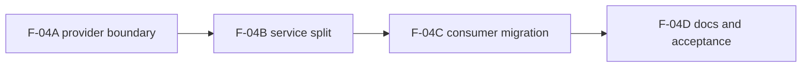

# F-04 Scope And Slice Proposal

## Why this note exists

`F-04` is useful, but it can sprawl if treated as one generic "mock versus API"
cleanup task.

This note narrows the intended delivery scope and suggests smaller slices so the
frontend does not mix service-boundary work with store, query, and runtime
contract remediation.

## Current F-04 scope

Included:

- one shell-owned service composition boundary;
- typed hooks for view-facing service access;
- split `workspace`, `runs`, and `plans` into composer plus `mock/api`
  implementations;
- migration of active consumers away from local service construction;
- documentation of the boundary and its user-visible behavior.

Excluded:

- query-key and invalidation normalization;
- `appStore` decomposition;
- runtime contract drift fixes;
- legacy `GraphCanvas` retirement;
- real live-log delivery.

## Recommended smaller slices

### F-04A - Shell composition boundary

- add `AppServicesProvider`;
- add `useWorkspaceService`, `useRunsService`, `usePlansService`,
  `useAppDataSourceMode`;
- migrate the highest-risk consumers first.

### F-04B - Service split by domain

- separate `workspace`, `runs`, and `plans` into:
  - service contract;
  - mock adapter;
  - api adapter;
  - composer.

### F-04C - Consumer migration and honesty fixes

- remove local `resolveDataSource()` and factory calls from views and plugins;
- replace any misleading fake UI in `api` mode with explicit "not wired yet"
  behavior.

### F-04D - Documentation and acceptance

- write the technical boundary document;
- update the user manual;
- capture residual scope so later tasks do not quietly re-open `F-04`.

## Exit criteria for calling F-04 done

- no active view, component, or plugin constructs mode-aware services locally;
- no non-mock view-facing code imports mock data directly;
- service composition is owned by the shell;
- unsupported API paths fail explicitly instead of silently showing fake data;
- technical and user-facing frontend docs match the real code.
