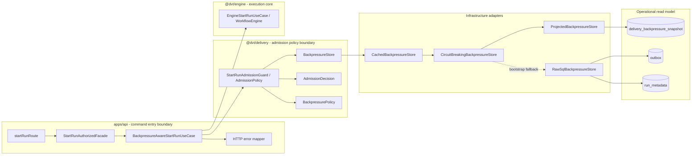
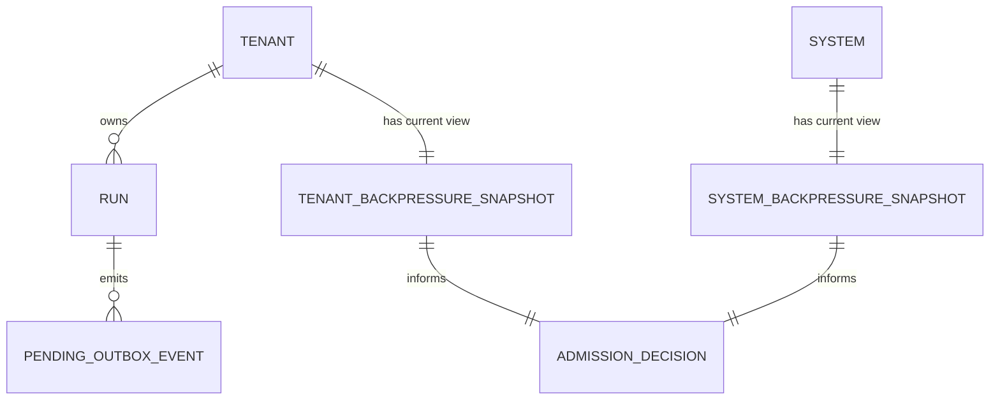
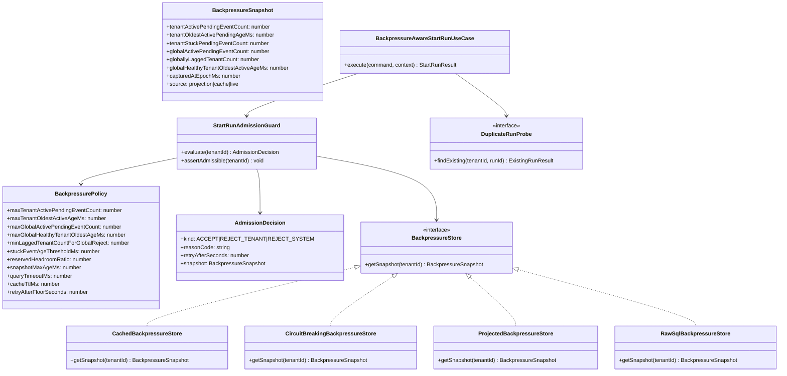
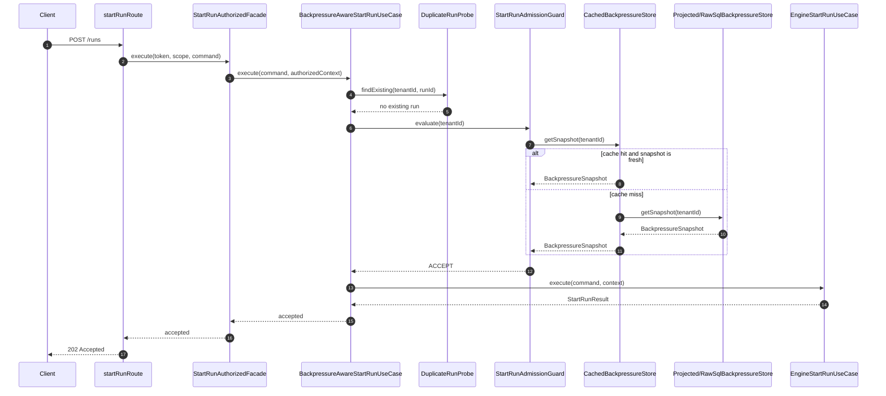
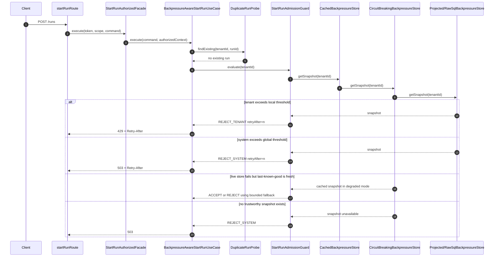

# Gap 4 Backpressure Admission Design

## Purpose

This document defines the intended target design for closing Gap 4 from
`docs/planning/dvt-top-5-gaps-corrected-20260319.md`:

> Outbox and event pipeline have no backpressure controls.

The goal is to define the destination architecture before implementation, with
an explicit rationale and a delivery shape that respects:

- SOLID and object-oriented design
- CQRS
- hexagonal boundaries
- current ADRs and repository governance

This document intentionally distinguishes between:

- target design:
  the architecture we want to converge on
- slice 1:
  the smallest safe implementation that materially closes the gap without
  over-expanding scope

Because the implementation is too large for one reviewable change, the delivery
plan is intentionally decomposed into 5 PR slices. The machine-readable PR
document references live in the frontmatter, and each slice has its own
proposal file and checklist.

## Governing Sources

### Repository governance

- `AGENTS.md`
- `docs/planning/status/governance-document-rule-inventory.md`
- `docs/guides/ai-work-protocol.md`
- `docs/guides/testing-and-ci-capabilities.md`

### Normative and architectural baseline

- `docs/adr/ADR-0003-execution-model.md`
- `docs/adr/ADR-0004-event-sourcing-strategy.md`
- `docs/adr/ADR-0008_Signal_Idempotency.md`
- `docs/adr/ADR-0009_Outbox_Ordering.md`
- `docs/adr/ADR-0013-run-state-store-bootstrapRunTx.md`
- `docs/adr/ADR-0030-pre-dispatch-intent-log.md`
- `docs/adr/ADR-0033-outbox-worker-sharding-and-fencing-model.md`
- `docs/adr/ADR-0034-bounded-context-boundaries-and-communication-rules.md`
- `docs/architecture/engine/contracts/engine/ExecutionSemantics.v1.md`
- `docs/architecture/system-delivery-status.md`
- `docs/planning/status/canonical-doc-code-matrix.md`

### Gap statement and current repo baseline

- `docs/planning/dvt-top-5-gaps-corrected-20260319.md`
- `packages/@dvt/delivery/src/backpressure/StartRunAdmissionGuard.ts`
- `packages/@dvt/delivery/test/gaps/StartRunAdmissionGuard.test.ts`
- `apps/api/src/entrypoints/http/startRunRoute.ts`
- `apps/api/src/application/services/startRunAuthorizedFacade.ts`
- `apps/api/src/modules/buildProtectedRuntimeModule.ts`
- `packages/@dvt/engine/src/security/RunAccessPolicy.ts`
- `packages/@dvt/engine/src/core/WorkflowEngine.ts`
- `packages/@dvt/adapter-postgres/src/PostgresStateStoreAdapter.ts`
- `packages/@dvt/adapter-postgres/src/PostgresOutboxStore.ts`
- `packages/@dvt/adapter-postgres/migrations/001_init.sql`
- `apps/outbox-worker/src/ops/OutboxWorkerMonitor.ts`

### External comparison sources

- Kubernetes API Priority and Fairness:
  https://kubernetes.io/docs/concepts/cluster-administration/flow-control/
- Apache Airflow configuration reference:
  https://airflow.apache.org/docs/apache-airflow/3.1.4/configurations-ref.html
- Amazon SQS queue metrics:
  https://docs.aws.amazon.com/AmazonCloudWatch/latest/monitoring/appinsights-metrics-sqs.html
- Amazon SQS dead-letter and age semantics:
  https://docs.aws.amazon.com/AWSSimpleQueueService/latest/SQSDeveloperGuide/setting-up-dead-letter-queue-retention.html

## Review Corrections Incorporated

This revision incorporates the main design objections raised during review:

- backlog semantics are now defined explicitly against the real schema
- active backlog and stuck backlog are now separated explicitly
- the target model no longer assumes raw aggregate SQL on every `POST /runs`
- cache, timeout, and circuit-breaker behavior are now first-class
- fairness and tenant isolation are handled explicitly in the admission policy
- observability moves into slice 1 instead of being deferred
- `Retry-After` is now fixed in slice 1 and only becomes dynamic once a
  throughput source exists
- stale-snapshot and admitted-but-not-yet-materialized risk are modeled
- idempotency is treated as an adjacent concern and grounded in the existing
  start-run intent machinery rather than invented ad hoc at the route layer
- load and failure injection tests are included in the target validation plan
- rollout is now explicit via observation and enforcement modes
- multi-instance inconsistency is documented as a first-slice limitation
- global rejection no longer relies on a single oldest event owned by one tenant
- coexistence with the existing rate limiter now has explicit ordering

## Problem Summary

`main` already contains a reusable admission primitive in
`@dvt/delivery`: `StartRunAdmissionGuard`.

What the repo does not yet contain is the end-to-end path that makes this
primitive authoritative for `POST /runs`:

- there is no production-grade `BackpressureStore`
- the API command path does not call the guard before `startRun`
- backlog semantics are under-specified
- HTTP overload behavior is not explicit
- there is no resilience envelope around snapshot acquisition
- there is no first-class admission observability

The result is that DVT can continue accepting new runs while delivery lag grows
silently and the read side becomes progressively less trustworthy.

## Root Cause

The repository already evolved delivery into its own bounded context, but the
command-admission decision was left as a partially extracted concept.

More concretely:

1. `@dvt/delivery` already owns worker behavior and backlog-oriented concerns.
2. `apps/api` already owns command admission and HTTP semantics.
3. The bridge between those two contexts is missing.
4. The current guard models only a minimal binary decision and lacks the
   operational envelope needed for production admission control.

There is therefore no authoritative place where API command acceptance is
conditioned on current delivery health in a way that is fair, observable, and
cheap enough to run continuously.

## Operational Definitions

The first proposal version was too vague here. The target design uses the
following terms precisely.

### Pending outbox event

In the current schema, the only durable and authoritative "not yet delivered"
state is:

- `outbox.delivered_at IS NULL`

There is no canonical `processed` column in `001_init.sql`, so the proposal
must not invent one.

Implication:

- a pending event is any outbox row not yet marked as delivered
- this includes rows not yet claimed, in-flight retry rows, and rows that are
  still eligible for replay or later retry

This is not a perfect workload metric, but it is the correct durable baseline
for slice 1.

### Active versus stuck pending events

The review is right that `delivered_at IS NULL` also includes pathological rows:

- poison events
- endlessly retried events
- work that effectively needs operator intervention

Using those rows forever as active backlog would create permanent admission
lockout.

Slice 1 therefore distinguishes:

- active pending event:
  `delivered_at IS NULL` and age `<= stuckEventAgeThresholdMs`
- stuck pending event:
  `delivered_at IS NULL` and age `> stuckEventAgeThresholdMs`

Admission uses active backlog.

Operational safety uses stuck backlog:

- stuck backlog is emitted as separate metrics
- stuck backlog generates alerts and runbook action
- stuck backlog is not silently ignored; it is quarantined from admission math

Required slice-1 operational deliverables:

- emergency cleanup or quarantine script for very old stuck rows
- runbook guidance for diagnosing poisoned or permanently failing outbox items

### Tenant backlog

Tenant backlog is the set of pending outbox rows whose `run_id` joins to
`run_metadata.run_id` for a given `tenant_id`.

### Tenant oldest active pending age

`tenantOldestActivePendingAgeMs` is:

- `now - MIN(outbox.created_at)` over that tenant's active pending rows

### Global oldest active age for shared protection

`globalHealthyTenantOldestActiveAgeMs` is:

- `now - MIN(outbox.created_at)` over active pending rows that belong to
  tenants not already locally rejected

### Globally lagged tenant count

`globallyLaggedTenantCount` is:

- the number of tenants whose active pending age exceeds the shared global-lag
  threshold and are therefore evidence of multi-tenant shared pressure

### Snapshot freshness

A backlog snapshot is only admissible for decision-making if:

- it was captured recently enough to be trusted
- its acquisition path completed within a bounded timeout

This introduces `capturedAtEpochMs` and freshness policy into the design.

## Target Outcome

`POST /runs` must become backpressure-aware without moving infrastructure
knowledge into `WorkflowEngine`.

The target behavior is:

- healthy tenant and healthy system:
  command is accepted
- tenant backlog too high:
  reject with `429 Too Many Requests`
- tenant not yet locally overloaded but system globally unhealthy:
  reject with `503 Service Unavailable`
- snapshot unavailable but last-known-good is still fresh:
  use bounded degraded mode
- snapshot unavailable and no trustworthy fallback exists:
  fail closed with `503 Service Unavailable`

This decision must be:

- deterministic
- testable
- tenant-scoped first, system-scoped second
- explicit in the HTTP contract
- cheap enough to evaluate on every command
- observable enough to calibrate in production-like environments

## Design Principles

### Hexagonal placement

- API is the command admission boundary.
- Delivery owns backpressure policy and domain decisions.
- Snapshot acquisition is a port.
- Postgres and cache are adapters.
- Engine remains unaware of outbox depth and lag metrics.

### CQRS placement

- `POST /runs` is a command.
- backlog and lag are operational read-side signals.
- admission is a command precondition evaluated from a read model.
- the mature form of this design should therefore use a dedicated operational
  read model, not perpetual hot-path aggregation over raw outbox tables.

### SOLID alignment

- Single Responsibility:
  route, facade, admission policy, snapshot acquisition, and SQL each stay in
  their own role
- Open/Closed:
  raw SQL, cached, projected, and circuit-breaking stores are composable
  adapters
- Liskov:
  any `BackpressureStore` can replace another if it preserves snapshot contract
  and failure semantics
- Interface Segregation:
  admission depends on a narrow snapshot interface, not worker internals
- Dependency Inversion:
  API depends on policy and snapshot ports, not SQL or monitoring backends

### OOP alignment

- backlog and admission are explicit domain objects
- policy produces a typed `AdmissionDecision`, not anonymous booleans
- failures and rejections preserve structured context

## Proposed Architecture

### Target bounded-context placement



### Domain model



### Class model



### Sequence: accepted command



### Sequence: rejected or degraded command



## Target Object Model

### Delivery package

The correct home for the decision remains `@dvt/delivery`, but the target model
must become richer than the current binary primitive.

Target exports:

- `BackpressureSnapshot`
- `BackpressurePolicy`
- `AdmissionDecision`
- `BackpressureStore`
- `StartRunAdmissionGuard`
- typed admission errors derived from `AdmissionDecision`

Important correction:

- the guard should conceptually evaluate first and then assert
- `assertAdmissible()` can remain as a convenience wrapper over
  `evaluate(tenantId)`

### API package

API should introduce an application-layer decorator use case:

```ts
class BackpressureAwareStartRunUseCase implements IStartRunUseCase {
  constructor(
    private readonly duplicateProbe: DuplicateRunProbe,
    private readonly guard: StartRunAdmissionGuard,
    private readonly delegate: IStartRunUseCase
  ) {}

  async execute(command: StartRunCommand, context: AuthorizedCommandExecutionContext) {
    const existing = await this.duplicateProbe.findExisting(context.scope.tenantId, command.runId);
    if (existing) {
      return existing.asStartRunResult();
    }
    const decision = await this.guard.evaluate(context.scope.tenantId);
    if (decision.kind !== 'ACCEPT') {
      throw AdmissionRejectedError.from(decision);
    }
    return this.delegate.execute(command, context);
  }
}
```

This preserves the route and facade pattern:

- route stays thin
- facade stays focused on authn and authz
- duplicate normalization stays outside the engine hot path when possible
- admission remains an application concern
- engine stays the execution delegate

### Infrastructure adapters

The target adapter chain is:

1. `CachedBackpressureStore`
2. `CircuitBreakingBackpressureStore`
3. `ProjectedBackpressureStore`

The bootstrap adapter is:

- `RawSqlBackpressureStore`

The architectural point is important:

- raw SQL over `outbox` + `run_metadata` is acceptable as a bootstrap source
- it is not the long-term target for every command
- the mature CQRS form is a dedicated operational read model

## Backlog Metrics and Fairness Model

### Target snapshot shape

```ts
type BackpressureSnapshot = {
  tenantActivePendingEventCount: number;
  tenantOldestActivePendingAgeMs: number;
  tenantStuckPendingEventCount: number;
  globalActivePendingEventCount: number;
  globallyLaggedTenantCount: number;
  globalHealthyTenantOldestActiveAgeMs: number;
  capturedAtEpochMs: number;
  source: 'projection' | 'cache' | 'live';
};
```

### Why the original two-field snapshot was insufficient

The previous proposal used a tenant count plus one global oldest age.

That was enough for a minimal binary guard, but not for a mature admission
policy. It blurred:

- active versus stuck backlog
- tenant-local overload versus shared overload
- snapshot freshness
- fairness between noisy and healthy tenants

### Admission policy

The target decision order is:

1. reject locally overloaded tenants first with `429`
2. exclude already locally-overloaded tenants from the shared age signal
3. evaluate global overload using shared active backlog and affected-tenant
   breadth, not a single outlier event
4. apply reserved headroom before the hard global limit to account for already
   admitted but not yet materialized work
5. only return global `503` when the shared system budget is genuinely unsafe

This keeps tenant isolation first without pretending that severe shared lag is
not a global problem.

### Global fairness signal

Global protection must not be hostage to one pathological tenant.

Therefore the target global signal is:

- `globalHealthyTenantOldestActiveAgeMs`
  oldest active age among tenants not already locally rejected
- plus `globallyLaggedTenantCount`
  number of tenants whose active backlog age exceeds the shared-lag threshold

Target rule:

- do not issue global `503` from a single unhealthy tenant alone
- issue global `503` only when shared pressure is visible across more than one
  tenant or global active pending count crosses the shared safety budget

### Event cost heterogeneity

The review is also correct that `pendingEventCount` is only a proxy.

Slice 1 assumption:

- every pending event counts equally

Known limitation:

- a small number of very heavy events may cost more than many light events
- a run that emits many downstream events can be underpriced if admission only
  spends one unit per run

Decision:

- keep event count and age as the first-slice workload proxy
- explicitly defer event-weight or byte-volume modeling until evidence justifies
  the additional complexity

### Reserved headroom

The original proposal understated the "stale photo" problem.

The target design therefore reserves headroom:

- example:
  start rejecting before the absolute limit is reached
- purpose:
  absorb work from requests already admitted on slightly older snapshots

This does not eliminate race windows, but it bounds them.

### Dynamic headroom, not fixed ratio forever

The review is correct that a permanently static `reservedHeadroomRatio` is too
coarse.

Selected position:

- slice 1 may start with a simple reserved headroom value because it is the
  smallest controllable mechanism
- the target design must evolve that headroom from a fixed percentage into an
  evidence-based reserve derived from:
  - cache TTL
  - observed command arrival rate
  - snapshot acquisition latency
  - recent delivery throughput variability

### Why token bucket is not the primary replacement

A delivery-driven token bucket is useful, but it should complement the snapshot
model rather than replace it.

Reason:

- token buckets smooth arrival rate
- they do not directly express backlog age
- they do not surface already-stuck pending events
- they still require an event-cost estimate per admitted run, which the current
  API contract does not know reliably

Decision:

- target state keeps backlog snapshot as the authoritative safety signal
- token bucket may be added later as an auxiliary burst smoother

## Database and Runtime Efficiency

### Target principle

Do not make every `POST /runs` depend forever on a cold aggregate query over the
raw outbox.

That would violate the practical side of the design even if the hexagonal shape
looked correct on paper.

### Target read path

The destination read path is:

- `delivery_backpressure_snapshot` operational read model
- one row per tenant plus one global row
- incrementally updated from outbox lifecycle transitions

This makes command admission an O(1) operational lookup instead of a repeated
aggregate over potentially large tables.

Projection requirements:

- incremental update, not full recomputation
- freshness SLA target:
  under 1 second in steady state
- snapshot row must carry capture timestamp so staleness is measurable
- snapshot state must also persist recent delivery throughput, at least:
  - tenant delivered events per second
  - global delivered events per second

If the projection cannot meet this freshness budget, it must not become the
authoritative source for enforcement.

High-level target mechanism:

- enqueue path increments active pending counters when outbox rows are created
- delivery path decrements active pending counters when rows receive
  `delivered_at`
- rows older than `stuckEventAgeThresholdMs` are reclassified from active to
  stuck by a lightweight sweeper
- throughput is updated from the same delivery transitions using a rolling
  window or EMA

Projection lag observability is mandatory:

- last projection update age
- max observed projection lag
- projected snapshot freshness breaches

### Bootstrap path

Until that projection exists, a bootstrap adapter may query raw tables with all
of the following safeguards:

- strict statement timeout
- short TTL cache
- circuit breaker
- bounded fallback to last-known-good snapshot

### SQL and indexing notes

The earlier suggestion of indexing `outbox (tenant_id, status, created_at)` is
not directly applicable to the current schema because `outbox` does not carry
`tenant_id` and does not have a canonical `status` column.

What the current schema can support:

- existing partial pending index:
  `outbox (shard_id, created_at) WHERE delivered_at IS NULL`
- join through `run_metadata.run_id` which is already primary-key indexed
- optional follow-up indexes if raw SQL remains longer than intended:
  - `outbox (created_at, run_id) WHERE delivered_at IS NULL`
  - `run_metadata (tenant_id, run_id)`

The better long-term answer remains a projected snapshot table, not ever more
complex hot-path joins.

## Horizontal Scaling and Replica Consistency

The review is also correct that per-instance cache and circuit-breaker state can
produce slightly different decisions across API replicas.

### First-slice position

This inconsistency is acceptable in slice 1 if it is bounded and documented.

Required constraints:

- low cache TTL, expected order of magnitude:
  1 to 2 seconds
- no cross-instance cache invalidation requirement in slice 1
- circuit breaker state remains instance-local

Operational consequence:

- two replicas may disagree briefly near a threshold edge
- this is noisy but still preferable to no admission control

Recommended mitigation for slice 1:

- prefer sticky sessions at the edge when user-visible consistency matters
- keep cache TTL low enough that replica drift stays operationally tolerable

### Target convergence path

The mature design reduces replica drift by moving the source of truth to a
shared projected snapshot table rather than by immediately introducing Redis or
distributed cache invalidation.

Possible later extensions:

- distributed cache
- shared admission service
- projection-driven invalidation events

## Failure Modes and Degradation Strategy

### What we accept

- circuit breaker on snapshot acquisition
- strict query timeout
- last-known-good fallback if still within freshness budget
- metrics and logs for snapshot failures

### What we do not accept as the default

- indefinite fail-open when the system cannot measure its own health

Reason:

- Gap 4 exists precisely because silent overload acceptance is dangerous
- an unconditional fail-open fallback would recreate the original problem in a
  more implicit form

### Selected resilience policy

The selected policy is:

1. try live snapshot
2. if live source fails, use last-known-good only if freshness SLA still holds
3. if no trustworthy snapshot exists, fail closed with `503`

This is stricter than open-ended fail-open, but more resilient than immediate
hard-fail on the first transient query error.

### Circuit breaker specification

The circuit breaker needs a concrete contract, not just a name.

Slice 1 default behavior:

- trip after:
  5 consecutive acquisition failures
- failures counted:
  query timeout, connection failure, pool exhaustion, database transport error
- failures not counted:
  overload decisions derived from valid snapshots
- open-state wait:
  30 seconds
- half-open:
  allow 1 probe request
- on successful probe:
  close circuit and reset counters
- on failed probe:
  reopen circuit and restart the open-state wait

Open-state behavior:

1. use last-known-good snapshot if its age is `<= snapshotMaxAgeMs`
2. if fallback snapshot is missing or stale, return snapshot-unavailable and map
   to `503`

Restart behavior:

- slice 1 should persist the last-known-good snapshot locally per replica so a
  hot restart does not erase all fallback state immediately
- this persisted fallback is advisory, not authoritative; freshness rules still
  apply after restart
- if no persisted fallback is present or it is stale, return `503`

Required metrics:

- circuit state:
  `closed | open | half_open`
- circuit trip count
- half-open probe success and failure counts

### Relationship to token-bucket rate limiting

`IOutboxRateLimiter` remains a separate control.

It is useful for burst smoothing, but it does not replace backlog-aware
admission and should not be used as the semantic fallback for a missing
snapshot.

## Observability Requirements

Observability can no longer live only in a future slice. Slice 1 must include
the basics or threshold tuning will be guesswork.

Required from the first implementation:

- counter:
  admission accepts
- counter:
  tenant backpressure rejects
- counter:
  system backpressure rejects
- counter:
  snapshot acquisition failures
- histogram:
  snapshot acquisition latency
- gauge:
  tenant pending backlog at decision time
- gauge:
  global healthy-tenant oldest active age at decision time
- gauge:
  globally lagged tenant count
- gauge:
  stuck pending event count
- gauge:
  tenant delivered events per second
- gauge:
  global delivered events per second
- structured logs with:
  `requestId`, `tenantId`, decision kind, reason code, snapshot source

The request correlation requirement is already aligned with the current route
shape because `startRunRoute` receives `request.id`.

## Retry-After Policy

The earlier dynamic `Retry-After` proposal was too underspecified because no
throughput source had been defined.

### Slice 1 behavior

- use a fixed configured floor
- do not pretend the value is predictive

This keeps the HTTP contract simple and implementable.

Slice 1 still must start collecting the future input:

- tenant delivered events per second
- global delivered events per second

### Target behavior after throughput exists

Once a throughput source exists in the operational read model, use:

- a configured floor
- plus a dynamic estimate when throughput evidence exists

Suggested model:

```ts
retryAfterSeconds = max(
  retryAfterFloorSeconds,
  ceil(excessBacklogUnits / max(recentDeliveryThroughputPerSecond, 1))
);
```

### Fallback behavior

If recent throughput evidence is unavailable:

- use the configured floor

This keeps the contract simple while allowing future improvement without
changing the public error shape.

### Throughput source requirement

Dynamic `Retry-After` must not be introduced until one of these exists:

- projected per-tenant and global delivery-rate metrics
- a small in-memory EMA service fed by worker observability

Preferred target:

- persist the throughput view alongside the backpressure snapshot read model

## Idempotency and Client Retries

Backpressure rejection creates retry pressure, so idempotency must be addressed.

Important boundary decision:

- Gap 4 should not smuggle a brand-new public `Idempotency-Key` header into the
  API contract without a separate contract decision

Why:

- the repo already contains a start-run intent model
- `WorkflowEngine` already uses `IStartRunIntentStore`
- idempotent retry semantics should align with that protocol, not compete with
  it

Therefore:

- this proposal records idempotent client retry as an adjacent requirement
- the first implementation should preserve existing deterministic behavior for
  repeated `runId` submissions as far as the current command contract supports
- if a public `Idempotency-Key` contract is desired, it should be handled by a
  separate ADR or explicit contract slice

### Ordering with intent and duplicate handling

The order matters.

Target order:

1. idempotency or duplicate lookup, if a query path exists
2. backpressure evaluation
3. delegate to engine
4. engine remains authoritative for final `runId` uniqueness and intent
   creation

Why this is the target:

- accepted retries should not later be blocked by backpressure
- clients should receive duplicate semantics before overload semantics when the
  run is already known

### Slice 1 requirement

Slice 1 should add a minimal duplicate probe before backpressure.

The probe may be backed by:

- `run_metadata` for already bootstrapped runs
- start-run intent state for in-flight accepted requests

Required behavior:

- if a matching accepted or active run already exists for `(tenantId, runId)`,
  return duplicate semantics before backpressure evaluation
- only new submissions should pass to backpressure evaluation

Engine-side `RunAlreadyExists` and intent invariants remain authoritative as the
final guardrail, but the API should not force duplicate retries through
backpressure first.

## Why API-Layer Admission Is Still The Right Boundary

### Why not inside `WorkflowEngine`

This still violates the intended boundary.

`WorkflowEngine` should not know:

- current outbox backlog depth
- worker throughput
- snapshot freshness budget
- cache TTLs
- query timeout and circuit-breaker policy

Those are delivery and infrastructure concerns, not execution invariants.

### Why not only reuse `IOutboxRateLimiter`

The current engine-side `outboxRateLimiter` is a token bucket helper.

It limits rate. It does not answer:

- how far behind delivery already is
- whether read-side trust is degrading
- whether one tenant is saturating the shared path

Gap 4 needs backlog-aware admission, not just rate smoothing.

### Ordering with the existing rate limiter

If both controls coexist, the order must be:

1. duplicate probe
2. backpressure evaluation
3. secondary rate limiting
4. engine delegation

Rationale:

- backlog safety is the primary correctness guard
- rate limiting is only a burst smoother
- applying rate limiting first can hide the real admission reason and make
  overload diagnosis harder

## SOLID, OOP, CQRS, Hexagonal Assessment

### Single Responsibility Principle

- `startRunRoute`: HTTP parsing and reply only
- `StartRunAuthorizedFacade`: authn and authz orchestration
- `BackpressureAwareStartRunUseCase`: admission plus delegation
- `StartRunAdmissionGuard`: decision policy
- `ProjectedBackpressureStore` and `RawSqlBackpressureStore`: snapshot access
- cache and circuit breaker: infrastructure resilience only

### Open/Closed Principle

The policy stays stable while adapters evolve:

- raw SQL bootstrap store
- projected read-model store
- cache decorator
- circuit-breaker decorator

### Liskov Substitution Principle

Every `BackpressureStore` must preserve:

- snapshot semantics
- timeout and freshness expectations
- explicit failure semantics

### Interface Segregation Principle

The admission path depends on one read-side port, not worker APIs, not the full
state store, and not monitoring exporters.

### Dependency Inversion Principle

High-level admission modules depend on ports and decisions, not SQL.

### CQRS alignment

The matured form of the design is explicitly CQRS:

- command path:
  `POST /runs`
- read-side input:
  operational snapshot
- target read model:
  dedicated delivery health projection

### Hexagonal alignment

- port:
  `BackpressureStore`
- domain service:
  `StartRunAdmissionGuard`
- decision object:
  `AdmissionDecision`
- application orchestrator:
  `BackpressureAwareStartRunUseCase`
- infrastructure adapters:
  `ProjectedBackpressureStore`, `RawSqlBackpressureStore`, cache, circuit
  breaker
- composition root:
  `buildProtectedRuntimeModule`

## Comparison With Mature Systems

### Kubernetes API Priority and Fairness

Relevant lesson:

- overload is handled at the API boundary
- HTTP overload responses are explicit
- fairness policy is separate from business-core execution logic

Adopt:

- explicit overload classification
- deterministic rejection semantics
- fairness-aware admission at the boundary

Do not adopt for slice 1:

- full API-side queuing complexity

### Apache Airflow

Relevant lesson:

- mature orchestrators bound admission
- limits are operationally configured
- concurrency control is not hidden inside task execution internals

Adopt:

- explicit operational knobs
- tenant-scoped limits
- scheduler or admission-side control instead of engine-core coupling

### Amazon SQS

Relevant lesson:

- queue count and oldest-message age are first-class health signals
- age is often more meaningful than count alone

Adopt:

- count plus age
- dynamic retry guidance based on throughput evidence
- observability as part of the design, not an afterthought

## Selected Design

### Decision

Use API-layer admission backed by a delivery-owned guard and a dedicated
backpressure snapshot port, with the following target shape:

- projected operational read model as the steady-state source
- raw SQL adapter only as bootstrap
- cache and circuit breaker in the adapter chain
- tenant-first fairness, global protection second
- fixed `Retry-After` in slice 1, dynamic later once throughput exists
- observability from slice 1

### Rationale

This option is selected because it is the smallest target design that is still
architecturally honest:

- it closes the real gap rather than hiding it behind token buckets
- it keeps `WorkflowEngine` infrastructure-agnostic
- it turns admission into an actual CQRS read-model decision
- it gives a path from bootstrap SQL to a mature projected snapshot
- it addresses fairness, performance, and resilience without breaking
  boundaries

## Rejected Alternatives

### Alternative A: put backpressure in `WorkflowEngine`

Rejected because it mixes execution invariants with delivery health.

### Alternative B: rely only on token-bucket rate limiting

Rejected because rate is not backlog and burst smoothing is not read-side
protection.

### Alternative C: raw aggregate SQL on every `POST /runs` as the final design

Rejected because it makes the overload guard depend on the same hot tables it is
trying to protect.

### Alternative D: unconditional fail-open when snapshot acquisition fails

Rejected because it recreates silent overload acceptance and weakens the very
invariant Gap 4 is meant to restore.

### Alternative E: immediate API-side queueing

Rejected for the first closure because it adds complexity before the system has
calibrated thresholds and trustworthy admission telemetry.

## Error Semantics

### Tenant overload

- HTTP:
  `429 Too Many Requests`
- meaning:
  this tenant is above its safe local budget
- headers:
  `Retry-After`

### System overload

- HTTP:
  `503 Service Unavailable`
- meaning:
  the shared delivery system is beyond safe global headroom
- headers:
  `Retry-After`

### Snapshot unavailable

- HTTP:
  `503 Service Unavailable`
- meaning:
  no trustworthy live or bounded-fallback snapshot exists

## Configuration Model

### Slice 1 required knobs

To avoid an unmanageable tuning surface, slice 1 should expose a reduced set of
operator knobs:

- `DVT_START_RUN_BACKPRESSURE_MODE`
  values: `off | observe | enforce`
- `DVT_START_RUN_MAX_TENANT_PENDING_EVENTS`
- `DVT_START_RUN_MAX_GLOBAL_OLDEST_AGE_MS`
- `DVT_START_RUN_MIN_LAGGED_TENANT_COUNT_FOR_GLOBAL_REJECT`
- `DVT_START_RUN_BACKPRESSURE_CACHE_TTL_MS`
- `DVT_START_RUN_BACKPRESSURE_QUERY_TIMEOUT_MS`
- `DVT_START_RUN_RETRY_AFTER_FLOOR_SECONDS`
- `DVT_START_RUN_STUCK_EVENT_AGE_THRESHOLD_MS`

Derived or internal defaults for slice 1:

- tenant oldest-age threshold:
  derived from global oldest-age threshold unless explicitly overridden in code
- global pending-event threshold:
  derived from worker-capacity assumptions unless evidence proves it must be
  operator-controlled immediately
- snapshot freshness budget:
  derived from cache TTL plus acquisition SLA

### Tuning guidance

Slice 1 must ship with an operator guide that explains how to derive thresholds
from:

- worker concurrency
- observed event delivery rate
- safe maximum backlog age
- load-test evidence

Reserved-headroom guidance must include a concrete first approximation:

```text
required_headroom_events >= peak_request_rate_per_second
                           * max_snapshot_to_materialization_seconds
                           * expected_events_per_admitted_run
```

The document should recommend conservative defaults until observe-mode evidence
proves they can be relaxed.

### Later-stage configuration

- per-tenant overrides
- dynamic reload
- reserved headroom tuning from evidence

These are target-state concerns, but not required to land the first closure.

## Rollout Strategy

Activating admission control in one step is unnecessarily risky.

Selected rollout:

1. `off`
   no evaluation
2. `observe`
   evaluate and emit metrics or logs but do not reject
3. `enforce`
   reject according to policy

Why this instead of probabilistic rejection:

- deterministic behavior is easier to debug
- partial random rejection makes client behavior harder to reason about
- observation mode already gives calibration data without user-facing breakage

Recommended deployment path:

- local and development:
  `off` or `observe`
- staging:
  `observe`, then `enforce`
- production:
  `observe` first, verify thresholds, then controlled move to `enforce`

### Observe-mode telemetry contract

`observe` mode must emit the same telemetry shape as `enforce`, except that the
request is still accepted.

Required labels or fields:

- `decision = accept | would_reject_tenant | would_reject_system`
- snapshot values used for the hypothetical decision
- snapshot source
- request identifier and tenant identifier

This is necessary so thresholds can be calibrated using real traffic rather
than synthetic guesswork.

## TDD Delivery Shape

### Slice 1 - safe closure

Scope:

- add duplicate probe before backpressure
- wire admission into the API `startRun` command path
- bootstrap with `RawSqlBackpressureStore`
- wrap it with TTL cache and circuit breaker
- classify pending into active versus stuck using age threshold
- add tenant and global metrics
- start collecting delivery throughput metrics for later dynamic `Retry-After`
- map `429` and `503`
- add structured logs and request correlation
- support `observe` mode before `enforce`
- ship emergency stuck-event cleanup or quarantine procedure

Expected validation:

- route tests for `429` and `503`
- duplicate-probe tests before backpressure
- use-case tests for guard-before-engine ordering
- cache tests
- circuit-breaker tests
- store tests against realistic SQL fixtures
- failure-path tests for timeout and stale fallback

### Slice 2 - operational hardening

Scope:

- projected `delivery_backpressure_snapshot` read model
- dynamic `Retry-After` using measured throughput
- reserved headroom tuning
- per-tenant override support

### Slice 3 - richer fairness and observability

Scope:

- tenant quota refinement
- optional token bucket burst smoother
- event-weighted backlog if evidence justifies it
- dashboards and runbooks
- load-test-backed threshold calibration
- chaos coverage for snapshot-store outages and degraded fallback behavior

## Validation Plan For The Future Implementation

When implementation starts, the intended validation set is:

- `pnpm --filter @dvt/delivery test`
- `pnpm --filter dvt-api test`
- `pnpm --filter dvt-api build`
- `pnpm --filter @dvt/adapter-postgres test`
- `pnpm verify:prepush`

Additional required tests:

- tenant backlog rejection
- system backlog rejection
- single noisy tenant while another tenant remains admissible until global guard
  trips
- single poisoned tenant event does not permanently freeze all tenants
- snapshot timeout rejection
- live-store failure with fresh fallback snapshot
- live-store failure with stale fallback snapshot
- full database outage opens circuit after 5 failures and falls back while fresh
- intermittent timeouts do not trip the circuit prematurely
- half-open probe closes the circuit after backend recovery
- engine not called when admission fails
- cache TTL behavior
- circuit-breaker open and recovery behavior
- load test that proves rejection starts before unsafe saturation
- failure injection test for store latency and database unavailability
- multi-replica skew tolerance with low TTL cache
- observe-mode logging without enforcement

## Final Recommendation

Implement Gap 4 as command-boundary admission with a real operational snapshot
model:

- delivery owns the decision policy
- API owns when that policy gates `POST /runs`
- snapshot acquisition is a port with cache and circuit-breaker adapters
- raw SQL is only a bootstrap source
- the target steady state is a dedicated backpressure read model
- fairness is tenant-first, with global protection when shared safety is at risk

This is a better destination than the original minimal proposal because it is
still bounded and TDD-friendly, but no longer under-specifies fairness,
performance, resilience, or observability.

## PR Resolution Table

| PR ID  | Title                   | Primary Outcome                                                      | Depends On | Status      | Secondary Doc                                                           |
| ------ | ----------------------- | -------------------------------------------------------------------- | ---------- | ----------- | ----------------------------------------------------------------------- |
| G4-PR1 | Admission Foundation    | API orchestration, duplicate probe, mode gating, error mapping       | None       | Implemented | [PR1](gap4-backpressure-admission-pr1-foundation-20260319.md)           |
| G4-PR2 | Raw Snapshot Store      | Raw SQL snapshot source, active or stuck classification              | G4-PR1     | Implemented | [PR2](gap4-backpressure-admission-pr2-raw-store-20260319.md)            |
| G4-PR3 | Resilience Envelope     | Cache, circuit breaker, persisted fallback, multi-replica guardrails | G4-PR2     | Review      | [PR3](gap4-backpressure-admission-pr3-resilience-20260319.md)           |
| G4-PR4 | Operability And Rollout | Observe mode, metrics, runbooks, cleanup tooling, tuning             | G4-PR3     | Proposed    | [PR4](gap4-backpressure-admission-pr4-operability-20260319.md)          |
| G4-PR5 | Projected Read Model    | Shared snapshot projection, throughput, dynamic Retry-After          | G4-PR4     | Proposed    | [PR5](gap4-backpressure-admission-pr5-projected-read-model-20260319.md) |
