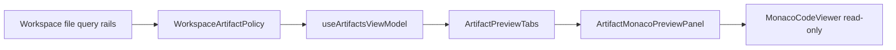

# Artifacts Workspace Project Files Plan

## Purpose

Make the Canvas-scoped Artifacts workbench show the project artifacts already
available through governed workspace file rails. The immediate product gap is
that Canvas can persist a workflow pipeline YAML and read the selected SQL
model, while Artifacts only recognizes dbt JSON files.

## Scope

- Keep `ListWorkspaceFiles` and `GetWorkspaceFileContent` as the owning query
  rails.
- Recognize dbt JSON artifacts, `pipelines/*.yaml|yml`, and
  `models/**/*.sql`.
- Render available artifact previews dynamically in the read-only Monaco viewer.
- Do not fabricate rows when the workspace does not contain recognized
  artifacts.

## Command And Query Rail

The owning rails are existing query rails. This slice does not introduce a
command rail because Artifacts is read-only.

| Product behavior                       | Rail                      | Type  | Owner                        |
| -------------------------------------- | ------------------------- | ----- | ---------------------------- |
| Discover available workspace artifacts | `ListWorkspaceFiles`      | query | `WorkspaceArtifactIndex`     |
| Load previewable artifact content      | `GetWorkspaceFileContent` | query | `WorkspaceArtifactPreview`   |
| Classify supported artifact files      | `ListWorkspaceFiles`      | query | `WorkspaceArtifactPolicy`    |
| Render a read-only artifact preview    | `GetWorkspaceFileContent` | query | `ArtifactPreviewDocumentMap` |

The read model reuses the workspace file rail output instead of adding parallel
artifact endpoints, route-local mock semantics, or a second artifact service.

## DDD Ownership

| Object                       | Kind                    | Responsibility                                                     |
| ---------------------------- | ----------------------- | ------------------------------------------------------------------ |
| `WorkspaceArtifactIndex`     | read model              | Index recognized artifact files from the scoped workspace tree.    |
| `WorkspaceArtifactPreview`   | read model              | Carry loaded artifact content, source path, label, and language.   |
| `WorkspaceArtifactPolicy`    | policy                  | Decide which workspace paths are product artifacts for this slice. |
| `ArtifactPreviewDocumentMap` | presentation read model | Provide dynamic preview documents keyed by artifact identity.      |
| `ArtifactMonacoPreviewPanel` | presentation adapter    | Adapt one preview document into the lazy read-only Monaco viewer.  |

The policy is intentionally conservative: dbt JSON artifacts remain supported,
and workflow project artifacts are limited to `pipelines/*.yaml|yml` and
`models/**/*.sql`. That keeps the read model product-specific without turning
Artifacts into a generic file browser.

## Component Boundary



Component rules:

- `workspaceQueries.ts` may classify and load workspace artifact records.
- `useArtifactsViewModel` may build route-local artifact rows and preview
  documents.
- `ArtifactPreviewTabs` may render dynamic document tabs, but must not own
  Monaco wiring.
- `ArtifactMonacoPreviewPanel` may map a document to `MonacoCodeViewer`, but
  must remain read-only and command-free.
- `ArtifactsView` remains a route composer and must not become the artifact
  classifier or Monaco owner.

## Fowler Analysis

- Boundary drift: Canvas persisted workflow files, but Artifacts only recognized
  dbt JSON names. Keep the boundary on workspace file query rails and extend
  classification inside that read model.
- Primitive obsession: file names were hard-coded as three string literals.
  Introduce explicit artifact identity, label, language, and kind on
  `WorkspaceArtifactRecord`.
- Parallel hierarchy: a new artifact endpoint or service would duplicate
  workspace file reads. Reuse `ListWorkspaceFiles` and
  `GetWorkspaceFileContent`.
- Shotgun surgery: hard-coded tabs required coordinated edits for each new
  artifact type. Render preview tabs from `ArtifactPreviewDocumentMap`.
- Test-only confidence: existing browser proof covered Code and Canvas
  persistence, not Artifacts usage. Add Cypress proof for `/canvas/artifacts`
  with workflow YAML and SQL artifacts.

The intended refactoring posture is to replace conditional UI shape with a
small read-model classification policy. The slice is not a generic artifact
platform, backend contract expansion, or workspace editor.

## Fowler Planning Matrix

| Scenario                                                                                                                     | Opportunity          | Fowler pattern                       | DDD owner                         | Rail                      | Implementation surfaces                                                                         | Unit or package test              | Architecture test                                    | User-flow test                            | Out of scope              |
| ---------------------------------------------------------------------------------------------------------------------------- | -------------------- | ------------------------------------ | --------------------------------- | ------------------------- | ----------------------------------------------------------------------------------------------- | --------------------------------- | ---------------------------------------------------- | ----------------------------------------- | ------------------------- |
| Artifacts discovers dbt, pipeline YAML, and SQL model files from workspace file trees.                                       | Boundary drift       | Gateway-backed read-model policy     | `WorkspaceArtifactClassification` | `ListWorkspaceFiles`      | `workspaceArtifactPolicy.ts`, `workspaceQueries.ts`                                             | `workspaceArtifactPolicy.test.ts` | `artifactsMonacoReadonlyViewer.architecture.test.ts` | `artifacts-workspace-project-files.cy.ts` | Generic file browser      |
| Artifacts previews classified artifact content with the right language and title.                                            | Primitive obsession  | Value-object classification metadata | `WorkspaceArtifactPreview`        | `GetWorkspaceFileContent` | `workspaceArtifactPolicy.ts`, `useArtifactsViewModel.ts`, `ArtifactMonacoPreviewPanel.tsx`      | `useArtifactsViewModel.test.tsx`  | `artifactsMonacoReadonlyViewer.architecture.test.ts` | `artifacts-workspace-project-files.cy.ts` | Editable artifact content |
| Tabs render the available artifact set without hard-coded dbt-only slots and list `View` selects the exact preview document. | Shotgun surgery      | Presentation read model              | `ArtifactPreviewDocumentMap`      | `GetWorkspaceFileContent` | `ArtifactsView.tsx`, `ArtifactsList.tsx`, `ArtifactPreviewTabs.tsx`, `constants.ts`, `types.ts` | `ArtifactsView.test.tsx`          | `artifactsMonacoReadonlyViewer.architecture.test.ts` | `artifacts-workspace-project-files.cy.ts` | Backend artifact catalog  |
| Unsupported files and directories do not become fake artifacts.                                                              | Test-only confidence | Negative semantic policy test        | `WorkspaceArtifactClassification` | `ListWorkspaceFiles`      | `workspaceArtifactPolicy.test.ts`, `useArtifactsViewModel.test.tsx`                             | `workspaceArtifactPolicy.test.ts` | `docs:feature-mechanization:implementation`          | `artifacts-workspace-project-files.cy.ts` | Silent fallback previews  |

```feature-mechanization
version: 1
featureId: ARTIFACTS-WORKSPACE-PROJECT-FILES
mechanizationStatus: implemented
noHumanDecisionsRemaining: true
implementationPlan: docs/planning/proposals/mandatory/frontend-and-ux/artifacts-workspace-project-files-plan-20260524.md
componentGuides:
  - docs/architecture/components/web/code-workbench-workspace-files-component.md
  - docs/architecture/components/web/artifacts/artifacts-monaco-readonly-viewer-component.md
userStories:
  - docs/architecture/components/web/code-workbench-workspace-files-user-stories.md
governingSources:
  - AGENTS.md
  - docs/planning/status/governance-document-rule-inventory.md
  - docs/architecture/command-query-rail-governance.md
  - docs/architecture/fowler-opportunity-planning-governance.md
  - docs/planning/state/planning-control-tower.md
  - docs/planning/roadmap/strategic-product-roadmap.md
allowedImplementationSurfaces:
  - apps/web/cypress/e2e/canvas/artifacts-workspace-project-files.cy.ts
  - apps/web/cypress/e2e/canvas/code-workbench-workspace-files.cy.ts
  - apps/web/src/app/queries/workspaceArtifactPolicy.test.ts
  - apps/web/src/app/queries/workspaceArtifactPolicy.ts
  - apps/web/src/app/queries/workspaceQueries.ts
  - apps/web/src/app/views/CodeView.test.tsx
  - apps/web/src/app/views/ArtifactsView.tsx
  - apps/web/src/app/views/ArtifactsView.test.tsx
  - apps/web/src/app/views/artifacts/ArtifactsList.tsx
  - apps/web/src/app/views/artifacts/ArtifactMonacoPreviewPanel.tsx
  - apps/web/src/app/views/artifacts/ArtifactPreviewTabs.tsx
  - apps/web/src/app/views/artifacts/artifactsMonacoReadonlyViewer.architecture.test.ts
  - apps/web/src/app/views/artifacts/constants.ts
  - apps/web/src/app/views/artifacts/types.ts
  - apps/web/src/app/views/artifacts/useArtifactsViewModel.test.tsx
  - apps/web/src/app/views/artifacts/useArtifactsViewModel.ts
  - docs/architecture/components/web/artifacts/artifacts-monaco-readonly-viewer-component.md
  - docs/planning/proposals/mandatory/frontend-and-ux/artifacts-workspace-project-files-plan-20260524.md
forbiddenImplementationSurfaces:
  - apps/api/**
  - packages/**
  - specs/**
commandQueryRails:
  - name: ListWorkspaceFiles
    type: query
    dddOwner: WorkspaceArtifactIndex
  - name: GetWorkspaceFileContent
    type: query
    dddOwner: WorkspaceArtifactPreview
domainObjects:
  - name: WorkspaceArtifactIndex
    type: read model
    owner: Canvas Artifacts workbench
  - name: WorkspaceArtifactPreview
    type: read model
    owner: Canvas Artifacts workbench
  - name: WorkspaceArtifactClassification
    type: policy
    owner: Canvas Artifacts workbench
fowlerSignals:
  - Boundary drift
  - Primitive obsession
  - Test-only confidence
architectureGuards:
  - pnpm docs:feature-mechanization:implementation -- --feature ARTIFACTS-WORKSPACE-PROJECT-FILES
cypressFlows:
  - pnpm --filter @dvt/web test:e2e:native -- --spec cypress/e2e/canvas/artifacts-workspace-project-files.cy.ts
  - pnpm --filter @dvt/web test:e2e:native -- --spec cypress/e2e/canvas/code-workbench-workspace-files.cy.ts
completionGate:
  - pnpm --filter @dvt/web exec vitest run --config vitest.presentation.config.ts src/app/views/artifacts/useArtifactsViewModel.test.tsx src/app/views/ArtifactsView.test.tsx
  - pnpm --filter @dvt/web typecheck
  - pnpm --filter @dvt/web lint
  - pnpm --filter @dvt/web test:e2e:native -- --spec cypress/e2e/canvas/artifacts-workspace-project-files.cy.ts
  - pnpm --filter @dvt/web test:e2e:native -- --spec cypress/e2e/canvas/code-workbench-workspace-files.cy.ts
  - pnpm planning:db:check
  - pnpm verify:prepush
redGreenCycles:
  - id: workspace-project-artifacts
    redTest: pnpm --filter @dvt/web exec vitest run --config vitest.presentation.config.ts src/app/views/artifacts/useArtifactsViewModel.test.tsx src/app/views/ArtifactsView.test.tsx
    expectedFailure: Artifacts does not expose pipelines/*.yaml or models/**/*.sql from workspace files.
    patchSurfaces:
      - apps/web/src/app/queries/workspaceArtifactPolicy.ts
      - apps/web/src/app/queries/workspaceQueries.ts
      - apps/web/src/app/views/ArtifactsView.tsx
      - apps/web/src/app/views/artifacts/ArtifactsList.tsx
      - apps/web/src/app/views/artifacts/useArtifactsViewModel.ts
      - apps/web/src/app/views/artifacts/ArtifactPreviewTabs.tsx
      - apps/web/src/app/views/artifacts/types.ts
    greenTest: pnpm --filter @dvt/web exec vitest run --config vitest.presentation.config.ts src/app/views/artifacts/useArtifactsViewModel.test.tsx src/app/views/ArtifactsView.test.tsx
  - id: feature-mechanization-closeout
    redTest: pnpm verify:prepush
    expectedFailure: New symbols are rejected until this feature mechanization manifest declares them.
    patchSurfaces:
      - docs/planning/proposals/mandatory/frontend-and-ux/artifacts-workspace-project-files-plan-20260524.md
    greenTest: pnpm docs:feature-mechanization:implementation -- --feature ARTIFACTS-WORKSPACE-PROJECT-FILES
symbols:
  - { name: WORKFLOW_PROJECT_FILE_TREE, path: apps/web/cypress/e2e/canvas/artifacts-workspace-project-files.cy.ts, dddOwner: WorkspaceArtifactIndex e2e fixture, cqRails: [ListWorkspaceFiles, GetWorkspaceFileContent], fowlerSignals: [Test-only confidence], architectureGuard: pnpm docs:feature-mechanization:implementation, cypressCoverage: apps/web/cypress/e2e/canvas/artifacts-workspace-project-files.cy.ts, unitTests: [apps/web/src/app/views/artifacts/useArtifactsViewModel.test.tsx] }
  - { name: CodeView.test.tsx, path: apps/web/src/app/views/CodeView.test.tsx, dddOwner: Code workbench project artifact presentation proof, cqRails: [ListWorkspaceFiles, GetWorkspaceFileContent], fowlerSignals: [Test-only confidence], architectureGuard: pnpm docs:feature-mechanization:implementation, cypressCoverage: apps/web/cypress/e2e/canvas/code-workbench-workspace-files.cy.ts, unitTests: [apps/web/src/app/views/CodeView.test.tsx] }
  - { name: file, path: apps/web/src/app/queries/workspaceArtifactPolicy.test.ts, dddOwner: WorkspaceArtifactClassification test fixture, cqRails: [ListWorkspaceFiles], fowlerSignals: [Test-only confidence], architectureGuard: pnpm docs:feature-mechanization:implementation, cypressCoverage: apps/web/cypress/e2e/canvas/artifacts-workspace-project-files.cy.ts, unitTests: [apps/web/src/app/queries/workspaceArtifactPolicy.test.ts] }
  - { name: workspaceArtifactPolicy.test.ts, path: apps/web/src/app/queries/workspaceArtifactPolicy.test.ts, dddOwner: WorkspaceArtifactClassification test, cqRails: [ListWorkspaceFiles], fowlerSignals: [Boundary drift, Primitive obsession, Test-only confidence], architectureGuard: pnpm docs:feature-mechanization:implementation, cypressCoverage: apps/web/cypress/e2e/canvas/artifacts-workspace-project-files.cy.ts, unitTests: [apps/web/src/app/queries/workspaceArtifactPolicy.test.ts] }
  - { name: stubArtifactsWorkbenchApis, path: apps/web/cypress/e2e/canvas/artifacts-workspace-project-files.cy.ts, dddOwner: WorkspaceArtifactPreview e2e fixture, cqRails: [ListWorkspaceFiles, GetWorkspaceFileContent], fowlerSignals: [Test-only confidence], architectureGuard: pnpm docs:feature-mechanization:implementation, cypressCoverage: apps/web/cypress/e2e/canvas/artifacts-workspace-project-files.cy.ts, unitTests: [apps/web/src/app/views/ArtifactsView.test.tsx] }
  - { name: WorkspaceArtifactMap, path: apps/web/src/app/queries/workspaceQueries.ts, dddOwner: WorkspaceArtifactIndex, cqRails: [ListWorkspaceFiles, GetWorkspaceFileContent], fowlerSignals: [Boundary drift], architectureGuard: pnpm docs:feature-mechanization:implementation, cypressCoverage: apps/web/cypress/e2e/canvas/artifacts-workspace-project-files.cy.ts, unitTests: [apps/web/src/app/views/artifacts/useArtifactsViewModel.test.tsx] }
  - { name: WORKSPACE_ARTIFACT_FILE_NAMES, path: apps/web/src/app/queries/workspaceArtifactPolicy.ts, dddOwner: WorkspaceArtifactClassification, cqRails: [ListWorkspaceFiles], fowlerSignals: [Primitive obsession], architectureGuard: pnpm docs:feature-mechanization:implementation, cypressCoverage: apps/web/cypress/e2e/canvas/artifacts-workspace-project-files.cy.ts, unitTests: [apps/web/src/app/queries/workspaceArtifactPolicy.test.ts] }
  - { name: WorkspaceArtifactFileName, path: apps/web/src/app/queries/workspaceArtifactPolicy.ts, dddOwner: WorkspaceArtifactClassification, cqRails: [ListWorkspaceFiles], fowlerSignals: [Primitive obsession], architectureGuard: pnpm docs:feature-mechanization:implementation, cypressCoverage: apps/web/cypress/e2e/canvas/artifacts-workspace-project-files.cy.ts, unitTests: [apps/web/src/app/queries/workspaceArtifactPolicy.test.ts] }
  - { name: normalizeWorkspacePath, path: apps/web/src/app/queries/workspaceArtifactPolicy.ts, dddOwner: WorkspaceArtifactClassification, cqRails: [ListWorkspaceFiles], fowlerSignals: [Primitive obsession], architectureGuard: pnpm docs:feature-mechanization:implementation, cypressCoverage: apps/web/cypress/e2e/canvas/artifacts-workspace-project-files.cy.ts, unitTests: [apps/web/src/app/queries/workspaceArtifactPolicy.test.ts] }
  - { name: WorkspaceArtifactKind, path: apps/web/src/app/queries/workspaceArtifactPolicy.ts, dddOwner: WorkspaceArtifactClassification, cqRails: [ListWorkspaceFiles], fowlerSignals: [Primitive obsession], architectureGuard: pnpm docs:feature-mechanization:implementation, cypressCoverage: apps/web/cypress/e2e/canvas/artifacts-workspace-project-files.cy.ts, unitTests: [apps/web/src/app/queries/workspaceArtifactPolicy.test.ts] }
  - { name: WorkspaceArtifactClassification, path: apps/web/src/app/queries/workspaceArtifactPolicy.ts, dddOwner: WorkspaceArtifactClassification, cqRails: [ListWorkspaceFiles], fowlerSignals: [Primitive obsession], architectureGuard: pnpm docs:feature-mechanization:implementation, cypressCoverage: apps/web/cypress/e2e/canvas/artifacts-workspace-project-files.cy.ts, unitTests: [apps/web/src/app/queries/workspaceArtifactPolicy.test.ts] }
  - { name: classifyWorkspaceArtifact, path: apps/web/src/app/queries/workspaceArtifactPolicy.ts, dddOwner: WorkspaceArtifactClassification, cqRails: [ListWorkspaceFiles, GetWorkspaceFileContent], fowlerSignals: [Boundary drift, Primitive obsession], architectureGuard: pnpm docs:feature-mechanization:implementation, cypressCoverage: apps/web/cypress/e2e/canvas/artifacts-workspace-project-files.cy.ts, unitTests: [apps/web/src/app/queries/workspaceArtifactPolicy.test.ts] }
  - { name: ArtifactFileName, path: apps/web/src/app/views/artifacts/constants.ts, dddOwner: WorkspaceArtifactPreview, cqRails: [GetWorkspaceFileContent], fowlerSignals: [Primitive obsession], architectureGuard: pnpm docs:feature-mechanization:implementation, cypressCoverage: apps/web/cypress/e2e/canvas/artifacts-workspace-project-files.cy.ts, unitTests: [apps/web/src/app/views/ArtifactsView.test.tsx] }
  - { name: ArtifactPreviewDocumentMap, path: apps/web/src/app/views/artifacts/constants.ts, dddOwner: WorkspaceArtifactPreview, cqRails: [GetWorkspaceFileContent], fowlerSignals: [Boundary drift], architectureGuard: pnpm docs:feature-mechanization:implementation, cypressCoverage: apps/web/cypress/e2e/canvas/artifacts-workspace-project-files.cy.ts, unitTests: [apps/web/src/app/views/ArtifactsView.test.tsx] }
  - { name: ArtifactsList, path: apps/web/src/app/views/artifacts/ArtifactsList.tsx, dddOwner: ArtifactPreviewDocumentMap presentation, cqRails: [GetWorkspaceFileContent], fowlerSignals: [Shotgun surgery], architectureGuard: pnpm docs:feature-mechanization:implementation, cypressCoverage: apps/web/cypress/e2e/canvas/artifacts-workspace-project-files.cy.ts, unitTests: [apps/web/src/app/views/ArtifactsView.test.tsx] }
  - { name: DbtArtifactFileName, path: apps/web/src/app/views/artifacts/constants.ts, dddOwner: WorkspaceArtifactClassification, cqRails: [ListWorkspaceFiles], fowlerSignals: [Primitive obsession], architectureGuard: pnpm docs:feature-mechanization:implementation, cypressCoverage: apps/web/cypress/e2e/canvas/artifacts-workspace-project-files.cy.ts, unitTests: [apps/web/src/app/views/artifacts/useArtifactsViewModel.test.tsx] }
  - { name: buildWorkspaceArtifactPreview, path: apps/web/src/app/views/artifacts/useArtifactsViewModel.ts, dddOwner: WorkspaceArtifactIndex, cqRails: [ListWorkspaceFiles], fowlerSignals: [Boundary drift], architectureGuard: pnpm docs:feature-mechanization:implementation, cypressCoverage: apps/web/cypress/e2e/canvas/artifacts-workspace-project-files.cy.ts, unitTests: [apps/web/src/app/views/artifacts/useArtifactsViewModel.test.tsx] }
  - { name: getPreviewTitle, path: apps/web/src/app/views/artifacts/useArtifactsViewModel.ts, dddOwner: WorkspaceArtifactPreview, cqRails: [GetWorkspaceFileContent], fowlerSignals: [Primitive obsession], architectureGuard: pnpm docs:feature-mechanization:implementation, cypressCoverage: apps/web/cypress/e2e/canvas/artifacts-workspace-project-files.cy.ts, unitTests: [apps/web/src/app/views/ArtifactsView.test.tsx] }
  - { name: getProjectArtifactType, path: apps/web/src/app/views/artifacts/useArtifactsViewModel.ts, dddOwner: WorkspaceArtifactClassification, cqRails: [ListWorkspaceFiles], fowlerSignals: [Boundary drift], architectureGuard: pnpm docs:feature-mechanization:implementation, cypressCoverage: apps/web/cypress/e2e/canvas/artifacts-workspace-project-files.cy.ts, unitTests: [apps/web/src/app/views/artifacts/useArtifactsViewModel.test.tsx] }
```

## Planning Disposition

- Action: classify this mandatory proposal through `E-PROP-DISP-1`; no standalone implementation starts from this document without Planning DB ownership.
