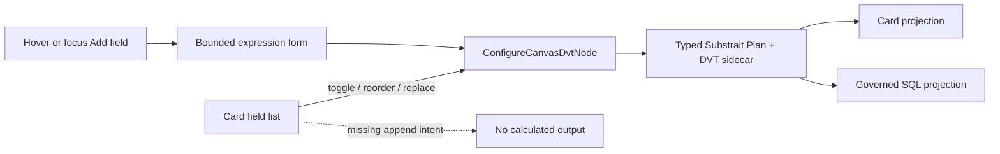

# Canvas Calculated Column Authoring Plan

## Intent

Issue #2833 adds one compact action below the last visible field. Hover or
keyboard focus reveals the action; activating it opens a bounded expression
form and appends one typed output to the card's canonical Substrait projection.

The first admitted expression kinds are:

- string literal;
- timestamp-with-time-zone literal;
- admitted unary scalar function over a selected field; and
- `row_number()` with an explicit ordering field.

`rowid` is product wording for the portable ordered row number. PostgreSQL
`ctid` and other physical row identifiers are not admitted.

## Current State And Decision



A physical Source does not gain a fabricated catalog column. On the first
calculated output it is promoted in place to a Transform with the same graph
identity and a self-contained `ReadRel -> ProjectRel`. The original source
binding remains in the plan sidecar. Existing projection-shaped Transforms
append to their current `ProjectRel`.

## Fowler Opportunity Matrix

| Scenario                             | Opportunity      | Pattern             | DDD owner                   | Rail                     | Test                                 | Out of scope     |
| ------------------------------------ | ---------------- | ------------------- | --------------------------- | ------------------------ | ------------------------------------ | ---------------- |
| Empty card gap has no action         | Missing intent   | Presentation Model  | Card field interaction      | `ConfigureCanvasDvtNode` | pointer and keyboard behavior        | permanent form   |
| Output exists only as visual row     | Hidden authority | Aggregate mutation  | Substrait Plan + sidecar    | `ConfigureCanvasDvtNode` | encode/reload and rejection          | local recipe     |
| Source calculation could fake schema | Boundary drift   | Explicit Projection | Source-backed semantic card | `ConfigureCanvasDvtNode` | promotion preserves physical binding | hidden Transform |

## Delivery Boundaries

- Mode: Full.
- One command rail: `ConfigureCanvasDvtNode`.
- One persisted authority: typed Substrait Plan plus stable DVT sidecar.
- Required negative paths: read-only posture, unsupported plan shape/provider,
  blank or duplicate alias, invalid timestamp, absent ordering/input field,
  unsupported capability, Cancel, and Escape.
- No free-form SQL, private expression IR, compatibility layer, hidden node,
  source-schema mutation, or provider runtime work.

```feature-mechanization
version: 1
featureId: CANVAS-CALCULATED-COLUMN-AUTHORING-2833
mechanizationStatus: implemented
noHumanDecisionsRemaining: true
implementationPlan: docs/planning/proposals/mandatory/frontend-and-ux/canvas-calculated-column-authoring-plan-20260902.md
componentGuides:
  - docs/architecture/components/web/graph/canvas-workbench-command-query-catalog.md
userStories:
  - https://github.com/dunay2/dvt/issues/2833
governingSources:
  - AGENTS.md
  - docs/planning/status/governance-document-rule-inventory.md
  - docs/guides/ai-work-protocol.md
  - docs/architecture/command-query-rail-governance.md
  - docs/architecture/fowler-opportunity-planning-governance.md
  - docs/adr/ADR-0064-substrait-semantic-reference-and-bounded-logical-profile.md
  - docs/planning/proposals/mandatory/runtime-and-contracts/vtx2-substrait-semantic-reference-design-20260824.md
allowedImplementationSurfaces:
  - apps/web/src/app/plugins/graph/**
  - apps/web/src/app/views/canvas/**
  - apps/web/cypress/e2e/canvas/**
  - packages/@dvt/contracts/src/contracts/planner/DvtSubstraitCapabilityCatalog.v1.ts
  - packages/@dvt/contracts/test/dvt-substrait-capability-catalog.contract.test.ts
  - docs/architecture/components/web/graph/canvas-workbench-command-query-catalog.md
  - docs/planning/proposals/mandatory/frontend-and-ux/canvas-calculated-column-authoring-plan-20260902.md
  - docs/evidence/**
  - docs/risk-register/quality/**
  - docs/**/index.md
  - docs/planning/status/**
forbiddenImplementationSurfaces:
  - packages/@dvt/engine/**
  - packages/@dvt/adapter-*/**
  - apps/api/**
commandQueryRails:
  - name: ConfigureCanvasDvtNode
    type: command
    dddOwner: DvtNodeAuthoringMetadata
domainObjects:
  - name: CanvasCalculatedColumnRequest
    type: value object
    owner: apps/web Canvas authoring
  - name: DvtSubstraitProjectionDraft
    type: aggregate state
    owner: typed Substrait Plan plus DVT sidecar
fowlerSignals:
  - Hidden authority
  - Primitive obsession
  - Boundary drift
  - Presentation Model
architectureGuards:
  - pnpm docs:feature-mechanization:implementation -- --feature CANVAS-CALCULATED-COLUMN-AUTHORING-2833
cypressFlows:
  - apps/web/cypress/e2e/canvas/canvas-calculated-column-authoring.cy.ts
completionGate:
  - pnpm --filter @dvt/contracts test
  - pnpm --filter @dvt/web test:unit:run
  - pnpm --filter @dvt/web test:presentation:run
  - pnpm --filter @dvt/web test:architecture:run
  - pnpm --filter @dvt/web lint
  - pnpm --filter @dvt/web typecheck
  - pnpm docs:feature-mechanization:implementation -- --feature CANVAS-CALCULATED-COLUMN-AUTHORING-2833
  - pnpm verify:prepush
redGreenCycles:
  - id: calculated-column-semantic-append
    redTest: pnpm --filter @dvt/web exec vitest run src/app/views/canvas/canvasCalculatedColumnAuthoring.test.ts
    expectedFailure: No canonical append-expression command exists.
    patchSurfaces:
      - apps/web/src/app/views/canvas/canvasCalculatedColumnAuthoring.ts
      - apps/web/src/app/views/canvas/canvasDvtSubstraitCalculatedColumn.ts
      - apps/web/src/app/views/canvas/canvasDvtSubstraitCalculatedExpression.ts
    greenTest: pnpm --filter @dvt/web exec vitest run src/app/views/canvas/canvasCalculatedColumnAuthoring.test.ts
  - id: calculated-column-card-gesture
    redTest: pnpm --filter @dvt/web exec vitest run src/app/plugins/graph/GraphNodeCalculatedColumnForm.test.tsx
    expectedFailure: The field-list gap has no accessible add action or bounded form.
    patchSurfaces:
      - apps/web/src/app/plugins/graph/GraphNodeCalculatedColumnForm.tsx
      - apps/web/src/app/plugins/graph/GraphNodeColumnSection.tsx
    greenTest: pnpm --filter @dvt/web exec vitest run src/app/plugins/graph/GraphNodeCalculatedColumnForm.test.tsx
symbols:
  - name: applyCanvasCalculatedColumn
    path: apps/web/src/app/views/canvas/canvasCalculatedColumnAuthoring.ts
    dddOwner: DVT calculated-column command
    cqRails: [ConfigureCanvasDvtNode]
    fowlerSignals: [Aggregate mutation, Hidden authority]
    architectureGuard: pnpm docs:feature-mechanization:implementation -- --feature CANVAS-CALCULATED-COLUMN-AUTHORING-2833
    cypressCoverage: apps/web/cypress/e2e/canvas/canvas-calculated-column-authoring.cy.ts
    unitTests: [apps/web/src/app/views/canvas/canvasCalculatedColumnAuthoring.test.ts]
  - name: GraphNodeCalculatedColumnForm
    path: apps/web/src/app/plugins/graph/GraphNodeCalculatedColumnForm.tsx
    dddOwner: Calculated-column presentation form
    cqRails: [ConfigureCanvasDvtNode]
    fowlerSignals: [Presentation Model]
    architectureGuard: pnpm docs:feature-mechanization:implementation -- --feature CANVAS-CALCULATED-COLUMN-AUTHORING-2833
    cypressCoverage: apps/web/cypress/e2e/canvas/canvas-calculated-column-authoring.cy.ts
    unitTests: [apps/web/src/app/plugins/graph/GraphNodeCalculatedColumnForm.test.tsx]
  - name: appendDvtSubstraitCalculatedColumn
    path: apps/web/src/app/views/canvas/canvasDvtSubstraitCalculatedColumn.ts
    dddOwner: DVT calculated projection aggregate
    cqRails: [ConfigureCanvasDvtNode]
    fowlerSignals: [Aggregate mutation, Hidden authority]
    architectureGuard: pnpm docs:feature-mechanization:implementation -- --feature CANVAS-CALCULATED-COLUMN-AUTHORING-2833
    cypressCoverage: apps/web/cypress/e2e/canvas/canvas-calculated-column-authoring.cy.ts
    unitTests: [apps/web/src/app/views/canvas/canvasCalculatedColumnAuthoring.test.ts]
```

## Completion

The slice is complete only when the new output survives save/reload, generated
PostgreSQL reflects the same expression, and unsupported requests leave the
draft unchanged.
