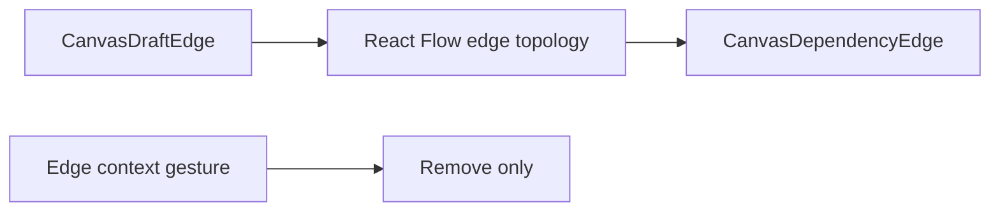
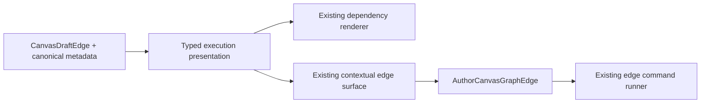

# Canvas Connection Valve Implementation Plan

## Governing sources

- `AGENTS.md`
- `docs/guides/ai-work-protocol.md`
- `docs/architecture/command-query-rail-governance.md`
- `docs/architecture/fowler-opportunity-planning-governance.md`
- `docs/architecture/components/web/graph/canvas-authoring-draft-boundary-component.md`
- `docs/architecture/components/web/graph/canvas-interaction-command-surface-component.md`
- `docs/planning/proposals/mandatory/frontend-and-ux/canvas-edge-execution-gate-plan-20260902.md`
- `docs/adr/ADR-0000-Code-generation-with-normative-traceability-required.en.md`
- GitHub issues #2579 and #2581

## Think-first analysis

### Problem and root cause

The persisted edge gate from #2579 is authoritative but has no Canvas presentation or
interaction. React Flow edges currently receive only topology and copy, while the edge
context surface only knows removal. Adding a renderer-local toggle would create a second
mutation mechanism; interpreting raw metadata independently in the menu and renderer would
duplicate the execution policy.

### Invariants

- Absence means open; only `executionGate: closed` persists.
- `executionDependency: false` remains structurally non-executable and cannot be enabled.
- Unknown gate metadata fails closed and exposes no enabling command.
- The renderer is presentation-only; the existing edge command runner remains mutation owner.
- Handles retain topology semantics. Open edges gain no permanent control or visual noise.
- Copy remains in the ES/EN Canvas catalog and state never relies on color alone.

### Options

1. **Selected: contextual command plus closed-state valve.** Project one typed edge execution
   presentation model, consume it in the existing renderer and context surface, and dispatch
   through `AuthorCanvasGraphEdge`.
2. Midpoint button plus context command: rejected because it adds a small pointer target and
   permanent interaction chrome without improving keyboard access.
3. New edge type, toolbar, store, or direct metadata setter: rejected as duplicate authority.
4. Third-party graph control: rejected; React Flow already owns edge rendering and selection,
   so no library or custom overlay manager is required.

## Current and target flow





## Fowler planning matrix

| Scenario                   | Opportunity         | Pattern                   | DDD owner                             | Rail                                        | Proof                               | Out of scope                   |
| -------------------------- | ------------------- | ------------------------- | ------------------------------------- | ------------------------------------------- | ----------------------------------- | ------------------------------ |
| Render open/closed truth   | Primitive obsession | Presentation Model        | Canvas connection projection          | `ResolveCanvasContextMenu` query/read model | model + renderer behavior tests     | data-flow animation            |
| Toggle a gate              | Duplicate semantics | Command adapter           | Canvas connection aggregate           | `AuthorCanvasGraphEdge` command             | presenter + viewport behavior tests | direct metadata mutation       |
| Reject structural enabling | Hidden authority    | Fail-closed policy        | Workspace graph edge execution policy | `AuthorCanvasGraphEdge` command             | non-gateable negative tests         | changing structural permission |
| Preserve reload truth      | Feature envy        | Projection from aggregate | Canvas draft session                  | existing draft query/save rails             | Cypress close/reload/open flow      | runtime redesign               |

## Pre-implementation brief

- **Mode:** Full.
- **Primary interaction:** existing edge context surface only.
- **Visual result:** open stays normal; closed uses dash, opacity and a centered non-interactive
  gate glyph while retaining the direction cue and selection state.
- **Risk mitigation:** the menu consumes the same typed projection as the renderer and invokes
  the existing runner; behavior tests cover invalid/structural metadata and reload.
- **Microcommits:** presentation projection, contextual command wiring, user-flow proof, closeout.
- **Validation:** focused Canvas tests, web typecheck/lint, Cypress spec, feature mechanization, governance refresh and `pnpm verify:prepush`.

## Feature mechanization

```feature-mechanization
version: 1
featureId: FLOW1-CANVAS-CONNECTION-VALVE-2581
mechanizationStatus: implemented
noHumanDecisionsRemaining: true
implementationPlan: docs/planning/proposals/mandatory/frontend-and-ux/canvas-connection-valve-plan-20260903.md
componentGuides:
  - docs/architecture/components/web/graph/canvas-authoring-draft-boundary-component.md
  - docs/architecture/components/web/graph/canvas-interaction-command-surface-component.md
governingSources:
  - AGENTS.md
  - docs/architecture/command-query-rail-governance.md
  - docs/architecture/fowler-opportunity-planning-governance.md
  - docs/adr/ADR-0000-Code-generation-with-normative-traceability-required.en.md
  - docs/planning/proposals/mandatory/frontend-and-ux/canvas-edge-execution-gate-plan-20260902.md
userStories:
  - As a Canvas author, I can see and toggle whether a retained connection participates in execution.
domainObjects:
  - Canvas connection aggregate
fowlerSignals:
  - Primitive obsession
  - Duplicate semantics
  - Hidden authority
allowedImplementationSurfaces:
  - apps/web/src/app/views/canvas/canvasDependencyEdgeModel.ts
  - apps/web/src/app/views/canvas/canvasDependencyEdgeModel.test.ts
  - apps/web/src/app/views/canvas/CanvasDependencyEdge.tsx
  - apps/web/src/app/views/canvas/CanvasDependencyEdge.test.tsx
  - apps/web/src/app/views/canvas/useCanvasViewportGraphModel.ts
  - apps/web/src/app/views/canvas/useCanvasViewportGraphModel.edges.test.tsx
  - apps/web/src/app/views/canvas/canvasAuthoringGraphProjection.ts
  - apps/web/src/app/views/canvas/canvasNodeMapper.ts
  - apps/web/src/app/plugins/graph/graphVisualTokens.ts
  - apps/web/src/app/views/canvas/canvasInteractionCommandSurface.ts
  - apps/web/src/app/views/canvas/canvasEdgeExecutionContextMenu.test.ts
  - apps/web/src/app/views/canvas/canvasContextMenuPresenter.types.ts
  - apps/web/src/app/views/canvas/useCanvasContextMenuPresenter.ts
  - apps/web/src/app/views/canvas/useCanvasContextMenuPresenter.graphActions.test.tsx
  - apps/web/src/app/views/canvas/useCanvasEdgeAuthoringHandlers.ts
  - apps/web/src/app/views/canvas/canvasControllerViewModel.ts
  - apps/web/src/app/views/canvas/canvasShell*.ts*
  - apps/web/src/app/views/canvas/CanvasShell.tsx
  - apps/web/src/app/views/canvas/CanvasViewport.tsx
  - apps/web/src/app/views/canvas/canvasCopy*
  - apps/web/cypress/e2e/canvas/canvas-connection-valve.cy.ts
  - docs/planning/proposals/mandatory/frontend-and-ux/canvas-connection-valve-plan-20260903.md
  - docs/planning/closeouts/FLOW1-CANVAS-CONNECTION-VALVE-2581-closeout.md
  - docs/.manifest.json
  - docs/**/index.md
forbiddenImplementationSurfaces:
  - packages/@dvt/contracts/**
  - packages/@dvt/engine/**
  - packages/@dvt/planner/**
  - packages/@dvt/adapter-*/**
  - apps/api/**
commandQueryRails:
  - name: AuthorCanvasGraphEdge
    type: command
    status: implemented
    dddOwner: Canvas connection aggregate
    applicationPort: Existing Canvas edge command runner
    adapterSurface: Existing Canvas context-menu presenter
    authorizationScope: Current writable Canvas graph draft
    negativeTests:
      - a structurally non-executable edge cannot dispatch an enabling command
      - invalid gate metadata exposes no gate command
  - name: ResolveCanvasContextMenu
    type: query
    status: implemented
    dddOwner: Canvas contextual action read model
    applicationPort: Existing Canvas interaction query seam
    adapterSurface: Existing Canvas context-menu view
    authorizationScope: Current Canvas graph presentation
    negativeTests:
      - read-only Canvas exposes no gate mutation
architectureGuards:
  - pnpm docs:feature-mechanization:implementation --feature FLOW1-CANVAS-CONNECTION-VALVE-2581
cypressFlows:
  - apps/web/cypress/e2e/canvas/canvas-connection-valve.cy.ts
completionGate:
  - pnpm --filter @dvt/web test:canvas
  - pnpm --filter @dvt/web typecheck
  - pnpm --filter @dvt/web lint
  - pnpm governance:refresh
  - pnpm verify:prepush
redGreenCycles:
  - id: edge-execution-presentation
    redTest: apps/web/src/app/views/canvas/canvasDependencyEdgeModel.test.ts
    expectedFailure: No typed read model projects shared gate semantics into the React Flow edge.
    patchSurfaces:
      - apps/web/src/app/views/canvas/canvasDependencyEdgeModel.ts
      - apps/web/src/app/views/canvas/useCanvasViewportGraphModel.ts
      - apps/web/src/app/views/canvas/CanvasDependencyEdge.tsx
    greenTest: apps/web/src/app/views/canvas/canvasDependencyEdgeModel.test.ts
  - id: governed-gate-context-command
    redTest: apps/web/src/app/views/canvas/canvasEdgeExecutionContextMenu.test.ts
    expectedFailure: The edge context model cannot expose or dispatch the existing gate command.
    patchSurfaces:
      - apps/web/src/app/views/canvas/canvasInteractionCommandSurface.ts
      - apps/web/src/app/views/canvas/useCanvasContextMenuPresenter.ts
      - apps/web/src/app/views/canvas/useCanvasEdgeAuthoringHandlers.ts
    greenTest: apps/web/src/app/views/canvas/canvasEdgeExecutionContextMenu.test.ts
symbols:
  - { name: CanvasDependencyEdgeData, path: apps/web/src/app/views/canvas/canvasDependencyEdgeModel.ts, dddOwner: Canvas connection presentation, cqRails: [ResolveCanvasContextMenu], fowlerSignals: [Presentation Model], architectureGuard: pnpm docs:feature-mechanization:implementation --feature FLOW1-CANVAS-CONNECTION-VALVE-2581, cypressCoverage: apps/web/cypress/e2e/canvas/canvas-connection-valve.cy.ts, unitTests: [pnpm --filter @dvt/web test:canvas] }
  - { name: buildCanvasDependencyEdgeData, path: apps/web/src/app/views/canvas/canvasDependencyEdgeModel.ts, dddOwner: Canvas connection presentation, cqRails: [ResolveCanvasContextMenu], fowlerSignals: [Replace primitive with object], architectureGuard: pnpm docs:feature-mechanization:implementation --feature FLOW1-CANVAS-CONNECTION-VALVE-2581, cypressCoverage: apps/web/cypress/e2e/canvas/canvas-connection-valve.cy.ts, unitTests: [pnpm --filter @dvt/web test:canvas] }
  - { name: readCanvasDependencyEdgeData, path: apps/web/src/app/views/canvas/canvasDependencyEdgeModel.ts, dddOwner: Canvas connection presentation, cqRails: [ResolveCanvasContextMenu], fowlerSignals: [Presentation Model], architectureGuard: pnpm docs:feature-mechanization:implementation --feature FLOW1-CANVAS-CONNECTION-VALVE-2581, cypressCoverage: apps/web/cypress/e2e/canvas/canvas-connection-valve.cy.ts, unitTests: [pnpm --filter @dvt/web test:canvas] }
```
