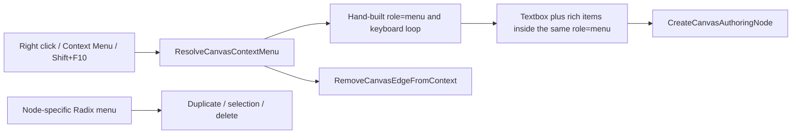

# Canvas Contextual Surface Convergence Plan

## Decision

Converge the surviving Canvas contextual path without adding another creation
entry, command, store, backend route, or design system. Empty-pane right click,
the Context Menu key, and Shift+F10 resolve the existing Canvas action model.
The simple pane and edge action surfaces reuse the shared Radix context-menu
primitive. `Add Component` transfers to a separate, modal, searchable catalog
with dialog semantics and grouped action buttons. Node right click remains
product-neutral; node double click and Enter continue to open the existing Node
Properties surface with Code first when available.

The slice reuses the existing rails:

- `ResolveCanvasContextMenu` derives pane or edge actions;
- `RenderCanvasContextMenu` projects those actions without graph authority;
- `CreateCanvasAuthoringNode` creates the selected governed node kind;
- `RemoveCanvasEdgeFromContext` removes the selected edge;
- `ConfigureApplicationLanguage` supplies reactive `en | es` copy;
- `CanvasRouteChromeVisualTokenQuery` supplies the existing visual-token layer.

## Current State



The root and edge surfaces duplicate behavior already owned by the shared
Radix primitive. The catalog overloads that menu with a second focus model. Two
visible literals bypass the locale catalog, and the node shell still exposes a
DVT-specific right-click surface prohibited by the product contract.

## Target State

```mermaid
flowchart LR
  Gesture[Right click / Context Menu / Shift+F10]
  Resolve[ResolveCanvasContextMenu]
  Menu[Shared Radix ContextMenu]
  Dialog[Shared Dialog host]
  Search[Localized search and grouped buttons]
  Create[CreateCanvasAuthoringNode]
  Edge[RemoveCanvasEdgeFromContext]
  Node[Node shell]
  Properties[Node Properties, Code first]

  Gesture --> Resolve --> Menu
  Menu -->|Add Component| Dialog --> Search --> Create
  Menu -->|Edge target| Edge
  Node -->|Double click / Enter| Properties
  Node -->|Right click| Browser-neutral outcome
```

## Think-First Analysis

### Root cause

One route-local presentation primitive accumulated two distinct interaction
patterns: a short command menu and a searchable rich catalog. Manual focus,
positioning, and keyboard code became a second primitive authority even though
the repository already provides Radix-backed context-menu and dialog
components. Localization was projected around the surface but not made the
only source of visible and accessible copy. Separately, the node shell retained
a node-action menu after product ownership moved those intents away from node
right click.

### Constraints and invariants

- The fixed `Add Component` button remains absent.
- Pane right click and keyboard equivalents are the only Canvas creation entry.
- Node right click exposes no DVT-specific action.
- Node double click and Enter keep their existing Node Properties behavior.
- React Flow remains a projection, not graph mutation authority.
- The catalog cannot mutate the graph directly.
- English and Spanish visible copy and accessible names come from one reactive
  copy projection.
- No API, database, contract, engine, adapter, planner, migration, new store,
  generic menu framework, or third locale is authorized.

### ARIA and screen-reader decision

The root and edge surfaces implement the ARIA menu pattern through the existing
Radix `ContextMenu` primitive: one named command surface, roving focus,
Arrow/Home/End navigation, Enter/Space activation, Escape close, typeahead, and
focus restoration.

The Add Component catalog implements the modal dialog pattern, not menu,
listbox, or combobox. The dialog has a localized title and description, moves
initial focus to the localized search input, traps focus while open, exposes
each category with an accessible group name, renders rich catalog results as
ordinary buttons, closes with Escape or its localized close control, and
returns focus to the Canvas opener. This avoids listbox semantics because the
multi-line result descriptions must remain perceivable; ARIA listbox options
flatten semantic descendants for assistive technology.

Primary pattern references:

- <https://www.w3.org/WAI/ARIA/apg/patterns/menu-button/>
- <https://www.w3.org/WAI/ARIA/apg/patterns/dialog-modal/>
- <https://www.w3.org/WAI/ARIA/apg/patterns/listbox/>
- <https://www.radix-ui.com/primitives/docs/components/context-menu>

### Shared-primitive spike evidence

On `origin/main@bf3813942a9167fa0a2cd7af06ebf42bc944400c`, a focused disposable
Vitest spike proved all of the following without leaving a production branch:

1. the shared controlled Radix context-menu opens from a real pointer
   `contextmenu` event;
2. Context Menu and Shift+F10 can reuse that exact route by dispatching a
   deterministic synthetic `contextmenu` event from the focused Canvas opener;
3. selecting Add Component can close the menu and transfer focus to a separate
   dialog search field;
4. explicit focus handoff is required because menu close restoration and
   dialog autofocus otherwise race.

Proof command:

```text
pnpm --filter @dvt/web test:canvas-presentation:run -- src/app/views/canvas/CanvasContextMenuRadixReuse.spike.test.tsx
```

Result: `1 file passed; 2 tests passed`. The spike file was deleted after the
run. The selected production primitives are the existing
`components/ui/context-menu.tsx` and `components/ui/dialog.tsx`; neither gains
a Canvas-specific branch.

### Options

| Option                                             | Decision | Rationale                                                                  |
| -------------------------------------------------- | -------- | -------------------------------------------------------------------------- |
| Polish the hand-built menu only                    | Rejected | Preserves duplicate menu and focus authority.                              |
| Put search and descriptions in one long Radix menu | Rejected | Conflates command-menu and rich catalog semantics.                         |
| Add a permanent toolbar button or palette          | Rejected | Violates the approved single creation entry.                               |
| Shared Radix menu plus shared modal dialog         | Selected | Smallest coherent reuse with correct semantics and existing command rails. |

## Fowler Opportunity Matrix

| Scenario                             | Opportunity                            | Fowler pattern / refactoring                   | DDD owner                       | Command/query rail                                      | Implementation surfaces               | Unit/package proof                      | Architecture proof                        | User-flow proof                       | Out of scope             |
| ------------------------------------ | -------------------------------------- | ---------------------------------------------- | ------------------------------- | ------------------------------------------------------- | ------------------------------------- | --------------------------------------- | ----------------------------------------- | ------------------------------------- | ------------------------ |
| Open pane or edge actions            | Duplicate mechanism / hidden authority | Replace Local Mechanism; Presentation Model    | `CanvasContextMenuModel`        | `ResolveCanvasContextMenu`, `RenderCanvasContextMenu`   | contextual host, presenter, lifecycle | pointer and keyboard equivalence        | one shared menu primitive                 | pane and edge Cypress                 | new menu framework       |
| Search and select a component        | Responsibility overload                | Extract Component; separate semantic surface   | `CanvasComponentCatalog`        | `ResolveCanvasContextMenu`, `CreateCanvasAuthoringNode` | catalog dialog and model              | grouping, filtering, focus, empty state | catalog has no graph mutation             | create from real right click          | new node kinds           |
| Switch ES/EN while a surface is open | Primitive obsession / divergent change | Replace Magic Literal; one reactive projection | `ApplicationLanguagePreference` | `ConfigureApplicationLanguage`                          | copy catalogs and projections         | complete EN/ES matrix                   | functional literals stay in copy boundary | live locale switch                    | third locale             |
| Right click a node                   | Duplicate product intent               | Remove Dead Code; preserve surviving owner     | Canvas node interaction policy  | `InspectCanvasNode` for double click/Enter only         | node shell and architecture guards    | no node action menu                     | deleted topology asserted                 | right click does nothing DVT-specific | redesign Node Properties |
| Use compact or zoomed screens        | Test-only confidence                   | Encapsulate viewport constraints               | Web visual-token layer          | `CanvasRouteChromeVisualTokenQuery`                     | shared surfaces and acceptance tests  | no horizontal clipping                  | no raw palette or parallel tokens         | 1366/1920, 100/200%, ES/EN            | full Canvas redesign     |

## Pre-Implementation Brief

- Mode: Full.
- Scope: one shared root/edge menu, one separate searchable dialog catalog,
  complete contextual ES/EN copy, neutral node right click, and acceptance
  evidence for visibility and accessibility.
- Expected outcome: all supported gestures reach the same existing product
  intents with no duplicate entry, mixed language, clipped result, or competing
  focus owner.
- Negative coverage: node right click exposes no DVT actions; unavailable graph
  mutations stay absent; Escape never loses focus; a failed creation is not
  presented as success; no catalog component owns graph state.
- Libraries evaluated: the already-installed Radix-backed shared
  `ContextMenu` and `Dialog` primitives only.
- Residual opportunity: #2291 owns Node Properties and execution behavior and
  is not changed by this corrective slice.

## Browser Baseline Evidence Contract

The baseline was captured before the first production edit from
`origin/main@bf3813942a9167fa0a2cd7af06ebf42bc944400c` against the isolated stack
at `http://127.0.0.1:5180/canvas`. Files are retained under
`C:/Users/jasim/.codex/artifacts/issue-2310/baseline/` and named with commit,
locale, viewport, zoom, surface, and input mode. Required matrix:

| Locale | Viewport  | Zoom       | Required states                     |
| ------ | --------- | ---------- | ----------------------------------- |
| ES     | 1366x768  | 100%, 200% | pane menu and Add Component catalog |
| ES     | 1920x1080 | 100%, 200% | pane menu and Add Component catalog |
| EN     | 1366x768  | 100%, 200% | pane menu and Add Component catalog |
| EN     | 1920x1080 | 100%, 200% | pane menu and Add Component catalog |

All 16 required PNGs exist with the declared physical dimensions: two states
for each locale, viewport, and zoom combination. The 200% records use a CDP
device-metrics override with half-size CSS viewports and device scale factor 2,
so responsive layout executes at the same effective CSS viewport while the
artifact retains the requested physical dimensions.

Accessibility snapshots and DOM measurements record these baseline findings:

- the catalog search field and rich results are descendants of the same
  `role="menu"` surface;
- initial focus lands on the first result `menuitem`, not the search field;
- the surface is fixed at 288 CSS px wide at both supported viewports;
- the 1366x768/200% catalog has only 272 CSS px of visible height and requires
  internal scrolling;
- the visible search placeholder is truncated at 1366x768/100% and more
  severely at 200%;
- document-level horizontal overflow is absent, but reachability is achieved by
  clipping content into a narrow internal scroller rather than responsive
  reflow.

Representative files:

- `bf381394-es-1366x768-200-catalog-pointer.png`;
- `bf381394-en-1366x768-100-catalog-pointer.png`;
- `bf381394-es-1920x1080-200-menu-pointer.png`;
- `bf381394-en-1920x1080-100-menu-pointer.png`.

The same matrix is repeated against the exact pushed head for before/after
comparison.

## Independent QA Fixture

- Reviewer: `final_fowler_qa` (Ramanujan), independent of implementation.
- Review target: exact pushed head, never an uncommitted working tree.
- Fixture: empty Canvas at 1366x768 and 1920x1080, 100% and 200%, ES and EN.
- Required actions: pane right click, Context Menu key, Shift+F10, open/search/
  close Add Component, create one governed item, edge right click, node right
  click, node double click, locale switch, keyboard-only traversal, and axe plus
  screen-reader semantic inspection.
- Blocking classes: duplicate entry or authority, mixed language, clipped or
  unreachable content, incorrect role/name, lost or stolen focus, node-specific
  right-click action, command bypass, or serious/critical accessibility result.

## Acceptance

1. Pane right click, Context Menu, and Shift+F10 open the same localized action
   model through the shared context-menu primitive.
2. Add Component opens one searchable modal dialog with localized title,
   description, close label, search label, categories, actions, descriptions,
   and empty state.
3. Choosing a component dispatches the existing command at the captured flow
   position and closes the dialog.
4. Edge right click exposes only the correctly localized existing removal
   action when authorized.
5. Node right click exposes no DVT-specific UI; double click and Enter continue
   to open Node Properties with Code first where supported.
6. The fixed Add Component button remains absent.
7. Locale changes update the next and currently open contextual surface without
   reload and agree with `document.documentElement.lang`.
8. The capture matrix has no horizontally clipped, unreachable, or invisible
   actions at 100% or 200% zoom; 400% has an explicitly recorded reflow result.
9. Pointer, keyboard, screen-reader, forced-colors, and axe serious/critical
   paths pass on the exact pushed head.

## Microcommit Sequence

Each commit is independently green for its declared scope; red tests are run
and recorded immediately before the smallest corresponding production patch.

1. `docs(docs): Declare Canvas contextual surface convergence plan`
2. `refactor(web): Reuse the shared Canvas command menu primitive`
3. `refactor(web): Separate the searchable component catalog dialog`
4. `fix(web): Localize all Canvas contextual actions`
5. `fix(web): Keep node right click free of product actions`
6. `test(web): Prove Canvas contextual accessibility and visibility`
7. `docs(docs): Close Canvas contextual surface convergence evidence`

## Feature Mechanization

```feature-mechanization
version: 1
featureId: CANVAS-CONTEXTUAL-SURFACE-CONVERGENCE-20260812
mechanizationStatus: implemented
noHumanDecisionsRemaining: true
implementationPlan: docs/planning/proposals/mandatory/frontend-and-ux/canvas-contextual-surface-convergence-plan-20260812.md
componentGuides:
  - docs/architecture/components/web/graph/canvas-interaction-command-surface-component.md
  - docs/architecture/components/web/graph/canvas-interaction-command-surface-user-stories.md
  - docs/architecture/components/web/graph/canvas-workbench-command-query-catalog.md
  - docs/architecture/command-query-rail-governance.md
  - docs/architecture/fowler-opportunity-planning-governance.md
userStories:
  - As a Canvas author, I open one contextual action surface from pane right click or its keyboard equivalent.
  - As a Canvas author, I search a fully visible localized component catalog and create through the existing command.
  - As a keyboard or screen-reader user, I encounter correct menu and dialog semantics with deterministic focus restoration.
  - As a Canvas author, node right click does not duplicate node actions and double click still opens Node Properties.
governingSources:
  - AGENTS.md
  - docs/guides/ai-work-protocol.md
  - docs/architecture/command-query-rail-governance.md
  - docs/architecture/fowler-opportunity-planning-governance.md
  - docs/architecture/components/web/graph/canvas-interaction-command-surface-component.md
  - docs/architecture/components/web/graph/canvas-interaction-command-surface-user-stories.md
  - docs/architecture/components/web/graph/canvas-workbench-command-query-catalog.md
allowedImplementationSurfaces:
  - apps/web/src/app/components/canvas/CanvasNodeContextMenuPrimitives.tsx
  - apps/web/src/app/components/canvas/CanvasNodeContextMenuView.tsx
  - apps/web/src/app/components/canvas/CanvasNodeContextMenuView.test.tsx
  - apps/web/src/app/components/canvas/CanvasNodeShell.tsx
  - apps/web/src/app/components/canvas/CanvasNodeShell.test.tsx
  - apps/web/src/app/components/canvas/DbtNodeComponent.tsx
  - apps/web/src/app/components/canvas/DbtNodeComponent.architecture.test.ts
  - apps/web/src/app/components/canvas/canvasNodeContextMenuModel.ts
  - apps/web/src/app/components/canvas/canvasNodeContextMenuModel.test.ts
  - apps/web/src/app/views/canvas/CanvasAddNodeCatalogView.tsx
  - apps/web/src/app/views/canvas/CanvasAddNodeCatalogView.test.tsx
  - apps/web/src/app/views/canvas/CanvasContextMenuLayer.tsx
  - apps/web/src/app/views/canvas/CanvasContextMenuPrimitives.tsx
  - apps/web/src/app/views/canvas/CanvasContextMenuView.tsx
  - apps/web/src/app/views/canvas/CanvasContextMenuView.test.tsx
  - apps/web/src/app/views/canvas/CanvasContextMenuView.architecture.test.tsx
  - apps/web/src/app/views/canvas/CanvasShell.tsx
  - apps/web/src/app/views/canvas/CanvasShell.architecture.test.tsx
  - apps/web/src/app/views/canvas/CanvasShell.contextMenuIntegration.test.tsx
  - apps/web/src/app/views/canvas/CanvasViewport.tsx
  - apps/web/src/app/views/canvas/CanvasViewport.test.tsx
  - apps/web/src/app/views/canvas/CanvasViewportSurfaceView.tsx
  - apps/web/src/app/views/canvas/CanvasViewport.architecture.test.ts
  - apps/web/src/app/views/canvas/CanvasViewport.contextMenu.test.tsx
  - apps/web/src/app/views/canvas/CanvasViewport.edgeContextMenu.test.tsx
  - apps/web/src/app/views/canvas/CanvasViewport.keyboardContextMenu.test.tsx
  - apps/web/src/app/views/canvas/canvasContextMenuPresenter.types.ts
  - apps/web/src/app/views/canvas/canvasContextMenuViewModel.ts
  - apps/web/src/app/views/canvas/canvasContextMenuViewModel.test.ts
  - apps/web/src/app/views/canvas/canvasCopy.types.ts
  - apps/web/src/app/views/canvas/canvasCopyCatalog.toolbar.ts
  - apps/web/src/app/views/canvas/canvasCopyCatalog.toolbar.es.ts
  - apps/web/src/app/views/canvas/canvasInteractionCommandSurface.ts
  - apps/web/src/app/views/canvas/canvasInteractionCommandSurface.test.ts
  - apps/web/src/app/views/canvas/canvasInteractionCommandSurface.architecture.test.ts
  - apps/web/src/app/views/canvas/canvasNodeWorkbenchHardening.architecture.test.ts
  - apps/web/src/app/views/canvas/useCanvasContextMenuLifecycle.ts
  - apps/web/src/app/views/canvas/useCanvasContextMenuPresenter.ts
  - apps/web/src/app/views/canvas/useCanvasContextMenuPresenter.canvasActions.test.tsx
  - apps/web/src/app/views/canvas/useCanvasContextMenuPresenter.graphActions.test.tsx
  - apps/web/src/app/views/canvas/useCanvasContextMenuPresenter.lifecycle.test.tsx
  - apps/web/src/testing/vitestSuites.changedRouting.architecture.test.ts
  - apps/web/cypress/e2e/shell/canvas-workbench-screen-composition.cy.ts
  - docs/architecture/components/web/graph/canvas-interaction-command-surface-component.md
  - docs/architecture/components/web/graph/canvas-interaction-command-surface-user-stories.md
  - docs/architecture/components/web/graph/canvas-workbench-command-query-catalog.md
  - docs/planning/proposals/mandatory/frontend-and-ux/canvas-contextual-surface-convergence-plan-20260812.md
  - docs/planning/status/generated-code-state.md
forbiddenImplementationSurfaces:
  - apps/api/**
  - packages/@dvt/contracts/**
  - packages/@dvt/engine/**
  - packages/@dvt/planner/**
  - packages/@dvt/adapter-*/**
  - infra/db/**
  - tools/planning-db/**
commandQueryRails:
  - name: ResolveCanvasContextMenu
    type: query
    status: implemented
    dddOwner: CanvasContextMenuModel
  - name: RenderCanvasContextMenu
    type: query
    status: implemented
    dddOwner: CanvasContextMenuLayer
  - name: CreateCanvasAuthoringNode
    type: command
    status: implemented
    dddOwner: Canvas node admission
  - name: RemoveCanvasEdgeFromContext
    type: command
    status: implemented
    dddOwner: Canvas graph lifecycle
  - name: ConfigureApplicationLanguage
    type: command
    status: implemented
    dddOwner: ApplicationLanguagePreference
  - name: CanvasRouteChromeVisualTokenQuery
    type: query
    status: implemented
    dddOwner: Web visual-token layer
domainObjects:
  - name: CanvasContextMenuModel
    type: read model
    owner: Canvas contextual interaction
  - name: CanvasComponentCatalog
    type: read model
    owner: Canvas node-kind presentation
  - name: ApplicationLanguagePreference
    type: value object
    owner: Web application language
  - name: CanvasGraphDraft
    type: aggregate
    owner: Canvas authoring
symbols:
  - path: apps/web/src/app/views/canvas/CanvasContextMenuView.tsx
    name: CanvasContextMenuView
    kind: function
    exported: true
    dddOwner: Canvas contextual presentation
    cqRails: [ResolveCanvasContextMenu, RenderCanvasContextMenu]
    fowlerSignals: [Duplicate mechanism, Hidden authority]
    architectureGuard: pnpm --filter @dvt/web test:canvas-presentation:run
    cypressCoverage: apps/web/cypress/e2e/shell/canvas-workbench-screen-composition.cy.ts
    unitTests: [pnpm --filter @dvt/web test:canvas-presentation:run]
  - path: apps/web/src/app/views/canvas/CanvasAddNodeCatalogView.tsx
    name: CanvasAddNodeCatalogView
    kind: function
    exported: true
    dddOwner: CanvasComponentCatalog
    cqRails: [ResolveCanvasContextMenu, CreateCanvasAuthoringNode]
    fowlerSignals: [Responsibility overload]
    architectureGuard: pnpm --filter @dvt/web test:canvas-presentation:run
    cypressCoverage: apps/web/cypress/e2e/shell/canvas-workbench-screen-composition.cy.ts
    unitTests: [pnpm --filter @dvt/web test:canvas-presentation:run]
  - path: apps/web/src/app/views/canvas/canvasInteractionCommandSurface.ts
    name: buildCanvasContextMenuModel
    kind: function
    exported: true
    dddOwner: CanvasContextMenuModel
    cqRails: [ResolveCanvasContextMenu]
    fowlerSignals: [Primitive obsession, Divergent change]
    architectureGuard: pnpm --filter @dvt/web test:canvas
    cypressCoverage: apps/web/cypress/e2e/shell/canvas-workbench-screen-composition.cy.ts
    unitTests: [pnpm --filter @dvt/web test:canvas]
  - path: apps/web/src/app/components/canvas/CanvasNodeShell.tsx
    name: CanvasNodeShell
    kind: function
    exported: true
    dddOwner: Canvas node interaction policy
    cqRails: [InspectCanvasNode]
    fowlerSignals: [Duplicate product intent, Dead code]
    architectureGuard: pnpm --filter @dvt/web test:canvas
    cypressCoverage: apps/web/cypress/e2e/shell/canvas-workbench-screen-composition.cy.ts
    unitTests: [pnpm --filter @dvt/web test:canvas]
fowlerSignals:
  - a hand-built Canvas menu duplicates the shared Radix primitive
  - the searchable catalog is incorrectly nested in the command-menu focus model
  - visible and accessible contextual copy bypasses the locale boundary
  - node right click duplicates product actions owned by the surviving interaction policy
  - focused unit tests do not prove live zoom, locale, and assistive-technology outcomes
architectureGuards:
  - pnpm docs:feature-mechanization:implementation --feature CANVAS-CONTEXTUAL-SURFACE-CONVERGENCE-20260812
  - pnpm --filter @dvt/web test:canvas
cypressFlows:
  - apps/web/cypress/e2e/shell/canvas-workbench-screen-composition.cy.ts
completionGate:
  - pnpm --filter @dvt/web test:canvas-presentation:run
  - pnpm --filter @dvt/web test:canvas
  - pnpm --filter @dvt/web typecheck
  - pnpm --filter @dvt/web lint
  - pnpm --filter @dvt/web build
  - pnpm docs:feature-mechanization:implementation --feature CANVAS-CONTEXTUAL-SURFACE-CONVERGENCE-20260812
  - pnpm governance:refresh
  - pnpm verify:prepush
redGreenCycles:
  - id: shared-command-menu
    redTest: apps/web/src/app/views/canvas/CanvasContextMenuView.test.tsx
    expectedFailure: Pane and edge actions still depend on the hand-built menu and keyboard loop.
    patchSurfaces:
      - apps/web/src/app/views/canvas/CanvasContextMenuView.tsx
      - apps/web/src/app/views/canvas/CanvasContextMenuView.test.tsx
      - apps/web/src/app/views/canvas/CanvasContextMenuView.architecture.test.tsx
      - apps/web/src/app/views/canvas/CanvasContextMenuPrimitives.tsx
      - apps/web/src/app/views/canvas/CanvasContextMenuLayer.tsx
      - apps/web/src/app/views/canvas/CanvasViewportSurfaceView.tsx
      - apps/web/src/app/views/canvas/useCanvasContextMenuPresenter.ts
      - apps/web/src/app/views/canvas/useCanvasContextMenuLifecycle.ts
    greenTest: apps/web/src/app/views/canvas/CanvasContextMenuView.test.tsx
  - id: searchable-catalog-dialog
    redTest: apps/web/src/app/views/canvas/CanvasAddNodeCatalogView.test.tsx
    expectedFailure: The search textbox and rich catalog entries remain descendants of role menu.
    patchSurfaces:
      - apps/web/src/app/views/canvas/CanvasAddNodeCatalogView.tsx
      - apps/web/src/app/views/canvas/CanvasAddNodeCatalogView.test.tsx
      - apps/web/src/app/views/canvas/CanvasContextMenuView.tsx
      - apps/web/src/app/views/canvas/CanvasContextMenuView.test.tsx
      - apps/web/src/app/views/canvas/useCanvasContextMenuPresenter.lifecycle.test.tsx
    greenTest: apps/web/src/app/views/canvas/CanvasAddNodeCatalogView.test.tsx
  - id: contextual-copy-boundary
    redTest: apps/web/src/app/views/canvas/canvasInteractionCommandSurface.test.ts
    expectedFailure: English edge actions contain Spanish and the Canvas section title bypasses copy.
    patchSurfaces:
      - apps/web/src/app/views/canvas/canvasCopy.types.ts
      - apps/web/src/app/views/canvas/canvasCopyCatalog.toolbar.ts
      - apps/web/src/app/views/canvas/canvasCopyCatalog.toolbar.es.ts
      - apps/web/src/app/views/canvas/canvasContextMenuViewModel.ts
      - apps/web/src/app/views/canvas/canvasContextMenuViewModel.test.ts
      - apps/web/src/app/views/canvas/canvasInteractionCommandSurface.ts
      - apps/web/src/app/views/canvas/canvasInteractionCommandSurface.test.ts
      - apps/web/src/app/views/canvas/CanvasViewport.edgeContextMenu.test.tsx
    greenTest: apps/web/src/app/views/canvas/canvasInteractionCommandSurface.test.ts
  - id: neutral-node-right-click
    redTest: apps/web/src/app/components/canvas/CanvasNodeShell.test.tsx
    expectedFailure: Node right click still opens DVT-specific modeler actions.
    patchSurfaces:
      - apps/web/src/app/components/canvas/CanvasNodeShell.tsx
      - apps/web/src/app/components/canvas/CanvasNodeShell.test.tsx
      - apps/web/src/app/components/canvas/DbtNodeComponent.tsx
      - apps/web/src/app/components/canvas/DbtNodeComponent.architecture.test.ts
      - apps/web/src/app/components/canvas/CanvasNodeContextMenuPrimitives.tsx
      - apps/web/src/app/components/canvas/CanvasNodeContextMenuView.tsx
      - apps/web/src/app/components/canvas/CanvasNodeContextMenuView.test.tsx
      - apps/web/src/app/components/canvas/canvasNodeContextMenuModel.ts
      - apps/web/src/app/components/canvas/canvasNodeContextMenuModel.test.ts
      - apps/web/src/app/views/canvas/canvasNodeWorkbenchHardening.architecture.test.ts
      - apps/web/src/testing/vitestSuites.changedRouting.architecture.test.ts
    greenTest: apps/web/src/app/components/canvas/CanvasNodeShell.test.tsx
  - id: live-contextual-acceptance
    redTest: apps/web/cypress/e2e/shell/canvas-workbench-screen-composition.cy.ts
    expectedFailure: The real flow does not yet prove locale, keyboard, zoom, focus, node neutrality, and creation together.
    patchSurfaces:
      - apps/web/cypress/e2e/shell/canvas-workbench-screen-composition.cy.ts
    greenTest: apps/web/cypress/e2e/shell/canvas-workbench-screen-composition.cy.ts
architectureTests:
  - apps/web/src/app/views/canvas/CanvasContextMenuView.architecture.test.tsx
  - apps/web/src/app/views/canvas/canvasInteractionCommandSurface.architecture.test.ts
  - apps/web/src/app/views/canvas/canvasNodeWorkbenchHardening.architecture.test.ts
  - apps/web/src/app/components/canvas/DbtNodeComponent.architecture.test.ts
cypressCoverage:
  - apps/web/cypress/e2e/shell/canvas-workbench-screen-composition.cy.ts
validationCommands:
  - pnpm docs:feature-mechanization -- --feature CANVAS-CONTEXTUAL-SURFACE-CONVERGENCE-20260812
  - pnpm --filter @dvt/web test:canvas-presentation:run
  - pnpm --filter @dvt/web test:canvas
  - pnpm --filter @dvt/web test
  - pnpm --filter @dvt/web typecheck
  - pnpm --filter @dvt/web lint
  - pnpm --filter @dvt/web build
  - pnpm docs:feature-mechanization:implementation --feature CANVAS-CONTEXTUAL-SURFACE-CONVERGENCE-20260812
  - pnpm governance:refresh
  - pnpm verify:prepush
outOfScope:
  - Node Properties fields, code authoring, or execution semantics owned by issue 2291.
  - API, database, contracts, engine, adapters, planner, persistence, or migrations.
  - A permanent Add Component toolbar button or second Canvas creation entry.
  - New node kinds, a generic catalog framework, a third locale, or a full Canvas redesign.
```

## No-Debt Posture

The implementation removes duplicate manual and node-menu mechanisms. It adds
no stub, placeholder, fake adapter, TODO, migration, compatibility state,
parallel command, or process relaxation. If the shared primitives cannot meet
the recorded semantics without a Canvas-specific branch, implementation stops
and the issue is returned to design rather than masking the gap.
