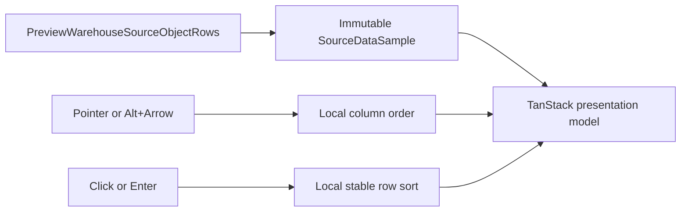

# Canvas Data Column Interactions Plan

## Think-First Analysis

### Problem and root cause

The Canvas Data panel projects the bounded `SourceDataSample` as a static table.
Its headers cannot move columns or sort rows because `OperationalDrawerDataTable`
is embedded in a broad primitives module and owns no presentation state. This is
not a missing warehouse query and must not mutate the sample, `FieldId`, lineage,
or canonical Transform output order.


### Constraints and invariants

- ADR-0000 keeps architecture evidence deterministic and repository-local.
- ADR-0061 keeps issue lifecycle in GitHub and architecture/rail knowledge in
  Planning DB.
- `PreviewWarehouseSourceObjectRows` remains the only warehouse-row query.
- `ConfigureCanvasDvtNode` remains the only semantic Transform field-order command.
- Grid order and sorting are ephemeral presentation state scoped to one sample.
- Sorting is stable, keeps nulls last, and never mutates query rows.
- Pointer and keyboard interactions expose equivalent column movement.

### Options considered

1. Add order/sort parameters to the API. Rejected: presentation-only interaction
   would widen the protected query and create unnecessary server authority.
2. Add a Canvas/global store. Rejected: it creates a second field-order model and
   stale state across samples.
3. Build sorting and table projection manually. Rejected: TanStack Table v8 is
   already installed and owns mature sorting/column-order projection semantics.
4. Selected: use TanStack Table inside one focused data-table component; retain a
   small native drag/keyboard adapter for column movement and remount per object.



### Fowler opportunity matrix

| Scenario                | Opportunity             | Pattern / owner                       | Rail                               | Tests                                 | Out of scope                    |
| ----------------------- | ----------------------- | ------------------------------------- | ---------------------------------- | ------------------------------------- | ------------------------------- |
| Move grid columns       | Primitive obsession     | Presentation Model / Data sample grid | `PreviewWarehouseSourceObjectRows` | pointer + keyboard reorder            | Persisting grid preferences     |
| Sort sample rows        | Test-only confidence    | Presentation Model / Data sample grid | `PreviewWarehouseSourceObjectRows` | cycle, stability, nulls, immutability | Server-side sorting             |
| Separate table behavior | Responsibility overload | Extract Component / shell drawer      | same query                         | panel integration                     | Refactor every drawer primitive |
| Preserve card order     | Duplicate semantics     | Existing command boundary / Transform | `ConfigureCanvasDvtNode`           | existing 16 behavior tests            | New card-order command          |

## Pre-Implementation Brief

- **Mode:** Full; this adds visible interaction.
- **Scope:** Data-table presentation plus canonical rail documentation.
- **Expected outcome:** headers can move horizontally and sort rows through pointer
  or keyboard without changing the source sample or card field order.
- **Risk:** drag may accidentally sort; movement and activation handlers remain
  separate and tests exercise both.
- **Negative coverage:** invalid/self drops no-op, boundary keyboard moves no-op,
  null values remain last, equal values retain input order, and a new object resets
  presentation state.
- **Libraries:** reuse installed `@tanstack/react-table`; no dependency change.
- **Rail impact:** promote the already-implemented
  `PreviewWarehouseSourceObjectRows` query to the canonical frontend catalog;
  reuse `ConfigureCanvasDvtNode` unchanged.
- **Validation:** focused red/green tests, existing card reorder tests, Web lint and
  typecheck, headed browser proof, governance refresh, and pre-push gate.

```feature-mechanization
version: 1
featureId: GH-2892-CANVAS-DATA-COLUMN-INTERACTIONS
mechanizationStatus: implemented
noHumanDecisionsRemaining: true
implementationPlan: docs/planning/proposals/mandatory/frontend-and-ux/canvas-data-column-interactions-plan-20260903.md
componentGuides:
  - docs/architecture/components/web/frontend-command-query-rail-inventory.md
  - docs/architecture/components/web/frontend-component-inventory.md
userStories:
  - https://github.com/dunay2/dvt/issues/2892
governingSources:
  - AGENTS.md
  - docs/planning/status/governance-document-rule-inventory.md
  - docs/guides/ai-work-protocol.md
  - docs/architecture/command-query-rail-governance.md
  - docs/architecture/fowler-opportunity-planning-governance.md
  - docs/adr/ADR-0000-Code-generation-with-normative-traceability-required.en.md
  - docs/adr/ADR-0061-github-mvp-task-authority-and-planning-db-architecture-boundary.md
allowedImplementationSurfaces:
  - docs/.manifest.json
  - docs/**/index.md
  - docs/architecture/components/web/frontend-command-query-rail-inventory.md
  - docs/planning/proposals/mandatory/frontend-and-ux/canvas-data-column-interactions-plan-20260903.md
  - docs/planning/closeouts/gh-2892-canvas-data-column-interactions-closeout.md
  - apps/web/src/app/components/shell/OperationalDrawerDataTable.tsx
  - apps/web/src/app/components/shell/OperationalDrawerDataTable.test.tsx
  - apps/web/src/app/components/shell/OperationalDrawerPanelPrimitives.tsx
  - apps/web/src/app/components/shell/OperationalDrawerPanels.tsx
  - apps/web/src/app/components/shell/OperationalDrawerPanels.test.tsx
forbiddenImplementationSurfaces:
  - packages/@dvt/contracts/**
  - packages/@dvt/engine/**
  - packages/@dvt/adapter-*/**
  - apps/api/**
commandQueryRails:
  - name: PreviewWarehouseSourceObjectRows
    type: query
    dddOwner: Bounded relational source sample read model
  - name: ConfigureCanvasDvtNode
    type: command
    dddOwner: DvtNodeAuthoringMetadata
domainObjects:
  - name: SourceDataSample
    type: read model
    owner: Warehouse Source Import
  - name: OperationalDrawerDataTablePresentation
    type: presentation model
    owner: Canvas Web
fowlerSignals:
  - Responsibility overload
  - Duplicate semantics
  - Test-only confidence
architectureGuards:
  - pnpm docs:feature-mechanization:implementation
  - pnpm --filter @dvt/web exec vitest run --config vitest.architecture.config.ts
cypressFlows:
  - Browser skill live Canvas source-sample proof recorded in issue 2892
completionGate:
  - pnpm --filter @dvt/web lint
  - pnpm --filter @dvt/web typecheck
  - pnpm --filter @dvt/web exec vitest run --config vitest.unit.config.ts src/app/components/shell/OperationalDrawerDataTable.test.tsx src/app/components/shell/OperationalDrawerPanels.test.tsx
  - pnpm docs:feature-mechanization:implementation
  - pnpm governance:refresh
  - pnpm verify:prepush
redGreenCycles:
  - id: data-grid-order-and-sort
    redTest: pnpm --filter @dvt/web exec vitest run --config vitest.unit.config.ts src/app/components/shell/OperationalDrawerDataTable.test.tsx
    expectedFailure: Data headers expose neither ordering nor sorting behavior.
    patchSurfaces:
      - apps/web/src/app/components/shell/OperationalDrawerDataTable.tsx
      - apps/web/src/app/components/shell/OperationalDrawerPanels.tsx
    greenTest: pnpm --filter @dvt/web exec vitest run --config vitest.unit.config.ts src/app/components/shell/OperationalDrawerDataTable.test.tsx
symbols:
  - { name: operationalDrawerDataTableClassNames, path: apps/web/src/app/components/shell/OperationalDrawerDataTable.tsx, dddOwner: OperationalDrawerDataTablePresentation, cqRails: [PreviewWarehouseSourceObjectRows], fowlerSignals: [Responsibility overload], architectureGuard: pnpm docs:feature-mechanization:implementation, cypressCoverage: Browser skill issue 2892, unitTests: [apps/web/src/app/components/shell/OperationalDrawerDataTable.test.tsx] }
  - { name: OperationalDrawerDataTableSort, path: apps/web/src/app/components/shell/OperationalDrawerDataTable.tsx, dddOwner: OperationalDrawerDataTablePresentation, cqRails: [PreviewWarehouseSourceObjectRows], fowlerSignals: [Primitive obsession], architectureGuard: pnpm docs:feature-mechanization:implementation, cypressCoverage: Browser skill issue 2892, unitTests: [apps/web/src/app/components/shell/OperationalDrawerDataTable.test.tsx] }
  - { name: OperationalDrawerDataTable, path: apps/web/src/app/components/shell/OperationalDrawerDataTable.tsx, dddOwner: OperationalDrawerDataTablePresentation, cqRails: [PreviewWarehouseSourceObjectRows], fowlerSignals: [Test-only confidence], architectureGuard: pnpm docs:feature-mechanization:implementation, cypressCoverage: Browser skill issue 2892, unitTests: [apps/web/src/app/components/shell/OperationalDrawerDataTable.test.tsx] }
```
