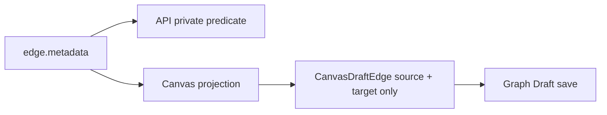
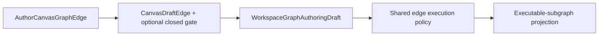

# Canvas Edge Execution Gate Implementation Plan

## Governing sources

- `AGENTS.md`
- `docs/architecture/command-query-rail-governance.md`
- `docs/architecture/fowler-opportunity-planning-governance.md`
- `docs/architecture/components/web/graph/canvas-authoring-draft-boundary-component.md`
- `docs/contracts/planner/workspace-graph-draft-persistence-v1.md`
- `docs/adr/ADR-0035-planner-public-contract-evolution-protocol.md`
- GitHub issue #2579

## Current state



## Selected design



## Invariants

- Missing `executionGate` means open; only `closed` persists; reopening removes it;
  any other present value fails closed.
- Structural `executionDependency: false` remains non-executable after reopening.
- Gate changes preserve edge identity/topology; reconnection does not inherit a gate;
  no React-only truth or direct renderer mutation is admitted.

## Fowler opportunities

Replace the API's duplicate predicate, introduce one bounded Canvas value where
rebuilds currently lose state, and reuse the edge command runner as mutation owner.

## Pre-implementation brief

- **Mode/microcommits:** Full; contract/API policy, Canvas persistence, command runner,
  then governed ARC evidence.
- **Risk/proof:** rebuild or merge loss; cover dedupe, saving, reload, remote adoption
  and local precedence plus structural false, malformed gate and missing edge.
- **Libraries/out of scope:** none; valve UI (#2581), Preview/runtime and broad graph
  lifecycle cleanup remain separate.

## Feature mechanization

```feature-mechanization
version: 1
featureId: FLOW1-EDGE-EXECUTION-GATE-2579
mechanizationStatus: implemented
noHumanDecisionsRemaining: true
implementationPlan: docs/planning/proposals/mandatory/frontend-and-ux/canvas-edge-execution-gate-plan-20260902.md
componentGuides:
  - docs/architecture/components/web/graph/canvas-authoring-draft-boundary-component.md
  - docs/contracts/planner/workspace-graph-draft-persistence-v1.md
governingSources:
  - AGENTS.md
  - docs/architecture/command-query-rail-governance.md
  - docs/architecture/fowler-opportunity-planning-governance.md
  - docs/adr/ADR-0035-planner-public-contract-evolution-protocol.md
userStories:
  - As a Canvas author, I close or reopen an execution route without deleting its edge.
domainObjects:
  - WorkspaceGraphAuthoringEdge
fowlerSignals:
  - Duplicate semantics
allowedImplementationSurfaces:
  - packages/@dvt/contracts/src/contracts/planner/WorkspaceGraphAuthoringEdgeExecution.v1.ts
  - packages/@dvt/contracts/src/index.ts
  - packages/@dvt/contracts/test/workspace-graph-authoring-edge-execution.contract.test.ts
  - apps/api/src/application/services/resolveAuthorizedExecutableSubgraph.ts
  - apps/api/test/application/services/resolveAuthorizedExecutableSubgraph.test.ts
  - apps/web/src/app/views/canvas/canvasDraftSession.types.ts
  - apps/web/src/app/views/canvas/canvasDraftSessionWorkingSet.ts
  - apps/web/src/app/views/canvas/canvasDraftSessionMachine.ts
  - apps/web/src/app/views/canvas/canvasDraftSession.test.ts
  - apps/web/src/app/views/canvas/canvasDraftAuthoring.ts
  - apps/web/src/app/views/canvas/canvasDraftAuthoring.test.ts
  - apps/web/src/app/views/canvas/useCanvasAuthoringProjection.ts
  - apps/web/src/app/views/canvas/useCanvasEdgeCommandRunner.ts
  - apps/web/src/app/views/canvas/useCanvasEdgeCommandRunner.test.tsx
  - docs/evidence/ED-20260902-canvas-edge-execution-gate.md
  - docs/risk-register/quality/R-20260902-CANVAS-EDGE-EXECUTION-GATE.yaml
  - docs/planning/proposals/mandatory/frontend-and-ux/canvas-edge-execution-gate-plan-20260902.md
  - docs/.manifest.json
  - docs/evidence/index.md
  - docs/risk-register/quality/index.md
  - docs/planning/proposals/index.md
forbiddenImplementationSurfaces:
  - packages/@dvt/engine/**
  - packages/@dvt/planner/**
  - packages/@dvt/adapter-*/**
  - infra/db/**
commandQueryRails:
  - name: AuthorCanvasGraphEdge
    type: command
    status: implemented
    dddOwner: Canvas connection aggregate
    applicationPort: Existing Canvas edge command runner
    adapterSurface: Canvas draft session
    authorizationScope: Current writable Canvas graph draft
    negativeTests:
      - a missing edge cannot acquire a gate
      - reopening cannot override structural execution prohibition
  - name: ProjectSelectedExecutableSubgraph
    type: query
    status: implemented
    dddOwner: ExecutableSubgraph read model
    applicationPort: ResolveAuthorizedExecutableSubgraphService
    adapterSurface: Protected API execution boundary
    authorizationScope: Authorized tenant project environment
    negativeTests:
      - malformed or closed gates are excluded before planner derivation
architectureGuards:
  - pnpm docs:feature-mechanization:implementation --feature FLOW1-EDGE-EXECUTION-GATE-2579
cypressFlows:
  - N/A - visible valve interaction belongs to issue 2581
completionGate:
  - pnpm --filter @dvt/contracts test
  - pnpm --filter dvt-api test:unit
  - pnpm --filter @dvt/web test:canvas
  - pnpm --filter @dvt/contracts typecheck
  - pnpm --filter dvt-api typecheck
  - pnpm --filter @dvt/web typecheck
  - pnpm governance:refresh
  - pnpm verify:prepush
redGreenCycles:
  - id: shared-edge-execution-policy
    redTest: packages/@dvt/contracts/test/workspace-graph-authoring-edge-execution.contract.test.ts
    expectedFailure: No shared parser, mutator or effective-execution policy exists and API owns a private structural-only predicate.
    patchSurfaces:
      - packages/@dvt/contracts/src/contracts/planner/WorkspaceGraphAuthoringEdgeExecution.v1.ts
      - packages/@dvt/contracts/src/index.ts
      - apps/api/src/application/services/resolveAuthorizedExecutableSubgraph.ts
      - apps/api/test/application/services/resolveAuthorizedExecutableSubgraph.test.ts
    greenTest: packages/@dvt/contracts/test/workspace-graph-authoring-edge-execution.contract.test.ts
  - id: canvas-gate-persistence
    redTest: apps/web/src/app/views/canvas/canvasDraftSession.test.ts
    expectedFailure: CanvasDraftEdge drops gate state during rebuild, save and three-way reload reconciliation.
    patchSurfaces:
      - apps/web/src/app/views/canvas/canvasDraftSession.types.ts
      - apps/web/src/app/views/canvas/canvasDraftSessionWorkingSet.ts
      - apps/web/src/app/views/canvas/canvasDraftSessionMachine.ts
      - apps/web/src/app/views/canvas/canvasDraftSession.test.ts
      - apps/web/src/app/views/canvas/canvasDraftAuthoring.ts
      - apps/web/src/app/views/canvas/canvasDraftAuthoring.test.ts
      - apps/web/src/app/views/canvas/useCanvasAuthoringProjection.ts
    greenTest: apps/web/src/app/views/canvas/canvasDraftSession.test.ts
  - id: existing-edge-command-runner-gate
    redTest: apps/web/src/app/views/canvas/useCanvasEdgeCommandRunner.test.tsx
    expectedFailure: The existing runner cannot apply or clear the bounded gate and reject a missing edge.
    patchSurfaces:
      - apps/web/src/app/views/canvas/useCanvasEdgeCommandRunner.ts
      - apps/web/src/app/views/canvas/useCanvasEdgeCommandRunner.test.tsx
    greenTest: apps/web/src/app/views/canvas/useCanvasEdgeCommandRunner.test.tsx
symbols:
  - name: readWorkspaceGraphAuthoringEdgeExecutionGate
    path: packages/@dvt/contracts/src/contracts/planner/WorkspaceGraphAuthoringEdgeExecution.v1.ts
    dddOwner: Workspace graph edge execution policy
    cqRails: [ProjectSelectedExecutableSubgraph]
    fowlerSignals: [Replace private predicate]
    architectureGuard: pnpm docs:feature-mechanization:implementation --feature FLOW1-EDGE-EXECUTION-GATE-2579
    cypressCoverage: N/A - shared policy
    unitTests: [pnpm --filter @dvt/contracts test]
  - name: isWorkspaceGraphAuthoringEdgeEffectivelyExecutable
    path: packages/@dvt/contracts/src/contracts/planner/WorkspaceGraphAuthoringEdgeExecution.v1.ts
    dddOwner: Workspace graph edge execution policy
    cqRails: [ProjectSelectedExecutableSubgraph]
    fowlerSignals: [Duplicate semantics]
    architectureGuard: pnpm docs:feature-mechanization:implementation --feature FLOW1-EDGE-EXECUTION-GATE-2579
    cypressCoverage: N/A - shared policy
    unitTests: [pnpm --filter @dvt/contracts test]
  - name: withWorkspaceGraphAuthoringEdgeExecutionGate
    path: packages/@dvt/contracts/src/contracts/planner/WorkspaceGraphAuthoringEdgeExecution.v1.ts
    dddOwner: Workspace graph edge execution policy
    cqRails: [AuthorCanvasGraphEdge]
    fowlerSignals: [Bounded value]
    architectureGuard: pnpm docs:feature-mechanization:implementation --feature FLOW1-EDGE-EXECUTION-GATE-2579
    cypressCoverage: N/A - presentation belongs to issue 2581
    unitTests: [pnpm --filter @dvt/contracts test]
```
