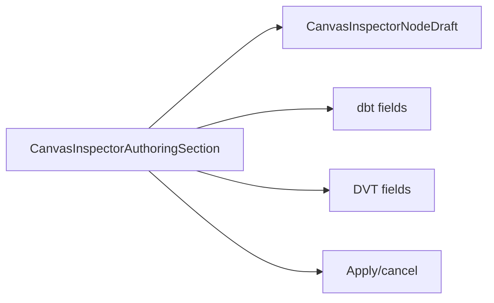
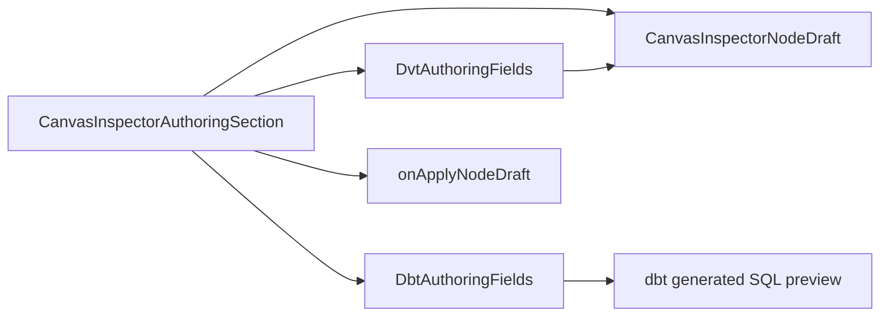
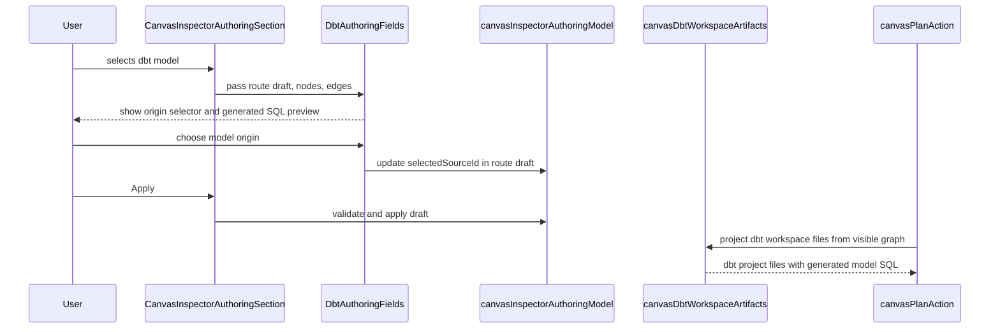

# Canvas Inspector Plugin Authoring Fields Plan

## Think-First Analysis

Problem summary: the Canvas Inspector authoring section had become a broad
controller that rendered generic node details, dbt card controls, DVT controls,
validation feedback, and apply/cancel posture in one module. A first remediation
attempt also risked treating dbt model SQL as a generic Canvas execution rule,
which would bind the core Canvas route to one plugin's definition policy.

Root cause: plugin-specific authoring controls and plugin execution explanation
were colocated with the route-owned Inspector orchestration component. That
made the module harder to change and made it too easy for plugin semantics to
leak into generic Canvas readiness and planner projection.

Selected option: split dbt and DVT authoring controls into small owned
presentation components, keep `CanvasInspectorAuthoringSection` as the route
orchestrator, and make dbt model definition explanation visible as a
plugin-owned generated SQL preview instead of a generic required SQL field.

Rejected alternatives:

- Add a generic "model SQL required" rule to Canvas readiness. Rejected because
  dbt is a plugin and Canvas must not own plugin-specific executable semantics.
- Keep the single Inspector controller and only add tests. Rejected because the
  responsibility overload would remain.
- Move all plugin authoring into passive plugin panels. Rejected because these
  fields currently mutate route-owned Canvas draft state and must remain behind
  the Inspector authoring command seam.

## Current Shape



Problem: the route-owned section had several reasons to change and could absorb
plugin policy by accident.

## Target Shape



Target rule: Canvas orchestrates route-owned drafts. Plugin-specific controls
render and explain plugin semantics, but generic Canvas code does not invent
dbt-only model definition rules.

## Fowler Matrix

<!-- markdownlint-disable MD060 -->

| Scenario                                                 | Opportunity             | Fowler pattern                       | DDD owner                        | Command/query rail                                            | Implementation surfaces                                    | Unit or package test                               | Architecture test                                        | Out of scope                         |
| -------------------------------------------------------- | ----------------------- | ------------------------------------ | -------------------------------- | ------------------------------------------------------------- | ---------------------------------------------------------- | -------------------------------------------------- | -------------------------------------------------------- | ------------------------------------ |
| Inspector section renders too many plugin field groups.  | Responsibility overload | Extract Component / Compose Method   | Canvas Inspector authoring view  | `ConfigureCanvasDbtNode`, `ConfigureCanvasDvtNode`            | `DbtAuthoringFields.tsx`, `DvtAuthoringFields.tsx`         | `CanvasInspectorPanel.test.tsx`                    | `canvasInspectorAuthoringComponent.architecture.test.ts` | Passive plugin inspector mutation    |
| Empty dbt model appears executable without explanation.  | Hidden authority        | Replace Hidden State with Projection | `DbtWorkspaceArtifactProjection` | `GenerateDbtWorkspaceArtifacts`, `BuildDbtPlannerGraphSource` | `DbtAuthoringFields.tsx`, `canvasDbtWorkspaceArtifacts.ts` | `canvasDbtWorkspaceArtifacts.test.ts`              | `canvasPlanAction.dbtProjectFiles.test.ts`               | Backend dbt compiler integration     |
| Core Canvas could own dbt SQL requirements.              | Boundary drift          | Plugin Boundary / Policy Object      | dbt plugin authoring projection  | `SelectDbtModelOrigin`, `BuildDbtPlannerGraphSource`          | `canvasDbtPlannerGraphSource.test.ts`, C&Q catalog         | `useCanvasExecutionActions.dbtPreviewRun.test.tsx` | `canvasPlanAction.dbtProjectFiles.test.ts`               | New plugin manifest API              |
| New component files are not queryable in DB-first rails. | Documentation drift     | Repository as source of truth        | Governance component definition  | `CreateGovernanceComponent`                                   | planning DB component rows                                 | `pnpm planning:db:query component-metadata`        | `governance:refresh`, `verify:prepush`                   | Component update/delete command rail |
| Split Canvas authoring files need safe local routing.    | Test-only confidence    | Semantic Fitness Function            | `WebVitestChangedSuiteRouter`    | `ResolveWebVitestChangedSuitePlan`                            | `vitest.suites.ts`, `vitestSuites.architecture.test.ts`    | `pnpm --filter @dvt/web test:changed`              | `vitestSuites.architecture.test.ts`                      | Changing primary suite ownership     |

<!-- markdownlint-enable MD060 -->

## Sequence



```feature-mechanization
version: 1
featureId: CANVAS-INSPECTOR-PLUGIN-AUTHORING-FIELDS-20260604
mechanizationStatus: implemented
noHumanDecisionsRemaining: true
implementationPlan: docs/planning/proposals/mandatory/frontend-and-ux/canvas-inspector-plugin-authoring-fields-plan-20260604.md
componentGuides:
  - docs/architecture/components/web/graph/canvas-inspector-authoring-component.md
  - docs/architecture/components/web/graph/canvas-workbench-command-query-catalog.md
userStories:
  - docs/architecture/components/web/graph/canvas-layout-persistence-user-stories.md
governingSources:
  - AGENTS.md
  - docs/planning/status/governance-document-rule-inventory.md
  - docs/guides/ai-work-protocol.md
  - docs/architecture/command-query-rail-governance.md
  - docs/architecture/fowler-opportunity-planning-governance.md
  - docs/architecture/components/web/graph/canvas-inspector-authoring-component.md
  - docs/architecture/components/web/graph/canvas-workbench-command-query-catalog.md
allowedImplementationSurfaces:
  - apps/web/src/app/views/canvas/CanvasInspectorAuthoringSection.tsx
  - apps/web/src/app/views/canvas/CanvasInspectorPanel.test.tsx
  - apps/web/src/app/views/canvas/DbtAuthoringFields.tsx
  - apps/web/src/app/views/canvas/DvtAuthoringFields.tsx
  - apps/web/src/app/views/canvas/canvasCopy.types.ts
  - apps/web/src/app/views/canvas/canvasCopyCatalog.authoring.ts
  - apps/web/src/app/views/canvas/canvasCopyCatalog.authoring.es.ts
  - apps/web/src/app/views/canvas/canvasCopyFormatting.ts
  - apps/web/src/app/views/canvas/canvasPlanAction.dbtProjectFiles.test.ts
  - apps/web/src/app/views/canvas/canvasDbtPlannerGraphSource.test.ts
  - apps/web/src/app/views/canvas/canvasDbtWorkspaceArtifacts.test.ts
  - apps/web/src/app/views/canvas/canvasDbtWorkspaceArtifacts.ts
  - apps/web/src/app/views/canvas/canvasDvtAuthoringModel.ts
  - apps/web/src/app/views/canvas/canvasInspectorAuthoring.types.ts
  - apps/web/src/app/views/canvas/canvasInspectorAuthoringComponent.architecture.test.ts
  - apps/web/src/app/views/canvas/canvasInspectorAuthoringErrorCodes.ts
  - apps/web/src/app/views/canvas/canvasInspectorAuthoringModel.test.ts
  - apps/web/src/app/views/canvas/canvasInspectorAuthoringModel.ts
  - apps/web/src/app/views/canvas/copy.test.ts
  - apps/web/src/app/views/canvas/useCanvasExecutionActions.dbt.test.tsx
  - apps/web/src/testing/vitestSuites.architecture.test.ts
  - apps/web/vitest.suites.ts
  - docs/architecture/components/web/graph/canvas-inspector-authoring-component.md
  - docs/architecture/components/web/graph/canvas-workbench-command-query-catalog.md
  - docs/architecture/components/web/web-vitest-changed-suite-router-component.md
  - docs/planning/proposals/mandatory/frontend-and-ux/canvas-inspector-plugin-authoring-fields-plan-20260604.md
forbiddenImplementationSurfaces:
  - apps/api/**
  - packages/@dvt/contracts/**
  - packages/@dvt/engine/**
  - packages/@dvt/adapter-*/**
  - packages/@dvt/planner/**
  - specs/**
commandQueryRails:
  - name: ConfigureCanvasDbtNode
    type: command
    dddOwner: DbtNodeAuthoringMetadata
  - name: SelectDbtModelOrigin
    type: command
    dddOwner: DbtSourceRelationshipSelection
  - name: GenerateDbtWorkspaceArtifacts
    type: command
    dddOwner: DbtWorkspaceArtifactProjection
  - name: BuildDbtPlannerGraphSource
    type: query
    dddOwner: DbtCanvasGraphSourceProjection
  - name: ConfigureCanvasDvtNode
    type: command
    dddOwner: DvtNodeAuthoringMetadata
  - name: GenerateTransformationWorkspaceArtifacts
    type: command
    dddOwner: TransformationWorkspaceArtifactProjection
  - name: ResolveWebVitestChangedSuitePlan
    type: query
    dddOwner: WebVitestChangedSuiteRouter
domainObjects:
  - name: CanvasInspectorAuthoringSection
    type: presentation orchestrator
    owner: Canvas Inspector authoring
  - name: DbtAuthoringFields
    type: plugin presentation component
    owner: dbt authoring controls
  - name: DvtAuthoringFields
    type: plugin presentation component
    owner: DVT authoring controls
fowlerSignals:
  - Responsibility overload
  - Boundary drift
  - Hidden authority
  - Documentation drift
architectureGuards:
  - pnpm --filter @dvt/web test:canvas
  - pnpm docs:feature-mechanization:implementation -- --feature CANVAS-INSPECTOR-PLUGIN-AUTHORING-FIELDS-20260604
cypressFlows:
  - N/A - covered by Canvas inspector unit and architecture tests
completionGate:
  - pnpm --filter @dvt/web test:canvas
  - pnpm --filter @dvt/web typecheck
  - pnpm --filter @dvt/web lint
  - pnpm governance:refresh
  - pnpm verify:prepush
redGreenCycles:
  - id: inspector-plugin-field-extraction
    redTest: pnpm docs:feature-mechanization:implementation
    expectedFailure: New dbt/DVT authoring field symbols are outside the declared feature mechanization surface.
    patchSurfaces:
      - docs/planning/proposals/mandatory/frontend-and-ux/canvas-inspector-plugin-authoring-fields-plan-20260604.md
      - apps/web/src/app/views/canvas/DbtAuthoringFields.tsx
      - apps/web/src/app/views/canvas/DvtAuthoringFields.tsx
      - apps/web/src/app/views/canvas/CanvasInspectorAuthoringSection.tsx
    greenTest: pnpm docs:feature-mechanization:implementation -- --feature CANVAS-INSPECTOR-PLUGIN-AUTHORING-FIELDS-20260604
  - id: dbt-generated-sql-preview
    redTest: pnpm --filter @dvt/web test:canvas -- src/app/views/canvas/useCanvasExecutionActions.dbt.test.tsx
    expectedFailure: The dbt model without explicit SQL is blocked by generic Canvas policy instead of plugin projection.
    patchSurfaces:
      - apps/web/src/app/views/canvas/DbtAuthoringFields.tsx
      - apps/web/src/app/views/canvas/canvasDbtWorkspaceArtifacts.ts
      - apps/web/src/app/views/canvas/canvasDbtPlannerGraphSource.test.ts
      - apps/web/src/app/views/canvas/useCanvasExecutionActions.dbt.test.tsx
    greenTest: pnpm --filter @dvt/web test:canvas
  - id: inspector-plugin-authoring-i18n-boundary
    redTest: pnpm --filter @dvt/web test:canvas:run -- src/app/views/canvas/copy.test.ts src/app/views/canvas/canvasInspectorAuthoringModel.test.ts src/app/views/canvas/canvasInspectorAuthoringComponent.architecture.test.ts
    expectedFailure: Plugin authoring fields embed visible English labels and validation messages instead of resolving Canvas copy.
    patchSurfaces:
      - apps/web/src/app/views/canvas/CanvasInspectorAuthoringSection.tsx
      - apps/web/src/app/views/canvas/DbtAuthoringFields.tsx
      - apps/web/src/app/views/canvas/DvtAuthoringFields.tsx
      - apps/web/src/app/views/canvas/canvasCopy.types.ts
      - apps/web/src/app/views/canvas/canvasCopyCatalog.authoring.ts
      - apps/web/src/app/views/canvas/canvasCopyCatalog.authoring.es.ts
      - apps/web/src/app/views/canvas/canvasCopyFormatting.ts
      - apps/web/src/app/views/canvas/canvasDvtAuthoringModel.ts
      - apps/web/src/app/views/canvas/canvasInspectorAuthoring.types.ts
      - apps/web/src/app/views/canvas/canvasInspectorAuthoringErrorCodes.ts
      - apps/web/src/app/views/canvas/canvasInspectorAuthoringModel.ts
      - apps/web/src/app/views/canvas/copy.test.ts
      - apps/web/src/app/views/canvas/canvasInspectorAuthoringComponent.architecture.test.ts
    greenTest: pnpm --filter @dvt/web test:canvas:run -- src/app/views/canvas/copy.test.ts src/app/views/canvas/canvasInspectorAuthoringModel.test.ts src/app/views/canvas/canvasInspectorAuthoringComponent.architecture.test.ts
symbols:
  - { name: DbtAuthoringFields, path: apps/web/src/app/views/canvas/DbtAuthoringFields.tsx, dddOwner: dbt authoring fields presentation, cqRails: [ConfigureCanvasDbtNode, SelectDbtModelOrigin], fowlerSignals: [Extract Component, Boundary drift], architectureGuard: pnpm docs:feature-mechanization:implementation -- --feature CANVAS-INSPECTOR-PLUGIN-AUTHORING-FIELDS-20260604, cypressCoverage: N/A - Canvas inspector unit coverage, unitTests: [pnpm --filter @dvt/web test:canvas] }
  - { name: DbtAuthoringFieldsProps, path: apps/web/src/app/views/canvas/DbtAuthoringFields.tsx, dddOwner: dbt authoring fields presentation DTO, cqRails: [ConfigureCanvasDbtNode], fowlerSignals: [Data clump], architectureGuard: pnpm docs:feature-mechanization:implementation -- --feature CANVAS-INSPECTOR-PLUGIN-AUTHORING-FIELDS-20260604, cypressCoverage: N/A, unitTests: [pnpm --filter @dvt/web test:canvas] }
  - { name: DbtOriginNode, path: apps/web/src/app/views/canvas/DbtAuthoringFields.tsx, dddOwner: DbtSourceRelationshipSelection presentation node guard, cqRails: [SelectDbtModelOrigin], fowlerSignals: [Introduce Assertion, Replace Type Code with Explicit Type], architectureGuard: pnpm docs:feature-mechanization:implementation -- --feature CANVAS-INSPECTOR-PLUGIN-AUTHORING-FIELDS-20260604, cypressCoverage: N/A, unitTests: [pnpm --filter @dvt/web test:canvas] }
  - { name: isDbtOriginNode, path: apps/web/src/app/views/canvas/DbtAuthoringFields.tsx, dddOwner: DbtSourceRelationshipSelection presentation node guard, cqRails: [SelectDbtModelOrigin], fowlerSignals: [Introduce Assertion, Replace Type Code with Explicit Type], architectureGuard: pnpm docs:feature-mechanization:implementation -- --feature CANVAS-INSPECTOR-PLUGIN-AUTHORING-FIELDS-20260604, cypressCoverage: N/A, unitTests: [pnpm --filter @dvt/web test:canvas] }
  - { name: buildDbtOriginOptions, path: apps/web/src/app/views/canvas/DbtAuthoringFields.tsx, dddOwner: DbtSourceRelationshipSelection presentation, cqRails: [SelectDbtModelOrigin], fowlerSignals: [Policy Object], architectureGuard: pnpm docs:feature-mechanization:implementation -- --feature CANVAS-INSPECTOR-PLUGIN-AUTHORING-FIELDS-20260604, cypressCoverage: N/A, unitTests: [pnpm --filter @dvt/web test:canvas] }
  - { name: buildGeneratedDbtModelSqlPreview, path: apps/web/src/app/views/canvas/DbtAuthoringFields.tsx, dddOwner: dbt generated SQL preview projection, cqRails: [GenerateDbtWorkspaceArtifacts], fowlerSignals: [Hidden authority], architectureGuard: pnpm docs:feature-mechanization:implementation -- --feature CANVAS-INSPECTOR-PLUGIN-AUTHORING-FIELDS-20260604, cypressCoverage: N/A, unitTests: [pnpm --filter @dvt/web test:canvas] }
  - { name: normalizeDbtIdentifier, path: apps/web/src/app/views/canvas/DbtAuthoringFields.tsx, dddOwner: dbt generated SQL preview value normalization, cqRails: [GenerateDbtWorkspaceArtifacts], fowlerSignals: [Primitive obsession], architectureGuard: pnpm docs:feature-mechanization:implementation -- --feature CANVAS-INSPECTOR-PLUGIN-AUTHORING-FIELDS-20260604, cypressCoverage: N/A, unitTests: [pnpm --filter @dvt/web test:canvas] }
  - { name: resolveDbtModelOrigin, path: apps/web/src/app/views/canvas/DbtAuthoringFields.tsx, dddOwner: dbt origin presentation policy, cqRails: [SelectDbtModelOrigin], fowlerSignals: [Policy Object], architectureGuard: pnpm docs:feature-mechanization:implementation -- --feature CANVAS-INSPECTOR-PLUGIN-AUTHORING-FIELDS-20260604, cypressCoverage: N/A, unitTests: [pnpm --filter @dvt/web test:canvas] }
  - { name: DvtAuthoringFields, path: apps/web/src/app/views/canvas/DvtAuthoringFields.tsx, dddOwner: DVT authoring fields presentation, cqRails: [ConfigureCanvasDvtNode], fowlerSignals: [Extract Component], architectureGuard: pnpm docs:feature-mechanization:implementation -- --feature CANVAS-INSPECTOR-PLUGIN-AUTHORING-FIELDS-20260604, cypressCoverage: N/A, unitTests: [pnpm --filter @dvt/web test:canvas] }
  - { name: DvtAuthoringFieldsProps, path: apps/web/src/app/views/canvas/DvtAuthoringFields.tsx, dddOwner: DVT authoring fields presentation DTO, cqRails: [ConfigureCanvasDvtNode], fowlerSignals: [Data clump], architectureGuard: pnpm docs:feature-mechanization:implementation -- --feature CANVAS-INSPECTOR-PLUGIN-AUTHORING-FIELDS-20260604, cypressCoverage: N/A, unitTests: [pnpm --filter @dvt/web test:canvas] }
  - { name: CanvasInspectorNodeDraftErrorCode, path: apps/web/src/app/views/canvas/canvasInspectorAuthoringErrorCodes.ts, dddOwner: Inspector authoring validation vocabulary, cqRails: [ConfigureCanvasDbtNode, ConfigureCanvasDvtNode], fowlerSignals: [Primitive obsession, Boundary drift], architectureGuard: pnpm docs:feature-mechanization:implementation -- --feature CANVAS-INSPECTOR-PLUGIN-AUTHORING-FIELDS-20260604, cypressCoverage: N/A, unitTests: [pnpm --filter @dvt/web test:canvas] }
  - { name: formatCanvasInspectorNodeDraftError, path: apps/web/src/app/views/canvas/canvasCopyFormatting.ts, dddOwner: Inspector authoring copy formatter, cqRails: [ConfigureCanvasDbtNode, ConfigureCanvasDvtNode], fowlerSignals: [Replace Conditional with Polymorphism - not selected, Extract Function], architectureGuard: pnpm docs:feature-mechanization:implementation -- --feature CANVAS-INSPECTOR-PLUGIN-AUTHORING-FIELDS-20260604, cypressCoverage: N/A, unitTests: [pnpm --filter @dvt/web test:canvas] }
  - { name: canvasViewAuthoringCopyByKey, path: apps/web/src/app/views/canvas/canvasCopyCatalog.authoring.ts, dddOwner: Canvas authoring i18n catalog, cqRails: [ConfigureCanvasDbtNode, ConfigureCanvasDvtNode], fowlerSignals: [Duplicate semantics], architectureGuard: pnpm docs:feature-mechanization:implementation -- --feature CANVAS-INSPECTOR-PLUGIN-AUTHORING-FIELDS-20260604, cypressCoverage: N/A, unitTests: [pnpm --filter @dvt/web test:canvas] }
  - { name: canvasViewAuthoringCopyEs, path: apps/web/src/app/views/canvas/canvasCopyCatalog.authoring.es.ts, dddOwner: Canvas authoring i18n catalog, cqRails: [ConfigureCanvasDbtNode, ConfigureCanvasDvtNode], fowlerSignals: [Duplicate semantics], architectureGuard: pnpm docs:feature-mechanization:implementation -- --feature CANVAS-INSPECTOR-PLUGIN-AUTHORING-FIELDS-20260604, cypressCoverage: N/A, unitTests: [pnpm --filter @dvt/web test:canvas] }
  - { name: INSPECTOR_DRAFT_ERROR_COPY_KEYS, path: apps/web/src/app/views/canvas/copy.test.ts, dddOwner: Inspector authoring copy formatter coverage, cqRails: [ConfigureCanvasDbtNode, ConfigureCanvasDvtNode], fowlerSignals: [Semantic Fitness Function, Test-only confidence], architectureGuard: pnpm docs:feature-mechanization:implementation -- --feature CANVAS-INSPECTOR-PLUGIN-AUTHORING-FIELDS-20260604, cypressCoverage: N/A, unitTests: [pnpm --filter @dvt/web test:canvas] }
  - { name: tryAddGovernanceSuite, path: apps/web/vitest.suites.ts, dddOwner: WebVitestChangedSuiteRouter governance-path routing policy, cqRails: [ResolveWebVitestChangedSuitePlan], fowlerSignals: [Test-only confidence], architectureGuard: pnpm --filter @dvt/web test:changed -- --files apps/web/vitest.suites.ts apps/web/src/testing/vitestSuites.architecture.test.ts, cypressCoverage: N/A, unitTests: [pnpm --filter @dvt/web test:changed] }
  - { name: resolveSuiteForWebPath, path: apps/web/vitest.suites.ts, dddOwner: WebVitestChangedSuiteRouter path-to-suite policy, cqRails: [ResolveWebVitestChangedSuitePlan], fowlerSignals: [Test-only confidence], architectureGuard: pnpm --filter @dvt/web test:changed -- --files apps/web/vitest.suites.ts apps/web/src/testing/vitestSuites.architecture.test.ts, cypressCoverage: N/A, unitTests: [pnpm --filter @dvt/web test:changed] }
  - { name: resolveWebVitestChangedSuitePlan, path: apps/web/vitest.suites.ts, dddOwner: WebVitestChangedSuiteRouter changed-file read model, cqRails: [ResolveWebVitestChangedSuitePlan], fowlerSignals: [Semantic Fitness Function], architectureGuard: pnpm --filter @dvt/web test:changed -- --files apps/web/vitest.suites.ts apps/web/src/testing/vitestSuites.architecture.test.ts, cypressCoverage: N/A, unitTests: [pnpm --filter @dvt/web test:changed] }
  - { name: DBT_FIELDS_SOURCE, path: apps/web/src/app/views/canvas/canvasInspectorAuthoringComponent.architecture.test.ts, dddOwner: inspector authoring architecture guard fixture, cqRails: [N/A - architecture test constant], fowlerSignals: [Test-only confidence], architectureGuard: pnpm docs:feature-mechanization:implementation -- --feature CANVAS-INSPECTOR-PLUGIN-AUTHORING-FIELDS-20260604, cypressCoverage: N/A, unitTests: [pnpm --filter @dvt/web test:canvas] }
  - { name: DVT_FIELDS_SOURCE, path: apps/web/src/app/views/canvas/canvasInspectorAuthoringComponent.architecture.test.ts, dddOwner: inspector authoring architecture guard fixture, cqRails: [N/A - architecture test constant], fowlerSignals: [Test-only confidence], architectureGuard: pnpm docs:feature-mechanization:implementation -- --feature CANVAS-INSPECTOR-PLUGIN-AUTHORING-FIELDS-20260604, cypressCoverage: N/A, unitTests: [pnpm --filter @dvt/web test:canvas] }
  - { name: ERROR_CODES_SOURCE, path: apps/web/src/app/views/canvas/canvasInspectorAuthoringComponent.architecture.test.ts, dddOwner: inspector authoring architecture guard fixture, cqRails: [N/A - architecture test constant], fowlerSignals: [Test-only confidence], architectureGuard: pnpm docs:feature-mechanization:implementation -- --feature CANVAS-INSPECTOR-PLUGIN-AUTHORING-FIELDS-20260604, cypressCoverage: N/A, unitTests: [pnpm --filter @dvt/web test:canvas] }
  - { name: PANEL_SOURCE, path: apps/web/src/app/views/canvas/canvasInspectorAuthoringComponent.architecture.test.ts, dddOwner: inspector authoring architecture guard fixture, cqRails: [N/A - architecture test constant], fowlerSignals: [Test-only confidence], architectureGuard: pnpm docs:feature-mechanization:implementation -- --feature CANVAS-INSPECTOR-PLUGIN-AUTHORING-FIELDS-20260604, cypressCoverage: N/A, unitTests: [pnpm --filter @dvt/web test:canvas] }
```

## Closeout Expectations

- `DbtAuthoringFields` and `DvtAuthoringFields` are registered in the planning
  DB as governance components.
- `CanvasInspectorAuthoringSection` remains the route-owned orchestrator and no
  longer owns every plugin field branch.
- dbt model execution explanation is visible through generated SQL preview, but
  generic Canvas readiness does not require a dbt SQL field.
- `pnpm verify:prepush` must pass without relaxing hooks, lint, type, test, or
  governance rules.
