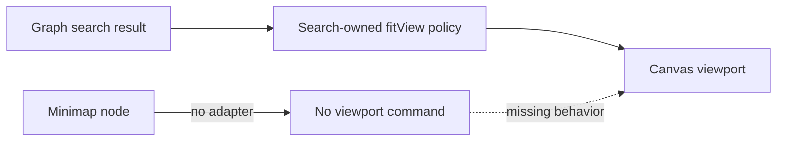
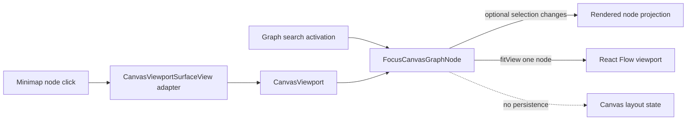

# Canvas Minimap Node Focus Plan

## Think-First Analysis

### Problem and root cause

The Canvas minimap displays the graph and supports background pan and zoom, but
its nodes are inert. `CanvasViewportSurfaceView` does not forward XYFlow's native
`MiniMap.onNodeClick` gesture to the route-facing viewport orchestrator. A second
focus implementation inside the renderer would also duplicate the existing graph
search behavior, which already selects and reveals one node with `fitView`.



### Constraints and invariants

- `FocusCanvasGraphNode` is a route-local presentation command, not graph or
  layout mutation.
- The command resolves the requested id against the current rendered node
  projection and focuses exactly that node.
- Selection changes only when Canvas selection is allowed; read-only Canvas still
  reveals the requested node.
- Programmatic focus does not alter canonical node coordinates and does not become
  a manual viewport-persistence observation.
- Minimap background pan and zoom remain available.
- The graph search remains the keyboard-accessible equivalent because the installed
  XYFlow minimap renders node shapes as non-focusable SVG rectangles.
- No API, engine, planner, contract, adapter, database, or dependency changes.

### Options considered

1. Add only `MiniMap.onNodeClick` and call `fitView` inline. Rejected because it
   would leave graph search and minimap as separate authorities for the same intent.
2. Convert minimap coordinates to Canvas coordinates and pan manually. Rejected
   because XYFlow already resolves the exact node and exposes governed viewport
   methods.
3. Add focus to `ConfigureCanvasViewportPreferences`. Rejected because preferences
   are persisted configuration while focus is a transient navigation command.
4. Selected: introduce `FocusCanvasGraphNode`, reuse it from graph search and the
   minimap adapter, and retain existing one-node reveal parameters.



### Fowler opportunity matrix

| Scenario                    | Opportunity          | Pattern / owner                          | Rail                   | Tests                         | Out of scope              |
| --------------------------- | -------------------- | ---------------------------------------- | ---------------------- | ----------------------------- | ------------------------- |
| Search and minimap focus    | Duplicate semantics  | Extract function / viewport focus policy | `FocusCanvasGraphNode` | both adapters reuse command   | New navigation store      |
| Renderer calling React Flow | Feature envy         | Passive View plus route orchestrator     | `FocusCanvasGraphNode` | architecture source guard     | Surface-owned application |
| Stale minimap node id       | Test-only confidence | Fail-closed command boundary             | `FocusCanvasGraphNode` | unknown id has no side effect | Graph reconciliation      |

## Integration on 0.14.0

The historical closeout is transferred to issue #2913 and verified there. The
browser proof creates two distant shared Canvas nodes through public controls,
checks minimap and keyboard-search centering, background panning, unchanged node
positions and an unchanged protected draft. It uses the existing live runtime
runner without intercepting or seeding draft success.

The real browser exposed an adapter lifetime mismatch in installed XYFlow 12.10.2:
MiniMap retains its initial onNodeClick callback. A Canvas mounted empty therefore
keeps an empty node closure. The route adapter must expose one stable callback
that reads the latest committed node projection, selection permission and port.
A layout-effect-updated ref preserves this boundary without remounting MiniMap
or creating another focus policy. The retained-callback regression covers nodes
added after mount and a later transition to selection-disabled posture.

## Pre-Implementation Brief

- **Mode:** Full behavior slice because the Canvas gains a new visible navigation
  gesture and command rail.
- **Expected outcome:** activating any minimap node centers that node at a useful
  zoom without changing its position; selection follows current Canvas capability.
- **Risk:** programmatic focus could be mistaken for a manual viewport movement or
  background minimap gestures could regress.
- **Libraries:** none; use the installed XYFlow `MiniMap.onNodeClick` contract.
- **Validation:** red/green policy and integration tests, architecture guard, Web
  lint/typecheck, visible-browser proof, governance refresh, and pre-push gate.

```feature-mechanization
{
  "symbols": [
    {
      "name": "focusCanvasViewportNode",
      "path": "apps/web/src/app/views/canvas/canvasViewportNodeFocus.ts",
      "cqRails": [
        "FocusCanvasGraphNode"
      ],
      "dddOwner": "CanvasViewportNodeFocus",
      "unitTests": [
        "apps/web/src/app/views/canvas/canvasViewportNodeFocus.test.ts",
        "apps/web/src/app/views/canvas/CanvasViewport.test.tsx",
        "apps/web/src/app/views/canvas/CanvasViewport.graphSearch.test.tsx",
        "pnpm --filter @dvt/web exec vitest run --config vitest.unit.config.ts src/app/views/canvas/canvasViewportNodeFocus.test.ts",
        "pnpm --filter @dvt/web exec vitest run --config vitest.canvas.config.ts src/app/views/canvas/CanvasViewport.test.tsx src/app/views/canvas/CanvasViewport.graphSearch.test.tsx"
      ],
      "fowlerSignals": [
        "duplicate-semantics",
        "feature-envy",
        "test-only-confidence",
        "Duplicate semantics",
        "Feature envy",
        "Test-only confidence"
      ],
      "cypressCoverage": "node scripts/run-selected-closure-live-proof.cjs --spec apps/web/cypress/e2e/canvas/canvas-minimap-focus-live.cy.ts",
      "architectureGuard": "pnpm --filter @dvt/web exec vitest run --config vitest.architecture.config.ts src/app/views/canvas/CanvasViewport.architecture.test.ts"
    },
    {
      "name": "createModel",
      "path": "apps/web/cypress/e2e/canvas/canvas-minimap-focus-live.cy.ts",
      "cqRails": [
        "FocusCanvasGraphNode"
      ],
      "dddOwner": "CanvasViewportNodeFocus",
      "unitTests": [
        "pnpm --filter @dvt/web exec vitest run --config vitest.unit.config.ts src/app/views/canvas/canvasViewportNodeFocus.test.ts",
        "pnpm --filter @dvt/web exec vitest run --config vitest.canvas.config.ts src/app/views/canvas/CanvasViewport.test.tsx src/app/views/canvas/CanvasViewport.graphSearch.test.tsx"
      ],
      "fowlerSignals": [
        "duplicate-semantics",
        "feature-envy",
        "test-only-confidence",
        "Duplicate semantics",
        "Feature envy",
        "Test-only confidence"
      ],
      "cypressCoverage": "node scripts/run-selected-closure-live-proof.cjs --spec apps/web/cypress/e2e/canvas/canvas-minimap-focus-live.cy.ts",
      "architectureGuard": "pnpm --filter @dvt/web exec vitest run --config vitest.architecture.config.ts src/app/views/canvas/CanvasViewport.architecture.test.ts"
    },
    {
      "name": "waitForSavedNodes",
      "path": "apps/web/cypress/e2e/canvas/canvas-minimap-focus-live.cy.ts",
      "cqRails": [
        "FocusCanvasGraphNode"
      ],
      "dddOwner": "CanvasViewportNodeFocus",
      "unitTests": [
        "pnpm --filter @dvt/web exec vitest run --config vitest.unit.config.ts src/app/views/canvas/canvasViewportNodeFocus.test.ts",
        "pnpm --filter @dvt/web exec vitest run --config vitest.canvas.config.ts src/app/views/canvas/CanvasViewport.test.tsx src/app/views/canvas/CanvasViewport.graphSearch.test.tsx"
      ],
      "fowlerSignals": [
        "duplicate-semantics",
        "feature-envy",
        "test-only-confidence",
        "Duplicate semantics",
        "Feature envy",
        "Test-only confidence"
      ],
      "cypressCoverage": "node scripts/run-selected-closure-live-proof.cjs --spec apps/web/cypress/e2e/canvas/canvas-minimap-focus-live.cy.ts",
      "architectureGuard": "pnpm --filter @dvt/web exec vitest run --config vitest.architecture.config.ts src/app/views/canvas/CanvasViewport.architecture.test.ts"
    },
    {
      "name": "assertNodeCentered",
      "path": "apps/web/cypress/e2e/canvas/canvas-minimap-focus-live.cy.ts",
      "cqRails": [
        "FocusCanvasGraphNode"
      ],
      "dddOwner": "CanvasViewportNodeFocus",
      "unitTests": [
        "pnpm --filter @dvt/web exec vitest run --config vitest.unit.config.ts src/app/views/canvas/canvasViewportNodeFocus.test.ts",
        "pnpm --filter @dvt/web exec vitest run --config vitest.canvas.config.ts src/app/views/canvas/CanvasViewport.test.tsx src/app/views/canvas/CanvasViewport.graphSearch.test.tsx"
      ],
      "fowlerSignals": [
        "duplicate-semantics",
        "feature-envy",
        "test-only-confidence",
        "Duplicate semantics",
        "Feature envy",
        "Test-only confidence"
      ],
      "cypressCoverage": "node scripts/run-selected-closure-live-proof.cjs --spec apps/web/cypress/e2e/canvas/canvas-minimap-focus-live.cy.ts",
      "architectureGuard": "pnpm --filter @dvt/web exec vitest run --config vitest.architecture.config.ts src/app/views/canvas/CanvasViewport.architecture.test.ts"
    }
  ],
  "version": 1,
  "featureId": "GH-2913-CANVAS-MINIMAP-NODE-FOCUS",
  "userStories": [
    "https://github.com/dunay2/dvt/issues/2913"
  ],
  "cypressFlows": [
    "visible-browser-minimap-node-focus",
    "node scripts/run-selected-closure-live-proof.cjs --spec apps/web/cypress/e2e/canvas/canvas-minimap-focus-live.cy.ts"
  ],
  "domainObjects": [
    "CanvasViewportNodeFocus",
    "CanvasViewportNodeFocus application policy",
    "Rendered node and viewport projection"
  ],
  "fowlerSignals": [
    "duplicate-semantics",
    "feature-envy",
    "test-only-confidence",
    "Duplicate semantics",
    "Feature envy",
    "Test-only confidence"
  ],
  "completionGate": [
    "pnpm --filter @dvt/web typecheck",
    "pnpm verify:prepush",
    "pnpm --filter @dvt/web lint",
    "pnpm governance:refresh",
    "pnpm --filter @dvt/web exec vitest run --config vitest.unit.config.ts src/app/views/canvas/canvasViewportNodeFocus.test.ts",
    "pnpm --filter @dvt/web exec vitest run --config vitest.canvas.config.ts src/app/views/canvas/CanvasViewport.test.tsx src/app/views/canvas/CanvasViewport.graphSearch.test.tsx",
    "pnpm --filter @dvt/web exec vitest run --config vitest.architecture.config.ts src/app/views/canvas/CanvasViewport.architecture.test.ts",
    "node scripts/run-selected-closure-live-proof.cjs --spec apps/web/cypress/e2e/canvas/canvas-minimap-focus-live.cy.ts"
  ],
  "redGreenCycles": [
    {
      "id": "focuscanvasgraphnode-record",
      "redTest": "pnpm --filter @dvt/web exec vitest run --config vitest.canvas.config.ts src/app/views/canvas/CanvasViewport.test.tsx",
      "greenTest": "pnpm --filter @dvt/web exec vitest run --config vitest.canvas.config.ts src/app/views/canvas/CanvasViewport.test.tsx src/app/views/canvas/CanvasViewport.graphSearch.test.tsx",
      "patchSurfaces": [
        "apps/web/src/app/views/canvas/canvasViewportNodeFocus.ts",
        "apps/web/src/app/views/canvas/CanvasViewport.tsx",
        "apps/web/src/app/views/canvas/CanvasViewportSurfaceView.tsx",
        "docs/.manifest.json",
        "docs/**/index.md",
        "docs/architecture/components/web/graph/canvas-workbench-command-query-catalog.md",
        "docs/planning/proposals/mandatory/frontend-and-ux/canvas-minimap-node-focus-plan-20260904.md",
        "apps/web/cypress/e2e/canvas/canvas-minimap-focus-live.cy.ts",
        "apps/web/src/app/views/canvas/canvasViewportNodeFocus.test.ts",
        "apps/web/src/app/views/canvas/useCanvasGraphSearchActivation.ts",
        "apps/web/src/app/views/canvas/canvasViewportXyflowTestAdapter.tsx",
        "apps/web/src/app/views/canvas/CanvasViewport.test.tsx",
        "apps/web/src/app/views/canvas/CanvasViewport.graphSearch.test.tsx",
        "apps/web/src/app/views/canvas/CanvasViewport.architecture.test.ts"
      ],
      "expectedFailure": "Retained MiniMap callback sees the initially empty nodes and never calls the current selection port"
    }
  ],
  "componentGuides": [
    "docs/architecture/components/web/graph/canvas-workbench-command-query-catalog.md",
    "docs/architecture/components/web/graph/canvas-layout-persistence-component.md",
    "docs/architecture/components/web/graph/graph-frontend-architecture.md"
  ],
  "governingSources": [
    "AGENTS.md",
    "docs/architecture/command-query-rail-governance.md",
    "docs/planning/status/governance-document-rule-inventory.md",
    "docs/guides/ai-work-protocol.md",
    "docs/architecture/fowler-opportunity-planning-governance.md",
    "docs/planning/state/github-mvp-issue-workflow.md",
    "docs/planning/proposals/mandatory/frontend-and-ux/canvas-properties-window-convergence-plan-20260814.md"
  ],
  "commandQueryRails": [
    {
      "name": "FocusCanvasGraphNode",
      "type": "command",
      "status": "implemented",
      "dddOwner": "CanvasViewportNodeFocus",
      "negativeTests": [
        "unknown-node-id-no-op",
        "read-only-reveal-without-selection",
        "programmatic-focus-not-persisted",
        "Unknown node has no side effect",
        "Selection-disabled Canvas only reveals",
        "Navigation leaves node coordinates and protected draft unchanged",
        "Minimap background pan remains available"
      ],
      "adapterSurface": "CanvasViewport MiniMap.onNodeClick and useCanvasGraphSearchActivation",
      "applicationPort": "focusCanvasViewportNode",
      "authorizationScope": "Current rendered Canvas; selection only when canSelectNodes permits; no protected draft write"
    }
  ],
  "architectureGuards": [
    "pnpm docs:feature-mechanization:implementation --feature GH-2913-CANVAS-MINIMAP-NODE-FOCUS",
    "pnpm --filter @dvt/web exec vitest run --config vitest.architecture.config.ts src/app/views/canvas/CanvasViewport.architecture.test.ts"
  ],
  "implementationPlan": "docs/planning/proposals/mandatory/frontend-and-ux/canvas-minimap-node-focus-plan-20260904.md",
  "mechanizationStatus": "implemented",
  "noHumanDecisionsRemaining": true,
  "allowedImplementationSurfaces": [
    "apps/web/src/app/views/canvas/canvasViewportNodeFocus.ts",
    "apps/web/src/app/views/canvas/CanvasViewport.tsx",
    "apps/web/src/app/views/canvas/CanvasViewportSurfaceView.tsx",
    "apps/web/src/app/views/canvas/canvasViewportNodeFocus.test.ts",
    "apps/web/src/app/views/canvas/useCanvasGraphSearchActivation.ts",
    "docs/.manifest.json",
    "docs/**/index.md",
    "docs/architecture/components/web/graph/canvas-workbench-command-query-catalog.md",
    "docs/planning/proposals/mandatory/frontend-and-ux/canvas-minimap-node-focus-plan-20260904.md",
    "apps/web/cypress/e2e/canvas/canvas-minimap-focus-live.cy.ts",
    "apps/web/src/app/views/canvas/canvasViewportXyflowTestAdapter.tsx",
    "apps/web/src/app/views/canvas/CanvasViewport.test.tsx",
    "apps/web/src/app/views/canvas/CanvasViewport.graphSearch.test.tsx",
    "apps/web/src/app/views/canvas/CanvasViewport.architecture.test.ts"
  ],
  "forbiddenImplementationSurfaces": [
    "packages/@dvt/contracts/**",
    "apps/api/**",
    "packages/@dvt/engine/**",
    "packages/@dvt/planner/**",
    "packages/@dvt/adapter-*/**",
    "infra/db/**"
  ]
}
```
