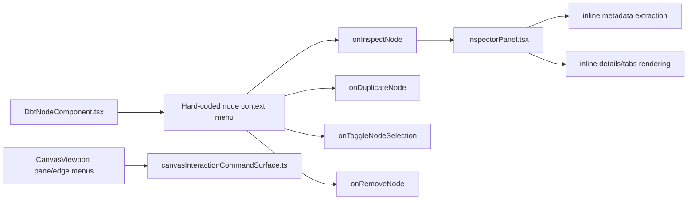
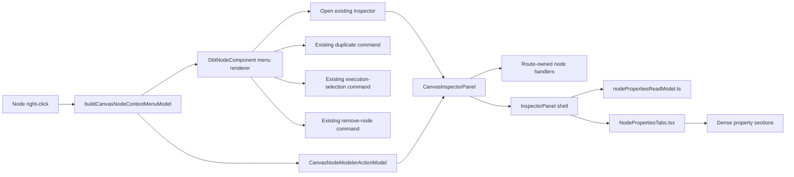

# Canvas Node Context Properties Panel Plan

## Think-First Analysis

Problem summary: Canvas nodes already expose a small right-click menu and the
right Inspector already exposes selected-node details, but the behavior is still
split across ad hoc node JSX, passive Inspector rendering, and route-owned
authoring controls. Users expect a data-modeling workbench posture: right-click
one modeled object, see the complete relevant action set, and open a dense
properties panel with table-like sections instead of a sparse card stack.

Root cause: `DbtNodeComponent.tsx` currently owns node context-menu labels and
availability directly. The pane and edge context menus use the governed
`ResolveCanvasContextMenu` rail through a pure read model, while node menus do
not. The Inspector has useful data tabs, but the generic passive
`InspectorPanel.tsx` also owns metadata extraction and rendering in one broad
module, which makes it hard to expand toward table-like properties without
turning it into another large controller.

External benchmark: Oracle SQL Developer Data Modeler table properties group
table content into predictable panes such as columns, primary/unique keys,
indexes, foreign keys, constraints, comments, storage, materialized view, DDL,
and output. DVT should adopt that information architecture, but only for facts
available in the Canvas read model; unsupported or missing facts must be shown
as empty or unavailable states, not fabricated.

Selected option: extend the existing `ResolveCanvasContextMenu` rail to cover a
node target through a pure node context-menu read model, keep each selected
action routed to existing command seams, and split the Inspector's passive
properties projection into smaller read-model and rendering components. The
first implementation slice opens the existing right Inspector from the context
menu and renders SQL-Developer-style table property tabs for available Canvas
node metadata.

Rejected alternatives:

- Build a floating modal or window. Rejected: the workbench contract says side
  panels are contextual and resizable; fixed windows would add competing chrome.
- Add another route-local command named `OpenNodeProperties`. Rejected: DB-first
  creation-intent returned `reuse-existing-rail` for `ResolveCanvasContextMenu`;
  the action is a presentation selection over the existing Inspector.
- Put all new table panes in `InspectorPanel.tsx`. Rejected: it would deepen
  responsibility overload in a file that already extracts and renders many node
  concerns.
- Add empty mutating menu actions for every imagined SQL Developer operation.
  Rejected: no-stub policy forbids fake actions. Unsupported actions may be
  visible as disabled only when a real reason is available.

## Current Shape



## Target Shape



## Fowler Opportunity Matrix

<!-- markdownlint-disable MD060 -->

| Scenario                                                              | Opportunity             | Fowler pattern                               | DDD owner                         | Command/query rail                                 | Implementation surfaces                                                                                       | Unit or package test                                                | Architecture or user-flow test                                            | Out of scope                                    |
| --------------------------------------------------------------------- | ----------------------- | -------------------------------------------- | --------------------------------- | -------------------------------------------------- | ------------------------------------------------------------------------------------------------------------- | ------------------------------------------------------------------- | ------------------------------------------------------------------------- | ----------------------------------------------- |
| Node menu duplicates local semantics already governed for pane/edge.  | Duplicate semantics     | Presentation Model / Intention-Revealing API | `CanvasContextMenuReadModel`      | `ResolveCanvasContextMenu`                         | `canvasNodeContextMenuModel.ts`, `DbtNodeComponent.tsx`, C&Q catalog, interaction component docs              | `canvasNodeContextMenuModel.test.ts`                                | `DbtNodeComponent.architecture.test.ts`                                   | New global command palette behavior             |
| Read-only node menus still need inspect but must not expose mutation. | Hidden authority        | Policy Object                                | Canvas interaction posture        | `ResolveCanvasContextMenu`, existing commands      | `canvasNodeContextMenuModel.ts`, `DbtNodeComponent.tsx`                                                       | `canvasNodeContextMenuModel.test.ts`                                | `DbtNodeComponent.architecture.test.ts`                                   | Backend authorization changes                   |
| Inspector node actions must not duplicate context-menu semantics.     | Divergent change        | Presentation Model / Command Gateway         | `CanvasContextMenuReadModel`      | `ResolveCanvasContextMenu`, existing commands      | `CanvasInspectorPanel.tsx`, `canvasShellPanelsBuilder.ts`, `canvasNodeContextMenuModel.ts`                    | `CanvasInspectorPanel.test.tsx`, `canvasShellPanelsBuilder.test.ts` | `canvas-interaction-command-surface-component.md`                         | New backend commands for existing graph actions |
| Inspector broad module owns extraction and table rendering.           | Responsibility overload | Extract Component / Compose Method           | Canvas node properties read model | `GetWorkspaceGraphDraft`, `ImportWarehouseSources` | `nodePropertiesReadModel.ts`, `NodePropertiesTabs.tsx`, `InspectorPanel.tsx`, `CanvasInspectorPanel.test.tsx` | `nodePropertiesReadModel.test.ts`, `CanvasInspectorPanel.test.tsx`  | `canvasInspectorAuthoringComponent.architecture.test.ts` or sibling guard | Moving route-owned authoring into passive panel |
| Node properties should feel like a mature table modeler.              | Primitive obsession     | Read Model / Table Module                    | Canvas node properties            | `GetWorkspaceGraphDraft`, `ImportWarehouseSources` | `NodePropertiesTabs.tsx`, `nodePropertiesReadModel.ts`, `InspectorPanel.tsx`                                  | `CanvasInspectorPanel.test.tsx`                                     | Browser smoke on `/canvas` inspector                                      | Real DB index/key persistence                   |
| Unsupported table panes must not pretend to exist.                    | Test-only confidence    | Explicit Unavailable State                   | Canvas node properties            | Existing read rails                                | `nodePropertiesReadModel.ts`, `NodePropertiesTabs.tsx`                                                        | `nodePropertiesReadModel.test.ts`                                   | Presentation test for empty/unsupported pane copy                         | Creating fake constraints/indexes               |

<!-- markdownlint-enable MD060 -->

## Command And Query Rail Posture

DB-first creation-intent result:

```text
reuse-existing-rail query ResolveCanvasContextMenu CanvasContextMenuReadModel
reuse-existing-rail command RemoveCanvasNode Canvas authoring graph
```

Rail decisions:

- `ResolveCanvasContextMenu` is reused and extended to include node-target
  contextual actions.
- `RemoveCanvasNode`, duplicate-node, and execution-selection seams remain
  existing command callbacks passed by the Canvas route.
- Opening the Inspector is route-local presentation selection; it does not
  create a new persistence command.
- The properties panel reads already selected `CanonicalNode`, `CanonicalEdge`,
  and plugin metadata; it does not query backend state directly.
- Domain role, status, node-kind, authorization, and modeler catalog
  vocabularies must come from canonical node contracts, plugin registrations,
  or DB-backed read models. Components may render received vocabularies, but
  they must not become the source of those vocabularies.

## Implementation Plan

### Task 1: Governed plan and rail docs

- Add this mandatory plan.
- Update `canvas-workbench-command-query-catalog.md` so
  `ResolveCanvasContextMenu` names pane, edge, and node targets.
- Update `canvas-interaction-command-surface-component.md` and user stories to
  mention the node-target menu and SQL-Developer-style Inspector handoff.
- Run the feature-mechanization preflight before production code.

### Task 2: Node context-menu read model

- Add `apps/web/src/app/components/canvas/canvasNodeContextMenuModel.ts`.
- Add `apps/web/src/app/components/canvas/canvasNodeContextMenuModel.test.ts`.
- Red cases:
  - node menus always include `inspect-node`;
  - read-only posture excludes duplicate/remove/toggle mutation actions;
  - enabled callbacks produce duplicate, select/deselect, and remove actions
    with stable English labels;
  - destructive action is explicitly flagged.
- Green implementation:
  - build one pure model with groups and action IDs;
  - let `DbtNodeComponent.tsx` render the model instead of declaring action
    availability inline.

### Task 3: Dense node properties read model

- Add `apps/web/src/app/components/inspector/nodePropertiesReadModel.ts`.
- Add `apps/web/src/app/components/inspector/nodePropertiesReadModel.test.ts`.
- Red cases:
  - warehouse source metadata maps to General, Columns, Keys, Indexes, Foreign
    Keys, Constraints, Comments, Code, and Summary sections;
  - missing keys/indexes/constraints render empty states instead of invented
    records;
  - SQL code prefers compiled SQL, then metadata SQL, then config SQL.
- Green implementation:
  - move metadata parsing from `InspectorPanel.tsx` into the pure read model;
  - keep unsupported sections explicit with a reason.

### Task 4: Reusable properties tabs component

- Add `apps/web/src/app/components/inspector/NodePropertiesTabs.tsx`.
- Update `apps/web/src/app/components/InspectorPanel.tsx` to compose the new
  component and keep only shell/header/plugin-panel orchestration.
- Update `CanvasInspectorPanel.test.tsx` so assertions target semantic sections
  and table-like rows, not brittle copy-only transitions.
- Keep the route-owned authoring section inside Details/General; do not move
  write behavior into the passive component.

### Task 4A: Inspector modeler action strip

- Reuse `buildCanvasNodeModelerActionModel` in the right Inspector.
- Wire duplicate, execution-selection, and remove actions through the
  route-owned graph handlers already supplied by the Canvas controller.
- Render action buttons by semantic action ID so presentation tests do not
  depend on mutable button labels.
- Keep destructive actions unavailable when graph mutation permissions are
  blocked.
- Do not introduce embedded role/status/action catalogs; only route-local
  execution-selection posture is passed as UI state.

### Task 5: Browser QA and closeout

- Run targeted canvas/unit/presentation commands first.
- Run typecheck and lint for `@dvt/web`.
- Run docs sync/status generation when docs or source files are added, removed,
  or renamed.
- Run `governance:refresh` if governance/generated surfaces move.
- Commit with `pnpm commit`, then run `pnpm verify:prepush`, create PR, resolve
  comments, merge, return to `main`, and prune/sanitize.

```feature-mechanization
version: 1
featureId: CANVAS-NODE-CONTEXT-PROPERTIES-PANEL-20260604
mechanizationStatus: implemented
noHumanDecisionsRemaining: true
implementationPlan: docs/planning/proposals/mandatory/frontend-and-ux/canvas-node-context-properties-panel-plan-20260604.md
componentGuides:
  - docs/architecture/components/web/graph/canvas-interaction-command-surface-component.md
  - docs/architecture/components/web/graph/canvas-workbench-command-query-catalog.md
  - docs/architecture/components/web/graph/canvas-inspector-authoring-component.md
userStories:
  - docs/architecture/components/web/graph/canvas-interaction-command-surface-user-stories.md
governingSources:
  - AGENTS.md
  - docs/planning/status/governance-document-rule-inventory.md
  - docs/guides/ai-work-protocol.md
  - docs/architecture/command-query-rail-governance.md
  - docs/architecture/fowler-opportunity-planning-governance.md
  - docs/architecture/components/web/workbench-ui-contract-and-component-inventory.md
  - docs/architecture/components/web/graph/canvas-workbench-command-query-catalog.md
  - docs/architecture/components/web/graph/canvas-interaction-command-surface-component.md
  - docs/architecture/components/web/graph/canvas-inspector-authoring-component.md
allowedImplementationSurfaces:
  - apps/web/src/app/components/InspectorPanel.tsx
  - apps/web/src/app/components/canvas/DbtNodeComponent.tsx
  - apps/web/src/app/components/canvas/DbtNodeComponent.architecture.test.ts
  - apps/web/src/app/components/canvas/canvasNodeContextMenuModel.ts
  - apps/web/src/app/components/canvas/canvasNodeContextMenuModel.test.ts
  - apps/web/src/app/components/inspector/NodePropertiesTabs.architecture.test.ts
  - apps/web/src/app/components/inspector/NodePropertiesTabs.tsx
  - apps/web/src/app/components/inspector/NodePropertySectionView.test.tsx
  - apps/web/src/app/components/inspector/NodePropertySectionView.tsx
  - apps/web/src/app/components/inspector/nodePropertiesReadModel.ts
  - apps/web/src/app/components/inspector/nodePropertiesReadModel.test.ts
  - apps/web/src/app/views/Canvas.test.controller.defaults.ts
  - apps/web/src/app/views/canvas/CanvasInspectorPanel.tsx
  - apps/web/src/app/views/canvas/CanvasInspectorPanel.test.tsx
  - apps/web/src/app/views/canvas/canvasControllerViewModel.ts
  - apps/web/src/app/views/canvas/canvasInspectorAuthoring.types.ts
  - apps/web/src/app/views/canvas/canvasInteractionCommandSurface.architecture.test.ts
  - apps/web/src/app/views/canvas/canvasShellBuilder.types.ts
  - apps/web/src/app/views/canvas/canvasShellPanelsBuilder.ts
  - apps/web/src/app/views/canvas/canvasShellPanelsBuilder.test.ts
  - apps/web/src/app/views/canvas/canvasShellPropsBuilder.tsx
  - docs/architecture/components/web/graph/canvas-interaction-command-surface-component.md
  - docs/architecture/components/web/graph/canvas-interaction-command-surface-user-stories.md
  - docs/architecture/components/web/graph/canvas-workbench-command-query-catalog.md
  - docs/planning/proposals/mandatory/frontend-and-ux/canvas-node-context-properties-panel-plan-20260604.md
forbiddenImplementationSurfaces:
  - apps/api/**
  - packages/@dvt/contracts/**
  - packages/@dvt/engine/**
  - packages/@dvt/adapter-*/**
  - packages/@dvt/planner/**
  - specs/**
commandQueryRails:
  - name: ResolveCanvasContextMenu
    type: query
    dddOwner: CanvasContextMenuReadModel
  - name: RemoveCanvasNode
    type: command
    dddOwner: Canvas authoring graph
  - name: GetWorkspaceGraphDraft
    type: query
    dddOwner: WorkspaceGraphAuthoringDraft
  - name: ImportWarehouseSources
    type: command
    dddOwner: Warehouse source import
domainObjects:
  - name: CanvasNodeContextMenuModel
    type: presentation read model
    owner: Canvas interaction surface
  - name: CanvasNodeModelerActionModel
    type: presentation read model
    owner: Canvas interaction surface
  - name: CanvasInspectorNodeModelerActions
    type: route authoring contract
    owner: Canvas Inspector authoring
  - name: CanvasNodePropertiesReadModel
    type: presentation read model
    owner: Canvas node properties
  - name: NodePropertiesTabs
    type: passive view component
    owner: Inspector passive properties
  - name: NodePropertySectionView
    type: passive section view component
    owner: Inspector passive properties section presentation
fowlerSignals:
  - Duplicate semantics
  - Hidden authority
  - Responsibility overload
  - Primitive obsession
  - Test-only confidence
architectureGuards:
  - pnpm --filter @dvt/web test:canvas-architecture:run -- src/app/components/canvas/DbtNodeComponent.architecture.test.ts src/app/views/canvas/canvasInteractionCommandSurface.architecture.test.ts
  - pnpm docs:feature-mechanization:implementation -- --feature CANVAS-NODE-CONTEXT-PROPERTIES-PANEL-20260604
cypressFlows:
  - Browser smoke on /canvas node context menu and Inspector panel
completionGate:
  - pnpm --filter @dvt/web exec vitest run --config vitest.canvas-unit.config.ts src/app/components/canvas/canvasNodeContextMenuModel.test.ts src/app/views/canvas/canvasShellPanelsBuilder.test.ts
  - pnpm --filter @dvt/web exec vitest run --config vitest.unit.config.ts src/app/components/inspector/nodePropertiesReadModel.test.ts
  - pnpm --filter @dvt/web exec vitest run --config vitest.canvas-presentation.config.ts src/app/views/canvas/CanvasInspectorPanel.test.tsx
  - pnpm --filter @dvt/web typecheck
  - pnpm --filter @dvt/web lint
  - pnpm docs:sync
  - pnpm docs:status:generate
  - pnpm docs:gov:manifest:check
  - pnpm verify:prepush
redGreenCycles:
  - id: node-context-menu-read-model
    redTest: pnpm --filter @dvt/web exec vitest run --config vitest.unit.config.ts src/app/components/canvas/canvasNodeContextMenuModel.test.ts
    expectedFailure: canvasNodeContextMenuModel module does not exist.
    patchSurfaces:
      - apps/web/src/app/components/canvas/canvasNodeContextMenuModel.ts
      - apps/web/src/app/components/canvas/canvasNodeContextMenuModel.test.ts
      - apps/web/src/app/components/canvas/DbtNodeComponent.tsx
    greenTest: pnpm --filter @dvt/web exec vitest run --config vitest.unit.config.ts src/app/components/canvas/canvasNodeContextMenuModel.test.ts
  - id: inspector-modeler-action-strip
    redTest: pnpm --filter @dvt/web exec vitest run --config vitest.canvas-presentation.config.ts src/app/views/canvas/CanvasInspectorPanel.test.tsx
    expectedFailure: Inspector does not render semantic modeler action buttons.
    patchSurfaces:
      - apps/web/src/app/components/canvas/canvasNodeContextMenuModel.ts
      - apps/web/src/app/components/canvas/canvasNodeContextMenuModel.test.ts
      - apps/web/src/app/views/canvas/CanvasInspectorPanel.tsx
      - apps/web/src/app/views/canvas/CanvasInspectorPanel.test.tsx
      - apps/web/src/app/views/canvas/canvasControllerViewModel.ts
      - apps/web/src/app/views/canvas/canvasInspectorAuthoring.types.ts
      - apps/web/src/app/views/canvas/canvasShellBuilder.types.ts
      - apps/web/src/app/views/canvas/canvasShellPanelsBuilder.ts
      - apps/web/src/app/views/canvas/canvasShellPanelsBuilder.test.ts
      - apps/web/src/app/views/canvas/canvasShellPropsBuilder.tsx
    greenTest: pnpm --filter @dvt/web exec vitest run --config vitest.canvas-presentation.config.ts src/app/views/canvas/CanvasInspectorPanel.test.tsx
  - id: node-properties-read-model
    redTest: pnpm --filter @dvt/web exec vitest run --config vitest.unit.config.ts src/app/components/inspector/nodePropertiesReadModel.test.ts
    expectedFailure: nodePropertiesReadModel module does not exist.
    patchSurfaces:
      - apps/web/src/app/components/inspector/nodePropertiesReadModel.ts
      - apps/web/src/app/components/inspector/nodePropertiesReadModel.test.ts
    greenTest: pnpm --filter @dvt/web exec vitest run --config vitest.unit.config.ts src/app/components/inspector/nodePropertiesReadModel.test.ts
  - id: inspector-properties-tabs
    redTest: pnpm --filter @dvt/web exec vitest run --config vitest.canvas-presentation.config.ts src/app/views/canvas/CanvasInspectorPanel.test.tsx
    expectedFailure: Inspector does not render the dense table-like properties tabs.
    patchSurfaces:
      - apps/web/src/app/components/InspectorPanel.tsx
      - apps/web/src/app/components/inspector/NodePropertiesTabs.tsx
      - apps/web/src/app/views/canvas/CanvasInspectorPanel.test.tsx
    greenTest: pnpm --filter @dvt/web exec vitest run --config vitest.canvas-presentation.config.ts src/app/views/canvas/CanvasInspectorPanel.test.tsx
  - id: node-property-section-view
    redTest: pnpm --filter @dvt/web exec vitest run --config vitest.presentation.config.ts src/app/components/inspector/NodePropertySectionView.test.tsx
    expectedFailure: NodePropertySectionView module does not exist.
    patchSurfaces:
      - apps/web/src/app/components/inspector/NodePropertySectionView.tsx
      - apps/web/src/app/components/inspector/NodePropertySectionView.test.tsx
      - apps/web/src/app/components/inspector/NodePropertiesTabs.tsx
      - apps/web/src/app/components/inspector/NodePropertiesTabs.architecture.test.ts
    greenTest: pnpm --filter @dvt/web exec vitest run --config vitest.presentation.config.ts src/app/components/inspector/NodePropertySectionView.test.tsx
symbols:
  - { name: CONTEXT_MENU_ACTION_ICONS, path: apps/web/src/app/components/canvas/DbtNodeComponent.tsx, dddOwner: Node context-menu renderer icon map, cqRails: [ResolveCanvasContextMenu], fowlerSignals: [Presentation Model], architectureGuard: pnpm docs:feature-mechanization:implementation -- --feature CANVAS-NODE-CONTEXT-PROPERTIES-PANEL-20260604, cypressCoverage: Browser smoke on /canvas, unitTests: [apps/web/src/app/components/canvas/DbtNodeComponent.architecture.test.ts] }
  - { name: CanvasNodeContextMenuAction, path: apps/web/src/app/components/canvas/canvasNodeContextMenuModel.ts, dddOwner: CanvasContextMenuReadModel, cqRails: [ResolveCanvasContextMenu], fowlerSignals: [Primitive obsession], architectureGuard: pnpm docs:feature-mechanization:implementation -- --feature CANVAS-NODE-CONTEXT-PROPERTIES-PANEL-20260604, cypressCoverage: Browser smoke on /canvas, unitTests: [apps/web/src/app/components/canvas/canvasNodeContextMenuModel.test.ts] }
  - { name: CanvasNodeContextMenuActionGroup, path: apps/web/src/app/components/canvas/canvasNodeContextMenuModel.ts, dddOwner: CanvasContextMenuReadModel, cqRails: [ResolveCanvasContextMenu], fowlerSignals: [Data clump], architectureGuard: pnpm docs:feature-mechanization:implementation -- --feature CANVAS-NODE-CONTEXT-PROPERTIES-PANEL-20260604, cypressCoverage: Browser smoke on /canvas, unitTests: [apps/web/src/app/components/canvas/canvasNodeContextMenuModel.test.ts] }
  - { name: CanvasNodeContextMenuActionId, path: apps/web/src/app/components/canvas/canvasNodeContextMenuModel.ts, dddOwner: CanvasContextMenuReadModel, cqRails: [ResolveCanvasContextMenu], fowlerSignals: [Primitive obsession], architectureGuard: pnpm docs:feature-mechanization:implementation -- --feature CANVAS-NODE-CONTEXT-PROPERTIES-PANEL-20260604, cypressCoverage: Browser smoke on /canvas, unitTests: [apps/web/src/app/components/canvas/canvasNodeContextMenuModel.test.ts] }
  - { name: CanvasNodeModelerActionId, path: apps/web/src/app/components/canvas/canvasNodeContextMenuModel.ts, dddOwner: CanvasContextMenuReadModel, cqRails: [ResolveCanvasContextMenu], fowlerSignals: [Primitive obsession], architectureGuard: pnpm docs:feature-mechanization:implementation -- --feature CANVAS-NODE-CONTEXT-PROPERTIES-PANEL-20260604, cypressCoverage: Browser smoke on /canvas, unitTests: [apps/web/src/app/components/canvas/canvasNodeContextMenuModel.test.ts] }
  - { name: CanvasNodeModelerAction, path: apps/web/src/app/components/canvas/canvasNodeContextMenuModel.ts, dddOwner: CanvasContextMenuReadModel, cqRails: [ResolveCanvasContextMenu], fowlerSignals: [Presentation Model], architectureGuard: pnpm docs:feature-mechanization:implementation -- --feature CANVAS-NODE-CONTEXT-PROPERTIES-PANEL-20260604, cypressCoverage: Browser smoke on /canvas, unitTests: [apps/web/src/app/components/canvas/canvasNodeContextMenuModel.test.ts] }
  - { name: CanvasNodeModelerActionGroup, path: apps/web/src/app/components/canvas/canvasNodeContextMenuModel.ts, dddOwner: CanvasContextMenuReadModel, cqRails: [ResolveCanvasContextMenu], fowlerSignals: [Data clump], architectureGuard: pnpm docs:feature-mechanization:implementation -- --feature CANVAS-NODE-CONTEXT-PROPERTIES-PANEL-20260604, cypressCoverage: Browser smoke on /canvas, unitTests: [apps/web/src/app/components/canvas/canvasNodeContextMenuModel.test.ts] }
  - { name: CanvasNodeModelerActionModel, path: apps/web/src/app/components/canvas/canvasNodeContextMenuModel.ts, dddOwner: CanvasContextMenuReadModel, cqRails: [ResolveCanvasContextMenu], fowlerSignals: [Presentation Model], architectureGuard: pnpm docs:feature-mechanization:implementation -- --feature CANVAS-NODE-CONTEXT-PROPERTIES-PANEL-20260604, cypressCoverage: Browser smoke on /canvas, unitTests: [apps/web/src/app/components/canvas/canvasNodeContextMenuModel.test.ts] }
  - { name: CanvasNodeContextMenuModel, path: apps/web/src/app/components/canvas/canvasNodeContextMenuModel.ts, dddOwner: CanvasContextMenuReadModel, cqRails: [ResolveCanvasContextMenu], fowlerSignals: [Duplicate semantics], architectureGuard: pnpm docs:feature-mechanization:implementation -- --feature CANVAS-NODE-CONTEXT-PROPERTIES-PANEL-20260604, cypressCoverage: Browser smoke on /canvas, unitTests: [apps/web/src/app/components/canvas/canvasNodeContextMenuModel.test.ts] }
  - { name: CanvasNodeContextMenuTarget, path: apps/web/src/app/components/canvas/canvasNodeContextMenuModel.ts, dddOwner: CanvasContextMenuReadModel, cqRails: [ResolveCanvasContextMenu], fowlerSignals: [Value Object], architectureGuard: pnpm docs:feature-mechanization:implementation -- --feature CANVAS-NODE-CONTEXT-PROPERTIES-PANEL-20260604, cypressCoverage: Browser smoke on /canvas, unitTests: [apps/web/src/app/components/canvas/canvasNodeContextMenuModel.test.ts] }
  - { name: BuildCanvasNodeContextMenuModelArgs, path: apps/web/src/app/components/canvas/canvasNodeContextMenuModel.ts, dddOwner: CanvasContextMenuReadModel input DTO, cqRails: [ResolveCanvasContextMenu], fowlerSignals: [Data clump], architectureGuard: pnpm docs:feature-mechanization:implementation -- --feature CANVAS-NODE-CONTEXT-PROPERTIES-PANEL-20260604, cypressCoverage: Browser smoke on /canvas, unitTests: [apps/web/src/app/components/canvas/canvasNodeContextMenuModel.test.ts] }
  - { name: BuildCanvasNodeModelerActionModelArgs, path: apps/web/src/app/components/canvas/canvasNodeContextMenuModel.ts, dddOwner: CanvasContextMenuReadModel input DTO, cqRails: [ResolveCanvasContextMenu], fowlerSignals: [Data clump], architectureGuard: pnpm docs:feature-mechanization:implementation -- --feature CANVAS-NODE-CONTEXT-PROPERTIES-PANEL-20260604, cypressCoverage: Browser smoke on /canvas, unitTests: [apps/web/src/app/components/canvas/canvasNodeContextMenuModel.test.ts] }
  - { name: buildCanvasNodeModelerActionModel, path: apps/web/src/app/components/canvas/canvasNodeContextMenuModel.ts, dddOwner: CanvasContextMenuReadModel, cqRails: [ResolveCanvasContextMenu], fowlerSignals: [Extract Function], architectureGuard: pnpm docs:feature-mechanization:implementation -- --feature CANVAS-NODE-CONTEXT-PROPERTIES-PANEL-20260604, cypressCoverage: Browser smoke on /canvas, unitTests: [apps/web/src/app/components/canvas/canvasNodeContextMenuModel.test.ts] }
  - { name: buildCanvasNodeContextMenuModel, path: apps/web/src/app/components/canvas/canvasNodeContextMenuModel.ts, dddOwner: CanvasContextMenuReadModel, cqRails: [ResolveCanvasContextMenu], fowlerSignals: [Policy Object], architectureGuard: pnpm docs:feature-mechanization:implementation -- --feature CANVAS-NODE-CONTEXT-PROPERTIES-PANEL-20260604, cypressCoverage: Browser smoke on /canvas, unitTests: [apps/web/src/app/components/canvas/canvasNodeContextMenuModel.test.ts] }
  - { name: CanvasInspectorNodeModelerActions, path: apps/web/src/app/views/canvas/canvasInspectorAuthoring.types.ts, dddOwner: Canvas Inspector authoring contract, cqRails: [ResolveCanvasContextMenu], fowlerSignals: [Data clump], architectureGuard: pnpm docs:feature-mechanization:implementation -- --feature CANVAS-NODE-CONTEXT-PROPERTIES-PANEL-20260604, cypressCoverage: Browser smoke on /canvas, unitTests: [apps/web/src/app/views/canvas/CanvasInspectorPanel.test.tsx] }
  - { name: MODELER_ACTION_ICONS, path: apps/web/src/app/views/canvas/CanvasInspectorPanel.tsx, dddOwner: Inspector modeler action renderer, cqRails: [ResolveCanvasContextMenu], fowlerSignals: [Presentation Model], architectureGuard: pnpm docs:feature-mechanization:implementation -- --feature CANVAS-NODE-CONTEXT-PROPERTIES-PANEL-20260604, cypressCoverage: Browser smoke on /canvas, unitTests: [apps/web/src/app/views/canvas/CanvasInspectorPanel.test.tsx] }
  - { name: CanvasInspectorModelerActions, path: apps/web/src/app/views/canvas/CanvasInspectorPanel.tsx, dddOwner: Inspector modeler action renderer, cqRails: [ResolveCanvasContextMenu], fowlerSignals: [Command Gateway], architectureGuard: pnpm docs:feature-mechanization:implementation -- --feature CANVAS-NODE-CONTEXT-PROPERTIES-PANEL-20260604, cypressCoverage: Browser smoke on /canvas, unitTests: [apps/web/src/app/views/canvas/CanvasInspectorPanel.test.tsx] }
  - { name: actionById, path: apps/web/src/app/components/canvas/canvasNodeContextMenuModel.test.ts, dddOwner: CanvasContextMenuReadModel test helper, cqRails: [ResolveCanvasContextMenu], fowlerSignals: [Semantic test helper], architectureGuard: pnpm docs:feature-mechanization:implementation -- --feature CANVAS-NODE-CONTEXT-PROPERTIES-PANEL-20260604, cypressCoverage: N/A, unitTests: [apps/web/src/app/components/canvas/canvasNodeContextMenuModel.test.ts] }
  - { name: actionIds, path: apps/web/src/app/components/canvas/canvasNodeContextMenuModel.test.ts, dddOwner: CanvasContextMenuReadModel test helper, cqRails: [ResolveCanvasContextMenu], fowlerSignals: [Semantic test helper], architectureGuard: pnpm docs:feature-mechanization:implementation -- --feature CANVAS-NODE-CONTEXT-PROPERTIES-PANEL-20260604, cypressCoverage: N/A, unitTests: [apps/web/src/app/components/canvas/canvasNodeContextMenuModel.test.ts] }
  - { name: INSPECTOR_TEST_NODE_KIND, path: apps/web/src/app/views/canvas/canvasShellPanelsBuilder.test.ts, dddOwner: Inspector modeler action semantic fixture, cqRails: [ResolveCanvasContextMenu], fowlerSignals: [Semantic test fixture], architectureGuard: pnpm docs:feature-mechanization:implementation -- --feature CANVAS-NODE-CONTEXT-PROPERTIES-PANEL-20260604, cypressCoverage: N/A, unitTests: [apps/web/src/app/views/canvas/canvasShellPanelsBuilder.test.ts] }
  - { name: buildInspectorNode, path: apps/web/src/app/views/canvas/canvasShellPanelsBuilder.test.ts, dddOwner: Inspector modeler action semantic fixture, cqRails: [ResolveCanvasContextMenu], fowlerSignals: [Semantic test fixture], architectureGuard: pnpm docs:feature-mechanization:implementation -- --feature CANVAS-NODE-CONTEXT-PROPERTIES-PANEL-20260604, cypressCoverage: N/A, unitTests: [apps/web/src/app/views/canvas/canvasShellPanelsBuilder.test.ts] }
  - { name: modelerActionButton, path: apps/web/src/app/views/canvas/CanvasInspectorPanel.test.tsx, dddOwner: Inspector modeler action semantic test helper, cqRails: [ResolveCanvasContextMenu], fowlerSignals: [Semantic test helper], architectureGuard: pnpm docs:feature-mechanization:implementation -- --feature CANVAS-NODE-CONTEXT-PROPERTIES-PANEL-20260604, cypressCoverage: N/A, unitTests: [apps/web/src/app/views/canvas/CanvasInspectorPanel.test.tsx] }
  - { name: NodePropertySectionId, path: apps/web/src/app/components/inspector/nodePropertiesReadModel.ts, dddOwner: Canvas node properties section vocabulary, cqRails: [GetWorkspaceGraphDraft, ImportWarehouseSources], fowlerSignals: [Primitive obsession], architectureGuard: pnpm docs:feature-mechanization:implementation -- --feature CANVAS-NODE-CONTEXT-PROPERTIES-PANEL-20260604, cypressCoverage: Browser smoke on /canvas, unitTests: [apps/web/src/app/components/inspector/nodePropertiesReadModel.test.ts] }
  - { name: NodePropertyRow, path: apps/web/src/app/components/inspector/nodePropertiesReadModel.ts, dddOwner: Canvas node properties scalar row, cqRails: [GetWorkspaceGraphDraft, ImportWarehouseSources], fowlerSignals: [Value Object], architectureGuard: pnpm docs:feature-mechanization:implementation -- --feature CANVAS-NODE-CONTEXT-PROPERTIES-PANEL-20260604, cypressCoverage: Browser smoke on /canvas, unitTests: [apps/web/src/app/components/inspector/nodePropertiesReadModel.test.ts] }
  - { name: NodePropertySection, path: apps/web/src/app/components/inspector/nodePropertiesReadModel.ts, dddOwner: Canvas node properties, cqRails: [GetWorkspaceGraphDraft, ImportWarehouseSources], fowlerSignals: [Primitive obsession], architectureGuard: pnpm docs:feature-mechanization:implementation -- --feature CANVAS-NODE-CONTEXT-PROPERTIES-PANEL-20260604, cypressCoverage: Browser smoke on /canvas, unitTests: [apps/web/src/app/components/inspector/nodePropertiesReadModel.test.ts] }
  - { name: NodePropertyTableRow, path: apps/web/src/app/components/inspector/nodePropertiesReadModel.ts, dddOwner: Canvas node properties table row, cqRails: [GetWorkspaceGraphDraft, ImportWarehouseSources], fowlerSignals: [Value Object], architectureGuard: pnpm docs:feature-mechanization:implementation -- --feature CANVAS-NODE-CONTEXT-PROPERTIES-PANEL-20260604, cypressCoverage: Browser smoke on /canvas, unitTests: [apps/web/src/app/components/inspector/nodePropertiesReadModel.test.ts] }
  - { name: NodePropertiesReadModel, path: apps/web/src/app/components/inspector/nodePropertiesReadModel.ts, dddOwner: Canvas node properties, cqRails: [GetWorkspaceGraphDraft, ImportWarehouseSources], fowlerSignals: [Read Model], architectureGuard: pnpm docs:feature-mechanization:implementation -- --feature CANVAS-NODE-CONTEXT-PROPERTIES-PANEL-20260604, cypressCoverage: Browser smoke on /canvas, unitTests: [apps/web/src/app/components/inspector/nodePropertiesReadModel.test.ts] }
  - { name: BuildNodePropertiesReadModelArgs, path: apps/web/src/app/components/inspector/nodePropertiesReadModel.ts, dddOwner: Canvas node properties input DTO, cqRails: [GetWorkspaceGraphDraft, ImportWarehouseSources], fowlerSignals: [Data clump], architectureGuard: pnpm docs:feature-mechanization:implementation -- --feature CANVAS-NODE-CONTEXT-PROPERTIES-PANEL-20260604, cypressCoverage: Browser smoke on /canvas, unitTests: [apps/web/src/app/components/inspector/nodePropertiesReadModel.test.ts] }
  - { name: InspectorColumn, path: apps/web/src/app/components/inspector/nodePropertiesReadModel.ts, dddOwner: Canvas node properties column value object, cqRails: [GetWorkspaceGraphDraft, ImportWarehouseSources], fowlerSignals: [Value Object], architectureGuard: pnpm docs:feature-mechanization:implementation -- --feature CANVAS-NODE-CONTEXT-PROPERTIES-PANEL-20260604, cypressCoverage: Browser smoke on /canvas, unitTests: [apps/web/src/app/components/inspector/nodePropertiesReadModel.test.ts] }
  - { name: addRow, path: apps/web/src/app/components/inspector/nodePropertiesReadModel.ts, dddOwner: Canvas node properties row assembler, cqRails: [GetWorkspaceGraphDraft, ImportWarehouseSources], fowlerSignals: [Extract Function], architectureGuard: pnpm docs:feature-mechanization:implementation -- --feature CANVAS-NODE-CONTEXT-PROPERTIES-PANEL-20260604, cypressCoverage: Browser smoke on /canvas, unitTests: [apps/web/src/app/components/inspector/nodePropertiesReadModel.test.ts] }
  - { name: asRecord, path: apps/web/src/app/components/inspector/nodePropertiesReadModel.ts, dddOwner: Canvas node properties metadata guard, cqRails: [GetWorkspaceGraphDraft, ImportWarehouseSources], fowlerSignals: [Replace Primitive with Query Method], architectureGuard: pnpm docs:feature-mechanization:implementation -- --feature CANVAS-NODE-CONTEXT-PROPERTIES-PANEL-20260604, cypressCoverage: Browser smoke on /canvas, unitTests: [apps/web/src/app/components/inspector/nodePropertiesReadModel.test.ts] }
  - { name: buildColumnRows, path: apps/web/src/app/components/inspector/nodePropertiesReadModel.ts, dddOwner: Canvas node properties column projection, cqRails: [GetWorkspaceGraphDraft, ImportWarehouseSources], fowlerSignals: [Read Model], architectureGuard: pnpm docs:feature-mechanization:implementation -- --feature CANVAS-NODE-CONTEXT-PROPERTIES-PANEL-20260604, cypressCoverage: Browser smoke on /canvas, unitTests: [apps/web/src/app/components/inspector/nodePropertiesReadModel.test.ts] }
  - { name: buildCommentRows, path: apps/web/src/app/components/inspector/nodePropertiesReadModel.ts, dddOwner: Canvas node properties comment projection, cqRails: [GetWorkspaceGraphDraft, ImportWarehouseSources], fowlerSignals: [Read Model], architectureGuard: pnpm docs:feature-mechanization:implementation -- --feature CANVAS-NODE-CONTEXT-PROPERTIES-PANEL-20260604, cypressCoverage: Browser smoke on /canvas, unitTests: [apps/web/src/app/components/inspector/nodePropertiesReadModel.test.ts] }
  - { name: buildConstraintRows, path: apps/web/src/app/components/inspector/nodePropertiesReadModel.ts, dddOwner: Canvas node properties constraint projection, cqRails: [GetWorkspaceGraphDraft, ImportWarehouseSources], fowlerSignals: [Read Model], architectureGuard: pnpm docs:feature-mechanization:implementation -- --feature CANVAS-NODE-CONTEXT-PROPERTIES-PANEL-20260604, cypressCoverage: Browser smoke on /canvas, unitTests: [apps/web/src/app/components/inspector/nodePropertiesReadModel.test.ts] }
  - { name: buildForeignKeyRows, path: apps/web/src/app/components/inspector/nodePropertiesReadModel.ts, dddOwner: Canvas node properties foreign-key projection, cqRails: [GetWorkspaceGraphDraft, ImportWarehouseSources], fowlerSignals: [Read Model], architectureGuard: pnpm docs:feature-mechanization:implementation -- --feature CANVAS-NODE-CONTEXT-PROPERTIES-PANEL-20260604, cypressCoverage: Browser smoke on /canvas, unitTests: [apps/web/src/app/components/inspector/nodePropertiesReadModel.test.ts] }
  - { name: buildGeneralRows, path: apps/web/src/app/components/inspector/nodePropertiesReadModel.ts, dddOwner: Canvas node properties general projection, cqRails: [GetWorkspaceGraphDraft, ImportWarehouseSources], fowlerSignals: [Read Model], architectureGuard: pnpm docs:feature-mechanization:implementation -- --feature CANVAS-NODE-CONTEXT-PROPERTIES-PANEL-20260604, cypressCoverage: Browser smoke on /canvas, unitTests: [apps/web/src/app/components/inspector/nodePropertiesReadModel.test.ts] }
  - { name: buildIndexRows, path: apps/web/src/app/components/inspector/nodePropertiesReadModel.ts, dddOwner: Canvas node properties index projection, cqRails: [GetWorkspaceGraphDraft, ImportWarehouseSources], fowlerSignals: [Read Model], architectureGuard: pnpm docs:feature-mechanization:implementation -- --feature CANVAS-NODE-CONTEXT-PROPERTIES-PANEL-20260604, cypressCoverage: Browser smoke on /canvas, unitTests: [apps/web/src/app/components/inspector/nodePropertiesReadModel.test.ts] }
  - { name: buildKeyRows, path: apps/web/src/app/components/inspector/nodePropertiesReadModel.ts, dddOwner: Canvas node properties key projection, cqRails: [GetWorkspaceGraphDraft, ImportWarehouseSources], fowlerSignals: [Read Model], architectureGuard: pnpm docs:feature-mechanization:implementation -- --feature CANVAS-NODE-CONTEXT-PROPERTIES-PANEL-20260604, cypressCoverage: Browser smoke on /canvas, unitTests: [apps/web/src/app/components/inspector/nodePropertiesReadModel.test.ts] }
  - { name: buildNodePropertiesReadModel, path: apps/web/src/app/components/inspector/nodePropertiesReadModel.ts, dddOwner: Canvas node properties, cqRails: [GetWorkspaceGraphDraft, ImportWarehouseSources], fowlerSignals: [Extract Function], architectureGuard: pnpm docs:feature-mechanization:implementation -- --feature CANVAS-NODE-CONTEXT-PROPERTIES-PANEL-20260604, cypressCoverage: Browser smoke on /canvas, unitTests: [apps/web/src/app/components/inspector/nodePropertiesReadModel.test.ts] }
  - { name: buildSummaryRows, path: apps/web/src/app/components/inspector/nodePropertiesReadModel.ts, dddOwner: Canvas node properties graph summary projection, cqRails: [GetWorkspaceGraphDraft, ImportWarehouseSources], fowlerSignals: [Read Model], architectureGuard: pnpm docs:feature-mechanization:implementation -- --feature CANVAS-NODE-CONTEXT-PROPERTIES-PANEL-20260604, cypressCoverage: Browser smoke on /canvas, unitTests: [apps/web/src/app/components/inspector/nodePropertiesReadModel.test.ts] }
  - { name: createSection, path: apps/web/src/app/components/inspector/nodePropertiesReadModel.ts, dddOwner: Canvas node properties section assembler, cqRails: [GetWorkspaceGraphDraft, ImportWarehouseSources], fowlerSignals: [Factory Function], architectureGuard: pnpm docs:feature-mechanization:implementation -- --feature CANVAS-NODE-CONTEXT-PROPERTIES-PANEL-20260604, cypressCoverage: Browser smoke on /canvas, unitTests: [apps/web/src/app/components/inspector/nodePropertiesReadModel.test.ts] }
  - { name: formatWords, path: apps/web/src/app/components/inspector/nodePropertiesReadModel.ts, dddOwner: Canvas node properties display normalization, cqRails: [GetWorkspaceGraphDraft, ImportWarehouseSources], fowlerSignals: [Replace Primitive with Query Method], architectureGuard: pnpm docs:feature-mechanization:implementation -- --feature CANVAS-NODE-CONTEXT-PROPERTIES-PANEL-20260604, cypressCoverage: Browser smoke on /canvas, unitTests: [apps/web/src/app/components/inspector/nodePropertiesReadModel.test.ts] }
  - { name: isRecord, path: apps/web/src/app/components/inspector/nodePropertiesReadModel.ts, dddOwner: Canvas node properties metadata guard, cqRails: [GetWorkspaceGraphDraft, ImportWarehouseSources], fowlerSignals: [Replace Primitive with Query Method], architectureGuard: pnpm docs:feature-mechanization:implementation -- --feature CANVAS-NODE-CONTEXT-PROPERTIES-PANEL-20260604, cypressCoverage: Browser smoke on /canvas, unitTests: [apps/web/src/app/components/inspector/nodePropertiesReadModel.test.ts] }
  - { name: readBoolean, path: apps/web/src/app/components/inspector/nodePropertiesReadModel.ts, dddOwner: Canvas node properties metadata reader, cqRails: [GetWorkspaceGraphDraft, ImportWarehouseSources], fowlerSignals: [Primitive obsession], architectureGuard: pnpm docs:feature-mechanization:implementation -- --feature CANVAS-NODE-CONTEXT-PROPERTIES-PANEL-20260604, cypressCoverage: Browser smoke on /canvas, unitTests: [apps/web/src/app/components/inspector/nodePropertiesReadModel.test.ts] }
  - { name: readColumns, path: apps/web/src/app/components/inspector/nodePropertiesReadModel.ts, dddOwner: Canvas node properties column normalization, cqRails: [GetWorkspaceGraphDraft, ImportWarehouseSources], fowlerSignals: [Read Model], architectureGuard: pnpm docs:feature-mechanization:implementation -- --feature CANVAS-NODE-CONTEXT-PROPERTIES-PANEL-20260604, cypressCoverage: Browser smoke on /canvas, unitTests: [apps/web/src/app/components/inspector/nodePropertiesReadModel.test.ts] }
  - { name: readFirstString, path: apps/web/src/app/components/inspector/nodePropertiesReadModel.ts, dddOwner: Canvas node properties metadata reader, cqRails: [GetWorkspaceGraphDraft, ImportWarehouseSources], fowlerSignals: [Replace Conditional with Query Method], architectureGuard: pnpm docs:feature-mechanization:implementation -- --feature CANVAS-NODE-CONTEXT-PROPERTIES-PANEL-20260604, cypressCoverage: Browser smoke on /canvas, unitTests: [apps/web/src/app/components/inspector/nodePropertiesReadModel.test.ts] }
  - { name: readNumber, path: apps/web/src/app/components/inspector/nodePropertiesReadModel.ts, dddOwner: Canvas node properties metadata reader, cqRails: [GetWorkspaceGraphDraft, ImportWarehouseSources], fowlerSignals: [Primitive obsession], architectureGuard: pnpm docs:feature-mechanization:implementation -- --feature CANVAS-NODE-CONTEXT-PROPERTIES-PANEL-20260604, cypressCoverage: Browser smoke on /canvas, unitTests: [apps/web/src/app/components/inspector/nodePropertiesReadModel.test.ts] }
  - { name: readString, path: apps/web/src/app/components/inspector/nodePropertiesReadModel.ts, dddOwner: Canvas node properties metadata reader, cqRails: [GetWorkspaceGraphDraft, ImportWarehouseSources], fowlerSignals: [Primitive obsession], architectureGuard: pnpm docs:feature-mechanization:implementation -- --feature CANVAS-NODE-CONTEXT-PROPERTIES-PANEL-20260604, cypressCoverage: Browser smoke on /canvas, unitTests: [apps/web/src/app/components/inspector/nodePropertiesReadModel.test.ts] }
  - { name: readStringArray, path: apps/web/src/app/components/inspector/nodePropertiesReadModel.ts, dddOwner: Canvas node properties metadata reader, cqRails: [GetWorkspaceGraphDraft, ImportWarehouseSources], fowlerSignals: [Primitive obsession], architectureGuard: pnpm docs:feature-mechanization:implementation -- --feature CANVAS-NODE-CONTEXT-PROPERTIES-PANEL-20260604, cypressCoverage: Browser smoke on /canvas, unitTests: [apps/web/src/app/components/inspector/nodePropertiesReadModel.test.ts] }
  - { name: NodePropertySectionView, path: apps/web/src/app/components/inspector/NodePropertySectionView.tsx, dddOwner: Inspector passive properties section presentation, cqRails: [GetWorkspaceGraphDraft, ImportWarehouseSources], fowlerSignals: [Extract Component], architectureGuard: pnpm docs:feature-mechanization:implementation -- --feature CANVAS-NODE-CONTEXT-PROPERTIES-PANEL-20260604, cypressCoverage: Browser smoke on /canvas, unitTests: [apps/web/src/app/components/inspector/NodePropertySectionView.test.tsx] }
  - { name: NodePropertySectionViewProps, path: apps/web/src/app/components/inspector/NodePropertySectionView.tsx, dddOwner: Inspector passive properties section presentation DTO, cqRails: [GetWorkspaceGraphDraft, ImportWarehouseSources], fowlerSignals: [Data clump], architectureGuard: pnpm docs:feature-mechanization:implementation -- --feature CANVAS-NODE-CONTEXT-PROPERTIES-PANEL-20260604, cypressCoverage: Browser smoke on /canvas, unitTests: [apps/web/src/app/components/inspector/NodePropertySectionView.test.tsx] }
  - { name: renderSectionBody, path: apps/web/src/app/components/inspector/NodePropertySectionView.tsx, dddOwner: Inspector passive properties rendering, cqRails: [GetWorkspaceGraphDraft, ImportWarehouseSources], fowlerSignals: [Extract Function], architectureGuard: pnpm docs:feature-mechanization:implementation -- --feature CANVAS-NODE-CONTEXT-PROPERTIES-PANEL-20260604, cypressCoverage: Browser smoke on /canvas, unitTests: [apps/web/src/app/components/inspector/NodePropertySectionView.test.tsx] }
  - { name: renderSectionCountBadge, path: apps/web/src/app/components/inspector/NodePropertySectionView.tsx, dddOwner: Inspector passive properties section presentation count badge, cqRails: [GetWorkspaceGraphDraft, ImportWarehouseSources], fowlerSignals: [Extract Function], architectureGuard: pnpm docs:feature-mechanization:implementation -- --feature CANVAS-NODE-CONTEXT-PROPERTIES-PANEL-20260604, cypressCoverage: Browser smoke on /canvas, unitTests: [apps/web/src/app/components/inspector/NodePropertySectionView.test.tsx] }
  - { name: sectionSlot, path: apps/web/src/app/components/inspector/NodePropertySectionView.tsx, dddOwner: Inspector passive properties semantic slots, cqRails: [GetWorkspaceGraphDraft, ImportWarehouseSources], fowlerSignals: [Semantic Fitness Function], architectureGuard: pnpm docs:feature-mechanization:implementation -- --feature CANVAS-NODE-CONTEXT-PROPERTIES-PANEL-20260604, cypressCoverage: Browser smoke on /canvas, unitTests: [apps/web/src/app/components/inspector/NodePropertySectionView.test.tsx] }
  - { name: NodePropertiesTabs, path: apps/web/src/app/components/inspector/NodePropertiesTabs.tsx, dddOwner: Inspector passive properties, cqRails: [GetWorkspaceGraphDraft, ImportWarehouseSources], fowlerSignals: [Extract Component], architectureGuard: pnpm docs:feature-mechanization:implementation -- --feature CANVAS-NODE-CONTEXT-PROPERTIES-PANEL-20260604, cypressCoverage: Browser smoke on /canvas, unitTests: [apps/web/src/app/views/canvas/CanvasInspectorPanel.test.tsx] }
  - { name: NodePropertiesTabsProps, path: apps/web/src/app/components/inspector/NodePropertiesTabs.tsx, dddOwner: Inspector passive properties DTO, cqRails: [GetWorkspaceGraphDraft, ImportWarehouseSources], fowlerSignals: [Data clump], architectureGuard: pnpm docs:feature-mechanization:implementation -- --feature CANVAS-NODE-CONTEXT-PROPERTIES-PANEL-20260604, cypressCoverage: Browser smoke on /canvas, unitTests: [apps/web/src/app/views/canvas/CanvasInspectorPanel.test.tsx] }
  - { name: resolveActiveInspectorTab, path: apps/web/src/app/components/InspectorPanel.tsx, dddOwner: Inspector passive properties tab selection, cqRails: [GetWorkspaceGraphDraft, ImportWarehouseSources], fowlerSignals: [Replace Conditional with Query Method], architectureGuard: pnpm docs:feature-mechanization:implementation -- --feature CANVAS-NODE-CONTEXT-PROPERTIES-PANEL-20260604, cypressCoverage: Browser smoke on /canvas, unitTests: [apps/web/src/app/views/canvas/CanvasInspectorPanel.test.tsx] }
  - { name: buildSourceNode, path: apps/web/src/app/components/inspector/nodePropertiesReadModel.test.ts, dddOwner: Canvas node properties semantic fixture, cqRails: [GetWorkspaceGraphDraft, ImportWarehouseSources], fowlerSignals: [Semantic test fixture], architectureGuard: pnpm docs:feature-mechanization:implementation -- --feature CANVAS-NODE-CONTEXT-PROPERTIES-PANEL-20260604, cypressCoverage: N/A, unitTests: [apps/web/src/app/components/inspector/nodePropertiesReadModel.test.ts] }
  - { name: downstreamNode, path: apps/web/src/app/components/inspector/nodePropertiesReadModel.test.ts, dddOwner: Canvas node properties semantic fixture, cqRails: [GetWorkspaceGraphDraft], fowlerSignals: [Semantic test fixture], architectureGuard: pnpm docs:feature-mechanization:implementation -- --feature CANVAS-NODE-CONTEXT-PROPERTIES-PANEL-20260604, cypressCoverage: N/A, unitTests: [apps/web/src/app/components/inspector/nodePropertiesReadModel.test.ts] }
  - { name: graphEdges, path: apps/web/src/app/components/inspector/nodePropertiesReadModel.test.ts, dddOwner: Canvas node properties graph fixture, cqRails: [GetWorkspaceGraphDraft], fowlerSignals: [Semantic test fixture], architectureGuard: pnpm docs:feature-mechanization:implementation -- --feature CANVAS-NODE-CONTEXT-PROPERTIES-PANEL-20260604, cypressCoverage: N/A, unitTests: [apps/web/src/app/components/inspector/nodePropertiesReadModel.test.ts] }
  - { name: rowValue, path: apps/web/src/app/components/inspector/nodePropertiesReadModel.test.ts, dddOwner: Canvas node properties test helper, cqRails: [GetWorkspaceGraphDraft, ImportWarehouseSources], fowlerSignals: [Semantic test helper], architectureGuard: pnpm docs:feature-mechanization:implementation -- --feature CANVAS-NODE-CONTEXT-PROPERTIES-PANEL-20260604, cypressCoverage: N/A, unitTests: [apps/web/src/app/components/inspector/nodePropertiesReadModel.test.ts] }
  - { name: sectionById, path: apps/web/src/app/components/inspector/nodePropertiesReadModel.test.ts, dddOwner: Canvas node properties test helper, cqRails: [GetWorkspaceGraphDraft, ImportWarehouseSources], fowlerSignals: [Semantic test helper], architectureGuard: pnpm docs:feature-mechanization:implementation -- --feature CANVAS-NODE-CONTEXT-PROPERTIES-PANEL-20260604, cypressCoverage: N/A, unitTests: [apps/web/src/app/components/inspector/nodePropertiesReadModel.test.ts] }
  - { name: tableRowById, path: apps/web/src/app/components/inspector/nodePropertiesReadModel.test.ts, dddOwner: Canvas node properties test helper, cqRails: [GetWorkspaceGraphDraft, ImportWarehouseSources], fowlerSignals: [Semantic test helper], architectureGuard: pnpm docs:feature-mechanization:implementation -- --feature CANVAS-NODE-CONTEXT-PROPERTIES-PANEL-20260604, cypressCoverage: N/A, unitTests: [apps/web/src/app/components/inspector/nodePropertiesReadModel.test.ts] }
```

## Closeout Expectations

- The node context menu is model-driven and uses stable English labels.
- Read-only node menus keep inspection available and suppress mutation actions.
- The right Inspector opens from the context menu and renders table-like
  sections for available data: General, Columns, Keys, Indexes, Foreign Keys,
  Constraints, Comments, Code, and Summary.
- Missing key/index/constraint data renders explicit empty states rather than
  fake records.
- `InspectorPanel.tsx` is smaller by extraction, and the new components have
  focused tests.
- No backend, contract, engine, adapter, or planner surfaces are touched in this
  slice.
