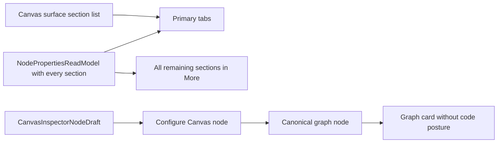
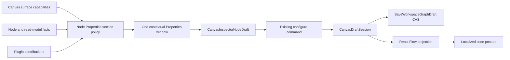

# Canvas Node Properties Authoring Roundtrip Plan

## Decision

Complete the existing contextual Node Properties surface without adding another
editor, store, route, or persistence authority. The slice reuses the current
Canvas and dbt authoring rails:

- `InspectCanvasNode` enters the one contextual window;
- `ConfigureCanvasDbtNode` and `ConfigureCanvasDvtNode` apply supported Graph
  Draft changes;
- `SaveWorkspaceGraphDraft` persists the authoritative Graph Draft with CAS;
- existing workspace-file and dbt YAML commands remain authoritative for
  file-backed dbt projects.

Code-capable nodes present Code first and use it as the default entry section.
The section set is derived from the Canvas surface policy plus actual node,
read-model, and contribution capabilities. Unsupported empty sections do not
become a generic overflow menu.

The graph card projects the existing code truth as a compact localized posture:
`Authored`, `Generated`, or `File`. This is a projection of canonical node/file
truth, not a new authoring state.

## Current State



The primary-section list currently controls placement, not capability. As a
result, empty unsupported sections remain reachable through `More`. Graph Draft
code is stored in the canonical node and persisted correctly, but the card does
not expose that the projected code changed from generated to authored.

## Target State



## Think-First Analysis

### Problem and root cause

The product already has one Properties window and real authoring commands, but
its internal navigation confuses section placement with section support. The
same split also leaves code provenance invisible on the graph after a user
applies an edit. Independent unit and live tests prove individual stages but do
not guard the full user-observable roundtrip.

### Constraints and invariants

- ADR-0060 permits exactly one authoring authority per Canvas.
- React Flow is a projection and MUST NOT become the save payload owner.
- File-backed dbt SQL and YAML MUST remain file-authoritative.
- Derived artifacts MUST remain read-only.
- One node MUST retain one contextual Properties window.
- Code MUST be the default entry section when the node has code capability.
- ES/EN, keyboard entry, focus restoration, movement, closing, compact viewport,
  and accessibility MUST use the same semantic surface.

### Options

| Option                                                   | Decision | Rationale                                                              |
| -------------------------------------------------------- | -------- | ---------------------------------------------------------------------- |
| Add a generic schema/form/section registry               | Rejected | Adds a second metadata mechanism without removing current authorities. |
| Hide empty tabs in JSX                                   | Rejected | Masks the symptom and leaves capability policy implicit.               |
| Extend the existing section and card presentation models | Selected | Smallest coherent change; reuses the current DDD owners and rails.     |

## Fowler Opportunity Matrix

| Scenario                                              | Opportunity                                   | Fowler pattern                                    | DDD owner                                             | Command/query rail                                                            | Implementation surfaces                             | Unit/package test                    | Architecture test                                | User-flow test                        | Out of scope                           |
| ----------------------------------------------------- | --------------------------------------------- | ------------------------------------------------- | ----------------------------------------------------- | ----------------------------------------------------------------------------- | --------------------------------------------------- | ------------------------------------ | ------------------------------------------------ | ------------------------------------- | -------------------------------------- |
| Enter a node and navigate only supported sections     | Responsibility overload / duplicate semantics | Presentation Model and Policy Object              | `NodePropertiesReadModel` and Canvas surface policy   | `InspectCanvasNode`                                                           | section strategy, panel, tabs, surface strategies   | Node Properties section policy tests | one contextual owner and capability policy guard | Graph Draft authoring Cypress         | global Inspector or schema form engine |
| Edit Graph Draft common and code fields               | Hidden authority                              | Aggregate plus deterministic projection           | `CanvasDraftSession` / `WorkspaceGraphAuthoringDraft` | `ConfigureCanvasDbtNode`, `ConfigureCanvasDvtNode`, `SaveWorkspaceGraphDraft` | existing authoring models, viewport/card projection | authoring and card projection tests  | React Flow remains projection-only               | apply, autosave, reload, reopen       | second graph/code store                |
| Show code change on the graph                         | Feature envy                                  | Read Model projection from existing code truth    | graph node-card read model                            | none - internal presentation only                                             | node presentation copy and card strategies          | EN/ES code-posture tests             | card consumes presentation truth                 | immediate and reloaded card assertion | source-code preview on the card        |
| Preserve file-backed dbt editing                      | Boundary drift                                | Gateway and revisioned working tree               | dbt project files / YAML resources                    | existing file and YAML mutation rails                                         | existing controller, contributions, live tests      | file-authority tests                 | ADR-0060 guard                                   | SQL/YAML reload proof                 | writable derived artifact fields       |
| Operate the window with keyboard and compact viewport | Test-only confidence                          | one semantic command plus accessible presentation | Canvas interaction presentation                       | `InspectCanvasNode`                                                           | existing overlay/tabs/Cypress                       | component focus/localization tests   | one-entry-surface guard                          | keyboard, axe, compact viewport       | full Canvas visual redesign            |

## Pre-Implementation Brief

- Mode: Full.
- Scope: capability-driven section visibility/order, localized code posture on
  graph cards, and complete Graph Draft roundtrip evidence.
- Expected outcome: editing code or properties updates canonical graph truth,
  produces an immediate visible graph change, survives CAS persistence and full
  reload, and reopens in the same single Properties surface.
- Negative coverage: unavailable code stays absent, unsupported empty sections
  stay hidden, invalid edits cannot apply, failed saves are not presented as
  persisted, and file-backed derived facts remain read-only.
- Libraries evaluated: none; this is an extension of existing typed
  presentation and authoring models.
- Residual opportunity: #2291 Workstream A owns Play/Pause runtime semantics and
  is outside this authoring cut.

## Acceptance

1. Code is first/default only when a node has code capability.
2. General remains available for every node.
3. Empty unsupported data sections do not appear in tabs or `More`.
4. Non-empty data-backed sections and plugin contribution hosts remain
   reachable.
5. Applying a Graph Draft name/code edit updates the canonical node and card.
6. The card shows localized `Authored`, `Generated`, or `File` code posture.
7. Autosave plus full reload restores the same values and card posture.
8. File-backed SQL/YAML retains revisioned file authority and reload proof.
9. Double-click and Enter enter the same movable/closable contextual window.
10. ES/EN, compact viewport, and axe serious/critical checks pass.

## Feature Mechanization

```feature-mechanization
version: 1
featureId: W4-CANVAS-NODE-PROPERTIES-ROUNDTRIP-20260812
mechanizationStatus: implemented
noHumanDecisionsRemaining: true
implementationPlan: docs/planning/proposals/mandatory/frontend-and-ux/canvas-node-properties-authoring-roundtrip-plan-20260812.md
componentGuides:
  - docs/architecture/components/web/graph/canvas-inspector-authoring-component.md
  - docs/architecture/components/web/graph/canvas-authoring-draft-boundary-component.md
  - docs/adr/ADR-0060-dbt-project-authoring-authority.md
  - docs/architecture/command-query-rail-governance.md
  - docs/architecture/fowler-opportunity-planning-governance.md
userStories:
  - As a Canvas author, I see only the Properties sections supported by the active node.
  - As a Canvas author, I enter Code by default when the selected node supports code.
  - As a Canvas author, I see an applied code change reflected on the graph and after reload.
  - As a file-backed dbt author, I keep editing supported SQL and YAML through file authority.
governingSources:
  - AGENTS.md
  - docs/guides/ai-work-protocol.md
  - docs/architecture/command-query-rail-governance.md
  - docs/architecture/fowler-opportunity-planning-governance.md
  - docs/adr/ADR-0060-dbt-project-authoring-authority.md
allowedImplementationSurfaces:
  - apps/web/src/app/components/canvas/canvasNodePresentationCopy.contract.ts
  - apps/web/src/app/components/inspector/NodePropertiesTabs.tsx
  - apps/web/src/app/components/inspector/NodePropertiesTabs.primarySections.test.tsx
  - apps/web/src/app/plugins/canvasSurfaceStrategyContracts.ts
  - apps/web/src/app/plugins/dbt/dbtCanvasSurfaceStrategy.ts
  - apps/web/src/app/plugins/dbt/dbtGraphNodeCardStrategy.ts
  - apps/web/src/app/plugins/dbt/dbtProjectFileCanvasSurfaceStrategy.ts
  - apps/web/src/app/plugins/dvt/dvtCanvasSurfaceStrategy.ts
  - apps/web/src/app/plugins/dvt/dvtGraphNodeCardStrategy.ts
  - apps/web/src/app/plugins/graph/defaultGraphNodeCardStrategy.ts
  - apps/web/src/app/plugins/graph/graphNodeCardReadModel.test.ts
  - apps/web/src/app/plugins/graph/graphNodeCardStrategyUtils.ts
  - apps/web/src/app/views/canvas/CanvasNodeWorkbenchPanel.tsx
  - apps/web/src/app/views/canvas/CanvasNodeWorkbenchPanel.test.tsx
  - apps/web/src/app/views/canvas/canvasCopyCatalog.authoring.es.ts
  - apps/web/src/app/views/canvas/canvasCopyCatalog.authoring.ts
  - apps/web/src/app/views/canvas/canvasCopy.types.ts
  - apps/web/src/app/views/canvas/canvasNodePresentationCopy.ts
  - apps/web/src/app/views/canvas/canvasNodeWorkbenchSectionStrategy.ts
  - apps/web/src/app/views/canvas/canvasNodeWorkbenchSectionStrategy.test.ts
  - apps/web/src/app/views/canvas/canvasNodeWorkbenchHardening.architecture.test.ts
  - apps/web/cypress/e2e/canvas/canvas-ready-node-authoring.cy.ts
  - apps/web/cypress/e2e/canvas/canvas-dbt-author-code-run-live.cy.ts
  - apps/web/cypress/e2e/dbt/dbt-project-file-projection-live.cy.ts
  - apps/web/cypress/e2e/dbt/dbt-project-yaml-description-edit-live.cy.ts
  - docs/planning/proposals/mandatory/frontend-and-ux/canvas-node-properties-authoring-roundtrip-plan-20260812.md
forbiddenImplementationSurfaces:
  - apps/api/**
  - packages/@dvt/contracts/**
  - packages/@dvt/engine/**
  - packages/@dvt/planner/**
  - packages/@dvt/adapter-*/**
  - infra/db/**
  - tools/planning-db/**
commandQueryRails:
  - name: InspectCanvasNode
    type: command
    status: implemented
    dddOwner: Canvas interaction presentation
  - name: ConfigureCanvasDbtNode
    type: command
    status: implemented
    dddOwner: CanvasDraftSession
  - name: ConfigureCanvasDvtNode
    type: command
    status: implemented
    dddOwner: CanvasDraftSession
  - name: SaveWorkspaceGraphDraft
    type: command
    status: implemented
    dddOwner: WorkspaceGraphAuthoringDraft
domainObjects:
  - name: CanvasDraftSession
    type: aggregate
    owner: Web Canvas authoring
  - name: WorkspaceGraphAuthoringDraft
    type: persisted protocol
    owner: Workspace authoring
  - name: CanvasInspectorNodeDraft
    type: transient DTO
    owner: Node Properties presentation
  - name: NodePropertiesReadModel
    type: read model
    owner: passive node properties
symbols:
  - path: apps/web/src/app/views/canvas/canvasNodeWorkbenchSectionStrategy.ts
    name: resolveCanvasNodeWorkbenchSectionModel
    kind: function
    exported: true
    dddOwner: Node Properties section presentation policy
    cqRails: [InspectCanvasNode]
    fowlerSignals: [Responsibility overload, Duplicate semantics]
    architectureGuard: pnpm --filter @dvt/web test:canvas
    cypressCoverage: apps/web/cypress/e2e/canvas/canvas-ready-node-authoring.cy.ts
    unitTests: [pnpm --filter @dvt/web test:canvas]
  - path: apps/web/src/app/plugins/graph/graphNodeCardStrategyUtils.ts
    name: resolveCodeMetricPresentation
    kind: function
    exported: true
    dddOwner: Graph node-card read model
    cqRails: [InspectCanvasNode]
    fowlerSignals: [Feature envy, Test-only confidence]
    architectureGuard: pnpm --filter @dvt/web test:canvas
    cypressCoverage: apps/web/cypress/e2e/canvas/canvas-dbt-author-code-run-live.cy.ts
    unitTests: [pnpm --filter @dvt/web test:canvas]
fowlerSignals:
  - unsupported Node Properties sections leak through overflow presentation
  - code authority changes are invisible on graph cards
  - independent tests do not prove the complete authoring roundtrip
architectureGuards:
  - pnpm docs:feature-mechanization:implementation --feature W4-CANVAS-NODE-PROPERTIES-ROUNDTRIP-20260812
cypressFlows:
  - apps/web/cypress/e2e/canvas/canvas-ready-node-authoring.cy.ts
  - apps/web/cypress/e2e/canvas/canvas-dbt-author-code-run-live.cy.ts
  - apps/web/cypress/e2e/dbt/dbt-project-file-projection-live.cy.ts
  - apps/web/cypress/e2e/dbt/dbt-project-yaml-description-edit-live.cy.ts
completionGate:
  - pnpm --filter @dvt/web typecheck
  - pnpm --filter @dvt/web lint
  - pnpm --filter @dvt/web test
  - pnpm docs:feature-mechanization:implementation --feature W4-CANVAS-NODE-PROPERTIES-ROUNDTRIP-20260812
  - pnpm governance:refresh
  - pnpm verify:prepush
redGreenCycles:
  - id: section-capability-policy
    redTest: apps/web/src/app/views/canvas/canvasNodeWorkbenchSectionStrategy.test.ts
    expectedFailure: Node Properties exposes empty unsupported sections or hides a populated capability.
    patchSurfaces:
      - apps/web/src/app/views/canvas/canvasNodeWorkbenchSectionStrategy.ts
      - apps/web/src/app/views/canvas/canvasNodeWorkbenchSectionStrategy.test.ts
      - apps/web/src/app/views/canvas/CanvasNodeWorkbenchPanel.tsx
      - apps/web/src/app/views/canvas/CanvasNodeWorkbenchPanel.test.tsx
    greenTest: apps/web/src/app/views/canvas/canvasNodeWorkbenchSectionStrategy.test.ts
  - id: graph-code-posture
    redTest: apps/web/src/app/plugins/graph/graphNodeCardReadModel.test.ts
    expectedFailure: Applying code changes canonical truth without a visible graph-card result.
    patchSurfaces:
      - apps/web/src/app/components/canvas/canvasNodePresentationCopy.contract.ts
      - apps/web/src/app/plugins/dbt/dbtGraphNodeCardStrategy.ts
      - apps/web/src/app/plugins/dvt/dvtGraphNodeCardStrategy.ts
      - apps/web/src/app/plugins/graph/defaultGraphNodeCardStrategy.ts
      - apps/web/src/app/plugins/graph/graphNodeCardReadModel.test.ts
      - apps/web/src/app/plugins/graph/graphNodeCardStrategyUtils.ts
      - apps/web/src/app/views/canvas/canvasNodePresentationCopy.ts
    greenTest: apps/web/src/app/plugins/graph/graphNodeCardReadModel.test.ts
  - id: persisted-authoring-roundtrip
    redTest: apps/web/cypress/e2e/canvas/canvas-ready-node-authoring.cy.ts
    expectedFailure: Applied common and code fields are not jointly asserted after graph projection, full reload, and reopen.
    patchSurfaces:
      - apps/web/cypress/e2e/canvas/canvas-ready-node-authoring.cy.ts
      - apps/web/cypress/e2e/canvas/canvas-dbt-author-code-run-live.cy.ts
      - apps/web/cypress/e2e/dbt/dbt-project-file-projection-live.cy.ts
      - apps/web/cypress/e2e/dbt/dbt-project-yaml-description-edit-live.cy.ts
    greenTest: apps/web/cypress/e2e/canvas/canvas-dbt-author-code-run-live.cy.ts
architectureTests:
  - apps/web/src/app/views/canvas/canvasNodeWorkbenchHardening.architecture.test.ts
  - apps/web/src/app/views/canvas/canvasNodeWorkbenchSectionStrategy.test.ts
cypressCoverage:
  - apps/web/cypress/e2e/canvas/canvas-ready-node-authoring.cy.ts
  - apps/web/cypress/e2e/canvas/canvas-dbt-author-code-run-live.cy.ts
  - apps/web/cypress/e2e/dbt/dbt-project-file-projection-live.cy.ts
  - apps/web/cypress/e2e/dbt/dbt-project-yaml-description-edit-live.cy.ts
validationCommands:
  - pnpm docs:feature-mechanization -- --feature W4-CANVAS-NODE-PROPERTIES-ROUNDTRIP-20260812
  - pnpm --filter @dvt/web test:canvas
  - pnpm --filter @dvt/web test
  - pnpm --filter @dvt/web typecheck
  - pnpm --filter @dvt/web lint
  - pnpm docs:feature-mechanization:implementation
  - pnpm governance:refresh
  - pnpm verify:prepush
outOfScope:
  - Play, Pause, Resume, or execution-selection semantics owned by #2291 Workstream A.
  - A generic schema-driven form engine.
  - A second Inspector, Workbench, sidebar, editor route, or persistence store.
  - Editing derived dbt artifacts.
  - Backend, contract, engine, planner, adapter, database, or migration changes.
```
