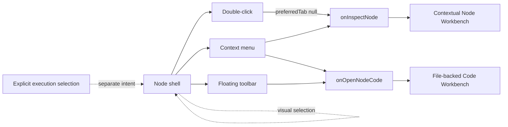
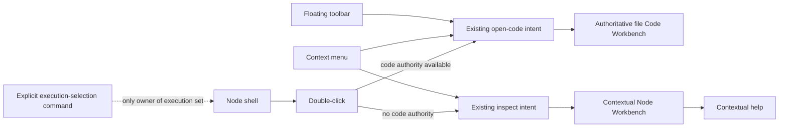

# Canvas Node Workbench Hardening Plan

## Goal

Harden the existing Canvas Node Workbench so current product capabilities are coherent, editable through their real authorities, persistent, accessible, localized, and professionally presented without adding a second editor, state store, command rail, or connection model.

This plan implements the bounded W4 cut owned by #2262 under #2195. Product acceptance remains #2255. Connection/resource-binding semantics remain #2256 and are deliberately out of scope.

## Governing Sources

- `AGENTS.md`
- `docs/planning/status/governance-document-rule-inventory.md`
- `docs/guides/ai-work-protocol.md`
- `docs/architecture/command-query-rail-governance.md`
- `docs/architecture/fowler-opportunity-planning-governance.md`
- `docs/planning/proposals/mandatory/frontend-and-ux/dvt-workbench-ux-canon-plan-20260524.md`
- GitHub #2195, #2255, #2262
- `main@32cfaf6d31fa5ca789bdb390def95d27f5d71f59`

## Think-First Analysis

### Problem Summary

The current Canvas already has the required core pieces: a contextual Node Workbench, Graph Draft authoring, file-backed dbt SQL/YAML mutation, contextual node actions, and localized Canvas copy. The product gap is coherence rather than missing infrastructure.

Current source shows:

- node double-click exists in `CanvasNodeShell.tsx` but opens generic Workbench focus instead of preferring the node's existing code authority;
- context-menu Workbench/open-code and node-shell actions already converge through `onInspectNode` / `onOpenNodeCode`;
- Graph Draft and file-backed dbt controllers retain application-level React Flow click/selection callbacks with no effect;
- React Flow visual selection, Workbench focus, and execution selection are separate concepts but the empty callbacks obscure that separation;
- `CanvasNodeWorkbenchPanel` is the current contextual owner but its header lacks the requested contextual help affordance and presents close as a text action instead of compact right-aligned professional controls;
- DVT node authoring already supports source target, transform SQL/input columns, sink materialization/write semantics and common node fields through the existing transient draft/apply/CAS lifecycle;
- file-backed dbt intentionally has mixed authority: graph/artifact facts are derived/read-only while SQL and supported YAML-backed fields mutate the authoritative project files;
- DVT transform column UI still contains visible English literals outside the Canvas localization boundary;
- existing browser proofs demonstrate important pieces but not the complete node -> edit -> persist -> reload -> same authoritative value loop required by W4/#2255.

### Root Cause

The contextual Workbench migration preserved multiple useful entry points, but presentation semantics, capability truth and acceptance evidence did not fully converge around the surviving command and persistence owners. The result is duplicate semantics and documentation/presentation drift, not a need for a new subsystem.

### Constraints And Invariants

- Reuse existing command/query rails; do not create synonyms for existing node intents.
- `CanvasDraftSession` remains the sole Web aggregate/state machine for Graph Draft authoring.
- `WorkspaceGraphAuthoringDraft` remains the persisted Graph Draft semantic authority.
- dbt project files/YAML remain authoritative for file-backed dbt authoring; dbt artifacts and graph projections remain derived/read-only.
- `CanvasInspectorNodeDraft` remains transient UI draft state.
- `NodePropertiesReadModel` remains passive/read-only.
- React Flow visual selection, Workbench focus and execution selection must remain distinct.
- Multiple UI surfaces may expose one intent only when they dispatch the same semantic command owner.
- No new store, generic form engine, command bus, registry, backend endpoint, compatibility facade or connection model.
- #2256 owns explicit connection/resource-binding semantics and is not implemented here.
- User-visible W4 copy must use the application localization boundary.

### Options Considered

1. Build a new editor/Workbench specifically for double-click. Rejected: duplicates the current contextual Workbench and command seams.
2. Make the generic passive property read model editable. Rejected: creates false authority, especially for derived dbt facts.
3. Introduce a generic JSON-schema form engine. Rejected: current typed React composition plus pure TypeScript validation already owns the behavior and there is no measured reduction benefit.
4. **Selected:** converge the existing UI entry points, remove dead application callbacks, clarify authoring posture, localize remaining copy, and prove the existing Graph Draft/file/YAML authorities end-to-end.

## Current Interaction



The problem is not that the command owners are missing. The double-click entry point does not express the desired code-first intent, and empty click/selection callbacks imply application semantics that do not exist.

## Target Interaction And Rationale



A node gesture selects an existing intent; it does not own persistence. Graph Draft edits continue through the current apply/CAS lifecycle, and file-backed edits continue through existing workspace file/YAML commands.

## Authoring Authority Matrix

| Surface / property | Canvas mode | Authority | W4 posture |
|---|---|---|---|
| name / tags / description | Graph Draft | `WorkspaceGraphAuthoringDraft` through `CanvasDraftSession` | editable when current authoring policy admits it |
| DVT source database/schema/table/alias | Graph Draft | DVT authoring value object in Graph Draft | editable |
| DVT transform SQL | Graph Draft | DVT authoring value object in Graph Draft | editable |
| DVT transform selected input columns | Graph Draft | DVT authoring value object in Graph Draft | editable |
| DVT sink database/schema/table/materialization/write mode/partition strategy | Graph Draft | DVT authoring value object in Graph Draft | editable |
| dbt SQL file | dbt project-file Canvas | revisioned workspace project file | editable through existing Code working-tree rail |
| supported dbt YAML description | dbt project-file Canvas | project YAML | editable through existing dbt YAML mutation |
| dbt artifact/analysis-derived facts | dbt project-file Canvas | derived projection | read-only/unavailable with truthful reason |
| passive properties view | both | `NodePropertiesReadModel` | read-only projection |

## Action To Owner Matrix

| Intent | UI surfaces | Existing owner |
|---|---|---|
| Inspect/open contextual Workbench | context menu; fallback from code-unavailable double-click | `onInspectNode` / Canvas interaction presentation |
| Open node code | code-capable double-click; floating toolbar Code; context-menu Code; existing code contribution | `onOpenNodeCode` or existing `onInspectNode(..., 'code')` fallback |
| Configure Graph Draft node | Workbench authoring sections | existing Inspector apply seam / `ConfigureCanvasDvtNode` / `ConfigureCanvasDbtNode` |
| Persist Graph Draft semantics | autosave/CAS lifecycle | `WorkspaceGraphAuthoringDraft` / `CanvasDraftSession` |
| Persist dbt SQL | contextual Code editor | existing workspace file command / working-tree reconciliation |
| Persist dbt YAML property | dbt Workbench contribution | existing dbt YAML mutation |
| Select/deselect for execution | explicit play/pause/context action | existing execution-selection command |
| Close Workbench | header close icon | current Workbench presentation owner |
| Show Workbench help | header help icon/tooltip or popover | presentation-only, no product command |

## Fowler Opportunity Matrix

| scenario | opportunity | Fowler pattern | DDD owner | command/query rail | implementation surfaces | local test | architecture guard | user-flow proof | out of scope |
|---|---|---|---|---|---|---|---|---|---|
| node double-click | duplicate semantics / documentation drift | converge entry points to one command owner | Canvas interaction presentation | reuse inspect/open-code seams | node shell / node component | gesture dispatch test | one-owner semantic guard where useful | focused Canvas browser flow | new editor |
| click/selection callbacks | dead seam / hidden semantics | remove dead code; explicit intent | React Flow presentation + execution policy | none new | selection handlers/controllers/viewport props | callback-removal/separation tests | selection/execution separation | prove visual focus does not alter execution set | execution redesign |
| Workbench header/help | presentation drift | presentation model cleanup | contextual Workbench | none - presentation only | panel/copy/UI primitives | a11y/help/close component test | localization boundary | keyboard + viewport check | global help system |
| DVT authoring fields | hidden-authority risk | explicit authority / reuse application command | `CanvasDraftSession` + typed authoring value objects | existing configure/apply | DVT authoring sections | validation/apply tests | passive read model remains passive | Graph Draft reload golden path | new property store |
| file-backed dbt | hidden authority | separate authoritative file edits from derived facts | project files/YAML | existing file/YAML rails | dbt controller/workbench contributions | authority/read-only tests | no graph-backed copy | SQL + YAML reload proof | artifact mutation |
| English literals | presentation/documentation drift | consolidate copy catalog | Canvas presentation copy | none | copy catalog + affected W4 views | ES/EN copy test | visible-literal guard where available | ES/EN critical flow | repository-wide i18n |

## Pre-Implementation Brief

- **Mode:** Full. The slice changes user-visible interaction and requires browser proof.
- **Scope:** Node Workbench interaction truth, professional/help/close presentation, W4 localization, dead selection seams, and proof of existing authoring authorities.
- **Expected outcome:** one coherent route from node gestures to existing Workbench/code intents, no dead application callback, no false writable property, no duplicate state, and reproducible persistence evidence.
- **Risks:** double-click conflicts with embedded controls; code-unavailable nodes become dead; visual focus accidentally changes execution selection; help becomes permanent clutter; dbt derived facts appear writable.
- **Mitigations:** reuse embedded-control target guard, deterministic Workbench fallback, negative execution-selection tests, contextual tooltip/popover, explicit authority matrix.
- **Libraries evaluated:** no new library. Reuse current React/React Flow, Lucide/UI button and existing tooltip primitives.
- **Command/query impact:** no new rail. Reuse existing inspect/open-code/configure/persist/selection rails.
- **Out of scope:** #2256 connection model, #2257 dbt target binding, new backend, W5/W6, repo-wide redesign.

## Delivery Sequence

1. Plan/mechanization: this document and GitHub issue evidence.
2. Red interaction tests: code-first double-click, Workbench help/close accessibility, selection semantics, localization.
3. Green interaction/presentation implementation using existing seams.
4. Reduction: remove no-op application callbacks and `modelerActions` only if source-wide consumer audit confirms exhaustion.
5. Authoring proof: preserve existing DVT fields and file-backed dbt authorities; add focused tests rather than duplicate editing logic.
6. Browser/regression proof: Graph Draft and dbt source-backed persistence/reload, keyboard and ES/EN where current fixture allows.
7. QA/closeout: docs truth, governance refresh, feature mechanization implementation check, prepush and PR CI.
8. Product acceptance: post reproducible evidence to #2255; explicit product-owner sign-off remains outside automatic completion.

## Test Baseline To Preserve

The existing valid behavior is part of the acceptance baseline:

- contextual Workbench can open and close;
- Workbench overlay remains movable and restores Canvas focus on close;
- explicit execution selection remains independent of ordinary visual focus;
- DVT source/transform/sink supported fields retain validation and existing apply semantics;
- file-backed dbt SQL remains revision-persisted through the workspace file authority;
- supported dbt YAML description remains persisted through the existing YAML mutation;
- layout persistence remains route-local and does not become Graph Draft semantic authority;
- Preview/Run behavior is not modified by this slice.

## Feature Mechanization

```feature-mechanization
version: 1
featureId: W4-CANVAS-NODE-WORKBENCH-HARDENING-20260808
mechanizationStatus: planned
noHumanDecisionsRemaining: true
implementationPlan: docs/planning/proposals/mandatory/frontend-and-ux/canvas-node-workbench-hardening-plan-20260808.md
componentGuides:
  - docs/planning/proposals/mandatory/frontend-and-ux/dvt-workbench-ux-canon-plan-20260524.md
  - docs/architecture/command-query-rail-governance.md
  - docs/architecture/fowler-opportunity-planning-governance.md
userStories:
  - As a Canvas author, I double-click a node and reach its existing code authority or a truthful contextual fallback.
  - As a Canvas author, I edit only properties owned by the active authoring authority and observe the same value after reload.
  - As a keyboard or Spanish/English user, I can understand, get contextual help for, and close the Workbench without clipped or dead controls.
governingSources:
  - AGENTS.md
  - docs/planning/status/governance-document-rule-inventory.md
  - docs/guides/ai-work-protocol.md
  - docs/architecture/command-query-rail-governance.md
  - docs/architecture/fowler-opportunity-planning-governance.md
  - docs/planning/proposals/mandatory/frontend-and-ux/dvt-workbench-ux-canon-plan-20260524.md
allowedImplementationSurfaces:
  - docs/planning/proposals/mandatory/frontend-and-ux/canvas-node-workbench-hardening-plan-20260808.md
  - docs/planning/proposals/mandatory/frontend-and-ux/**/index.md
  - docs/planning/proposals/index.md
  - docs/planning/closeouts/**
  - docs/.manifest.json
  - apps/web/src/app/components/canvas/CanvasNodeShell.tsx
  - apps/web/src/app/components/canvas/DbtNodeComponent.tsx
  - apps/web/src/app/components/canvas/**/*.test.tsx
  - apps/web/src/app/views/canvas/CanvasNodeWorkbenchPanel.tsx
  - apps/web/src/app/views/canvas/CanvasNodeWorkbenchOverlay.tsx
  - apps/web/src/app/views/canvas/CanvasInspectorAuthoringSection.tsx
  - apps/web/src/app/views/canvas/DvtAuthoringFields.tsx
  - apps/web/src/app/views/canvas/DvtSourceAuthoringSection.tsx
  - apps/web/src/app/views/canvas/DvtSqlTransformAuthoringSection.tsx
  - apps/web/src/app/views/canvas/DvtSinkAuthoringSection.tsx
  - apps/web/src/app/views/canvas/useCanvasSelectionHandlers.ts
  - apps/web/src/app/views/canvas/useCanvasControllerReadModel.ts
  - apps/web/src/app/views/canvas/useDbtProjectFileCanvasController.ts
  - apps/web/src/app/views/canvas/CanvasViewport.tsx
  - apps/web/src/app/views/canvas/CanvasViewportSurfaceView.tsx
  - apps/web/src/app/views/canvas/canvasInspectorAuthoring.types.ts
  - apps/web/src/app/views/canvas/canvasShellPanelsBuilder.ts
  - apps/web/src/app/views/canvas/canvasCopy*.ts
  - apps/web/src/app/views/canvas/copy.ts
  - apps/web/src/app/views/canvas/**/*.test.ts
  - apps/web/src/app/views/canvas/**/*.test.tsx
  - apps/web/cypress/e2e/canvas/**
  - apps/web/cypress/support/**
forbiddenImplementationSurfaces:
  - packages/@dvt/contracts/**
  - packages/@dvt/engine/**
  - packages/@dvt/planner/**
  - packages/@dvt/adapter-*/**
  - infra/db/**
  - tools/planning-db/**
commandQueryRails:
  - name: InspectCanvasNode
    type: command
    status: implemented
    dddOwner: Canvas interaction presentation
  - name: ConfigureCanvasDvtNode
    type: command
    status: implemented
    dddOwner: CanvasDraftSession
  - name: ConfigureCanvasDbtNode
    type: command
    status: implemented
    dddOwner: CanvasDraftSession
  - name: PersistCanvasLayout
    type: command
    status: implemented
    dddOwner: CanvasLayoutProjection
  - name: SaveWorkspaceGraphDraft
    type: command
    status: implemented
    dddOwner: WorkspaceGraphAuthoringDraft
  - name: SelectCanvasExecutionNode
    type: command
    status: implemented
    dddOwner: Canvas execution-selection intent

domainObjects:
  - name: CanvasDraftSession
    type: aggregate
    owner: Web Canvas authoring
  - name: CanvasInspectorNodeDraft
    type: transient DTO
    owner: Node Workbench presentation
  - name: WorkspaceGraphAuthoringDraft
    type: persisted protocol
    owner: Graph Draft authority
  - name: NodePropertiesReadModel
    type: read model
    owner: passive node properties
  - name: CanvasRuntimePolicy
    type: policy
    owner: Canvas application policy
  - name: CanvasLayoutProjection
    type: projection
    owner: Canvas route layout
fowlerSignals:
  - duplicate semantics across Workbench/code entry points
  - dead application selection callbacks
  - hidden authoring authority
  - presentation and localization drift
  - test-only confidence without reload proof
architectureGuards:
  - pnpm docs:feature-mechanization:implementation -- --feature W4-CANVAS-NODE-WORKBENCH-HARDENING-20260808
cypressFlows:
  - apps/web/cypress/e2e/canvas/canvas-workbench-authoring-hardening.cy.ts
completionGate:
  - pnpm --filter @dvt/web typecheck
  - pnpm --filter @dvt/web lint
  - pnpm --filter @dvt/web test
  - pnpm docs:feature-mechanization:implementation -- --feature W4-CANVAS-NODE-WORKBENCH-HARDENING-20260808
  - pnpm governance:refresh
  - pnpm verify:prepush
redGreenCycles:
  - id: code-first-node-double-click
    redTest: focused Canvas node-shell/component test
    expectedFailure: Double-click dispatches generic Workbench focus instead of existing code intent where code is available.
    patchSurfaces:
      - apps/web/src/app/components/canvas/DbtNodeComponent.tsx
      - apps/web/src/app/components/canvas/**/*.test.tsx
    greenTest: focused Canvas node-shell/component test
  - id: workbench-professional-help-close
    redTest: focused CanvasNodeWorkbenchPanel component test
    expectedFailure: Workbench header has no contextual help icon/tooltip and close is not the compact right-aligned icon control contract.
    patchSurfaces:
      - apps/web/src/app/views/canvas/CanvasNodeWorkbenchPanel.tsx
      - apps/web/src/app/views/canvas/canvasCopy*.ts
      - apps/web/src/app/views/canvas/**/*.test.tsx
    greenTest: focused CanvasNodeWorkbenchPanel component test
  - id: selection-semantics-and-dead-seam-cut
    redTest: focused Canvas selection/controller test
    expectedFailure: Application-level React Flow click/selection callbacks remain no-op seams with no product meaning.
    patchSurfaces:
      - apps/web/src/app/views/canvas/useCanvasSelectionHandlers.ts
      - apps/web/src/app/views/canvas/useDbtProjectFileCanvasController.ts
      - apps/web/src/app/views/canvas/CanvasViewport.tsx
      - apps/web/src/app/views/canvas/CanvasViewportSurfaceView.tsx
    greenTest: focused Canvas selection/controller test plus typecheck
  - id: w4-localization
    redTest: focused copy/presentation test
    expectedFailure: DVT transform authoring contains user-visible English literals outside the copy catalog.
    patchSurfaces:
      - apps/web/src/app/views/canvas/DvtSqlTransformAuthoringSection.tsx
      - apps/web/src/app/views/canvas/canvasCopy*.ts
    greenTest: focused copy/presentation test
  - id: authoritative-reload-proof
    redTest: focused Cypress Canvas authoring flow
    expectedFailure: Current browser evidence does not prove Graph Draft and file-backed dbt node edits persist through reload from their authoritative sources.
    patchSurfaces:
      - apps/web/cypress/e2e/canvas/**
      - apps/web/cypress/support/**
    greenTest: focused Cypress Canvas authoring flow
symbols:
  - { name: DbtNodeComponent, path: apps/web/src/app/components/canvas/DbtNodeComponent.tsx, dddOwner: Canvas interaction presentation, cqRails: [InspectCanvasNode], fowlerSignals: [duplicate semantics], architectureGuard: pnpm docs:feature-mechanization:implementation -- --feature W4-CANVAS-NODE-WORKBENCH-HARDENING-20260808, unitTests: [focused Canvas node component test], cypressCoverage: apps/web/cypress/e2e/canvas/canvas-workbench-authoring-hardening.cy.ts }
  - { name: CanvasNodeWorkbenchPanel, path: apps/web/src/app/views/canvas/CanvasNodeWorkbenchPanel.tsx, dddOwner: Node Workbench presentation, cqRails: [InspectCanvasNode], fowlerSignals: [presentation drift], architectureGuard: pnpm docs:feature-mechanization:implementation -- --feature W4-CANVAS-NODE-WORKBENCH-HARDENING-20260808, unitTests: [focused Workbench panel test], cypressCoverage: apps/web/cypress/e2e/canvas/canvas-workbench-authoring-hardening.cy.ts }
  - { name: useCanvasSelectionHandlers, path: apps/web/src/app/views/canvas/useCanvasSelectionHandlers.ts, dddOwner: Canvas interaction presentation, cqRails: [SelectCanvasExecutionNode], fowlerSignals: [dead application seam], architectureGuard: pnpm docs:feature-mechanization:implementation -- --feature W4-CANVAS-NODE-WORKBENCH-HARDENING-20260808, unitTests: [focused selection handler test], cypressCoverage: apps/web/cypress/e2e/canvas/canvas-workbench-authoring-hardening.cy.ts }
  - { name: useDbtProjectFileCanvasController, path: apps/web/src/app/views/canvas/useDbtProjectFileCanvasController.ts, dddOwner: dbt project-file Canvas controller, cqRails: [InspectCanvasNode], fowlerSignals: [dead application seam, hidden authority], architectureGuard: pnpm docs:feature-mechanization:implementation -- --feature W4-CANVAS-NODE-WORKBENCH-HARDENING-20260808, unitTests: [focused dbt project-file Canvas controller test], cypressCoverage: apps/web/cypress/e2e/canvas/canvas-workbench-authoring-hardening.cy.ts }
  - { name: DvtSqlTransformAuthoringSection, path: apps/web/src/app/views/canvas/DvtSqlTransformAuthoringSection.tsx, dddOwner: DVT transform authoring presentation, cqRails: [ConfigureCanvasDvtNode], fowlerSignals: [presentation drift], architectureGuard: pnpm docs:feature-mechanization:implementation -- --feature W4-CANVAS-NODE-WORKBENCH-HARDENING-20260808, unitTests: [focused DVT authoring presentation test], cypressCoverage: apps/web/cypress/e2e/canvas/canvas-workbench-authoring-hardening.cy.ts }
```

## Definition Of Done

- [ ] mechanization is promoted to `implemented` only after the declared implementation/evidence exists;
- [ ] double-click reaches existing code authority when available and falls back truthfully otherwise;
- [ ] ordinary visual focus never mutates execution selection;
- [ ] dead application click/selection seams in scope are removed or given an explicitly tested meaning;
- [ ] `modelerActions` is removed only if a final source-wide consumer audit proves it exhausted;
- [ ] Workbench help/close controls are right-aligned, localized, keyboard reachable, focus-visible and assistive-technology labelled;
- [ ] contextual help is not permanent explanatory body clutter;
- [ ] DVT supported fields remain editable through the existing draft/apply/CAS authority;
- [ ] file-backed dbt derived facts remain read-only while existing SQL/YAML edits keep their file authorities;
- [ ] touched W4 surfaces have ES/EN semantic parity and no visible literal bypass;
- [ ] Graph Draft and dbt browser proofs demonstrate persist -> reload -> same authoritative value or record a real product defect in #2255 without faking success;
- [ ] relevant Web validation, feature mechanization implementation check, governance refresh, prepush and remote CI are green;
- [ ] QA findings are resolved or explicitly owned;
- [ ] #2255 receives reproducible evidence and remains open for explicit product-owner acceptance;
- [ ] the PR remains open and unmerged for owner review.
