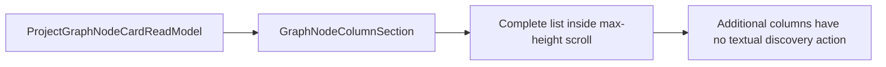
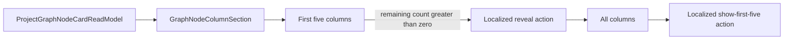
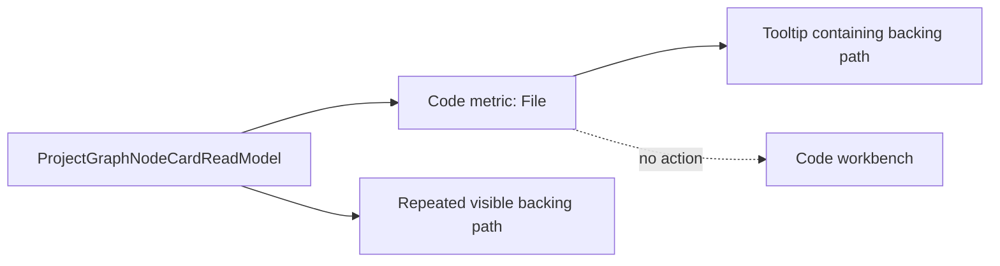
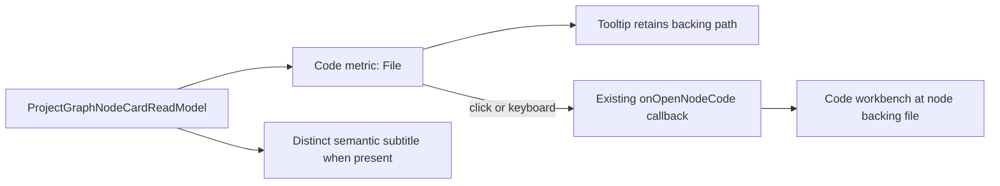

# Canvas Node Workbench Hardening Plan

## Decision

This plan supersedes the multi-surface node interaction merged by #2266.

```text
left click node       -> visual selection/focus only
double click node     -> enter node / Properties
Enter on focused node -> same node-entry gesture
card execution toggle -> retired by #2381; selection remains an ellipsis operation
card ellipsis (…)     -> node operations only
right click node      -> no DVT-specific action
right click canvas    -> existing Canvas/Add Component context
```

Code-capable nodes enter Properties with Code preferred. Embedded controls keep their own pointer/keyboard behavior.

`CanvasNodeWorkbenchPanel` remains the single node Properties surface. Graph Draft remains CAS-authoritative; dbt project SQL/YAML remains file-authoritative; derived artifact facts remain read-only.

For file-backed dbt, the authoritative revisioned editor is launched from inside the Code section and closing it returns to the same focused node Properties context.

### Superseding product-owner correction — #2381

The safeguard added during #2278 correctly prevented an unevidenced removal of the
card Play/Pause affordance. Issue #2381 is the separate execution-control decision
required by that safeguard and supersedes only its presentation conclusion.

The card control was not a runtime Play/Pause command: it invoked
`SelectCanvasExecutionNode`, duplicating the localized execution-selection operation
already available from the card ellipsis. The card-only adapter, icons and tokens are
therefore retired. The command, selection state and contextual-menu operation remain
unchanged. A future runtime Play/Pause capability must use explicit run-control
semantics and a separately governed command surface.

## Retain

- `CanvasNodeShell` as node-entry gesture boundary;
- `CanvasNodeWorkbenchPanel` + `NodePropertiesTabs` as Properties surface;
- `CanvasNodeModelerActionModel` as operations-only ellipsis model;
- `SelectCanvasExecutionNode` and its localized contextual-menu operation;
- visual selection separate from execution selection;
- Graph Draft and file-backed persistence authorities;
- distinct operational-health detail;
- empty-Canvas context menu.

## Retire

- node floating toolbar, its model, tokens, state and tests;
- split `open-code | open-workbench` double-click policy;
- native node right-click product menu;
- visible `inspect-node`/Workbench navigation in node operations;
- card-only execution-selection adapter, Play/Pause icons and visual tokens;
- topology tests that require the retired surfaces.

## Acceptance invariants

1. Plain click never opens Properties and never mutates execution selection.
2. Double-click and Enter enter the same Properties intent.
3. Embedded controls do not trigger node entry.
4. Code-capable nodes prefer Code; other nodes use their default/general section.
5. Ellipsis contains operations only: execution selection, duplicate and remove when supported.
6. Node-card headers do not expose execution selection as Play/Pause; the ellipsis retains the localized selection command.
7. Native right-click on a node does not expose DVT node actions.
8. Empty-Canvas right-click still exposes the existing Canvas context.
9. No floating toolbar remains.
10. File-backed Code remains revision-authoritative and returns to the same Properties context on close.
11. ES/EN and accessibility remain owned by the existing localization/focus rails.

## Evidence

- `CanvasNodeShell.test.tsx`
- `CanvasViewport.keyboardNodeEntry.test.ts`
- `canvasNodeContextMenuModel.test.ts`
- `CanvasNodeContextMenuView.test.tsx`
- `GraphNodeCardView.test.tsx`
- `DbtNodeComponent.architecture.test.ts`
- `canvasNodeWorkbenchHardening.architecture.test.ts`
- `canvasNodeContextSurfaceModel.test.ts`
- `canvas-dbt-author-code-run-live.cy.ts`
- `dbt-project-file-projection-live.cy.ts`

### Final QA finding — retired right-click topology

The final Fowler review found that the shared selected-closure Cypress helper and two
Canvas browser scenarios still drove node operations through native right-click. The
surface strategies also continued to advertise `node-context-menu` as a Workbench
launch point even though that launch path had been retired.

This is not compatibility behavior. The browser helpers must enter node operations
through the card ellipsis, and the surface-policy projection must declare double-click
as the only node Workbench launch point. Empty-Canvas right-click remains unchanged.
Browser setup may wait only for required startup probes. `/readyz`, `/version` and
`/db/ready` are deployment-optional and cannot be prerequisites for these Canvas
interaction proofs.

The connected-source live proof also exposed an assertion that treated a direct
`Code` tab as the only valid presentation of the preferred section. The governed
surface strategy may place Code in the overflow rail when its primary-section
budget is exhausted. The proof must assert the active Code section and its
authoring content, whether the active affordance is the direct Code tab or the
localized `More: Code` overflow trigger; it must not change the product's section
policy merely to satisfy a selector.

The screen-composition proof then exposed a distinct generic Graph Draft path:
opening file-backed node Code hid Properties, but closing the contextual editor
only restored node focus. The selected inspector node remained authoritative, so
node-Code close must also restore inspector visibility. Project-Code close must
not fabricate a node context. This aligns the generic Canvas shell with the
file-project controller without adding a second navigation command.

Final Fowler QA found that the operations-only menu contract still accepted
retired Workbench-navigation labels, plus an unused execution-group label, even
though the model never consumed them. The copy catalog also retained orphaned
floating-toolbar label/freeze/unfreeze/More facts. The two Code strings still
used by Properties must move from `canvasNodeToolbar*` to
`nodeWorkbenchOpenCode*`; all other retired keys and mapper projections must be
removed. This is contract and localization cleanup, not a compatibility alias.

GitHub issue #2255 remains the independent live-product/product-owner acceptance gate.

## Bounded card-column disclosure — #2391

### Pre-implementation brief

- **Mode:** Full. This changes visible card interaction and localized product copy.
- **Outcome:** an expanded card shows at most five columns until the author explicitly
  requests the remainder.
- **Existing owner:** `GraphNodeColumnSection`; no second list, popover, store or
  persistence surface is introduced.
- **Query rail:** reuse `ProjectGraphNodeCardReadModel`. The component receives the
  already-authorized column projection and owns only transient disclosure state.
- **Language:** the existing graph-card copy resolver owns English and Spanish labels;
  no literal product copy remains in the component.
- **Accessibility:** both disclosure controls are real buttons with keyboard parity,
  visible focus and explicit expanded state. Embedded-control boundaries prevent node
  selection or drag from becoming a second meaning of the action.

Current mechanism:



Target mechanism:



| Fowler signal        | Current mechanism                           | MVP correction                                       | Proof                       |
| -------------------- | ------------------------------------------- | ---------------------------------------------------- | --------------------------- |
| Hidden authority     | `max-h-32` silently defines discoverability | explicit five-row projection and remaining count     | component test              |
| Published language   | `Columnas` is hard-coded                    | existing graph-card ES/EN copy resolver              | locale test                 |
| Primitive obsession  | scrollbar means “there are more”            | semantic reversible button                           | DOM and keyboard assertions |
| Test-only confidence | no greater-than-five scenario               | five-to-all-to-five cycle plus visible browser proof | Vitest and agent-browser    |

Rejected alternatives:

- Keep the internal scrollbar and add helper text: it preserves the hidden interaction.
- Add pagination or a modal: disproportionate mechanism for a local disclosure.
- Persist expanded state: presentation preference does not belong to Graph Draft or a
  new store.

### Closeout evidence

- The red component test failed because the old component exposed no bounded rows or
  localized remainder action; the implemented component suite passes all four tests.
- The related graph-card projection suite passes 38 tests and the full Canvas regression
  passes 1,154 tests across 283 files.
- Headed-browser proof against a real ten-column source showed five rows plus
  `Ver columnas restantes (5)`, ten rows after keyboard activation, and a reversible
  `Mostrar solo las 5 primeras` action. The same session exposed `Columns (10)` and
  `Show remaining columns (5)` after switching to English.
- The transient action uses the shared embedded-control boundary and both disclosure
  buttons own the column-list region through `aria-controls` and `aria-expanded`.
- Baseline blocker #2392 restored the missing QueryClient provider in the CanvasShell
  test composition root and was integrated independently through PR #2393 before this
  slice continued.

## File-backed card action — #2395

### Pre-implementation brief

- **Mode:** Full. This changes the visible and keyboard-operable meaning of the
  file-backed Code metric.
- **Outcome:** the card no longer repeats the backing file path below its metrics;
  activating the localized `File` / `Archivo` metric opens that exact file in the
  existing Code workbench.
- **Existing owners:** `GraphNodeCardView` owns card composition,
  `GraphNodeMetricRow` owns compact metric rendering, and the existing
  `onOpenNodeCode` callback owns entry into the contextual editor.
- **Rails:** reuse `ProjectGraphNodeCardReadModel` for presentation and
  `InspectCanvasNode` for the user action. File reading and saving remain on
  `GetWorkspaceFileContent` and `SaveWorkspaceFileContent`.
- **Accessibility:** the code metric becomes a native button only when the callback
  exists. The existing tooltip remains available, while the Canvas control boundary
  plus `nodrag` and `nopan` prevent node selection or movement.

Current mechanism:



Target mechanism:



| Fowler signal        | Current mechanism                              | MVP correction                                     | Proof                 |
| -------------------- | ---------------------------------------------- | -------------------------------------------------- | --------------------- |
| Duplicate semantics  | path appears in tooltip and visible card line  | retain tooltip; remove repeated visible path       | card component test   |
| Feature envy         | card knows a file exists but cannot open it    | forward the existing node-code callback            | renderer test         |
| Primitive obsession  | actionable `File` is a focusable `span`        | native button only when the action exists          | semantic DOM test     |
| Boundary drift       | embedded click could select or move React Flow | control boundary plus `nodrag` and `nopan`         | interaction assertion |
| Test-only confidence | no card-to-authoritative-file proof            | red/green component path plus headed browser proof | Vitest and browser    |

Rejected alternatives:

- Keep the visible path and make it clickable: this preserves duplicate information
  and creates a second visual launch point.
- Open generic project Code: it loses the node's authoritative initial file.
- Add a new route, event bus, store or editor: all required navigation already exists.
- Make every metric clickable: health and column evidence do not share Code semantics.

## Feature Mechanization

```feature-mechanization
version: 1
featureId: W4-CANVAS-NODE-WORKBENCH-HARDENING-20260808
mechanizationStatus: implemented
noHumanDecisionsRemaining: true
implementationPlan: docs/planning/proposals/mandatory/frontend-and-ux/canvas-node-workbench-hardening-plan-20260808.md
componentGuides:
  - docs/planning/proposals/mandatory/frontend-and-ux/dvt-workbench-ux-canon-plan-20260524.md
  - docs/architecture/command-query-rail-governance.md
  - docs/architecture/fowler-opportunity-planning-governance.md
userStories:
  - As a Canvas author, I enter a node through one Properties surface with Code preferred when available.
  - As a keyboard user, I press Enter on the focused node to enter the same Properties surface.
  - As a Canvas author, I use the card ellipsis only for node operations.
  - As a Canvas author, I select or deselect execution through node operations without a misleading Play/Pause control in the card header.
  - As a Canvas author, Impact Highlight follows visual node focus and never treats execution selection as presentation focus.
  - As a Canvas author, I see five card columns first and can explicitly reveal or hide the remaining columns.
  - As a file-backed Canvas author, I activate File on the card to open that exact file without a repeated path line.
  - As a file-backed dbt author, I open the authoritative editor from Properties Code and return to the same node context.
governingSources:
  - AGENTS.md
  - docs/guides/ai-work-protocol.md
  - docs/architecture/command-query-rail-governance.md
  - docs/architecture/fowler-opportunity-planning-governance.md
allowedImplementationSurfaces:
  - apps/web/src/app/views/Canvas.test.controller.defaults.ts
  - apps/web/cypress/support/canvasExecutionSelection.ts
  - apps/web/cypress/support/test/canvasPreviewRunPersisted.ts
  - apps/web/cypress/e2e/canvas/canvas-ready-node-authoring.cy.ts
  - apps/web/cypress/e2e/canvas/canvas-dbt-selection-recovery-live.cy.ts
  - apps/web/cypress/e2e/canvas/canvas-source-import-live-clean.cy.ts
  - apps/web/cypress/e2e/canvas/canvas-dbt-author-code-run-live.cy.ts
  - apps/web/cypress/e2e/dbt/dbt-project-yaml-description-edit-live.cy.ts
  - apps/web/cypress/e2e/dbt/dbt-project-file-projection-live.cy.ts
  - apps/web/cypress/e2e/runs/run-controls-live.cy.ts
  - apps/web/cypress/e2e/shell/canvas-workbench-screen-composition.cy.ts
  - apps/web/src/app/components/canvas/CanvasNodeContextMenuView.test.tsx
  - apps/web/src/app/components/canvas/CanvasNodeShell.doubleClick.test.ts
  - apps/web/src/app/components/canvas/CanvasNodeShell.test.tsx
  - apps/web/src/app/components/canvas/CanvasNodeShell.tsx
  - apps/web/src/app/components/canvas/DbtNodeComponent.architecture.test.ts
  - apps/web/src/app/components/canvas/DbtNodeComponent.failureContainment.test.tsx
  - apps/web/src/app/components/canvas/DbtNodeComponent.tsx
  - apps/web/src/app/components/canvas/canvasNodeContextMenuModel.test.ts
  - apps/web/src/app/components/canvas/canvasNodeContextMenuModel.ts
  - apps/web/src/app/components/metrics/MetricEvidenceHotspot.test.tsx
  - apps/web/src/app/components/metrics/MetricEvidenceHotspot.tsx
  - apps/web/src/app/components/metrics/metricEvidenceTokens.ts
  - apps/web/src/app/plugins/dbt/DbtNodeRenderer.test.tsx
  - apps/web/src/app/plugins/dbt/DbtNodeRenderer.tsx
  - apps/web/src/app/plugins/canvasSurfaceStrategyContracts.ts
  - apps/web/src/app/plugins/dbt/dbtCanvasSurfaceStrategy.ts
  - apps/web/src/app/plugins/dbt/dbtProjectFileCanvasSurfaceStrategy.ts
  - apps/web/src/app/plugins/dvt/dvtCanvasSurfaceStrategy.ts
  - apps/web/src/app/plugins/graphStrategyRegistry.test.ts
  - apps/web/src/app/plugins/graph/GraphNodeCardView.test.tsx
  - apps/web/src/app/plugins/graph/GraphNodeCardView.tsx
  - apps/web/src/app/plugins/graph/GraphNodeColumnSection.test.tsx
  - apps/web/src/app/plugins/graph/GraphNodeColumnSection.tsx
  - apps/web/src/app/plugins/graph/GraphNodeMetricHotspot.test.tsx
  - apps/web/src/app/plugins/graph/GraphNodeMetricHotspot.tsx
  - apps/web/src/app/plugins/graph/GraphNodeMetricRow.test.tsx
  - apps/web/src/app/plugins/graph/GraphNodeMetricRow.tsx
  - apps/web/src/app/plugins/graph/GraphNodeRenderer.tsx
  - apps/web/src/app/plugins/graph/graphNodeCardCopyTokens.ts
  - apps/web/src/app/plugins/graph/graphVisualTokens.ts
  - apps/web/src/app/views/canvas/CanvasNodeFloatingToolbarView.test.tsx
  - apps/web/src/app/views/canvas/CanvasNodeFloatingToolbarView.tsx
  - apps/web/src/app/views/canvas/CanvasNodeWorkbenchPanel.test.tsx
  - apps/web/src/app/views/canvas/CanvasNodeWorkbenchPanel.tsx
  - apps/web/src/app/views/canvas/CanvasShell.graphSurface.test.tsx
  - apps/web/src/app/views/canvas/CanvasShellMainPanel.tsx
  - apps/web/src/app/views/canvas/CanvasShell.tsx
  - apps/web/src/app/views/canvas/useCanvasController.core.test.tsx
  - apps/web/src/app/views/canvas/useCanvasController.ts
  - apps/web/src/app/views/canvas/useCanvasOverlayModel.ts
  - apps/web/src/app/views/canvas/canvasCopy.types.ts
  - apps/web/src/app/views/canvas/canvasCopyCatalog.authoring.es.ts
  - apps/web/src/app/views/canvas/canvasCopyCatalog.authoring.ts
  - apps/web/src/app/views/canvas/canvasCopyCatalog.toolbar.es.ts
  - apps/web/src/app/views/canvas/canvasCopyCatalog.toolbar.ts
  - apps/web/src/app/views/canvas/canvasNodeMapper.ts
  - apps/web/src/app/views/canvas/CanvasViewport.architecture.test.ts
  - apps/web/src/app/views/canvas/CanvasViewport.keyboardNodeEntry.test.ts
  - apps/web/src/app/views/canvas/CanvasViewport.nodeFloatingToolbar.test.tsx
  - apps/web/src/app/views/canvas/CanvasViewport.nodeOperationalRail.test.tsx
  - apps/web/src/app/views/canvas/CanvasViewport.tsx
  - apps/web/src/app/views/canvas/CanvasViewportSurfaceView.tsx
  - apps/web/src/app/views/canvas/canvasControllerViewModel.ts
  - apps/web/src/app/views/canvas/canvasShell.types.ts
  - apps/web/src/app/views/canvas/canvasShellBuilder.types.ts
  - apps/web/src/app/views/canvas/canvasShellGraphCommandsBuilder.ts
  - apps/web/src/app/views/canvas/canvasShellPropsBuilder.tsx
  - apps/web/src/app/views/canvas/canvasNodeContextSurfaceModel.test.ts
  - apps/web/src/app/views/canvas/canvasNodeContextSurfaceModel.ts
  - apps/web/src/app/views/canvas/canvasNodeFloatingToolbarModel.test.ts
  - apps/web/src/app/views/canvas/canvasNodeFloatingToolbarModel.ts
  - apps/web/src/app/views/canvas/canvasNodeFloatingToolbarTokens.ts
  - apps/web/src/app/views/canvas/canvasNodeWorkbenchHardening.architecture.test.ts
  - apps/web/src/app/views/canvas/dbtYamlDescriptionWorkbenchContribution.test.tsx
  - apps/web/src/app/views/canvas/dbtYamlDescriptionWorkbenchContribution.tsx
  - apps/web/src/app/views/canvas/dbtProjectFileProjection.architecture.test.ts
  - apps/web/src/app/views/canvas/useDbtProjectFileCanvasController.ts
  - docs/concepts/repository-map.md
  - docs/.manifest.json
  - docs/planning/proposals/mandatory/frontend-and-ux/canvas-node-workbench-hardening-plan-20260808.md
  - docs/planning/status/system-governance-planstore-file-ownership-20260501.md
  - docs/planning/status/system-governance-unit-index-20260501.md
  - docs/planning/status/system-governance-unit-index.units.yaml
  - scripts/run-selected-closure-live-proof.cjs
  - scripts/run-selected-closure-live-proof.test.cjs
  - tools/planning-db/state/canonical-state.json
forbiddenImplementationSurfaces:
  - packages/@dvt/contracts/**
  - packages/@dvt/engine/**
  - packages/@dvt/planner/**
  - packages/@dvt/adapter-*/**
  - infra/db/**
  - tools/planning-db/**/*.cjs
  - tools/planning-db/**/*.js
  - tools/planning-db/**/*.mjs
  - tools/planning-db/**/*.sql
  - tools/planning-db/**/*.ts
  - apps/web/src/app/plugins/graph/graphNodeCardActions*
commandQueryRails:
  - name: ProjectGraphNodeCardReadModel
    type: query
    status: implemented
    dddOwner: CanvasGraphPresentation
    applicationPort: Graph node card strategy
    adapterSurface: GraphNodeColumnSection
    authorizationScope: authorized Canvas column projection already admitted to the browser
    negativeTests:
      - revealing columns does not select, move or persist the node
  - name: InspectCanvasNode
    type: command
    status: implemented
    dddOwner: Canvas interaction presentation
  - name: ConfigureCanvasDvtNode
    type: command
    status: implemented
    dddOwner: CanvasDraftSession
  - name: ConfigureCanvasDbtNode
    type: command
    status: implemented
    dddOwner: CanvasDraftSession
  - name: SaveWorkspaceGraphDraft
    type: command
    status: implemented
    dddOwner: WorkspaceGraphAuthoringDraft
  - name: SelectCanvasExecutionNode
    type: command
    status: implemented
    dddOwner: Canvas execution-selection intent
    applicationPort: Canvas node execution-selection command handler
    adapterSurface: Canvas node operations menu
    authorizationScope: authorized mutable Canvas nodes with execution-selection capability
    negativeTests:
      - node card header does not expose execution selection as Play or Pause
domainObjects:
  - name: GraphNodeColumnDisclosureState
    type: transient presentation state
    owner: CanvasGraphPresentation
  - name: CanvasDraftSession
    type: aggregate
    owner: Web Canvas authoring
  - name: WorkspaceGraphAuthoringDraft
    type: persisted protocol
    owner: Graph Draft authority
  - name: CanvasInspectorNodeDraft
    type: transient DTO
    owner: Node Properties presentation
  - name: NodePropertiesReadModel
    type: read model
    owner: passive node properties
  - name: CanvasNodeModelerActionModel
    type: operation read model
    owner: Canvas node interaction presentation
  - name: CanvasExecutionSelection
    type: command state
    owner: Canvas execution-selection intent
symbols:
  - path: apps/web/src/app/components/metrics/MetricEvidenceHotspot.tsx
    name: MetricEvidenceTriggerProps
    kind: type
    exported: false
    dddOwner: Shared metric evidence presentation
    cqRails: [InspectCanvasNode]
    fowlerSignals: [Primitive obsession]
    architectureGuard: pnpm --filter @dvt/web test:canvas
    cypressCoverage: apps/web/cypress/e2e/dbt/dbt-project-file-projection-live.cy.ts
    unitTests: [pnpm --filter @dvt/web test -- MetricEvidenceHotspot.test.tsx]
  - path: apps/web/src/app/plugins/graph/GraphNodeMetricRow.tsx
    name: GraphNodeMetricRow
    kind: function
    exported: true
    dddOwner: CanvasGraphPresentation
    cqRails: [ProjectGraphNodeCardReadModel, InspectCanvasNode]
    fowlerSignals: [Feature envy, Primitive obsession]
    architectureGuard: pnpm --filter @dvt/web test:canvas
    cypressCoverage: apps/web/cypress/e2e/dbt/dbt-project-file-projection-live.cy.ts
    unitTests: [pnpm --filter @dvt/web test -- GraphNodeMetricRow.test.tsx]
  - path: apps/web/src/app/plugins/graph/GraphNodeColumnSection.tsx
    name: MAX_PREVIEW_COLUMNS
    kind: constant
    exported: false
    dddOwner: CanvasGraphPresentation
    cqRails: [ProjectGraphNodeCardReadModel]
    fowlerSignals: [Hidden authority]
    architectureGuard: pnpm --filter @dvt/web test:canvas
    cypressCoverage: apps/web/cypress/e2e/canvas/canvas-source-import-live-clean.cy.ts
    unitTests: [pnpm --filter @dvt/web test -- GraphNodeColumnSection.test.tsx]
  - path: apps/web/src/app/plugins/graph/GraphNodeColumnSection.tsx
    name: GraphNodeColumnSection
    kind: function
    exported: true
    dddOwner: CanvasGraphPresentation
    cqRails: [ProjectGraphNodeCardReadModel]
    fowlerSignals: [Hidden authority, Published language, Primitive obsession]
    architectureGuard: pnpm --filter @dvt/web test:canvas
    cypressCoverage: apps/web/cypress/e2e/canvas/canvas-source-import-live-clean.cy.ts
    unitTests: [pnpm --filter @dvt/web test -- GraphNodeColumnSection.test.tsx]
  - path: apps/web/cypress/support/canvasExecutionSelection.ts
    name: openCanvasNodeOperations
    kind: function
    exported: true
    dddOwner: Canvas selected-closure browser interaction
    cqRails: [SelectCanvasExecutionNode]
    fowlerSignals: [Duplicate semantics, Test-only confidence]
    architectureGuard: pnpm --filter @dvt/web test:canvas
    cypressCoverage: apps/web/cypress/e2e/canvas/canvas-preview-run-live.cy.ts
    unitTests: [pnpm --filter @dvt/web typecheck]
  - path: apps/web/cypress/e2e/dbt/dbt-project-yaml-description-edit-live.cy.ts
    name: openModelCodeEditor
    kind: function
    exported: false
    dddOwner: File-backed dbt live-product proof
    cqRails: [InspectCanvasNode]
    fowlerSignals: [Duplicate semantics, Test-only confidence]
    architectureGuard: pnpm --filter @dvt/web test:canvas
    cypressCoverage: apps/web/cypress/e2e/dbt/dbt-project-yaml-description-edit-live.cy.ts
    unitTests: [pnpm --filter @dvt/web typecheck]
  - path: apps/web/src/app/plugins/canvasSurfaceStrategyContracts.ts
    name: CanvasSurfaceLaunchPoint
    kind: type
    exported: true
    dddOwner: Canvas surface policy
    cqRails: [InspectCanvasNode]
    fowlerSignals: [Boundary drift, Duplicate semantics]
    architectureGuard: pnpm --filter @dvt/web test:canvas
    cypressCoverage: apps/web/cypress/e2e/dbt/dbt-project-file-projection-live.cy.ts
    unitTests: [pnpm --filter @dvt/web test:canvas]
  - path: apps/web/src/app/components/canvas/CanvasNodeShell.tsx
    name: GovernedNodeActionContextMenuEvent
    kind: type
    exported: false
    dddOwner: Canvas node operations presentation
    cqRails: [SelectCanvasExecutionNode]
    fowlerSignals: [Boundary drift]
    architectureGuard: pnpm --filter @dvt/web test:canvas
    cypressCoverage: apps/web/cypress/e2e/canvas/canvas-dbt-author-code-run-live.cy.ts
    unitTests: [pnpm --filter @dvt/web test:canvas]
  - path: apps/web/src/app/components/canvas/CanvasNodeShell.tsx
    name: handleDoubleClick
    kind: function
    exported: false
    dddOwner: Canvas interaction presentation
    cqRails: [InspectCanvasNode]
    fowlerSignals: [Duplicate semantics]
    architectureGuard: pnpm --filter @dvt/web test:canvas
    cypressCoverage: apps/web/cypress/e2e/canvas/canvas-dbt-author-code-run-live.cy.ts
    unitTests: [pnpm --filter @dvt/web test:canvas]
  - path: apps/web/src/app/components/canvas/CanvasNodeShell.tsx
    name: handleContextMenuCapture
    kind: function
    exported: false
    dddOwner: Canvas interaction presentation
    cqRails: [InspectCanvasNode]
    fowlerSignals: [Duplicate semantics]
    architectureGuard: pnpm --filter @dvt/web test:canvas
    cypressCoverage: apps/web/cypress/e2e/canvas/canvas-dbt-author-code-run-live.cy.ts
    unitTests: [pnpm --filter @dvt/web test:canvas]
  - path: apps/web/src/app/components/canvas/CanvasNodeShell.tsx
    name: nativeEvent
    kind: const
    exported: false
    dddOwner: Canvas interaction presentation
    cqRails: [InspectCanvasNode]
    fowlerSignals: [Boundary drift]
    architectureGuard: pnpm --filter @dvt/web test:canvas
    cypressCoverage: apps/web/cypress/e2e/canvas/canvas-dbt-author-code-run-live.cy.ts
    unitTests: [pnpm --filter @dvt/web test:canvas]
  - path: apps/web/src/app/components/canvas/DbtNodeComponent.tsx
    name: hasCodeSection
    kind: const
    exported: false
    dddOwner: Dbt node Properties presentation
    cqRails: [InspectCanvasNode]
    fowlerSignals: [Hidden authority]
    architectureGuard: pnpm --filter @dvt/web test:canvas
    cypressCoverage: apps/web/cypress/e2e/dbt/dbt-project-file-projection-live.cy.ts
    unitTests: [pnpm --filter @dvt/web test:canvas]
  - path: apps/web/src/app/components/canvas/DbtNodeComponent.tsx
    name: contextMenuModel
    kind: const
    exported: false
    dddOwner: Canvas node operations presentation
    cqRails: [SelectCanvasExecutionNode]
    fowlerSignals: [Duplicate semantics]
    architectureGuard: pnpm --filter @dvt/web test:canvas
    cypressCoverage: apps/web/cypress/e2e/canvas/canvas-dbt-author-code-run-live.cy.ts
    unitTests: [pnpm --filter @dvt/web test:canvas]
  - path: apps/web/src/app/components/canvas/DbtNodeComponent.tsx
    name: handleOpenNode
    kind: function
    exported: false
    dddOwner: Dbt node Properties presentation
    cqRails: [InspectCanvasNode]
    fowlerSignals: [Duplicate semantics]
    architectureGuard: pnpm --filter @dvt/web test:canvas
    cypressCoverage: apps/web/cypress/e2e/dbt/dbt-project-file-projection-live.cy.ts
    unitTests: [pnpm --filter @dvt/web test:canvas]
  - path: apps/web/src/app/components/canvas/canvasNodeContextMenuModel.ts
    name: CanvasNodeModelerActionId
    kind: type
    exported: true
    dddOwner: Canvas node operations presentation
    cqRails: [SelectCanvasExecutionNode]
    fowlerSignals: [Duplicate semantics]
    architectureGuard: pnpm --filter @dvt/web test:canvas
    cypressCoverage: apps/web/cypress/e2e/canvas/canvas-dbt-author-code-run-live.cy.ts
    unitTests: [pnpm --filter @dvt/web test:canvas]
  - path: apps/web/src/app/components/canvas/canvasNodeContextMenuModel.ts
    name: BuildCanvasNodeModelerActionModelArgs
    kind: type
    exported: false
    dddOwner: Canvas node operations presentation
    cqRails: [SelectCanvasExecutionNode]
    fowlerSignals: [Duplicate semantics]
    architectureGuard: pnpm --filter @dvt/web test:canvas
    cypressCoverage: apps/web/cypress/e2e/canvas/canvas-dbt-author-code-run-live.cy.ts
    unitTests: [pnpm --filter @dvt/web test:canvas]
  - path: apps/web/src/app/plugins/graph/GraphNodeCardView.tsx
    name: contextMenuEvent
    kind: const
    exported: false
    dddOwner: Canvas node operations presentation
    cqRails: [SelectCanvasExecutionNode]
    fowlerSignals: [Duplicate semantics]
    architectureGuard: pnpm --filter @dvt/web test:canvas
    cypressCoverage: apps/web/cypress/e2e/canvas/canvas-dbt-author-code-run-live.cy.ts
    unitTests: [pnpm --filter @dvt/web test:canvas]
  - path: apps/web/src/app/views/canvas/CanvasViewportSurfaceView.tsx
    name: activateFocusedCanvasNodeFromKeyboard
    kind: function
    exported: true
    dddOwner: Canvas keyboard interaction presentation
    cqRails: [InspectCanvasNode]
    fowlerSignals: [Test-only confidence]
    architectureGuard: pnpm --filter @dvt/web test:canvas
    cypressCoverage: apps/web/cypress/e2e/canvas/canvas-dbt-author-code-run-live.cy.ts
    unitTests: [pnpm --filter @dvt/web test:canvas]
  - path: apps/web/src/app/views/canvas/CanvasViewportSurfaceView.tsx
    name: nodeElement
    kind: const
    exported: false
    dddOwner: Canvas keyboard interaction presentation
    cqRails: [InspectCanvasNode]
    fowlerSignals: [Boundary drift]
    architectureGuard: pnpm --filter @dvt/web test:canvas
    cypressCoverage: apps/web/cypress/e2e/canvas/canvas-dbt-author-code-run-live.cy.ts
    unitTests: [pnpm --filter @dvt/web test:canvas]
  - path: apps/web/src/app/views/canvas/CanvasViewportSurfaceView.tsx
    name: shell
    kind: const
    exported: false
    dddOwner: Canvas keyboard interaction presentation
    cqRails: [InspectCanvasNode]
    fowlerSignals: [Boundary drift]
    architectureGuard: pnpm --filter @dvt/web test:canvas
    cypressCoverage: apps/web/cypress/e2e/canvas/canvas-dbt-author-code-run-live.cy.ts
    unitTests: [pnpm --filter @dvt/web test:canvas]
  - path: apps/web/src/app/views/canvas/CanvasViewportSurfaceView.tsx
    name: MouseEventConstructor
    kind: const
    exported: false
    dddOwner: Canvas keyboard interaction presentation
    cqRails: [InspectCanvasNode]
    fowlerSignals: [Boundary drift]
    architectureGuard: pnpm --filter @dvt/web test:canvas
    cypressCoverage: apps/web/cypress/e2e/canvas/canvas-dbt-author-code-run-live.cy.ts
    unitTests: [pnpm --filter @dvt/web test:canvas]
  - path: apps/web/src/app/views/canvas/useDbtProjectFileCanvasController.ts
    name: openNodeCodeEditor
    kind: function
    exported: false
    dddOwner: File-backed dbt Properties presentation
    cqRails: [InspectCanvasNode]
    fowlerSignals: [Hidden authority]
    architectureGuard: pnpm --filter @dvt/web test:canvas
    cypressCoverage: apps/web/cypress/e2e/dbt/dbt-project-file-projection-live.cy.ts
    unitTests: [pnpm --filter @dvt/web test:canvas]
  - path: apps/web/src/app/views/canvas/useDbtProjectFileCanvasController.ts
    name: node
    kind: const
    exported: false
    dddOwner: File-backed dbt Properties presentation
    cqRails: [InspectCanvasNode]
    fowlerSignals: [Hidden authority]
    architectureGuard: pnpm --filter @dvt/web test:canvas
    cypressCoverage: apps/web/cypress/e2e/dbt/dbt-project-file-projection-live.cy.ts
    unitTests: [pnpm --filter @dvt/web test:canvas]
  - path: scripts/run-selected-closure-live-proof.cjs
    name: buildLiveProofCypressDockerInvocation
    kind: function
    exported: true
    dddOwner: Selected-closure live-proof runner
    cqRails: [InspectCanvasNode]
    fowlerSignals: [Test-only confidence, Environment coupling]
    architectureGuard: node --test scripts/run-selected-closure-live-proof.test.cjs
    cypressCoverage: apps/web/cypress/e2e/dbt/dbt-project-file-projection-live.cy.ts
    unitTests: [node --test scripts/run-selected-closure-live-proof.test.cjs]
  - path: scripts/run-selected-closure-live-proof.cjs
    name: buildLiveProofCypressJunctionMirror
    kind: function
    exported: false
    dddOwner: Selected-closure live-proof runner
    cqRails: [InspectCanvasNode]
    fowlerSignals: [Test-only confidence, Environment coupling]
    architectureGuard: node --test scripts/run-selected-closure-live-proof.test.cjs
    cypressCoverage: apps/web/cypress/e2e/dbt/dbt-project-file-projection-live.cy.ts
    unitTests: [node --test scripts/run-selected-closure-live-proof.test.cjs]
fowlerSignals:
  - duplicate node gestures and adjacent action surfaces
  - split Code versus Workbench node-entry semantics
  - Play/Pause versus execution-selection semantic conflation resolved by #2381: retain the command and retire only the misleading card adapter
  - Impact Highlight versus execution-selection semantic conflation corrected by #2389: visual focus owns transient graph dimming while execution selection remains unchanged
  - card-column discoverability corrected by #2391: five visible rows and a localized reversible disclosure replace implicit internal scrolling
  - file-backed card duplication and inert action corrected by #2395: the tooltip retains the path while File opens the existing contextual editor
  - displaced floating-toolbar state and tests
architectureGuards:
  - pnpm docs:feature-mechanization:implementation --feature W4-CANVAS-NODE-WORKBENCH-HARDENING-20260808
cypressFlows:
  - apps/web/cypress/e2e/canvas/canvas-source-import-live-clean.cy.ts
  - apps/web/cypress/e2e/canvas/canvas-dbt-author-code-run-live.cy.ts
  - apps/web/cypress/e2e/dbt/dbt-project-file-projection-live.cy.ts
completionGate:
  - pnpm --filter @dvt/web typecheck
  - pnpm --filter @dvt/web lint
  - pnpm --filter @dvt/web test
  - pnpm docs:feature-mechanization:implementation --feature W4-CANVAS-NODE-WORKBENCH-HARDENING-20260808
  - pnpm governance:refresh
  - pnpm verify:prepush
redGreenCycles:
  - id: file-backed-card-code-action
    redTest: apps/web/src/app/plugins/graph/GraphNodeCardView.test.tsx
    expectedFailure: The backing path is repeated under the metrics and the File metric cannot invoke the existing node-code callback.
    patchSurfaces:
      - apps/web/src/app/components/metrics/MetricEvidenceHotspot.test.tsx
      - apps/web/src/app/components/metrics/MetricEvidenceHotspot.tsx
      - apps/web/src/app/components/metrics/metricEvidenceTokens.ts
      - apps/web/src/app/plugins/graph/GraphNodeCardView.test.tsx
      - apps/web/src/app/plugins/graph/GraphNodeCardView.tsx
      - apps/web/src/app/plugins/graph/GraphNodeMetricHotspot.test.tsx
      - apps/web/src/app/plugins/graph/GraphNodeMetricHotspot.tsx
      - apps/web/src/app/plugins/graph/GraphNodeMetricRow.test.tsx
      - apps/web/src/app/plugins/graph/GraphNodeMetricRow.tsx
      - apps/web/src/app/plugins/graph/GraphNodeRenderer.tsx
    greenTest: apps/web/src/app/plugins/graph/GraphNodeCardView.test.tsx
  - id: bounded-card-column-disclosure
    redTest: apps/web/src/app/plugins/graph/GraphNodeColumnSection.test.tsx
    expectedFailure: Expanding a card renders every column inside an implicit scroll region and exposes no localized action for the remainder.
    patchSurfaces:
      - apps/web/src/app/plugins/graph/GraphNodeColumnSection.test.tsx
      - apps/web/src/app/plugins/graph/GraphNodeColumnSection.tsx
      - apps/web/src/app/plugins/graph/graphNodeCardCopyTokens.ts
      - apps/web/src/app/plugins/graph/graphVisualTokens.ts
    greenTest: apps/web/src/app/plugins/graph/GraphNodeColumnSection.test.tsx
  - id: impact-visual-focus-separation
    redTest: apps/web/src/app/views/canvas/useCanvasController.core.test.tsx
    expectedFailure: Impact Highlight receives execution-selected node ids, so graph dimming survives ordinary visual focus changes and pane deselection.
    patchSurfaces:
      - apps/web/src/app/views/canvas/useCanvasController.core.test.tsx
      - apps/web/src/app/views/canvas/useCanvasController.ts
      - apps/web/src/app/views/canvas/useCanvasOverlayModel.ts
    greenTest: apps/web/src/app/views/canvas/useCanvasController.core.test.tsx
  - id: single-node-properties-entry
    redTest: apps/web/src/app/components/canvas/CanvasNodeShell.test.tsx
    expectedFailure: Previous node entry split Code and Workbench, duplicated node right-click, and lacked keyboard parity.
    patchSurfaces:
      - apps/web/src/app/components/canvas/CanvasNodeShell.test.tsx
      - apps/web/src/app/components/canvas/CanvasNodeShell.tsx
      - apps/web/src/app/views/canvas/CanvasViewport.keyboardNodeEntry.test.ts
      - apps/web/src/app/views/canvas/CanvasViewportSurfaceView.tsx
    greenTest: apps/web/src/app/views/canvas/CanvasViewport.keyboardNodeEntry.test.ts
  - id: operations-only-node-menu
    redTest: apps/web/src/app/components/canvas/canvasNodeContextMenuModel.test.ts
    expectedFailure: Previous node menu exposed Workbench navigation alongside node operations.
    patchSurfaces:
      - apps/web/src/app/components/canvas/CanvasNodeContextMenuView.test.tsx
      - apps/web/src/app/components/canvas/DbtNodeComponent.architecture.test.ts
      - apps/web/src/app/components/canvas/DbtNodeComponent.tsx
      - apps/web/src/app/components/canvas/canvasNodeContextMenuModel.test.ts
      - apps/web/src/app/components/canvas/canvasNodeContextMenuModel.ts
    greenTest: apps/web/src/app/components/canvas/canvasNodeContextMenuModel.test.ts
  - id: retire-floating-toolbar
    redTest: apps/web/src/app/views/canvas/canvasNodeWorkbenchHardening.architecture.test.ts
    expectedFailure: Left-click projected a second floating Code/Freeze/More surface.
    patchSurfaces:
      - apps/web/src/app/views/canvas/CanvasNodeFloatingToolbarView.test.tsx
      - apps/web/src/app/views/canvas/CanvasNodeFloatingToolbarView.tsx
      - apps/web/src/app/views/canvas/CanvasViewport.architecture.test.ts
      - apps/web/src/app/views/canvas/CanvasViewport.nodeFloatingToolbar.test.tsx
      - apps/web/src/app/views/canvas/CanvasViewport.tsx
      - apps/web/src/app/views/canvas/CanvasViewportSurfaceView.tsx
      - apps/web/src/app/views/canvas/canvasNodeFloatingToolbarModel.test.ts
      - apps/web/src/app/views/canvas/canvasNodeFloatingToolbarModel.ts
      - apps/web/src/app/views/canvas/canvasNodeFloatingToolbarTokens.ts
      - apps/web/src/app/views/canvas/canvasNodeWorkbenchHardening.architecture.test.ts
    greenTest: apps/web/src/app/views/canvas/canvasNodeWorkbenchHardening.architecture.test.ts
  - id: file-backed-properties-code-return
    redTest: apps/web/cypress/e2e/dbt/dbt-project-file-projection-live.cy.ts
    expectedFailure: Double-click bypassed Properties, YAML description authoring removed Code, or wide metadata clipped the close command.
    patchSurfaces:
      - apps/web/cypress/e2e/dbt/dbt-project-file-projection-live.cy.ts
      - apps/web/src/app/views/canvas/CanvasNodeWorkbenchPanel.test.tsx
      - apps/web/src/app/views/canvas/CanvasNodeWorkbenchPanel.tsx
      - apps/web/src/app/views/canvas/dbtYamlDescriptionWorkbenchContribution.test.tsx
      - apps/web/src/app/views/canvas/dbtYamlDescriptionWorkbenchContribution.tsx
      - apps/web/src/app/views/canvas/useDbtProjectFileCanvasController.ts
    greenTest: apps/web/cypress/e2e/dbt/dbt-project-file-projection-live.cy.ts
  - id: windows-docker-cypress-support-resolution
    redTest: scripts/run-selected-closure-live-proof.test.cjs
    expectedFailure: A Windows workspace mount exposes pnpm junctions with host-absolute targets that the Linux Cypress container cannot resolve.
    patchSurfaces:
      - scripts/run-selected-closure-live-proof.cjs
      - scripts/run-selected-closure-live-proof.test.cjs
    greenTest: scripts/run-selected-closure-live-proof.test.cjs
  - id: retire-node-right-click-test-topology
    redTest: apps/web/src/app/plugins/graphStrategyRegistry.test.ts
    expectedFailure: Surface-policy facts and browser helpers still represented native node right-click as a supported Workbench or operations entry.
    patchSurfaces:
      - apps/web/src/app/plugins/canvasSurfaceStrategyContracts.ts
      - apps/web/src/app/plugins/dbt/dbtCanvasSurfaceStrategy.ts
      - apps/web/src/app/plugins/dbt/dbtProjectFileCanvasSurfaceStrategy.ts
      - apps/web/src/app/plugins/dvt/dvtCanvasSurfaceStrategy.ts
      - apps/web/src/app/plugins/graphStrategyRegistry.test.ts
      - apps/web/cypress/support/canvasExecutionSelection.ts
      - apps/web/cypress/e2e/canvas/canvas-ready-node-authoring.cy.ts
      - apps/web/cypress/e2e/canvas/canvas-dbt-selection-recovery-live.cy.ts
      - apps/web/cypress/e2e/canvas/canvas-source-import-live-clean.cy.ts
      - apps/web/cypress/e2e/dbt/dbt-project-yaml-description-edit-live.cy.ts
      - apps/web/cypress/e2e/runs/run-controls-live.cy.ts
      - apps/web/cypress/e2e/shell/canvas-workbench-screen-composition.cy.ts
    greenTest: apps/web/src/app/plugins/graphStrategyRegistry.test.ts
  - id: code-default-overflow-presentation
    redTest: apps/web/cypress/e2e/canvas/canvas-source-import-live-clean.cy.ts
    expectedFailure: The live proof required a direct Code tab even when the governed primary-section budget presents active Code through the overflow trigger.
    patchSurfaces:
      - apps/web/cypress/e2e/canvas/canvas-source-import-live-clean.cy.ts
    greenTest: apps/web/cypress/e2e/canvas/canvas-source-import-live-clean.cy.ts
  - id: graph-draft-node-code-properties-return
    redTest: apps/web/cypress/e2e/shell/canvas-workbench-screen-composition.cy.ts
    expectedFailure: Closing generic Graph Draft node Code restored focus but left the preserved Properties context hidden.
    patchSurfaces:
      - apps/web/src/app/views/canvas/CanvasShell.graphSurface.test.tsx
      - apps/web/src/app/views/canvas/CanvasShell.tsx
      - apps/web/cypress/e2e/shell/canvas-workbench-screen-composition.cy.ts
    greenTest: apps/web/cypress/e2e/shell/canvas-workbench-screen-composition.cy.ts
  - id: retire-node-toolbar-and-navigation-copy-facts
    redTest: apps/web/src/app/views/canvas/canvasNodeWorkbenchHardening.architecture.test.ts
    expectedFailure: Operations-only menu inputs and localization still named retired Workbench navigation and floating-toolbar responsibilities.
    patchSurfaces:
      - apps/web/src/app/components/canvas/canvasNodeContextMenuModel.ts
      - apps/web/src/app/views/canvas/CanvasNodeWorkbenchPanel.tsx
      - apps/web/src/app/views/canvas/canvasCopy.types.ts
      - apps/web/src/app/views/canvas/canvasCopyCatalog.authoring.es.ts
      - apps/web/src/app/views/canvas/canvasCopyCatalog.authoring.ts
      - apps/web/src/app/views/canvas/canvasCopyCatalog.toolbar.es.ts
      - apps/web/src/app/views/canvas/canvasCopyCatalog.toolbar.ts
      - apps/web/src/app/views/canvas/canvasNodeMapper.ts
      - apps/web/src/app/views/canvas/canvasNodeWorkbenchHardening.architecture.test.ts
    greenTest: apps/web/src/app/views/canvas/canvasNodeWorkbenchHardening.architecture.test.ts
  - id: selectcanvasexecutionnode-record
    redTest: apps/web/src/app/views/canvas/canvasNodeWorkbenchHardening.architecture.test.ts
    expectedFailure: Node card header still exposes the retired execution-selection adapter or the menu command is missing.
    patchSurfaces:
      - apps/web/src/app/components/canvas/canvasNodeContextMenuModel.ts
      - apps/web/src/app/components/canvas/DbtNodeComponent.tsx
      - apps/web/src/app/plugins/graph/GraphNodeCardView.tsx
      - apps/web/cypress/support/canvasExecutionSelection.ts
      - apps/web/cypress/e2e/shell/canvas-workbench-screen-composition.cy.ts
    greenTest: apps/web/cypress/e2e/shell/canvas-workbench-screen-composition.cy.ts
```

## Completion rule

The implementation cut is complete only when the exact PR head passes the applicable Web, documentation, governance and repository gates and review has no unresolved finding. This is separate from #2255 product-owner acceptance.

`SelectCanvasExecutionNode` semantics are not redefined by #2381. Only its duplicate
card presentation is retired. W5/run-control work remains responsible for any future
run/start/pause/resume capability and must expose that intent through an explicit,
separately governed command surface.
