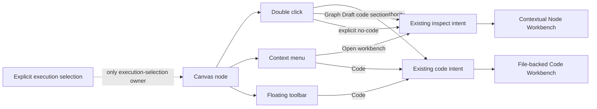

# Canvas Node Workbench Hardening Plan

## Goal

Harden the existing Canvas Node Workbench so current product capabilities are coherent, editable through their real authorities, persistent, accessible, localized, and professionally presented without adding a second editor, store, command rail, or connection model.

This is the bounded W4 implementation child #2262 under #2195. Product acceptance remains #2255. Connection/resource-binding semantics remain #2256 and are explicitly out of scope.

Baseline: `main@32cfaf6d31fa5ca789bdb390def95d27f5d71f59`.

## Governing Sources

- `AGENTS.md`
- `docs/planning/status/governance-document-rule-inventory.md`
- `docs/guides/ai-work-protocol.md`
- `docs/architecture/command-query-rail-governance.md`
- `docs/architecture/fowler-opportunity-planning-governance.md`
- `docs/planning/proposals/mandatory/frontend-and-ux/dvt-workbench-ux-canon-plan-20260524.md`
- GitHub #2195, #2255, #2262

## Think-First Result

The Canvas did not need a new editor or state model. Current source already had:

- one contextual Node Workbench;
- node context commands using `onInspectNode` / `onOpenNodeCode`;
- Graph Draft DVT/dbt authoring through `CanvasInspectorNodeDraft` and the existing apply/CAS lifecycle;
- file-backed dbt SQL and YAML mutation through project-file authorities;
- explicit execution selection distinct from ordinary React Flow selection;
- existing Tooltip/Button/Lucide primitives and ES/EN Canvas copy.

The hardening defects were interaction and ownership drift:

1. node double-click opened generic Workbench focus instead of preferring code;
2. file-backed nodes without a code path needed a truthful non-dead fallback;
3. application-level React Flow click/selection callbacks were forwarded even though they had no behavior;
4. `modelerActions` projected node commands into Inspector authoring despite no product consumer;
5. Workbench help/close presentation was not the compact right-aligned accessible contract;
6. DVT transform-column UI still contained visible English literals outside the localization boundary;
7. existing live E2E flows still encoded the old double-click-as-generic-inspector behavior.

## Selected Design

Reuse and reduce:

- double-click chooses the existing code intent when code authority exists;
- an explicit `canOpenNodeCode === false` falls back to the existing generic Workbench;
- Graph Draft nodes without an external file authority request the existing Workbench `code` section, whose tab resolver remains the truthful fallback;
- the explicit context-menu Workbench command remains the passive/general inspection path;
- normal node click remains local React Flow presentation for the floating toolbar and never mutates the execution selection set;
- only the existing explicit execution-selection action mutates execution intent;
- DVT source/SQL/input-column/sink/materialization authoring continues through the existing Graph Draft authority;
- file-backed dbt derived facts stay read-only while SQL/YAML edits retain file authority;
- Workbench help is contextual and localized, not permanent explanatory body copy;
- no connection-domain change is made; #2256 remains its owner.

## Interaction Contract



## Authoring Authority Matrix

| Property / surface | Authority | Posture |
|---|---|---|
| Graph Draft name/tags/description | `WorkspaceGraphAuthoringDraft` through `CanvasDraftSession` | editable when policy admits |
| DVT source database/schema/table/alias | Graph Draft DVT authoring value object | editable |
| DVT transform SQL + selected input columns | Graph Draft DVT authoring value object | editable |
| DVT sink database/schema/table/materialization/write mode/partition | Graph Draft DVT authoring value object | editable |
| dbt SQL project file | revisioned workspace project file | editable through existing Code rail |
| supported dbt YAML description | project YAML | editable through existing YAML rail |
| dbt artifact / analysis facts | derived projection | read-only / truthful unavailable |
| `NodePropertiesReadModel` | passive query model | read-only |
| `CanvasInspectorNodeDraft` | transient UI DTO | never persistence authority |

## Action To Owner Matrix

| Intent | Retained UI surfaces | Existing owner |
|---|---|---|
| Open node code | double-click, toolbar Code, context Code, Workbench Code | current `onOpenNodeCode` / `onInspectNode(..., 'code')` seams |
| Open passive Workbench | context-menu Workbench; no-code fallback | current `onInspectNode` seam |
| Configure Graph Draft node | Workbench authoring sections | existing configure/apply command |
| Persist Graph Draft semantics | current autosave/CAS lifecycle | `WorkspaceGraphAuthoringDraft` / `CanvasDraftSession` |
| Persist dbt SQL/YAML | current file/YAML commands | project-file authority |
| Select for execution | explicit play/pause/context action | execution-selection command |
| Close Workbench | header X | Workbench presentation |
| Show contextual help | header `?` | presentation only; no product command |

## Fowler Opportunity Matrix

| scenario | signal | reduction / pattern | owner | proof |
|---|---|---|---|---|
| double-click vs Code/Workbench | duplicate semantics | converge entry points onto existing commands | Canvas interaction presentation | architecture + live dbt flow |
| no-op click/selection forwarding | dead seam | remove forwarding; keep local presentation | React Flow presentation | architecture/type tests |
| Inspector `modelerActions` | duplicate command projection | remove unconsumed seam | Workbench authoring contract | consumer audit + builder test |
| Workbench header/help | presentation drift | compact localized contextual controls | Workbench presentation | component test + live flow |
| DVT English literals | localization drift | reuse existing Canvas copy | Canvas copy | architecture tests |
| authoring persistence | test-only confidence risk | reuse real authority and existing live flows | Graph Draft / project files | live protected-runtime flows |

## Pre-Implementation Brief And Scope Correction

Mode: **Full** because user-visible behavior changes and live-browser proof are required.

The initial plan correctly bounded the product owners, but the red/green consumer audit showed that the dead React Flow seams and exhausted Inspector projection crossed additional existing shell forwarding files. Those files were not a new subsystem; they were the exact forwarding chain that had to be removed to make the seam truly disappear. This plan records that scope correction explicitly rather than leaving the final diff outside mechanization.

No product/backend/connection scope was added. No package under contracts, engine, planner, adapters, infra DB, or Planning DB is touched.

## TDD / Reduction Evidence

- Red contract commit: `b8ba2fd8b298c04d625cc47a4134d3740c1cb139`.
- Green code-first double-click reuses existing code/inspect seams.
- QA correction added explicit no-code fallback so file-backed nodes without `path` cannot become dead double-click targets.
- React Flow application no-op click/selection callbacks were removed end-to-end while local toolbar click behavior remains.
- Source-wide audit found no product consumer of Inspector `modelerActions`; the DTO/projection and tests that only asserted that dead wiring were removed.
- DVT transform copy reuses existing localized semantic copy rather than introducing synonymous strings.
- Existing live dbt flows were updated so general authoring uses the explicit Workbench command and double-click proves code-first behavior.

## Regression Baseline

The slice must preserve:

- Contextual Node Workbench open/close and movement;
- explicit Workbench command for passive metadata;
- explicit execution selection and Preview/Run semantics;
- Graph Draft source/model/sink authoring validation and CAS persistence;
- file-backed dbt SQL authority and supported YAML authority;
- file-backed graph/artifact facts remaining read-only;
- layout persistence remaining route-local;
- Canvas graph search/filter, drag, zoom and context menu behavior;
- ES/EN Canvas semantics.

## Feature Mechanization

```feature-mechanization
version: 1
featureId: W4-CANVAS-NODE-WORKBENCH-HARDENING-20260808
mechanizationStatus: implemented
noHumanDecisionsRemaining: true
implementationPlan: docs/planning/proposals/mandatory/frontend-and-ux/canvas-node-workbench-hardening-plan-20260808.md
componentGuides:
  - docs/planning/proposals/mandatory/frontend-and-ux/dvt-workbench-ux-canon-plan-20260524.md
  - docs/architecture/command-query-rail-governance.md
  - docs/architecture/fowler-opportunity-planning-governance.md
userStories:
  - As a Canvas author, I double-click a node and reach its existing code authority or a truthful contextual fallback.
  - As a Canvas author, I use the explicit Workbench command to inspect or edit only properties owned by the active authority.
  - As a keyboard or Spanish/English user, I can understand, get contextual help for, and close the Workbench without dead or clipped controls.
governingSources:
  - AGENTS.md
  - docs/planning/status/governance-document-rule-inventory.md
  - docs/guides/ai-work-protocol.md
  - docs/architecture/command-query-rail-governance.md
  - docs/architecture/fowler-opportunity-planning-governance.md
  - docs/planning/proposals/mandatory/frontend-and-ux/dvt-workbench-ux-canon-plan-20260524.md
allowedImplementationSurfaces:
  - docs/planning/proposals/mandatory/frontend-and-ux/canvas-node-workbench-hardening-plan-20260808.md
  - docs/planning/proposals/mandatory/frontend-and-ux/**/index.md
  - docs/planning/proposals/index.md
  - docs/planning/closeouts/**
  - docs/.manifest.json
  - apps/web/src/app/components/canvas/DbtNodeComponent.tsx
  - apps/web/src/app/views/Canvas.test.controller.defaults.ts
  - apps/web/src/app/views/canvas/CanvasNodeWorkbenchPanel.header.test.tsx
  - apps/web/src/app/views/canvas/CanvasNodeWorkbenchPanel.tsx
  - apps/web/src/app/views/canvas/CanvasShellMainPanel.tsx
  - apps/web/src/app/views/canvas/CanvasViewport.tsx
  - apps/web/src/app/views/canvas/CanvasViewportSurfaceView.tsx
  - apps/web/src/app/views/canvas/DvtSqlTransformAuthoringSection.tsx
  - apps/web/src/app/views/canvas/canvasControllerViewModel.ts
  - apps/web/src/app/views/canvas/canvasCopy.nodeWorkbench.ts
  - apps/web/src/app/views/canvas/canvasInspectorAuthoring.types.ts
  - apps/web/src/app/views/canvas/canvasNodeWorkbenchHardening.architecture.test.ts
  - apps/web/src/app/views/canvas/canvasShell.types.ts
  - apps/web/src/app/views/canvas/canvasShellBuilder.types.ts
  - apps/web/src/app/views/canvas/canvasShellGraphCommandsBuilder.ts
  - apps/web/src/app/views/canvas/canvasShellPanelsBuilder.test.ts
  - apps/web/src/app/views/canvas/canvasShellPanelsBuilder.ts
  - apps/web/src/app/views/canvas/canvasShellPropsBuilder.tsx
  - apps/web/src/app/views/canvas/useCanvasGraphHandlers.types.ts
  - apps/web/src/app/views/canvas/useCanvasSelectionHandlers.ts
  - apps/web/src/app/views/canvas/useDbtProjectFileCanvasController.ts
  - apps/web/cypress/e2e/canvas/canvas-dbt-author-code-run-live.cy.ts
  - apps/web/cypress/e2e/dbt/dbt-project-file-projection-live.cy.ts
forbiddenImplementationSurfaces:
  - packages/@dvt/contracts/**
  - packages/@dvt/engine/**
  - packages/@dvt/planner/**
  - packages/@dvt/adapter-*/**
  - infra/db/**
  - tools/planning-db/**
commandQueryRails:
  - name: InspectCanvasNode
    type: command
    status: implemented
    dddOwner: Canvas interaction presentation
  - name: ConfigureCanvasDvtNode
    type: command
    status: implemented
    dddOwner: CanvasDraftSession
  - name: ConfigureCanvasDbtNode
    type: command
    status: implemented
    dddOwner: CanvasDraftSession
  - name: SaveWorkspaceGraphDraft
    type: command
    status: implemented
    dddOwner: WorkspaceGraphAuthoringDraft
  - name: SelectCanvasExecutionNode
    type: command
    status: implemented
    dddOwner: Canvas execution-selection intent
domainObjects:
  - name: CanvasDraftSession
    type: aggregate
    owner: Web Canvas authoring
  - name: WorkspaceGraphAuthoringDraft
    type: persisted protocol
    owner: Graph Draft authority
  - name: CanvasInspectorNodeDraft
    type: transient DTO
    owner: Node Workbench presentation
  - name: NodePropertiesReadModel
    type: read model
    owner: passive node properties
  - name: CanvasRuntimePolicy
    type: policy
    owner: Canvas application policy
fowlerSignals:
  - duplicate semantics across Workbench/code entry points
  - dead application selection callbacks
  - unconsumed Inspector command projection
  - hidden authoring authority
  - presentation and localization drift
architectureGuards:
  - pnpm docs:feature-mechanization:implementation -- --feature W4-CANVAS-NODE-WORKBENCH-HARDENING-20260808
cypressFlows:
  - apps/web/cypress/e2e/canvas/canvas-dbt-author-code-run-live.cy.ts
  - apps/web/cypress/e2e/dbt/dbt-project-file-projection-live.cy.ts
  - apps/web/cypress/e2e/dbt/dbt-project-yaml-description-edit-live.cy.ts
completionGate:
  - pnpm --filter @dvt/web typecheck
  - pnpm --filter @dvt/web lint
  - pnpm --filter @dvt/web test
  - pnpm docs:feature-mechanization:implementation -- --feature W4-CANVAS-NODE-WORKBENCH-HARDENING-20260808
  - pnpm governance:refresh
  - pnpm verify:prepush
redGreenCycles:
  - id: code-first-node-double-click
    redTest: apps/web/src/app/views/canvas/canvasNodeWorkbenchHardening.architecture.test.ts
    expectedFailure: Double-click dispatches generic Workbench focus instead of the existing code intent and no-code fallback.
    patchSurfaces:
      - apps/web/src/app/components/canvas/DbtNodeComponent.tsx
    greenTest: apps/web/src/app/views/canvas/canvasNodeWorkbenchHardening.architecture.test.ts
  - id: workbench-professional-help-close
    redTest: apps/web/src/app/views/canvas/canvasNodeWorkbenchHardening.architecture.test.ts
    expectedFailure: Workbench header has no localized contextual help icon and compact close contract.
    patchSurfaces:
      - apps/web/src/app/views/canvas/CanvasNodeWorkbenchPanel.tsx
      - apps/web/src/app/views/canvas/canvasCopy.nodeWorkbench.ts
    greenTest: apps/web/src/app/views/canvas/CanvasNodeWorkbenchPanel.header.test.tsx
  - id: selection-seam-reduction
    redTest: apps/web/src/app/views/canvas/canvasNodeWorkbenchHardening.architecture.test.ts
    expectedFailure: Application-level React Flow click/selection callbacks and Inspector modeler actions remain despite no product behavior or consumer.
    patchSurfaces:
      - apps/web/src/app/views/canvas/useCanvasSelectionHandlers.ts
      - apps/web/src/app/views/canvas/useDbtProjectFileCanvasController.ts
      - apps/web/src/app/views/canvas/CanvasViewport.tsx
      - apps/web/src/app/views/canvas/CanvasViewportSurfaceView.tsx
      - apps/web/src/app/views/canvas/canvasControllerViewModel.ts
      - apps/web/src/app/views/canvas/canvasInspectorAuthoring.types.ts
      - apps/web/src/app/views/canvas/canvasShellPanelsBuilder.ts
      - apps/web/src/app/views/canvas/canvasShellPropsBuilder.tsx
    greenTest: apps/web/src/app/views/canvas/canvasNodeWorkbenchHardening.architecture.test.ts
  - id: w4-localization
    redTest: apps/web/src/app/views/canvas/canvasNodeWorkbenchHardening.architecture.test.ts
    expectedFailure: DVT transform authoring contains user-visible English literals outside Canvas copy.
    patchSurfaces:
      - apps/web/src/app/views/canvas/DvtSqlTransformAuthoringSection.tsx
    greenTest: apps/web/src/app/views/canvas/canvasNodeWorkbenchHardening.architecture.test.ts
  - id: live-authority-proof
    redTest: existing live flows encode double-click as generic inspection instead of code-first intent.
    expectedFailure: Browser journeys do not distinguish explicit Workbench inspection from double-click Code while preserving authoritative persistence.
    patchSurfaces:
      - apps/web/cypress/e2e/canvas/canvas-dbt-author-code-run-live.cy.ts
      - apps/web/cypress/e2e/dbt/dbt-project-file-projection-live.cy.ts
    greenTest: existing live protected-runtime flows with code-first double-click and explicit Workbench command
symbols:
  - { name: CanvasNodeWorkbenchHelpCopy, path: apps/web/src/app/views/canvas/canvasCopy.nodeWorkbench.ts, dddOwner: Canvas presentation copy, cqRails: [InspectCanvasNode], fowlerSignals: [presentation and localization drift], architectureGuard: pnpm docs:feature-mechanization:implementation -- --feature W4-CANVAS-NODE-WORKBENCH-HARDENING-20260808, unitTests: [apps/web/src/app/views/canvas/CanvasNodeWorkbenchPanel.header.test.tsx], cypressCoverage: apps/web/cypress/e2e/dbt/dbt-project-file-projection-live.cy.ts }
  - { name: NODE_WORKBENCH_HELP_COPY, path: apps/web/src/app/views/canvas/canvasCopy.nodeWorkbench.ts, dddOwner: Canvas presentation copy, cqRails: [InspectCanvasNode], fowlerSignals: [presentation and localization drift], architectureGuard: pnpm docs:feature-mechanization:implementation -- --feature W4-CANVAS-NODE-WORKBENCH-HARDENING-20260808, unitTests: [apps/web/src/app/views/canvas/CanvasNodeWorkbenchPanel.header.test.tsx], cypressCoverage: apps/web/cypress/e2e/dbt/dbt-project-file-projection-live.cy.ts }
  - { name: resolveCanvasNodeWorkbenchHelpCopy, path: apps/web/src/app/views/canvas/canvasCopy.nodeWorkbench.ts, dddOwner: Canvas presentation copy, cqRails: [InspectCanvasNode], fowlerSignals: [presentation and localization drift], architectureGuard: pnpm docs:feature-mechanization:implementation -- --feature W4-CANVAS-NODE-WORKBENCH-HARDENING-20260808, unitTests: [apps/web/src/app/views/canvas/CanvasNodeWorkbenchPanel.header.test.tsx], cypressCoverage: apps/web/cypress/e2e/dbt/dbt-project-file-projection-live.cy.ts }
  - { name: CanvasNodeWorkbenchPanel, path: apps/web/src/app/views/canvas/CanvasNodeWorkbenchPanel.tsx, dddOwner: Node Workbench presentation, cqRails: [InspectCanvasNode], fowlerSignals: [presentation drift], architectureGuard: pnpm docs:feature-mechanization:implementation -- --feature W4-CANVAS-NODE-WORKBENCH-HARDENING-20260808, unitTests: [apps/web/src/app/views/canvas/CanvasNodeWorkbenchPanel.header.test.tsx], cypressCoverage: apps/web/cypress/e2e/dbt/dbt-project-file-projection-live.cy.ts }
  - { name: DvtSqlTransformAuthoringSection, path: apps/web/src/app/views/canvas/DvtSqlTransformAuthoringSection.tsx, dddOwner: DVT transform authoring presentation, cqRails: [ConfigureCanvasDvtNode], fowlerSignals: [presentation and localization drift], architectureGuard: pnpm docs:feature-mechanization:implementation -- --feature W4-CANVAS-NODE-WORKBENCH-HARDENING-20260808, unitTests: [apps/web/src/app/views/canvas/canvasNodeWorkbenchHardening.architecture.test.ts], cypressCoverage: apps/web/cypress/e2e/canvas/canvas-dbt-author-code-run-live.cy.ts }
  - { name: useCanvasSelectionHandlers, path: apps/web/src/app/views/canvas/useCanvasSelectionHandlers.ts, dddOwner: Canvas interaction presentation, cqRails: [SelectCanvasExecutionNode], fowlerSignals: [dead application selection callbacks], architectureGuard: pnpm docs:feature-mechanization:implementation -- --feature W4-CANVAS-NODE-WORKBENCH-HARDENING-20260808, unitTests: [apps/web/src/app/views/canvas/canvasNodeWorkbenchHardening.architecture.test.ts], cypressCoverage: apps/web/cypress/e2e/canvas/canvas-dbt-author-code-run-live.cy.ts }
  - { name: CanvasInspectorAuthoringContract, path: apps/web/src/app/views/canvas/canvasInspectorAuthoring.types.ts, dddOwner: Node Workbench authoring contract, cqRails: [ConfigureCanvasDvtNode, ConfigureCanvasDbtNode], fowlerSignals: [unconsumed Inspector command projection], architectureGuard: pnpm docs:feature-mechanization:implementation -- --feature W4-CANVAS-NODE-WORKBENCH-HARDENING-20260808, unitTests: [apps/web/src/app/views/canvas/canvasShellPanelsBuilder.test.ts], cypressCoverage: apps/web/cypress/e2e/canvas/canvas-dbt-author-code-run-live.cy.ts }
  - { name: buildCanvasShellPanels, path: apps/web/src/app/views/canvas/canvasShellPanelsBuilder.ts, dddOwner: Canvas shell composition, cqRails: [InspectCanvasNode], fowlerSignals: [unconsumed Inspector command projection], architectureGuard: pnpm docs:feature-mechanization:implementation -- --feature W4-CANVAS-NODE-WORKBENCH-HARDENING-20260808, unitTests: [apps/web/src/app/views/canvas/canvasShellPanelsBuilder.test.ts], cypressCoverage: apps/web/cypress/e2e/canvas/canvas-dbt-author-code-run-live.cy.ts }
  - { name: buildCanvasShellGraphCommands, path: apps/web/src/app/views/canvas/canvasShellGraphCommandsBuilder.ts, dddOwner: Canvas shell composition, cqRails: [InspectCanvasNode], fowlerSignals: [dead application selection callbacks], architectureGuard: pnpm docs:feature-mechanization:implementation -- --feature W4-CANVAS-NODE-WORKBENCH-HARDENING-20260808, unitTests: [apps/web/src/app/views/canvas/canvasNodeWorkbenchHardening.architecture.test.ts], cypressCoverage: apps/web/cypress/e2e/canvas/canvas-dbt-author-code-run-live.cy.ts }
  - { name: buildCanvasShellProps, path: apps/web/src/app/views/canvas/canvasShellPropsBuilder.tsx, dddOwner: Canvas route composition, cqRails: [InspectCanvasNode], fowlerSignals: [dead application selection callbacks], architectureGuard: pnpm docs:feature-mechanization:implementation -- --feature W4-CANVAS-NODE-WORKBENCH-HARDENING-20260808, unitTests: [apps/web/src/app/views/canvas/canvasNodeWorkbenchHardening.architecture.test.ts], cypressCoverage: apps/web/cypress/e2e/canvas/canvas-dbt-author-code-run-live.cy.ts }
```

## Completion / Acceptance Boundary

Implementation decisions for #2262 are mechanized; no additional implementation design decision is intentionally deferred. This does **not** close product acceptance: #2255 remains the owner of real live/browser evidence and explicit product-owner UAT/sign-off.

Before #2266 may be considered review-ready:

- feature mechanization implementation guard must accept the exact diff;
- relevant Web/type/lint/unit gates must pass;
- remote PR Quality and full non-draft CI must pass;
- updated live flows must remain valid where the protected-runtime environment is available;
- QA must find no unresolved blocking defect;
- evidence must be posted back to #2262 and #2255;
- the PR remains unmerged for owner review.
