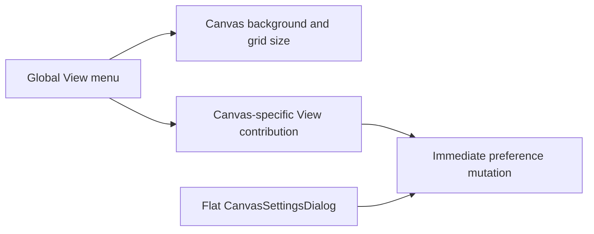
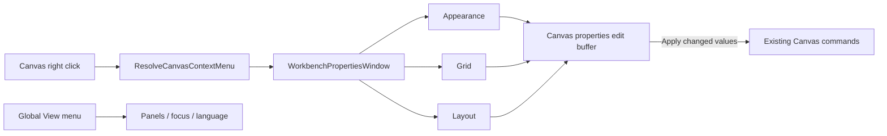

# Canvas Properties Window Convergence Plan

## Decision

Evolve the surviving `CanvasSettingsDialog` into the only Canvas properties
surface. It composes one reusable workbench properties-window component with
tabbed sections and an explicit edit buffer. Canvas-specific controls leave the
global View menu; View retains panels, focus mode, and application language.

The slice reuses the existing rails:

- `ResolveCanvasContextMenu` opens the existing Canvas properties action;
- `ConfigureCanvasViewportPreferences` changes route-local presentation;
- `GetCanvasLayout` and `PersistCanvasLayout` retain layout authority;
- `UpdateCanvasProperties` remains the existing protected metadata rail and is
  not broadened to own route-local viewport preferences.

No API, database, migration, store, graph-draft schema, or command vocabulary is
added.

## Current State



The same Canvas presentation intent has three component entry points. The
dialog is a local one-off, has no section model, and applies every change
immediately, so Cancel cannot be truthful.

## Target State



## Think-First Analysis

### Root cause

Canvas controls accumulated in the shell before the contextual settings dialog
existed. The later dialog reused the underlying callbacks but not one shared
properties composition or edit contract. This left duplicate presentation
authority, divergent styling, and immediate mutation disguised as settings.

### Constraints and invariants

- The Canvas context menu remains the only entry to Canvas properties.
- The existing dialog and focus-transfer owner evolves; no second surface is
  introduced.
- View retains application-global preferences only.
- Route-local viewport preferences remain local and do not become protected
  graph-draft metadata.
- Apply dispatches only changed values; Cancel, close, and Escape discard the
  edit buffer.
- Auto-layout remains the existing command and is requested in the edit buffer
  before Apply.
- English and Spanish copy come from the existing Canvas copy catalog.
- Existing Radix/shadcn Dialog, Tabs, Button, Switch, Select, and Label
  primitives remain the accessibility and visual foundation.

### Options

| Option                                                         | Decision | Rationale                                                               |
| -------------------------------------------------------------- | -------- | ----------------------------------------------------------------------- |
| Keep both menus and restyle them                               | Rejected | Preserves duplicate product intent.                                     |
| Put the complete form inside the context menu                  | Rejected | A command menu is not a settings form or focus trap.                    |
| Add a second Canvas properties panel                           | Rejected | Creates another owner and conflicts with the surviving dialog.          |
| Evolve the dialog through a shared tabbed properties component | Selected | Removes duplication while retaining existing rails and focus ownership. |

## Fowler Opportunity Matrix

| Scenario                                       | Opportunity                            | Fowler pattern                                    | DDD owner                            | Rail                                 | Proof                             |
| ---------------------------------------------- | -------------------------------------- | ------------------------------------------------- | ------------------------------------ | ------------------------------------ | --------------------------------- |
| Canvas controls appear in View and settings    | Duplicate semantics / divergent change | Consolidate Duplicate Conditional Fragments       | Canvas viewport presentation         | `ConfigureCanvasViewportPreferences` | View contains no Canvas controls. |
| Settings dialog owns its shell and form        | Responsibility overload                | Extract Component                                 | Web workbench presentation           | presentation only                    | Shared component contract test.   |
| Changes apply on every click                   | Hidden authority                       | Introduce Parameter Object / Edit Buffer          | Canvas properties presentation draft | existing commands                    | Apply/Cancel negative tests.      |
| Settings are a flat list                       | Primitive obsession                    | Replace Type Code with capability-backed sections | Canvas properties read model         | existing queries                     | Only supported tabs render.       |
| Multiple surfaces style settings independently | Shotgun surgery                        | Consolidate presentation composition              | Web design-token layer               | visual-token query                   | Architecture guard and token use. |

## Pre-Implementation Brief

- Mode: Full.
- Scope: reusable properties-window composition, Canvas Appearance/Grid/Layout
  tabs, edit-buffer semantics, and retirement of View-menu Canvas controls and
  their contribution store.
- Expected outcome: one contextual Canvas properties window and one global View
  menu with no repeated Canvas intent.
- Negative coverage: Cancel/Escape never mutate; unavailable auto-layout cannot
  execute; invalid colors normalize before apply; View never renders Canvas
  background, grid, layout, or settings controls.
- Libraries evaluated: installed Radix/shadcn primitives and `react-colorful`;
  no new dependency is required.
- Command/query impact: reuse only; DB-first creation-intent returned
  `reuse-existing-rail`.
- Out of scope: Node Properties migration, execution controls, APIs,
  persistence contracts, database work, or a generic schema-driven form engine.

## Acceptance

1. Canvas right click opens the existing localized action menu and its Canvas
   properties action opens the only properties window.
2. Appearance, Grid, and Layout are tabbed, keyboard reachable, and backed by
   existing capabilities.
3. Apply dispatches only changed values and closes; Cancel, close, and Escape
   discard all pending values and restore focus.
4. View contains only panels, focus, and language among the affected controls.
5. The window remains usable at 1366x768 and 1920x1080 at 100% and 200% zoom in
   English and Spanish.

## Microcommit Sequence

1. `docs(docs): Declare Canvas properties convergence plan`
2. `test(web): Define shared properties window and Canvas edit buffer`
3. `refactor(web): Add shared workbench properties window`
4. `fix(web): Consolidate Canvas properties into tabs`
5. `refactor(web): Remove duplicate Canvas View controls`
6. `test(web): Prove Canvas properties accessibility and visibility`
7. `docs(docs): Close Canvas properties convergence evidence`

## Feature Mechanization

```feature-mechanization
version: 1
featureId: CANVAS-PROPERTIES-WINDOW-2360
mechanizationStatus: implemented
noHumanDecisionsRemaining: true
implementationPlan: docs/planning/proposals/mandatory/frontend-and-ux/canvas-properties-window-convergence-plan-20260814.md
componentGuides:
  - docs/architecture/components/web/workbench-ui-contract-and-component-inventory.md
  - docs/architecture/components/web/iconography-and-design-tokens-contract.md
  - docs/architecture/components/web/graph/canvas-view-menu-component.md
  - docs/architecture/components/web/graph/canvas-workbench-command-query-catalog.md
  - docs/architecture/command-query-rail-governance.md
  - docs/architecture/fowler-opportunity-planning-governance.md
userStories:
  - As a Canvas author, I edit all supported Canvas presentation properties in one contextual tabbed window.
  - As a Canvas author, I cancel pending Canvas property changes without changing the viewport.
  - As a keyboard or screen-reader user, I navigate the properties tabs and return focus to the Canvas opener.
  - As an application user, I use View for global viewing preferences without repeated Canvas controls.
governingSources:
  - AGENTS.md
  - docs/guides/ai-work-protocol.md
  - docs/architecture/command-query-rail-governance.md
  - docs/architecture/fowler-opportunity-planning-governance.md
  - docs/architecture/components/web/workbench-ui-contract-and-component-inventory.md
  - docs/architecture/components/web/iconography-and-design-tokens-contract.md
  - docs/architecture/components/web/graph/canvas-view-menu-component.md
  - docs/architecture/components/web/graph/canvas-workbench-command-query-catalog.md
allowedImplementationSurfaces:
  - apps/web/src/app/components/workbench/WorkbenchPropertiesWindow.tsx
  - apps/web/src/app/components/workbench/WorkbenchPropertiesWindow.test.tsx
  - apps/web/src/app/components/TopAppBar.tsx
  - apps/web/src/app/components/TopAppBar.test.tsx
  - apps/web/src/app/components/shell/ShellMenu.tsx
  - apps/web/src/app/components/shell/shellViewControlsModel.ts
  - apps/web/src/app/components/shell/shellViewControlsModel.test.ts
  - apps/web/src/app/views/Canvas.test.support.tsx
  - apps/web/src/app/views/Canvas.test.controller.defaults.ts
  - apps/web/src/app/views/Canvas.readOnlyStates.test.tsx
  - apps/web/src/app/views/Canvas.draftRecovery.test.tsx
  - apps/web/src/app/views/canvas/CanvasSettingsDialog.tsx
  - apps/web/src/app/views/canvas/CanvasSettingsDialog.test.tsx
  - apps/web/src/app/views/canvas/CanvasSettingsDialog.architecture.test.tsx
  - apps/web/src/app/views/canvas/CanvasShell.tsx
  - apps/web/src/app/views/canvas/CanvasShell.contextualDialogs.test.tsx
  - apps/web/src/app/views/canvas/CanvasShellMainPanel.tsx
  - apps/web/src/app/views/canvas/CanvasViewportSurfaceView.tsx
  - apps/web/src/app/views/canvas/CanvasViewport.test.tsx
  - apps/web/src/app/views/canvas/CanvasViewport.keyboardContextMenu.test.tsx
  - apps/web/src/app/views/canvas/CanvasContextMenuView.test.tsx
  - apps/web/src/app/views/canvas/CanvasShell.testHarness.tsx
  - apps/web/src/app/views/canvas/CanvasViewMenuControls.tsx
  - apps/web/src/app/views/canvas/CanvasViewMenuControls.test.tsx
  - apps/web/src/app/views/canvas/canvasViewMenuContributionStore.ts
  - apps/web/src/app/views/canvas/canvasShell.types.ts
  - apps/web/src/app/views/canvas/canvasShellBuilder.types.ts
  - apps/web/src/app/views/canvas/canvasShellChromeCommandsBuilder.ts
  - apps/web/src/app/views/canvas/canvasShellPropsBuilder.tsx
  - apps/web/src/app/views/canvas/canvasControllerViewModel.ts
  - apps/web/src/app/views/canvas/useCanvasStoreFacade.ts
  - apps/web/src/app/views/canvas/useDbtProjectFileCanvasController.ts
  - apps/web/src/app/views/canvas/canvasCopy.types.ts
  - apps/web/src/app/views/canvas/canvasCopyCatalog.toolbar.ts
  - apps/web/src/app/views/canvas/canvasCopyCatalog.toolbar.es.ts
  - apps/web/src/app/views/canvas/copy.test.ts
  - apps/web/cypress/e2e/shell/canvas-workbench-screen-composition.cy.ts
  - apps/web/cypress/e2e/canvas/canvas-preview-run-authoring.cy.ts
  - docs/architecture/components/web/graph/canvas-view-menu-component.md
  - docs/architecture/components/web/graph/canvas-view-menu-user-stories.md
  - docs/architecture/components/web/graph/canvas-workbench-command-query-catalog.md
  - docs/planning/proposals/mandatory/frontend-and-ux/canvas-properties-window-convergence-plan-20260814.md
  - docs/planning/status/generated-code-state.md
forbiddenImplementationSurfaces:
  - apps/api/**
  - packages/@dvt/contracts/**
  - packages/@dvt/engine/**
  - packages/@dvt/planner/**
  - packages/@dvt/adapter-*/**
  - infra/db/**
  - tools/planning-db/**
commandQueryRails:
  - name: ResolveCanvasContextMenu
    type: query
    status: implemented
    dddOwner: CanvasContextMenuModel
  - name: ConfigureCanvasViewportPreferences
    type: command
    status: implemented
    dddOwner: CanvasViewportPreferences
  - name: GetCanvasLayout
    type: query
    status: implemented
    dddOwner: CanvasLayoutProjection
  - name: PersistCanvasLayout
    type: command
    status: implemented
    dddOwner: CanvasLayoutProjection
  - name: UpdateCanvasProperties
    type: command
    status: implemented
    dddOwner: ProjectCanvasLifecycle
domainObjects:
  - name: CanvasViewportPreferences
    type: value object
    owner: Canvas viewport presentation
  - name: CanvasPropertiesEditBuffer
    type: presentation model
    owner: Canvas contextual properties
  - name: CanvasLayoutProjection
    type: read model
    owner: Canvas layout persistence
symbols:
  - path: apps/web/src/app/components/workbench/WorkbenchPropertiesWindow.tsx
    name: WorkbenchPropertiesWindow
    kind: function
    exported: true
    dddOwner: Web workbench presentation
    cqRails: [ConfigureCanvasViewportPreferences]
    fowlerSignals: [Responsibility overload, Shotgun surgery]
    architectureGuard: pnpm --filter @dvt/web test:canvas-architecture:run
    cypressCoverage: apps/web/cypress/e2e/shell/canvas-workbench-screen-composition.cy.ts
    unitTests: [pnpm --filter @dvt/web test:canvas-presentation:run]
  - path: apps/web/src/app/components/workbench/WorkbenchPropertiesWindow.tsx
    name: WorkbenchPropertiesSection
    kind: type
    exported: true
    dddOwner: Web workbench presentation
    cqRails: [ConfigureCanvasViewportPreferences]
    fowlerSignals: [Responsibility overload]
    architectureGuard: pnpm --filter @dvt/web test:canvas-architecture:run
    cypressCoverage: apps/web/cypress/e2e/shell/canvas-workbench-screen-composition.cy.ts
    unitTests: [pnpm --filter @dvt/web test:presentation:run]
  - path: apps/web/src/app/components/workbench/WorkbenchPropertiesWindow.tsx
    name: WorkbenchPropertiesWindowProps
    kind: type
    exported: false
    dddOwner: Web workbench presentation
    cqRails: [ConfigureCanvasViewportPreferences]
    fowlerSignals: [Responsibility overload]
    architectureGuard: pnpm --filter @dvt/web test:canvas-architecture:run
    cypressCoverage: apps/web/cypress/e2e/shell/canvas-workbench-screen-composition.cy.ts
    unitTests: [pnpm --filter @dvt/web test:presentation:run]
  - path: apps/web/src/app/views/canvas/CanvasSettingsDialog.tsx
    name: CanvasSettingsDialog
    kind: function
    exported: true
    dddOwner: Canvas contextual properties
    cqRails: [ConfigureCanvasViewportPreferences, GetCanvasLayout, PersistCanvasLayout]
    fowlerSignals: [Duplicate semantics, Hidden authority, Primitive obsession]
    architectureGuard: pnpm --filter @dvt/web test:canvas-architecture:run
    cypressCoverage: apps/web/cypress/e2e/shell/canvas-workbench-screen-composition.cy.ts
    unitTests: [pnpm --filter @dvt/web test:canvas-presentation:run]
  - path: apps/web/src/app/views/canvas/CanvasSettingsDialog.tsx
    name: CanvasPropertiesEditBuffer
    kind: type
    exported: false
    dddOwner: Canvas contextual properties
    cqRails: [ConfigureCanvasViewportPreferences, PersistCanvasLayout]
    fowlerSignals: [Hidden authority]
    architectureGuard: pnpm --filter @dvt/web test:canvas-architecture:run
    cypressCoverage: apps/web/cypress/e2e/shell/canvas-workbench-screen-composition.cy.ts
    unitTests: [pnpm --filter @dvt/web test:canvas-presentation:run]
  - path: apps/web/src/app/views/canvas/CanvasSettingsDialog.tsx
    name: CanvasSettingToggleRowProps
    kind: type
    exported: false
    dddOwner: Canvas contextual properties
    cqRails: [ConfigureCanvasViewportPreferences]
    fowlerSignals: [Primitive obsession]
    architectureGuard: pnpm --filter @dvt/web test:canvas-architecture:run
    cypressCoverage: apps/web/cypress/e2e/shell/canvas-workbench-screen-composition.cy.ts
    unitTests: [pnpm --filter @dvt/web test:canvas-presentation:run]
  - path: apps/web/src/app/views/canvas/CanvasSettingsDialog.tsx
    name: CanvasSettingToggleRow
    kind: function
    exported: false
    dddOwner: Canvas contextual properties
    cqRails: [ConfigureCanvasViewportPreferences]
    fowlerSignals: [Duplicate semantics]
    architectureGuard: pnpm --filter @dvt/web test:canvas-architecture:run
    cypressCoverage: apps/web/cypress/e2e/shell/canvas-workbench-screen-composition.cy.ts
    unitTests: [pnpm --filter @dvt/web test:canvas-presentation:run]
  - path: apps/web/src/app/views/canvas/CanvasSettingsDialog.tsx
    name: CanvasColorFieldProps
    kind: type
    exported: false
    dddOwner: Canvas contextual properties
    cqRails: [ConfigureCanvasViewportPreferences]
    fowlerSignals: [Primitive obsession]
    architectureGuard: pnpm --filter @dvt/web test:canvas-architecture:run
    cypressCoverage: apps/web/cypress/e2e/shell/canvas-workbench-screen-composition.cy.ts
    unitTests: [pnpm --filter @dvt/web test:canvas-presentation:run]
  - path: apps/web/src/app/views/canvas/CanvasSettingsDialog.tsx
    name: CanvasColorField
    kind: function
    exported: false
    dddOwner: Canvas contextual properties
    cqRails: [ConfigureCanvasViewportPreferences]
    fowlerSignals: [Primitive obsession]
    architectureGuard: pnpm --filter @dvt/web test:canvas-architecture:run
    cypressCoverage: apps/web/cypress/e2e/shell/canvas-workbench-screen-composition.cy.ts
    unitTests: [pnpm --filter @dvt/web test:canvas-presentation:run]
  - path: apps/web/src/app/views/canvas/CanvasSettingsDialog.tsx
    name: buildEditBuffer
    kind: function
    exported: false
    dddOwner: Canvas contextual properties
    cqRails: [ConfigureCanvasViewportPreferences, PersistCanvasLayout]
    fowlerSignals: [Hidden authority]
    architectureGuard: pnpm --filter @dvt/web test:canvas-architecture:run
    cypressCoverage: apps/web/cypress/e2e/shell/canvas-workbench-screen-composition.cy.ts
    unitTests: [pnpm --filter @dvt/web test:canvas-presentation:run]
  - path: apps/web/src/app/views/canvas/CanvasSettingsDialog.tsx
    name: GRID_OPTIONS
    kind: const
    exported: false
    dddOwner: Canvas contextual properties
    cqRails: [ConfigureCanvasViewportPreferences]
    fowlerSignals: [Primitive obsession]
    architectureGuard: pnpm --filter @dvt/web test:canvas-architecture:run
    cypressCoverage: apps/web/cypress/e2e/shell/canvas-workbench-screen-composition.cy.ts
    unitTests: [pnpm --filter @dvt/web test:canvas-presentation:run]
  - path: apps/web/src/app/views/canvas/CanvasSettingsDialog.tsx
    name: DEFAULT_GRID_SIZE
    kind: const
    exported: false
    dddOwner: Canvas contextual properties
    cqRails: [ConfigureCanvasViewportPreferences]
    fowlerSignals: [Primitive obsession]
    architectureGuard: pnpm --filter @dvt/web test:canvas-architecture:run
    cypressCoverage: apps/web/cypress/e2e/shell/canvas-workbench-screen-composition.cy.ts
    unitTests: [pnpm --filter @dvt/web test:canvas-presentation:run]
fowlerSignals:
  - Canvas settings are duplicated between the global View menu and contextual dialog.
  - The settings dialog mutates live state without a truthful Apply or Cancel boundary.
  - A flat local settings form lacks a reusable workbench properties composition.
architectureGuards:
  - pnpm docs:feature-mechanization:implementation --feature CANVAS-PROPERTIES-WINDOW-2360
  - pnpm --filter @dvt/web test:canvas-architecture:run
cypressFlows:
  - apps/web/cypress/e2e/shell/canvas-workbench-screen-composition.cy.ts
completionGate:
  - pnpm --filter @dvt/web test:canvas-presentation:run
  - pnpm --filter @dvt/web test:canvas-architecture:run
  - pnpm --filter @dvt/web typecheck
  - pnpm --filter @dvt/web lint
  - pnpm --filter @dvt/web build
  - pnpm docs:feature-mechanization:implementation --feature CANVAS-PROPERTIES-WINDOW-2360
  - pnpm governance:refresh
  - pnpm verify:prepush
redGreenCycles:
  - id: shared-properties-window
    redTest: apps/web/src/app/components/workbench/WorkbenchPropertiesWindow.test.tsx
    expectedFailure: No shared workbench component owns the tabbed properties dialog contract.
    patchSurfaces:
      - apps/web/src/app/components/workbench/WorkbenchPropertiesWindow.tsx
      - apps/web/src/app/components/workbench/WorkbenchPropertiesWindow.test.tsx
    greenTest: apps/web/src/app/components/workbench/WorkbenchPropertiesWindow.test.tsx
  - id: canvas-properties-edit-buffer
    redTest: apps/web/src/app/views/canvas/CanvasSettingsDialog.test.tsx
    expectedFailure: Canvas settings are flat and mutate immediately, so Cancel cannot discard changes.
    patchSurfaces:
      - apps/web/src/app/views/canvas/CanvasSettingsDialog.tsx
      - apps/web/src/app/views/canvas/CanvasSettingsDialog.test.tsx
      - apps/web/src/app/views/canvas/canvasCopy.types.ts
      - apps/web/src/app/views/canvas/canvasCopyCatalog.toolbar.ts
      - apps/web/src/app/views/canvas/canvasCopyCatalog.toolbar.es.ts
      - apps/web/src/app/views/canvas/copy.test.ts
      - apps/web/src/app/views/canvas/CanvasShell.tsx
      - apps/web/src/app/views/canvas/canvasShell.types.ts
      - apps/web/src/app/views/canvas/canvasShellBuilder.types.ts
      - apps/web/src/app/views/canvas/canvasShellPropsBuilder.tsx
      - apps/web/src/app/views/canvas/canvasControllerViewModel.ts
      - apps/web/src/app/views/canvas/useCanvasStoreFacade.ts
      - apps/web/src/app/views/canvas/useDbtProjectFileCanvasController.ts
      - apps/web/src/app/views/Canvas.test.controller.defaults.ts
    greenTest: apps/web/src/app/views/canvas/CanvasSettingsDialog.test.tsx
  - id: retire-duplicate-view-controls
    redTest: apps/web/src/app/components/TopAppBar.test.tsx
    expectedFailure: View still exposes Canvas background, grid size, layout, and Canvas settings controls.
    patchSurfaces:
      - apps/web/src/app/components/TopAppBar.tsx
      - apps/web/src/app/components/TopAppBar.test.tsx
      - apps/web/src/app/components/shell/ShellMenu.tsx
      - apps/web/src/app/components/shell/shellViewControlsModel.ts
      - apps/web/src/app/components/shell/shellViewControlsModel.test.ts
      - apps/web/src/app/views/canvas/CanvasShellMainPanel.tsx
      - apps/web/src/app/views/canvas/CanvasViewMenuControls.tsx
      - apps/web/src/app/views/canvas/CanvasViewMenuControls.test.tsx
      - apps/web/src/app/views/canvas/canvasViewMenuContributionStore.ts
      - apps/web/src/app/views/Canvas.test.support.tsx
      - apps/web/src/app/views/Canvas.readOnlyStates.test.tsx
      - apps/web/src/app/views/Canvas.draftRecovery.test.tsx
    greenTest: apps/web/src/app/components/TopAppBar.test.tsx
  - id: live-properties-acceptance
    redTest: apps/web/cypress/e2e/shell/canvas-workbench-screen-composition.cy.ts
    expectedFailure: The real flow does not prove one properties window, Apply/Cancel, locale, keyboard, and zoom together.
    patchSurfaces:
      - apps/web/cypress/e2e/shell/canvas-workbench-screen-composition.cy.ts
    greenTest: apps/web/cypress/e2e/shell/canvas-workbench-screen-composition.cy.ts
architectureTests:
  - apps/web/src/app/views/canvas/CanvasSettingsDialog.architecture.test.tsx
cypressCoverage:
  - apps/web/cypress/e2e/shell/canvas-workbench-screen-composition.cy.ts
validationCommands:
  - pnpm docs:feature-mechanization -- --feature CANVAS-PROPERTIES-WINDOW-2360
  - pnpm --filter @dvt/web test:canvas-presentation:run
  - pnpm --filter @dvt/web test:canvas-architecture:run
  - pnpm --filter @dvt/web typecheck
  - pnpm --filter @dvt/web lint
  - pnpm --filter @dvt/web build
  - pnpm docs:feature-mechanization:implementation --feature CANVAS-PROPERTIES-WINDOW-2360
  - pnpm governance:refresh
  - pnpm verify:prepush
outOfScope:
  - Node Properties, code authoring, Play/Pause, or execution selection.
  - API, database, contracts, engine, adapters, planner, protected draft, or migrations.
  - A second Canvas properties surface or a schema-driven generic form engine.
```

## No-Debt Posture

The implementation removes the Canvas View contribution store and duplicate
controls. It adds no stub, placeholder, fake adapter, TODO, compatibility state,
parallel command, or process relaxation. If an existing rail cannot express a
listed property, that property is omitted rather than assigned a local authority.
