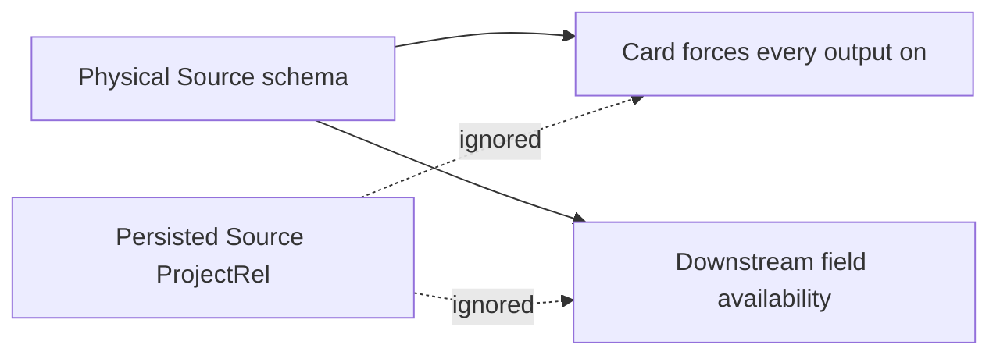
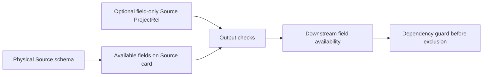

# Canvas Source Output Projection Plan

## Product Boundary

A Source owns its physical identity and discovered schema. It may reduce and order the fields it exposes through
an optional field-only `ProjectRel`. Functions, casts, aliases, grouping and other algebra remain owned
by Transform.

- Without an explicit Source projection, every physical field is exposed.
- Excluding a field keeps it visible on the Source card with its output control off.
- Downstream availability derives from the exposed Source fields.
- A field required by a connected semantic document cannot be excluded; rejection writes no state.
- The existing `ConfigureCanvasDvtNode` command rail owns the mutation.

## Current And Target

## Implementation Rationale

The persisted Source `ProjectRel` is the surviving semantic authority. The presentation projection
must combine its selected outputs with the physical schema so excluded fields remain recoverable. The
same selected set filters downstream input availability. The output command materializes `ProjectRel`
only on the first change and preserves existing output `FieldId` values on later changes.

Direct downstream projections are inspected before exclusion. If a field contributes to an output, or
if the connected semantic shape cannot prove that the field is unused, the command rejects atomically.
No edge-local field state or UI-only selection state is introduced.

## Rail And Proof

| Intent                          | Rail                     | Owner                                  | Negative proof                                                     |
| ------------------------------- | ------------------------ | -------------------------------------- | ------------------------------------------------------------------ |
| Select and order Source outputs | `ConfigureCanvasDvtNode` | `metadata.transformAuthoring.semantic` | read-only, last output and required fields reject without mutation |
| Reload selection                | `GetWorkspaceGraphDraft` | protected graph draft                  | malformed or algebraic Source documents fail closed                |

Tests cover the default all-on state, persisted exclusion, downstream filtering, dependency rejection,
re-enabling and reload identity. Browser proof uses the existing Canvas card control; no laboratory
route is part of the slice.
