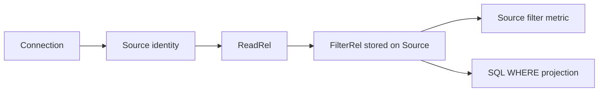
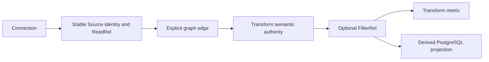

# Canvas Source Semantic Stability Correction Plan

## Think-First Analysis

### Product correction and root cause

Issue #2894 originally admitted Transform operations directly on a Source. That direction is
superseded. A Source is the stable identity of a physical origin: connection, object binding,
physical schema and provenance. A filter changes the relation and therefore belongs to an explicit
Transform downstream of the Source.

The defect is not a card-label problem. `DvtSourceAuthoringMetadata` accepted the Transform semantic
envelope, the shared Inspector rendered `DvtRelationFilterAuthoringSection` for `dvt:source`, and
card/Preview projections consumed the resulting `FilterRel`. The UI, persistence and projection
therefore agreed on the wrong ownership boundary.

### Invariants

- ADR-0064: the pinned Substrait plan plus DVT sidecar is the semantic authority for Transform
  operations; SQL is derived output only.
- ADR-0061: issue #2894 owns task state; Planning DB owns architecture state.
- `ConfigureCanvasDvtNode` remains the mutation rail and `GetWorkspaceGraphDraft` remains the reload
  rail. No Source-filter command, store or recipe is introduced.
- A Source cannot create, retain, display or execute `FilterRel`.
- Filter authoring, persistence, card summary and PostgreSQL projection remain valid for Transform.
- Source column presentation follows the physical declaration. Reordering, functions, calculated
  columns, filters, and casts belong to a connected Model / Transform.
- Legacy polluted Source envelopes normalize to their unfiltered relation without changing physical
  identity, connection, schema or provenance.
- Unsupported or malformed semantic shapes fail closed.

## Current And Target





## Selected Correction

1. Remove the filter section from Source Properties; retain it for projection-shaped Transform.
2. Normalize any Source semantic draft to its filter-free base projection on read and write.
3. Normalize persisted/local Source nodes before Canvas presentation and autosave consume them.
4. Remove relation-changing column functions, calculated columns, and reordering from Source.
5. Restrict the compact filter metric to Transform cards.
6. Replace the obsolete Source-filter end-to-end story with a Source/Transform boundary story.
7. Keep the generic FilterRel capability, mutation and PostgreSQL projection modules because they are
   still owned by Transform.

The correction does not auto-create a hidden Transform and does not silently move a predicate to a
different node. Removing an invalid Source filter restores the stable physical-origin relation.

## Fowler Matrix

| Scenario                             | Opportunity         | Pattern / owner                         | Rail                     | Proof                              |
| ------------------------------------ | ------------------- | --------------------------------------- | ------------------------ | ---------------------------------- |
| Source owns `FilterRel`              | Boundary drift      | stable Source / explicit Transform      | `ConfigureCanvasDvtNode` | Source draft and save strip filter |
| Card executes hidden semantics       | Hidden authority    | kind-gated semantic metric              | query projection         | Source has no filter metric        |
| UI and SQL both accept Source filter | Duplicate semantics | one Transform operation authority       | existing Preview rail    | Transform still renders `WHERE`    |
| Legacy Source contains a filter      | Divergent state     | narrow normalization at Source boundary | `GetWorkspaceGraphDraft` | identity preserved, filter removed |

## Pre-Implementation Brief

- **Mode:** Full corrective slice.
- **Baseline:** `main@2fa870712`.
- **Scope:** Source authoring boundary, Source semantic normalization, card projection, focused tests,
  Cypress behavior and architecture documentation.
- **Forbidden:** contracts capability removal, API/engine/adapter changes, new commands/stores/recipes,
  hidden Transform creation, editable SQL, node-kind changes and materialization behavior.
- **Tests:** Source has no filter UI; Source draft/save/reload cannot retain FilterRel; Source card has
  no filter metric; Transform retains filter UI, metric and SQL; physical Source identity survives
  normalization.
- **Validation:** Web focused/unit/presentation/architecture tests, Cypress, lint, typecheck,
  mechanization, governance refresh and `pnpm verify:prepush`.

## Rails And Microcommits

| Intent                                           | Rail                                                 | Owner                        | Posture |
| ------------------------------------------------ | ---------------------------------------------------- | ---------------------------- | ------- |
| Configure Source identity or Transform semantics | `ConfigureCanvasDvtNode`                             | `DvtNodeAuthoringMetadata`   | reuse   |
| Persist/reopen normalized graph                  | `SaveWorkspaceGraphDraft` / `GetWorkspaceGraphDraft` | graph draft                  | reuse   |
| Render executable SQL                            | existing Preview projection                          | Transform semantic authority | reuse   |

1. `docs(web)` supersede Source-operation parity and record the stable boundary.
2. `test(web)` establish Source/Transform ownership behavior.
3. `fix(web)` normalize Source authority and remove Source filter projections.
4. `test(web)` prove the visible Source/Transform boundary.
5. `docs(docs)` mechanization, issue reconciliation and closeout evidence.

```feature-mechanization
version: 1
featureId: CANVAS-SOURCE-SEMANTIC-OPERATIONS-2894
mechanizationStatus: implemented
noHumanDecisionsRemaining: true
implementationPlan: docs/planning/proposals/mandatory/frontend-and-ux/canvas-source-semantic-operations-plan-20260903.md
componentGuides: [docs/architecture/components/web/graph/canvas-inspector-authoring-component.md, docs/architecture/components/web/graph/canvas-workbench-command-query-catalog.md]
userStories: [https://github.com/dunay2/dvt/issues/2894, https://github.com/dunay2/dvt/issues/3084]
governingSources: [AGENTS.md, docs/adr/ADR-0061-github-mvp-task-authority-and-planning-db-architecture-boundary.md, docs/adr/ADR-0064-substrait-semantic-reference-and-bounded-logical-profile.md, docs/architecture/command-query-rail-governance.md, docs/architecture/fowler-opportunity-planning-governance.md, docs/planning/proposals/mandatory/frontend-and-ux/canvas-source-output-projection-plan-20260910.md]
domainObjects: [DvtSourceAuthoringMetadata, DvtSubstraitTransformAuthoringMetadata, DvtSubstraitSemanticDocumentV1]
fowlerSignals: [Boundary drift, Hidden authority, Duplicate semantics]
allowedImplementationSurfaces: [apps/web/src/app/views/canvas/**, apps/web/src/app/plugins/dvt/**, apps/web/src/app/plugins/graph/graphNodeColumnContracts.ts, apps/web/src/app/plugins/graph/graphNodeColumnContracts.test.ts, apps/web/cypress/e2e/canvas/**, docs/**]
forbiddenImplementationSurfaces: [packages/@dvt/contracts/**, apps/api/**, packages/@dvt/engine/**, packages/@dvt/adapter-*/**, new commands, stores, registries, recipes, SQL editors, node kinds or runtime steps]
commandQueryRails:
  - name: ConfigureCanvasDvtNode
    type: command
    status: implemented
    dddOwner: DvtNodeAuthoringMetadata
    applicationPort: Existing Canvas graph authoring handlers
    adapterSurface: Source identity fields and Transform semantic controls
    authorizationScope: Active editable workspace graph draft
    negativeTests: [Source cannot retain FilterRel, read-only has no mutation]
  - name: GetWorkspaceGraphDraft
    type: query
    status: implemented
    dddOwner: WorkspaceGraphDraftRecord
    applicationPort: Existing workspace graph query port
    adapterSurface: Canvas reload normalization and projection
    authorizationScope: Active workspace scope
    negativeTests: [legacy Source FilterRel normalizes without identity loss, malformed authority fails closed]
architectureGuards: [pnpm docs:feature-mechanization:implementation -- --feature CANVAS-SOURCE-SEMANTIC-OPERATIONS-2894]
cypressFlows: [apps/web/cypress/e2e/canvas/canvas-source-filter-authoring.cy.ts, apps/web/cypress/e2e/canvas/canvas-column-lineage-mapping.cy.ts]
completionGate: [pnpm --filter @dvt/web test:canvas:run, pnpm --filter @dvt/web test:presentation:run, pnpm --filter @dvt/web test:architecture:run, pnpm --filter @dvt/web lint, pnpm --filter @dvt/web typecheck, pnpm governance:refresh, pnpm verify:prepush]
redGreenCycles:
  - id: source-filter-boundary
    redTest: apps/web/src/app/views/canvas/DvtAuthoringFields.test.tsx
    expectedFailure: Source currently renders the shared FilterRel editor.
    patchSurfaces: [apps/web/src/app/views/canvas/DvtAuthoringFields.tsx]
    greenTest: pnpm --filter @dvt/web test:canvas:run -- DvtAuthoringFields.test.tsx
  - id: source-semantic-normalization
    redTest: apps/web/src/app/views/canvas/canvasDvtSourceSemanticAuthoring.test.ts
    expectedFailure: A legacy filtered Source remains authoritative after graph projection.
    patchSurfaces: [apps/web/src/app/views/canvas/canvasDvtSourceSemanticAuthoring.ts, apps/web/src/app/views/canvas/canvasAuthoringGraphProjection.ts]
    greenTest: pnpm --filter @dvt/web test:canvas:run -- canvasDvtSourceSemanticAuthoring.test.ts
  - id: source-card-boundary
    redTest: apps/web/src/app/plugins/dvt/dvtGraphNodeSemanticMetric.test.ts
    expectedFailure: A Source projects a Transform filter metric.
    patchSurfaces: [apps/web/src/app/plugins/dvt/dvtGraphNodeSemanticMetric.ts]
    greenTest: pnpm --filter @dvt/web test:unit:run -- dvtGraphNodeSemanticMetric.test.ts
  - id: source-output-authority
    redTest: apps/web/src/app/views/canvas/canvasColumnMappingAuthoring.test.ts
    expectedFailure: Source cannot persist a selected and ordered output subset.
    patchSurfaces: [apps/web/src/app/views/canvas/canvasDvtSourceSemanticAuthoring.ts, apps/web/src/app/views/canvas/canvasDvtSubstraitProjection.ts, apps/web/src/app/views/canvas/canvasColumnOutputAuthoring.ts]
    greenTest: pnpm --filter @dvt/web exec vitest run src/app/views/canvas/canvasColumnMappingAuthoring.test.ts
  - id: source-output-presentation
    redTest: apps/web/src/app/views/canvas/canvasNodePresentationProjection.outputSelection.test.ts
    expectedFailure: Source selection does not constrain downstream availability while retaining recoverable fields.
    patchSurfaces: [apps/web/src/app/views/canvas/canvasColumnProjectionAuthority.ts, apps/web/src/app/views/canvas/canvasNodePresentationProjection.ts, apps/web/src/app/views/canvas/useCanvasControllerReadModel.ts]
    greenTest: pnpm --filter @dvt/web exec vitest run src/app/views/canvas/canvasNodePresentationProjection.outputSelection.test.ts
  - id: source-output-serialization
    redTest: apps/web/src/app/views/canvas/useCanvasColumnOutputCommandRunner.test.tsx
    expectedFailure: Consecutive output gestures during autosave overwrite the earlier gesture.
    patchSurfaces: [apps/web/src/app/views/canvas/useCanvasColumnOutputCommandRunner.ts, apps/web/src/app/views/canvas/useCanvasEdgeAuthoringHandlers.ts]
    greenTest: pnpm --filter @dvt/web exec vitest run src/app/views/canvas/useCanvasColumnOutputCommandRunner.test.tsx
  - id: source-output-browser
    redTest: apps/web/cypress/e2e/canvas/canvas-column-lineage-mapping.cy.ts
    expectedFailure: Browser flow cannot reduce reorder persist and recover Source outputs.
    patchSurfaces: [apps/web/cypress/e2e/canvas/canvas-column-lineage-mapping.cy.ts]
    greenTest: node tools/ci/run-web-cypress-native.mjs run --browser chrome --headed --spec cypress/e2e/canvas/canvas-column-lineage-mapping.cy.ts
symbolDefaults: &symbolDefaults { dddOwner: DvtNodeAuthoringMetadata, cqRails: [ConfigureCanvasDvtNode, GetWorkspaceGraphDraft], fowlerSignals: [Boundary drift, Hidden authority], architectureGuard: pnpm docs:feature-mechanization:implementation -- --feature CANVAS-SOURCE-SEMANTIC-OPERATIONS-2894, cypressCoverage: apps/web/cypress/e2e/canvas/canvas-source-filter-authoring.cy.ts }
sourceOutputSymbolDefaults: &sourceOutputSymbolDefaults { dddOwner: DvtNodeAuthoringMetadata, cqRails: [ConfigureCanvasDvtNode, GetWorkspaceGraphDraft], fowlerSignals: [Boundary drift, Hidden authority], architectureGuard: pnpm docs:feature-mechanization:implementation -- --feature CANVAS-SOURCE-SEMANTIC-OPERATIONS-2894, cypressCoverage: apps/web/cypress/e2e/canvas/canvas-column-lineage-mapping.cy.ts }
symbols:
  - { <<: *symbolDefaults, name: DvtAuthoringFields, path: apps/web/src/app/views/canvas/DvtAuthoringFields.tsx, unitTests: [apps/web/src/app/views/canvas/DvtAuthoringFields.test.tsx] }
  - { <<: *symbolDefaults, name: createDvtSourceSemanticDraft, path: apps/web/src/app/views/canvas/canvasDvtSourceSemanticAuthoring.ts, unitTests: [apps/web/src/app/views/canvas/canvasDvtSourceSemanticAuthoring.test.ts] }
  - { <<: *symbolDefaults, name: applyDvtSourceSemanticDraft, path: apps/web/src/app/views/canvas/canvasDvtSourceSemanticAuthoring.ts, unitTests: [apps/web/src/app/views/canvas/canvasDvtSourceSemanticAuthoring.test.ts] }
  - { <<: *symbolDefaults, name: normalizeDvtSourceFilterAuthority, path: apps/web/src/app/views/canvas/canvasDvtSourceSemanticAuthoring.ts, unitTests: [apps/web/src/app/views/canvas/canvasDvtSourceSemanticAuthoring.test.ts] }
  - { <<: *symbolDefaults, name: reconcileDvtSourceSemanticColumnOrder, path: apps/web/src/app/views/canvas/canvasDvtSourceSemanticAuthoring.ts, unitTests: [apps/web/src/app/views/canvas/canvasDvtSourceSemanticAuthoring.test.ts] }
  - { <<: *symbolDefaults, name: buildDvtGraphNodeSemanticMetric, path: apps/web/src/app/plugins/dvt/dvtGraphNodeSemanticMetric.ts, unitTests: [apps/web/src/app/plugins/dvt/dvtGraphNodeSemanticMetric.test.ts] }
  - { <<: *symbolDefaults, name: card, path: apps/web/cypress/e2e/canvas/canvas-source-filter-authoring.cy.ts, unitTests: [apps/web/cypress/e2e/canvas/canvas-source-filter-authoring.cy.ts] }
  - { <<: *symbolDefaults, name: latestFilter, path: apps/web/cypress/e2e/canvas/canvas-source-filter-authoring.cy.ts, unitTests: [apps/web/cypress/e2e/canvas/canvas-source-filter-authoring.cy.ts] }
  - { <<: *symbolDefaults, name: openColumns, path: apps/web/cypress/e2e/canvas/canvas-source-filter-authoring.cy.ts, unitTests: [apps/web/cypress/e2e/canvas/canvas-source-filter-authoring.cy.ts] }
  - { <<: *sourceOutputSymbolDefaults, name: expectApiCallCount, path: apps/web/cypress/e2e/canvas/canvas-column-lineage-mapping.cy.ts, unitTests: [apps/web/cypress/e2e/canvas/canvas-column-lineage-mapping.cy.ts] }
  - { <<: *sourceOutputSymbolDefaults, name: projectionOutputUsesSourceField, path: apps/web/src/app/views/canvas/canvasColumnOutputAuthoring.ts, unitTests: [apps/web/src/app/views/canvas/canvasColumnMappingAuthoring.test.ts] }
  - { <<: *sourceOutputSymbolDefaults, name: scalarExpressionUsesSourceField, path: apps/web/src/app/views/canvas/canvasColumnOutputAuthoring.ts, unitTests: [apps/web/src/app/views/canvas/canvasColumnMappingAuthoring.test.ts] }
  - { <<: *sourceOutputSymbolDefaults, name: sourceOutputIsRequired, path: apps/web/src/app/views/canvas/canvasColumnOutputAuthoring.ts, unitTests: [apps/web/src/app/views/canvas/canvasColumnMappingAuthoring.test.ts] }
  - { <<: *sourceOutputSymbolDefaults, name: DvtSourceOutputMutation, path: apps/web/src/app/views/canvas/canvasDvtSourceSemanticAuthoring.ts, unitTests: [apps/web/src/app/views/canvas/canvasDvtSourceSemanticAuthoring.test.ts] }
  - { <<: *sourceOutputSymbolDefaults, name: DvtSourceOutputProjection, path: apps/web/src/app/views/canvas/canvasDvtSourceSemanticAuthoring.ts, unitTests: [apps/web/src/app/views/canvas/canvasDvtSourceSemanticAuthoring.test.ts] }
  - { <<: *sourceOutputSymbolDefaults, name: defaultOutputs, path: apps/web/src/app/views/canvas/canvasDvtSourceSemanticAuthoring.ts, unitTests: [apps/web/src/app/views/canvas/canvasDvtSourceSemanticAuthoring.test.ts] }
  - { <<: *sourceOutputSymbolDefaults, name: isDirectSourceOutput, path: apps/web/src/app/views/canvas/canvasDvtSourceSemanticAuthoring.ts, unitTests: [apps/web/src/app/views/canvas/canvasDvtSourceSemanticAuthoring.test.ts] }
  - { <<: *sourceOutputSymbolDefaults, name: isDvtSourceOutputProjectionNode, path: apps/web/src/app/views/canvas/canvasDvtSourceSemanticAuthoring.ts, unitTests: [apps/web/src/app/views/canvas/canvasDvtSourceSemanticAuthoring.test.ts] }
  - { <<: *sourceOutputSymbolDefaults, name: readDvtSourceOutputProjection, path: apps/web/src/app/views/canvas/canvasDvtSourceSemanticAuthoring.ts, unitTests: [apps/web/src/app/views/canvas/canvasDvtSourceSemanticAuthoring.test.ts] }
  - { <<: *sourceOutputSymbolDefaults, name: rebuildSourceProjection, path: apps/web/src/app/views/canvas/canvasDvtSourceSemanticAuthoring.ts, unitTests: [apps/web/src/app/views/canvas/canvasDvtSourceSemanticAuthoring.test.ts] }
  - { <<: *sourceOutputSymbolDefaults, name: reorderDvtSourceOutputs, path: apps/web/src/app/views/canvas/canvasDvtSourceSemanticAuthoring.ts, unitTests: [apps/web/src/app/views/canvas/canvasDvtSourceSemanticAuthoring.test.ts] }
  - { <<: *sourceOutputSymbolDefaults, name: sameFieldSignature, path: apps/web/src/app/views/canvas/canvasDvtSourceSemanticAuthoring.ts, unitTests: [apps/web/src/app/views/canvas/canvasDvtSourceSemanticAuthoring.test.ts] }
  - { <<: *sourceOutputSymbolDefaults, name: sameSourceIdentity, path: apps/web/src/app/views/canvas/canvasDvtSourceSemanticAuthoring.ts, unitTests: [apps/web/src/app/views/canvas/canvasDvtSourceSemanticAuthoring.test.ts] }
  - { <<: *sourceOutputSymbolDefaults, name: setDvtSourceOutputIncluded, path: apps/web/src/app/views/canvas/canvasDvtSourceSemanticAuthoring.ts, unitTests: [apps/web/src/app/views/canvas/canvasDvtSourceSemanticAuthoring.test.ts] }
  - { <<: *sourceOutputSymbolDefaults, name: canonicalizeDvtSubstraitProjectionDataType, path: apps/web/src/app/views/canvas/canvasDvtSubstraitProjection.ts, unitTests: [apps/web/src/app/views/canvas/canvasDvtSourceSemanticAuthoring.test.ts] }
  - { <<: *sourceOutputSymbolDefaults, name: CanvasColumnOutputCommandRunner, path: apps/web/src/app/views/canvas/useCanvasColumnOutputCommandRunner.ts, unitTests: [apps/web/src/app/views/canvas/useCanvasColumnOutputCommandRunner.test.tsx] }
  - { <<: *sourceOutputSymbolDefaults, name: CanvasColumnOutputCommandRunnerEffects, path: apps/web/src/app/views/canvas/useCanvasColumnOutputCommandRunner.ts, unitTests: [apps/web/src/app/views/canvas/useCanvasColumnOutputCommandRunner.test.tsx] }
  - { <<: *sourceOutputSymbolDefaults, name: CanvasColumnOutputCommandRunnerState, path: apps/web/src/app/views/canvas/useCanvasColumnOutputCommandRunner.ts, unitTests: [apps/web/src/app/views/canvas/useCanvasColumnOutputCommandRunner.test.tsx] }
  - { <<: *sourceOutputSymbolDefaults, name: UseCanvasColumnOutputCommandRunnerArgs, path: apps/web/src/app/views/canvas/useCanvasColumnOutputCommandRunner.ts, unitTests: [apps/web/src/app/views/canvas/useCanvasColumnOutputCommandRunner.test.tsx] }
  - { <<: *sourceOutputSymbolDefaults, name: applyReorderOutput, path: apps/web/src/app/views/canvas/useCanvasColumnOutputCommandRunner.ts, unitTests: [apps/web/src/app/views/canvas/useCanvasColumnOutputCommandRunner.test.tsx] }
  - { <<: *sourceOutputSymbolDefaults, name: applyToggleOutput, path: apps/web/src/app/views/canvas/useCanvasColumnOutputCommandRunner.ts, unitTests: [apps/web/src/app/views/canvas/useCanvasColumnOutputCommandRunner.test.tsx] }
  - { <<: *sourceOutputSymbolDefaults, name: useCanvasColumnOutputCommandRunner, path: apps/web/src/app/views/canvas/useCanvasColumnOutputCommandRunner.ts, unitTests: [apps/web/src/app/views/canvas/useCanvasColumnOutputCommandRunner.test.tsx] }
  - { <<: *sourceOutputSymbolDefaults, name: useCanvasColumnMappingHandlers, path: apps/web/src/app/views/canvas/useCanvasEdgeAuthoringHandlers.ts, unitTests: [apps/web/src/app/views/canvas/useCanvasGraphHandlers.edgeAuthoring.test.tsx] }
  - { <<: *sourceOutputSymbolDefaults, name: stubColumnMappingCanvas, path: apps/web/cypress/e2e/canvas/canvas-column-lineage-mapping.cy.ts, unitTests: [apps/web/cypress/e2e/canvas/canvas-column-lineage-mapping.cy.ts] }
```
