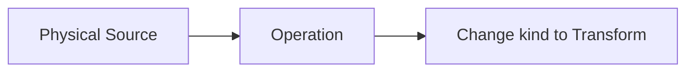
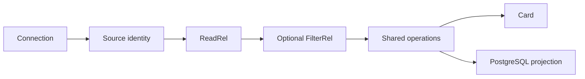

# Canvas Source Semantic Operations Plan

## Think-First Analysis

### Problem and root cause

A connection-backed Source cannot own the canonical relational operations available to a
Transform. The calculated-column path hides that limit by changing Source to `dvt:transform`,
losing the visible Source role. The cause is a node-kind restriction around the existing
Substrait authority, not a missing filter DSL. `FilterRel` is already a standard candidate;
`equal`, string literal and string type are admitted.

### Invariants

- ADR-0064: the pinned Substrait plan plus DVT sidecar is the sole semantic authority.
- ADR-0035: planner-contract changes retain planner sponsorship and compatibility review.
- ADR-0061: Issue #2894 owns task state; Planning DB owns architecture state.
- `ConfigureCanvasDvtNode` mutates semantics; `GetWorkspaceGraphDraft` owns reload.
- Source identity, connection, table binding and raw-field provenance survive operations.
- Semantic admission, visual exposure and PostgreSQL projection are separate claims.
- Unsupported shape, field, type, provider or stale identity fails closed.

### Options

1. Source filter model: rejected; duplicates Substrait and the existing command.
2. Promote Source to Transform: rejected; erases the product identity being edited.
3. Hidden Transform: rejected; creates invisible graph authority.
4. Selected: Source retains physical identity and carries the same optional semantic envelope;
   one shared operation editor serves Source and Transform.

No library is added; the pinned protobufs, capability catalog and PostgreSQL AST/deparser cover
the bounded shape.

## Current And Target





## First Slice

One PostgreSQL Source can add, edit and remove `text_field = string_literal`. The UI derives
the operation from its canonical capability ID, binds a stable sidecar FieldId, and uses the
existing Apply/Cancel lifecycle. Reload, card summary and PostgreSQL use the same revision.
Other predicates and broader operation parity remain in #2894.

## Implemented Increment

The first bounded slice now admits one PostgreSQL text equality `FilterRel`, exposes the same
filter editor on Source and Transform, persists the semantic document through the existing
graph-draft command, restores it after reload, projects deterministic PostgreSQL, and shows a
compact card summary. Source kind, imported connection authority and physical provenance remain
unchanged. The visible local stack and the focused Cypress flow both proved apply, reload and
remove.

Issue #2894 remains open for ordered filters, field projection parity, broader relational
operations, and terminal materialization. Raw Source sampling is not presented as execution of
the semantic recipe; that integration remains part of the Preview/materialization sequence.

## Fowler Matrix

| Scenario                 | Opportunity         | Pattern / owner                               | Rail                     | Proof                        | Deferred              |
| ------------------------ | ------------------- | --------------------------------------------- | ------------------------ | ---------------------------- | --------------------- |
| Source changes kind      | Boundary drift      | capability-bearing `DvtNodeAuthoringMetadata` | `ConfigureCanvasDvtNode` | kind/identity roundtrip      | materialization       |
| Filter is only candidate | Hidden authority    | explicit catalog admission                    | `ConfigureCanvasDvtNode` | incomplete admission rejects | other predicates      |
| Two possible forms       | Duplicate semantics | shared operation view                         | `ConfigureCanvasDvtNode` | Source/Transform use one API | generic form          |
| Positional field         | Primitive obsession | stable DVT FieldId                            | `GetWorkspaceGraphDraft` | stale/cross-source rejects   | arbitrary expressions |
| Target inference         | Boundary drift      | PostgreSQL projection                         | Preview rail             | exact SQL/malformed reject   | new Preview rail      |

## Pre-Implementation Brief

- **Mode:** Full.
- **Baseline:** `main@425045636`.
- **Scope:** Filter capability admission; Source semantic persistence; shared filter mutation,
  Inspector and card/SQL projections; focused tests; ARC-2 evidence/risk.
- **Forbidden:** API, engine, adapter, runtime step, dbt, SQL editor, node kind, compatibility
  fallback, duplicate recipe/catalog/store, and materialization behavior.
- **Risk/mitigation:** preserve Source metadata and kind; inspect an exact shape; derive from the
  catalog; prove canonical roundtrip and negative target behavior.
- **Tests:** admission; add/edit/remove; invalid identity/type/capability; reload; Apply/Cancel;
  read-only; card summary; PostgreSQL SQL; architecture guard; visible browser.
- **Validation:** Contracts/Web tests, lint, typecheck, ARC-2, mechanization, governance refresh,
  and `pnpm verify:prepush`.

## Rails And Microcommits

| Intent                 | Rail                                                 | Owner                      | Posture |
| ---------------------- | ---------------------------------------------------- | -------------------------- | ------- |
| Apply/remove operation | `ConfigureCanvasDvtNode`                             | `DvtNodeAuthoringMetadata` | reuse   |
| Persist/reopen         | `SaveWorkspaceGraphDraft` / `GetWorkspaceGraphDraft` | graph draft                | reuse   |
| Render SQL             | existing Preview projection                          | planner/runtime admission  | reuse   |

1. `docs(docs)` design and mechanization.
2. `feat(contracts)` bounded Filter admission and ARC-2 evidence.
3. `feat(web)` Source semantic authority without kind change.
4. `feat(web)` shared filter behavior and projections.
5. `refactor(web)` delete obsolete Source promotion.
6. `docs(docs)` evidence, risk, closeout and issue reconciliation.

```feature-mechanization
version: 1
featureId: CANVAS-SOURCE-SEMANTIC-OPERATIONS-2894
mechanizationStatus: implemented
noHumanDecisionsRemaining: true
implementationPlan: docs/planning/proposals/mandatory/frontend-and-ux/canvas-source-semantic-operations-plan-20260903.md
componentGuides: [docs/architecture/components/web/graph/canvas-inspector-authoring-component.md, docs/architecture/components/web/graph/canvas-workbench-command-query-catalog.md]
userStories: [https://github.com/dunay2/dvt/issues/2894]
governingSources: [AGENTS.md, docs/adr/ADR-0035-planner-public-contract-evolution-protocol.md, docs/adr/ADR-0061-github-mvp-task-authority-and-planning-db-architecture-boundary.md, docs/adr/ADR-0064-substrait-semantic-reference-and-bounded-logical-profile.md, docs/architecture/command-query-rail-governance.md, docs/architecture/fowler-opportunity-planning-governance.md]
domainObjects: [DvtNodeAuthoringMetadata, DvtSubstraitCapabilityCatalogV1, DvtSubstraitSemanticDocumentV1]
fowlerSignals: [Boundary drift, Hidden authority, Duplicate semantics, Primitive obsession]
allowedImplementationSurfaces: [packages/@dvt/contracts/src/contracts/planner/**, packages/@dvt/contracts/test/**, apps/web/src/app/views/canvas/**, apps/web/src/app/plugins/graph/**, apps/web/cypress/e2e/canvas/**, docs/**]
forbiddenImplementationSurfaces: [apps/api/**, packages/@dvt/engine/**, packages/@dvt/adapter-*/**, new commands, stores, registries, recipes, SQL editors, node kinds or runtime steps]
commandQueryRails:
  - name: ConfigureCanvasDvtNode
    type: command
    status: implemented
    dddOwner: DvtNodeAuthoringMetadata
    applicationPort: Existing Canvas graph authoring handlers
    adapterSurface: Shared Source/Transform Inspector and card gestures
    authorizationScope: Active editable workspace graph draft
    negativeTests: [unsupported capability/provider/type/field rejects, read-only has no mutation]
  - name: GetWorkspaceGraphDraft
    type: query
    status: implemented
    dddOwner: WorkspaceGraphDraftRecord
    applicationPort: Existing workspace graph query port
    adapterSurface: Canvas reload projection
    authorizationScope: Active workspace scope
    negativeTests: [malformed semantic authority fails closed]
architectureGuards: [pnpm docs:feature-mechanization:implementation -- --feature CANVAS-SOURCE-SEMANTIC-OPERATIONS-2894]
cypressFlows: [apps/web/cypress/e2e/canvas/canvas-source-filter-authoring.cy.ts]
completionGate: [pnpm --filter @dvt/contracts test, pnpm --filter @dvt/contracts typecheck, pnpm --filter @dvt/web test:unit:run, pnpm --filter @dvt/web test:presentation:run, pnpm --filter @dvt/web test:architecture:run, pnpm --filter @dvt/web lint, pnpm --filter @dvt/web typecheck, pnpm governance:refresh, pnpm verify:prepush]
redGreenCycles:
  - id: filter-capability-admission
    redTest: packages/@dvt/contracts/test/dvt-substrait-capability-catalog.contract.test.ts
    expectedFailure: FilterRel lacks complete admission evidence.
    patchSurfaces: [packages/@dvt/contracts/src/contracts/planner/**, packages/@dvt/contracts/test/**]
    greenTest: pnpm --filter @dvt/contracts test -- dvt-substrait-capability-catalog
  - id: source-semantic-authority
    redTest: apps/web/src/app/views/canvas/canvasDvtTransformAuthoringAuthority.test.ts
    expectedFailure: authority rejects Source or changes its kind.
    patchSurfaces: [apps/web/src/app/views/canvas/**]
    greenTest: pnpm --filter @dvt/web test:canvas:run -- canvasDvtTransformAuthoringAuthority.test.ts
  - id: source-filter-authoring
    redTest: apps/web/src/app/views/canvas/canvasDvtSubstraitFilter.test.ts
    expectedFailure: strict FilterRel mutation/inspection/removal is absent.
    patchSurfaces: [apps/web/src/app/views/canvas/**, apps/web/src/app/plugins/graph/**]
    greenTest: pnpm --filter @dvt/web test:canvas:run -- canvasDvtSubstraitFilter.test.ts
symbols:
  - name: dvtSubstraitTextEquality
    path: apps/web/src/app/views/canvas/canvasDvtSubstraitTextEquality.ts
    dddOwner: Substrait equality expression
    cqRails: [ConfigureCanvasDvtNode]
    fowlerSignals: [Duplicate semantics]
    architectureGuard: pnpm docs:feature-mechanization:implementation -- --feature CANVAS-SOURCE-SEMANTIC-OPERATIONS-2894
    cypressCoverage: apps/web/cypress/e2e/canvas/canvas-source-filter-authoring.cy.ts
    unitTests: [apps/web/src/app/views/canvas/canvasDvtSubstraitFilter.test.ts]
  - &filter
    name: DvtSubstraitFilter
    path: apps/web/src/app/views/canvas/canvasDvtSubstraitFilter.ts
    dddOwner: DvtSubstraitSemanticDocumentV1
    cqRails: [ConfigureCanvasDvtNode, GetWorkspaceGraphDraft]
    fowlerSignals: [Primitive obsession, Hidden authority]
    architectureGuard: pnpm docs:feature-mechanization:implementation -- --feature CANVAS-SOURCE-SEMANTIC-OPERATIONS-2894
    cypressCoverage: apps/web/cypress/e2e/canvas/canvas-source-filter-authoring.cy.ts
    unitTests: [apps/web/src/app/views/canvas/canvasDvtSubstraitFilter.test.ts]
  - { <<: *filter, name: resolveDvtSubstraitFilterCapabilities }
  - { <<: *filter, name: applyDvtSubstraitFilter }
  - { <<: *filter, name: inspectDvtSubstraitFilter }
  - { <<: *filter, name: removeDvtSubstraitFilter }
  - name: DvtRelationFilterAuthoringSection
    path: apps/web/src/app/views/canvas/DvtRelationFilterAuthoringSection.tsx
    dddOwner: Canvas relation-operation presentation
    cqRails: [ConfigureCanvasDvtNode]
    fowlerSignals: [Duplicate semantics]
    architectureGuard: pnpm docs:feature-mechanization:implementation -- --feature CANVAS-SOURCE-SEMANTIC-OPERATIONS-2894
    cypressCoverage: apps/web/cypress/e2e/canvas/canvas-source-filter-authoring.cy.ts
    unitTests: [apps/web/src/app/views/canvas/DvtAuthoringFields.test.tsx]
```
