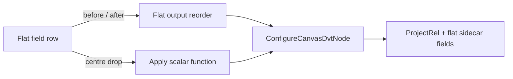
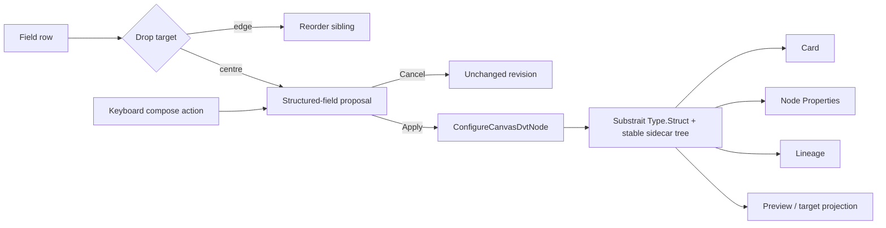
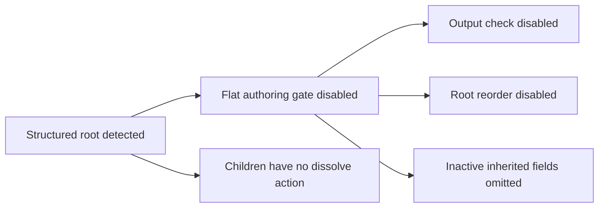
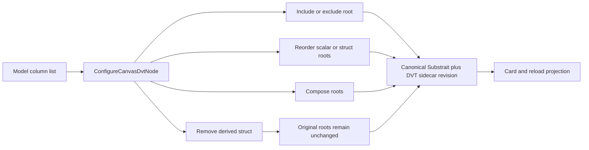

# Canvas Structured Transform Fields Plan

## Intent

Issue #2771 turns a centre drop between two Transform fields into an explicit
proposal for a real Substrait `Type.Struct`. Apply persists the parent and its
ordered children in the existing semantic document; Cancel changes nothing.
The same proposal and command are available from pointer and keyboard paths.

## Current State



The centre target currently means only “apply one admitted scalar function to
another output”. The canonical plan and sidecar have no parent-child field
binding, so presenting a visual group as a composite would create a second
semantic model.

## Target State



## Regression Recovery #3046

The delivered semantic mutation remains authoritative. The regression is in the
interactive projection: a column pointer event can reach the node context menu,
and structured-child append/reorder exists without a clear column-owned entry.

- A column always owns its pointer and keyboard context-menu request, including
  when no scalar function is compatible.
- The column surface exposes truthful unavailable state instead of falling back
  to node actions.
- An existing structured output keeps append and child reorder on
  `ConfigureCanvasDvtNode`; no second tree or menu model is introduced.
- Tests must compose the column surface inside the real node shell so nested
  context-menu ownership is proven rather than inferred from isolated tests.

## Complete Structured Lifecycle Recovery #3054

The hard cut left structured projections with only part of the column command
surface. Detecting one structured root currently disables output selection and
top-level reorder, omits inactive inherited fields, and provides no inverse for
composition.



The repair keeps one command and one authority:



- Composition appends a derived struct and never consumes its input roots.
- Removing the group deletes only that derived root; the original outputs remain unchanged.
- Inactive inherited fields remain visible with `output: false` and can re-enter
  the projection through the existing output-selection command.
- Scalar and structured roots share the existing pointer and keyboard reorder
  command; structure never disables the whole list.
- Integrated read-model and browser tests must traverse the real gates rather
  than inject callbacks directly into a presentation component.

## Product And Architecture Decisions

- Admit the pinned core identity `substrait.Type kind.struct` through the
  standard-first capability catalog before exposing the command.
- Keep `ConfigureCanvasDvtNode` as the only mutation rail and the typed
  Substrait semantic document as the only persisted authority.
- Extend field bindings with an optional parent identity; absence means a root
  field. Sibling `outputOrdinal` is scoped to the parent.
- A scalar-on-scalar centre drop opens a proposal. It never mutates or silently
  converts either field before Apply.
- Apply creates one new parent identity and retains both child identities,
  types, nullability, provenance and order. Dropping into an existing struct
  retains the parent identity and inserts the child at the selected position.
- Remove grouping is the inverse command: it removes only the derived struct
  because composition leaves the original outputs unchanged.
- Self-nesting, ancestry cycles, duplicate identities, incompatible shapes,
  unknown fields, stale revisions and unsupported projections fail closed.
- PostgreSQL exposure remains unavailable until a governed row/composite
  projection is implemented and tested; the UI must show that posture rather
  than fabricate JSON semantics.

## Fowler Opportunity Matrix

| Scenario                               | Signal                 | Refactoring                           | Owner               | Evidence                  |
| -------------------------------------- | ---------------------- | ------------------------------------- | ------------------- | ------------------------- |
| Centre drop has function-only meaning  | Divergent change       | Replace conditional with typed intent | Field interaction   | pointer/keyboard behavior |
| Flat sidecar cannot represent children | Primitive obsession    | Introduce value object                | Semantic document   | encode/reload tests       |
| Card could own a private tree          | Hidden authority       | Projection from aggregate             | Canvas presentation | cross-view agreement      |
| PostgreSQL has no composite mapping    | Speculative generality | Fail closed                           | Target projection   | negative projection test  |
| Struct detection disables root actions | Feature envy           | Move policy to canonical command      | Canvas read model   | integrated gate test      |
| Composition consumes input roots       | Destructive update     | Append derived output                 | Semantic document   | compose/reload test       |
| Derived struct has no inverse          | Incomplete lifecycle   | Add inverse aggregate operation       | Semantic document   | removal/reload test       |
| Inactive inputs disappear with structs | Divergent change       | Reuse stable-order projection         | Canvas presentation | mixed projection test     |

## Delivery Boundaries

- Mode: Full vertical slice.
- No private JSON packing, UI-only groups, SQL record convention, parallel
  command, compatibility alias, hidden node, placeholder or provider claim.
- Refactors of `GraphNodeRenderer`, `DbtNodeRenderer`, legacy event dispatch,
  copy extraction and broad `Record<string, unknown>` replacement remain
  separate increments unless directly required by this behavior.
- Keep each changed production module focused and below 200 lines; split by
  semantic responsibility rather than by arbitrary line count.

```feature-mechanization
version: 1
featureId: CANVAS-STRUCTURED-TRANSFORM-FIELDS-2771
mechanizationStatus: implemented
noHumanDecisionsRemaining: true
implementationPlan: docs/planning/proposals/mandatory/frontend-and-ux/canvas-structured-transform-fields-plan-20260903.md
componentGuides:
  - docs/architecture/components/web/graph/canvas-authoring-draft-boundary-component.md
  - docs/architecture/components/web/graph/canvas-workbench-command-query-catalog.md
userStories:
  - https://github.com/dunay2/dvt/issues/2771
  - https://github.com/dunay2/dvt/issues/3046  - https://github.com/dunay2/dvt/issues/3054
governingSources:
  - AGENTS.md
  - docs/planning/status/governance-document-rule-inventory.md
  - docs/guides/ai-work-protocol.md
  - docs/architecture/command-query-rail-governance.md
  - docs/architecture/fowler-opportunity-planning-governance.md
  - docs/adr/ADR-0064-substrait-semantic-reference-and-bounded-logical-profile.md
  - docs/planning/proposals/mandatory/runtime-and-contracts/vtx2-substrait-semantic-reference-design-20260824.md
allowedImplementationSurfaces:
  - packages/@dvt/contracts/src/contracts/planner/**
  - packages/@dvt/contracts/test/**
  - apps/web/src/app/plugins/graph/**
  - apps/web/src/app/plugins/contracts/NodeRendering.ts
  - apps/web/src/app/components/canvas/**
  - apps/web/src/app/components/inspector/**
  - apps/web/src/app/components/SourceImportWizard.test.tsx
  - apps/web/src/app/views/canvas/**
  - apps/web/cypress/e2e/canvas/**
  - docs/architecture/components/web/graph/canvas-workbench-command-query-catalog.md
  - docs/planning/proposals/mandatory/frontend-and-ux/canvas-structured-transform-fields-plan-20260903.md
  - docs/evidence/**
  - docs/risk-register/quality/**
  - docs/.manifest.json
  - docs/**/index.md
  - docs/planning/status/**
  - docs/guides/ai-work-protocol.md
  - traceability.manifest.json
forbiddenImplementationSurfaces:
  - packages/@dvt/engine/**
  - packages/@dvt/adapter-*/**
  - apps/api/**
commandQueryRails:
  - name: ConfigureCanvasDvtNode
    type: command
    dddOwner: DvtNodeAuthoringMetadata
domainObjects:
  - name: CanvasStructuredFieldProposal
    type: value object
    owner: apps/web Canvas authoring
  - name: DvtSubstraitFieldBindingV1
    type: value object
    owner: packages/@dvt/contracts
  - name: DvtSubstraitProjectionDraft
    type: aggregate state
    owner: typed Substrait Plan plus DVT sidecar
fowlerSignals:
  - Divergent change
  - Hidden authority
  - Primitive obsession
  - Speculative generality
architectureGuards:
  - pnpm docs:feature-mechanization:implementation -- --feature CANVAS-STRUCTURED-TRANSFORM-FIELDS-2771
cypressFlows:
  - apps/web/cypress/e2e/canvas/canvas-structured-transform-fields.cy.ts
completionGate:
  - pnpm docs:feature-mechanization -- --feature CANVAS-STRUCTURED-TRANSFORM-FIELDS-2771
  - pnpm docs:feature-mechanization:implementation -- --feature CANVAS-STRUCTURED-TRANSFORM-FIELDS-2771
  - pnpm --filter @dvt/contracts test
  - pnpm --filter @dvt/contracts typecheck
  - pnpm --filter @dvt/web test:unit:run
  - pnpm --filter @dvt/web test:presentation:run
  - pnpm --filter @dvt/web test:architecture:run
  - pnpm --filter @dvt/web test:e2e:native -- --spec cypress/e2e/canvas/canvas-structured-transform-fields.cy.ts
  - pnpm verify:prepush
redGreenCycles:
  - id: complete-structured-column-lifecycle-regression
    redTest: pnpm --filter @dvt/web test:canvas:run -- useCanvasControllerReadModel.test.tsx canvasNodePresentationProjection.test.ts
    expectedFailure: A structured Model disables root output selection and reorder or hides inactive inherited fields.
    patchSurfaces:
      - apps/web/src/app/views/canvas/useCanvasControllerReadModel.ts
      - apps/web/src/app/views/canvas/canvasNodePresentationProjection.ts
      - apps/web/src/app/views/canvas/canvasColumnOutputAuthoring.ts
    greenTest: pnpm --filter @dvt/web test:canvas:run -- useCanvasControllerReadModel.test.tsx canvasNodePresentationProjection.test.ts
  - id: preserve-inputs-and-remove-structured-output
    redTest: pnpm --filter @dvt/web test:canvas:run -- canvasDvtSubstraitStructuredFieldRemove.test.ts canvasStructuredFieldAuthoring.test.ts
    expectedFailure: Composition consumes its input roots and ConfigureCanvasDvtNode cannot remove only the derived struct.
    patchSurfaces:
      - apps/web/src/app/views/canvas/canvasDvtSubstraitStructuredFieldRemove.ts
      - apps/web/src/app/views/canvas/canvasStructuredFieldAuthoring.ts
      - apps/web/src/app/plugins/graph/GraphNodeColumn*.tsx
    greenTest: pnpm --filter @dvt/web test:canvas:run -- canvasDvtSubstraitStructuredFieldRemove.test.ts canvasStructuredFieldAuthoring.test.ts
  - id: column-context-ownership-regression
    redTest: pnpm --filter @dvt/web test:presentation:run -- GraphNodeColumnSection.contextMenuOwnership.test.tsx
    expectedFailure: A column context-menu event reaches the surrounding node trigger or provides no truthful column surface.
    patchSurfaces:
      - apps/web/src/app/plugins/graph/GraphNodeColumn*.tsx
      - apps/web/src/app/components/canvas/CanvasNodeShell*.tsx
    greenTest: pnpm --filter @dvt/web test:presentation:run -- GraphNodeColumnSection.contextMenuOwnership.test.tsx
  - id: admitted-structured-capability
    redTest: pnpm --filter @dvt/contracts test -- dvt-substrait-struct-capability.contract.test.ts
    expectedFailure: The pinned standard-first catalog rejects kind.struct and nested expressions.
    patchSurfaces:
      - packages/@dvt/contracts/src/contracts/planner/**
      - packages/@dvt/contracts/test/dvt-substrait-struct-capability.contract.test.ts
    greenTest: pnpm --filter @dvt/contracts test -- dvt-substrait-struct-capability.contract.test.ts
  - id: canonical-structured-field-mutation
    redTest: pnpm --filter @dvt/web test:canvas:run -- canvasDvtSubstraitStructuredField.test.ts canvasStructuredFieldAuthoring.test.ts
    expectedFailure: ConfigureCanvasDvtNode cannot create, extend, reload or reject a structured output canonically.
    patchSurfaces:
      - apps/web/src/app/views/canvas/canvasDvtSubstraitStructuredField*.ts
      - apps/web/src/app/views/canvas/canvasStructuredFieldAuthoring*.ts
    greenTest: pnpm --filter @dvt/web test:canvas:run -- canvasDvtSubstraitStructuredField.test.ts canvasStructuredFieldAuthoring.test.ts
  - id: explicit-pointer-keyboard-proposal
    redTest: pnpm --filter @dvt/web test:presentation:run -- GraphNodeColumnSection.structuredComposition.test.tsx
    expectedFailure: Centre drop and accessible keyboard composition do not share an explicit proposal and Apply boundary.
    patchSurfaces:
      - apps/web/src/app/plugins/graph/GraphNodeColumn*.tsx
      - apps/web/src/app/plugins/graph/GraphNodeStructuredFieldForm.tsx
    greenTest: pnpm --filter @dvt/web test:presentation:run -- GraphNodeColumnSection.structuredComposition.test.tsx
  - id: nested-reorder-autosave-reload
    redTest: pnpm --filter @dvt/web test:e2e:native -- --spec cypress/e2e/canvas/canvas-structured-transform-fields.cy.ts
    expectedFailure: Nested reorder is intercepted by the parent and local replacement nodes are omitted from autosave.
    patchSurfaces:
      - apps/web/src/app/plugins/graph/GraphNodeColumnChildren.tsx
      - apps/web/src/app/views/canvas/canvasDraftLifecycleSnapshot.ts
      - apps/web/src/app/views/canvas/canvasDvtSubstraitStructuredFieldReorder.ts
      - apps/web/cypress/e2e/canvas/canvas-structured-transform-fields.cy.ts
    greenTest: pnpm --filter @dvt/web test:e2e:native -- --spec cypress/e2e/canvas/canvas-structured-transform-fields.cy.ts
symbols:
  - { name: appendDvtSubstraitSourceFieldRoot, path: apps/web/src/app/views/canvas/canvasDvtSubstraitStructuredFieldAppend.ts, dddOwner: DvtSubstraitProjectionDraft, cqRails: [ConfigureCanvasDvtNode], fowlerSignals: [Extract Function], architectureGuard: pnpm docs:feature-mechanization:implementation, cypressCoverage: apps/web/cypress/e2e/canvas/canvas-structured-transform-fields.cy.ts, unitTests: [pnpm --filter @dvt/web test:canvas:run] }
  - { name: removeDvtSubstraitProjectionRoot, path: apps/web/src/app/views/canvas/canvasDvtSubstraitStructuredFieldRemove.ts, dddOwner: DvtSubstraitProjectionDraft, cqRails: [ConfigureCanvasDvtNode], fowlerSignals: [Extract Function], architectureGuard: pnpm docs:feature-mechanization:implementation, cypressCoverage: apps/web/cypress/e2e/canvas/canvas-structured-transform-fields.cy.ts, unitTests: [pnpm --filter @dvt/web test:canvas:run] }
  - { name: reorderCanvasStructuredFieldRoots, path: apps/web/src/app/views/canvas/canvasStructuredFieldRootAuthoring.ts, dddOwner: DvtSubstraitProjectionDraft, cqRails: [ConfigureCanvasDvtNode], fowlerSignals: [Move Function], architectureGuard: pnpm docs:feature-mechanization:implementation, cypressCoverage: apps/web/cypress/e2e/canvas/canvas-structured-transform-fields.cy.ts, unitTests: [pnpm --filter @dvt/web test:canvas:run] }
  - { name: reorderDvtSubstraitStructuredFieldRoots, path: apps/web/src/app/views/canvas/canvasDvtSubstraitStructuredFieldReorder.ts, dddOwner: DvtSubstraitProjectionDraft, cqRails: [ConfigureCanvasDvtNode], fowlerSignals: [Extract Function], architectureGuard: pnpm docs:feature-mechanization:implementation, cypressCoverage: apps/web/cypress/e2e/canvas/canvas-structured-transform-fields.cy.ts, unitTests: [pnpm --filter @dvt/web test:canvas:run] }
  - { name: setCanvasStructuredRootOutputIncluded, path: apps/web/src/app/views/canvas/canvasStructuredFieldRootAuthoring.ts, dddOwner: DvtSubstraitProjectionDraft, cqRails: [ConfigureCanvasDvtNode], fowlerSignals: [Move Function], architectureGuard: pnpm docs:feature-mechanization:implementation, cypressCoverage: apps/web/cypress/e2e/canvas/canvas-structured-transform-fields.cy.ts, unitTests: [pnpm --filter @dvt/web test:canvas:run] }
  - { name: validateDvtSubstraitFieldHierarchyV1, path: packages/@dvt/contracts/src/contracts/planner/DvtSubstraitFieldBindingHierarchy.v1.ts, dddOwner: DvtSubstraitFieldBindingV1, cqRails: [ConfigureCanvasDvtNode], fowlerSignals: [Introduce Value Object], architectureGuard: pnpm docs:feature-mechanization:implementation, cypressCoverage: apps/web/cypress/e2e/canvas/canvas-structured-transform-fields.cy.ts, unitTests: [pnpm --filter @dvt/contracts test] }
  - { name: composeDvtSubstraitProjectionFields, path: apps/web/src/app/views/canvas/canvasDvtSubstraitStructuredFieldMutation.ts, dddOwner: DvtSubstraitProjectionDraft, cqRails: [ConfigureCanvasDvtNode], fowlerSignals: [Extract Function], architectureGuard: pnpm docs:feature-mechanization:implementation, cypressCoverage: apps/web/cypress/e2e/canvas/canvas-structured-transform-fields.cy.ts, unitTests: [pnpm --filter @dvt/web test:canvas:run] }
  - { name: reorderDvtSubstraitStructuredFieldChildren, path: apps/web/src/app/views/canvas/canvasDvtSubstraitStructuredFieldReorder.ts, dddOwner: DvtSubstraitProjectionDraft, cqRails: [ConfigureCanvasDvtNode], fowlerSignals: [Extract Function], architectureGuard: pnpm docs:feature-mechanization:implementation, cypressCoverage: apps/web/cypress/e2e/canvas/canvas-structured-transform-fields.cy.ts, unitTests: [pnpm --filter @dvt/web test:canvas:run] }
  - { name: applyCanvasStructuredField, path: apps/web/src/app/views/canvas/canvasStructuredFieldAuthoring.ts, dddOwner: CanvasStructuredFieldProposal, cqRails: [ConfigureCanvasDvtNode], fowlerSignals: [Move Function], architectureGuard: pnpm docs:feature-mechanization:implementation, cypressCoverage: apps/web/cypress/e2e/canvas/canvas-structured-transform-fields.cy.ts, unitTests: [pnpm --filter @dvt/web test:canvas:run] }
  - { name: CanvasColumnContextMenuAction, path: apps/web/src/app/components/canvas/canvasNodeContextMenuModel.ts, dddOwner: CanvasColumnContextMenuReadModel, cqRails: [ResolveCanvasContextMenu], fowlerSignals: [Introduce Value Object], architectureGuard: pnpm --filter @dvt/web test:architecture:run, cypressCoverage: apps/web/cypress/e2e/canvas/canvas-structured-transform-fields.cy.ts, unitTests: [pnpm --filter @dvt/web test:unit:run] }
  - { name: CanvasColumnContextMenuModel, path: apps/web/src/app/components/canvas/canvasNodeContextMenuModel.ts, dddOwner: CanvasColumnContextMenuReadModel, cqRails: [ResolveCanvasContextMenu], fowlerSignals: [Presentation Model], architectureGuard: pnpm --filter @dvt/web test:architecture:run, cypressCoverage: apps/web/cypress/e2e/canvas/canvas-structured-transform-fields.cy.ts, unitTests: [pnpm --filter @dvt/web test:unit:run] }
  - { name: CanvasColumnContextMenuTarget, path: apps/web/src/app/components/canvas/canvasNodeContextMenuModel.ts, dddOwner: CanvasColumnContextMenuReadModel, cqRails: [ResolveCanvasContextMenu], fowlerSignals: [Introduce Value Object], architectureGuard: pnpm --filter @dvt/web test:architecture:run, cypressCoverage: apps/web/cypress/e2e/canvas/canvas-structured-transform-fields.cy.ts, unitTests: [pnpm --filter @dvt/web test:unit:run] }
  - { name: buildCanvasColumnContextMenuModel, path: apps/web/src/app/components/canvas/canvasNodeContextMenuModel.ts, dddOwner: CanvasColumnContextMenuReadModel, cqRails: [ResolveCanvasContextMenu], fowlerSignals: [Extract Function], architectureGuard: pnpm --filter @dvt/web test:architecture:run, cypressCoverage: apps/web/cypress/e2e/canvas/canvas-structured-transform-fields.cy.ts, unitTests: [pnpm --filter @dvt/web test:unit:run] }
  - { name: actionSlot, path: apps/web/src/app/plugins/graph/GraphNodeColumnFunctionMenu.tsx, dddOwner: CanvasColumnContextMenuReadModel, cqRails: [ResolveCanvasContextMenu], fowlerSignals: [Extract Function], architectureGuard: pnpm --filter @dvt/web test:architecture:run, cypressCoverage: apps/web/cypress/e2e/canvas/canvas-structured-transform-fields.cy.ts, unitTests: [pnpm --filter @dvt/web test:presentation:run] }
  - { name: GraphNodeColumnChildren, path: apps/web/src/app/plugins/graph/GraphNodeColumnChildren.tsx, dddOwner: CanvasStructuredFieldPresentation, cqRails: [ConfigureCanvasDvtNode], fowlerSignals: [Extract Component], architectureGuard: pnpm docs:feature-mechanization:implementation, cypressCoverage: apps/web/cypress/e2e/canvas/canvas-structured-transform-fields.cy.ts, unitTests: [pnpm --filter @dvt/web test:presentation:run] }
  - { name: projectCanvasStructuredFieldOutputs, path: apps/web/src/app/views/canvas/canvasStructuredFieldPresentation.ts, dddOwner: CanvasStructuredFieldPresentation, cqRails: [ConfigureCanvasDvtNode], fowlerSignals: [Replace Derived Variable with Query], architectureGuard: pnpm docs:feature-mechanization:implementation, cypressCoverage: apps/web/cypress/e2e/canvas/canvas-structured-transform-fields.cy.ts, unitTests: [pnpm --filter @dvt/web test:canvas:run] }
  - { name: DraftSave, path: apps/web/cypress/e2e/canvas/canvas-structured-transform-fields.cy.ts, dddOwner: StructuredFieldBrowserProof, cqRails: [ConfigureCanvasDvtNode], fowlerSignals: [Introduce Assertion], architectureGuard: pnpm docs:feature-mechanization:implementation, cypressCoverage: apps/web/cypress/e2e/canvas/canvas-structured-transform-fields.cy.ts, unitTests: [pnpm --filter @dvt/web test:e2e:native] }
  - { name: expandAndAssignColumns, path: apps/web/cypress/e2e/canvas/canvas-structured-transform-fields.cy.ts, dddOwner: StructuredFieldBrowserProof, cqRails: [ConfigureCanvasDvtNode], fowlerSignals: [Extract Function], architectureGuard: pnpm docs:feature-mechanization:implementation, cypressCoverage: apps/web/cypress/e2e/canvas/canvas-structured-transform-fields.cy.ts, unitTests: [pnpm --filter @dvt/web test:e2e:native] }
  - { name: latestStructuredFields, path: apps/web/cypress/e2e/canvas/canvas-structured-transform-fields.cy.ts, dddOwner: StructuredFieldBrowserProof, cqRails: [ConfigureCanvasDvtNode], fowlerSignals: [Extract Function], architectureGuard: pnpm docs:feature-mechanization:implementation, cypressCoverage: apps/web/cypress/e2e/canvas/canvas-structured-transform-fields.cy.ts, unitTests: [pnpm --filter @dvt/web test:e2e:native] }
  - { name: modelCard, path: apps/web/cypress/e2e/canvas/canvas-structured-transform-fields.cy.ts, dddOwner: StructuredFieldBrowserProof, cqRails: [ConfigureCanvasDvtNode], fowlerSignals: [Extract Function], architectureGuard: pnpm docs:feature-mechanization:implementation, cypressCoverage: apps/web/cypress/e2e/canvas/canvas-structured-transform-fields.cy.ts, unitTests: [pnpm --filter @dvt/web test:e2e:native] }
  - { name: stubCanvas, path: apps/web/cypress/e2e/canvas/canvas-structured-transform-fields.cy.ts, dddOwner: StructuredFieldBrowserProof, cqRails: [ConfigureCanvasDvtNode], fowlerSignals: [Extract Function], architectureGuard: pnpm docs:feature-mechanization:implementation, cypressCoverage: apps/web/cypress/e2e/canvas/canvas-structured-transform-fields.cy.ts, unitTests: [pnpm --filter @dvt/web test:e2e:native] }
  - { name: visitCanvas, path: apps/web/cypress/e2e/canvas/canvas-structured-transform-fields.cy.ts, dddOwner: StructuredFieldBrowserProof, cqRails: [ConfigureCanvasDvtNode], fowlerSignals: [Extract Function], architectureGuard: pnpm docs:feature-mechanization:implementation, cypressCoverage: apps/web/cypress/e2e/canvas/canvas-structured-transform-fields.cy.ts, unitTests: [pnpm --filter @dvt/web test:e2e:native] }
  - { name: InspectorPresentedColumn, path: apps/web/src/app/components/inspector/structuredColumnPresentation.ts, dddOwner: StructuredFieldInspectorPresentation, cqRails: [ConfigureCanvasDvtNode], fowlerSignals: [Introduce Value Object], architectureGuard: pnpm docs:feature-mechanization:implementation, cypressCoverage: apps/web/cypress/e2e/canvas/canvas-structured-transform-fields.cy.ts, unitTests: [pnpm --filter @dvt/web test:canvas:run] }
  - { name: flattenStructuredColumns, path: apps/web/src/app/components/inspector/structuredColumnPresentation.ts, dddOwner: StructuredFieldInspectorPresentation, cqRails: [ConfigureCanvasDvtNode], fowlerSignals: [Extract Function], architectureGuard: pnpm docs:feature-mechanization:implementation, cypressCoverage: apps/web/cypress/e2e/canvas/canvas-structured-transform-fields.cy.ts, unitTests: [pnpm --filter @dvt/web test:canvas:run] }
  - { name: GraphNodeColumnDropCompositionFlow, path: apps/web/src/app/plugins/graph/GraphNodeColumnDropCompositionFlow.tsx, dddOwner: CanvasStructuredFieldProposal, cqRails: [ConfigureCanvasDvtNode], fowlerSignals: [Extract Component], architectureGuard: pnpm docs:feature-mechanization:implementation, cypressCoverage: apps/web/cypress/e2e/canvas/canvas-structured-transform-fields.cy.ts, unitTests: [pnpm --filter @dvt/web test:presentation:run] }
  - { name: PendingFunction, path: apps/web/src/app/plugins/graph/GraphNodeColumnDropCompositionFlow.tsx, dddOwner: CanvasStructuredFieldProposal, cqRails: [ConfigureCanvasDvtNode], fowlerSignals: [Introduce Value Object], architectureGuard: pnpm docs:feature-mechanization:implementation, cypressCoverage: apps/web/cypress/e2e/canvas/canvas-structured-transform-fields.cy.ts, unitTests: [pnpm --filter @dvt/web test:presentation:run] }
  - { name: PendingFunctionRequest, path: apps/web/src/app/plugins/graph/GraphNodeColumnRow.tsx, dddOwner: CanvasStructuredFieldProposal, cqRails: [ConfigureCanvasDvtNode], fowlerSignals: [Introduce Value Object], architectureGuard: pnpm docs:feature-mechanization:implementation, cypressCoverage: apps/web/cypress/e2e/canvas/canvas-structured-transform-fields.cy.ts, unitTests: [pnpm --filter @dvt/web test:presentation:run] }
  - { name: GraphNodeStructuredFieldForm, path: apps/web/src/app/plugins/graph/GraphNodeStructuredFieldForm.tsx, dddOwner: CanvasStructuredFieldProposal, cqRails: [ConfigureCanvasDvtNode], fowlerSignals: [Extract Component], architectureGuard: pnpm docs:feature-mechanization:implementation, cypressCoverage: apps/web/cypress/e2e/canvas/canvas-structured-transform-fields.cy.ts, unitTests: [pnpm --filter @dvt/web test:presentation:run] }
  - { name: classes, path: apps/web/src/app/plugins/graph/GraphNodeStructuredFieldForm.tsx, dddOwner: CanvasStructuredFieldProposal, cqRails: [ConfigureCanvasDvtNode], fowlerSignals: [Extract Variable], architectureGuard: pnpm docs:feature-mechanization:implementation, cypressCoverage: apps/web/cypress/e2e/canvas/canvas-structured-transform-fields.cy.ts, unitTests: [pnpm --filter @dvt/web test:presentation:run] }
  - { name: GraphNodeStructuredFieldIdentity, path: apps/web/src/app/plugins/graph/graphNodeColumnContracts.ts, dddOwner: CanvasStructuredFieldProposal, cqRails: [ConfigureCanvasDvtNode], fowlerSignals: [Introduce Value Object], architectureGuard: pnpm docs:feature-mechanization:implementation, cypressCoverage: apps/web/cypress/e2e/canvas/canvas-structured-transform-fields.cy.ts, unitTests: [pnpm --filter @dvt/web test:presentation:run] }
  - { name: resolveGraphNodeStructuredFieldCopy, path: apps/web/src/app/plugins/graph/graphNodeStructuredFieldCopy.ts, dddOwner: CanvasStructuredFieldPresentation, cqRails: [ConfigureCanvasDvtNode], fowlerSignals: [Extract Function], architectureGuard: pnpm docs:feature-mechanization:implementation, cypressCoverage: apps/web/cypress/e2e/canvas/canvas-structured-transform-fields.cy.ts, unitTests: [pnpm --filter @dvt/web test:presentation:run] }
  - { name: DvtSubstraitSemanticDraft, path: apps/web/src/app/views/canvas/canvasDvtSubstraitSemanticCodec.ts, dddOwner: DvtSubstraitProjectionDraft, cqRails: [ConfigureCanvasDvtNode], fowlerSignals: [Introduce Value Object], architectureGuard: pnpm docs:feature-mechanization:implementation, cypressCoverage: apps/web/cypress/e2e/canvas/canvas-structured-transform-fields.cy.ts, unitTests: [pnpm --filter @dvt/web test:canvas:run] }
  - { name: bytesToBase64, path: apps/web/src/app/views/canvas/canvasDvtSubstraitSemanticCodec.ts, dddOwner: DvtSubstraitProjectionDraft, cqRails: [ConfigureCanvasDvtNode], fowlerSignals: [Extract Function], architectureGuard: pnpm docs:feature-mechanization:implementation, cypressCoverage: apps/web/cypress/e2e/canvas/canvas-structured-transform-fields.cy.ts, unitTests: [pnpm --filter @dvt/web test:canvas:run] }
  - { name: decodeDvtSubstraitSemanticDraft, path: apps/web/src/app/views/canvas/canvasDvtSubstraitSemanticCodec.ts, dddOwner: DvtSubstraitProjectionDraft, cqRails: [ConfigureCanvasDvtNode], fowlerSignals: [Extract Function], architectureGuard: pnpm docs:feature-mechanization:implementation, cypressCoverage: apps/web/cypress/e2e/canvas/canvas-structured-transform-fields.cy.ts, unitTests: [pnpm --filter @dvt/web test:canvas:run] }
  - { name: encodeDvtSubstraitSemanticDraft, path: apps/web/src/app/views/canvas/canvasDvtSubstraitSemanticCodec.ts, dddOwner: DvtSubstraitProjectionDraft, cqRails: [ConfigureCanvasDvtNode], fowlerSignals: [Extract Function], architectureGuard: pnpm docs:feature-mechanization:implementation, cypressCoverage: apps/web/cypress/e2e/canvas/canvas-structured-transform-fields.cy.ts, unitTests: [pnpm --filter @dvt/web test:canvas:run] }
  - { name: DvtSubstraitStructuredField, path: apps/web/src/app/views/canvas/canvasDvtSubstraitStructuredField.ts, dddOwner: DvtSubstraitProjectionDraft, cqRails: [ConfigureCanvasDvtNode], fowlerSignals: [Introduce Value Object], architectureGuard: pnpm docs:feature-mechanization:implementation, cypressCoverage: apps/web/cypress/e2e/canvas/canvas-structured-transform-fields.cy.ts, unitTests: [pnpm --filter @dvt/web test:canvas:run] }
  - { name: DvtSubstraitStructuredFieldInspection, path: apps/web/src/app/views/canvas/canvasDvtSubstraitStructuredField.ts, dddOwner: DvtSubstraitProjectionDraft, cqRails: [ConfigureCanvasDvtNode], fowlerSignals: [Introduce Value Object], architectureGuard: pnpm docs:feature-mechanization:implementation, cypressCoverage: apps/web/cypress/e2e/canvas/canvas-structured-transform-fields.cy.ts, unitTests: [pnpm --filter @dvt/web test:canvas:run] }
  - { name: buildDvtSubstraitFieldTree, path: apps/web/src/app/views/canvas/canvasDvtSubstraitStructuredField.ts, dddOwner: DvtSubstraitProjectionDraft, cqRails: [ConfigureCanvasDvtNode], fowlerSignals: [Extract Function], architectureGuard: pnpm docs:feature-mechanization:implementation, cypressCoverage: apps/web/cypress/e2e/canvas/canvas-structured-transform-fields.cy.ts, unitTests: [pnpm --filter @dvt/web test:canvas:run] }
  - { name: decodeDvtSubstraitStructuredFieldDocument, path: apps/web/src/app/views/canvas/canvasDvtSubstraitStructuredField.ts, dddOwner: DvtSubstraitProjectionDraft, cqRails: [ConfigureCanvasDvtNode], fowlerSignals: [Extract Function], architectureGuard: pnpm docs:feature-mechanization:implementation, cypressCoverage: apps/web/cypress/e2e/canvas/canvas-structured-transform-fields.cy.ts, unitTests: [pnpm --filter @dvt/web test:canvas:run] }
  - { name: encodeDvtSubstraitStructuredFieldDocument, path: apps/web/src/app/views/canvas/canvasDvtSubstraitStructuredField.ts, dddOwner: DvtSubstraitProjectionDraft, cqRails: [ConfigureCanvasDvtNode], fowlerSignals: [Extract Function], architectureGuard: pnpm docs:feature-mechanization:implementation, cypressCoverage: apps/web/cypress/e2e/canvas/canvas-structured-transform-fields.cy.ts, unitTests: [pnpm --filter @dvt/web test:canvas:run] }
  - { name: flattenDvtSubstraitFieldNames, path: apps/web/src/app/views/canvas/canvasDvtSubstraitStructuredField.ts, dddOwner: DvtSubstraitProjectionDraft, cqRails: [ConfigureCanvasDvtNode], fowlerSignals: [Extract Function], architectureGuard: pnpm docs:feature-mechanization:implementation, cypressCoverage: apps/web/cypress/e2e/canvas/canvas-structured-transform-fields.cy.ts, unitTests: [pnpm --filter @dvt/web test:canvas:run] }
  - { name: inspectDvtSubstraitStructuredFieldDraft, path: apps/web/src/app/views/canvas/canvasDvtSubstraitStructuredField.ts, dddOwner: DvtSubstraitProjectionDraft, cqRails: [ConfigureCanvasDvtNode], fowlerSignals: [Extract Function], architectureGuard: pnpm docs:feature-mechanization:implementation, cypressCoverage: apps/web/cypress/e2e/canvas/canvas-structured-transform-fields.cy.ts, unitTests: [pnpm --filter @dvt/web test:canvas:run] }
  - { name: orderedDvtSubstraitFields, path: apps/web/src/app/views/canvas/canvasDvtSubstraitStructuredField.ts, dddOwner: DvtSubstraitProjectionDraft, cqRails: [ConfigureCanvasDvtNode], fowlerSignals: [Extract Function], architectureGuard: pnpm docs:feature-mechanization:implementation, cypressCoverage: apps/web/cypress/e2e/canvas/canvas-structured-transform-fields.cy.ts, unitTests: [pnpm --filter @dvt/web test:canvas:run] }
  - { name: resolveDvtSubstraitStructuredProjectionParts, path: apps/web/src/app/views/canvas/canvasDvtSubstraitStructuredField.ts, dddOwner: DvtSubstraitProjectionDraft, cqRails: [ConfigureCanvasDvtNode], fowlerSignals: [Extract Function], architectureGuard: pnpm docs:feature-mechanization:implementation, cypressCoverage: apps/web/cypress/e2e/canvas/canvas-structured-transform-fields.cy.ts, unitTests: [pnpm --filter @dvt/web test:canvas:run] }
  - { name: appendDvtSubstraitProjectionFieldToStruct, path: apps/web/src/app/views/canvas/canvasDvtSubstraitStructuredFieldAppend.ts, dddOwner: DvtSubstraitProjectionDraft, cqRails: [ConfigureCanvasDvtNode], fowlerSignals: [Extract Function], architectureGuard: pnpm docs:feature-mechanization:implementation, cypressCoverage: apps/web/cypress/e2e/canvas/canvas-structured-transform-fields.cy.ts, unitTests: [pnpm --filter @dvt/web test:canvas:run] }
  - { name: cloneDvtSubstraitExpression, path: apps/web/src/app/views/canvas/canvasDvtSubstraitStructuredFieldAppend.ts, dddOwner: DvtSubstraitProjectionDraft, cqRails: [ConfigureCanvasDvtNode], fowlerSignals: [Extract Function], architectureGuard: pnpm docs:feature-mechanization:implementation, cypressCoverage: apps/web/cypress/e2e/canvas/canvas-structured-transform-fields.cy.ts, unitTests: [pnpm --filter @dvt/web test:canvas:run] }
  - { name: createDvtSubstraitFieldReference, path: apps/web/src/app/views/canvas/canvasDvtSubstraitStructuredFieldAppend.ts, dddOwner: DvtSubstraitProjectionDraft, cqRails: [ConfigureCanvasDvtNode], fowlerSignals: [Extract Function], architectureGuard: pnpm docs:feature-mechanization:implementation, cypressCoverage: apps/web/cypress/e2e/canvas/canvas-structured-transform-fields.cy.ts, unitTests: [pnpm --filter @dvt/web test:canvas:run] }
  - { name: projectGraphNodeColumn, path: apps/web/src/app/views/canvas/canvasGraphNodeColumnProjection.ts, dddOwner: CanvasStructuredFieldPresentation, cqRails: [ConfigureCanvasDvtNode], fowlerSignals: [Extract Function], architectureGuard: pnpm docs:feature-mechanization:implementation, cypressCoverage: apps/web/cypress/e2e/canvas/canvas-structured-transform-fields.cy.ts, unitTests: [pnpm --filter @dvt/web test:canvas:run] }
  - { name: presentSubstraitOutput, path: apps/web/src/app/views/canvas/canvasNodePresentationProjection.ts, dddOwner: CanvasStructuredFieldPresentation, cqRails: [ConfigureCanvasDvtNode], fowlerSignals: [Extract Function], architectureGuard: pnpm docs:feature-mechanization:implementation, cypressCoverage: apps/web/cypress/e2e/canvas/canvas-structured-transform-fields.cy.ts, unitTests: [pnpm --filter @dvt/web test:canvas:run] }
  - { name: CanvasStructuredFieldReorderRequest, path: apps/web/src/app/views/canvas/canvasStructuredFieldAuthoring.ts, dddOwner: CanvasStructuredFieldProposal, cqRails: [ConfigureCanvasDvtNode], fowlerSignals: [Introduce Value Object], architectureGuard: pnpm docs:feature-mechanization:implementation, cypressCoverage: apps/web/cypress/e2e/canvas/canvas-structured-transform-fields.cy.ts, unitTests: [pnpm --filter @dvt/web test:canvas:run] }
  - { name: CanvasStructuredFieldRequest, path: apps/web/src/app/views/canvas/canvasStructuredFieldAuthoring.ts, dddOwner: CanvasStructuredFieldProposal, cqRails: [ConfigureCanvasDvtNode], fowlerSignals: [Introduce Value Object], architectureGuard: pnpm docs:feature-mechanization:implementation, cypressCoverage: apps/web/cypress/e2e/canvas/canvas-structured-transform-fields.cy.ts, unitTests: [pnpm --filter @dvt/web test:canvas:run] }
  - { name: CanvasStructuredFieldResult, path: apps/web/src/app/views/canvas/canvasStructuredFieldAuthoring.ts, dddOwner: CanvasStructuredFieldProposal, cqRails: [ConfigureCanvasDvtNode], fowlerSignals: [Introduce Value Object], architectureGuard: pnpm docs:feature-mechanization:implementation, cypressCoverage: apps/web/cypress/e2e/canvas/canvas-structured-transform-fields.cy.ts, unitTests: [pnpm --filter @dvt/web test:canvas:run] }
  - { name: nodeCatalog, path: apps/web/src/app/views/canvas/canvasStructuredFieldAuthoring.ts, dddOwner: CanvasStructuredFieldProposal, cqRails: [ConfigureCanvasDvtNode], fowlerSignals: [Extract Function], architectureGuard: pnpm docs:feature-mechanization:implementation, cypressCoverage: apps/web/cypress/e2e/canvas/canvas-structured-transform-fields.cy.ts, unitTests: [pnpm --filter @dvt/web test:canvas:run] }
  - { name: reorderCanvasStructuredFieldChildren, path: apps/web/src/app/views/canvas/canvasStructuredFieldAuthoring.ts, dddOwner: CanvasStructuredFieldProposal, cqRails: [ConfigureCanvasDvtNode], fowlerSignals: [Extract Function], architectureGuard: pnpm docs:feature-mechanization:implementation, cypressCoverage: apps/web/cypress/e2e/canvas/canvas-structured-transform-fields.cy.ts, unitTests: [pnpm --filter @dvt/web test:canvas:run] }
  - { name: resolveStructuredFieldDraft, path: apps/web/src/app/views/canvas/canvasStructuredFieldAuthoring.ts, dddOwner: CanvasStructuredFieldProposal, cqRails: [ConfigureCanvasDvtNode], fowlerSignals: [Extract Function], architectureGuard: pnpm docs:feature-mechanization:implementation, cypressCoverage: apps/web/cypress/e2e/canvas/canvas-structured-transform-fields.cy.ts, unitTests: [pnpm --filter @dvt/web test:canvas:run] }
  - { name: CanvasStructuredLineageLeaf, path: apps/web/src/app/views/canvas/canvasStructuredFieldLineage.ts, dddOwner: StructuredFieldLineageProjection, cqRails: [ConfigureCanvasDvtNode], fowlerSignals: [Introduce Value Object], architectureGuard: pnpm docs:feature-mechanization:implementation, cypressCoverage: apps/web/cypress/e2e/canvas/canvas-structured-transform-fields.cy.ts, unitTests: [pnpm --filter @dvt/web test:canvas:run] }
  - { name: flattenCanvasStructuredLineage, path: apps/web/src/app/views/canvas/canvasStructuredFieldLineage.ts, dddOwner: StructuredFieldLineageProjection, cqRails: [ConfigureCanvasDvtNode], fowlerSignals: [Extract Function], architectureGuard: pnpm docs:feature-mechanization:implementation, cypressCoverage: apps/web/cypress/e2e/canvas/canvas-structured-transform-fields.cy.ts, unitTests: [pnpm --filter @dvt/web test:canvas:run] }
  - { name: CanvasStructuredPresentedOutput, path: apps/web/src/app/views/canvas/canvasStructuredFieldPresentation.ts, dddOwner: CanvasStructuredFieldPresentation, cqRails: [ConfigureCanvasDvtNode], fowlerSignals: [Introduce Value Object], architectureGuard: pnpm docs:feature-mechanization:implementation, cypressCoverage: apps/web/cypress/e2e/canvas/canvas-structured-transform-fields.cy.ts, unitTests: [pnpm --filter @dvt/web test:canvas:run] }
  - { name: presentField, path: apps/web/src/app/views/canvas/canvasStructuredFieldPresentation.ts, dddOwner: CanvasStructuredFieldPresentation, cqRails: [ConfigureCanvasDvtNode], fowlerSignals: [Extract Function], architectureGuard: pnpm docs:feature-mechanization:implementation, cypressCoverage: apps/web/cypress/e2e/canvas/canvas-structured-transform-fields.cy.ts, unitTests: [pnpm --filter @dvt/web test:canvas:run] }
  - { name: sameSourceIdentity, path: apps/web/src/app/views/canvas/canvasStructuredFieldPresentation.ts, dddOwner: CanvasStructuredFieldPresentation, cqRails: [ConfigureCanvasDvtNode], fowlerSignals: [Extract Function], architectureGuard: pnpm docs:feature-mechanization:implementation, cypressCoverage: apps/web/cypress/e2e/canvas/canvas-structured-transform-fields.cy.ts, unitTests: [pnpm --filter @dvt/web test:canvas:run] }
  - { name: isInteractiveColumn, path: apps/web/src/app/views/canvas/useCanvasControllerReadModel.ts, dddOwner: CanvasStructuredFieldPresentation, cqRails: [ConfigureCanvasDvtNode], fowlerSignals: [Extract Function], architectureGuard: pnpm docs:feature-mechanization:implementation, cypressCoverage: apps/web/cypress/e2e/canvas/canvas-structured-transform-fields.cy.ts, unitTests: [pnpm --filter @dvt/web test:canvas:run] }
  - { name: readInteractiveColumns, path: apps/web/src/app/views/canvas/useCanvasControllerReadModel.ts, dddOwner: CanvasStructuredFieldPresentation, cqRails: [ConfigureCanvasDvtNode], fowlerSignals: [Extract Function], architectureGuard: pnpm docs:feature-mechanization:implementation, cypressCoverage: apps/web/cypress/e2e/canvas/canvas-structured-transform-fields.cy.ts, unitTests: [pnpm --filter @dvt/web test:canvas:run] }
  - { name: DvtSubstraitFieldHierarchyIssueV1, path: packages/@dvt/contracts/src/contracts/planner/DvtSubstraitFieldBindingHierarchy.v1.ts, dddOwner: DvtSubstraitFieldBindingV1, cqRails: [ConfigureCanvasDvtNode], fowlerSignals: [Introduce Value Object], architectureGuard: pnpm docs:feature-mechanization:implementation, cypressCoverage: apps/web/cypress/e2e/canvas/canvas-structured-transform-fields.cy.ts, unitTests: [pnpm --filter @dvt/contracts test] }
  - { name: DvtSubstraitHierarchyFieldV1, path: packages/@dvt/contracts/src/contracts/planner/DvtSubstraitFieldBindingHierarchy.v1.ts, dddOwner: DvtSubstraitFieldBindingV1, cqRails: [ConfigureCanvasDvtNode], fowlerSignals: [Introduce Value Object], architectureGuard: pnpm docs:feature-mechanization:implementation, cypressCoverage: apps/web/cypress/e2e/canvas/canvas-structured-transform-fields.cy.ts, unitTests: [pnpm --filter @dvt/contracts test] }
```
