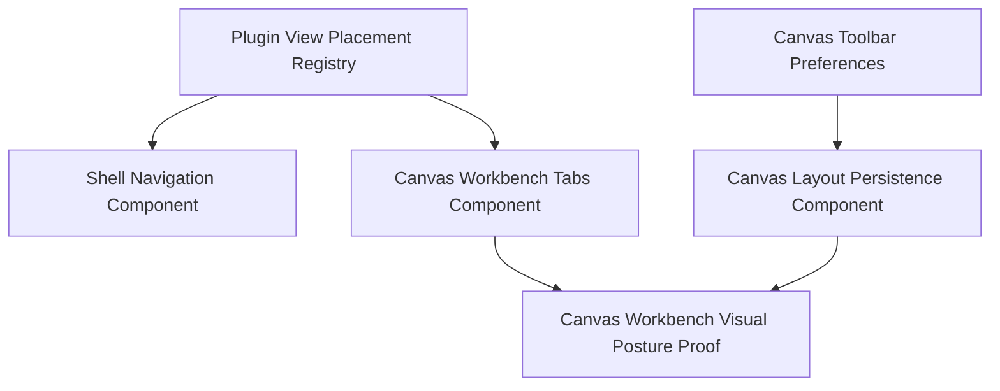

# Canvas Workbench Fowler Remediation Implementation Plan

> **For agentic workers:** REQUIRED SUB-SKILL: Use
> `superpowers:subagent-driven-development` or
> `superpowers:executing-plans` to implement this plan task-by-task. Steps use
> checkbox (`- [ ]`) syntax for tracking.

**Goal:** regularize the Canvas workbench tab and layout work through a
Fowler-first architecture review, mailbox analysis, local component guides,
semantic architecture tests, Cypress visual proof, and repository governance
validation.

**Architecture:** Treat Canvas workbench tabs and Canvas layout preferences as
Web Graph presentation components with explicit command/query rails. The route
and plugin registry project read models; shell navigation and protected draft
authority remain separate. Documentation, tests, generated governance indexes,
and commits must describe the same shipped behavior.

**Tech Stack:** React 18, TypeScript, React Router, Zustand, React Flow,
Vitest, Cypress, Mermaid documentation, repository governance generators, and
`pnpm verify:prepush`.

---

## Process Correction

The previous implementation began with a bug fix instead of this plan. That is
recorded as planning drift. The two local commits currently ahead of
`origin/main` must not be pushed or presented as ready until this plan is
executed and `pnpm verify:prepush` passes.

Existing local commits to regularize:

- `f30e3c14 fix(web): Keep Canvas workbench tab labels readable`
- `b6b0f469 docs(docs): Accept Canvas tab fingerprint baseline`

Allowed outcomes after this plan:

- keep the commits if the final evidence shows they satisfy this plan;
- add follow-up commits for missing plan, mailbox, docs, stories, tests, and
  generated governance artifacts;
- squash later only if the user requests PR hygiene.

Forbidden outcomes:

- pushing the two commits without the Fowler mailbox and plan evidence;
- claiming closure while `pnpm verify:prepush` is aborted or red;
- treating Cypress screenshot inspection as optional for this UI slice.

## Governing Sources

- `AGENTS.md`
- `docs/planning/status/governance-document-rule-inventory.md`
- `docs/guides/ai-work-protocol.md`
- `docs/architecture/reference-architecture.md`
- `docs/architecture/command-query-rail-governance.md`
- `docs/architecture/fowler-opportunity-planning-governance.md`
- `docs/architecture/components/web/frontend-fowler-implementation-pattern.md`
- `docs/architecture/components/web/graph/canvas-workbench-tabs-component.md`
- `docs/architecture/components/web/graph/canvas-layout-persistence-component.md`
- `docs/architecture/components/web/graph/canvas-workbench-command-query-catalog.md`
- `docs/planning/proposals/mandatory/frontend-and-ux/canvas-workbench-tabs-placement-design-plan-20260503.md`
- `docs/planning/reviews/architecture-and-governance/20260421-canvas-route-composition-fowler-review.md`
- `docs/planning/reviews/architecture-and-governance/20260422-canvas-component-governance-follow-up-review.md`
- `docs/planning/reviews/architecture-and-governance/20260425-canvas-graph-strategy-fowler-hard-qa-review.md`

## Scope

In scope:

- branch-level Fowler review of Canvas workbench tabs and layout-preference
  work;
- comparison with mature UI/workbench systems;
- pattern improvements, antipatterns, repetitions, opportunities, and drift;
- mailbox analysis under `buzon/`;
- local component guides with public API, invariants, transitions, consumers,
  and diagrams;
- owned-concern module docblocks for modules touched by this slice;
- semantic architecture tests that validate docs, stories, mailbox, owned
  concerns, and UI placement semantics;
- Cypress proof that tabs are horizontal, readable, and route-scoped;
- generated governance docs and final validation.

Out of scope:

- backend Project Assets persistence;
- new API/contracts/adapters;
- changing protected draft authority;
- changing global Runs semantics beyond verifying separation from Canvas Runs;
- adding debt, stubs, fake adapters, or placeholder docs.

## Command And Query Rails

Canonical local catalog:
`docs/architecture/components/web/graph/canvas-workbench-command-query-catalog.md`.

| Rail                                 | Type    | Bounded context                | DDD owner or read model                 | Status for this plan                   |
| ------------------------------------ | ------- | ------------------------------ | --------------------------------------- | -------------------------------------- |
| `ListShellNavigationItems`           | query   | Web shell navigation           | `ShellNavigationReadModel`              | reuse                                  |
| `ListCanvasWorkbenchTabs`            | query   | Canvas workbench presentation  | `CanvasWorkbenchTabsReadModel`          | reuse                                  |
| `ResolveCanvasWorkbenchContext`      | query   | Canvas workbench presentation  | `CanvasWorkbenchContext`                | reuse                                  |
| `SelectCanvasWorkbenchTab`           | command | Canvas workbench presentation  | `CanvasWorkbenchTabSelectionCommand`    | reuse                                  |
| `RegisterPluginViewPlacement`        | command | Plugin contribution registry   | `PluginViewPlacementRegistration`       | reuse                                  |
| `OpenCanvasScopedRunTab`             | command | Canvas runtime workbench       | `CanvasScopedRunSelection`              | reuse                                  |
| `PersistCanvasLayout`                | command | Canvas layout presentation     | `CanvasLayoutProjection`                | reuse                                  |
| `GetCanvasLayout`                    | query   | Canvas layout presentation     | `CanvasLayoutProjection`                | reuse                                  |
| `ConfigureCanvasViewportPreferences` | command | Canvas viewport presentation   | `CanvasViewportPreferences`             | reuse                                  |
| `VerifyCanvasWorkbenchVisualPosture` | query   | Browser verification / Cypress | `CanvasWorkbenchVisualPostureReadModel` | proposed, test-only acceptance surface |

`VerifyCanvasWorkbenchVisualPosture` is not product runtime behavior. It is a
test read model used by Cypress to prove rendered geometry: tabs must be inside
the Canvas outlet, outside the left navigation rail, horizontal, and readable.

## Fowler Opportunity Matrix

| Scenario                                           | Opportunity                                   | Fowler pattern                                             | DDD owner                                | Rail                                  | Implementation surfaces                                                       | Unit/package test                                   | Architecture test                                                                     | User-flow test                                                     | Out of scope                          |
| -------------------------------------------------- | --------------------------------------------- | ---------------------------------------------------------- | ---------------------------------------- | ------------------------------------- | ----------------------------------------------------------------------------- | --------------------------------------------------- | ------------------------------------------------------------------------------------- | ------------------------------------------------------------------ | ------------------------------------- |
| Canvas workbench tabs appear in the correct place. | Test-only confidence and documentation drift. | Presentation Model plus Semantic Fitness Function.         | `CanvasWorkbenchVisualPostureReadModel`. | `VerifyCanvasWorkbenchVisualPosture`. | `CanvasWorkbenchTabStrip.tsx`, `canvas-workbench-tabs.cy.ts`, component docs. | none; DOM geometry is browser-owned.                | `canvasWorkbenchTabs.architecture.test.ts`.                                           | `canvas-workbench-tabs.cy.ts`.                                     | New navigation redesign.              |
| Shell rail excludes Canvas-only workbench views.   | Boundary drift.                               | Replace Type Code with `ViewPlacement`; Query Model split. | `ShellNavigationReadModel`.              | `ListShellNavigationItems`.           | `registry.ts`, `shellNavigationModel.ts`, plugin contributions.               | `shellNavigationModel.test.ts`, `registry.test.ts`. | `canvasWorkbenchTabs.architecture.test.ts`.                                           | `canvas-workbench-tabs.cy.ts`.                                     | Removing global Runs.                 |
| Workbench labels remain readable.                  | Primitive visual confidence and layout drift. | Intention-Revealing Interface in visual read model.        | `CanvasWorkbenchTabsReadModel`.          | `ListCanvasWorkbenchTabs`.            | `CanvasWorkbenchTabStrip.tsx`, Cypress visual posture helper.                 | none.                                               | `canvasWorkbenchTabs.architecture.test.ts` checks docs and owner.                     | `canvas-workbench-tabs.cy.ts` checks `scrollWidth <= clientWidth`. | Mobile redesign unless failing.       |
| Layout preferences remain presentation state.      | Hidden authority and duplicate semantics.     | Value Object plus Policy Object.                           | `CanvasViewportPreferences`.             | `ConfigureCanvasViewportPreferences`. | `uiLayoutStore.ts`, `CanvasToolbar*`, `CanvasViewport.tsx`.                   | existing layout/grid tests.                         | `canvasStartupAndDraftRecovery.architecture.test.ts` or new local architecture guard. | existing Canvas layout Cypress where present.                      | Persisting preferences to backend.    |
| Documentation matches code.                        | Documentation drift.                          | Documentation as Architecture Decision Record companion.   | component guide plus mailbox review.     | no new runtime rail.                  | docs, `buzon/`, generated governance files.                                   | markdown/governance checks.                         | semantic architecture tests.                                                          | none.                                                              | Creating ADR unless decision changes. |

## Component Grouping Target



Component guide destinations:

- `docs/architecture/components/web/graph/canvas-workbench-tabs-component.md`
- `docs/architecture/components/web/graph/canvas-workbench-tabs-user-stories.md`
- `docs/architecture/components/web/graph/canvas-layout-persistence-component.md`
- `docs/architecture/components/web/graph/canvas-layout-persistence-user-stories.md`
- `buzon/20260504-codex-fowler-canvas-workbench-tabs-and-layout-analysis-and-remediation.md`

## Task 1: Mailbox Fowler Analysis

**Files:**

- Create:
  `buzon/20260504-codex-fowler-canvas-workbench-tabs-and-layout-analysis-and-remediation.md`

- [x] **Step 1: Write the analysis document**

The document must include these sections exactly:

- `## Scope`
- `## Governing Sources`
- `## Mature-System Comparison`
- `## Patterns Improved`
- `## Antipatterns Detected`
- `## Component Grouping`
- `## Repetitions`
- `## Opportunities`
- `## Code And Documentation Drift`
- `## Remediation Plan`
- `## ADR Decision`
- `## TDD Evidence`
- `## Validation Plan`

- [x] **Step 2: Run markdown lint**

Run:

```bash
pnpm exec markdownlint-cli2 buzon/20260504-codex-fowler-canvas-workbench-tabs-and-layout-analysis-and-remediation.md --config .markdownlint-cli2.jsonc --ignore-path .markdownlintignore
```

Expected: `0 error(s)`.

- [x] **Step 3: Commit**

Run:

```bash
git add buzon/20260504-codex-fowler-canvas-workbench-tabs-and-layout-analysis-and-remediation.md
pnpm commit docs docs "Add Canvas workbench Fowler mailbox"
```

## Task 2: Component Guides And Stories

**Files:**

- Modify:
  `docs/architecture/components/web/graph/canvas-workbench-tabs-component.md`
- Create:
  `docs/architecture/components/web/graph/canvas-workbench-tabs-user-stories.md`
- Modify:
  `docs/architecture/components/web/graph/canvas-layout-persistence-component.md`
- Create:
  `docs/architecture/components/web/graph/canvas-layout-persistence-user-stories.md`

- [x] **Step 1: Add explicit local guide links**

Both component docs must link their mailbox and local user-story document.

- [x] **Step 2: Add or normalize sections**

Each component guide must contain:

- `## Public API`
- `## Invariants`
- `## Command And Query Rails`
- `## Transitions`
- `## Consumers`
- `## Fowler Reading`
- `## Negative Coverage`
- `## Drift To Watch`

- [x] **Step 3: Add user stories**

Canvas workbench tab stories must cover:

- default Graph tab;
- Code tab;
- Lineage tab;
- Diff tab;
- Artifacts tab;
- Canvas-scoped Runs tab;
- unknown tab recovery;
- shell rail exclusion;
- readable horizontal labels.

Canvas layout stories must cover:

- viewport persistence;
- node drag persistence;
- remote draft seeding only when local layout is empty;
- grid visibility;
- grid color;
- snap-to-grid;
- auto-layout not disabling drag;
- new nodes inside visible viewport if implemented in this slice.

- [x] **Step 4: Run markdown lint**

Run:

```bash
pnpm lint:md:changed
```

Expected: pass.

- [x] **Step 5: Commit**

Run:

```bash
git add docs/architecture/components/web/graph/canvas-workbench-tabs-component.md docs/architecture/components/web/graph/canvas-workbench-tabs-user-stories.md docs/architecture/components/web/graph/canvas-layout-persistence-component.md docs/architecture/components/web/graph/canvas-layout-persistence-user-stories.md
pnpm commit docs docs "Document Canvas workbench component scenarios"
```

## Task 3: Semantic Architecture Red

**Files:**

- Modify:
  `apps/web/src/app/views/canvas/canvasWorkbenchTabs.architecture.test.ts`
- Modify or create:
  `apps/web/src/app/views/canvas/canvasLayoutPersistence.architecture.test.ts`

- [x] **Step 1: Add failing semantic assertions**

The tests must assert:

- component docs link the mailbox and user-story docs;
- docs include public API, invariants, transitions, consumers, and Mermaid
  diagrams;
- touched modules start with `/** Owned concern:`;
- Cypress spec asserts geometry and label readability;
- layout persistence docs keep visual preferences out of protected drafts.

- [x] **Step 2: Run tests and record red**

Run:

```bash
pnpm --filter @dvt/web test -- src/app/views/canvas/canvasWorkbenchTabs.architecture.test.ts src/app/views/canvas/canvasLayoutPersistence.architecture.test.ts
```

Expected: fail on the missing newly required semantic doc/story/mailbox
assertion before implementation.

## Task 4: Implementation Green

**Files:**

- Modify only files named by Task 2 and Task 3 unless the red test proves an
  owned-concern docblock is missing in a touched module.

- [x] **Step 1: Add missing docs and docblocks**

Apply the minimal change that satisfies the failing semantic tests. Do not add
runtime behavior during this task.

- [x] **Step 2: Run architecture tests**

Run:

```bash
pnpm --filter @dvt/web test -- src/app/views/canvas/canvasWorkbenchTabs.architecture.test.ts src/app/views/canvas/canvasLayoutPersistence.architecture.test.ts
```

Expected: pass.

- [x] **Step 3: Commit**

Run:

```bash
git add apps/web/src/app/views/canvas/canvasWorkbenchTabs.architecture.test.ts apps/web/src/app/views/canvas/canvasLayoutPersistence.architecture.test.ts docs/architecture/components/web/graph/canvas-workbench-tabs-component.md docs/architecture/components/web/graph/canvas-workbench-tabs-user-stories.md docs/architecture/components/web/graph/canvas-layout-persistence-component.md docs/architecture/components/web/graph/canvas-layout-persistence-user-stories.md
pnpm commit test web "Guard Canvas workbench semantics"
```

## Task 5: Cypress Visual TDD

**Files:**

- Modify:
  `apps/web/cypress/e2e/canvas/canvas-workbench-tabs.cy.ts`
- Modify if required:
  `apps/web/src/app/views/canvas/CanvasWorkbenchTabStrip.tsx`

- [x] **Step 1: Confirm red coverage on unpatched behavior**

If the current branch already includes the readable-label implementation,
record the earlier red evidence:

```text
expected label.scrollWidth to be less than label.clientWidth + 2
```

If evidence must be reproduced, use `git show f30e3c14^:` to create a temporary
scratch comparison without committing it, then restore the working tree.

- [x] **Step 2: Run Cypress**

Run:

```bash
pnpm --filter @dvt/web test:e2e:native -- --spec cypress/e2e/canvas/canvas-workbench-tabs.cy.ts
```

Expected: pass with no generated screenshots after the temporary
`cy.screenshot` line is removed.

- [x] **Step 3: Record visual inspection**

Use the Cypress screenshot or Playwright capture during investigation only.
Delete generated screenshots before commit unless the repo has an explicit
evidence artifact path for them.

## Task 6: Drift, Repetition, And ADR Decision

**Files:**

- Modify:
  `buzon/20260504-codex-fowler-canvas-workbench-tabs-and-layout-analysis-and-remediation.md`
- Create ADR only if this task introduces a new long-lived decision not already
  covered by accepted component docs and existing planning proposal.

- [x] **Step 1: Decide ADR need**

Expected decision for the current known scope:

```text
No new ADR required. The work reuses accepted Web Graph component rails and
does not change backend contracts, adapters, protected draft authority, or
cross-context ownership.
```

- [x] **Step 2: Add drift/repetition closeout**

The mailbox must name the fixed repetitions and remaining opportunities.

- [x] **Step 3: Commit**

Run:

```bash
git add buzon/20260504-codex-fowler-canvas-workbench-tabs-and-layout-analysis-and-remediation.md
pnpm commit docs docs "Record Canvas workbench drift closure"
```

## Task 7: Generated Governance And Validation

**Files:**

- Modify generated governance files as required by the scripts.

- [x] **Step 1: Regenerate docs indexes if docs were added**

Run:

```bash
pnpm docs:sync
```

Expected: docs indexes update or remain unchanged.

- [x] **Step 2: Regenerate governance file indexes**

Run:

```bash
pnpm docs:governance:file-component-index
pnpm docs:governance:file-fingerprint-baseline
pnpm docs:governance:file-fingerprint-impact
pnpm docs:governance:coverage-report
pnpm docs:governance:remediation-queue
```

Expected: generated governance surfaces align with the new docs and tests.

- [x] **Step 3: Run touched web validation**

Run:

```bash
pnpm --filter @dvt/web test -- src/app/plugins/registry.test.ts src/app/shell/shellNavigationModel.test.ts src/app/views/canvas/CanvasShell.test.tsx src/app/views/canvas/CanvasShell.architecture.test.tsx src/app/views/canvas/canvasWorkbenchTabs.architecture.test.ts
pnpm --filter @dvt/web typecheck
pnpm exec eslint apps/web/src/app/views/canvas/CanvasWorkbenchTabStrip.tsx apps/web/cypress/e2e/canvas/canvas-workbench-tabs.cy.ts --max-warnings 0
pnpm --filter @dvt/web test:e2e:native -- --spec cypress/e2e/canvas/canvas-workbench-tabs.cy.ts
```

Expected: all pass.

- [x] **Step 4: Run final gate**

Run:

```bash
pnpm verify:prepush
```

Expected: pass. If interrupted, say it was interrupted and do not claim
completion.

- [x] **Step 5: Commit generated governance artifacts**

Run:

```bash
git add docs buzon apps/web
pnpm commit docs docs "Update Canvas workbench governance artifacts"
```

## Final Closeout Requirements

The final response must include:

- governing sources used;
- files changed;
- commits created;
- exact validation commands and pass/fail/interrupted status;
- no-debt evidence;
- no-stub evidence;
- explicit note that no hooks were bypassed;
- explicit note whether `pnpm verify:prepush` passed.

## Implementation Closeout Evidence

Status: implemented on `main` and ready for review. The branch is ahead of
`origin/main`; it was published for review as
`https://github.com/dunay2/dvt/pull/1104`.

Commits:

- `f30e3c149 fix(web): Keep Canvas workbench tab labels readable`
- `b6b0f4692 docs(docs): Accept Canvas tab fingerprint baseline`
- `cbf90a8cf docs(docs): Add Canvas workbench Fowler plan`
- `baa53872d docs(docs): Add Canvas workbench Fowler mailbox`
- `264802c24 docs(docs): Document Canvas workbench component scenarios`
- `8b5cd8bca test(web): Guard Canvas workbench C&Q semantics`
- `b917a5c5e docs(docs): Record Canvas workbench drift closure`
- `faa4939ca docs(docs): Update Canvas workbench governance artifacts`
- `16cba55ec docs(docs): Update Canvas workbench document unit map`
- `95bb0d42d docs(docs): Refresh Canvas workbench governance indexes`
- `362f92a1d docs(docs): Declare Canvas workbench Fowler surfaces`

Validation evidence:

- `pnpm exec markdownlint-cli2 buzon/20260504-codex-fowler-canvas-workbench-tabs-and-layout-analysis-and-remediation.md --config .markdownlint-cli2.jsonc --ignore-path .markdownlintignore`
  passed with `0 error(s)`.
- `pnpm lint:md:changed` passed.
- `pnpm --filter @dvt/web test -- src/app/views/canvas/canvasWorkbenchTabs.architecture.test.ts src/app/views/canvas/canvasLayoutPersistence.architecture.test.ts`
  first failed on the missing C&Q `## Exhaustiveness Rule`, then passed with
  2 files and 6 tests.
- `pnpm --filter @dvt/web test -- src/app/plugins/registry.test.ts src/app/shell/shellNavigationModel.test.ts src/app/views/canvas/CanvasShell.test.tsx src/app/views/canvas/CanvasShell.architecture.test.tsx src/app/views/canvas/canvasWorkbenchTabs.architecture.test.ts src/app/views/canvas/canvasLayoutPersistence.architecture.test.ts`
  passed with 6 files and 21 tests.
- `pnpm --filter @dvt/web typecheck` passed.
- `pnpm exec eslint apps/web/src/app/views/canvas/CanvasWorkbenchTabStrip.tsx apps/web/cypress/e2e/canvas/canvas-workbench-tabs.cy.ts --max-warnings 0`
  passed.
- `pnpm --filter @dvt/web test:e2e:native -- --spec cypress/e2e/canvas/canvas-workbench-tabs.cy.ts`
  passed with 1 spec, 1 test, 0 screenshots, and video disabled.
- `pnpm docs:sync` passed.
- `pnpm docs:governance:document-unit-map`,
  `pnpm docs:governance:file-component-index`,
  `pnpm docs:governance:file-fingerprint-baseline`,
  `pnpm docs:governance:file-fingerprint-impact`,
  `pnpm docs:governance:coverage-report`, and
  `pnpm docs:governance:remediation-queue` passed.
- `pnpm docs:feature-mechanization:implementation` passed after the feature
  manifest declared the Fowler remediation surfaces and new test symbols.
- `pnpm verify:prepush` passed.

No-debt and no-stub evidence:

- No debt entry was added.
- No lint, type, test, Cypress, governance, or pre-push rule was relaxed.
- No hook was bypassed.
- No stub, placeholder, fake adapter, fake success path, or unfinished branch
  was added.
- No ADR was created because the slice reuses local Web Graph presentation
  rails and does not change backend contracts, adapters, protected draft
  authority, or cross-context ownership.
