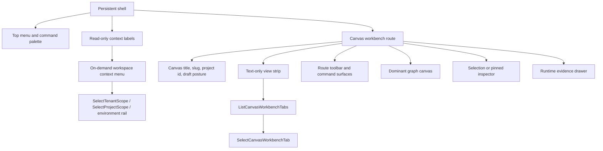

# Canvas Workbench Stage 1 Chrome Simplification Implementation Plan

## Summary

This is the strict Stage 1 implementation plan for `F-28`.

Stage 1 changes the Canvas workbench shell and chrome only. It must make the
graph canvas dominant, remove the fixed left navigation rail from the Canvas
workbench, render Canvas workbench tabs as readable text-only route-local
views, and move tenant, project, and environment selection out of the main top
bar into bounded on-demand shell context.

This plan deliberately does not implement save, export, import, multi-canvas
persistence, Project Assets persistence, backend contracts, auth changes, RBAC,
or protected draft API changes.

## Governing Sources

- `AGENTS.md`
- `docs/planning/status/governance-document-rule-inventory.md`
- `docs/guides/ai-work-protocol.md`
- `docs/planning/state/planning-control-tower.md`
- `docs/planning/state/agent-lane-e.yaml`
- `docs/architecture/reference-architecture.md`
- `docs/architecture/command-query-rail-governance.md`
- `docs/architecture/fowler-opportunity-planning-governance.md`
- `docs/architecture/components/web/appshell/app-shell.md`
- `docs/architecture/components/web/workbench-ui-contract-and-component-inventory.md`
- `docs/architecture/components/web/screen-layout-and-cross-surface-behavior-rules.md`
- `docs/architecture/components/web/main-workspace-views-and-ux.md`
- `docs/architecture/components/web/ux-implementation-guide.md`
- `docs/architecture/components/web/graph/canvas-workbench-tabs-component.md`
- `docs/architecture/components/web/graph/canvas-workbench-command-query-catalog.md`
- `docs/architecture/components/api/protected-runtime-command-query-rail-design.md`
- `docs/planning/proposals/mandatory/frontend-and-ux/canvas-workbench-tabs-placement-design-plan-20260503.md`
- `docs/planning/proposals/mandatory/frontend-and-ux/canvas-workbench-fowler-remediation-plan-20260504.md`
- `docs/planning/proposals/mandatory/frontend-and-ux/canvas-workbench-shell-save-export-sequence-plan-20260505.md`
- `docs/planning/proposals/mandatory/frontend-and-ux/dvt-workbench-ux-specification-v0-4-20260505-draft.md`
  as design input only; the accepted Stage 1 scope is this plan plus the
  `F-28` sequence plan.

## Product Boundary

Stage 1 accepts the mockup direction as a visual direction, not as permission to
add disconnected UI. The workbench must preserve these invariants:

1. The graph canvas remains the dominant authoring surface.
2. No permanent double-left-navigation is allowed.
3. Add/create behavior is command-driven, not permanently docked by default.
4. Context labels are read-only reference indicators in the workbench shell.
5. Workbench views are projections of the same workbench state, not global
   navigation.
6. Runtime evidence is separated from graph authoring.
7. The UI never executes directly; it submits user intent through application
   commands.
8. Node types visible in Insert/Add are resolved from the active workbench
   capability registry.
9. Admin screens are shell-level destinations, never embedded in the Canvas.
10. Any persistent panel must justify its space by active context: selected
    node, active run, active search, or explicit pin.

## Scope

In scope:

- render Canvas workbench tabs as text-only labels;
- keep tab labels horizontal, readable, and route-scoped;
- remove tenant, project, and environment selectors from the main top bar;
- remove dominant Git reference controls from the main top bar;
- render compact title, slug, project id, and draft posture as read-only
  context labels;
- expose scope selection through a bounded on-demand shell context menu or
  equivalent non-fixed surface;
- remove the fixed left navigation rail from the Canvas workbench;
- preserve the top menu and command palette as command-discovery surfaces;
- preserve route behavior, protected runtime posture, draft authority, and
  existing Canvas workbench tab rails.

Out of scope:

- multi-canvas persistence;
- backend project asset persistence;
- save, export, import, or round-trip project snapshots;
- new backend routes, contracts, adapters, migrations, or RBAC;
- protected draft API behavior;
- full Git client behavior, branch switching, staging, commit, or conflict UI;
- embedding Admin screens inside Canvas;
- hard-coding Add palette, Inspector, Runtime panel, or View strip fragments
  outside shell/workbench state and capability contracts.

## Think-First Analysis

### Current State

The current shell still carries visible scope selectors and a left navigation
implementation that made sense during prototype convergence. The accepted
Canvas tab work already moved Code, Lineage, Diff, Artifacts, and Canvas-scoped
Runs into route-local Canvas workbench tabs, but the surrounding chrome still
looks like a generic app shell instead of a dense authoring workbench.

### Root Cause

The root problem is not CSS density. The root problem is ownership ambiguity:
global shell context, route-local workbench projections, authoring commands,
runtime evidence, and administrative destinations are still visually close
enough that the UI can imply false authority.

### Selected Direction

Stage 1 uses Fowler Presentation Model discipline:

- shell context is resolved into a read-only presentation model before render;
- Canvas view strip is projected by the existing Canvas tab read model;
- scope change is an explicit shell command, not a top-bar dropdown side
  effect;
- layout assertions become semantic fitness functions, not screenshot-only
  confidence;
- runtime, inspector, Add palette, and Admin navigation stay bounded by named
  state and capability contracts.

### Rejected Directions

| Direction                                                             | Reason rejected                                                                                   |
| --------------------------------------------------------------------- | ------------------------------------------------------------------------------------------------- |
| Keep the global left rail and add another Canvas rail                 | Violates the no double-left-navigation invariant and keeps route placement ambiguous.             |
| Put tenant/project/environment dropdowns in the main workbench header | Makes context switching dominate authoring and violates read-only context label posture.          |
| Hard-code the new mockup as disconnected JSX fragments                | Creates parallel semantics outside command/query rails and capability contracts.                  |
| Use Stage 1 to add Save or Export                                     | Changes persistence and project I/O authority before chrome ownership is clean.                   |
| Add Git branch management to the header                               | Git review belongs to governed review surfaces; full browser Git client behavior is out of scope. |

## Command And Query Rails

No externally observable behavior may be implemented outside these rails. If
implementation discovers that an existing rail is missing, the catalog must be
updated before code changes continue.

| Rail                                 | Type    | Bounded context               | DDD owner                               | Stage 1 use                                                                     |
| ------------------------------------ | ------- | ----------------------------- | --------------------------------------- | ------------------------------------------------------------------------------- |
| `ListCanvasWorkbenchTabs`            | query   | Canvas workbench presentation | `CanvasWorkbenchTabsReadModel`          | Return route-local tab labels without forcing icon rendering.                   |
| `SelectCanvasWorkbenchTab`           | command | Canvas workbench presentation | `CanvasWorkbenchTabSelectionCommand`    | Preserve route-scoped tab navigation.                                           |
| `ResolveCanvasWorkbenchContext`      | query   | Canvas workbench presentation | `CanvasWorkbenchContext`                | Resolve title, slug, compact project id, draft posture, and unavailable state.  |
| `ListShellNavigationItems`           | query   | Web shell navigation          | `ShellNavigationReadModel`              | Keep global destinations separated from Canvas workbench projections.           |
| `SelectTenantScope`                  | command | Web auth / workspace scope    | Tenant scope command value object       | Move tenant choice out of the main top bar without changing auth.               |
| `SelectProjectScope`                 | command | Web auth / workspace scope    | Project scope command value object      | Move project choice out of the main top bar without changing project authority. |
| `RefreshSessionGrants`               | query   | Web auth / workspace scope    | Session grants read model               | Limit scope choices to granted tenant/project/environment context.              |
| `VerifyCanvasWorkbenchVisualPosture` | query   | Browser verification          | `CanvasWorkbenchVisualPostureReadModel` | Prove tab readability, top-bar relocation, and no fixed Canvas left rail.       |

Stage 1 has one rail gate before code: environment selection must map to an
existing environment-scope command or the command/query catalog must be updated
with that rail. Git context is read-only in Stage 1 unless a separate accepted
Git rail is added before implementation.

## DDD Object Map

| Object                                  | Kind                    | Owner                          | Invariant                                                                           |
| --------------------------------------- | ----------------------- | ------------------------------ | ----------------------------------------------------------------------------------- |
| `CanvasWorkbenchChrome`                 | presentation model      | Canvas workbench presentation  | Defines visible workbench chrome without owning graph truth.                        |
| `CanvasWorkbenchTabsReadModel`          | read model              | Canvas workbench presentation  | Contains text labels, active state, route target, and availability only.            |
| `CanvasWorkbenchContext`                | value object            | Canvas workbench presentation  | Context is ready or explicitly unavailable; it never fabricates project identity.   |
| `ProjectIdentityBadge`                  | read model              | Web shell presentation         | Title, slug, compact project id, and draft posture render as labels, not selectors. |
| `ShellWorkspaceContextMenu`             | presentation model      | Web shell presentation         | Scope choices are command-backed and bounded by granted session context.            |
| `WorkbenchCapabilityRegistry`           | query input / registry  | Web shell and Canvas workbench | Add/view/runtime availability is capability-driven, not hard-coded.                 |
| `AddPalettePresentationPreference`      | presentation preference | Canvas workbench presentation  | Pinning is UI preference only and cannot become domain state or a second nav rail.  |
| `RuntimeEvidencePanelState`             | presentation model      | Canvas runtime evidence        | Runtime panel is collapsed without active run and visible on failed run.            |
| `CanvasInspectorPanelState`             | presentation model      | Canvas workbench presentation  | Inspector is selection-driven or explicitly pinned.                                 |
| `CanvasWorkbenchVisualPostureReadModel` | test read model         | Browser verification           | Cypress reads rendered geometry without inventing product semantics.                |

## Frontend Folder Structure Contract

Stage 1 should improve frontend structure while it changes chrome. It must not
turn into a broad move-only refactor, but every touched or newly created file
must land in the smallest folder that owns the concern.

Current app folders already provide the target boundary:

| Path                                      | Stage 1 rule                                                                                                                                            |
| ----------------------------------------- | ------------------------------------------------------------------------------------------------------------------------------------------------------- |
| `apps/web/src/app/components/ui/*`        | Low-level shadcn/Radix primitives only; no DVT domain, route, shell, session, or Canvas semantics.                                                      |
| `apps/web/src/app/components/shell/*`     | Shell-only React chrome: top bar parts, workspace context menu, health, remaining navigation compatibility, and console drawer chrome.                  |
| `apps/web/src/app/components/workbench/*` | Cross-route workbench primitives: `RouteWorkbenchFrame`, `RouteToolbar`, `ContextPanel`, shared state views, drawers, and reusable layout contracts.    |
| `apps/web/src/app/components/domain/*`    | Stable cross-route domain display atoms only; no routing, no shell session mutation, no Canvas controller state.                                        |
| `apps/web/src/app/components/canvas/*`    | Do not add new Stage 1 files here by default; route-specific Canvas code belongs in `views/canvas`, shared primitives belong in `components/workbench`. |
| `apps/web/src/app/components/console/*`   | Do not expand as a second shell area; shared drawer state and shell-owned console chrome belong under `components/shell` when touched.                  |
| `apps/web/src/app/views/canvas/*`         | Canvas route composition, Canvas read models, Canvas commands, Canvas panels, and Canvas-only presentation adapters.                                    |
| `apps/web/src/app/views/<route>/*`        | Route-owned composition and route-only panels; no global shell context selectors.                                                                       |
| `apps/web/src/app/shell/*`                | Pure shell models, policies, and read models; React renderers stay in `components/shell`.                                                               |
| `apps/web/src/app/stores/*`               | Named UI/session slices only; no root store barrel, no mirror-writing aggregate store.                                                                  |
| `apps/web/src/app/services/*`             | API and service adapters only; Stage 1 cannot change protected draft, save, export, import, or Project Assets authority.                                |

Folder guardrails:

- new shell workspace context UI goes under `components/shell`;
- existing root shell anchors such as `TopAppBar.tsx` may be touched as
  migration composition adapters, but new Stage 1 shell presentation models and
  renderers must move into `app/shell` and `components/shell`;
- reusable panel or toolbar primitives extracted by this slice go under
  `components/workbench`;
- Canvas-specific tab, graph, inspector, Add palette, and runtime presentation
  stays under `views/canvas` unless it is a proven cross-route primitive;
- `components/ui` remains library primitive territory and must not receive
  product decisions;
- file moves are allowed only when they reduce ownership confusion for a
  touched Stage 1 behavior;
- every moved file keeps imports, tests, and component-guide references aligned
  in the same change.

## Fowler Opportunity Matrix

| Scenario                                             | Opportunity                                          | Fowler response                                            | DDD owner                                                         | Rail                                                                                               | Tests                                                                              | Out of scope                                   |
| ---------------------------------------------------- | ---------------------------------------------------- | ---------------------------------------------------------- | ----------------------------------------------------------------- | -------------------------------------------------------------------------------------------------- | ---------------------------------------------------------------------------------- | ---------------------------------------------- |
| Canvas tabs show icons and risk visual noise.        | Presentation drift and primitive visual confidence.  | Presentation Model with text-only tab projection.          | `CanvasWorkbenchTabsReadModel`                                    | `ListCanvasWorkbenchTabs`                                                                          | Unit read-model test, architecture guard, Cypress label readability.               | New routes or tab semantics.                   |
| Canvas tabs must stay horizontal and readable.       | Test-only confidence.                                | Semantic Fitness Function.                                 | `CanvasWorkbenchVisualPostureReadModel`                           | `VerifyCanvasWorkbenchVisualPosture`                                                               | Cypress rectangle and text overflow assertions.                                    | Screenshot-only proof.                         |
| Scope selectors dominate the main top bar.           | Boundary drift between shell context and route work. | Application Controller plus read-only context read model.  | `ProjectIdentityBadge`                                            | `ResolveCanvasWorkbenchContext`, `SelectTenantScope`, `SelectProjectScope`, `RefreshSessionGrants` | Top-bar unit/architecture guard and Cypress reachable scope selection.             | New auth, tenant admin, RBAC.                  |
| Environment selection lacks an explicit mapped rail. | Hidden command creation risk.                        | Command Query Separation gate.                             | Environment scope command value object                            | Catalog update required before code if no rail exists.                                             | Architecture test fails if environment selection is moved without catalog mapping. | Ad hoc store action names.                     |
| Git reference controls sit in the top bar.           | Feature envy and UI authority drift.                 | Read-only reference projection.                            | Shell Git context read model, if present                          | Query only unless a Git command rail is accepted.                                                  | Architecture guard prevents branch-switch command from this slice.                 | Browser Git client.                            |
| Canvas still has fixed left navigation.              | Duplicate navigation semantics.                      | Semantic Fitness Function and bounded shell layout policy. | `CanvasWorkbenchChrome`                                           | `ListShellNavigationItems`, `ListCanvasWorkbenchTabs`                                              | Cypress no fixed Canvas rail; architecture guard for shell/workbench split.        | Removing all global destinations from the app. |
| Insert/Add becomes a permanent panel.                | Hidden authority and panel sprawl.                   | Command Query Separation plus Presentation Preference.     | `AddPalettePresentationPreference`, `WorkbenchCapabilityRegistry` | Existing or cataloged Insert command rails                                                         | Architecture guard: Add is unpinned/closed by default and capability-driven.       | Full Add palette redesign unless touched.      |
| Inspector, Runtime, and minimap compete with graph.  | Responsibility overload.                             | Progressive Disclosure presentation models.                | `CanvasInspectorPanelState`, `RuntimeEvidencePanelState`          | Existing panel toggle or run evidence rails                                                        | Cypress/architecture checks for default collapsed or contextual posture.           | Runtime diagnostics redesign.                  |
| Admin appears as Canvas content.                     | Bounded-context leak.                                | Separate shell destination.                                | `ShellNavigationReadModel`                                        | `ListShellNavigationItems`                                                                         | Architecture guard: Admin remains shell-level destination.                         | Admin feature implementation.                  |

## Target State Diagram



## Responsive And Progressive Disclosure Rules

Implementation must preserve these rules for every touched surface:

- empty canvas shows an Insert hint;
- normal authoring shows canvas, view strip, and Inspector only when selection
  exists or the panel is pinned;
- large graph may show minimap and outline, but both remain optional;
- active run expands or surfaces runtime evidence;
- failed run forces a visible error affordance;
- no active run keeps runtime collapsed by default;
- node secondary actions remain hidden until hover, focus, or selection;
- context labels collapse into a compact breadcrumb below desktop threshold;
- view strip keeps Graph, SQL, Lineage, and More visible below desktop
  threshold;
- Inspector becomes a right drawer below desktop threshold;
- runtime panel becomes a bottom drawer below desktop threshold;
- Add palette opens as command palette or modal-less overlay below desktop
  threshold;
- Run remains the only persistent primary action.

## Command Palette And Add Palette Rules

The command palette is the universal command discovery surface. It must call
the same command/query rails as menus and buttons and must not introduce a
parallel action path.

Initial command groups:

- Insert node;
- Open view;
- Run command;
- Export command;
- Toggle panel;
- Admin destination.

Add palette pinning is allowed only as a user presentation preference:

- default state is unpinned and closed;
- it opens from Insert, shortcut, empty-canvas hint, or command palette;
- it auto-closes after insert unless pinned;
- pinned state is stored as UI preference, not domain state;
- pinned palette must not create a second permanent navigation rail.

## Accessibility Rules

- all top menu commands are keyboard reachable;
- Add palette supports keyboard search, arrow navigation, and Enter to insert;
- Canvas toolbar active mode is visible and exposes ARIA state;
- runtime error state does not rely on color alone;
- node status has text or tooltip alternatives;
- focus order is shell, view strip, canvas controls, canvas, inspector, runtime.

## Implementation Order

### Task 1: Documentation And Catalog Red

Files:

- `docs/architecture/components/web/appshell/app-shell.md`
- `docs/architecture/components/web/workbench-ui-contract-and-component-inventory.md`
- `docs/architecture/components/web/graph/canvas-workbench-command-query-catalog.md`
- `docs/architecture/components/web/graph/canvas-workbench-tabs-component.md`
- this plan

Actions:

1. Add Stage 1 local component-guide deltas for top-bar context labels,
   text-only Canvas workbench tabs, no fixed Canvas left rail, and on-demand
   workspace context selection.
2. Add or map the environment scope command rail before any environment
   selector move reaches code.
3. Record Git as read-only in Stage 1 unless a Git command rail is separately
   accepted.
4. Add a folder-structure architecture guard that fails when new Stage 1 shell,
   workbench, Canvas route, or UI primitive code lands in the wrong folder.

Validation:

```bash
pnpm docs:feature-mechanization:implementation
pnpm lint:md:changed
```

### Task 2: Text-Only Canvas Tab TDD

Files:

- `apps/web/src/app/views/canvas/canvasWorkbenchTabs.test.ts`
- `apps/web/src/app/views/canvas/canvasWorkbenchTabs.architecture.test.ts`
- `apps/web/src/app/views/canvas/CanvasWorkbenchTabStrip.tsx`
- `apps/web/src/app/views/canvas/useCanvasWorkbenchTabStripPresenter.ts`
- `apps/web/cypress/e2e/canvas/canvas-workbench-tabs.cy.ts`

Red:

```bash
pnpm --filter @dvt/web test -- src/app/views/canvas/canvasWorkbenchTabs.test.ts src/app/views/canvas/canvasWorkbenchTabs.architecture.test.ts
```

Expected failure: tab projection or tab renderer still exposes icon rendering
for the Canvas workbench strip.

Green:

- project tab labels through `ListCanvasWorkbenchTabs`;
- render text-only tab labels in `CanvasWorkbenchTabStrip`;
- keep icons available for other surfaces only if their own read models request
  them.

Browser proof:

```bash
pnpm --filter @dvt/web test:e2e:native -- --spec cypress/e2e/canvas/canvas-workbench-tabs.cy.ts
```

### Task 3: Shell Context TDD

Files:

- `apps/web/src/app/components/TopAppBar.tsx`
- `apps/web/src/app/components/shell/*`
- `apps/web/src/app/components/workbench/*`
- `apps/web/src/app/shell/*`
- `apps/web/src/app/stores/sessionStore.ts`
- shell/top-bar tests under the existing `apps/web/src/app` test layout

Red:

```bash
pnpm --filter @dvt/web test -- TopAppBar
```

Expected failure: tenant, project, environment, or dominant Git controls still
render as main top-bar controls instead of read-only labels plus an on-demand
context surface.

Green:

- render title, slug, compact project id, and draft posture as labels;
- move tenant/project/environment choice to a bounded shell context menu;
- keep shell React chrome in `components/shell` and pure shell models in
  `app/shell`;
- keep scope changes backed by `SelectTenantScope`, `SelectProjectScope`,
  `RefreshSessionGrants`, and the accepted environment rail.

### Task 4: No Fixed Canvas Left Rail Guard

Files:

- `apps/web/src/app/Root.tsx`
- `apps/web/src/app/components/shell/AppShellFrame.tsx`
- `apps/web/src/app/components/LeftNavigation.tsx`
- `apps/web/src/app/shell/shellNavigationModel.ts`
- `apps/web/src/app/views/Canvas.tsx`
- `apps/web/src/app/views/canvas/CanvasShellMainPanel.tsx`
- `apps/web/cypress/e2e/canvas/canvas-workbench-tabs.cy.ts`

Red:

```bash
pnpm --filter @dvt/web test -- src/app/views/canvas/canvasWorkbenchTabs.architecture.test.ts
```

Expected failure: Canvas route still permits a fixed left navigation rail inside
the workbench or allows Canvas-scoped views to leak into shell navigation.

Green:

- keep shell navigation and Canvas workbench view strip separate;
- remove the fixed left rail from the Canvas workbench surface;
- move any reusable route-frame primitive discovered during this change to
  `components/workbench` instead of hiding it in `views/canvas`;
- preserve global shell destinations only through `ListShellNavigationItems`.

### Task 5: Progressive Disclosure And Capability Guards

Files:

- `apps/web/src/app/views/canvas/CanvasToolbar.tsx`
- `apps/web/src/app/views/canvas/*Add*`
- `apps/web/src/app/components/InspectorPanel.tsx`
- `apps/web/src/app/components/Console.tsx`
- `apps/web/src/app/components/shell/bottomConsoleDrawerModel.ts`
- existing panel and command-palette tests where present

Red:

```bash
pnpm --filter @dvt/web test -- CanvasToolbar InspectorPanel bottomConsoleDrawerModel
```

Expected failure: a touched panel or command surface is hard-coded, permanent by
default, or not capability/state driven.

Green:

- keep Insert/Add command-driven and unpinned by default;
- keep Inspector selection-driven or explicitly pinned;
- keep runtime collapsed without active run and visible on failed run;
- keep Admin as shell-level destination.

### Task 6: Responsive, Accessibility, And Browser Proof

Files:

- `apps/web/cypress/e2e/canvas/canvas-workbench-tabs.cy.ts`
- additional Canvas shell Cypress spec if the current file becomes too broad

Browser proof:

```bash
pnpm --filter @dvt/web test:e2e:native -- --spec cypress/e2e/canvas/canvas-workbench-tabs.cy.ts
```

Coverage:

- Insert hint appears on empty canvas;
- Insert menu shows shortcut;
- Add palette only shows node types valid for the active workbench;
- Canvas toolbar has one active tool mode;
- runtime panel is collapsed when no run context exists;
- runtime panel surfaces alert on failed run;
- minimap can be toggled from View > Minimap;
- node kebab menu is hidden until hover, focus, or selection;
- edges meet minimum contrast in dark mode;
- context labels do not render as dropdown controls.

### Task 7: Governance And Closeout

Commands:

```bash
pnpm docs:sync
pnpm docs:workboard:generate
pnpm docs:gov:manifest
pnpm docs:governance:document-unit-map
pnpm docs:governance:file-component-index
pnpm docs:governance:file-fingerprint-baseline
pnpm docs:governance:file-fingerprint-impact
pnpm docs:governance:coverage-report
pnpm docs:governance:remediation-queue
pnpm docs:feature-mechanization:implementation
pnpm lint:md:changed
pnpm --filter @dvt/web typecheck
pnpm verify:prepush
```

Closeout must state exact pass/fail status for every command, no debt, no
stubs, no skipped hooks, and no relaxed rules.

## Acceptance

Stage 1 is accepted only when:

- Canvas workbench tabs render text-only labels;
- labels are horizontal, readable, and route-scoped;
- tenant, project, and environment selectors no longer consume the main top
  bar;
- Git context no longer appears as a dominant main top-bar control;
- active project identity and draft posture remain visible as read-only
  context;
- scope selection remains reachable through command-backed shell context;
- Canvas workbench renders without a fixed left navigation rail;
- Add palette, View strip, Runtime panel, Inspector, and Admin navigation are
  driven by explicit state and capability contracts;
- no Stage 1 code changes save, export, import, backend contracts, protected
  draft authority, or multi-canvas persistence;
- package-level tests, Cypress proof, markdown/docs gates, and
  `pnpm verify:prepush` pass.

## Feature Mechanization Manifest

```feature-mechanization
version: 1
featureId: CANVAS-WORKBENCH-STAGE-1-CHROME
mechanizationStatus: closed
noHumanDecisionsRemaining: true
implementationPlan: docs/planning/proposals/mandatory/frontend-and-ux/canvas-workbench-stage-1-chrome-simplification-implementation-plan-20260506.md
componentGuides:
  - docs/architecture/components/web/appshell/app-shell.md
  - docs/architecture/components/web/workbench-ui-contract-and-component-inventory.md
  - docs/architecture/components/web/screen-layout-and-cross-surface-behavior-rules.md
  - docs/architecture/components/web/main-workspace-views-and-ux.md
  - docs/architecture/components/web/ux-implementation-guide.md
  - docs/architecture/components/web/graph/canvas-workbench-tabs-component.md
  - docs/architecture/components/web/graph/canvas-workbench-command-query-catalog.md
userStories:
  - docs/planning/proposals/mandatory/frontend-and-ux/canvas-workbench-stage-1-chrome-simplification-implementation-plan-20260506.md
  - docs/planning/proposals/mandatory/frontend-and-ux/canvas-workbench-shell-save-export-sequence-plan-20260505.md
governingSources:
  - AGENTS.md
  - docs/planning/status/governance-document-rule-inventory.md
  - docs/guides/ai-work-protocol.md
  - docs/planning/state/planning-control-tower.md
  - docs/planning/state/agent-lane-e.yaml
  - docs/architecture/command-query-rail-governance.md
  - docs/architecture/fowler-opportunity-planning-governance.md
  - docs/architecture/components/web/appshell/app-shell.md
  - docs/architecture/components/web/workbench-ui-contract-and-component-inventory.md
  - docs/architecture/components/web/graph/canvas-workbench-command-query-catalog.md
  - docs/architecture/components/api/protected-runtime-command-query-rail-design.md
allowedImplementationSurfaces:
  - docs/planning/proposals/mandatory/frontend-and-ux/canvas-workbench-stage-1-chrome-simplification-implementation-plan-20260506.md
  - docs/planning/proposals/mandatory/frontend-and-ux/canvas-workbench-shell-save-export-sequence-plan-20260505.md
  - docs/architecture/components/web/appshell/app-shell.md
  - docs/architecture/components/web/workbench-ui-contract-and-component-inventory.md
  - docs/architecture/components/web/screen-layout-and-cross-surface-behavior-rules.md
  - docs/architecture/components/web/main-workspace-views-and-ux.md
  - docs/architecture/components/web/ux-implementation-guide.md
  - docs/architecture/components/web/graph/canvas-workbench-tabs-component.md
  - docs/architecture/components/web/graph/canvas-workbench-command-query-catalog.md
  - docs/planning/state/agent-lane-e.yaml
  - docs/planning/state/agent-lane-e.md
  - docs/planning/state/execution-workboard.md
  - docs/planning/state/open-task-route.md
  - docs/planning/status/**
  - docs/.manifest.json
  - docs/**/index.md
  - apps/web/src/app/Root.tsx
  - apps/web/src/app/components/TopAppBar.tsx
  - apps/web/src/app/components/LeftNavigation.tsx
  - apps/web/src/app/components/InspectorPanel.tsx
  - apps/web/src/app/components/Console.tsx
  - apps/web/src/app/components/shell/**
  - apps/web/src/app/components/workbench/**
  - apps/web/src/app/shell/**
  - apps/web/src/app/stores/sessionStore.ts
  - apps/web/src/app/stores/uiLayoutStore.ts
  - apps/web/src/app/views/Canvas.tsx
  - apps/web/src/app/views/canvas/**
  - apps/web/cypress/e2e/canvas/canvas-workbench-tabs.cy.ts
  - apps/web/cypress/support/**
forbiddenImplementationSurfaces:
  - apps/api/**
  - packages/@dvt/contracts/**
  - packages/@dvt/engine/**
  - packages/@dvt/adapter-*/**
  - packages/@dvt/planner/**
  - specs/contracts/**
  - apps/web/src/app/services/api/** protected draft API contract
  - apps/web/src/app/services/workspace/** backend project asset persistence
  - apps/web/src/app/views/diff/** full Git review implementation
  - apps/web/src/app/views/admin/** embedded Canvas admin implementation
commandQueryRails:
  - name: ListCanvasWorkbenchTabs
    type: query
    dddOwner: CanvasWorkbenchTabsReadModel
  - name: SelectCanvasWorkbenchTab
    type: command
    dddOwner: CanvasWorkbenchTabSelectionCommand
  - name: ResolveCanvasWorkbenchContext
    type: query
    dddOwner: CanvasWorkbenchContext
  - name: ListShellNavigationItems
    type: query
    dddOwner: ShellNavigationReadModel
  - name: SelectTenantScope
    type: command
    dddOwner: Tenant scope command value object
  - name: SelectProjectScope
    type: command
    dddOwner: Project scope command value object
  - name: RefreshSessionGrants
    type: query
    dddOwner: Session grants read model
  - name: VerifyCanvasWorkbenchVisualPosture
    type: query
    dddOwner: CanvasWorkbenchVisualPostureReadModel
domainObjects:
  - name: CanvasWorkbenchChrome
    type: presentation model
    owner: Canvas workbench presentation
  - name: CanvasWorkbenchTabsReadModel
    type: read model
    owner: Canvas workbench presentation
  - name: CanvasWorkbenchContext
    type: value object
    owner: Canvas workbench presentation
  - name: ProjectIdentityBadge
    type: read model
    owner: Web shell presentation
  - name: ShellWorkspaceContextMenu
    type: presentation model
    owner: Web shell presentation
  - name: WorkbenchCapabilityRegistry
    type: query input registry
    owner: Web shell and Canvas workbench
  - name: AddPalettePresentationPreference
    type: presentation preference
    owner: Canvas workbench presentation
  - name: RuntimeEvidencePanelState
    type: presentation model
    owner: Canvas runtime evidence
  - name: CanvasInspectorPanelState
    type: presentation model
    owner: Canvas workbench presentation
  - name: CanvasWorkbenchVisualPostureReadModel
    type: test read model
    owner: Browser verification
fowlerSignals:
  - Presentation Model
  - Command Query Separation
  - Semantic Fitness Function
  - Boundary drift
  - Duplicate semantics
  - Hidden authority
  - Responsibility overload
  - Documentation drift
architectureGuards:
  - pnpm --filter @dvt/web test -- src/app/views/canvas/canvasWorkbenchTabs.architecture.test.ts
  - pnpm docs:feature-mechanization:implementation
cypressFlows:
  - pnpm --filter @dvt/web test:e2e:native -- --spec cypress/e2e/canvas/canvas-workbench-tabs.cy.ts
completionGate:
  - pnpm docs:feature-mechanization:implementation
  - pnpm lint:md:changed
  - pnpm --filter @dvt/web test -- src/app/views/canvas/canvasWorkbenchTabs.test.ts src/app/views/canvas/canvasWorkbenchTabs.architecture.test.ts
  - pnpm --filter @dvt/web test:e2e:native -- --spec cypress/e2e/canvas/canvas-workbench-tabs.cy.ts
  - pnpm --filter @dvt/web typecheck
  - pnpm verify:prepush
redGreenCycles:
  - id: stage-1-plan-registration
    redTest: pnpm docs:feature-mechanization:implementation
    expectedFailure: F-28 Stage 1 implementation plan and Lane E task evidence are not aligned.
    patchSurfaces:
      - docs/planning/proposals/mandatory/frontend-and-ux/canvas-workbench-stage-1-chrome-simplification-implementation-plan-20260506.md
      - docs/planning/state/agent-lane-e.yaml
      - docs/planning/state/agent-lane-e.md
      - docs/planning/state/execution-workboard.md
      - docs/planning/state/open-task-route.md
      - docs/planning/status/**
    greenTest: pnpm docs:feature-mechanization:implementation
  - id: text-only-workbench-tabs
    redTest: pnpm --filter @dvt/web test -- src/app/views/canvas/canvasWorkbenchTabs.test.ts src/app/views/canvas/canvasWorkbenchTabs.architecture.test.ts
    expectedFailure: Canvas workbench tab projection or renderer still exposes icons in the Stage 1 strip.
    patchSurfaces:
      - apps/web/src/app/views/canvas/canvasWorkbenchTabs.ts
      - apps/web/src/app/views/canvas/canvasWorkbenchTabs.test.ts
      - apps/web/src/app/views/canvas/canvasWorkbenchTabs.architecture.test.ts
      - apps/web/src/app/views/canvas/CanvasWorkbenchTabStrip.tsx
      - apps/web/src/app/views/canvas/useCanvasWorkbenchTabStripPresenter.ts
      - docs/architecture/components/web/graph/canvas-workbench-tabs-component.md
    greenTest: pnpm --filter @dvt/web test -- src/app/views/canvas/canvasWorkbenchTabs.test.ts src/app/views/canvas/canvasWorkbenchTabs.architecture.test.ts
  - id: shell-context-relocation
    redTest: pnpm --filter @dvt/web test -- TopAppBar
    expectedFailure: Scope selectors still render as main top-bar dropdown controls.
    patchSurfaces:
      - apps/web/src/app/components/TopAppBar.tsx
      - apps/web/src/app/components/shell/**
      - apps/web/src/app/shell/**
      - apps/web/src/app/stores/sessionStore.ts
      - docs/architecture/components/web/appshell/app-shell.md
      - docs/architecture/components/web/workbench-ui-contract-and-component-inventory.md
    greenTest: pnpm --filter @dvt/web test -- TopAppBar
  - id: no-fixed-canvas-left-rail
    redTest: pnpm --filter @dvt/web test -- src/app/views/canvas/canvasWorkbenchTabs.architecture.test.ts
    expectedFailure: Canvas route still permits a fixed left navigation rail inside the workbench.
    patchSurfaces:
      - apps/web/src/app/Root.tsx
      - apps/web/src/app/components/LeftNavigation.tsx
      - apps/web/src/app/components/shell/**
      - apps/web/src/app/shell/**
      - apps/web/src/app/views/Canvas.tsx
      - apps/web/src/app/views/canvas/**
    greenTest: pnpm --filter @dvt/web test -- src/app/views/canvas/canvasWorkbenchTabs.architecture.test.ts
  - id: browser-posture-proof
    redTest: pnpm --filter @dvt/web test:e2e:native -- --spec cypress/e2e/canvas/canvas-workbench-tabs.cy.ts
    expectedFailure: Cypress does not yet prove text-only tabs, reachable scope selection, context labels, and no fixed Canvas left rail.
    patchSurfaces:
      - apps/web/cypress/e2e/canvas/canvas-workbench-tabs.cy.ts
      - apps/web/cypress/support/**
    greenTest: pnpm --filter @dvt/web test:e2e:native -- --spec cypress/e2e/canvas/canvas-workbench-tabs.cy.ts
symbols:
  - name: CanvasWorkbenchStage1ChromeSimplificationImplementationPlan
    path: docs/planning/proposals/mandatory/frontend-and-ux/canvas-workbench-stage-1-chrome-simplification-implementation-plan-20260506.md
    dddOwner: Canvas workbench product planning
    cqRails:
      - ListCanvasWorkbenchTabs
      - SelectCanvasWorkbenchTab
      - ResolveCanvasWorkbenchContext
      - ListShellNavigationItems
      - VerifyCanvasWorkbenchVisualPosture
    fowlerSignals:
      - Presentation Model
      - Command Query Separation
      - Semantic Fitness Function
    architectureGuard: pnpm docs:feature-mechanization:implementation
    cypressCoverage: Stage 1 future proof
    unitTests:
      - pnpm docs:feature-mechanization:implementation
  - name: CanvasWorkbenchChrome
    path: apps/web/src/app/views/canvas/CanvasShellMainPanel.tsx
    dddOwner: CanvasWorkbenchChrome
    cqRails:
      - ListCanvasWorkbenchTabs
      - ResolveCanvasWorkbenchContext
    fowlerSignals:
      - Presentation Model
      - Responsibility overload
    architectureGuard: pnpm --filter @dvt/web test -- src/app/views/canvas/canvasWorkbenchTabs.architecture.test.ts
    cypressCoverage: canvas-workbench-tabs.cy.ts
    unitTests:
      - pnpm --filter @dvt/web test -- src/app/views/canvas/canvasWorkbenchTabs.test.ts
  - name: ProjectIdentityBadge
    path: apps/web/src/app/shell/projectIdentityBadge.ts
    dddOwner: ProjectIdentityBadge
    cqRails:
      - ResolveCanvasWorkbenchContext
      - RefreshSessionGrants
    fowlerSignals:
      - Presentation Model
      - Boundary drift
    architectureGuard: pnpm --filter @dvt/web test -- TopAppBar
    cypressCoverage: canvas-workbench-tabs.cy.ts
    unitTests:
      - pnpm --filter @dvt/web test -- TopAppBar
  - name: ShellProjectIdentityBadge
    path: apps/web/src/app/components/shell/ShellProjectIdentityBadge.tsx
    dddOwner: ProjectIdentityBadge renderer
    cqRails:
      - ResolveCanvasWorkbenchContext
      - RefreshSessionGrants
    fowlerSignals:
      - Presentation Model
      - Boundary drift
    architectureGuard: pnpm --filter @dvt/web test -- TopAppBar
    cypressCoverage: canvas-workbench-tabs.cy.ts
    unitTests:
      - pnpm --filter @dvt/web test -- TopAppBar
  - name: ShellWorkspaceContextMenu
    path: apps/web/src/app/components/shell/ShellWorkspaceContextMenu.tsx
    dddOwner: ShellWorkspaceContextMenu
    cqRails:
      - SelectTenantScope
      - SelectProjectScope
      - RefreshSessionGrants
    fowlerSignals:
      - Command Query Separation
      - Hidden authority
    architectureGuard: pnpm --filter @dvt/web test -- TopAppBar
    cypressCoverage: canvas-workbench-tabs.cy.ts
    unitTests:
      - pnpm --filter @dvt/web test -- TopAppBar
  - name: AddPalettePresentationPreference
    path: apps/web/src/app/stores/uiLayoutStore.ts
    dddOwner: AddPalettePresentationPreference
    cqRails:
      - VerifyCanvasWorkbenchVisualPosture
    fowlerSignals:
      - Hidden authority
      - Duplicate semantics
    architectureGuard: pnpm --filter @dvt/web test -- src/app/views/canvas/canvasWorkbenchTabs.architecture.test.ts
    cypressCoverage: canvas-workbench-tabs.cy.ts
    unitTests:
      - pnpm --filter @dvt/web test -- CanvasToolbar
  - name: CanvasWorkbenchVisualPostureReadModel
    path: apps/web/cypress/e2e/canvas/canvas-workbench-tabs.cy.ts
    dddOwner: CanvasWorkbenchVisualPostureReadModel
    cqRails:
      - VerifyCanvasWorkbenchVisualPosture
    fowlerSignals:
      - Semantic Fitness Function
      - Test-only confidence
    architectureGuard: pnpm docs:feature-mechanization:implementation
    cypressCoverage: pnpm --filter @dvt/web test:e2e:native -- --spec cypress/e2e/canvas/canvas-workbench-tabs.cy.ts
    unitTests:
      - pnpm docs:feature-mechanization:implementation
```
