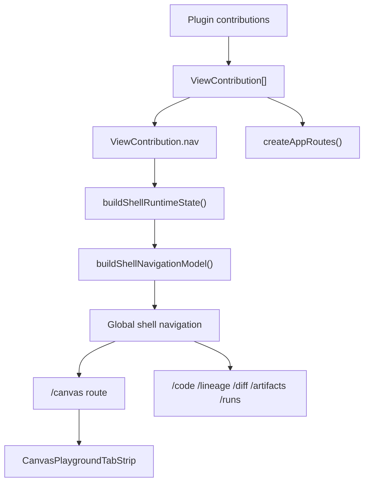
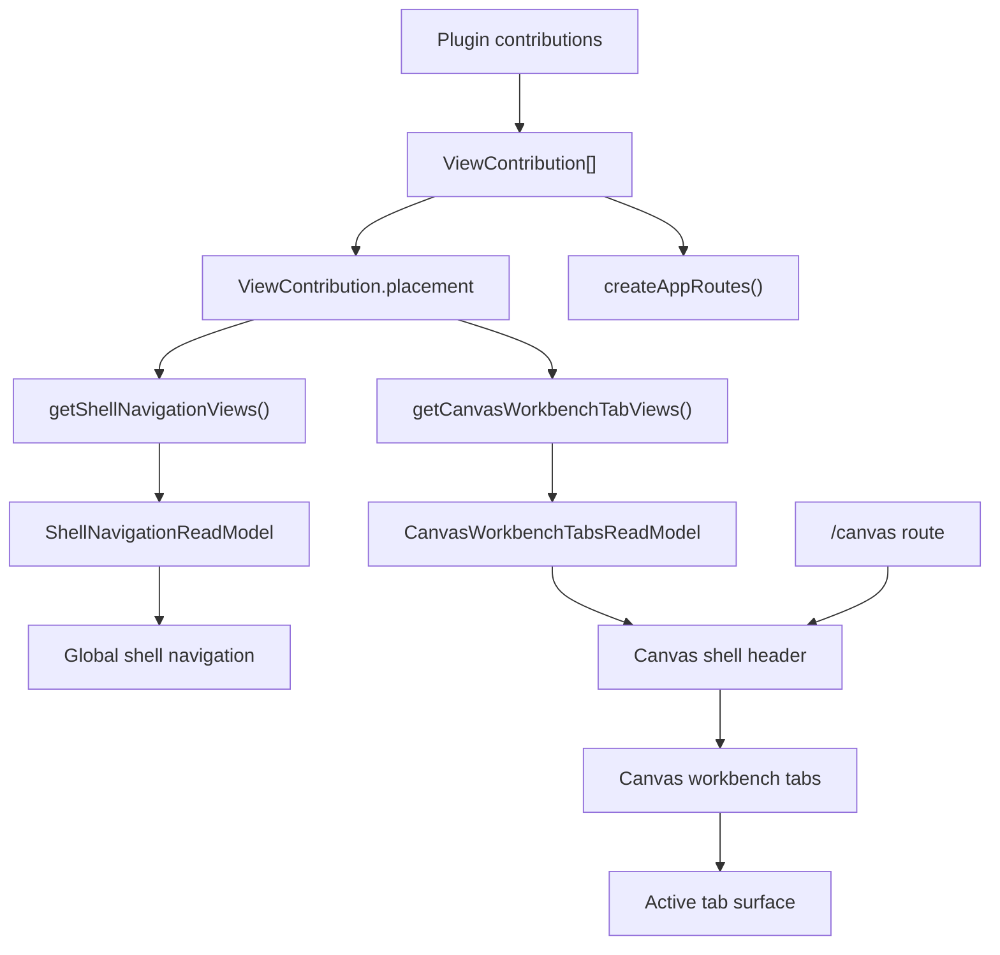
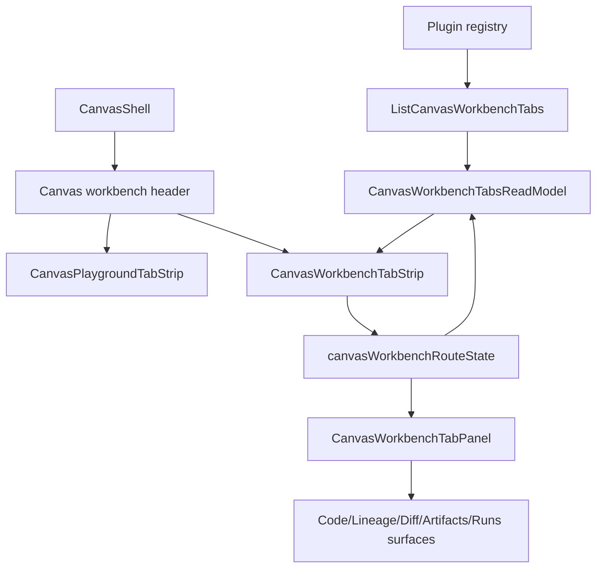
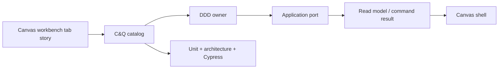
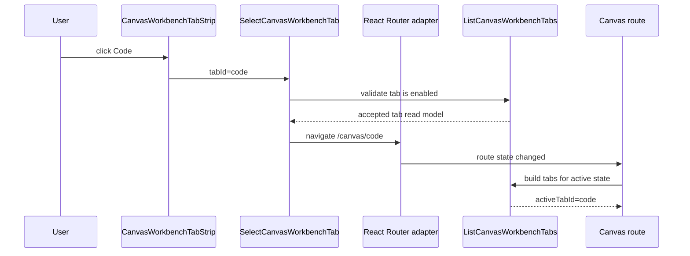
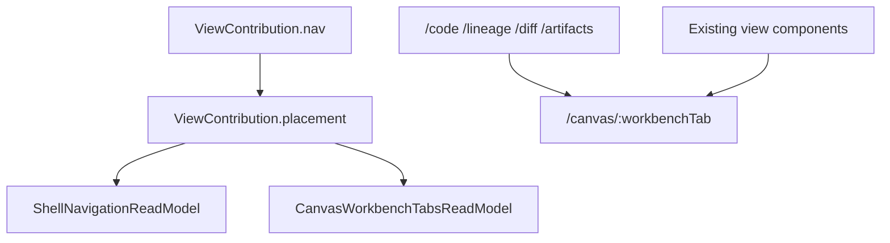

# Canvas Workbench Tabs Placement Design Plan

> **For agentic workers:** This is the accepted design and implementation map
> for Canvas workbench tabs. Implementation must use the command/query rails,
> DDD owners, replacement map, allowed surfaces, and tests below.

**Goal:** Move Canvas-scoped product views out of the global shell menu and
into the active Canvas workbench as first-class tabs, with a closed
command/query catalog and a mechanical implementation map.

**Selected slice:** Option A from the visual companion: Canvas workbench tabs
first. Project Assets persistence, prepared assets, and source import provider
generalization remain separate later slices.

**Architecture:** The global shell keeps global destinations. Canvas-dependent
views are expressed as workbench tab placements owned by the plugin/view
registry, projected through a Canvas workbench tab read model, and rendered
inside the Canvas route. The route registry remains the bootstrap owner for
loadable components, but shell navigation no longer decides Canvas context.

**Tech stack:** React 18, TypeScript, React Router, Vitest, Cypress,
plugin contributions, existing Canvas shell modules, and repository
feature-mechanization governance.

---

## Governing Sources

- `AGENTS.md`
- `docs/planning/status/governance-document-rule-inventory.md`
- `docs/guides/ai-work-protocol.md`
- `docs/architecture/reference-architecture.md`
- `docs/architecture/command-query-rail-governance.md`
- `docs/architecture/fowler-opportunity-planning-governance.md`
- `docs/planning/status/canonical-doc-code-matrix.md`
- `docs/architecture/system-delivery-status.md`
- `docs/planning/proposals/dvt-canvas-workbench-proposal-v2-repo-validated.md`
  as local input only; it is not treated as canonical repository governance.

## Feature Mechanization First Gate

The feature-mechanization manifest in this plan is the first executable gate for
this slice. No red test, implementation patch, Cypress spec, documentation
closeout, or generated-status update is allowed until the manifest declares:

- the complete command/query rail set;
- DDD owners and domain objects;
- Fowler signals;
- allowed and forbidden implementation surfaces;
- all new code symbols;
- red/green cycles;
- Cypress and architecture coverage;
- the final completion gate.

The required first verification command is:

```text
pnpm docs:feature-mechanization:implementation
```

If that command reports an undeclared surface or symbol, the plan is incomplete
and implementation must not proceed. Adding the manifest after implementation
has already started is a process failure, even if the final gate later passes.

## Implementation Status

This plan was accepted for implementation on 2026-05-03. The implemented slice
is intentionally limited to Canvas workbench placement rails. Backend,
contracts, adapters, Project Assets persistence, prepared assets, and source
import provider generalization remain out of scope.

Process correction: during the active implementation run, the full
feature-mechanization manifest was completed after the implementation gate
reported missing surfaces and symbols. That is recorded as an ordering
deviation, not as an acceptable precedent. Future work on this feature must
start from the manifest-first gate above.

## Problem Statement

The current UI exposes `Canvas`, `Lineage`, `Code`, `Diff`, `Artifacts`, and
`Runs` as sibling shell navigation items. That makes route placement look like
domain ownership. It also suggests that Code, Lineage, Diff, Artifacts, and
Runs are globally independent views, while most of their useful states depend
on the active Canvas/workspace context: tenant, project, environment, canvas
document, selected node, selected run, and available artifacts.

The root problem is not the visual tab style. The root problem is that the
current plugin view contract has only one visual placement concept:

```ts
ViewContribution.nav;
```

That single field means "this view appears in shell navigation". There is no
canonical way for a plugin to say "this view is a tab inside the Canvas
workbench". The result is duplicate semantics: route registration, shell
navigation, and contextual workbench placement are collapsed into one property.

This plan predates the F-27 Stage 1 UX direction. Any mention of a sidebar in
this document describes the legacy/current shell navigation surface that Canvas
workbench tabs must leave behind; it is not approval for a fixed left navigation
rail inside the Canvas workbench.

## Current State Map



Current implementation facts:

| Surface                       | Current responsibility                                        | Drift                                                                      |
| ----------------------------- | ------------------------------------------------------------- | -------------------------------------------------------------------------- |
| `ViewContribution.nav`        | Declares global shell navigation.                             | Also acts as the only placement concept.                                   |
| `getNavigationViews()`        | Returns all views with `nav`.                                 | Cannot distinguish global shell views from Canvas workbench tabs.          |
| `buildShellNavigationModel()` | Maps navigation views to shell navigation items.              | Receives already-filtered views, so it cannot enforce placement semantics. |
| `dbtContributions.ts`         | Declares Canvas, Lineage, Code, Diff, Artifacts as shell nav. | Canvas-scoped views are presented as global siblings.                      |
| `monitoringContributions.ts`  | Declares global Runs and run detail.                          | No separate Canvas-scoped Runs tab.                                        |
| `CanvasPlaygroundTabStrip`    | Renders active Canvas document tabs and replacement action.   | It must not be reused for workbench view tabs.                             |

## Target State Map



Target placement value object:

```ts
export type ViewPlacement =
  | Readonly<{
      kind: 'shell-nav';
      label: LocalizableString;
      icon: LucideIcon;
      order: number;
      level: 'core' | 'extended' | 'admin';
    }>
  | Readonly<{
      kind: 'workbench-tab';
      workbench: 'canvas';
      tabId: CanvasWorkbenchTabId;
      label: LocalizableString;
      icon: LucideIcon;
      order: number;
      scope: 'canvas' | 'selection' | 'run';
    }>;
```

Hard cut rule: `ViewContribution.nav` is replaced by
`ViewContribution.placement`. The implementation must not keep a compatibility
alias that lets new views continue using `nav`.

## What This Creates

| New artifact                               | Owned concern                                                                      |
| ------------------------------------------ | ---------------------------------------------------------------------------------- |
| `ViewPlacement` value object               | Separates route registration from visual placement.                                |
| `getShellNavigationViews()`                | Returns only `placement.kind === 'shell-nav'` views.                               |
| `getCanvasWorkbenchTabViews()`             | Returns only Canvas workbench tab views.                                           |
| `CanvasWorkbenchTabReadModel`              | Screen-independent read model for tab labels, order, routes, and active state.     |
| `buildCanvasWorkbenchTabsReadModel()`      | Pure projection from plugin view placements and active route/context.              |
| `CanvasWorkbenchTabStrip`                  | Passive rendering component for Graph, Code, Lineage, Diff, Artifacts, Runs.       |
| `canvasWorkbenchRouteState`                | Parses, validates, and writes active tab route state.                              |
| `canvasWorkbenchTabs.architecture.test.ts` | Semantic guard that shell nav and Canvas workbench tabs remain separate.           |
| `canvas-workbench-tabs.cy.ts`              | User-flow proof that tabs are visible, selectable, and stay inside Canvas context. |
| Component guide                            | Long-lived API, invariants, transitions, consumers, and diagrams.                  |

## What This Replaces

| Existing surface                                     | Replacement                                                     | Reason                                                                  |
| ---------------------------------------------------- | --------------------------------------------------------------- | ----------------------------------------------------------------------- |
| `ViewContribution.nav`                               | `ViewContribution.placement`                                    | One field cannot represent both shell destinations and contextual tabs. |
| `getNavigationViews()`                               | `getShellNavigationViews()` plus `getCanvasWorkbenchTabViews()` | Avoids duplicate local filters and makes placement semantic.            |
| `ShellNavigationItem.icon: ViewContribution['nav']`  | `ShellNavigationItem.icon: ShellNavigationPlacement['icon']`    | Type-level proof that shell navigation reads shell placements only.     |
| `dbt.lineage` shell nav                              | `dbt.lineage` Canvas workbench tab placement                    | Lineage is Canvas/project context-dependent in this slice.              |
| `dbt.code` shell nav                                 | `dbt.code` Canvas workbench tab placement                       | Code is selection/canvas context-dependent.                             |
| `dbt.diff` shell nav                                 | `dbt.diff` Canvas workbench tab placement                       | Diff depends on Canvas graph and revision context.                      |
| `dbt.artifacts` shell nav                            | `dbt.artifacts` Canvas workbench tab placement                  | Artifacts are useful as Canvas/run-scoped evidence.                     |
| One `monitoring.runs` meaning                        | Two placements: global Runs shell view and Canvas Runs tab      | Global run search is not the same intent as Canvas-scoped runs.         |
| Visual reliance on shell navigation for Canvas views | Canvas-owned tab strip inside the Canvas route                  | Keeps related view changes in the same workbench location.              |

`CanvasPlaygroundTabStrip` is not replaced by this slice. It keeps owning
Canvas document tabs and replacement behavior. The new workbench tab strip is a
separate component because it answers a different product question.

## Command And Query Catalog

No externally observable behavior may be implemented outside this catalog for
this slice.

| Rail                            | Type    | Owning bounded context        | DDD owner or read model                           | Application port                          | Adapter surface                    | Scope and auth rules                                                      | Negative tests                                                                                   |
| ------------------------------- | ------- | ----------------------------- | ------------------------------------------------- | ----------------------------------------- | ---------------------------------- | ------------------------------------------------------------------------- | ------------------------------------------------------------------------------------------------ |
| `ListShellNavigationItems`      | query   | Web shell navigation          | `ShellNavigationReadModel`                        | Shell runtime query port                  | Plugin registry projection         | Uses enabled plugins only; no tenant data returned                        | Workbench-tab placements are rejected from shell nav; disabled plugin views omitted              |
| `ListCanvasWorkbenchTabs`       | query   | Canvas workbench presentation | `CanvasWorkbenchTabsReadModel`                    | Canvas workbench tab query port           | Plugin registry projection         | Requires active Canvas route; uses enabled plugins only                   | Shell-nav placements are rejected from Canvas tabs; duplicate tab IDs rejected                   |
| `ResolveCanvasWorkbenchContext` | query   | Canvas workbench presentation | `CanvasWorkbenchContext` value object             | Canvas route state query port             | React Router location adapter      | Tenant/project/environment/canvas context must be explicit or unavailable | Missing Canvas context returns unavailable state, not fake defaults                              |
| `SelectCanvasWorkbenchTab`      | command | Canvas workbench presentation | `CanvasWorkbenchTabSelectionCommand` value object | Canvas route state command port           | React Router navigation adapter    | Only known Canvas tab IDs may be selected                                 | Unknown tab ID, disabled plugin tab, and unavailable context are rejected                        |
| `RegisterPluginViewPlacement`   | command | Plugin contribution registry  | `PluginViewPlacementRegistration` policy          | Plugin registry composition port          | Static plugin contribution adapter | View route remains registered only when plugin is enabled                 | Missing placement, duplicate route ID, duplicate workbench tab ID, and invalid scope fail closed |
| `OpenCanvasScopedRunTab`        | command | Canvas runtime workbench      | `CanvasScopedRunSelection` value object           | Canvas workbench route state command port | React Router navigation adapter    | Requires active Canvas context and a known run ID when run-specific       | Run tab without Canvas context or unknown run ID is rejected                                     |

Rail notes:

- `ListGlobalRuns` remains the existing global runtime query and is not changed
  by this slice.
- `OpenRunDetail` remains the existing global run-detail route intent and is
  not changed by this slice.
- `OpenCanvasScopedRunTab` is a new Canvas intent because it selects a run
  inside the Canvas workbench rather than opening global run search/detail.

## DDD Object Map

| Object                               | Kind                 | Owner                         | Invariants                                                                |
| ------------------------------------ | -------------------- | ----------------------------- | ------------------------------------------------------------------------- |
| `ViewPlacement`                      | value object         | Plugin contribution registry  | A view has exactly one visual placement.                                  |
| `ShellNavigationPlacement`           | value object         | Web shell navigation          | Only `kind: 'shell-nav'` can become a shell navigation item.              |
| `CanvasWorkbenchTabPlacement`        | value object         | Canvas workbench presentation | Only `workbench: 'canvas'` can become a Canvas tab.                       |
| `ShellNavigationReadModel`           | read model           | Web shell navigation          | Sorted by placement order; contains no Canvas workbench tabs.             |
| `CanvasWorkbenchTabsReadModel`       | read model           | Canvas workbench presentation | Sorted by placement order; contains Graph plus enabled tab contributions. |
| `CanvasWorkbenchContext`             | value object         | Canvas workbench presentation | Carries route, workspace, canvas, selection, and optional run scope.      |
| `CanvasWorkbenchTabSelectionCommand` | command value object | Canvas workbench presentation | Active tab ID must exist in the tab read model.                           |
| `PluginViewPlacementRegistration`    | policy               | Plugin contribution registry  | Duplicate route IDs and duplicate workbench tab IDs are invalid.          |

## Fowler Opportunity Matrix

| Scenario                                                              | Opportunity         | Fowler pattern                          | DDD owner                            | Command/query rail            | Implementation surfaces                                       | Unit or package test           | Architecture test                                | User-flow test                                                                           | Out of scope                    |
| --------------------------------------------------------------------- | ------------------- | --------------------------------------- | ------------------------------------ | ----------------------------- | ------------------------------------------------------------- | ------------------------------ | ------------------------------------------------ | ---------------------------------------------------------------------------------------- | ------------------------------- |
| Shell navigation shows Canvas-dependent views as global siblings.     | Boundary drift      | Presentation Model + Service Layer      | `ShellNavigationReadModel`           | `ListShellNavigationItems`    | `PluginManifest.ts`, `registry.ts`, `shellNavigationModel.ts` | `shellNavigationModel.test.ts` | `canvasWorkbenchTabs.architecture.test.ts`       | Cypress validates shell navigation no longer lists Code/Lineage/Diff/Artifacts as global | Project Assets split            |
| Plugin view contract has only `nav`.                                  | Primitive obsession | Replace Type Code with Value Object     | `ViewPlacement`                      | `RegisterPluginViewPlacement` | `PluginManifest.ts`, plugin contribution files                | registry tests                 | architecture guard rejects `nav` usage           | N/A                                                                                      | External plugin versioning      |
| Canvas needs Graph/Code/Lineage/Diff/Artifacts/Runs in one workbench. | Duplicate semantics | Composite View / Application Controller | `CanvasWorkbenchTabsReadModel`       | `ListCanvasWorkbenchTabs`     | Canvas workbench tab model and rendering files                | `canvasWorkbenchTabs.test.ts`  | architecture guard keeps tab read model pure     | `canvas-workbench-tabs.cy.ts`                                                            | Rewriting each tab internals    |
| User switches workbench tabs.                                         | Hidden authority    | Command object                          | `CanvasWorkbenchTabSelectionCommand` | `SelectCanvasWorkbenchTab`    | `canvasWorkbenchRouteState.ts`                                | route state tests              | architecture guard rejects ad hoc tab ID strings | Cypress tab selection stays under Canvas                                                 | Browser persistence of last tab |
| Runs appears both globally and under Canvas.                          | Duplicate semantics | Explicit Context Object                 | `CanvasScopedRunSelection`           | `OpenCanvasScopedRunTab`      | monitoring contribution and Canvas tab read model             | scoped run tab tests           | architecture guard names global vs scoped runs   | Cypress opens Canvas Runs tab without opening global Runs route                          | Run detail redesign             |

## Target Route And Placement Rules

1. Route registration and visual placement are separate.
2. A plugin view may still contribute a route component, route handle, and
   bootstrap contract.
3. A plugin view may have exactly one placement:
   - shell nav; or
   - Canvas workbench tab.
4. Canvas workbench tab views render inside the Canvas route, not as global
   shell navigation destinations.
5. Direct old global paths for Canvas-dependent views are retired in this
   hard-cut slice. If a deep-link strategy is required, it must use the new
   Canvas workbench route state, not compatibility redirects.
6. Global Runs remains a shell view because global run search/detail is a
   different product intent from Canvas-scoped run evidence.

Target tab IDs:

| Tab ID      | Label     | Scope     | Owner             | Source component                                         |
| ----------- | --------- | --------- | ----------------- | -------------------------------------------------------- |
| `graph`     | Graph     | canvas    | Canvas workbench  | Canvas viewport already in route                         |
| `code`      | Code      | selection | dbt plugin        | Existing Code surface adapted to Canvas context          |
| `lineage`   | Lineage   | canvas    | dbt plugin        | Existing Lineage surface adapted to Canvas context       |
| `diff`      | Diff      | canvas    | dbt plugin        | Existing Diff surface adapted to Canvas context          |
| `artifacts` | Artifacts | run       | dbt plugin        | Existing Artifacts surface adapted to Canvas/run context |
| `runs`      | Runs      | run       | monitoring plugin | Existing Runs surface adapted as Canvas-scoped tab       |

## Route State Design

The active workbench tab must be route-visible so Cypress, reloads, and direct
links can prove behavior. The proposed route shape is:

```text
/canvas/:workbenchTab?
```

Rules:

- `/canvas` resolves to the default `graph` tab.
- `/canvas/graph` renders the Graph tab.
- `/canvas/code`, `/canvas/lineage`, `/canvas/diff`, `/canvas/artifacts`, and
  `/canvas/runs` render their corresponding workbench tab when enabled.
- Unknown tab segments render a Canvas workbench unavailable state with a
  recovery action to Graph.
- The tab route state is parsed by `canvasWorkbenchRouteState`, not inline in
  JSX.

## Target Component Map



## Public API Of The New Component

```ts
export type CanvasWorkbenchTabReadModel = Readonly<{
  id: CanvasWorkbenchTabId;
  label: string;
  icon: LucideIcon;
  order: number;
  scope: 'canvas' | 'selection' | 'run';
  isEnabled: boolean;
  disabledReason?: string;
  to: string;
}>;

export type CanvasWorkbenchTabsReadModel = Readonly<{
  activeTabId: CanvasWorkbenchTabId;
  tabs: readonly CanvasWorkbenchTabReadModel[];
  unavailableState: CanvasWorkbenchTabUnavailableState | null;
}>;

export function buildCanvasWorkbenchTabsReadModel(args: {
  placements: readonly CanvasWorkbenchTabPlacement[];
  routeState: CanvasWorkbenchRouteState;
  context: CanvasWorkbenchContext;
}): CanvasWorkbenchTabsReadModel;
```

## Invariants

1. A shell navigation item can only be created from `kind: 'shell-nav'`.
2. A Canvas workbench tab can only be created from
   `kind: 'workbench-tab'` and `workbench: 'canvas'`.
3. `CanvasPlaygroundTabStrip` remains document-tab UI and does not own
   Graph/Code/Lineage/Diff/Artifacts/Runs placement.
4. Every Canvas workbench tab ID must be unique across enabled plugins.
5. Every workbench tab has a command/query rail before implementation.
6. Every workbench tab has a negative unavailable state for missing context.
7. Graph is the default tab and must remain available when Canvas itself is
   route-ready.
8. Global Runs and Canvas-scoped Runs are different intents and must not share
   one ambiguous tab/nav record.
9. Canvas-scoped tab views must publish bootstrap readiness directly through
   the active Canvas workbench route, not through retired global
   Code/Lineage/Diff/Artifacts route IDs or alias mappings.

## Implementation Plan

### Phase 0: Canonical Design Acceptance

- Complete the feature-mechanization manifest before red tests or code.
- Run `pnpm docs:feature-mechanization:implementation` as the first mechanical
  gate and stop on undeclared surfaces or symbols.
- Create this plan.
- Add or update the component guide:
  `docs/architecture/components/web/graph/canvas-workbench-tabs-component.md`.
- Add the Canvas workbench C&Q rails to the component guide.
- Confirm the local Spanish proposal is input only, not the canonical design.

### Phase 1: Red Tests

- Add `shellNavigationModel.test.ts` coverage proving workbench-tab placements
  are excluded from shell navigation.
- Add registry tests proving shell views and Canvas workbench tab views are
  separate queries.
- Add `canvasWorkbenchTabs.test.ts` with:
  - default `graph` tab;
  - sorted tab order;
  - unknown tab unavailable state;
  - duplicate tab ID rejection;
  - disabled plugin exclusion.
- Add architecture test proving:
  - no active source uses `ViewContribution.nav`;
  - `CanvasWorkbenchTabStrip` does not import shell navigation;
  - `CanvasPlaygroundTabStrip` does not import workbench tab state.
- Add Cypress spec proving:
  - shell navigation no longer exposes Code, Lineage, Diff, Artifacts as global
    items;
  - Canvas shows Graph, Code, Lineage, Diff, Artifacts, Runs tabs;
  - selecting Code/Lineage/Diff/Artifacts/Runs keeps the user in Canvas route
    context;
  - unknown tab route fails closed to unavailable state.

### Phase 2: Minimal Green Implementation

- Replace `ViewContribution.nav` with `ViewContribution.placement`.
- Update built-in dbt and monitoring contributions.
- Split registry queries:
  - `getShellNavigationViews()`;
  - `getCanvasWorkbenchTabViews()`.
- Update `buildShellRuntimeState()` to use shell navigation views only.
- Add Canvas workbench tab route state model.
- Add Canvas workbench tab read model.
- Render `CanvasWorkbenchTabStrip` in the Canvas shell header without changing
  `CanvasPlaygroundTabStrip` ownership.
- Mount tab panels through the Canvas route state.

### Phase 3: Hard Cut Cleanup

- Delete `getNavigationViews()`.
- Delete all `ViewContribution.nav` type references.
- Remove shell nav declarations for Code, Lineage, Diff, and Artifacts.
- Add separate Canvas-scoped Runs tab contribution while keeping global Runs.
- Update route tests and shell chrome tests to assert the new navigation shape.
- Update docs indexes and generated governance projections.

### Phase 4: Validation And Closeout

Minimum validation after implementation:

```text
pnpm --filter @dvt/web test -- src/app/shell/shellNavigationModel.test.ts src/app/routes.test.tsx src/app/views/canvas/canvasWorkbenchTabs.test.ts src/app/views/canvas/canvasWorkbenchTabs.architecture.test.ts
pnpm --filter @dvt/web typecheck
pnpm --filter @dvt/web test:e2e:native -- --spec cypress/e2e/canvas/canvas-workbench-tabs.cy.ts
pnpm docs:sync
pnpm docs:feature-mechanization:implementation
pnpm verify:prepush
```

```feature-mechanization
version: 1
featureId: CANVAS-WORKBENCH-TABS-PLACEMENT
mechanizationStatus: implemented
noHumanDecisionsRemaining: true
implementationPlan: docs/planning/proposals/mandatory/frontend-and-ux/canvas-workbench-tabs-placement-design-plan-20260503.md
componentGuides:
  - docs/architecture/components/web/graph/canvas-workbench-tabs-component.md
userStories:
  - docs/planning/proposals/mandatory/frontend-and-ux/canvas-workbench-tabs-placement-design-plan-20260503.md
governingSources:
  - AGENTS.md
  - docs/planning/status/governance-document-rule-inventory.md
  - docs/guides/ai-work-protocol.md
  - docs/architecture/command-query-rail-governance.md
  - docs/architecture/fowler-opportunity-planning-governance.md
allowedImplementationSurfaces:
  - apps/web/cypress/e2e/canvas/canvas-workbench-tabs.cy.ts
  - apps/web/cypress/support/workspaceSession.ts
  - apps/web/src/app/Root.shellChrome.test.support.ts
  - apps/web/src/app/plugins/PluginRegistry.ts
  - apps/web/src/app/plugins/contracts/PluginManifest.ts
  - apps/web/src/app/plugins/cost/costContributions.ts
  - apps/web/src/app/plugins/dbt/dbtContributions.ts
  - apps/web/src/app/plugins/monitoring/monitoringContributions.ts
  - apps/web/src/app/plugins/pluginRuntimeProjection.architecture.test.ts
  - apps/web/src/app/plugins/registry.ts
  - apps/web/src/app/routes.test.tsx
  - apps/web/src/app/routes.ts
  - apps/web/src/app/shell/shellNavigationModel.test.ts
  - apps/web/src/app/shell/shellNavigationModel.ts
  - apps/web/src/app/shell/shellRuntimeModel.ts
  - apps/web/src/app/views/ArtifactsView.tsx
  - apps/web/src/app/views/Canvas.architecture.test.tsx
  - apps/web/src/app/views/Canvas.test.controller.defaults.ts
  - apps/web/src/app/views/Canvas.test.support.tsx
  - apps/web/src/app/views/Canvas.tsx
  - apps/web/src/app/views/CodeView.tsx
  - apps/web/src/app/views/DiffView.tsx
  - apps/web/src/app/views/LineageView.tsx
  - apps/web/src/app/views/RunsView.tsx
  - apps/web/src/app/views/artifacts/artifactsRouteBootstrap.ts
  - apps/web/src/app/views/canvas/CanvasShell.architecture.test.tsx
  - apps/web/src/app/views/canvas/CanvasShellMainPanel.tsx
  - apps/web/src/app/views/canvas/CanvasWorkbenchTabPanel.tsx
  - apps/web/src/app/views/canvas/CanvasWorkbenchTabStrip.tsx
  - apps/web/src/app/views/canvas/canvasControllerViewModel.ts
  - apps/web/src/app/views/canvas/canvasDraftPresentationStore.ts
  - apps/web/src/app/views/canvas/canvasShell.types.ts
  - apps/web/src/app/views/canvas/canvasWorkbenchRouteState.test.ts
  - apps/web/src/app/views/canvas/canvasWorkbenchRouteState.ts
  - apps/web/src/app/views/canvas/canvasWorkbenchTabs.architecture.test.ts
  - apps/web/src/app/views/canvas/canvasLayoutPersistence.architecture.test.ts
  - apps/web/src/app/views/canvas/canvasWorkbenchTabs.test.ts
  - apps/web/src/app/views/canvas/canvasWorkbenchTabs.ts
  - apps/web/src/app/views/canvas/useCanvasRoutePresentationSync.ts
  - apps/web/src/app/views/code/codeRouteBootstrap.ts
  - apps/web/src/app/views/diff/diffRouteBootstrap.ts
  - apps/web/src/app/views/lineage/lineageRouteBootstrap.ts
  - apps/web/src/app/views/runs/CanvasRunsTabView.tsx
  - docs/architecture/components/web/appshell/app-shell.md
  - docs/architecture/components/web/graph/canvas-legacy-retirement-component.md
  - docs/architecture/components/web/graph/canvas-legacy-retirement-user-stories.md
  - docs/architecture/components/web/graph/canvas-workbench-command-query-catalog.md
  - docs/architecture/components/web/graph/canvas-workbench-tabs-component.md
  - docs/architecture/components/web/graph/canvas-workbench-tabs-user-stories.md
  - docs/architecture/components/web/graph/canvas-layout-persistence-component.md
  - docs/architecture/components/web/graph/canvas-layout-persistence-user-stories.md
  - docs/planning/proposals/mandatory/frontend-and-ux/canvas-workbench-fowler-remediation-plan-20260504.md
  - docs/planning/proposals/dvt-canvas-workbench-proposal-v2-repo-validated.md
  - docs/planning/proposals/mandatory/frontend-and-ux/canvas-workbench-tabs-placement-design-plan-20260503.md
  - docs/planning/proposals/nice-to-have/frontend-and-ux/frontend-roadmap-20260219.md
  - docs/planning/execution-model/dvt-system-map-god-diagram.md
  - docs/planning/execution-model/dvt-dependency-risk-map.md
  - docs/planning/proposals/portfolio-map-20260403.md
  - buzon/20260504-codex-fowler-canvas-workbench-tabs-and-layout-analysis-and-remediation.md
  - buzon/20260518-f12-fowler-canvas-legacy-retirement-analysis.md
  - docs/planning/status/generated-code-state.md
  - docs/planning/status/governance-files/**
  - docs/planning/status/system-governance-file-fingerprint-baseline.yaml
  - docs/planning/status/system-governance-file-index.files.yaml
forbiddenImplementationSurfaces:
  - packages/@dvt/contracts/**
  - packages/@dvt/engine/**
  - packages/@dvt/adapter-*/**
  - packages/@dvt/planner/**
  - apps/api/**
  - apps/web/src/app/entrypoints/**
  - specs/**
commandQueryRails:
  - name: ListShellNavigationItems
    type: query
    dddOwner: ShellNavigationReadModel
  - name: ListCanvasWorkbenchTabs
    type: query
    dddOwner: CanvasWorkbenchTabsReadModel
  - name: ResolveCanvasWorkbenchContext
    type: query
    dddOwner: CanvasWorkbenchContext
  - name: SelectCanvasWorkbenchTab
    type: command
    dddOwner: CanvasWorkbenchTabSelectionCommand
  - name: RegisterPluginViewPlacement
    type: command
    dddOwner: PluginViewPlacementRegistration
  - name: OpenCanvasScopedRunTab
    type: command
    dddOwner: CanvasScopedRunSelection
domainObjects:
  - name: ViewPlacement
    type: value-object
    owner: Plugin contribution registry
  - name: ShellNavigationReadModel
    type: read-model
    owner: Web shell navigation
  - name: CanvasWorkbenchTabsReadModel
    type: read-model
    owner: Canvas workbench presentation
  - name: CanvasWorkbenchContext
    type: value-object
    owner: Canvas workbench presentation
  - name: CanvasWorkbenchTabSelectionCommand
    type: command value-object
    owner: Canvas workbench presentation
fowlerSignals:
  - Boundary drift
  - Primitive obsession
  - Duplicate semantics
  - Hidden authority
architectureGuards:
  - pnpm --filter @dvt/web test -- src/app/views/canvas/canvasWorkbenchTabs.architecture.test.ts
cypressFlows:
  - pnpm --filter @dvt/web test:e2e:native -- --spec cypress/e2e/canvas/canvas-workbench-tabs.cy.ts
completionGate:
  - pnpm --filter @dvt/web test -- src/app/views/canvas/canvasWorkbenchTabs.architecture.test.ts src/app/bootstrap/usePublishedRouteBootstrap.test.tsx src/app/plugins/pluginRuntimeProjection.architecture.test.ts src/app/shell/shellNavigationModel.test.ts src/app/views/canvas/canvasWorkbenchRouteState.test.ts src/app/views/canvas/canvasWorkbenchTabs.test.ts src/app/routes.test.tsx src/app/views/Canvas.architecture.test.tsx src/app/views/canvas/CanvasShell.architecture.test.tsx src/app/views/Canvas.routeStates.test.tsx src/app/views/Canvas.readOnlyStates.test.tsx src/app/views/Canvas.draftRecovery.test.tsx src/app/Root.shellChrome.test.tsx
  - pnpm --filter @dvt/web typecheck
  - pnpm --filter @dvt/web test:e2e:native -- --spec cypress/e2e/canvas/canvas-workbench-tabs.cy.ts
  - pnpm docs:feature-mechanization:implementation
  - pnpm verify:prepush
redGreenCycles:
  - id: workbench-placement-rails
    redTest: pnpm --filter @dvt/web test -- src/app/plugins/pluginRuntimeProjection.architecture.test.ts src/app/shell/shellNavigationModel.test.ts src/app/views/canvas/canvasWorkbenchRouteState.test.ts src/app/views/canvas/canvasWorkbenchTabs.test.ts src/app/views/canvas/canvasWorkbenchTabs.architecture.test.ts src/app/routes.test.tsx
    expectedFailure: Canvas workbench placement queries, route state, and hard-cut nav tests fail before the rails exist.
    patchSurfaces:
      - apps/web/src/app/plugins/**
      - apps/web/src/app/shell/**
      - apps/web/src/app/routes.ts
      - apps/web/src/app/views/canvas/**
    greenTest: pnpm --filter @dvt/web test -- src/app/plugins/pluginRuntimeProjection.architecture.test.ts src/app/shell/shellNavigationModel.test.ts src/app/views/canvas/canvasWorkbenchRouteState.test.ts src/app/views/canvas/canvasWorkbenchTabs.test.ts src/app/views/canvas/canvasWorkbenchTabs.architecture.test.ts src/app/routes.test.tsx
  - id: no-alias-bootstrap-hard-cut
    redTest: pnpm --filter @dvt/web test:e2e:native -- --spec cypress/e2e/canvas/canvas-workbench-tabs.cy.ts
    expectedFailure: Canvas tab panels fail route bootstrap when they still publish retired global route IDs.
    patchSurfaces:
      - apps/web/src/app/views/CodeView.tsx
      - apps/web/src/app/views/LineageView.tsx
      - apps/web/src/app/views/DiffView.tsx
      - apps/web/src/app/views/ArtifactsView.tsx
      - apps/web/src/app/views/RunsView.tsx
      - apps/web/src/app/views/runs/CanvasRunsTabView.tsx
    greenTest: pnpm --filter @dvt/web test:e2e:native -- --spec cypress/e2e/canvas/canvas-workbench-tabs.cy.ts
symbols:
  - name: ShellNavigationPlacement
    path: apps/web/src/app/plugins/contracts/PluginManifest.ts
    dddOwner: ViewPlacement
    cqRails: [RegisterPluginViewPlacement, ListShellNavigationItems]
    fowlerSignals: [Primitive obsession, Boundary drift]
    architectureGuard: pnpm --filter @dvt/web test -- src/app/views/canvas/canvasWorkbenchTabs.architecture.test.ts
    cypressCoverage: N/A - type-level placement object
    unitTests: [pnpm --filter @dvt/web test -- src/app/shell/shellNavigationModel.test.ts]
  - name: CanvasWorkbenchTabId
    path: apps/web/src/app/plugins/contracts/PluginManifest.ts
    dddOwner: CanvasWorkbenchTabSelectionCommand
    cqRails: [SelectCanvasWorkbenchTab, ListCanvasWorkbenchTabs]
    fowlerSignals: [Primitive obsession]
    architectureGuard: pnpm --filter @dvt/web test -- src/app/views/canvas/canvasWorkbenchTabs.architecture.test.ts
    cypressCoverage: pnpm --filter @dvt/web test:e2e:native -- --spec cypress/e2e/canvas/canvas-workbench-tabs.cy.ts
    unitTests: [pnpm --filter @dvt/web test -- src/app/views/canvas/canvasWorkbenchRouteState.test.ts]
  - name: CanvasWorkbenchTabPlacement
    path: apps/web/src/app/plugins/contracts/PluginManifest.ts
    dddOwner: ViewPlacement
    cqRails: [RegisterPluginViewPlacement, ListCanvasWorkbenchTabs]
    fowlerSignals: [Primitive obsession, Boundary drift]
    architectureGuard: pnpm --filter @dvt/web test -- src/app/views/canvas/canvasWorkbenchTabs.architecture.test.ts
    cypressCoverage: pnpm --filter @dvt/web test:e2e:native -- --spec cypress/e2e/canvas/canvas-workbench-tabs.cy.ts
    unitTests: [pnpm --filter @dvt/web test -- src/app/views/canvas/canvasWorkbenchTabs.test.ts]
  - name: ViewPlacement
    path: apps/web/src/app/plugins/contracts/PluginManifest.ts
    dddOwner: ViewPlacement
    cqRails: [RegisterPluginViewPlacement]
    fowlerSignals: [Primitive obsession, Boundary drift]
    architectureGuard: pnpm --filter @dvt/web test -- src/app/views/canvas/canvasWorkbenchTabs.architecture.test.ts
    cypressCoverage: N/A - type-level placement object
    unitTests: [pnpm --filter @dvt/web test -- src/app/plugins/pluginRuntimeProjection.architecture.test.ts]
  - name: RouteViewContribution
    path: apps/web/src/app/plugins/registry.ts
    dddOwner: PluginViewPlacementRegistration
    cqRails: [RegisterPluginViewPlacement]
    fowlerSignals: [Boundary drift]
    architectureGuard: pnpm --filter @dvt/web test -- src/app/plugins/pluginRuntimeProjection.architecture.test.ts
    cypressCoverage: N/A - registry projection
    unitTests: [pnpm --filter @dvt/web test -- src/app/routes.test.tsx]
  - name: ShellNavigationViewContribution
    path: apps/web/src/app/plugins/registry.ts
    dddOwner: ShellNavigationReadModel
    cqRails: [ListShellNavigationItems]
    fowlerSignals: [Boundary drift]
    architectureGuard: pnpm --filter @dvt/web test -- src/app/plugins/pluginRuntimeProjection.architecture.test.ts
    cypressCoverage: pnpm --filter @dvt/web test:e2e:native -- --spec cypress/e2e/canvas/canvas-workbench-tabs.cy.ts
    unitTests: [pnpm --filter @dvt/web test -- src/app/shell/shellNavigationModel.test.ts]
  - name: CanvasWorkbenchTabViewContribution
    path: apps/web/src/app/plugins/registry.ts
    dddOwner: CanvasWorkbenchTabsReadModel
    cqRails: [ListCanvasWorkbenchTabs]
    fowlerSignals: [Boundary drift, Duplicate semantics]
    architectureGuard: pnpm --filter @dvt/web test -- src/app/plugins/pluginRuntimeProjection.architecture.test.ts
    cypressCoverage: pnpm --filter @dvt/web test:e2e:native -- --spec cypress/e2e/canvas/canvas-workbench-tabs.cy.ts
    unitTests: [pnpm --filter @dvt/web test -- src/app/views/canvas/canvasWorkbenchTabs.test.ts]
  - name: hasRouteRegistration
    path: apps/web/src/app/plugins/registry.ts
    dddOwner: PluginViewPlacementRegistration
    cqRails: [RegisterPluginViewPlacement]
    fowlerSignals: [Boundary drift]
    architectureGuard: pnpm --filter @dvt/web test -- src/app/plugins/pluginRuntimeProjection.architecture.test.ts
    cypressCoverage: N/A - registry helper
    unitTests: [pnpm --filter @dvt/web test -- src/app/routes.test.tsx]
  - name: getRouteViews
    path: apps/web/src/app/plugins/registry.ts
    dddOwner: PluginViewPlacementRegistration
    cqRails: [RegisterPluginViewPlacement]
    fowlerSignals: [Boundary drift]
    architectureGuard: pnpm --filter @dvt/web test -- src/app/plugins/pluginRuntimeProjection.architecture.test.ts
    cypressCoverage: N/A - registry helper
    unitTests: [pnpm --filter @dvt/web test -- src/app/routes.test.tsx]
  - name: getShellNavigationViews
    path: apps/web/src/app/plugins/registry.ts
    dddOwner: ShellNavigationReadModel
    cqRails: [ListShellNavigationItems]
    fowlerSignals: [Boundary drift]
    architectureGuard: pnpm --filter @dvt/web test -- src/app/plugins/pluginRuntimeProjection.architecture.test.ts
    cypressCoverage: pnpm --filter @dvt/web test:e2e:native -- --spec cypress/e2e/canvas/canvas-workbench-tabs.cy.ts
    unitTests: [pnpm --filter @dvt/web test -- src/app/shell/shellNavigationModel.test.ts]
  - name: getCanvasWorkbenchTabViews
    path: apps/web/src/app/plugins/registry.ts
    dddOwner: CanvasWorkbenchTabsReadModel
    cqRails: [ListCanvasWorkbenchTabs]
    fowlerSignals: [Duplicate semantics, Boundary drift]
    architectureGuard: pnpm --filter @dvt/web test -- src/app/plugins/pluginRuntimeProjection.architecture.test.ts
    cypressCoverage: pnpm --filter @dvt/web test:e2e:native -- --spec cypress/e2e/canvas/canvas-workbench-tabs.cy.ts
    unitTests: [pnpm --filter @dvt/web test -- src/app/views/canvas/canvasWorkbenchTabs.test.ts]
  - name: CANVAS_WORKBENCH_ROUTE_ID
    path: apps/web/src/app/views/canvas/canvasDraftPresentationStore.ts
    dddOwner: CanvasWorkbenchTabSelectionCommand
    cqRails: [SelectCanvasWorkbenchTab]
    fowlerSignals: [Hidden authority]
    architectureGuard: pnpm --filter @dvt/web test -- src/app/routes.test.tsx
    cypressCoverage: pnpm --filter @dvt/web test:e2e:native -- --spec cypress/e2e/canvas/canvas-workbench-tabs.cy.ts
    unitTests: [pnpm --filter @dvt/web test -- src/app/views/canvas/canvasWorkbenchRouteState.test.ts]
  - name: publishCanvasDraftPresentationState
    path: apps/web/src/app/views/canvas/canvasDraftPresentationStore.ts
    dddOwner: CanvasWorkbenchContext
    cqRails: [ResolveCanvasWorkbenchContext]
    fowlerSignals: [Hidden authority]
    architectureGuard: pnpm --filter @dvt/web test -- src/app/routes.test.tsx
    cypressCoverage: pnpm --filter @dvt/web test:e2e:native -- --spec cypress/e2e/canvas/canvas-workbench-tabs.cy.ts
    unitTests: [pnpm --filter @dvt/web test -- src/app/views/Canvas.routeStates.test.tsx]
  - name: useCanvasBootstrapRouteId
    path: apps/web/src/app/views/canvas/useCanvasRoutePresentationSync.ts
    dddOwner: CanvasWorkbenchContext
    cqRails: [ResolveCanvasWorkbenchContext]
    fowlerSignals: [Hidden authority]
    architectureGuard: pnpm --filter @dvt/web test -- src/app/views/canvas/canvasWorkbenchTabs.architecture.test.ts
    cypressCoverage: pnpm --filter @dvt/web test:e2e:native -- --spec cypress/e2e/canvas/canvas-workbench-tabs.cy.ts
    unitTests: [pnpm --filter @dvt/web test -- src/app/views/Canvas.routeStates.test.tsx]
  - name: RunsWorkbenchSurfaceProps
    path: apps/web/src/app/views/RunsView.tsx
    dddOwner: CanvasScopedRunSelection
    cqRails: [OpenCanvasScopedRunTab]
    fowlerSignals: [Duplicate semantics]
    architectureGuard: pnpm --filter @dvt/web test -- src/app/views/canvas/canvasWorkbenchTabs.architecture.test.ts
    cypressCoverage: pnpm --filter @dvt/web test:e2e:native -- --spec cypress/e2e/canvas/canvas-workbench-tabs.cy.ts
    unitTests: [pnpm --filter @dvt/web test -- src/app/views/canvas/canvasWorkbenchTabs.test.ts]
  - name: RunsWorkbenchSurface
    path: apps/web/src/app/views/RunsView.tsx
    dddOwner: CanvasScopedRunSelection
    cqRails: [OpenCanvasScopedRunTab]
    fowlerSignals: [Duplicate semantics]
    architectureGuard: pnpm --filter @dvt/web test -- src/app/views/canvas/canvasWorkbenchTabs.architecture.test.ts
    cypressCoverage: pnpm --filter @dvt/web test:e2e:native -- --spec cypress/e2e/canvas/canvas-workbench-tabs.cy.ts
    unitTests: [pnpm --filter @dvt/web test -- src/app/views/canvas/canvasWorkbenchTabs.test.ts]
  - name: CanvasRunsTabView
    path: apps/web/src/app/views/runs/CanvasRunsTabView.tsx
    dddOwner: CanvasScopedRunSelection
    cqRails: [OpenCanvasScopedRunTab]
    fowlerSignals: [Duplicate semantics]
    architectureGuard: pnpm --filter @dvt/web test -- src/app/views/canvas/canvasWorkbenchTabs.architecture.test.ts
    cypressCoverage: pnpm --filter @dvt/web test:e2e:native -- --spec cypress/e2e/canvas/canvas-workbench-tabs.cy.ts
    unitTests: [pnpm --filter @dvt/web test -- src/app/views/canvas/canvasWorkbenchTabs.test.ts]
  - name: ROOT_SHELL_NAVIGATION_HREFS
    path: apps/web/src/app/Root.shellChrome.test.support.ts
    dddOwner: ShellNavigationReadModel
    cqRails: [ListShellNavigationItems]
    fowlerSignals: [Boundary drift]
    architectureGuard: pnpm --filter @dvt/web test -- src/app/Root.shellChrome.test.tsx
    cypressCoverage: pnpm --filter @dvt/web test:e2e:native -- --spec cypress/e2e/canvas/canvas-workbench-tabs.cy.ts
    unitTests: [pnpm --filter @dvt/web test -- src/app/Root.shellChrome.test.tsx]
  - name: expectRootShellNavigationChrome
    path: apps/web/src/app/Root.shellChrome.test.support.ts
    dddOwner: ShellNavigationReadModel
    cqRails: [ListShellNavigationItems]
    fowlerSignals: [Boundary drift]
    architectureGuard: pnpm --filter @dvt/web test -- src/app/Root.shellChrome.test.tsx
    cypressCoverage: pnpm --filter @dvt/web test:e2e:native -- --spec cypress/e2e/canvas/canvas-workbench-tabs.cy.ts
    unitTests: [pnpm --filter @dvt/web test -- src/app/Root.shellChrome.test.tsx]
  - name: waitForHealthyShellChrome
    path: apps/web/src/app/Root.shellChrome.test.support.ts
    dddOwner: ShellNavigationReadModel
    cqRails: [ListShellNavigationItems]
    fowlerSignals: [Boundary drift]
    architectureGuard: pnpm --filter @dvt/web test -- src/app/Root.shellChrome.test.tsx
    cypressCoverage: pnpm --filter @dvt/web test:e2e:native -- --spec cypress/e2e/canvas/canvas-workbench-tabs.cy.ts
    unitTests: [pnpm --filter @dvt/web test -- src/app/Root.shellChrome.test.tsx]
  - name: CanvasWorkbenchRouteState
    path: apps/web/src/app/views/canvas/canvasWorkbenchRouteState.ts
    dddOwner: CanvasWorkbenchTabSelectionCommand
    cqRails: [SelectCanvasWorkbenchTab]
    fowlerSignals: [Hidden authority]
    architectureGuard: pnpm --filter @dvt/web test -- src/app/views/canvas/canvasWorkbenchTabs.architecture.test.ts
    cypressCoverage: pnpm --filter @dvt/web test:e2e:native -- --spec cypress/e2e/canvas/canvas-workbench-tabs.cy.ts
    unitTests: [pnpm --filter @dvt/web test -- src/app/views/canvas/canvasWorkbenchRouteState.test.ts]
  - name: CanvasWorkbenchTabSelectionCommandResult
    path: apps/web/src/app/views/canvas/canvasWorkbenchRouteState.ts
    dddOwner: CanvasWorkbenchTabSelectionCommand
    cqRails: [SelectCanvasWorkbenchTab]
    fowlerSignals: [Hidden authority]
    architectureGuard: pnpm --filter @dvt/web test -- src/app/views/canvas/canvasWorkbenchTabs.architecture.test.ts
    cypressCoverage: pnpm --filter @dvt/web test:e2e:native -- --spec cypress/e2e/canvas/canvas-workbench-tabs.cy.ts
    unitTests: [pnpm --filter @dvt/web test -- src/app/views/canvas/canvasWorkbenchRouteState.test.ts]
  - name: CANVAS_WORKBENCH_TAB_IDS
    path: apps/web/src/app/views/canvas/canvasWorkbenchRouteState.ts
    dddOwner: CanvasWorkbenchTabSelectionCommand
    cqRails: [SelectCanvasWorkbenchTab]
    fowlerSignals: [Primitive obsession]
    architectureGuard: pnpm --filter @dvt/web test -- src/app/views/canvas/canvasWorkbenchTabs.architecture.test.ts
    cypressCoverage: pnpm --filter @dvt/web test:e2e:native -- --spec cypress/e2e/canvas/canvas-workbench-tabs.cy.ts
    unitTests: [pnpm --filter @dvt/web test -- src/app/views/canvas/canvasWorkbenchRouteState.test.ts]
  - name: isCanvasWorkbenchTabId
    path: apps/web/src/app/views/canvas/canvasWorkbenchRouteState.ts
    dddOwner: CanvasWorkbenchTabSelectionCommand
    cqRails: [SelectCanvasWorkbenchTab]
    fowlerSignals: [Primitive obsession]
    architectureGuard: pnpm --filter @dvt/web test -- src/app/views/canvas/canvasWorkbenchTabs.architecture.test.ts
    cypressCoverage: pnpm --filter @dvt/web test:e2e:native -- --spec cypress/e2e/canvas/canvas-workbench-tabs.cy.ts
    unitTests: [pnpm --filter @dvt/web test -- src/app/views/canvas/canvasWorkbenchRouteState.test.ts]
  - name: parseCanvasWorkbenchRouteState
    path: apps/web/src/app/views/canvas/canvasWorkbenchRouteState.ts
    dddOwner: CanvasWorkbenchTabSelectionCommand
    cqRails: [ResolveCanvasWorkbenchContext, SelectCanvasWorkbenchTab]
    fowlerSignals: [Hidden authority]
    architectureGuard: pnpm --filter @dvt/web test -- src/app/views/canvas/canvasWorkbenchTabs.architecture.test.ts
    cypressCoverage: pnpm --filter @dvt/web test:e2e:native -- --spec cypress/e2e/canvas/canvas-workbench-tabs.cy.ts
    unitTests: [pnpm --filter @dvt/web test -- src/app/views/canvas/canvasWorkbenchRouteState.test.ts]
  - name: buildCanvasWorkbenchTabPath
    path: apps/web/src/app/views/canvas/canvasWorkbenchRouteState.ts
    dddOwner: CanvasWorkbenchTabSelectionCommand
    cqRails: [SelectCanvasWorkbenchTab]
    fowlerSignals: [Hidden authority]
    architectureGuard: pnpm --filter @dvt/web test -- src/app/views/canvas/canvasWorkbenchTabs.architecture.test.ts
    cypressCoverage: pnpm --filter @dvt/web test:e2e:native -- --spec cypress/e2e/canvas/canvas-workbench-tabs.cy.ts
    unitTests: [pnpm --filter @dvt/web test -- src/app/views/canvas/canvasWorkbenchRouteState.test.ts]
  - name: resolveCanvasWorkbenchTabSelectionCommand
    path: apps/web/src/app/views/canvas/canvasWorkbenchRouteState.ts
    dddOwner: CanvasWorkbenchTabSelectionCommand
    cqRails: [SelectCanvasWorkbenchTab]
    fowlerSignals: [Hidden authority]
    architectureGuard: pnpm --filter @dvt/web test -- src/app/views/canvas/canvasWorkbenchTabs.architecture.test.ts
    cypressCoverage: pnpm --filter @dvt/web test:e2e:native -- --spec cypress/e2e/canvas/canvas-workbench-tabs.cy.ts
    unitTests: [pnpm --filter @dvt/web test -- src/app/views/canvas/canvasWorkbenchRouteState.test.ts]
  - name: CanvasWorkbenchContext
    path: apps/web/src/app/views/canvas/canvasWorkbenchTabs.ts
    dddOwner: CanvasWorkbenchContext
    cqRails: [ResolveCanvasWorkbenchContext]
    fowlerSignals: [Boundary drift]
    architectureGuard: pnpm --filter @dvt/web test -- src/app/views/canvas/canvasWorkbenchTabs.architecture.test.ts
    cypressCoverage: pnpm --filter @dvt/web test:e2e:native -- --spec cypress/e2e/canvas/canvas-workbench-tabs.cy.ts
    unitTests: [pnpm --filter @dvt/web test -- src/app/views/canvas/canvasWorkbenchTabs.test.ts]
  - name: CanvasWorkbenchTabReadModel
    path: apps/web/src/app/views/canvas/canvasWorkbenchTabs.ts
    dddOwner: CanvasWorkbenchTabsReadModel
    cqRails: [ListCanvasWorkbenchTabs]
    fowlerSignals: [Duplicate semantics, Boundary drift]
    architectureGuard: pnpm --filter @dvt/web test -- src/app/views/canvas/canvasWorkbenchTabs.architecture.test.ts
    cypressCoverage: pnpm --filter @dvt/web test:e2e:native -- --spec cypress/e2e/canvas/canvas-workbench-tabs.cy.ts
    unitTests: [pnpm --filter @dvt/web test -- src/app/views/canvas/canvasWorkbenchTabs.test.ts]
  - name: CanvasWorkbenchTabUnavailableState
    path: apps/web/src/app/views/canvas/canvasWorkbenchTabs.ts
    dddOwner: CanvasWorkbenchTabsReadModel
    cqRails: [ListCanvasWorkbenchTabs, ResolveCanvasWorkbenchContext]
    fowlerSignals: [Hidden authority]
    architectureGuard: pnpm --filter @dvt/web test -- src/app/views/canvas/canvasWorkbenchTabs.architecture.test.ts
    cypressCoverage: pnpm --filter @dvt/web test:e2e:native -- --spec cypress/e2e/canvas/canvas-workbench-tabs.cy.ts
    unitTests: [pnpm --filter @dvt/web test -- src/app/views/canvas/canvasWorkbenchTabs.test.ts]
  - name: CanvasWorkbenchTabsReadModel
    path: apps/web/src/app/views/canvas/canvasWorkbenchTabs.ts
    dddOwner: CanvasWorkbenchTabsReadModel
    cqRails: [ListCanvasWorkbenchTabs]
    fowlerSignals: [Duplicate semantics, Boundary drift]
    architectureGuard: pnpm --filter @dvt/web test -- src/app/views/canvas/canvasWorkbenchTabs.architecture.test.ts
    cypressCoverage: pnpm --filter @dvt/web test:e2e:native -- --spec cypress/e2e/canvas/canvas-workbench-tabs.cy.ts
    unitTests: [pnpm --filter @dvt/web test -- src/app/views/canvas/canvasWorkbenchTabs.test.ts]
  - name: createCanvasGraphWorkbenchTab
    path: apps/web/src/app/views/canvas/canvasWorkbenchTabs.ts
    dddOwner: CanvasWorkbenchTabsReadModel
    cqRails: [ListCanvasWorkbenchTabs]
    fowlerSignals: [Duplicate semantics]
    architectureGuard: pnpm --filter @dvt/web test -- src/app/views/canvas/canvasWorkbenchTabs.architecture.test.ts
    cypressCoverage: pnpm --filter @dvt/web test:e2e:native -- --spec cypress/e2e/canvas/canvas-workbench-tabs.cy.ts
    unitTests: [pnpm --filter @dvt/web test -- src/app/views/canvas/canvasWorkbenchTabs.test.ts]
  - name: assertUniqueCanvasWorkbenchTabs
    path: apps/web/src/app/views/canvas/canvasWorkbenchTabs.ts
    dddOwner: PluginViewPlacementRegistration
    cqRails: [RegisterPluginViewPlacement, ListCanvasWorkbenchTabs]
    fowlerSignals: [Duplicate semantics]
    architectureGuard: pnpm --filter @dvt/web test -- src/app/views/canvas/canvasWorkbenchTabs.architecture.test.ts
    cypressCoverage: N/A - invariant helper
    unitTests: [pnpm --filter @dvt/web test -- src/app/views/canvas/canvasWorkbenchTabs.test.ts]
  - name: projectPlacementToTab
    path: apps/web/src/app/views/canvas/canvasWorkbenchTabs.ts
    dddOwner: CanvasWorkbenchTabsReadModel
    cqRails: [ListCanvasWorkbenchTabs]
    fowlerSignals: [Boundary drift]
    architectureGuard: pnpm --filter @dvt/web test -- src/app/views/canvas/canvasWorkbenchTabs.architecture.test.ts
    cypressCoverage: pnpm --filter @dvt/web test:e2e:native -- --spec cypress/e2e/canvas/canvas-workbench-tabs.cy.ts
    unitTests: [pnpm --filter @dvt/web test -- src/app/views/canvas/canvasWorkbenchTabs.test.ts]
  - name: buildCanvasWorkbenchTabsReadModel
    path: apps/web/src/app/views/canvas/canvasWorkbenchTabs.ts
    dddOwner: CanvasWorkbenchTabsReadModel
    cqRails: [ListCanvasWorkbenchTabs]
    fowlerSignals: [Duplicate semantics, Boundary drift]
    architectureGuard: pnpm --filter @dvt/web test -- src/app/views/canvas/canvasWorkbenchTabs.architecture.test.ts
    cypressCoverage: pnpm --filter @dvt/web test:e2e:native -- --spec cypress/e2e/canvas/canvas-workbench-tabs.cy.ts
    unitTests: [pnpm --filter @dvt/web test -- src/app/views/canvas/canvasWorkbenchTabs.test.ts]
  - name: CanvasWorkbenchTabStripProps
    path: apps/web/src/app/views/canvas/CanvasWorkbenchTabStrip.tsx
    dddOwner: CanvasWorkbenchTabsReadModel
    cqRails: [ListCanvasWorkbenchTabs, SelectCanvasWorkbenchTab]
    fowlerSignals: [Duplicate semantics]
    architectureGuard: pnpm --filter @dvt/web test -- src/app/views/canvas/canvasWorkbenchTabs.architecture.test.ts
    cypressCoverage: pnpm --filter @dvt/web test:e2e:native -- --spec cypress/e2e/canvas/canvas-workbench-tabs.cy.ts
    unitTests: [pnpm --filter @dvt/web test -- src/app/views/canvas/canvasWorkbenchTabs.test.ts]
  - name: CanvasWorkbenchTabStrip
    path: apps/web/src/app/views/canvas/CanvasWorkbenchTabStrip.tsx
    dddOwner: CanvasWorkbenchTabsReadModel
    cqRails: [ListCanvasWorkbenchTabs, SelectCanvasWorkbenchTab]
    fowlerSignals: [Duplicate semantics]
    architectureGuard: pnpm --filter @dvt/web test -- src/app/views/canvas/canvasWorkbenchTabs.architecture.test.ts
    cypressCoverage: pnpm --filter @dvt/web test:e2e:native -- --spec cypress/e2e/canvas/canvas-workbench-tabs.cy.ts
    unitTests: [pnpm --filter @dvt/web test -- src/app/views/canvas/canvasWorkbenchTabs.test.ts]
  - name: CanvasWorkbenchUnavailablePanelProps
    path: apps/web/src/app/views/canvas/CanvasWorkbenchTabPanel.tsx
    dddOwner: CanvasWorkbenchTabsReadModel
    cqRails: [ListCanvasWorkbenchTabs]
    fowlerSignals: [Hidden authority]
    architectureGuard: pnpm --filter @dvt/web test -- src/app/views/canvas/canvasWorkbenchTabs.architecture.test.ts
    cypressCoverage: N/A - unavailable panel props
    unitTests: [pnpm --filter @dvt/web test -- src/app/views/canvas/canvasWorkbenchTabs.test.ts]
  - name: CanvasWorkbenchUnavailablePanel
    path: apps/web/src/app/views/canvas/CanvasWorkbenchTabPanel.tsx
    dddOwner: CanvasWorkbenchTabsReadModel
    cqRails: [ListCanvasWorkbenchTabs]
    fowlerSignals: [Hidden authority]
    architectureGuard: pnpm --filter @dvt/web test -- src/app/views/canvas/canvasWorkbenchTabs.architecture.test.ts
    cypressCoverage: N/A - unavailable panel recovery
    unitTests: [pnpm --filter @dvt/web test -- src/app/views/canvas/canvasWorkbenchTabs.test.ts]
  - name: CanvasWorkbenchTabPanelProps
    path: apps/web/src/app/views/canvas/CanvasWorkbenchTabPanel.tsx
    dddOwner: CanvasWorkbenchTabsReadModel
    cqRails: [ListCanvasWorkbenchTabs]
    fowlerSignals: [Duplicate semantics]
    architectureGuard: pnpm --filter @dvt/web test -- src/app/views/canvas/canvasWorkbenchTabs.architecture.test.ts
    cypressCoverage: pnpm --filter @dvt/web test:e2e:native -- --spec cypress/e2e/canvas/canvas-workbench-tabs.cy.ts
    unitTests: [pnpm --filter @dvt/web test -- src/app/views/canvas/canvasWorkbenchTabs.test.ts]
  - name: CanvasWorkbenchTabPanel
    path: apps/web/src/app/views/canvas/CanvasWorkbenchTabPanel.tsx
    dddOwner: CanvasWorkbenchTabsReadModel
    cqRails: [ListCanvasWorkbenchTabs]
    fowlerSignals: [Duplicate semantics]
    architectureGuard: pnpm --filter @dvt/web test -- src/app/views/canvas/canvasWorkbenchTabs.architecture.test.ts
    cypressCoverage: pnpm --filter @dvt/web test:e2e:native -- --spec cypress/e2e/canvas/canvas-workbench-tabs.cy.ts
    unitTests: [pnpm --filter @dvt/web test -- src/app/views/canvas/canvasWorkbenchTabs.test.ts]
  - name: APP_ROOT
    path: apps/web/src/app/views/canvas/canvasWorkbenchTabs.architecture.test.ts
    dddOwner: Canvas workbench architecture guard
    cqRails: [ListCanvasWorkbenchTabs, ListShellNavigationItems]
    fowlerSignals: [Boundary drift]
    architectureGuard: pnpm --filter @dvt/web test -- src/app/views/canvas/canvasWorkbenchTabs.architecture.test.ts
    cypressCoverage: N/A - architecture test helper
    unitTests: [pnpm --filter @dvt/web test -- src/app/views/canvas/canvasWorkbenchTabs.architecture.test.ts]
  - name: readAppSource
    path: apps/web/src/app/views/canvas/canvasWorkbenchTabs.architecture.test.ts
    dddOwner: Canvas workbench architecture guard
    cqRails: [ListCanvasWorkbenchTabs, ListShellNavigationItems]
    fowlerSignals: [Boundary drift]
    architectureGuard: pnpm --filter @dvt/web test -- src/app/views/canvas/canvasWorkbenchTabs.architecture.test.ts
    cypressCoverage: N/A - architecture test helper
    unitTests: [pnpm --filter @dvt/web test -- src/app/views/canvas/canvasWorkbenchTabs.architecture.test.ts]
  - name: WORKBENCH_TAB_LABELS
    path: apps/web/cypress/e2e/canvas/canvas-workbench-tabs.cy.ts
    dddOwner: Canvas workbench Cypress flow
    cqRails: [ListCanvasWorkbenchTabs]
    fowlerSignals: [Duplicate semantics]
    architectureGuard: pnpm docs:feature-mechanization:implementation
    cypressCoverage: pnpm --filter @dvt/web test:e2e:native -- --spec cypress/e2e/canvas/canvas-workbench-tabs.cy.ts
    unitTests: [pnpm docs:feature-mechanization:implementation]
  - name: GLOBAL_REMOVED_WORKBENCH_HREFS
    path: apps/web/cypress/e2e/canvas/canvas-workbench-tabs.cy.ts
    dddOwner: Canvas workbench Cypress flow
    cqRails: [ListShellNavigationItems]
    fowlerSignals: [Boundary drift]
    architectureGuard: pnpm docs:feature-mechanization:implementation
    cypressCoverage: pnpm --filter @dvt/web test:e2e:native -- --spec cypress/e2e/canvas/canvas-workbench-tabs.cy.ts
    unitTests: [pnpm docs:feature-mechanization:implementation]
  - name: stubRuntimeCapabilities
    path: apps/web/cypress/e2e/canvas/canvas-workbench-tabs.cy.ts
    dddOwner: Canvas workbench Cypress flow
    cqRails: [ListCanvasWorkbenchTabs]
    fowlerSignals: [Boundary drift]
    architectureGuard: pnpm docs:feature-mechanization:implementation
    cypressCoverage: pnpm --filter @dvt/web test:e2e:native -- --spec cypress/e2e/canvas/canvas-workbench-tabs.cy.ts
    unitTests: [pnpm docs:feature-mechanization:implementation]
  - name: visitCanvasWorkbench
    path: apps/web/cypress/e2e/canvas/canvas-workbench-tabs.cy.ts
    dddOwner: Canvas workbench Cypress flow
    cqRails: [ResolveCanvasWorkbenchContext]
    fowlerSignals: [Hidden authority]
    architectureGuard: pnpm docs:feature-mechanization:implementation
    cypressCoverage: pnpm --filter @dvt/web test:e2e:native -- --spec cypress/e2e/canvas/canvas-workbench-tabs.cy.ts
    unitTests: [pnpm docs:feature-mechanization:implementation]
  - name: assertGlobalWorkbenchRoutesAreAbsent
    path: apps/web/cypress/e2e/canvas/canvas-workbench-tabs.cy.ts
    dddOwner: Canvas workbench Cypress flow
    cqRails: [ListShellNavigationItems]
    fowlerSignals: [Boundary drift]
    architectureGuard: pnpm docs:feature-mechanization:implementation
    cypressCoverage: pnpm --filter @dvt/web test:e2e:native -- --spec cypress/e2e/canvas/canvas-workbench-tabs.cy.ts
    unitTests: [pnpm docs:feature-mechanization:implementation]
  - name: assertCanvasWorkbenchTabsAreVisible
    path: apps/web/cypress/e2e/canvas/canvas-workbench-tabs.cy.ts
    dddOwner: Canvas workbench Cypress flow
    cqRails: [ListCanvasWorkbenchTabs]
    fowlerSignals: [Duplicate semantics]
    architectureGuard: pnpm docs:feature-mechanization:implementation
    cypressCoverage: pnpm --filter @dvt/web test:e2e:native -- --spec cypress/e2e/canvas/canvas-workbench-tabs.cy.ts
    unitTests: [pnpm docs:feature-mechanization:implementation]
  - name: RETIRED_SHELL_WORKBENCH_LABELS
    path: apps/web/cypress/e2e/canvas/canvas-workbench-tabs.cy.ts
    dddOwner: Canvas workbench Cypress flow
    cqRails: [ListShellNavigationItems]
    fowlerSignals: [Boundary drift]
    architectureGuard: pnpm docs:feature-mechanization:implementation
    cypressCoverage: pnpm --filter @dvt/web test:e2e:native -- --spec cypress/e2e/canvas/canvas-workbench-tabs.cy.ts
    unitTests: [pnpm docs:feature-mechanization:implementation]
  - name: assertCanvasWorkbenchTabsAreHeaderScoped
    path: apps/web/cypress/e2e/canvas/canvas-workbench-tabs.cy.ts
    dddOwner: Canvas workbench Cypress flow
    cqRails: [VerifyCanvasWorkbenchVisualPosture]
    fowlerSignals: [Test-only confidence, Documentation drift]
    architectureGuard: pnpm --filter @dvt/web test -- src/app/views/canvas/canvasWorkbenchTabs.architecture.test.ts
    cypressCoverage: pnpm --filter @dvt/web test:e2e:native -- --spec cypress/e2e/canvas/canvas-workbench-tabs.cy.ts
    unitTests: [pnpm docs:feature-mechanization:implementation]
  - name: APP_ROOT
    path: apps/web/src/app/views/canvas/canvasLayoutPersistence.architecture.test.ts
    dddOwner: Canvas layout persistence architecture guard
    cqRails: [PersistCanvasLayout, GetCanvasLayout, ConfigureCanvasViewportPreferences]
    fowlerSignals: [Hidden authority, Documentation drift]
    architectureGuard: pnpm --filter @dvt/web test -- src/app/views/canvas/canvasLayoutPersistence.architecture.test.ts
    cypressCoverage: N/A - architecture test helper
    unitTests: [pnpm --filter @dvt/web test -- src/app/views/canvas/canvasLayoutPersistence.architecture.test.ts]
  - name: readDoc
    path: apps/web/src/app/views/canvas/canvasLayoutPersistence.architecture.test.ts
    dddOwner: Canvas layout persistence architecture guard
    cqRails: [PersistCanvasLayout, GetCanvasLayout, ConfigureCanvasViewportPreferences]
    fowlerSignals: [Hidden authority, Documentation drift]
    architectureGuard: pnpm --filter @dvt/web test -- src/app/views/canvas/canvasLayoutPersistence.architecture.test.ts
    cypressCoverage: N/A - architecture test helper
    unitTests: [pnpm --filter @dvt/web test -- src/app/views/canvas/canvasLayoutPersistence.architecture.test.ts]
```

## Allowed Implementation Surfaces

Implementation must stay within these surfaces unless the plan is updated
first:

- `apps/web/src/app/plugins/contracts/PluginManifest.ts`
- `apps/web/src/app/plugins/registry.ts`
- `apps/web/src/app/plugins/dbt/dbtContributions.ts`
- `apps/web/src/app/plugins/monitoring/monitoringContributions.ts`
- `apps/web/src/app/plugins/cost/costContributions.ts`
- `apps/web/src/app/plugins/PluginRegistry.ts`
- `apps/web/src/app/plugins/pluginRuntimeProjection.architecture.test.ts`
- `apps/web/src/app/shell/shellNavigationModel.ts`
- `apps/web/src/app/shell/shellNavigationModel.test.ts`
- `apps/web/src/app/shell/shellRuntimeModel.ts`
- `apps/web/src/app/Root.shellChrome.test.support.ts`
- `apps/web/src/app/routes.ts`
- `apps/web/src/app/routes.test.tsx`
- `apps/web/src/app/views/Canvas.tsx`
- `apps/web/src/app/views/Canvas.architecture.test.tsx`
- `apps/web/src/app/views/Canvas.test.controller.defaults.ts`
- `apps/web/src/app/views/Canvas.test.support.tsx`
- `apps/web/src/app/views/canvas/CanvasShell.architecture.test.tsx`
- `apps/web/src/app/views/canvas/CanvasShellMainPanel.tsx`
- `apps/web/src/app/views/canvas/canvasDraftPresentationStore.ts`
- `apps/web/src/app/views/canvas/canvasShellLayoutBuilder.tsx`
- `apps/web/src/app/views/canvas/canvasShellBuilder.types.ts`
- `apps/web/src/app/views/canvas/canvasShell.types.ts`
- `apps/web/src/app/views/canvas/canvasControllerViewModel.ts`
- `apps/web/src/app/views/canvas/useCanvasRoutePresentationSync.ts`
- `apps/web/src/app/views/code/codeRouteBootstrap.ts`
- `apps/web/src/app/views/lineage/lineageRouteBootstrap.ts`
- `apps/web/src/app/views/diff/diffRouteBootstrap.ts`
- `apps/web/src/app/views/artifacts/artifactsRouteBootstrap.ts`
- `apps/web/src/app/views/RunsView.tsx`
- `apps/web/src/app/views/runs/CanvasRunsTabView.tsx`
- `apps/web/src/app/views/canvas/canvasWorkbenchRouteState.ts`
- `apps/web/src/app/views/canvas/canvasWorkbenchRouteState.test.ts`
- `apps/web/src/app/views/canvas/canvasWorkbenchTabs.ts`
- `apps/web/src/app/views/canvas/canvasWorkbenchTabs.test.ts`
- `apps/web/src/app/views/canvas/canvasWorkbenchTabs.architecture.test.ts`
- `apps/web/src/app/views/canvas/canvasLayoutPersistence.architecture.test.ts`
- `apps/web/src/app/views/canvas/CanvasWorkbenchTabStrip.tsx`
- `apps/web/src/app/views/canvas/CanvasWorkbenchTabStrip.templates.tsx`
- `apps/web/src/app/views/canvas/CanvasWorkbenchTabPanel.tsx`
- `apps/web/src/app/views/canvas/useCanvasWorkbenchTabStripPresenter.ts`
- `apps/web/cypress/e2e/canvas/canvas-workbench-tabs.cy.ts`
- `apps/web/cypress/support/workspaceSession.ts`
- `docs/architecture/components/web/appshell/app-shell.md`
- `docs/architecture/components/web/graph/canvas-workbench-command-query-catalog.md`
- `docs/architecture/components/web/graph/canvas-workbench-tabs-component.md`
- `docs/architecture/components/web/graph/canvas-workbench-tabs-user-stories.md`
- `docs/architecture/components/web/graph/canvas-layout-persistence-component.md`
- `docs/architecture/components/web/graph/canvas-layout-persistence-user-stories.md`
- `docs/planning/proposals/mandatory/frontend-and-ux/canvas-workbench-fowler-remediation-plan-20260504.md`
- `docs/planning/proposals/mandatory/frontend-and-ux/canvas-workbench-tabs-placement-design-plan-20260503.md`
- `docs/planning/proposals/portfolio-map-20260403.md`
- `buzon/20260504-codex-fowler-canvas-workbench-tabs-and-layout-analysis-and-remediation.md`
- generated docs indexes and governance status files required by validation

Forbidden surfaces for this slice:

- `packages/@dvt/contracts/**`
- `packages/@dvt/engine/**`
- `packages/@dvt/adapter-*/**`
- `packages/@dvt/planner/**`
- API runtime route handlers
- database migrations
- source import provider model changes
- Project Assets persistence
- prepared asset add-to-canvas commands

## User Stories

| Story                   | Scenario                                                                                                  | Acceptance                                                                                                          |
| ----------------------- | --------------------------------------------------------------------------------------------------------- | ------------------------------------------------------------------------------------------------------------------- |
| `US-CANVAS-WB-TABS-001` | As a user, I open Canvas and see Graph, Code, Lineage, Diff, Artifacts, Runs inside the Canvas workbench. | Tabs render in the Canvas header; shell navigation does not list Code, Lineage, Diff, or Artifacts globally.        |
| `US-CANVAS-WB-TABS-002` | As a user, I select Code from the Canvas workbench.                                                       | The route stays in Canvas context and renders the Code tab or an explicit unavailable state if no selection exists. |
| `US-CANVAS-WB-TABS-003` | As a user, I select Lineage from the Canvas workbench.                                                    | The route stays in Canvas context and renders Canvas-scoped lineage.                                                |
| `US-CANVAS-WB-TABS-004` | As a user, I open global Runs from the shell.                                                             | I see global run search/list, not the Canvas scoped Runs tab.                                                       |
| `US-CANVAS-WB-TABS-005` | As a user, I select Runs inside Canvas.                                                                   | I see Canvas-scoped run evidence or an explicit no-run-selected state.                                              |
| `US-CANVAS-WB-TABS-006` | As a user, I reload `/canvas/code`.                                                                       | The Code tab remains selected and the Canvas route remains the workbench owner.                                     |
| `US-CANVAS-WB-TABS-007` | As a user, I navigate to `/canvas/unknown`.                                                               | The app fails closed with an unavailable tab state and a Graph recovery action.                                     |

## Negative Test Matrix

| Failure                                                            | Required behavior                                                                            |
| ------------------------------------------------------------------ | -------------------------------------------------------------------------------------------- |
| Workbench-tab placement appears in shell nav input.                | It is ignored or rejected by shell nav tests.                                                |
| Shell-nav placement appears in Canvas tabs input.                  | It is ignored or rejected by Canvas tab tests.                                               |
| Duplicate Canvas tab IDs across plugins.                           | Registry composition fails closed.                                                           |
| Unknown Canvas tab route segment.                                  | Canvas workbench unavailable state renders; no fake tab defaults except `/canvas` to Graph.  |
| Disabled plugin contributes a tab.                                 | Tab is absent.                                                                               |
| Code tab selected without required selection.                      | Code tab renders explicit unavailable state, not stale or mock code.                         |
| Runs tab selected without run context.                             | Canvas-scoped Runs tab renders no-run-selected state, not global Runs.                       |
| Route component tries to read shell navigation directly.           | Architecture test fails.                                                                     |
| Canvas-scoped tab view publishes an old global route bootstrap ID. | Architecture and Cypress fail; the view must publish directly to the Canvas workbench route. |

## Diagrams

### C&Q Flow



### Tab Selection Sequence



### Replacement Map



## Explicit Out Of Scope

- Project Assets registry or persistence.
- Prepared assets not visible in Canvas.
- Add prepared asset to Canvas.
- Source import provider extensibility.
- Backend route or database changes.
- New contract versions.
- Rewriting Code, Lineage, Diff, Artifacts, or Runs internals beyond the
  adapter needed to render them in Canvas context.
- Compatibility redirects from retired global Code/Lineage/Diff/Artifacts
  routes.

## Self-Review

- One canonical intent is defined: Canvas-scoped view placement.
- C&Q rails are DDD-owned and not loose labels.
- The plan creates a new workbench tab component instead of overloading
  `CanvasPlaygroundTabStrip`.
- The plan distinguishes global Runs from Canvas-scoped Runs.
- No implementation is authorized outside the allowed surfaces.
- No backend or Project Assets work is smuggled into this slice.
- Negative tests include invalid placement, duplicate IDs, disabled plugins,
  unavailable context, and unknown route state.
