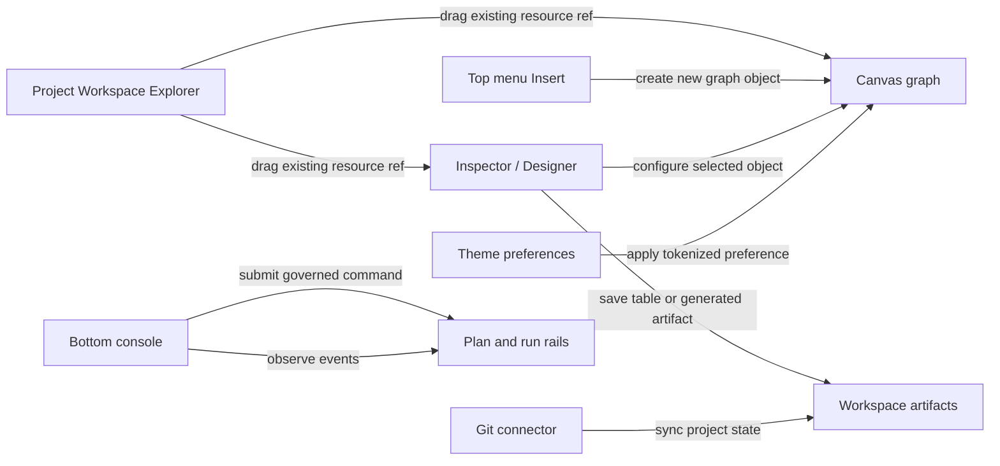

# Canvas Workspace Explorer Console Theme Modeling Plan

## Purpose

Capture the next product-level Canvas workbench opportunities before they turn
into scattered UI changes. This proposal keeps the current direction inside the
existing workbench rails: top-menu command discovery, route-local Canvas views,
contextual panels, governed commands, and Planning DB task ownership.

This is a Think-First Fowler plan. It does not implement the behavior. It
records the product intent, rail ownership, Fowler opportunities, and delivery
slices so the work can be prioritized without losing the user feedback.

## Governing Sources

- `AGENTS.md`
- `docs/planning/status/governance-document-rule-inventory.md`
- `docs/guides/ai-work-protocol.md`
- `docs/architecture/reference-architecture.md`
- `docs/architecture/command-query-rail-governance.md`
- `docs/architecture/fowler-opportunity-planning-governance.md`
- `docs/architecture/components/web/workbench-ui-contract-and-component-inventory.md`
- `docs/architecture/components/web/iconography-and-design-tokens-contract.md`
- `docs/architecture/components/web/graph/canvas-workbench-command-query-catalog.md`
- `docs/planning/proposals/mandatory/frontend-and-ux/canvas-workbench-shell-save-export-sequence-plan-20260505.md`
- `docs/planning/proposals/mandatory/frontend-and-ux/canvas-workbench-stage-1-chrome-simplification-implementation-plan-20260506.md`
- `docs/planning/proposals/mandatory/frontend-and-ux/top-menu-templates-artifact-graph-flow-plan-20260527.md`

## Product Reading

The user is asking for a product workbench, not a prototype graph renderer.
The user needs to:

- name and manage canvases;
- see all project objects, even when they are not currently rendered on the
  graph;
- drag existing resources, schemas, users, security objects, artifacts, and
  annotations into the graph or into selected cards;
- [Task: E-CANVAS-WORKSPACE-EXPLORER-1] create new node types through one clear `Insert` path only;
- configure cards deeply enough to author real dbt, SQL, and table artifacts;
- execute governed work from a console-like surface without pretending the
  browser is a raw operating-system shell;
- watch event and import logs without a banner shrinking the work area;
- change theme, global tool color, fonts, and graph grid behavior from a
  coherent preferences model;
- connect a project to Git so the saved project is not trapped in local UI
  state.

The mature product direction is closer to an operator workbench with a project
object explorer, inspector, designer, command console, and governed run flow.
It is not another left navigation rail and it is not a duplicated add-node
palette.

## Current State Findings

- The Workbench UI contract says top menus and command discovery are canonical.
- The same contract says Canvas must not include a fixed left navigation rail.
- `DbtExplorer` currently mixes three responsibilities: existing project-node
  browsing, add-node affordances, and data import copy.
- `CanvasToolbarPrimaryControls` and the top-right `Insert` surface already own
  node-type creation. Repeating node-type creation in the side panel is
  redundant and creates two product meanings for the same action.
- `BottomConsoleDrawer` currently renders run logs or an idle message. It has
  no command tab and no clear event-log taxonomy.
- `uiLayoutStore` persists Canvas grid and panel preferences locally. It does
  not yet represent a governed workbench theme preference model.
- The iconography and token contract already names font and token governance,
  including `IBM Plex Sans`, `IBM Plex Mono`, semantic surface tokens, and graph
  grid tokens.
- `InspectorPanel` is selection-driven and plugin-aware, but it is still a
  passive detail panel. Table modeling, field/type editing, and dockable
  designer behavior are not yet represented.
- The Canvas command/query catalog already owns viewport preferences, dbt node
  configuration, source origin selection, dbt artifact generation, and project
  snapshot import/export rails. The new ideas should extend that catalog rather
  than invent route-local commands.
- The previous top-menu proposal already established that Templates can save
  generated source as artifacts and that saved artifacts can become graph steps.

## Target Experience

### Top Menu

The global top menu remains the only global navigation and command discovery
surface. It should rationalize menus into product intent groups such as
`Project`, `Workbench`, `File`, `Edit`, `View`, `Insert`, `Run`, and `Help`.

`Insert` creates new objects or graph content. The side panels do not repeat
that list.

### Left Context Panel

The left contextual panel becomes a `Project Workspace Explorer`.

It lists existing things:

- canvases in the current project;
- resources discovered from imports or connectors;
- dbt project files and generated artifacts;
- schemas, tables, columns, users, roles, grants, security objects, and service
  references when a connector provides them;
- annotations and text objects;
- graph nodes currently on screen and graph objects not currently visible.

It can support drag and drop, but the drag intent is a reference or attachment
operation, not silent creation of a new node type. Creating a fresh node type
stays in `Insert`.

### Right Dockable Panel

The right panel becomes the selection-driven `Inspector / Designer` area.

It can show:

- selected node details;
- card configuration;
- dbt source/model origin selection;
- generated code preview;
- table designer with fields, types, constraints, and metadata;
- security or schema assignment when the user drags a compatible resource onto
  the selected card.

The panel should be dockable. Dock modes should include at least right-docked
and centered modeling workspace. This keeps the graph readable while allowing
serious object modeling.

### Bottom Console

The bottom console becomes a usable product console with tabs:

- `Command`: a CLI-like command surface for governed DVT/workbench commands.
- `Events`: live events, imports, saves, Git sync, plans, and run logs.

The command tab must not execute arbitrary OS shell commands from the browser.
It submits product commands through cataloged rails. A GPT assistant can later
draft commands, but the command still maps to an approved command rail and
requires explicit user execution.

### Theme Controls

Theme controls should cover more than the grid. The user should be able to set
global workbench color, font family, code font, grid color, grid density, and
possibly route accents through a governed preference object.

This should extend the design-token model, not scatter ad hoc CSS changes
across components.

### Canvas Properties

Every canvas should have a real identity and properties:

- display name;
- slug or technical id;
- environment;
- default permissions;
- project association;
- runtime kind or canvas kind;
- draft state;
- Git sync posture if available.

Creating a new canvas adds a canvas descriptor to the project. Selecting a
canvas changes the active workbench state. Renaming and property edits go
through explicit commands.

### Git Connector

Git is a project persistence and review boundary, not a header decoration.

The user should be able to bind a project to a remote, see branch/status,
commit a project snapshot or artifact changes, push, pull, and inspect sync
results through governed commands. If credentials or backend support are not
present, the UI must expose a clear unavailable state instead of fake success.

## Current To Target Flow



## Command And Query Rail Catalog

These rails are proposed for the slices below. Implementation must either reuse
an accepted rail or promote the proposed rail into the owning component catalog
before code changes.

| Rail                                  | Type    | Owning bounded context      | DDD owner                          | Application port or adapter surface | Scope and authorization                                             | Negative tests                                                                                                    |
| ------------------------------------- | ------- | --------------------------- | ---------------------------------- | ----------------------------------- | ------------------------------------------------------------------- | ----------------------------------------------------------------------------------------------------------------- |
| `ListProjectWorkspaceResources`       | query   | Project workspace explorer  | `ProjectWorkspaceResourceCatalog`  | Workspace resource query port       | Project scoped; read-only; connector-scoped capabilities            | Missing connector, unauthorized resource group, stale import, and unsupported resource kind cannot fabricate rows |
| `AttachProjectResourceToCanvasObject` | command | Canvas authoring            | `CanvasResourceAttachmentPolicy`   | Canvas draft command port           | Graph edit permission plus compatible target kind                   | Read-only draft, incompatible resource, stale draft, and missing resource reject                                  |
| `ListProjectCanvases`                 | query   | Canvas lifecycle            | `ProjectCanvasCatalogReadModel`    | Canvas lifecycle query port         | Project scoped; read-only                                           | Empty project returns an explicit empty state, not a synthetic canvas                                             |
| `CreateProjectCanvas`                 | command | Canvas lifecycle            | `ProjectCanvasDescriptor`          | Canvas lifecycle command port       | Project write permission                                            | Duplicate name, invalid environment, unavailable template, and read-only project reject                           |
| `RenameProjectCanvas`                 | command | Canvas lifecycle            | `CanvasIdentity`                   | Canvas lifecycle command port       | Canvas write permission                                             | Blank name, duplicate slug, stale descriptor, and read-only project reject                                        |
| `UpdateCanvasProperties`              | command | Canvas lifecycle            | `CanvasProperties`                 | Canvas lifecycle command port       | Canvas write permission; environment and permission policy enforced | Invalid environment, invalid default permission, and stale canvas version reject                                  |
| `CreateCanvasAnnotation`              | command | Canvas annotation authoring | `CanvasAnnotation`                 | Canvas draft command port           | Graph edit permission                                               | Read-only draft, empty annotation, unsupported bounds, and stale draft reject                                     |
| `UpdateCanvasAnnotation`              | command | Canvas annotation authoring | `CanvasAnnotation`                 | Canvas draft command port           | Graph edit permission                                               | Missing annotation, stale draft, invalid style, and empty text reject                                             |
| `SubmitWorkbenchCommand`              | command | Workbench console           | `WorkbenchCommandSubmission`       | Workbench command bus               | User/session scoped; command must map to an accepted rail           | Unknown command, unauthorized command, malformed input, and dry-run failure reject                                |
| `ListWorkbenchCommandHistory`         | query   | Workbench console           | `WorkbenchCommandHistoryReadModel` | Console query port                  | User/session scoped                                                 | History cannot reveal secrets or commands from another project                                                    |
| `ObserveWorkbenchEvents`              | query   | Workbench console           | `WorkbenchEventStreamProjection`   | Event/log stream query port         | Project/run scoped; read-only                                       | Missing run/import/git context returns empty/degraded state, not fake logs                                        |
| `GetWorkbenchThemePreferences`        | query   | Workbench preferences       | `WorkbenchThemePreference`         | Preferences query port              | User or workspace scoped                                            | Missing preference resolves defaults through token policy                                                         |
| `UpdateWorkbenchThemePreferences`     | command | Workbench preferences       | `WorkbenchThemePreference`         | Preferences command port            | User or workspace write permission                                  | Invalid color, unsupported font, and unreadable contrast reject                                                   |
| `SetWorkbenchPanelDockMode`           | command | Workbench presentation      | `WorkbenchDockPreference`          | Layout preference command port      | User presentation preference                                        | Invalid dock mode, viewport collision, and inaccessible layout reject                                             |
| `OpenTableDesigner`                   | command | Table modeling              | `TableDesignDraft`                 | Inspector/designer command port     | Selected table/model object required                                | Missing selection, unsupported object kind, and read-only draft reject                                            |
| `AddTableField`                       | command | Table modeling              | `FieldDefinition`                  | Inspector/designer command port     | Table design write permission                                       | Duplicate field name, unsupported type, and invalid nullable/default combination reject                           |
| `UpdateTableField`                    | command | Table modeling              | `FieldDefinition`                  | Inspector/designer command port     | Table design write permission                                       | Missing field, unsupported type, invalid constraint, and stale table design reject                                |
| `RemoveTableField`                    | command | Table modeling              | `TableDesignDraft`                 | Inspector/designer command port     | Table design write permission                                       | Removing required key field or referenced field rejects unless policy allows it                                   |
| `ListSupportedColumnTypes`            | query   | Table modeling              | `ColumnTypeCatalog`                | Provider capability query port      | Provider/runtime scoped; read-only                                  | Missing provider returns generic SQL fallback only if explicitly supported                                        |
| `BindProjectGitRemote`                | command | Project source control      | `ProjectGitRemoteBinding`          | Git connector command port          | Project admin permission plus credential policy                     | Invalid remote, missing credential, unsupported host, and read-only project reject                                |
| `CommitProjectSnapshot`               | command | Project source control      | `ProjectGitChangeSet`              | Git connector command port          | Project write permission                                            | Empty change set, unresolved conflict, missing identity, and stale artifact state reject                          |
| `PushProjectSnapshot`                 | command | Project source control      | `ProjectGitSyncPolicy`             | Git connector command port          | Project write permission plus remote auth                           | Diverged remote, auth failure, and rejected push produce actionable sync status                                   |
| `ObserveGitSyncStatus`                | query   | Project source control      | `ProjectGitStatusReadModel`        | Git connector query port            | Project scoped; read-only                                           | Detached, unknown, offline, and unbound states are explicit                                                       |

## Fowler Opportunity Matrix

| Scenario                                                             | Opportunity             | Fowler pattern                                      | DDD owner                                                                     | Command or query rail                                                                                    | Implementation surfaces                                                         | Unit or package test                                            | Architecture test                                                   | User-flow test                                                | Out of scope                           |
| -------------------------------------------------------------------- | ----------------------- | --------------------------------------------------- | ----------------------------------------------------------------------------- | -------------------------------------------------------------------------------------------------------- | ------------------------------------------------------------------------------- | --------------------------------------------------------------- | ------------------------------------------------------------------- | ------------------------------------------------------------- | -------------------------------------- |
| Side panel duplicates node-type insertion already owned by `Insert`. | Duplicate semantics     | Presentation Model plus command catalog convergence | `ProjectWorkspaceResourceCatalog`                                             | `ListProjectWorkspaceResources`                                                                          | `DbtExplorer`, Canvas explorer view model, top menu insert model                | Explorer model separates existing resources from create actions | Guard prevents side panel from rendering node-kind creation actions | User opens explorer and Insert and sees distinct purposes     | Removing `Insert`                      |
| Existing resources need to be dragged into graph/cards.              | Boundary drift          | Gateway and Policy Object                           | `CanvasResourceAttachmentPolicy`                                              | `AttachProjectResourceToCanvasObject`                                                                    | Explorer drag/drop adapter, Canvas draft command adapter, Inspector drop target | Resource compatibility tests                                    | No direct connector-to-draft mutation guard                         | Drag schema/user/artifact into a compatible card              | Arbitrary connector browser            |
| Multiple canvases need identity and properties.                      | Primitive obsession     | Replace Primitive with Object                       | `ProjectCanvasDescriptor`, `CanvasProperties`                                 | `ListProjectCanvases`, `CreateProjectCanvas`, `RenameProjectCanvas`, `UpdateCanvasProperties`            | Canvas selector, project explorer, canvas property panel                        | Descriptor validation and stale-version tests                   | No local-only canvas identity guard                                 | Create, rename, select, and edit canvas properties            | Multi-user conflict UI unless needed   |
| Annotations are insertable project objects.                          | Missing domain object   | Aggregate child entity                              | `CanvasAnnotation`                                                            | `CreateCanvasAnnotation`, `UpdateCanvasAnnotation`                                                       | Insert menu, graph object renderer, explorer catalog, inspector                 | Annotation validation tests                                     | Annotation objects cannot masquerade as dbt/runtime nodes           | Insert annotation, edit text, see it in explorer              | Rich diagramming suite                 |
| Console is an idle log drawer instead of a work surface.             | Responsibility overload | Command Bus plus Read Model                         | `WorkbenchCommandSubmission`, `WorkbenchEventStreamProjection`                | `SubmitWorkbenchCommand`, `ObserveWorkbenchEvents`, `ListWorkbenchCommandHistory`                        | Bottom console drawer, command parser, event stream presenter                   | Command parser and rejection tests                              | Raw OS shell commands cannot execute from browser console           | Type a product command, run it, inspect event output          | Full terminal emulator for local shell |
| Theme changes are route-local layout state.                          | Hidden authority        | Value Object plus tokenized preferences             | `WorkbenchThemePreference`                                                    | `GetWorkbenchThemePreferences`, `UpdateWorkbenchThemePreferences`                                        | Theme menu, token CSS, UI layout preference adapter                             | Theme validation and contrast tests                             | Raw color writes outside token layer fail guard                     | Change global color/font/grid and see stable UI               | Full design-system editor              |
| Table modeling is trapped inside passive node details.               | Anemic domain           | Domain Model plus Table Data Gateway                | `TableDesignDraft`, `FieldDefinition`, `ColumnTypeCatalog`                    | `OpenTableDesigner`, `AddTableField`, `UpdateTableField`, `RemoveTableField`, `ListSupportedColumnTypes` | Dockable inspector/designer, table form, dbt/source/model metadata adapter      | Field/type/constraint validation tests                          | Table fields cannot be loose metadata blobs                         | Add fields/types to table and save artifact/node config       | Complete database reverse engineering  |
| Inspector needs dockable modeling workspace.                         | Responsibility overload | Presentation Model and State Pattern                | `WorkbenchDockPreference`                                                     | `SetWorkbenchPanelDockMode`                                                                              | Workbench panel frame, right panel, centered designer surface                   | Dock mode state tests                                           | Panel layout stays route-local presentation state                   | Dock designer right and centered without losing graph context | Floating OS windows                    |
| Git context is visible but not actionable.                           | Hidden authority        | Gateway plus Anti-corruption Layer                  | `ProjectGitRemoteBinding`, `ProjectGitChangeSet`, `ProjectGitStatusReadModel` | `BindProjectGitRemote`, `CommitProjectSnapshot`, `PushProjectSnapshot`, `ObserveGitSyncStatus`           | Git connector UI, project menu, event console                                   | Git status and rejection tests                                  | UI cannot claim synced without connector receipt                    | Bind remote, commit, push, inspect status                     | Browser-only fake Git                  |
| GPT can help create diagrams through commands.                       | Hidden authority risk   | Command DTO plus explicit approval                  | `WorkbenchCommandSubmission`                                                  | `SubmitWorkbenchCommand`                                                                                 | Console command composer, future assistant adapter                              | Suggested command validation tests                              | Assistant cannot mutate graph without accepted command              | User approves generated command before graph changes          | Autonomous graph mutation              |

## Delivery Slices

### Slice 1: Project Workspace Explorer

[Task: E-CANVAS-WORKSPACE-EXPLORER-1]

Replace the current side panel meaning with a project-resource catalog. It must
list existing project resources, canvases, graph objects, artifacts, and
annotations. It must not duplicate node-type creation from `Insert`.

Primary task: `E-CANVAS-WORKSPACE-EXPLORER-1`.

### Slice 2: Canvas Properties And Lifecycle

[Task: E-CANVAS-PROPERTIES-LIFECYCLE-1]

Add real canvas descriptors and properties so a user can create, name, rename,
select, and configure canvases. Environment and default permissions are
properties, not loose labels.

Primary task: `E-CANVAS-PROPERTIES-LIFECYCLE-1`.

### Slice 3: Console Command And Event Workbench

[Task: E-CANVAS-CONSOLE-CLI-EVENTS-1]

Turn the bottom console into two tabs: command and events. The command tab is a
governed product CLI. The events tab is the canonical place for import, save,
Git, plan, and run logs.

Primary task: `E-CANVAS-CONSOLE-CLI-EVENTS-1`.

### Slice 4: Theme Controls

[Task: E-CANVAS-THEME-CONTROLS-1]

Create a governed theme preference model for global workbench color, fonts,
code font, route accents, grid density, and grid color. Route components consume
semantic tokens.

Primary task: `E-CANVAS-THEME-CONTROLS-1`.

### Slice 5: Annotations

[Task: E-CANVAS-ANNOTATIONS-1]

Add annotations as first-class Canvas/project objects. They can be inserted,
edited, listed in the explorer, and saved with the project/canvas state.

Primary task: `E-CANVAS-ANNOTATIONS-1`.

### Slice 6: Dockable Table Designer

[Task: E-TABLE-DESIGNER-DOCKABLE-PANEL-1]

Add a dockable Inspector/Designer mode for table modeling. The user can add
fields, choose supported types, set constraints or keys, and save the design
into the selected graph object or artifact path.

Primary task: `E-TABLE-DESIGNER-DOCKABLE-PANEL-1`.

### Slice 7: Git Remote Connector

[Task: E-GIT-REMOTE-CONNECTOR-1]

Turn Git from passive context into governed project persistence. The user can
bind a remote, inspect status, commit a project snapshot, push, and inspect
sync output through the console event stream.

Primary task: `E-GIT-REMOTE-CONNECTOR-1`.

## UX Placement Rules

- No new permanent left navigation rail.
- The left contextual panel is for project resources and canvases.
- `Insert` is the single node/object creation entry point.
- The right panel is for selected-object inspection and deep modeling.
- The bottom console is for command submission and event visibility.
- Technical banners must not consume the graph workspace. Degraded states
  should be compact status affordances with details in the console or status
  panel.
- Read-only mode cannot execute. The product must expose a clear path into an
  execution-capable mode when policy allows it.
- Git, import, save, run, and assistant-generated changes must produce event
  entries that the user can inspect.

## Non-Goals

- A raw browser-accessible OS shell.
- A second left navigation bar.
- [Task: E-CANVAS-WORKSPACE-EXPLORER-1] A second add-node list in the explorer.
- Fake Git sync, fake import, fake run, or fake artifact save receipts.
- A generic database admin console before table modeling has a bounded product
  owner.
- GPT-driven mutation without explicit command preview and user execution.
- Full theming as an unrestricted CSS editor.

## Test Plan

- [Task: E-CANVAS-WORKSPACE-EXPLORER-1] Unit tests for explorer grouping and the no-duplicate-create-action rule.
- Unit tests for canvas descriptor validation, property edits, and stale
  version rejection.
- Unit tests for annotation validation and graph serialization.
- Unit tests for command parser approval, denied commands, command history, and
  secret redaction.
- Unit tests for theme value validation, contrast rejection, and token mapping.
- Unit tests for table field/type/constraint validation.
- Unit tests for panel dock mode transitions and responsive fallback.
- Unit tests for Git binding, status projection, commit rejection, and push
  rejection states.
- Architecture tests proving UI surfaces call cataloged rails rather than local
  store shortcuts for product commands.
- User-flow tests for:
  - [Task: E-CANVAS-PROPERTIES-LIFECYCLE-1] create and rename canvas;
  - drag existing resource into a compatible card;
  - insert annotation and see it in explorer;
  - run a console command and inspect events;
  - edit table fields in docked designer;
  - save project changes and inspect Git status.

## Open Design Questions

- Which provider-specific resource families are first class in the first
  explorer version: dbt files, SQL tables, security objects, REST sources, or
  all through a generic resource adapter?
- Should canvas properties live in the left explorer details area or the right
  inspector when the canvas background is selected?
- Should the command console grammar be DVT-specific from day one or allow
  aliases that resemble SQL Developer and dbt CLI commands?
- Which theme values are user-level preferences and which are project-level
  preferences?
- Does table design save directly into a graph node, a workspace artifact, or a
  staged table-design artifact that can then be attached?
- What is the minimum Git connector backend required to avoid a browser-only
  fake implementation?

## Planning DB Disposition

This proposal should create or update the seven task IDs in the frontmatter.
They are deliberately split because the product opportunities are related but
not one implementation slice:

- explorer/catalog behavior;
- canvas lifecycle;
- console command/events;
- theme preferences;
- annotations;
- table designer/dockable panel;
- Git remote connector.

The highest product value sequence is:

1. `E-CANVAS-WORKSPACE-EXPLORER-1`
2. `E-CANVAS-PROPERTIES-LIFECYCLE-1`
3. `E-CANVAS-CONSOLE-CLI-EVENTS-1`
4. `E-TABLE-DESIGNER-DOCKABLE-PANEL-1`
5. `E-GIT-REMOTE-CONNECTOR-1`
6. `E-CANVAS-ANNOTATIONS-1`
7. `E-CANVAS-THEME-CONTROLS-1`

This ordering gives the user product control first: project objects, canvas
identity, commands/events, and real modeling. Theme and annotation work remain
important but should not block the core workbench loop unless their absence
blocks usability in implementation QA.

## Feature Mechanization: Workspace Explorer Slice

```feature-mechanization
version: 1
featureId: E-CANVAS-WORKSPACE-EXPLORER-1
mechanizationStatus: implemented
noHumanDecisionsRemaining: true
implementationPlan: docs/planning/proposals/mandatory/frontend-and-ux/canvas-workspace-explorer-console-theme-modeling-plan-20260527.md
componentGuides:
  - docs/architecture/components/web/graph/canvas-workspace-explorer-component.md
  - docs/architecture/components/web/graph/canvas-ready-node-authoring-entrypoint-component.md
  - docs/architecture/components/web/graph/canvas-shell-component.md
userStories:
  - docs/architecture/components/web/graph/canvas-workspace-explorer-user-stories.md
  - docs/architecture/components/web/graph/canvas-ready-node-authoring-user-stories.md
governingSources:
  - AGENTS.md
  - docs/planning/status/governance-document-rule-inventory.md
  - docs/guides/ai-work-protocol.md
  - docs/architecture/command-query-rail-governance.md
  - docs/architecture/fowler-opportunity-planning-governance.md
  - docs/architecture/components/web/graph/canvas-workbench-command-query-catalog.md
  - docs/planning/reviews/architecture-and-governance/20260527-canvas-workspace-explorer-fowler-review.md
allowedImplementationSurfaces:
  - apps/web/src/app/components/DbtExplorer.tsx
  - apps/web/src/app/components/DbtExplorer.test.tsx
  - apps/web/src/app/components/canvasWorkspaceExplorerModel.ts
  - apps/web/src/app/components/canvasWorkspaceExplorerModel.test.ts
  - apps/web/src/app/views/canvas/CanvasShell.tsx
  - apps/web/src/app/views/canvas/CanvasShell.test.tsx
  - apps/web/src/app/views/canvas/CanvasShell.architecture.test.tsx
  - apps/web/src/app/views/canvas/canvasShell.types.ts
  - apps/web/src/app/views/canvas/canvasShellPanelsBuilder.ts
  - apps/web/src/app/views/canvas/canvasShellPanelsBuilder.test.ts
  - docs/.manifest.json
  - docs/architecture/components/web/graph/canvas-ready-node-authoring-entrypoint-component.md
  - docs/architecture/components/web/graph/canvas-ready-node-authoring-user-stories.md
  - docs/architecture/components/web/graph/canvas-shell-component.md
  - docs/architecture/components/web/graph/canvas-workbench-command-query-catalog.md
  - docs/architecture/components/web/graph/canvas-workspace-explorer-component.md
  - docs/architecture/components/web/graph/canvas-workspace-explorer-user-stories.md
  - docs/architecture/components/web/graph/graph-frontend-architecture.md
  - docs/planning/proposals/mandatory/frontend-and-ux/canvas-workspace-explorer-console-theme-modeling-plan-20260527.md
  - docs/planning/reviews/architecture-and-governance/20260527-canvas-workspace-explorer-fowler-review.md
forbiddenImplementationSurfaces:
  - apps/api/**
  - packages/**
  - specs/**
commandQueryRails:
  - name: ListProjectWorkspaceResources
    type: query
    dddOwner: ProjectWorkspaceResourceCatalog
  - name: AttachProjectResourceToCanvasObject
    type: command
    dddOwner: CanvasResourceAttachmentPolicy
domainObjects:
  - name: ProjectWorkspaceResourceCatalog
    type: read model
    owner: Canvas workspace explorer
  - name: CanvasWorkspaceResource
    type: value object
    owner: Canvas workspace explorer
  - name: CanvasWorkspaceResourceGroup
    type: read model
    owner: Canvas workspace explorer
  - name: CanvasResourceAttachmentPolicy
    type: policy
    owner: Canvas authoring
fowlerSignals:
  - Duplicate semantics
  - Primitive obsession
  - Responsibility overload
  - Test-only confidence
  - Documentation drift
architectureGuards:
  - pnpm --filter @dvt/web test -- src/app/views/canvas/CanvasShell.architecture.test.tsx
  - pnpm docs:feature-mechanization:implementation -- --feature E-CANVAS-WORKSPACE-EXPLORER-1
cypressFlows:
  - N/A - this slice is model and shell composition; full resource drag flow remains in AttachProjectResourceToCanvasObject
completionGate:
  - pnpm docs:feature-mechanization -- --feature E-CANVAS-WORKSPACE-EXPLORER-1
  - pnpm --filter @dvt/web test -- src/app/components/canvasWorkspaceExplorerModel.test.ts src/app/components/DbtExplorer.test.tsx src/app/views/canvas/CanvasShell.test.tsx src/app/views/canvas/CanvasShell.architecture.test.tsx src/app/views/canvas/canvasShellPanelsBuilder.test.ts
  - pnpm --filter @dvt/web typecheck
  - pnpm --filter @dvt/web lint
  - pnpm lint:md:changed
  - pnpm planning:db:check
  - pnpm governance:refresh
  - pnpm docs:feature-mechanization:implementation -- --feature E-CANVAS-WORKSPACE-EXPLORER-1
  - pnpm ci:docs
  - pnpm verify:prepush
redGreenCycles:
  - id: workspace-explorer-read-model
    redTest: pnpm --filter @dvt/web test -- src/app/components/canvasWorkspaceExplorerModel.test.ts
    expectedFailure: No read model projects the active canvas and existing graph resources into explorer groups.
    patchSurfaces:
      - apps/web/src/app/components/canvasWorkspaceExplorerModel.ts
      - apps/web/src/app/components/canvasWorkspaceExplorerModel.test.ts
    greenTest: pnpm --filter @dvt/web test -- src/app/components/canvasWorkspaceExplorerModel.test.ts
  - id: workspace-explorer-no-create-duplication # E-CANVAS-WORKSPACE-EXPLORER-1
    redTest: pnpm --filter @dvt/web test -- src/app/components/DbtExplorer.test.tsx src/app/views/canvas/CanvasShell.architecture.test.tsx
    expectedFailure: The explorer still accepts node-kind creation props or renders add-node behavior outside Insert.
    patchSurfaces:
      - apps/web/src/app/components/DbtExplorer.tsx
      - apps/web/src/app/components/DbtExplorer.test.tsx
      - apps/web/src/app/views/canvas/CanvasShell.tsx
      - apps/web/src/app/views/canvas/CanvasShell.architecture.test.tsx
    greenTest: pnpm --filter @dvt/web test -- src/app/components/DbtExplorer.test.tsx src/app/views/canvas/CanvasShell.architecture.test.tsx
  - id: workspace-explorer-shell-composition
    redTest: pnpm --filter @dvt/web test -- src/app/views/canvas/CanvasShell.test.tsx src/app/views/canvas/canvasShellPanelsBuilder.test.ts
    expectedFailure: Canvas shell composition still passes raw explorer nodes instead of resource groups.
    patchSurfaces:
      - apps/web/src/app/views/canvas/CanvasShell.tsx
      - apps/web/src/app/views/canvas/CanvasShell.test.tsx
      - apps/web/src/app/views/canvas/canvasShell.types.ts
      - apps/web/src/app/views/canvas/canvasShellPanelsBuilder.ts
      - apps/web/src/app/views/canvas/canvasShellPanelsBuilder.test.ts
    greenTest: pnpm --filter @dvt/web test -- src/app/views/canvas/CanvasShell.test.tsx src/app/views/canvas/canvasShellPanelsBuilder.test.ts
symbols:
  - name: CanvasWorkspaceResourceType
    path: apps/web/src/app/components/canvasWorkspaceExplorerModel.ts
    dddOwner: CanvasWorkspaceResource
    cqRails: [ListProjectWorkspaceResources]
    fowlerSignals: [Primitive obsession]
    architectureGuard: pnpm --filter @dvt/web test -- src/app/views/canvas/CanvasShell.architecture.test.tsx
    cypressCoverage: N/A - read model
    unitTests: [pnpm --filter @dvt/web test -- src/app/components/canvasWorkspaceExplorerModel.test.ts]
  - name: CanvasWorkspaceExplorerCanvasDocument
    path: apps/web/src/app/components/canvasWorkspaceExplorerModel.ts
    dddOwner: ProjectWorkspaceResourceCatalog
    cqRails: [ListProjectWorkspaceResources]
    fowlerSignals: [Primitive obsession]
    architectureGuard: pnpm --filter @dvt/web test -- src/app/views/canvas/CanvasShell.architecture.test.tsx
    cypressCoverage: N/A - read model
    unitTests: [pnpm --filter @dvt/web test -- src/app/components/canvasWorkspaceExplorerModel.test.ts]
  - name: CanvasWorkspaceExplorerModelInput
    path: apps/web/src/app/components/canvasWorkspaceExplorerModel.ts
    dddOwner: ProjectWorkspaceResourceCatalog
    cqRails: [ListProjectWorkspaceResources]
    fowlerSignals: [Data clump]
    architectureGuard: pnpm --filter @dvt/web test -- src/app/views/canvas/CanvasShell.architecture.test.tsx
    cypressCoverage: N/A - read model
    unitTests: [pnpm --filter @dvt/web test -- src/app/components/canvasWorkspaceExplorerModel.test.ts]
  - name: CanvasWorkspaceResource
    path: apps/web/src/app/components/canvasWorkspaceExplorerModel.ts
    dddOwner: CanvasWorkspaceResource
    cqRails: [ListProjectWorkspaceResources]
    fowlerSignals: [Primitive obsession]
    architectureGuard: pnpm --filter @dvt/web test -- src/app/views/canvas/CanvasShell.architecture.test.tsx
    cypressCoverage: N/A - read model
    unitTests: [pnpm --filter @dvt/web test -- src/app/components/canvasWorkspaceExplorerModel.test.ts]
  - name: CanvasWorkspaceResourceGroup
    path: apps/web/src/app/components/canvasWorkspaceExplorerModel.ts
    dddOwner: CanvasWorkspaceResourceGroup
    cqRails: [ListProjectWorkspaceResources]
    fowlerSignals: [Responsibility overload]
    architectureGuard: pnpm --filter @dvt/web test -- src/app/views/canvas/CanvasShell.architecture.test.tsx
    cypressCoverage: N/A - read model
    unitTests: [pnpm --filter @dvt/web test -- src/app/components/canvasWorkspaceExplorerModel.test.ts]
  - name: resolveNodeBadgeText
    path: apps/web/src/app/components/canvasWorkspaceExplorerModel.ts
    dddOwner: CanvasWorkspaceResource
    cqRails: [ListProjectWorkspaceResources]
    fowlerSignals: [Primitive obsession]
    architectureGuard: pnpm --filter @dvt/web test -- src/app/views/canvas/CanvasShell.architecture.test.tsx
    cypressCoverage: N/A - read model helper
    unitTests: [pnpm --filter @dvt/web test -- src/app/components/canvasWorkspaceExplorerModel.test.ts]
  - name: resolveNodeDetailText
    path: apps/web/src/app/components/canvasWorkspaceExplorerModel.ts
    dddOwner: CanvasWorkspaceResource
    cqRails: [ListProjectWorkspaceResources]
    fowlerSignals: [Primitive obsession]
    architectureGuard: pnpm --filter @dvt/web test -- src/app/views/canvas/CanvasShell.architecture.test.tsx
    cypressCoverage: N/A - read model helper
    unitTests: [pnpm --filter @dvt/web test -- src/app/components/canvasWorkspaceExplorerModel.test.ts]
  - name: mapNodeToWorkspaceResource
    path: apps/web/src/app/components/canvasWorkspaceExplorerModel.ts
    dddOwner: CanvasWorkspaceResource
    cqRails: [ListProjectWorkspaceResources]
    fowlerSignals: [Feature envy]
    architectureGuard: pnpm --filter @dvt/web test -- src/app/views/canvas/CanvasShell.architecture.test.tsx
    cypressCoverage: N/A - read model helper
    unitTests: [pnpm --filter @dvt/web test -- src/app/components/canvasWorkspaceExplorerModel.test.ts]
  - name: buildCanvasResourceGroup
    path: apps/web/src/app/components/canvasWorkspaceExplorerModel.ts
    dddOwner: ProjectWorkspaceResourceCatalog
    cqRails: [ListProjectWorkspaceResources]
    fowlerSignals: [Duplicate semantics]
    architectureGuard: pnpm --filter @dvt/web test -- src/app/views/canvas/CanvasShell.architecture.test.tsx
    cypressCoverage: N/A - read model helper
    unitTests: [pnpm --filter @dvt/web test -- src/app/components/canvasWorkspaceExplorerModel.test.ts]
  - name: buildNodeResourceGroups
    path: apps/web/src/app/components/canvasWorkspaceExplorerModel.ts
    dddOwner: ProjectWorkspaceResourceCatalog
    cqRails: [ListProjectWorkspaceResources]
    fowlerSignals: [Responsibility overload]
    architectureGuard: pnpm --filter @dvt/web test -- src/app/views/canvas/CanvasShell.architecture.test.tsx
    cypressCoverage: N/A - read model helper
    unitTests: [pnpm --filter @dvt/web test -- src/app/components/canvasWorkspaceExplorerModel.test.ts]
  - name: buildCanvasWorkspaceResourceGroups
    path: apps/web/src/app/components/canvasWorkspaceExplorerModel.ts
    dddOwner: ProjectWorkspaceResourceCatalog
    cqRails: [ListProjectWorkspaceResources]
    fowlerSignals: [Responsibility overload, Test-only confidence]
    architectureGuard: pnpm --filter @dvt/web test -- src/app/views/canvas/CanvasShell.architecture.test.tsx
    cypressCoverage: N/A - read model
    unitTests: [pnpm --filter @dvt/web test -- src/app/components/canvasWorkspaceExplorerModel.test.ts]
  - name: mockResolveNodeKindRegistration
    path: apps/web/src/app/components/canvasWorkspaceExplorerModel.test.ts
    dddOwner: Canvas workspace explorer test seam
    cqRails: [ListProjectWorkspaceResources]
    fowlerSignals: [Test-only confidence]
    architectureGuard: pnpm docs:feature-mechanization:implementation -- --feature E-CANVAS-WORKSPACE-EXPLORER-1
    cypressCoverage: N/A - unit test seam
    unitTests: [pnpm --filter @dvt/web test -- src/app/components/canvasWorkspaceExplorerModel.test.ts]
  - name: buildNode
    path: apps/web/src/app/components/canvasWorkspaceExplorerModel.test.ts
    dddOwner: Canvas workspace explorer test fixture
    cqRails: [ListProjectWorkspaceResources]
    fowlerSignals: [Test-only confidence]
    architectureGuard: pnpm docs:feature-mechanization:implementation -- --feature E-CANVAS-WORKSPACE-EXPLORER-1
    cypressCoverage: N/A - unit test fixture
    unitTests: [pnpm --filter @dvt/web test -- src/app/components/canvasWorkspaceExplorerModel.test.ts]
  - name: CANVAS_TOOLBAR_PRIMARY_CONTROLS_SOURCE
    path: apps/web/src/app/views/canvas/CanvasShell.architecture.test.tsx
    dddOwner: Canvas shell architecture guard
    cqRails: [ListProjectWorkspaceResources]
    fowlerSignals: [Test-only confidence]
    architectureGuard: pnpm --filter @dvt/web test -- src/app/views/canvas/CanvasShell.architecture.test.tsx
    cypressCoverage: N/A - architecture guard
    unitTests: [pnpm --filter @dvt/web test -- src/app/views/canvas/CanvasShell.architecture.test.tsx]
  - name: CANVAS_ADD_NODE_PALETTE_SOURCE
    path: apps/web/src/app/views/canvas/CanvasShell.architecture.test.tsx
    dddOwner: Canvas shell architecture guard
    cqRails: [ListProjectWorkspaceResources]
    fowlerSignals: [Test-only confidence]
    architectureGuard: pnpm --filter @dvt/web test -- src/app/views/canvas/CanvasShell.architecture.test.tsx
    cypressCoverage: N/A - architecture guard
    unitTests: [pnpm --filter @dvt/web test -- src/app/views/canvas/CanvasShell.architecture.test.tsx]
  - name: CANVAS_WORKSPACE_EXPLORER_MODEL_SOURCE
    path: apps/web/src/app/views/canvas/CanvasShell.architecture.test.tsx
    dddOwner: Canvas shell architecture guard
    cqRails: [ListProjectWorkspaceResources]
    fowlerSignals: [Test-only confidence]
    architectureGuard: pnpm --filter @dvt/web test -- src/app/views/canvas/CanvasShell.architecture.test.tsx
    cypressCoverage: N/A - architecture guard
    unitTests: [pnpm --filter @dvt/web test -- src/app/views/canvas/CanvasShell.architecture.test.tsx]
  - name: normalizeCanvasKind
    path: apps/web/src/app/views/canvas/canvasShellPanelsBuilder.ts
    dddOwner: Canvas shell panel builder
    cqRails: [ListProjectWorkspaceResources]
    fowlerSignals: [Primitive obsession]
    architectureGuard: pnpm --filter @dvt/web test -- src/app/views/canvas/CanvasShell.architecture.test.tsx
    cypressCoverage: N/A - shell builder helper
    unitTests: [pnpm --filter @dvt/web test -- src/app/views/canvas/canvasShellPanelsBuilder.test.ts]
  - name: resolveActiveCanvasAuthoringNodeKinds
    path: apps/web/src/app/views/canvas/canvasShellPanelsBuilder.ts
    dddOwner: Canvas shell panel builder
    cqRails: [ListProjectWorkspaceResources]
    fowlerSignals: [Duplicate semantics]
    architectureGuard: pnpm --filter @dvt/web test -- src/app/views/canvas/CanvasShell.architecture.test.tsx
    cypressCoverage: N/A - shell builder helper
    unitTests: [pnpm --filter @dvt/web test -- src/app/views/canvas/canvasShellPanelsBuilder.test.ts]
```
