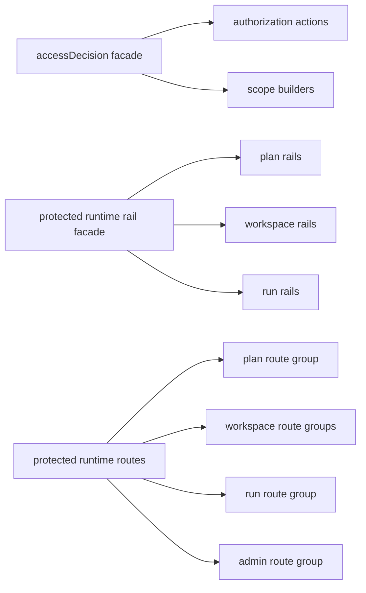

---
title: Code Workbench File Length Refactor
status: Accepted
date: 2026-05-04
owners:
  - api
  - web
planning_type: mandatory
feature_id: CODE-WORKBENCH-FILE-LENGTH-REFACTOR
---

# Code Workbench File Length Refactor

## Decision

The Code Workbench workspace-files slice must not leave hand-authored files
above 200 lines. Generated governance indexes remain mechanical artifacts and
are exempt from this local readability rule.

## Rationale

The product rail is correct, but existing composition files had absorbed
unrelated concerns. Mature systems keep route composition, C&Q catalogs, and
authorization vocabulary navigable by owned concern instead of using large
central files as integration bins.



```feature-mechanization
version: 1
featureId: CODE-WORKBENCH-FILE-LENGTH-REFACTOR
mechanizationStatus: closed
noHumanDecisionsRemaining: true
implementationPlan: docs/planning/proposals/mandatory/frontend-and-ux/code-workbench-file-length-refactor-20260504.md
componentGuides:
  - apps/api/docs/protected-runtime-route-group-component.md
  - docs/architecture/components/web/code-workbench-workspace-files-component.md
userStories:
  - docs/architecture/components/web/code-workbench-workspace-files-user-stories.md
governingSources:
  - AGENTS.md
  - docs/planning/status/governance-document-rule-inventory.md
  - docs/architecture/command-query-rail-governance.md
  - docs/architecture/fowler-opportunity-planning-governance.md
allowedImplementationSurfaces:
  - apps/api/src/application/ports/accessDecision.ts
  - apps/api/src/application/ports/accessDecisionActions.ts
  - apps/api/src/application/ports/accessDecisionScopes.ts
  - apps/api/src/application/ports/protectedRuntimeCommandQueryRails.ts
  - apps/api/src/application/ports/protectedRuntimeCommandQueryRailTypes.ts
  - apps/api/src/application/ports/protectedRuntimePlanCommandQueryRails.ts
  - apps/api/src/application/ports/protectedRuntimeRailVocabulary.ts
  - apps/api/src/application/ports/protectedRuntimeRunCommandQueryRails.ts
  - apps/api/src/application/ports/protectedRuntimeRunRailVocabulary.ts
  - apps/api/src/application/ports/protectedRuntimeWorkspaceCommandQueryRails.ts
  - apps/api/src/entrypoints/http/registerProtectedRuntimeRoutes.ts
  - apps/api/src/entrypoints/http/protectedRuntimeAdminRouteGroup.ts
  - apps/api/src/entrypoints/http/protectedRuntimePlanRoutes.ts
  - apps/api/src/entrypoints/http/protectedRuntimeRouteDependencies.ts
  - apps/api/src/entrypoints/http/protectedRuntimeRunRoutes.ts
  - apps/api/src/entrypoints/http/protectedRuntimeWorkspaceGraphDraftRouteGroup.ts
  - apps/api/test/application/services/applicationArchitectureAst.support.ts
  - apps/api/test/application/services/executableSubgraphResolutionArchitecture.support.ts
  - apps/api/test/application/services/executableSubgraphResolutionComponent.architecture.test.ts
  - apps/api/test/entrypoints/http/httpRuntimeErrorTranslation.architecture.test.ts
  - docs/planning/proposals/mandatory/frontend-and-ux/code-workbench-file-length-refactor-20260504.md
  - apps/api/test/entrypoints/http/startRunControlBoundary.architecture.test.ts
  - apps/api/test/modules/protectedRuntimeAndPlanCompileArchitecture.cases.ts
forbiddenImplementationSurfaces:
  - packages/@dvt/contracts/**
  - packages/@dvt/engine/**
  - packages/@dvt/adapter-*/**
commandQueryRails:
  - { name: ListWorkspaceFiles, type: query, dddOwner: WorkspaceFileTree }
  - { name: GetWorkspaceFileContent, type: query, dddOwner: WorkspaceFileContent }
domainObjects:
  - ProtectedRuntimeRailCatalog
  - ProtectedRuntimeRouteComposition
  - WorkspaceFileReadPolicy
fowlerSignals:
  - Responsibility overload
  - Duplicate semantics
  - Data clump
architectureGuards:
  - apps/api/test/architecture/workspaceFilesQueryRail.architecture.test.ts
  - apps/api/test/entrypoints/http/protectedRuntimeRouteGroup.architecture.test.ts
  - apps/api/test/application/services/executableSubgraphResolutionComponent.architecture.test.ts
  - apps/api/test/entrypoints/http/httpRuntimeErrorTranslation.architecture.test.ts
  - apps/api/test/entrypoints/http/startRunControlBoundary.architecture.test.ts
  - apps/api/test/modules/protectedRuntimeAndPlanCompileArchitecture.cases.ts
cypressFlows:
  - pnpm --filter @dvt/web test:e2e:native -- --spec cypress/e2e/canvas/code-workbench-workspace-files.cy.ts
completionGate:
  - pnpm docs:feature-mechanization:implementation
  - pnpm --filter dvt-api test -- workspaceFilesQueryRail.architecture.test.ts protectedRuntimeRouteGroup.architecture.test.ts registerProtectedRuntimeRoutes.test.ts workspaceFilesRoutes.test.ts
  - pnpm verify:prepush
redGreenCycles:
  - id: code-workbench-file-length-refactor
    redTest: pnpm docs:feature-mechanization:implementation
    expectedFailure: Split files are rejected before this manifest declares their surfaces and symbols.
    patchSurfaces:
      - docs/planning/proposals/mandatory/frontend-and-ux/code-workbench-file-length-refactor-20260504.md
    greenTest: pnpm docs:feature-mechanization:implementation
symbols:
  - { name: APPLICATION_ROOT, path: apps/api/test/application/services/executableSubgraphResolutionArchitecture.support.ts, dddOwner: ExecutableSubgraphResolutionArchitectureGuard, cqRails: [ListWorkspaceFiles, GetWorkspaceFileContent], fowlerSignals: [Responsibility overload], architectureGuard: apps/api/test/application/services/executableSubgraphResolutionComponent.architecture.test.ts, cypressCoverage: apps/web/cypress/e2e/canvas/code-workbench-workspace-files.cy.ts, unitTests: [apps/api/test/modules/protectedRuntimeAndPlanCompileArchitecture.cases.ts] }
  - { name: DOCS_ROOT, path: apps/api/test/application/services/executableSubgraphResolutionArchitecture.support.ts, dddOwner: ExecutableSubgraphResolutionArchitectureGuard, cqRails: [ListWorkspaceFiles, GetWorkspaceFileContent], fowlerSignals: [Responsibility overload], architectureGuard: apps/api/test/application/services/executableSubgraphResolutionComponent.architecture.test.ts, cypressCoverage: apps/web/cypress/e2e/canvas/code-workbench-workspace-files.cy.ts, unitTests: [apps/api/test/modules/protectedRuntimeAndPlanCompileArchitecture.cases.ts] }
  - { name: ENTRYPOINTS_HTTP_ROOT, path: apps/api/test/application/services/executableSubgraphResolutionArchitecture.support.ts, dddOwner: ExecutableSubgraphResolutionArchitectureGuard, cqRails: [ListWorkspaceFiles, GetWorkspaceFileContent], fowlerSignals: [Responsibility overload], architectureGuard: apps/api/test/application/services/executableSubgraphResolutionComponent.architecture.test.ts, cypressCoverage: apps/web/cypress/e2e/canvas/code-workbench-workspace-files.cy.ts, unitTests: [apps/api/test/modules/protectedRuntimeAndPlanCompileArchitecture.cases.ts] }
  - { name: EXECUTABLE_SUBGRAPH_RESOLUTION_COMPONENT, path: apps/api/test/application/services/executableSubgraphResolutionArchitecture.support.ts, dddOwner: ExecutableSubgraphResolutionArchitectureGuard, cqRails: [ListWorkspaceFiles, GetWorkspaceFileContent], fowlerSignals: [Responsibility overload], architectureGuard: apps/api/test/application/services/executableSubgraphResolutionComponent.architecture.test.ts, cypressCoverage: apps/web/cypress/e2e/canvas/code-workbench-workspace-files.cy.ts, unitTests: [apps/api/test/modules/protectedRuntimeAndPlanCompileArchitecture.cases.ts] }
  - { name: HTTP_DOMAIN_ERROR_CLASSIFIER_SOURCE, path: apps/api/test/entrypoints/http/httpRuntimeErrorTranslation.architecture.test.ts, dddOwner: HttpErrorTranslationArchitectureGuard, cqRails: [ListWorkspaceFiles, GetWorkspaceFileContent], fowlerSignals: [Responsibility overload], architectureGuard: apps/api/test/entrypoints/http/httpRuntimeErrorTranslation.architecture.test.ts, cypressCoverage: apps/web/cypress/e2e/canvas/code-workbench-workspace-files.cy.ts, unitTests: [apps/api/test/entrypoints/http/workspaceFilesRoutes.test.ts] }
  - { name: MODULES_ROOT, path: apps/api/test/application/services/executableSubgraphResolutionArchitecture.support.ts, dddOwner: ExecutableSubgraphResolutionArchitectureGuard, cqRails: [ListWorkspaceFiles, GetWorkspaceFileContent], fowlerSignals: [Responsibility overload], architectureGuard: apps/api/test/application/services/executableSubgraphResolutionComponent.architecture.test.ts, cypressCoverage: apps/web/cypress/e2e/canvas/code-workbench-workspace-files.cy.ts, unitTests: [apps/api/test/modules/protectedRuntimeAndPlanCompileArchitecture.cases.ts] }
  - { name: AUTHORIZATION_ACTION, path: apps/api/src/application/ports/accessDecisionActions.ts, dddOwner: WorkspaceFileReadPolicy, cqRails: [ListWorkspaceFiles, GetWorkspaceFileContent], fowlerSignals: [Responsibility overload], architectureGuard: apps/api/test/architecture/workspaceFilesQueryRail.architecture.test.ts, cypressCoverage: apps/web/cypress/e2e/canvas/code-workbench-workspace-files.cy.ts, unitTests: [apps/api/test/entrypoints/http/workspaceFilesRoutes.test.ts] }
  - { name: AUTHORIZATION_ACTION_NAME, path: apps/api/src/application/ports/accessDecisionActions.ts, dddOwner: WorkspaceFileReadPolicy, cqRails: [ListWorkspaceFiles, GetWorkspaceFileContent], fowlerSignals: [Responsibility overload], architectureGuard: apps/api/test/architecture/workspaceFilesQueryRail.architecture.test.ts, cypressCoverage: apps/web/cypress/e2e/canvas/code-workbench-workspace-files.cy.ts, unitTests: [apps/api/test/entrypoints/http/workspaceFilesRoutes.test.ts] }
  - { name: AuthorizationAction, path: apps/api/src/application/ports/accessDecisionActions.ts, dddOwner: WorkspaceFileReadPolicy, cqRails: [ListWorkspaceFiles, GetWorkspaceFileContent], fowlerSignals: [Responsibility overload], architectureGuard: apps/api/test/architecture/workspaceFilesQueryRail.architecture.test.ts, cypressCoverage: apps/web/cypress/e2e/canvas/code-workbench-workspace-files.cy.ts, unitTests: [apps/api/test/entrypoints/http/workspaceFilesRoutes.test.ts] }
  - { name: CommandAuthorizationAction, path: apps/api/src/application/ports/accessDecisionActions.ts, dddOwner: WorkspaceFileReadPolicy, cqRails: [ListWorkspaceFiles, GetWorkspaceFileContent], fowlerSignals: [Responsibility overload], architectureGuard: apps/api/test/architecture/workspaceFilesQueryRail.architecture.test.ts, cypressCoverage: apps/web/cypress/e2e/canvas/code-workbench-workspace-files.cy.ts, unitTests: [apps/api/test/entrypoints/http/workspaceFilesRoutes.test.ts] }
  - { name: CommandAuthorizationActionName, path: apps/api/src/application/ports/accessDecisionActions.ts, dddOwner: WorkspaceFileReadPolicy, cqRails: [ListWorkspaceFiles, GetWorkspaceFileContent], fowlerSignals: [Responsibility overload], architectureGuard: apps/api/test/architecture/workspaceFilesQueryRail.architecture.test.ts, cypressCoverage: apps/web/cypress/e2e/canvas/code-workbench-workspace-files.cy.ts, unitTests: [apps/api/test/entrypoints/http/workspaceFilesRoutes.test.ts] }
  - { name: QueryAuthorizationAction, path: apps/api/src/application/ports/accessDecisionActions.ts, dddOwner: WorkspaceFileReadPolicy, cqRails: [ListWorkspaceFiles, GetWorkspaceFileContent], fowlerSignals: [Responsibility overload], architectureGuard: apps/api/test/architecture/workspaceFilesQueryRail.architecture.test.ts, cypressCoverage: apps/web/cypress/e2e/canvas/code-workbench-workspace-files.cy.ts, unitTests: [apps/api/test/entrypoints/http/workspaceFilesRoutes.test.ts] }
  - { name: QueryAuthorizationActionName, path: apps/api/src/application/ports/accessDecisionActions.ts, dddOwner: WorkspaceFileReadPolicy, cqRails: [ListWorkspaceFiles, GetWorkspaceFileContent], fowlerSignals: [Responsibility overload], architectureGuard: apps/api/test/architecture/workspaceFilesQueryRail.architecture.test.ts, cypressCoverage: apps/web/cypress/e2e/canvas/code-workbench-workspace-files.cy.ts, unitTests: [apps/api/test/entrypoints/http/workspaceFilesRoutes.test.ts] }
  - { name: ACCESS_SCOPE_RESOURCE, path: apps/api/src/application/ports/accessDecisionScopes.ts, dddOwner: WorkspaceFileReadPolicy, cqRails: [ListWorkspaceFiles, GetWorkspaceFileContent], fowlerSignals: [Responsibility overload], architectureGuard: apps/api/test/architecture/workspaceFilesQueryRail.architecture.test.ts, cypressCoverage: apps/web/cypress/e2e/canvas/code-workbench-workspace-files.cy.ts, unitTests: [apps/api/test/entrypoints/http/workspaceFilesRoutes.test.ts] }
  - { name: AccessScopeResource, path: apps/api/src/application/ports/accessDecisionScopes.ts, dddOwner: WorkspaceFileReadPolicy, cqRails: [ListWorkspaceFiles, GetWorkspaceFileContent], fowlerSignals: [Responsibility overload], architectureGuard: apps/api/test/architecture/workspaceFilesQueryRail.architecture.test.ts, cypressCoverage: apps/web/cypress/e2e/canvas/code-workbench-workspace-files.cy.ts, unitTests: [apps/api/test/entrypoints/http/workspaceFilesRoutes.test.ts] }
  - { name: EnvironmentAccessScope, path: apps/api/src/application/ports/accessDecisionScopes.ts, dddOwner: WorkspaceFileReadPolicy, cqRails: [ListWorkspaceFiles, GetWorkspaceFileContent], fowlerSignals: [Responsibility overload], architectureGuard: apps/api/test/architecture/workspaceFilesQueryRail.architecture.test.ts, cypressCoverage: apps/web/cypress/e2e/canvas/code-workbench-workspace-files.cy.ts, unitTests: [apps/api/test/entrypoints/http/workspaceFilesRoutes.test.ts] }
  - { name: ExecutionScope, path: apps/api/src/application/ports/accessDecisionScopes.ts, dddOwner: WorkspaceFileReadPolicy, cqRails: [ListWorkspaceFiles, GetWorkspaceFileContent], fowlerSignals: [Responsibility overload], architectureGuard: apps/api/test/architecture/workspaceFilesQueryRail.architecture.test.ts, cypressCoverage: apps/web/cypress/e2e/canvas/code-workbench-workspace-files.cy.ts, unitTests: [apps/api/test/entrypoints/http/workspaceFilesRoutes.test.ts] }
  - { name: ProjectAccessScope, path: apps/api/src/application/ports/accessDecisionScopes.ts, dddOwner: WorkspaceFileReadPolicy, cqRails: [ListWorkspaceFiles, GetWorkspaceFileContent], fowlerSignals: [Responsibility overload], architectureGuard: apps/api/test/architecture/workspaceFilesQueryRail.architecture.test.ts, cypressCoverage: apps/web/cypress/e2e/canvas/code-workbench-workspace-files.cy.ts, unitTests: [apps/api/test/entrypoints/http/workspaceFilesRoutes.test.ts] }
  - { name: TenantAccessScope, path: apps/api/src/application/ports/accessDecisionScopes.ts, dddOwner: WorkspaceFileReadPolicy, cqRails: [ListWorkspaceFiles, GetWorkspaceFileContent], fowlerSignals: [Responsibility overload], architectureGuard: apps/api/test/architecture/workspaceFilesQueryRail.architecture.test.ts, cypressCoverage: apps/web/cypress/e2e/canvas/code-workbench-workspace-files.cy.ts, unitTests: [apps/api/test/entrypoints/http/workspaceFilesRoutes.test.ts] }
  - { name: WorkspaceGraphDraftAccessScope, path: apps/api/src/application/ports/accessDecisionScopes.ts, dddOwner: WorkspaceFileReadPolicy, cqRails: [ListWorkspaceFiles, GetWorkspaceFileContent], fowlerSignals: [Responsibility overload], architectureGuard: apps/api/test/architecture/workspaceFilesQueryRail.architecture.test.ts, cypressCoverage: apps/web/cypress/e2e/canvas/code-workbench-workspace-files.cy.ts, unitTests: [apps/api/test/entrypoints/http/workspaceFilesRoutes.test.ts] }
  - { name: buildEnvironmentAccessScope, path: apps/api/src/application/ports/accessDecisionScopes.ts, dddOwner: WorkspaceFileReadPolicy, cqRails: [ListWorkspaceFiles, GetWorkspaceFileContent], fowlerSignals: [Responsibility overload], architectureGuard: apps/api/test/architecture/workspaceFilesQueryRail.architecture.test.ts, cypressCoverage: apps/web/cypress/e2e/canvas/code-workbench-workspace-files.cy.ts, unitTests: [apps/api/test/entrypoints/http/workspaceFilesRoutes.test.ts] }
  - { name: buildProjectAccessScope, path: apps/api/src/application/ports/accessDecisionScopes.ts, dddOwner: WorkspaceFileReadPolicy, cqRails: [ListWorkspaceFiles, GetWorkspaceFileContent], fowlerSignals: [Responsibility overload], architectureGuard: apps/api/test/architecture/workspaceFilesQueryRail.architecture.test.ts, cypressCoverage: apps/web/cypress/e2e/canvas/code-workbench-workspace-files.cy.ts, unitTests: [apps/api/test/entrypoints/http/workspaceFilesRoutes.test.ts] }
  - { name: buildTenantAccessScope, path: apps/api/src/application/ports/accessDecisionScopes.ts, dddOwner: WorkspaceFileReadPolicy, cqRails: [ListWorkspaceFiles, GetWorkspaceFileContent], fowlerSignals: [Responsibility overload], architectureGuard: apps/api/test/architecture/workspaceFilesQueryRail.architecture.test.ts, cypressCoverage: apps/web/cypress/e2e/canvas/code-workbench-workspace-files.cy.ts, unitTests: [apps/api/test/entrypoints/http/workspaceFilesRoutes.test.ts] }
  - { name: buildWorkspaceGraphDraftAccessScope, path: apps/api/src/application/ports/accessDecisionScopes.ts, dddOwner: WorkspaceFileReadPolicy, cqRails: [ListWorkspaceFiles, GetWorkspaceFileContent], fowlerSignals: [Responsibility overload], architectureGuard: apps/api/test/architecture/workspaceFilesQueryRail.architecture.test.ts, cypressCoverage: apps/web/cypress/e2e/canvas/code-workbench-workspace-files.cy.ts, unitTests: [apps/api/test/entrypoints/http/workspaceFilesRoutes.test.ts] }
  - { name: CANONICAL_PROTECTED_RUNTIME_RAIL_POSTURE, path: apps/api/src/application/ports/protectedRuntimeCommandQueryRailTypes.ts, dddOwner: ProtectedRuntimeRailCatalog, cqRails: [ListWorkspaceFiles, GetWorkspaceFileContent], fowlerSignals: [Responsibility overload], architectureGuard: apps/api/test/architecture/workspaceFilesQueryRail.architecture.test.ts, cypressCoverage: apps/web/cypress/e2e/canvas/code-workbench-workspace-files.cy.ts, unitTests: [apps/api/test/entrypoints/http/workspaceFilesRoutes.test.ts] }
  - { name: ProtectedRuntimeCommandQueryRail, path: apps/api/src/application/ports/protectedRuntimeCommandQueryRailTypes.ts, dddOwner: ProtectedRuntimeRailCatalog, cqRails: [ListWorkspaceFiles, GetWorkspaceFileContent], fowlerSignals: [Responsibility overload], architectureGuard: apps/api/test/architecture/workspaceFilesQueryRail.architecture.test.ts, cypressCoverage: apps/web/cypress/e2e/canvas/code-workbench-workspace-files.cy.ts, unitTests: [apps/api/test/entrypoints/http/workspaceFilesRoutes.test.ts] }
  - { name: ProtectedRuntimeCompatibilityPosture, path: apps/api/src/application/ports/protectedRuntimeCommandQueryRailTypes.ts, dddOwner: ProtectedRuntimeRailCatalog, cqRails: [ListWorkspaceFiles, GetWorkspaceFileContent], fowlerSignals: [Responsibility overload], architectureGuard: apps/api/test/architecture/workspaceFilesQueryRail.architecture.test.ts, cypressCoverage: apps/web/cypress/e2e/canvas/code-workbench-workspace-files.cy.ts, unitTests: [apps/api/test/entrypoints/http/workspaceFilesRoutes.test.ts] }
  - { name: ProtectedRuntimeNegativeCoverage, path: apps/api/src/application/ports/protectedRuntimeCommandQueryRailTypes.ts, dddOwner: ProtectedRuntimeRailCatalog, cqRails: [ListWorkspaceFiles, GetWorkspaceFileContent], fowlerSignals: [Responsibility overload], architectureGuard: apps/api/test/architecture/workspaceFilesQueryRail.architecture.test.ts, cypressCoverage: apps/web/cypress/e2e/canvas/code-workbench-workspace-files.cy.ts, unitTests: [apps/api/test/entrypoints/http/workspaceFilesRoutes.test.ts] }
  - { name: ProtectedRuntimeRailKind, path: apps/api/src/application/ports/protectedRuntimeCommandQueryRailTypes.ts, dddOwner: ProtectedRuntimeRailCatalog, cqRails: [ListWorkspaceFiles, GetWorkspaceFileContent], fowlerSignals: [Responsibility overload], architectureGuard: apps/api/test/architecture/workspaceFilesQueryRail.architecture.test.ts, cypressCoverage: apps/web/cypress/e2e/canvas/code-workbench-workspace-files.cy.ts, unitTests: [apps/api/test/entrypoints/http/workspaceFilesRoutes.test.ts] }
  - { name: RailInput, path: apps/api/src/application/ports/protectedRuntimeCommandQueryRailTypes.ts, dddOwner: ProtectedRuntimeRailCatalog, cqRails: [ListWorkspaceFiles, GetWorkspaceFileContent], fowlerSignals: [Responsibility overload], architectureGuard: apps/api/test/architecture/workspaceFilesQueryRail.architecture.test.ts, cypressCoverage: apps/web/cypress/e2e/canvas/code-workbench-workspace-files.cy.ts, unitTests: [apps/api/test/entrypoints/http/workspaceFilesRoutes.test.ts] }
  - { name: defineProtectedRuntimeRail, path: apps/api/src/application/ports/protectedRuntimeCommandQueryRailTypes.ts, dddOwner: ProtectedRuntimeRailCatalog, cqRails: [ListWorkspaceFiles, GetWorkspaceFileContent], fowlerSignals: [Duplicate semantics], architectureGuard: apps/api/test/architecture/workspaceFilesQueryRail.architecture.test.ts, cypressCoverage: apps/web/cypress/e2e/canvas/code-workbench-workspace-files.cy.ts, unitTests: [apps/api/test/entrypoints/http/workspaceFilesRoutes.test.ts] }
  - { name: normalizeTestRefs, path: apps/api/src/application/ports/protectedRuntimeCommandQueryRailTypes.ts, dddOwner: ProtectedRuntimeRailCatalog, cqRails: [ListWorkspaceFiles, GetWorkspaceFileContent], fowlerSignals: [Duplicate semantics], architectureGuard: apps/api/test/architecture/workspaceFilesQueryRail.architecture.test.ts, cypressCoverage: apps/web/cypress/e2e/canvas/code-workbench-workspace-files.cy.ts, unitTests: [apps/api/test/entrypoints/http/workspaceFilesRoutes.test.ts] }
  - { name: PROTECTED_RUNTIME_PLAN_COMMAND_QUERY_RAILS, path: apps/api/src/application/ports/protectedRuntimePlanCommandQueryRails.ts, dddOwner: ProtectedRuntimeRailCatalog, cqRails: [ListWorkspaceFiles, GetWorkspaceFileContent], fowlerSignals: [Responsibility overload], architectureGuard: apps/api/test/architecture/workspaceFilesQueryRail.architecture.test.ts, cypressCoverage: apps/web/cypress/e2e/canvas/code-workbench-workspace-files.cy.ts, unitTests: [apps/api/test/entrypoints/http/workspaceFilesRoutes.test.ts] }
  - { name: PROTECTED_RUNTIME_NEGATIVE_CASE, path: apps/api/src/application/ports/protectedRuntimeRailVocabulary.ts, dddOwner: ProtectedRuntimeRailCatalog, cqRails: [ListWorkspaceFiles, GetWorkspaceFileContent], fowlerSignals: [Duplicate semantics], architectureGuard: apps/api/test/architecture/workspaceFilesQueryRail.architecture.test.ts, cypressCoverage: apps/web/cypress/e2e/canvas/code-workbench-workspace-files.cy.ts, unitTests: [apps/api/test/entrypoints/http/workspaceFilesRoutes.test.ts] }
  - { name: PROTECTED_RUNTIME_PLAN_RAIL, path: apps/api/src/application/ports/protectedRuntimeRailVocabulary.ts, dddOwner: ProtectedRuntimeRailCatalog, cqRails: [ListWorkspaceFiles, GetWorkspaceFileContent], fowlerSignals: [Duplicate semantics], architectureGuard: apps/api/test/architecture/workspaceFilesQueryRail.architecture.test.ts, cypressCoverage: apps/web/cypress/e2e/canvas/code-workbench-workspace-files.cy.ts, unitTests: [apps/api/test/entrypoints/http/workspaceFilesRoutes.test.ts] }
  - { name: PROTECTED_RUNTIME_RAIL_KIND, path: apps/api/src/application/ports/protectedRuntimeRailVocabulary.ts, dddOwner: ProtectedRuntimeRailCatalog, cqRails: [ListWorkspaceFiles, GetWorkspaceFileContent], fowlerSignals: [Duplicate semantics], architectureGuard: apps/api/test/architecture/workspaceFilesQueryRail.architecture.test.ts, cypressCoverage: apps/web/cypress/e2e/canvas/code-workbench-workspace-files.cy.ts, unitTests: [apps/api/test/entrypoints/http/workspaceFilesRoutes.test.ts] }
  - { name: PROTECTED_RUNTIME_TEST_REF, path: apps/api/src/application/ports/protectedRuntimeRailVocabulary.ts, dddOwner: ProtectedRuntimeRailCatalog, cqRails: [ListWorkspaceFiles, GetWorkspaceFileContent], fowlerSignals: [Duplicate semantics], architectureGuard: apps/api/test/architecture/workspaceFilesQueryRail.architecture.test.ts, cypressCoverage: apps/web/cypress/e2e/canvas/code-workbench-workspace-files.cy.ts, unitTests: [apps/api/test/entrypoints/http/workspaceFilesRoutes.test.ts] }
  - { name: PROTECTED_RUNTIME_WORKSPACE_RAIL, path: apps/api/src/application/ports/protectedRuntimeRailVocabulary.ts, dddOwner: ProtectedRuntimeRailCatalog, cqRails: [ListWorkspaceFiles, GetWorkspaceFileContent], fowlerSignals: [Duplicate semantics], architectureGuard: apps/api/test/architecture/workspaceFilesQueryRail.architecture.test.ts, cypressCoverage: apps/web/cypress/e2e/canvas/code-workbench-workspace-files.cy.ts, unitTests: [apps/api/test/entrypoints/http/workspaceFilesRoutes.test.ts] }
  - { name: PROTECTED_RUNTIME_RUN_COMPATIBILITY_POLICY, path: apps/api/src/application/ports/protectedRuntimeRunRailVocabulary.ts, dddOwner: ProtectedRuntimeRailCatalog, cqRails: [ListWorkspaceFiles, GetWorkspaceFileContent], fowlerSignals: [Duplicate semantics], architectureGuard: apps/api/test/architecture/workspaceFilesQueryRail.architecture.test.ts, cypressCoverage: apps/web/cypress/e2e/canvas/code-workbench-workspace-files.cy.ts, unitTests: [apps/api/test/entrypoints/http/workspaceFilesRoutes.test.ts] }
  - { name: PROTECTED_RUNTIME_RUN_RAIL, path: apps/api/src/application/ports/protectedRuntimeRunRailVocabulary.ts, dddOwner: ProtectedRuntimeRailCatalog, cqRails: [ListWorkspaceFiles, GetWorkspaceFileContent], fowlerSignals: [Duplicate semantics], architectureGuard: apps/api/test/architecture/workspaceFilesQueryRail.architecture.test.ts, cypressCoverage: apps/web/cypress/e2e/canvas/code-workbench-workspace-files.cy.ts, unitTests: [apps/api/test/entrypoints/http/workspaceFilesRoutes.test.ts] }
  - { name: PROTECTED_RUNTIME_RUN_COMMAND_QUERY_RAILS, path: apps/api/src/application/ports/protectedRuntimeRunCommandQueryRails.ts, dddOwner: ProtectedRuntimeRailCatalog, cqRails: [ListWorkspaceFiles, GetWorkspaceFileContent], fowlerSignals: [Responsibility overload], architectureGuard: apps/api/test/architecture/workspaceFilesQueryRail.architecture.test.ts, cypressCoverage: apps/web/cypress/e2e/canvas/code-workbench-workspace-files.cy.ts, unitTests: [apps/api/test/entrypoints/http/workspaceFilesRoutes.test.ts] }
  - { name: PROTECTED_RUNTIME_WORKSPACE_COMMAND_QUERY_RAILS, path: apps/api/src/application/ports/protectedRuntimeWorkspaceCommandQueryRails.ts, dddOwner: ProtectedRuntimeRailCatalog, cqRails: [ListWorkspaceFiles, GetWorkspaceFileContent], fowlerSignals: [Responsibility overload], architectureGuard: apps/api/test/architecture/workspaceFilesQueryRail.architecture.test.ts, cypressCoverage: apps/web/cypress/e2e/canvas/code-workbench-workspace-files.cy.ts, unitTests: [apps/api/test/entrypoints/http/workspaceFilesRoutes.test.ts] }
  - { name: buildWorkspaceFileNegativeCoverage, path: apps/api/src/application/ports/protectedRuntimeWorkspaceCommandQueryRails.ts, dddOwner: ProtectedRuntimeRailCatalog, cqRails: [ListWorkspaceFiles, GetWorkspaceFileContent], fowlerSignals: [Duplicate semantics], architectureGuard: apps/api/test/architecture/workspaceFilesQueryRail.architecture.test.ts, cypressCoverage: apps/web/cypress/e2e/canvas/code-workbench-workspace-files.cy.ts, unitTests: [apps/api/test/entrypoints/http/workspaceFilesRoutes.test.ts] }
  - { name: registerProtectedAdminRouteGroup, path: apps/api/src/entrypoints/http/protectedRuntimeAdminRouteGroup.ts, dddOwner: ProtectedRuntimeRouteComposition, cqRails: [ListWorkspaceFiles, GetWorkspaceFileContent], fowlerSignals: [Responsibility overload], architectureGuard: apps/api/test/architecture/workspaceFilesQueryRail.architecture.test.ts, cypressCoverage: apps/web/cypress/e2e/canvas/code-workbench-workspace-files.cy.ts, unitTests: [apps/api/test/entrypoints/http/workspaceFilesRoutes.test.ts] }
  - { name: registerProtectedPlanRoutes, path: apps/api/src/entrypoints/http/protectedRuntimePlanRoutes.ts, dddOwner: ProtectedRuntimeRouteComposition, cqRails: [ListWorkspaceFiles, GetWorkspaceFileContent], fowlerSignals: [Responsibility overload], architectureGuard: apps/api/test/architecture/workspaceFilesQueryRail.architecture.test.ts, cypressCoverage: apps/web/cypress/e2e/canvas/code-workbench-workspace-files.cy.ts, unitTests: [apps/api/test/entrypoints/http/workspaceFilesRoutes.test.ts] }
  - { name: BuildProtectedRuntimeRouteDependenciesOptions, path: apps/api/src/entrypoints/http/protectedRuntimeRouteDependencies.ts, dddOwner: ProtectedRuntimeRouteComposition, cqRails: [ListWorkspaceFiles, GetWorkspaceFileContent], fowlerSignals: [Data clump], architectureGuard: apps/api/test/architecture/workspaceFilesQueryRail.architecture.test.ts, cypressCoverage: apps/web/cypress/e2e/canvas/code-workbench-workspace-files.cy.ts, unitTests: [apps/api/test/entrypoints/http/workspaceFilesRoutes.test.ts] }
  - { name: ProtectedRuntimeRouteDependencies, path: apps/api/src/entrypoints/http/protectedRuntimeRouteDependencies.ts, dddOwner: ProtectedRuntimeRouteComposition, cqRails: [ListWorkspaceFiles, GetWorkspaceFileContent], fowlerSignals: [Data clump], architectureGuard: apps/api/test/architecture/workspaceFilesQueryRail.architecture.test.ts, cypressCoverage: apps/web/cypress/e2e/canvas/code-workbench-workspace-files.cy.ts, unitTests: [apps/api/test/entrypoints/http/workspaceFilesRoutes.test.ts] }
  - { name: RuntimeAuth, path: apps/api/src/entrypoints/http/protectedRuntimeRouteDependencies.ts, dddOwner: ProtectedRuntimeRouteComposition, cqRails: [ListWorkspaceFiles, GetWorkspaceFileContent], fowlerSignals: [Data clump], architectureGuard: apps/api/test/architecture/workspaceFilesQueryRail.architecture.test.ts, cypressCoverage: apps/web/cypress/e2e/canvas/code-workbench-workspace-files.cy.ts, unitTests: [apps/api/test/entrypoints/http/workspaceFilesRoutes.test.ts] }
  - { name: buildProtectedRuntimeRouteDependencies, path: apps/api/src/entrypoints/http/protectedRuntimeRouteDependencies.ts, dddOwner: ProtectedRuntimeRouteComposition, cqRails: [ListWorkspaceFiles, GetWorkspaceFileContent], fowlerSignals: [Data clump], architectureGuard: apps/api/test/architecture/workspaceFilesQueryRail.architecture.test.ts, cypressCoverage: apps/web/cypress/e2e/canvas/code-workbench-workspace-files.cy.ts, unitTests: [apps/api/test/entrypoints/http/workspaceFilesRoutes.test.ts] }
  - { name: registerProtectedRunRoutes, path: apps/api/src/entrypoints/http/protectedRuntimeRunRoutes.ts, dddOwner: ProtectedRuntimeRouteComposition, cqRails: [ListWorkspaceFiles, GetWorkspaceFileContent], fowlerSignals: [Responsibility overload], architectureGuard: apps/api/test/architecture/workspaceFilesQueryRail.architecture.test.ts, cypressCoverage: apps/web/cypress/e2e/canvas/code-workbench-workspace-files.cy.ts, unitTests: [apps/api/test/entrypoints/http/workspaceFilesRoutes.test.ts] }
  - { name: registerProtectedWorkspaceGraphDraftRouteGroup, path: apps/api/src/entrypoints/http/protectedRuntimeWorkspaceGraphDraftRouteGroup.ts, dddOwner: ProtectedRuntimeRouteComposition, cqRails: [ListWorkspaceFiles, GetWorkspaceFileContent], fowlerSignals: [Responsibility overload], architectureGuard: apps/api/test/architecture/workspaceFilesQueryRail.architecture.test.ts, cypressCoverage: apps/web/cypress/e2e/canvas/code-workbench-workspace-files.cy.ts, unitTests: [apps/api/test/entrypoints/http/workspaceFilesRoutes.test.ts] }
```
