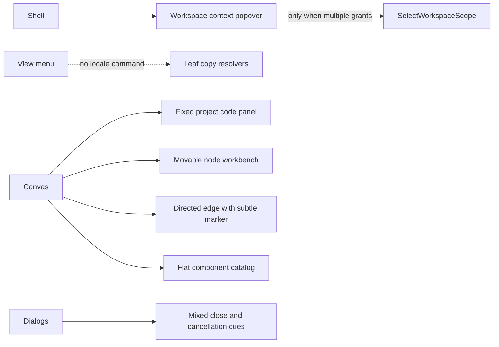
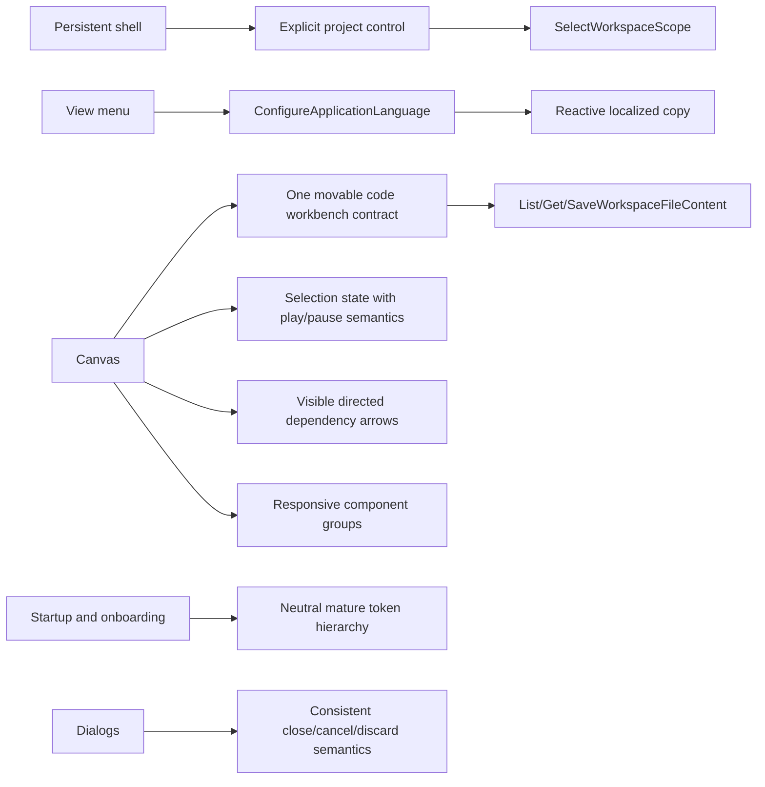

# CUX1 And WUX1 Workbench UX Convergence Plan

## Think-First Analysis

Problem summary: the active web workbench exposes the governed project, Canvas,
code, and execution capabilities, but their presentation does not yet form a
coherent novice-accessible workflow. Project switching is hidden inside context,
language is inferred independently by multiple copy resolvers, project code uses
a fixed panel, node execution copy and icons disagree, graph direction is too
subtle, component creation lacks a responsive grouped hierarchy, startup visuals
overuse saturated blue, and dialog cancellation is inconsistent.

Root causes:

- workspace selection has a valid `SelectWorkspaceScope` command but no durable,
  explicit shell affordance when only one scope is currently granted;
- locale detection is repeated at presentation leaves instead of being owned by
  one application preference value object;
- project and node code surfaces do not share the same movable contextual
  workbench interaction contract;
- some controls communicate state through labels while their icons still imply
  a different command;
- graph direction relies on a low-contrast marker despite an existing directed
  edge projection;
- component taxonomy exists in the model but the catalog view flattens it;
- base tokens are operationally sound, but startup composition does not yet use
  the neutral-first visual hierarchy required by the design-token contract;
- cancel, close, and discard behaviors are implemented per dialog without one
  reviewable presentation rule.

### Current-state flow



### Target flow and solution rationale



Selected option: converge the behavior inside the existing shell, Canvas,
workspace-file, execution-selection, and run-cancellation rails. Add only the
missing local command `ConfigureApplicationLanguage`, backed by a single
observable application-language preference. Extend the canonical manual and
design contracts rather than creating a second UX authority.

Rejected alternatives:

- A second project picker route. Rejected because `SelectWorkspaceScope` already
  owns the intent and a parallel route would split authorization semantics.
- Per-component language state. Rejected because it preserves stale mixed-language
  screens and duplicate authority.
- Generated or reconstructed node snippets. Rejected because exact workspace
  files already have governed query and save rails.
- A second modal framework or design system. Rejected because the existing shell,
  Radix primitives, Lucide icons, and semantic tokens are canonical.
- Generic client-side cancellation. Rejected because only cancellable domain work
  may use its owning cancellation rail; dismissing a dialog is not `CancelRun`.

## Pre-Implementation Brief

Execution mode: Full. This slice spans two epics, shell-wide language state,
cross-screen visual/accessibility behavior, and several Canvas interactions.

Behavioral invariants:

- only server-granted workspace scopes can be selected;
- changing language changes visible and accessible copy without reloading;
- the chosen language persists locally and never mutates domain data;
- code actions open the exact governed workspace file for the selected target;
- moving or closing a workbench cannot silently discard unsaved code;
- execution selection remains independent from run lifecycle cancellation;
- edges remain the projection of graph dependencies, with no second edge model;
- every overlay has an accessible name, keyboard exit, and visible close or
  cancel action appropriate to its semantics;
- all reviewed screens remain usable at desktop and narrow viewport sizes.

Allowed surfaces are limited to `apps/web`, the canonical web architecture and
manual documents, governed Planning DB projections, Cypress evidence, and the
closeout/evidence documents for this slice. Backend, contract, engine, adapter,
and planner semantics are out of scope.

## Fowler Matrix

| Scenario                                                    | Opportunity         | Fowler pattern                      | DDD owner                                       | Command/query rail                                                                                      | Proof                                              | Out of scope             |
| ----------------------------------------------------------- | ------------------- | ----------------------------------- | ----------------------------------------------- | ------------------------------------------------------------------------------------------------------- | -------------------------------------------------- | ------------------------ |
| A novice finds and changes the active project.              | Hidden authority    | Intention-Revealing Interface       | Workspace scope selection                       | `GetEffectiveWorkspaceContext`, `SelectWorkspaceScope`                                                  | selector unit/integration and keyboard test        | inventing grants         |
| A user changes Spanish/English from View.                   | Duplicate semantics | Value Object, Presentation Model    | Application language preference                 | `ConfigureApplicationLanguage`                                                                          | store, menu, persistence, reactive copy tests      | backend locale profile   |
| A user opens project or selected-node code.                 | Divergent change    | Contextual Workbench, Repository    | Workspace file content                          | `ListWorkspaceFiles`, `GetWorkspaceFileContent`, `SaveWorkspaceFileContent`, `ResolveCanvasContextMenu` | exact-path and movable workbench tests             | fabricated snippets      |
| A user understands execution selection and graph direction. | Primitive obsession | State, Presentation Model           | Canvas execution selection and graph projection | `CollectCanvasExecutionSelection`, `RenderCanvasGraphBase`                                              | icon/label and marker tests                        | run scheduling semantics |
| A user adds a component on any supported viewport.          | Feature envy        | Catalog, Presenter                  | Canvas authoring catalog                        | `CreateCanvasAuthoringNode`                                                                             | grouped catalog and responsive tests               | new node kinds           |
| A user starts, navigates, and dismisses safely.             | Shotgun surgery     | Design tokens, Command              | Shell presentation and owning dialog command    | existing route queries; `CancelRun` only for runs                                                       | visual, axe, focus, cancel/discard tests           | new modal framework      |
| An unfamiliar demanding user completes the manual.          | Missing evidence    | Acceptance Test, Published Language | Screen manual                                   | all rails above                                                                                         | independent critical report against committed head | self-attestation         |

```feature-mechanization
version: 1
featureId: WORKBENCH-UX-CONVERGENCE-20260806
mechanizationStatus: implemented
noHumanDecisionsRemaining: true
implementationPlan: docs/planning/proposals/mandatory/frontend-and-ux/cux1-wux1-workbench-ux-convergence-plan-20260806.md
componentGuides:
  - docs/architecture/components/web/screen-manuals-and-user-stories.md
  - docs/architecture/components/web/iconography-and-design-tokens-contract.md
  - docs/architecture/components/web/appshell/shell-workspace-context-component.md
  - docs/architecture/components/web/graph/canvas-view-menu-component.md
  - docs/architecture/components/web/graph/canvas-interaction-command-surface-component.md
  - docs/architecture/components/web/graph/canvas-workbench-command-query-catalog.md
userStories:
  - docs/architecture/components/web/appshell/shell-workspace-context-user-stories.md
  - docs/architecture/components/web/graph/canvas-view-menu-user-stories.md
  - docs/architecture/components/web/graph/canvas-interaction-command-surface-user-stories.md
  - docs/architecture/components/web/workbench-ux-canon-user-stories.md
governingSources:
  - AGENTS.md
  - docs/planning/status/governance-document-rule-inventory.md
  - docs/guides/ai-work-protocol.md
  - docs/architecture/command-query-rail-governance.md
  - docs/architecture/fowler-opportunity-planning-governance.md
  - docs/architecture/components/web/frontend-command-query-rail-inventory.md
  - docs/architecture/components/web/iconography-and-design-tokens-contract.md
  - docs/architecture/components/web/screen-manuals-and-user-stories.md
allowedImplementationSurfaces:
  - apps/web/index.html
  - apps/web/src/**
  - apps/web/package.json
  - apps/web/cypress/**
  - pnpm-lock.yaml
  - docs/architecture/components/web/**
  - docs/planning/closeouts/**
  - docs/planning/proposals/mandatory/frontend-and-ux/cux1-wux1-workbench-ux-convergence-plan-20260806.md
  - docs/planning/reviews/20260806-cux1-wux1-novice-fowler-qa-review.md
  - docs/planning/status/**
  - docs/evidence/**
  - docs/guides/**
forbiddenImplementationSurfaces:
  - apps/api/**
  - packages/@dvt/contracts/**
  - packages/@dvt/engine/**
  - packages/@dvt/adapter-*/**
  - packages/@dvt/planner/**
  - specs/**
commandQueryRails:
  - name: ConfigureApplicationLanguage
    type: command
    status: implemented
    dddOwner: ApplicationLanguagePreference value object
  - name: SelectWorkspaceScope
    type: command
    dddOwner: Workspace scope selection
  - name: GetEffectiveWorkspaceContext
    type: query
    dddOwner: Workspace context read model
  - name: ListWorkspaceFiles
    type: query
    dddOwner: Workspace file tree read model
  - name: GetWorkspaceFileContent
    type: query
    dddOwner: Workspace file content read model
  - name: SaveWorkspaceFileContent
    type: command
    dddOwner: Workspace file content aggregate
  - name: CollectCanvasExecutionSelection
    type: query
    dddOwner: Canvas execution selection
  - name: RenderCanvasGraphBase
    type: query
    dddOwner: Canvas graph projection
  - name: CreateCanvasAuthoringNode
    type: command
    dddOwner: Canvas authoring graph
  - name: CancelRun
    type: command
    dddOwner: Run aggregate
domainObjects:
  - name: ApplicationLanguagePreference
    type: value object
    owner: Application presentation
  - name: WorkspaceScopeSelection
    type: application service
    owner: Protected workspace session
  - name: ContextualCodeWorkbench
    type: presenter
    owner: Canvas and workspace files
  - name: CanvasComponentCatalog
    type: catalog
    owner: Canvas authoring
fowlerSignals:
  - Hidden authority
  - Duplicate semantics
  - Divergent change
  - Primitive obsession
  - Feature envy
  - Shotgun surgery
architectureGuards:
  - pnpm --filter @dvt/web test:architecture
cypressFlows:
  - pnpm --filter @dvt/web test:e2e:native -- --spec cypress/e2e/shell/canvas-workbench-screen-composition.cy.ts
completionGate:
  - pnpm docs:feature-mechanization -- --feature WORKBENCH-UX-CONVERGENCE-20260806
  - pnpm --filter @dvt/web test
  - pnpm --filter @dvt/web test:architecture
  - pnpm --filter @dvt/web typecheck
  - pnpm --filter @dvt/web lint
  - pnpm --filter @dvt/web test:e2e:native -- --spec cypress/e2e/shell/canvas-workbench-screen-composition.cy.ts
  - pnpm docs:feature-mechanization:implementation -- --feature WORKBENCH-UX-CONVERGENCE-20260806
  - pnpm verify:prepush
redGreenCycles:
  - id: application-language
    redTest: pnpm --filter @dvt/web test -- src/app/stores/applicationLanguageStore.test.ts src/app/views/canvas/CanvasViewMenuControls.test.tsx
    expectedFailure: No observable persisted application-language command or View menu choice exists.
    patchSurfaces:
      - apps/web/src/app/stores/applicationLanguageStore.ts
      - apps/web/src/app/views/canvas/**
      - apps/web/src/app/components/shell/**
    greenTest: pnpm --filter @dvt/web test -- src/app/stores/applicationLanguageStore.test.ts src/app/views/canvas/CanvasViewMenuControls.test.tsx
  - id: project-and-code-discoverability
    redTest: pnpm --filter @dvt/web test -- src/app/components/shell/ShellWorkspaceScopeSelector.test.tsx src/app/views/canvas/dbtProjectFileCodeWorkbench.test.tsx
    expectedFailure: Project choice is hidden and project code cannot be moved like node code.
    patchSurfaces:
      - apps/web/src/app/components/shell/**
      - apps/web/src/app/views/canvas/**
    greenTest: pnpm --filter @dvt/web test -- src/app/components/shell/ShellWorkspaceScopeSelector.test.tsx src/app/views/canvas/dbtProjectFileCodeWorkbench.test.tsx
  - id: canvas-meaning-and-layout
    redTest: pnpm --filter @dvt/web test -- src/app/components/canvas/canvasNodeContextMenuModel.test.ts src/app/views/canvas/canvasNodeMapper.test.ts src/app/views/canvas/CanvasAddNodeCatalogView.test.tsx
    expectedFailure: Selection icon, edge marker visibility, and catalog hierarchy do not express their meaning consistently.
    patchSurfaces:
      - apps/web/src/app/components/canvas/**
      - apps/web/src/app/views/canvas/**
    greenTest: pnpm --filter @dvt/web test -- src/app/components/canvas/canvasNodeContextMenuModel.test.ts src/app/views/canvas/canvasNodeMapper.test.ts src/app/views/canvas/CanvasAddNodeCatalogView.test.tsx
  - id: cross-screen-visual-accessibility
    redTest: pnpm --filter @dvt/web test -- src/app/bootstrap/appBootstrapScreen.test.ts src/app/components/ui/Modals.test.tsx
    expectedFailure: Startup hierarchy and cancel/close semantics are not covered by the demanding-user contract.
    patchSurfaces:
      - apps/web/src/app/bootstrap/**
      - apps/web/src/app/components/**
      - apps/web/src/styles/**
      - apps/web/cypress/**
    greenTest: pnpm --filter @dvt/web test -- src/app/bootstrap/appBootstrapScreen.test.ts src/app/components/ui/Modals.test.tsx
symbols:
  - name: configureApplicationLanguage
    path: apps/web/src/app/stores/applicationLanguageStore.ts
    dddOwner: ApplicationLanguagePreference
    cqRails: [ConfigureApplicationLanguage]
    fowlerSignals: [Hidden authority, Duplicate semantics]
    architectureGuard: pnpm --filter @dvt/web test:architecture
    cypressCoverage: apps/web/cypress/e2e/shell/canvas-workbench-screen-composition.cy.ts
    unitTests: [pnpm --filter @dvt/web test -- src/app/stores/applicationLanguageStore.test.ts]
  - name: ShellWorkspaceScopeSelector
    path: apps/web/src/app/components/shell/ShellWorkspaceScopeSelector.tsx
    dddOwner: WorkspaceScopeSelection
    cqRails: [SelectWorkspaceScope, GetEffectiveWorkspaceContext]
    fowlerSignals: [Intention-Revealing Interface]
    architectureGuard: pnpm --filter @dvt/web test:architecture
    cypressCoverage: apps/web/cypress/e2e/shell/canvas-workbench-screen-composition.cy.ts
    unitTests: [pnpm --filter @dvt/web test -- src/app/components/shell/ShellWorkspaceScopeSelector.test.tsx]
  - name: DbtProjectFileCodeWorkbench
    path: apps/web/src/app/views/canvas/dbtProjectFileCodeWorkbench.tsx
    dddOwner: ContextualCodeWorkbench
    cqRails: [ListWorkspaceFiles, GetWorkspaceFileContent, SaveWorkspaceFileContent]
    fowlerSignals: [Divergent change]
    architectureGuard: pnpm --filter @dvt/web test:architecture
    cypressCoverage: apps/web/cypress/e2e/shell/canvas-workbench-screen-composition.cy.ts
    unitTests: [pnpm --filter @dvt/web test -- src/app/views/canvas/dbtProjectFileCodeWorkbench.test.tsx]
  - name: CanvasAddNodeCatalogView
    path: apps/web/src/app/views/canvas/CanvasAddNodeCatalogView.tsx
    dddOwner: CanvasComponentCatalog
    cqRails: [CreateCanvasAuthoringNode]
    fowlerSignals: [Feature envy]
    architectureGuard: pnpm --filter @dvt/web test:architecture
    cypressCoverage: apps/web/cypress/e2e/shell/canvas-workbench-screen-composition.cy.ts
    unitTests: [pnpm --filter @dvt/web test -- src/app/views/canvas/CanvasAddNodeCatalogView.test.tsx]
  - name: ALTERNATE_MODEL_PATH
    path: apps/web/cypress/e2e/shell/canvas-workbench-screen-composition.cy.ts
    dddOwner: ContextualCodeWorkbench
    cqRails: [GetWorkspaceFileContent]
    fowlerSignals: [Primitive obsession]
    architectureGuard: pnpm --filter @dvt/web test:architecture
    cypressCoverage: apps/web/cypress/e2e/shell/canvas-workbench-screen-composition.cy.ts
    unitTests: [pnpm --filter @dvt/web test:e2e:native -- --spec cypress/e2e/shell/canvas-workbench-screen-composition.cy.ts]
  - name: ALTERNATE_MODEL_SQL
    path: apps/web/cypress/e2e/shell/canvas-workbench-screen-composition.cy.ts
    dddOwner: ContextualCodeWorkbench
    cqRails: [GetWorkspaceFileContent]
    fowlerSignals: [Primitive obsession]
    architectureGuard: pnpm --filter @dvt/web test:architecture
    cypressCoverage: apps/web/cypress/e2e/shell/canvas-workbench-screen-composition.cy.ts
    unitTests: [pnpm --filter @dvt/web test:e2e:native -- --spec cypress/e2e/shell/canvas-workbench-screen-composition.cy.ts]
  - name: ALTERNATE_WORKSPACE_SESSION
    path: apps/web/cypress/e2e/shell/canvas-workbench-screen-composition.cy.ts
    dddOwner: WorkspaceScopeSelection
    cqRails: [SelectWorkspaceScope, GetEffectiveWorkspaceContext]
    fowlerSignals: [Hidden authority]
    architectureGuard: pnpm --filter @dvt/web test:architecture
    cypressCoverage: apps/web/cypress/e2e/shell/canvas-workbench-screen-composition.cy.ts
    unitTests: [pnpm --filter @dvt/web test:e2e:native -- --spec cypress/e2e/shell/canvas-workbench-screen-composition.cy.ts]
  - name: MODEL_PATH
    path: apps/web/cypress/e2e/shell/canvas-workbench-screen-composition.cy.ts
    dddOwner: ContextualCodeWorkbench
    cqRails: [GetWorkspaceFileContent]
    fowlerSignals: [Primitive obsession]
    architectureGuard: pnpm --filter @dvt/web test:architecture
    cypressCoverage: apps/web/cypress/e2e/shell/canvas-workbench-screen-composition.cy.ts
    unitTests: [pnpm --filter @dvt/web test:e2e:native -- --spec cypress/e2e/shell/canvas-workbench-screen-composition.cy.ts]
  - name: MODEL_SQL
    path: apps/web/cypress/e2e/shell/canvas-workbench-screen-composition.cy.ts
    dddOwner: ContextualCodeWorkbench
    cqRails: [GetWorkspaceFileContent]
    fowlerSignals: [Primitive obsession]
    architectureGuard: pnpm --filter @dvt/web test:architecture
    cypressCoverage: apps/web/cypress/e2e/shell/canvas-workbench-screen-composition.cy.ts
    unitTests: [pnpm --filter @dvt/web test:e2e:native -- --spec cypress/e2e/shell/canvas-workbench-screen-composition.cy.ts]
  - name: ORPHAN_PATH
    path: apps/web/cypress/e2e/shell/canvas-workbench-screen-composition.cy.ts
    dddOwner: ContextualCodeWorkbench
    cqRails: [GetWorkspaceFileContent]
    fowlerSignals: [Primitive obsession]
    architectureGuard: pnpm --filter @dvt/web test:architecture
    cypressCoverage: apps/web/cypress/e2e/shell/canvas-workbench-screen-composition.cy.ts
    unitTests: [pnpm --filter @dvt/web test:e2e:native -- --spec cypress/e2e/shell/canvas-workbench-screen-composition.cy.ts]
  - name: ORPHAN_SQL
    path: apps/web/cypress/e2e/shell/canvas-workbench-screen-composition.cy.ts
    dddOwner: ContextualCodeWorkbench
    cqRails: [GetWorkspaceFileContent]
    fowlerSignals: [Primitive obsession]
    architectureGuard: pnpm --filter @dvt/web test:architecture
    cypressCoverage: apps/web/cypress/e2e/shell/canvas-workbench-screen-composition.cy.ts
    unitTests: [pnpm --filter @dvt/web test:e2e:native -- --spec cypress/e2e/shell/canvas-workbench-screen-composition.cy.ts]
  - name: assertDirectionalMarkers
    path: apps/web/cypress/e2e/shell/canvas-workbench-screen-composition.cy.ts
    dddOwner: CanvasComponentCatalog
    cqRails: [RenderCanvasGraphBase]
    fowlerSignals: [Intention-Revealing Interface]
    architectureGuard: pnpm --filter @dvt/web test:architecture
    cypressCoverage: apps/web/cypress/e2e/shell/canvas-workbench-screen-composition.cy.ts
    unitTests: [pnpm --filter @dvt/web test:e2e:native -- --spec cypress/e2e/shell/canvas-workbench-screen-composition.cy.ts]
  - name: assertNoSeriousAccessibilityViolations
    path: apps/web/cypress/e2e/shell/canvas-workbench-screen-composition.cy.ts
    dddOwner: CanvasComponentCatalog
    cqRails: [RenderCanvasGraphBase]
    fowlerSignals: [Intention-Revealing Interface]
    architectureGuard: pnpm --filter @dvt/web test:architecture
    cypressCoverage: apps/web/cypress/e2e/shell/canvas-workbench-screen-composition.cy.ts
    unitTests: [pnpm --filter @dvt/web test:e2e:native -- --spec cypress/e2e/shell/canvas-workbench-screen-composition.cy.ts]
  - name: assertViewportHasNoGlobalHorizontalOverflow
    path: apps/web/cypress/e2e/shell/canvas-workbench-screen-composition.cy.ts
    dddOwner: CanvasComponentCatalog
    cqRails: [RenderCanvasGraphBase]
    fowlerSignals: [Intention-Revealing Interface]
    architectureGuard: pnpm --filter @dvt/web test:architecture
    cypressCoverage: apps/web/cypress/e2e/shell/canvas-workbench-screen-composition.cy.ts
    unitTests: [pnpm --filter @dvt/web test:e2e:native -- --spec cypress/e2e/shell/canvas-workbench-screen-composition.cy.ts]
  - name: clearBrowserEmulation
    path: apps/web/cypress/e2e/shell/canvas-workbench-screen-composition.cy.ts
    dddOwner: CanvasComponentCatalog
    cqRails: [RenderCanvasGraphBase]
    fowlerSignals: [Divergent change]
    architectureGuard: pnpm --filter @dvt/web test:architecture
    cypressCoverage: apps/web/cypress/e2e/shell/canvas-workbench-screen-composition.cy.ts
    unitTests: [pnpm --filter @dvt/web test:e2e:native -- --spec cypress/e2e/shell/canvas-workbench-screen-composition.cy.ts]
  - name: emulateAccessibilityMedia
    path: apps/web/cypress/e2e/shell/canvas-workbench-screen-composition.cy.ts
    dddOwner: CanvasComponentCatalog
    cqRails: [RenderCanvasGraphBase]
    fowlerSignals: [Divergent change]
    architectureGuard: pnpm --filter @dvt/web test:architecture
    cypressCoverage: apps/web/cypress/e2e/shell/canvas-workbench-screen-composition.cy.ts
    unitTests: [pnpm --filter @dvt/web test:e2e:native -- --spec cypress/e2e/shell/canvas-workbench-screen-composition.cy.ts]
  - name: emulateBrowserZoom
    path: apps/web/cypress/e2e/shell/canvas-workbench-screen-composition.cy.ts
    dddOwner: CanvasComponentCatalog
    cqRails: [RenderCanvasGraphBase]
    fowlerSignals: [Divergent change]
    architectureGuard: pnpm --filter @dvt/web test:architecture
    cypressCoverage: apps/web/cypress/e2e/shell/canvas-workbench-screen-composition.cy.ts
    unitTests: [pnpm --filter @dvt/web test:e2e:native -- --spec cypress/e2e/shell/canvas-workbench-screen-composition.cy.ts]
  - name: CanvasNodeContextMenuCopy
    path: apps/web/src/app/components/canvas/canvasNodeContextMenuModel.ts
    dddOwner: CanvasComponentCatalog
    cqRails: [CollectCanvasExecutionSelection]
    fowlerSignals: [Duplicate semantics]
    architectureGuard: pnpm --filter @dvt/web test:architecture
    cypressCoverage: apps/web/cypress/e2e/shell/canvas-workbench-screen-composition.cy.ts
    unitTests: [pnpm --filter @dvt/web test -- src/app/components/canvas/canvasNodeContextMenuModel.test.ts]
  - name: DEFAULT_COPY
    path: apps/web/src/app/components/canvas/canvasNodeContextMenuModel.ts
    dddOwner: CanvasComponentCatalog
    cqRails: [CollectCanvasExecutionSelection]
    fowlerSignals: [Duplicate semantics]
    architectureGuard: pnpm --filter @dvt/web test:architecture
    cypressCoverage: apps/web/cypress/e2e/shell/canvas-workbench-screen-composition.cy.ts
    unitTests: [pnpm --filter @dvt/web test -- src/app/components/canvas/canvasNodeContextMenuModel.test.ts]
  - name: buildOpenNodeCodeAction
    path: apps/web/src/app/components/canvas/canvasNodeContextMenuModel.ts
    dddOwner: ContextualCodeWorkbench
    cqRails: [GetWorkspaceFileContent]
    fowlerSignals: [Intention-Revealing Interface]
    architectureGuard: pnpm --filter @dvt/web test:architecture
    cypressCoverage: apps/web/cypress/e2e/shell/canvas-workbench-screen-composition.cy.ts
    unitTests: [pnpm --filter @dvt/web test -- src/app/components/canvas/canvasNodeContextMenuModel.test.ts]
  - name: buildOpenWorkbenchAction
    path: apps/web/src/app/components/canvas/canvasNodeContextMenuModel.ts
    dddOwner: ContextualCodeWorkbench
    cqRails: [GetWorkspaceFileContent]
    fowlerSignals: [Intention-Revealing Interface]
    architectureGuard: pnpm --filter @dvt/web test:architecture
    cypressCoverage: apps/web/cypress/e2e/shell/canvas-workbench-screen-composition.cy.ts
    unitTests: [pnpm --filter @dvt/web test -- src/app/components/canvas/canvasNodeContextMenuModel.test.ts]
  - name: ImportReceipt
    path: apps/web/src/app/components/dbtProjectImport/DbtProjectImportDialogView.tsx
    dddOwner: WorkspaceScopeSelection
    cqRails: [SelectWorkspaceScope]
    fowlerSignals: [Primitive obsession]
    architectureGuard: pnpm --filter @dvt/web test:architecture
    cypressCoverage: apps/web/cypress/e2e/shell/canvas-workbench-screen-composition.cy.ts
    unitTests: [pnpm --filter @dvt/web test -- src/app/components/shell/DbtProjectOnboardingView.test.tsx]
  - name: ProjectDiagnostics
    path: apps/web/src/app/components/dbtProjectImport/DbtProjectImportDialogView.tsx
    dddOwner: WorkspaceScopeSelection
    cqRails: [SelectWorkspaceScope]
    fowlerSignals: [Primitive obsession]
    architectureGuard: pnpm --filter @dvt/web test:architecture
    cypressCoverage: apps/web/cypress/e2e/shell/canvas-workbench-screen-composition.cy.ts
    unitTests: [pnpm --filter @dvt/web test -- src/app/components/shell/DbtProjectOnboardingView.test.tsx]
  - name: ProjectInventory
    path: apps/web/src/app/components/dbtProjectImport/DbtProjectImportDialogView.tsx
    dddOwner: WorkspaceScopeSelection
    cqRails: [SelectWorkspaceScope]
    fowlerSignals: [Primitive obsession]
    architectureGuard: pnpm --filter @dvt/web test:architecture
    cypressCoverage: apps/web/cypress/e2e/shell/canvas-workbench-screen-composition.cy.ts
    unitTests: [pnpm --filter @dvt/web test -- src/app/components/shell/DbtProjectOnboardingView.test.tsx]
  - name: ProjectSummary
    path: apps/web/src/app/components/dbtProjectImport/DbtProjectImportDialogView.tsx
    dddOwner: WorkspaceScopeSelection
    cqRails: [SelectWorkspaceScope]
    fowlerSignals: [Primitive obsession]
    architectureGuard: pnpm --filter @dvt/web test:architecture
    cypressCoverage: apps/web/cypress/e2e/shell/canvas-workbench-screen-composition.cy.ts
    unitTests: [pnpm --filter @dvt/web test -- src/app/components/shell/DbtProjectOnboardingView.test.tsx]
  - name: COPY_BY_LANGUAGE
    path: apps/web/src/app/components/dbtProjectImport/dbtProjectImportCopy.ts
    dddOwner: ApplicationLanguagePreference
    cqRails: [ConfigureApplicationLanguage]
    fowlerSignals: [Duplicate semantics]
    architectureGuard: pnpm --filter @dvt/web test:architecture
    cypressCoverage: apps/web/cypress/e2e/shell/canvas-workbench-screen-composition.cy.ts
    unitTests: [pnpm --filter @dvt/web test -- src/app/components/shell/dbtProjectOnboardingCopy.test.ts]
  - name: DbtProjectImportCopy
    path: apps/web/src/app/components/dbtProjectImport/dbtProjectImportCopy.ts
    dddOwner: ApplicationLanguagePreference
    cqRails: [ConfigureApplicationLanguage]
    fowlerSignals: [Duplicate semantics]
    architectureGuard: pnpm --filter @dvt/web test:architecture
    cypressCoverage: apps/web/cypress/e2e/shell/canvas-workbench-screen-composition.cy.ts
    unitTests: [pnpm --filter @dvt/web test -- src/app/components/shell/dbtProjectOnboardingCopy.test.ts]
  - name: resolveDbtProjectImportCopy
    path: apps/web/src/app/components/dbtProjectImport/dbtProjectImportCopy.ts
    dddOwner: ApplicationLanguagePreference
    cqRails: [ConfigureApplicationLanguage]
    fowlerSignals: [Intention-Revealing Interface]
    architectureGuard: pnpm --filter @dvt/web test:architecture
    cypressCoverage: apps/web/cypress/e2e/shell/canvas-workbench-screen-composition.cy.ts
    unitTests: [pnpm --filter @dvt/web test -- src/app/components/shell/dbtProjectOnboardingCopy.test.ts]
  - name: MonacoCodeSurfaceProps
    path: apps/web/src/app/components/monaco/MonacoCodeSurface.tsx
    dddOwner: ContextualCodeWorkbench
    cqRails: [GetWorkspaceFileContent, SaveWorkspaceFileContent]
    fowlerSignals: [Primitive obsession]
    architectureGuard: pnpm --filter @dvt/web test:architecture
    cypressCoverage: apps/web/cypress/e2e/shell/canvas-workbench-screen-composition.cy.ts
    unitTests: [pnpm --filter @dvt/web test -- src/app/components/shell/MonacoCodeSurface.test.tsx]
  - name: MonacoCodeSurfaceComponent
    path: apps/web/src/app/components/monaco/useMonacoCodeSurface.ts
    dddOwner: ContextualCodeWorkbench
    cqRails: [GetWorkspaceFileContent]
    fowlerSignals: [Hidden authority]
    architectureGuard: pnpm --filter @dvt/web test:architecture
    cypressCoverage: apps/web/cypress/e2e/shell/canvas-workbench-screen-composition.cy.ts
    unitTests: [pnpm --filter @dvt/web test -- src/app/components/shell/MonacoCodeSurface.test.tsx]
  - name: loadMonacoCodeSurface
    path: apps/web/src/app/components/monaco/useMonacoCodeSurface.ts
    dddOwner: ContextualCodeWorkbench
    cqRails: [GetWorkspaceFileContent]
    fowlerSignals: [Intention-Revealing Interface]
    architectureGuard: pnpm --filter @dvt/web test:architecture
    cypressCoverage: apps/web/cypress/e2e/shell/canvas-workbench-screen-composition.cy.ts
    unitTests: [pnpm --filter @dvt/web test -- src/app/components/shell/MonacoCodeSurface.test.tsx]
  - name: monacoCodeSurfacePromise
    path: apps/web/src/app/components/monaco/useMonacoCodeSurface.ts
    dddOwner: ContextualCodeWorkbench
    cqRails: [GetWorkspaceFileContent]
    fowlerSignals: [Hidden authority]
    architectureGuard: pnpm --filter @dvt/web test:architecture
    cypressCoverage: apps/web/cypress/e2e/shell/canvas-workbench-screen-composition.cy.ts
    unitTests: [pnpm --filter @dvt/web test -- src/app/components/shell/MonacoCodeSurface.test.tsx]
  - name: useMonacoCodeSurface
    path: apps/web/src/app/components/monaco/useMonacoCodeSurface.ts
    dddOwner: ContextualCodeWorkbench
    cqRails: [GetWorkspaceFileContent]
    fowlerSignals: [Intention-Revealing Interface]
    architectureGuard: pnpm --filter @dvt/web test:architecture
    cypressCoverage: apps/web/cypress/e2e/shell/canvas-workbench-screen-composition.cy.ts
    unitTests: [pnpm --filter @dvt/web test -- src/app/components/shell/MonacoCodeSurface.test.tsx]
  - name: GRID_OPTIONS
    path: apps/web/src/app/components/shell/ShellMenu.tsx
    dddOwner: CanvasComponentCatalog
    cqRails: [RenderCanvasGraphBase]
    fowlerSignals: [Primitive obsession]
    architectureGuard: pnpm --filter @dvt/web test:architecture
    cypressCoverage: apps/web/cypress/e2e/shell/canvas-workbench-screen-composition.cy.ts
    unitTests: [pnpm --filter @dvt/web test -- src/app/components/shell/ShellMenu.test.tsx]
  - name: formatGridOption
    path: apps/web/src/app/components/shell/ShellMenu.tsx
    dddOwner: ApplicationLanguagePreference
    cqRails: [ConfigureApplicationLanguage]
    fowlerSignals: [Intention-Revealing Interface]
    architectureGuard: pnpm --filter @dvt/web test:architecture
    cypressCoverage: apps/web/cypress/e2e/shell/canvas-workbench-screen-composition.cy.ts
    unitTests: [pnpm --filter @dvt/web test -- src/app/components/shell/ShellMenu.test.tsx]
  - name: resolveRunStatusLabel
    path: apps/web/src/app/components/shell/ShellRunStatusIndicator.tsx
    dddOwner: ApplicationLanguagePreference
    cqRails: [ConfigureApplicationLanguage]
    fowlerSignals: [Duplicate semantics]
    architectureGuard: pnpm --filter @dvt/web test:architecture
    cypressCoverage: apps/web/cypress/e2e/shell/canvas-workbench-screen-composition.cy.ts
    unitTests: [pnpm --filter @dvt/web test -- src/app/components/shell/ShellRunStatus.test.tsx]
  - name: LocalizableString
    path: apps/web/src/app/plugins/contracts/PluginManifest.ts
    dddOwner: ApplicationLanguagePreference
    cqRails: [ConfigureApplicationLanguage]
    fowlerSignals: [Primitive obsession]
    architectureGuard: pnpm --filter @dvt/web test:architecture
    cypressCoverage: apps/web/cypress/e2e/shell/canvas-workbench-screen-composition.cy.ts
    unitTests: [pnpm --filter @dvt/web test -- src/app/plugins/PluginManifest.test.ts]
  - name: resolveString
    path: apps/web/src/app/plugins/contracts/PluginManifest.ts
    dddOwner: ApplicationLanguagePreference
    cqRails: [ConfigureApplicationLanguage]
    fowlerSignals: [Intention-Revealing Interface]
    architectureGuard: pnpm --filter @dvt/web test:architecture
    cypressCoverage: apps/web/cypress/e2e/shell/canvas-workbench-screen-composition.cy.ts
    unitTests: [pnpm --filter @dvt/web test -- src/app/plugins/PluginManifest.test.ts]
  - name: CostView
    path: apps/web/src/app/plugins/cost/costContributions.ts
    dddOwner: ApplicationLanguagePreference
    cqRails: [ConfigureApplicationLanguage]
    fowlerSignals: [Duplicate semantics]
    architectureGuard: pnpm --filter @dvt/web test:architecture
    cypressCoverage: apps/web/cypress/e2e/shell/canvas-workbench-screen-composition.cy.ts
    unitTests: [pnpm --filter @dvt/web test -- src/app/plugins/contributions/cost.test.tsx]
  - name: DeferredViewModule
    path: apps/web/src/app/plugins/createDeferredView.tsx
    dddOwner: ApplicationLanguagePreference
    cqRails: [ConfigureApplicationLanguage]
    fowlerSignals: [Divergent change]
    architectureGuard: pnpm --filter @dvt/web test:architecture
    cypressCoverage: apps/web/cypress/e2e/shell/canvas-workbench-screen-composition.cy.ts
    unitTests: [pnpm --filter @dvt/web test -- src/app/plugins/contributions/createDeferredView.test.tsx]
  - name: createDeferredView
    path: apps/web/src/app/plugins/createDeferredView.tsx
    dddOwner: ApplicationLanguagePreference
    cqRails: [ConfigureApplicationLanguage]
    fowlerSignals: [Intention-Revealing Interface]
    architectureGuard: pnpm --filter @dvt/web test:architecture
    cypressCoverage: apps/web/cypress/e2e/shell/canvas-workbench-screen-composition.cy.ts
    unitTests: [pnpm --filter @dvt/web test -- src/app/plugins/contributions/createDeferredView.test.tsx]
  - name: CanvasView
    path: apps/web/src/app/plugins/dbt/dbtContributions.ts
    dddOwner: CanvasComponentCatalog
    cqRails: [RenderCanvasGraphBase]
    fowlerSignals: [Hidden authority]
    architectureGuard: pnpm --filter @dvt/web test:architecture
    cypressCoverage: apps/web/cypress/e2e/shell/canvas-workbench-screen-composition.cy.ts
    unitTests: [pnpm --filter @dvt/web test -- src/app/plugins/contributions/dbt.test.tsx]
  - name: TemplatesView
    path: apps/web/src/app/plugins/dvt/dvtContributions.ts
    dddOwner: ApplicationLanguagePreference
    cqRails: [ConfigureApplicationLanguage]
    fowlerSignals: [Duplicate semantics]
    architectureGuard: pnpm --filter @dvt/web test:architecture
    cypressCoverage: apps/web/cypress/e2e/shell/canvas-workbench-screen-composition.cy.ts
    unitTests: [pnpm --filter @dvt/web test -- src/app/plugins/contributions/dvt.test.tsx]
  - name: RunsView
    path: apps/web/src/app/plugins/monitoring/monitoringContributions.ts
    dddOwner: ApplicationLanguagePreference
    cqRails: [ConfigureApplicationLanguage, CancelRun]
    fowlerSignals: [Duplicate semantics]
    architectureGuard: pnpm --filter @dvt/web test:architecture
    cypressCoverage: apps/web/cypress/e2e/shell/canvas-workbench-screen-composition.cy.ts
    unitTests: [pnpm --filter @dvt/web test -- src/app/plugins/contributions/monitoring.test.tsx]
  - name: getAllCanvasKinds
    path: apps/web/src/app/plugins/registry.ts
    dddOwner: CanvasComponentCatalog
    cqRails: [CreateCanvasAuthoringNode]
    fowlerSignals: [Hidden authority]
    architectureGuard: pnpm --filter @dvt/web test:architecture
    cypressCoverage: apps/web/cypress/e2e/shell/canvas-workbench-screen-composition.cy.ts
    unitTests: [pnpm --filter @dvt/web test -- src/app/plugins/registry.test.ts]
  - name: useWorkspaceLayoutKey
    path: apps/web/src/app/queries/workspaceQueries.ts
    dddOwner: WorkspaceScopeSelection
    cqRails: [GetEffectiveWorkspaceContext]
    fowlerSignals: [Intention-Revealing Interface]
    architectureGuard: pnpm --filter @dvt/web test:architecture
    cypressCoverage: apps/web/cypress/e2e/shell/canvas-workbench-screen-composition.cy.ts
    unitTests: [pnpm --filter @dvt/web test -- src/app/queries/workspaceQueries.test.ts]
  - name: flushRouterUpdate
    path: apps/web/src/app/routerFlushSync.ts
    dddOwner: WorkspaceScopeSelection
    cqRails: [GetEffectiveWorkspaceContext]
    fowlerSignals: [Divergent change]
    architectureGuard: pnpm --filter @dvt/web test:architecture
    cypressCoverage: apps/web/cypress/e2e/shell/canvas-workbench-screen-composition.cy.ts
    unitTests: [pnpm --filter @dvt/web test -- src/app/router.test.ts]
  - name: SHELL_NAV
    path: apps/web/src/app/shell/shellNavigationModel.ts
    dddOwner: ApplicationLanguagePreference
    cqRails: [ConfigureApplicationLanguage]
    fowlerSignals: [Hidden authority]
    architectureGuard: pnpm --filter @dvt/web test:architecture
    cypressCoverage: apps/web/cypress/e2e/shell/canvas-workbench-screen-composition.cy.ts
    unitTests: [pnpm --filter @dvt/web test -- src/app/shellNavigationRegistry.test.ts]
  - name: buildShellRuntimeState
    path: apps/web/src/app/shell/shellRuntimeModel.ts
    dddOwner: WorkspaceScopeSelection
    cqRails: [GetEffectiveWorkspaceContext]
    fowlerSignals: [Intention-Revealing Interface]
    architectureGuard: pnpm --filter @dvt/web test:architecture
    cypressCoverage: apps/web/cypress/e2e/shell/canvas-workbench-screen-composition.cy.ts
    unitTests: [pnpm --filter @dvt/web test -- src/app/shellRuntime.test.tsx]
  - name: APPLICATION_LANGUAGE_STORAGE_KEY
    path: apps/web/src/app/stores/applicationLanguageStore.ts
    dddOwner: ApplicationLanguagePreference
    cqRails: [ConfigureApplicationLanguage]
    fowlerSignals: [Primitive obsession]
    architectureGuard: pnpm --filter @dvt/web test:architecture
    cypressCoverage: apps/web/cypress/e2e/shell/canvas-workbench-screen-composition.cy.ts
    unitTests: [pnpm --filter @dvt/web test -- src/app/stores/applicationLanguageStore.test.ts]
  - name: ApplicationLanguage
    path: apps/web/src/app/stores/applicationLanguageStore.ts
    dddOwner: ApplicationLanguagePreference
    cqRails: [ConfigureApplicationLanguage]
    fowlerSignals: [Primitive obsession]
    architectureGuard: pnpm --filter @dvt/web test:architecture
    cypressCoverage: apps/web/cypress/e2e/shell/canvas-workbench-screen-composition.cy.ts
    unitTests: [pnpm --filter @dvt/web test -- src/app/stores/applicationLanguageStore.test.ts]
  - name: ApplicationLanguageState
    path: apps/web/src/app/stores/applicationLanguageStore.ts
    dddOwner: ApplicationLanguagePreference
    cqRails: [ConfigureApplicationLanguage]
    fowlerSignals: [Hidden authority]
    architectureGuard: pnpm --filter @dvt/web test:architecture
    cypressCoverage: apps/web/cypress/e2e/shell/canvas-workbench-screen-composition.cy.ts
    unitTests: [pnpm --filter @dvt/web test -- src/app/stores/applicationLanguageStore.test.ts]
  - name: detectInitialApplicationLanguage
    path: apps/web/src/app/stores/applicationLanguageStore.ts
    dddOwner: ApplicationLanguagePreference
    cqRails: [ConfigureApplicationLanguage]
    fowlerSignals: [Hidden authority]
    architectureGuard: pnpm --filter @dvt/web test:architecture
    cypressCoverage: apps/web/cypress/e2e/shell/canvas-workbench-screen-composition.cy.ts
    unitTests: [pnpm --filter @dvt/web test -- src/app/stores/applicationLanguageStore.test.ts]
  - name: getApplicationLanguage
    path: apps/web/src/app/stores/applicationLanguageStore.ts
    dddOwner: ApplicationLanguagePreference
    cqRails: [ConfigureApplicationLanguage]
    fowlerSignals: [Intention-Revealing Interface]
    architectureGuard: pnpm --filter @dvt/web test:architecture
    cypressCoverage: apps/web/cypress/e2e/shell/canvas-workbench-screen-composition.cy.ts
    unitTests: [pnpm --filter @dvt/web test -- src/app/stores/applicationLanguageStore.test.ts]
  - name: initialLanguage
    path: apps/web/src/app/stores/applicationLanguageStore.ts
    dddOwner: ApplicationLanguagePreference
    cqRails: [ConfigureApplicationLanguage]
    fowlerSignals: [Hidden authority]
    architectureGuard: pnpm --filter @dvt/web test:architecture
    cypressCoverage: apps/web/cypress/e2e/shell/canvas-workbench-screen-composition.cy.ts
    unitTests: [pnpm --filter @dvt/web test -- src/app/stores/applicationLanguageStore.test.ts]
  - name: normalizeApplicationLanguage
    path: apps/web/src/app/stores/applicationLanguageStore.ts
    dddOwner: ApplicationLanguagePreference
    cqRails: [ConfigureApplicationLanguage]
    fowlerSignals: [Intention-Revealing Interface]
    architectureGuard: pnpm --filter @dvt/web test:architecture
    cypressCoverage: apps/web/cypress/e2e/shell/canvas-workbench-screen-composition.cy.ts
    unitTests: [pnpm --filter @dvt/web test -- src/app/stores/applicationLanguageStore.test.ts]
  - name: publishDocumentLanguage
    path: apps/web/src/app/stores/applicationLanguageStore.ts
    dddOwner: ApplicationLanguagePreference
    cqRails: [ConfigureApplicationLanguage]
    fowlerSignals: [Intention-Revealing Interface]
    architectureGuard: pnpm --filter @dvt/web test:architecture
    cypressCoverage: apps/web/cypress/e2e/shell/canvas-workbench-screen-composition.cy.ts
    unitTests: [pnpm --filter @dvt/web test -- src/app/stores/applicationLanguageStore.test.ts]
  - name: useApplicationLanguageStore
    path: apps/web/src/app/stores/applicationLanguageStore.ts
    dddOwner: ApplicationLanguagePreference
    cqRails: [ConfigureApplicationLanguage]
    fowlerSignals: [Hidden authority]
    architectureGuard: pnpm --filter @dvt/web test:architecture
    cypressCoverage: apps/web/cypress/e2e/shell/canvas-workbench-screen-composition.cy.ts
    unitTests: [pnpm --filter @dvt/web test -- src/app/stores/applicationLanguageStore.test.ts]
  - name: CanvasContextualWorkbenchId
    path: apps/web/src/app/stores/canvasInteractionStore.ts
    dddOwner: ContextualCodeWorkbench
    cqRails: [GetWorkspaceFileContent]
    fowlerSignals: [Primitive obsession]
    architectureGuard: pnpm --filter @dvt/web test:architecture
    cypressCoverage: apps/web/cypress/e2e/shell/canvas-workbench-screen-composition.cy.ts
    unitTests: [pnpm --filter @dvt/web test -- src/app/stores/canvasInteractionStore.test.ts]
  - name: readableErrorMessage
    path: apps/web/src/app/views/ProjectOnboardingView.tsx
    dddOwner: WorkspaceScopeSelection
    cqRails: [SelectWorkspaceScope]
    fowlerSignals: [Intention-Revealing Interface]
    architectureGuard: pnpm --filter @dvt/web test:architecture
    cypressCoverage: apps/web/cypress/e2e/shell/canvas-workbench-screen-composition.cy.ts
    unitTests: [pnpm --filter @dvt/web test -- src/app/views/ProjectOnboardingView.test.tsx]
  - name: CATALOG_CATEGORY_CLASS_NAME
    path: apps/web/src/app/views/canvas/CanvasAddNodeCatalogView.tsx
    dddOwner: CanvasComponentCatalog
    cqRails: [CreateCanvasAuthoringNode]
    fowlerSignals: [Primitive obsession]
    architectureGuard: pnpm --filter @dvt/web test:architecture
    cypressCoverage: apps/web/cypress/e2e/shell/canvas-workbench-screen-composition.cy.ts
    unitTests: [pnpm --filter @dvt/web test -- src/app/views/canvas/CanvasAddNodeCatalogView.test.tsx]
  - name: CATALOG_CATEGORY_TITLE_CLASS_NAME
    path: apps/web/src/app/views/canvas/CanvasAddNodeCatalogView.tsx
    dddOwner: CanvasComponentCatalog
    cqRails: [CreateCanvasAuthoringNode]
    fowlerSignals: [Primitive obsession]
    architectureGuard: pnpm --filter @dvt/web test:architecture
    cypressCoverage: apps/web/cypress/e2e/shell/canvas-workbench-screen-composition.cy.ts
    unitTests: [pnpm --filter @dvt/web test -- src/app/views/canvas/CanvasAddNodeCatalogView.test.tsx]
  - name: CATALOG_ITEM_DESCRIPTION_CLASS_NAME
    path: apps/web/src/app/views/canvas/CanvasAddNodeCatalogView.tsx
    dddOwner: CanvasComponentCatalog
    cqRails: [CreateCanvasAuthoringNode]
    fowlerSignals: [Primitive obsession]
    architectureGuard: pnpm --filter @dvt/web test:architecture
    cypressCoverage: apps/web/cypress/e2e/shell/canvas-workbench-screen-composition.cy.ts
    unitTests: [pnpm --filter @dvt/web test -- src/app/views/canvas/CanvasAddNodeCatalogView.test.tsx]
  - name: CATALOG_LAYOUT_CLASS_NAME
    path: apps/web/src/app/views/canvas/CanvasAddNodeCatalogView.tsx
    dddOwner: CanvasComponentCatalog
    cqRails: [CreateCanvasAuthoringNode]
    fowlerSignals: [Primitive obsession]
    architectureGuard: pnpm --filter @dvt/web test:architecture
    cypressCoverage: apps/web/cypress/e2e/shell/canvas-workbench-screen-composition.cy.ts
    unitTests: [pnpm --filter @dvt/web test -- src/app/views/canvas/CanvasAddNodeCatalogView.test.tsx]
  - name: dragHandleClassName
    path: apps/web/src/app/views/canvas/CanvasContextualWorkbenchPanel.tsx
    dddOwner: ContextualCodeWorkbench
    cqRails: [GetWorkspaceFileContent]
    fowlerSignals: [Primitive obsession]
    architectureGuard: pnpm --filter @dvt/web test:architecture
    cypressCoverage: apps/web/cypress/e2e/shell/canvas-workbench-screen-composition.cy.ts
    unitTests: [pnpm --filter @dvt/web test -- src/app/views/canvas/CanvasContextualWorkbenchPanel.test.tsx]
  - name: GraphDraftCodeTarget
    path: apps/web/src/app/views/canvas/CanvasShell.tsx
    dddOwner: ContextualCodeWorkbench
    cqRails: [GetWorkspaceFileContent]
    fowlerSignals: [Primitive obsession]
    architectureGuard: pnpm --filter @dvt/web test:architecture
    cypressCoverage: apps/web/cypress/e2e/shell/canvas-workbench-screen-composition.cy.ts
    unitTests: [pnpm --filter @dvt/web test -- src/app/views/canvas/CanvasShell.test.tsx]
  - name: WorkbenchOpener
    path: apps/web/src/app/views/canvas/CanvasShell.tsx
    dddOwner: ContextualCodeWorkbench
    cqRails: [GetWorkspaceFileContent]
    fowlerSignals: [Intention-Revealing Interface]
    architectureGuard: pnpm --filter @dvt/web test:architecture
    cypressCoverage: apps/web/cypress/e2e/shell/canvas-workbench-screen-composition.cy.ts
    unitTests: [pnpm --filter @dvt/web test -- src/app/views/canvas/CanvasShell.test.tsx]
  - name: resolveWorkspaceFilePath
    path: apps/web/src/app/views/canvas/CanvasShell.tsx
    dddOwner: ContextualCodeWorkbench
    cqRails: [GetWorkspaceFileContent]
    fowlerSignals: [Intention-Revealing Interface]
    architectureGuard: pnpm --filter @dvt/web test:architecture
    cypressCoverage: apps/web/cypress/e2e/shell/canvas-workbench-screen-composition.cy.ts
    unitTests: [pnpm --filter @dvt/web test -- src/app/views/canvas/CanvasShell.test.tsx]
  - name: canvasViewCopy
    path: apps/web/src/app/views/canvas/canvasCopyCatalog.ts
    dddOwner: ApplicationLanguagePreference
    cqRails: [ConfigureApplicationLanguage]
    fowlerSignals: [Duplicate semantics]
    architectureGuard: pnpm --filter @dvt/web test:architecture
    cypressCoverage: apps/web/cypress/e2e/shell/canvas-workbench-screen-composition.cy.ts
    unitTests: [pnpm --filter @dvt/web test -- src/app/views/canvas/canvasCopyCatalog.test.ts]
  - name: createCanvasDirectionalEdge
    path: apps/web/src/app/views/canvas/canvasNodeMapper.ts
    dddOwner: CanvasComponentCatalog
    cqRails: [RenderCanvasGraphBase]
    fowlerSignals: [Intention-Revealing Interface]
    architectureGuard: pnpm --filter @dvt/web test:architecture
    cypressCoverage: apps/web/cypress/e2e/shell/canvas-workbench-screen-composition.cy.ts
    unitTests: [pnpm --filter @dvt/web test -- src/app/views/canvas/canvasNodeMapper.test.ts]
  - name: ScopedDraftSession
    path: apps/web/src/app/views/canvas/useCanvasWorkspaceDraftSession.ts
    dddOwner: WorkspaceScopeSelection
    cqRails: [SelectWorkspaceScope, GetEffectiveWorkspaceContext]
    fowlerSignals: [Hidden authority]
    architectureGuard: pnpm --filter @dvt/web test:architecture
    cypressCoverage: apps/web/cypress/e2e/shell/canvas-workbench-screen-composition.cy.ts
    unitTests: [pnpm --filter @dvt/web test -- src/app/views/canvas/canvasWorkspaceDraftSession.test.ts]
  - name: resolveStateUpdate
    path: apps/web/src/app/views/canvas/useCanvasWorkspaceDraftSession.ts
    dddOwner: WorkspaceScopeSelection
    cqRails: [GetEffectiveWorkspaceContext]
    fowlerSignals: [Intention-Revealing Interface]
    architectureGuard: pnpm --filter @dvt/web test:architecture
    cypressCoverage: apps/web/cypress/e2e/shell/canvas-workbench-screen-composition.cy.ts
    unitTests: [pnpm --filter @dvt/web test -- src/app/views/canvas/canvasWorkspaceDraftSession.test.ts]
  - name: useCanvasWorkspaceDraftSession
    path: apps/web/src/app/views/canvas/useCanvasWorkspaceDraftSession.ts
    dddOwner: WorkspaceScopeSelection
    cqRails: [GetEffectiveWorkspaceContext]
    fowlerSignals: [Intention-Revealing Interface]
    architectureGuard: pnpm --filter @dvt/web test:architecture
    cypressCoverage: apps/web/cypress/e2e/shell/canvas-workbench-screen-composition.cy.ts
    unitTests: [pnpm --filter @dvt/web test -- src/app/views/canvas/canvasWorkspaceDraftSession.test.ts]
  - name: COPY_BY_LANGUAGE
    path: apps/web/src/app/views/projectOnboardingCopy.ts
    dddOwner: ApplicationLanguagePreference
    cqRails: [ConfigureApplicationLanguage]
    fowlerSignals: [Duplicate semantics]
    architectureGuard: pnpm --filter @dvt/web test:architecture
    cypressCoverage: apps/web/cypress/e2e/shell/canvas-workbench-screen-composition.cy.ts
    unitTests: [pnpm --filter @dvt/web test -- src/app/views/projectOnboardingCopy.test.ts]
  - name: ProjectOnboardingCopy
    path: apps/web/src/app/views/projectOnboardingCopy.ts
    dddOwner: ApplicationLanguagePreference
    cqRails: [ConfigureApplicationLanguage]
    fowlerSignals: [Duplicate semantics]
    architectureGuard: pnpm --filter @dvt/web test:architecture
    cypressCoverage: apps/web/cypress/e2e/shell/canvas-workbench-screen-composition.cy.ts
    unitTests: [pnpm --filter @dvt/web test -- src/app/views/projectOnboardingCopy.test.ts]
  - name: resolveProjectOnboardingCopy
    path: apps/web/src/app/views/projectOnboardingCopy.ts
    dddOwner: ApplicationLanguagePreference
    cqRails: [ConfigureApplicationLanguage]
    fowlerSignals: [Intention-Revealing Interface]
    architectureGuard: pnpm --filter @dvt/web test:architecture
    cypressCoverage: apps/web/cypress/e2e/shell/canvas-workbench-screen-composition.cy.ts
    unitTests: [pnpm --filter @dvt/web test -- src/app/views/projectOnboardingCopy.test.ts]
  - name: localizePresentationValue
    path: apps/web/src/app/components/inspector/nodePropertiesReadModel.ts
    dddOwner: ApplicationLanguagePreference
    cqRails: [ConfigureApplicationLanguage]
    fowlerSignals: [Duplicate semantics]
    architectureGuard: pnpm --filter @dvt/web test:architecture
    cypressCoverage: apps/web/cypress/e2e/shell/canvas-workbench-screen-composition.cy.ts
    unitTests: [pnpm --filter @dvt/web test -- src/app/components/inspector/nodePropertiesReadModel.test.ts]
  - name: localizePropertyRows
    path: apps/web/src/app/components/inspector/nodePropertiesReadModel.ts
    dddOwner: ApplicationLanguagePreference
    cqRails: [ConfigureApplicationLanguage]
    fowlerSignals: [Duplicate semantics]
    architectureGuard: pnpm --filter @dvt/web test:architecture
    cypressCoverage: apps/web/cypress/e2e/shell/canvas-workbench-screen-composition.cy.ts
    unitTests: [pnpm --filter @dvt/web test -- src/app/components/inspector/nodePropertiesReadModel.test.ts]
  - name: localizePropertyTableRows
    path: apps/web/src/app/components/inspector/nodePropertiesReadModel.ts
    dddOwner: ApplicationLanguagePreference
    cqRails: [ConfigureApplicationLanguage]
    fowlerSignals: [Duplicate semantics]
    architectureGuard: pnpm --filter @dvt/web test:architecture
    cypressCoverage: apps/web/cypress/e2e/shell/canvas-workbench-screen-composition.cy.ts
    unitTests: [pnpm --filter @dvt/web test -- src/app/components/inspector/nodePropertiesReadModel.test.ts]
  - name: DBT_INSPECTOR_COPY
    path: apps/web/src/app/plugins/dbt/DbtNodeRenderer.tsx
    dddOwner: ApplicationLanguagePreference
    cqRails: [ConfigureApplicationLanguage]
    fowlerSignals: [Duplicate semantics]
    architectureGuard: pnpm --filter @dvt/web test:architecture
    cypressCoverage: apps/web/cypress/e2e/shell/canvas-workbench-screen-composition.cy.ts
    unitTests: [pnpm --filter @dvt/web test -- src/app/plugins/dbt/DbtNodeRenderer.test.tsx]
  - name: useDbtInspectorCopy
    path: apps/web/src/app/plugins/dbt/DbtNodeRenderer.tsx
    dddOwner: ApplicationLanguagePreference
    cqRails: [ConfigureApplicationLanguage]
    fowlerSignals: [Intention-Revealing Interface]
    architectureGuard: pnpm --filter @dvt/web test:architecture
    cypressCoverage: apps/web/cypress/e2e/shell/canvas-workbench-screen-composition.cy.ts
    unitTests: [pnpm --filter @dvt/web test -- src/app/plugins/dbt/DbtNodeRenderer.test.tsx]
  - name: buildCanvasReactFlowAriaLabelConfig
    path: apps/web/src/app/views/canvas/CanvasViewportSurfaceView.tsx
    dddOwner: ApplicationLanguagePreference
    cqRails: [ConfigureApplicationLanguage, RenderCanvasGraphBase]
    fowlerSignals: [Intention-Revealing Interface]
    architectureGuard: pnpm --filter @dvt/web test:architecture
    cypressCoverage: apps/web/cypress/e2e/shell/canvas-workbench-screen-composition.cy.ts
    unitTests: [pnpm --filter @dvt/web test -- src/app/views/canvas/CanvasViewport.test.tsx]
  - name: NODE_PROPERTY_PRESENTATION_COPY
    path: apps/web/src/app/views/canvas/canvasNodePresentationCopy.ts
    dddOwner: ApplicationLanguagePreference
    cqRails: [ConfigureApplicationLanguage]
    fowlerSignals: [Duplicate semantics]
    architectureGuard: pnpm --filter @dvt/web test:architecture
    cypressCoverage: apps/web/cypress/e2e/shell/canvas-workbench-screen-composition.cy.ts
    unitTests: [pnpm --filter @dvt/web test -- src/app/components/inspector/nodePropertiesReadModel.test.ts]
```

## Demanding-User Acceptance

An independent reviewer who starts with no product knowledge must follow the
canonical screen manual at desktop and narrow widths, using mouse and keyboard.
The reviewer must report discoverability, language consistency, visual maturity,
information hierarchy, duplicate controls, cancellation confidence, focus
visibility, contrast, clipping, and whether the complete project/node code is
actually reachable. Findings are defects until fixed or explicitly rejected
with evidence; the implementation author cannot self-certify this gate.
