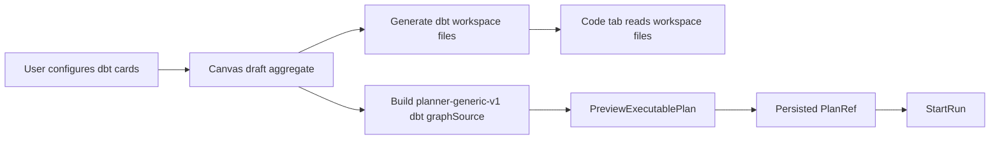

# DBT Authoring Code Run Vertical Plan

## Double Role Brief

User-garrapata stance: a dbt user on Canvas must be able to configure the card
they are looking at, pick the source relation that feeds a model, inspect the
dbt code that will be used, and execute without discovering hidden disabled
product paths.

Architect/developer stance: the implementation must reuse the existing Canvas
draft aggregate, workspace-file command rail, plan preview route, and start-run
PlanRef rail. It must not present mock execution, source-import fallback, or
plugin-local state as product truth.

- [x] [Task: E-DBT-AUTHOR-RUN-1] Implemented dbt card configuration, source
      origin selection, generated workspace artifacts, Code visibility, and
      persisted PlanRef run path through governed rails.

## Current Gap

The runtime side is closed by `TF-C3`: dbt uses the same
`POST /plans/preview` and `POST /runs/start` contract as the rest of the
product through `planner-generic-v1` and persisted `PlanRef` execution.

The frontend still registers the dbt canvas with `not_executable`, so the
Canvas route hides Plan/Run for dbt even when backend and planner paths can
handle a dbt graph source. The dbt inspector also shows plugin-owned read-only
config panels, while route-owned authoring only edits name and description.

Root cause: Lane E never reconciled the dbt authoring surface with the later
Lane C dbt runtime closure. The product promise exists across docs and runtime,
but the web route still has old capability posture and lacks the projection
that turns dbt cards into workspace artifacts and planner graph source.

Rendered QA found one additional backend gap after the web route could create
and persist DBT plans: `POST /runs/start` rejected persisted DBT `PlanRef`
execution because plugin-backed engine dispatch requires a
`runExecutionContextRef`. The target slice therefore includes a small
`apps/api` application wrapper that derives the DBT project bundle and run
execution context from the same workspace files that Code and Artifacts read.

## Current To Target



Target rules:

- dbt card editing remains route-owned Inspector authoring, not passive plugin
  panel mutation.
- dbt source/model config is saved into canonical node metadata through the
  same draft aggregate used by autosave and execution.
- selecting a model origin uses the visible dbt graph relation and stores a
  normalized source reference for code generation.
- generated dbt files are persisted through `SaveWorkspaceFileContent`, then
  Code and Artifacts see the same project artifacts.
- dbt plan preview uses `planner-generic-v1` with dbt step kinds and a generic
  graph source; transformation-only provenance and topology validation remain
  transformation-only.
- run start continues to use the existing persisted `PlanRef` path. The web
  client must not send caller-owned runtime identity.

## Command And Query Rails

| Rail                            | Type    | Bounded context            | DDD owner                                | Application port or adapter                                  | Scope and auth                                                                  | Negative tests                                                                                         |
| ------------------------------- | ------- | -------------------------- | ---------------------------------------- | ------------------------------------------------------------ | ------------------------------------------------------------------------------- | ------------------------------------------------------------------------------------------------------ |
| `ConfigureCanvasDbtNode`        | command | Web Graph Canvas Workbench | `DbtNodeAuthoringMetadata` value object  | `CanvasInspectorAuthoringContract` over `CanvasDraftSession` | current Canvas draft; denied when `CanvasRuntimePolicy` blocks mutation         | blank names reject; unsupported materialization rejects; read-only posture does not call apply         |
| `SelectDbtModelOrigin`          | command | Web Graph Canvas Workbench | `DbtSourceRelationshipSelection` policy  | route-owned Inspector authoring DTO                          | visible dbt source/model graph only; no warehouse import authority              | missing source relation is explicit blocker; unsupported origin is not persisted                       |
| `GenerateDbtWorkspaceArtifacts` | command | Project workspace I/O      | `DbtWorkspaceArtifactProjection`         | `SaveWorkspaceFileContent`                                   | scoped tenant/project/environment workspace file write                          | no fake files; invalid dbt graph blocks save; workspace write failure blocks plan                      |
| `BuildDbtPlannerGraphSource`    | query   | Web Graph Canvas Workbench | `DbtCanvasGraphSourceProjection`         | pure Canvas execution projection                             | current selected closure or workspace nodes only                                | non-executable node kinds are excluded; missing executable model rejects                               |
| `PreviewExecutablePlan`         | command | Protected runtime          | existing protected plan preview use case | `IPlansPort.previewPlan`                                     | authenticated runtime scope and target adapter                                  | unsupported preview profile/source mismatch rejects                                                    |
| `StartRun`                      | command | Protected runtime          | existing start-run use case              | `IRunsPort.startRun`                                         | authenticated runtime scope and persisted PlanRef                               | no planRef, stale plan, or unpersisted preview blocks run                                              |
| `BindDbtRunExecutionContext`    | command | Protected runtime          | `DbtRunExecutionContextBindingUseCase`   | `IStartRunUseCase` wrapper                                   | authenticated runtime scope, persisted DBT PlanRef, configured DBT bundle store | missing bundle store, missing `dbt_project.yml`, unsupported bundle store, or non-DBT plan passthrough |
| `ListWorkspaceFiles`            | query   | Project workspace I/O      | `WorkspaceFileTree`                      | Code/Artifacts workspace query ports                         | authenticated workspace scope                                                   | generated files must be visible through the existing query, not local component memory                 |
| `GetWorkspaceFileContent`       | query   | Project workspace I/O      | `WorkspaceFileContent`                   | Code/Artifacts workspace query ports                         | authenticated workspace scope                                                   | missing file returns explicit workspace-file error                                                     |

## Fowler Opportunity Matrix

| Scenario                                                                     | Opportunity                              | Fowler pattern                    | DDD owner                              | Command/query rail                                          | Implementation surfaces                                                                                                                              | Unit or package test                                                      | Architecture test                                        | User-flow test                          | Out of scope                       |
| ---------------------------------------------------------------------------- | ---------------------------------------- | --------------------------------- | -------------------------------------- | ----------------------------------------------------------- | ---------------------------------------------------------------------------------------------------------------------------------------------------- | ------------------------------------------------------------------------- | -------------------------------------------------------- | --------------------------------------- | ---------------------------------- |
| dbt runtime is implemented but web canvas is still `not_executable`.         | Documentation drift and hidden authority | Gateway-backed application policy | `CanvasExecutionStrategy`              | `PreviewExecutablePlan`, `StartRun`                         | `canvasExecutionStrategyContracts.ts`, `dbtContributions.ts`, `canvasExecutionState.ts`, `useCanvasExecutionActions.ts`, `canvasPlanAction.ts`       | `useCanvasExecutionActions.dbt.test.tsx`                                  | `canvasDbtAuthoringRun.architecture.test.ts`             | `canvas-dbt-author-code-run-live.cy.ts` | changing backend runtime contracts |
| dbt card config is only read-only JSON in plugin panels.                     | Boundary drift                           | Form DTO plus command seam        | `DbtNodeAuthoringMetadata`             | `ConfigureCanvasDbtNode`                                    | `canvasInspectorAuthoring.types.ts`, `canvasInspectorAuthoringModel.ts`, `CanvasInspectorAuthoringSection.tsx`, `canvasInspectorAuthoringCommand.ts` | `canvasInspectorAuthoringModel.test.ts`                                   | `canvasInspectorAuthoringComponent.architecture.test.ts` | `canvas-dbt-author-code-run-live.cy.ts` | plugin-owned mutable panels        |
| generated dbt code is not visible in Code.                                   | Hidden authority                         | Projection plus file gateway      | `DbtWorkspaceArtifactProjection`       | `GenerateDbtWorkspaceArtifacts`, `SaveWorkspaceFileContent` | `dbtWorkspaceArtifacts.ts`, `canvasPlanAction.ts`, `useCanvasPlanActionHandler.ts`                                                                   | `dbtWorkspaceArtifacts.test.ts`, `useCanvasExecutionActions.dbt.test.tsx` | `canvasDbtAuthoringRun.architecture.test.ts`             | `canvas-dbt-author-code-run-live.cy.ts` | generic file editor changes        |
| dbt origin selection can drift from graph workflow.                          | Primitive obsession                      | Value object and policy object    | `DbtSourceRelationshipSelection`       | `SelectDbtModelOrigin`                                      | `dbtCanvasAuthoringModel.ts`, `CanvasInspectorAuthoringSection.tsx`                                                                                  | `dbtCanvasAuthoringModel.test.ts`                                         | `canvasDbtAuthoringRun.architecture.test.ts`             | `canvas-dbt-author-code-run-live.cy.ts` | database catalog import            |
| dbt planner graph source could include source/control/output nodes as steps. | Responsibility overload                  | Read-model projection             | `DbtCanvasGraphSourceProjection`       | `BuildDbtPlannerGraphSource`                                | `dbtPlannerGraphSource.ts`, `canvasPlanAction.ts`                                                                                                    | `dbtPlannerGraphSource.test.ts`                                           | `canvasDbtAuthoringRun.architecture.test.ts`             | `canvas-dbt-author-code-run-live.cy.ts` | planner package changes            |
| persisted DBT plans start without a plugin run context.                      | Hidden runtime dependency                | Gateway-backed application policy | `DbtRunExecutionContextBindingUseCase` | `BindDbtRunExecutionContext`, `StartRun`                    | `DbtRunExecutionContextBindingUseCase.ts`, `buildProtectedStartRunRuntime.ts`, `buildProtectedRuntimeStorage.ts`, `run-dev-stack.cjs`                | `DbtRunExecutionContextBindingUseCase.test.ts`, `run-dev-stack.test.cjs`  | `startRunRuntimeComposition.cases.ts`                    | `canvas-dbt-author-code-run-live.cy.ts` | contract or engine changes         |

## Red-Green Plan

1. Add red tests for dbt card config projection, validation, and origin
   selection.
2. Add red tests for deterministic dbt SQL/YAML artifact generation and scoped
   file paths.
3. Add red tests for dbt plan action using `planner-generic-v1`, saving files,
   invalidating Code/Artifacts file queries, and enabling run from persisted
   PlanRef.
4. Add architecture guard proving dbt runtime posture is not `not_executable`
   and plugin panels remain passive.
5. Implement the pure dbt authoring/artifact/graph-source models.
6. Extend the route-owned Inspector authoring DTO and UI.
7. Switch dbt canvas execution posture to the generic planner preview strategy.
8. Validate with focused web tests, rendered browser proof, Planning DB checks,
   docs sync, governance refresh, and `pnpm verify:prepush`.

## Residuals

- Database catalog/source import remains out of scope because API mode still
  declares warehouse source import unavailable. This task covers selecting a
  dbt origin from the authored graph, not introspecting a live database.
- Node-level dbt execution history stays out of scope unless the runtime read
  model exposes step-backed detail for dbt nodes.

```feature-mechanization
version: 1
featureId: E-DBT-AUTHOR-RUN-20260526
mechanizationStatus: implemented
noHumanDecisionsRemaining: true
implementationPlan: docs/planning/proposals/mandatory/frontend-and-ux/dbt-authoring-code-run-vertical-plan-20260526.md
componentGuides:
  - docs/architecture/components/web/graph/graph-frontend-architecture.md
  - docs/architecture/components/web/graph/canvas-inspector-authoring-component.md
  - docs/architecture/components/web/graph/canvas-workbench-command-query-catalog.md
  - docs/architecture/components/web/code-workbench-workspace-files-component.md
  - docs/architecture/components/api/protected-runtime-and-plan-compile-component.md
  - apps/api/docs/start-run-application-component.md
  - apps/api/docs/start-run-runtime-composition-component.md
userStories:
  - docs/planning/state/lane-e-shell-baseline-target-guide.md
governingSources:
  - AGENTS.md
  - docs/planning/status/governance-document-rule-inventory.md
  - docs/guides/ai-work-protocol.md
  - docs/architecture/command-query-rail-governance.md
  - docs/architecture/fowler-opportunity-planning-governance.md
  - docs/planning/state/planning-control-tower.md
  - docs/architecture/components/web/graph/graph-frontend-architecture.md
  - docs/architecture/components/web/graph/canvas-inspector-authoring-component.md
  - docs/architecture/components/web/code-workbench-workspace-files-component.md
  - docs/architecture/components/api/protected-runtime-and-plan-compile-component.md
allowedImplementationSurfaces:
  - .gitignore
  - apps/web/cypress/e2e/canvas/canvas-dbt-author-code-run-live.cy.ts
  - apps/web/cypress/support/canvasDraftAuthoring.ts
  - apps/web/cypress/support/liveProtectedRuntime.ts
  - apps/web/src/app/plugins/canvasExecutionStrategyContracts.ts
  - apps/web/src/app/plugins/dbt/dbtContributions.ts
  - apps/web/src/app/plugins/graph/graphVisualTokens.ts
  - apps/web/src/app/plugins/graphStrategyRegistry.test.ts
  - apps/web/src/app/views/canvas/canvasDbtAuthoringModel.ts
  - apps/web/src/app/views/canvas/canvasDbtAuthoringModel.test.ts
  - apps/web/src/app/views/canvas/canvasDbtPlannerGraphSource.ts
  - apps/web/src/app/views/canvas/canvasDbtPlannerGraphSource.test.ts
  - apps/web/src/app/views/canvas/canvasDbtWorkspaceArtifacts.ts
  - apps/web/src/app/views/canvas/canvasDbtWorkspaceArtifacts.test.ts
  - apps/web/src/app/views/canvas/canvasDraftAuthoringComponent.architecture.test.ts
  - apps/web/src/app/views/canvas/canvasExecutionState.ts
  - apps/web/src/app/views/canvas/canvasToolbarViewModel.ts
  - apps/web/src/app/views/canvas/canvasDraftAccessPostureModel.ts
  - apps/web/src/app/views/canvas/canvasDraftAuthoring.ts
  - apps/web/src/app/views/canvas/canvasDraftAuthoring.test.ts
  - apps/web/src/app/views/canvas/canvasDraftLifecycle.types.ts
  - apps/web/src/app/views/canvas/canvasExecutionActions.types.ts
  - apps/web/src/app/views/canvas/canvasInspectorAuthoring.types.ts
  - apps/web/src/app/views/canvas/canvasInspectorAuthoringModel.ts
  - apps/web/src/app/views/canvas/canvasInspectorAuthoringModel.test.ts
  - apps/web/src/app/views/canvas/canvasInspectorAuthoringCommand.ts
  - apps/web/src/app/views/canvas/CanvasInspectorAuthoringSection.tsx
  - apps/web/src/app/views/canvas/CanvasInspectorPanel.tsx
  - apps/web/src/app/views/canvas/CanvasInspectorPanel.test.tsx
  - apps/web/src/app/views/canvas/CanvasShell.tsx
  - apps/web/src/app/views/canvas/CanvasShell.test.tsx
  - apps/web/src/app/views/canvas/CanvasShellMainPanel.tsx
  - apps/web/src/app/views/canvas/CanvasToolbar.tsx
  - apps/web/src/app/views/canvas/CanvasToolbar.test.tsx
  - apps/web/src/app/views/canvas/CanvasToolbarPrimaryControls.tsx
  - apps/web/src/app/views/canvas/canvasShell.types.ts
  - apps/web/src/app/views/canvas/canvasShellBuilder.types.ts
  - apps/web/src/app/views/canvas/canvasShellPanelsBuilder.ts
  - apps/web/src/app/views/canvas/canvasShellPanelsBuilder.test.ts
  - apps/web/src/app/views/canvas/canvasShellPropsBuilder.tsx
  - apps/web/src/app/views/canvas/canvasShellToolbarBuilder.ts
  - apps/web/src/app/views/canvas/canvasControllerViewModel.ts
  - apps/web/src/app/views/canvas/canvasRuntimePolicy.ts
  - apps/web/src/app/views/canvas/canvasRuntimePolicy.test.ts
  - apps/web/src/app/views/canvas/canvasToolbarViewModel.test.ts
  - apps/web/src/app/views/canvas/useCanvasController.ts
  - apps/web/src/app/views/canvas/useCanvasDraftLifecycle.ts
  - apps/web/src/app/views/canvas/useCanvasExecutionDraftFlush.ts
  - apps/web/src/app/views/canvas/canvasPlanAction.ts
  - apps/web/src/app/views/canvas/canvasRunSelection.ts
  - apps/web/src/app/views/canvas/useCanvasExecutionActions.ts
  - apps/web/src/app/views/canvas/useCanvasExecutionActions.dbt.test.tsx
  - apps/web/src/app/views/canvas/useCanvasExecutionActions.test.support.tsx
  - apps/web/src/app/views/canvas/useCanvasPlanActionHandler.ts
  - apps/web/src/app/views/canvas/canvasDbtAuthoringRun.architecture.test.ts
  - apps/web/src/app/views/Canvas.test.controller.defaults.ts
  - apps/web/src/app/views/Canvas.test.hostCycleScenario.ts
  - apps/web/src/app/services/plans/plansService.api.ts
  - apps/web/src/app/services/plans/plansService.test.ts
  - apps/api/src/application/services/DbtRunExecutionContextBindingUseCase.ts
  - apps/api/test/application/services/DbtRunExecutionContextBindingUseCase.test.ts
  - apps/api/test/application/services/applicationArchitectureAst.support.ts
  - apps/api/test/application/services/resolveAuthorizedExecutableSubgraph.test.ts
  - apps/api/test/entrypoints/http/previewPlanRoute.outcomes.test.ts
  - apps/api/test/application/services/startRunApplicationComponent.architecture.test.ts
  - apps/api/test/modules/startRunRuntimeComposition.cases.ts
  - apps/api/src/application/ports/protectedRuntimeRailVocabulary.ts
  - apps/api/src/application/ports/protectedRuntimePlanCommandQueryRails.ts
  - apps/api/src/application/services/PreviewPlanUseCase.ts
  - apps/api/src/application/services/resolveAuthorizedExecutableSubgraph.ts
  - apps/api/src/modules/startRun/buildProtectedStartRunRuntime.ts
  - apps/api/src/modules/protectedRuntime/buildProtectedRuntimeStorage.ts
  - apps/api/src/modules/buildProtectedRuntimeModule.ts
  - apps/api/docs/start-run-application-component.md
  - apps/api/docs/start-run-runtime-composition-component.md
  - scripts/run-dev-stack.cjs
  - scripts/run-dev-stack.auth.cjs
  - scripts/run-dev-stack.auth.test.cjs
  - scripts/run-dev-stack.temporal.cjs
  - scripts/run-dev-stack.test.cjs
  - packages/@dvt/adapter-postgres/src/PostgresPlanStore.executable-blob-repository.ts
  - packages/@dvt/adapter-postgres/src/PostgresPlanStore.mappers.ts
  - packages/@dvt/adapter-postgres/src/PostgresPlanStore.ts
  - packages/@dvt/adapter-postgres/test/PostgresPlanStore.invariants.unit.test.ts
  - packages/@dvt/adapter-postgres/test/PostgresPlanStore.lifecycle.integration.test.ts
  - docs/evidence/ed-20260526-dbt-authoring-run-plan-store-reuse.md
  - docs/evidence/index.md
  - docs/risk-register/quality/R-20260526-DBT-PLAN-STORE-REUSE.yaml
  - docs/risk-register/quality/index.md
  - docs/architecture/components/web/graph/graph-frontend-architecture.md
  - docs/architecture/components/web/graph/canvas-inspector-authoring-component.md
  - docs/architecture/components/web/graph/canvas-workbench-command-query-catalog.md
  - docs/architecture/components/api/protected-runtime-and-plan-compile-component.md
  - docs/architecture/components/api/protected-runtime-command-query-rail-design.md
  - docs/planning/closeouts/20260526-e-dbt-author-run-closeout.md
  - docs/planning/proposals/mandatory/frontend-and-ux/dbt-authoring-code-run-vertical-plan-20260526.md
forbiddenImplementationSurfaces:
  - packages/@dvt/contracts/**
  - packages/@dvt/engine/**
  - packages/@dvt/planner/**
commandQueryRails:
  - name: ConfigureCanvasDbtNode
    type: command
    dddOwner: DbtNodeAuthoringMetadata
  - name: SelectDbtModelOrigin
    type: command
    dddOwner: DbtSourceRelationshipSelection
  - name: GenerateDbtWorkspaceArtifacts
    type: command
    dddOwner: DbtWorkspaceArtifactProjection
  - name: BuildDbtPlannerGraphSource
    type: query
    dddOwner: DbtCanvasGraphSourceProjection
  - name: SelectCanvasRuntimeTemplate
    type: command
    dddOwner: CanvasRuntimeTemplateSelection
  - name: RequestCanvasExecutionScope
    type: command
    dddOwner: CanvasExecutionScopeRequest
  - name: PreviewExecutablePlan
    type: command
    dddOwner: ProtectedRuntimePlanPreview
  - name: StartRun
    type: command
    dddOwner: ProtectedRuntimeStartRun
  - name: BindDbtRunExecutionContext
    type: command
    dddOwner: DbtRunExecutionContextBindingUseCase
  - name: ListWorkspaceFiles
    type: query
    dddOwner: WorkspaceFileTree
  - name: GetWorkspaceFileContent
    type: query
    dddOwner: WorkspaceFileContent
domainObjects:
  - name: DbtNodeAuthoringMetadata
    type: value object
    owner: apps/web
  - name: DbtSourceRelationshipSelection
    type: policy
    owner: apps/web
  - name: DbtWorkspaceArtifactProjection
    type: projection
    owner: apps/web
  - name: DbtCanvasGraphSourceProjection
    type: read model
    owner: apps/web
  - name: CanvasRuntimeTemplateSelection
    type: value object
    owner: apps/web
  - name: CanvasExecutionScopeRequest
    type: command request
    owner: apps/web
  - name: DbtRunExecutionContextBindingUseCase
    type: application service
    owner: apps/api
fowlerSignals:
  - Documentation drift
  - Hidden authority
  - Hidden choice
  - Boundary drift
  - Primitive obsession
  - Responsibility overload
architectureGuards:
  - pnpm --filter @dvt/web exec vitest run --config vitest.architecture.config.ts src/app/views/canvas/canvasDbtAuthoringRun.architecture.test.ts
  - pnpm --filter dvt-api exec vitest run test/modules.test.ts test/application/services/startRunApplicationComponent.architecture.test.ts
cypressFlows:
  - manual Playwright proof for /canvas dbt card config -> Plan -> Code -> Execute when Browser plugin is unavailable
completionGate:
  - pnpm --filter @dvt/web exec vitest run --config vitest.unit.config.ts src/app/views/canvas/canvasDbtAuthoringModel.test.ts src/app/views/canvas/canvasDbtPlannerGraphSource.test.ts src/app/views/canvas/canvasDbtWorkspaceArtifacts.test.ts
  - pnpm --filter @dvt/web exec vitest run --config vitest.presentation.config.ts src/app/views/canvas/CanvasInspectorPanel.test.tsx src/app/views/canvas/useCanvasExecutionActions.dbt.test.tsx
  - pnpm --filter @dvt/web exec vitest run --config vitest.architecture.config.ts src/app/views/canvas/canvasDbtAuthoringRun.architecture.test.ts
  - pnpm --filter @dvt/web typecheck
  - pnpm --filter @dvt/web lint
  - pnpm --filter dvt-api exec vitest run test/application/services/DbtRunExecutionContextBindingUseCase.test.ts test/application/services/PlannerBackedStartRunUseCase.test.ts test/application/services/engineStartRunUseCase.commandPath.test.ts
  - pnpm --filter dvt-api exec vitest run test/modules.test.ts
  - pnpm --filter dvt-api typecheck
  - pnpm --filter dvt-api lint
  - node --test scripts/run-dev-stack.test.cjs
  - pnpm docs:feature-mechanization -- --feature E-DBT-AUTHOR-RUN-20260526
  - pnpm docs:feature-mechanization:implementation -- --feature E-DBT-AUTHOR-RUN-20260526
  - pnpm planning:db:check
  - pnpm planning:db:export:check
  - pnpm docs:sync
  - pnpm governance:refresh
  - pnpm verify:prepush
redGreenCycles:
  - id: dbt-card-authoring
    redTest: pnpm --filter @dvt/web exec vitest run --config vitest.unit.config.ts src/app/views/canvas/canvasDbtAuthoringModel.test.ts src/app/views/canvas/canvasInspectorAuthoringModel.test.ts
    expectedFailure: DBT card configuration and origin selection are not represented in the route-owned Inspector DTO.
    patchSurfaces:
      - apps/web/src/app/views/canvas/canvasDbtAuthoringModel.ts
      - apps/web/src/app/views/canvas/canvasDbtAuthoringModel.test.ts
      - apps/web/src/app/views/canvas/canvasInspectorAuthoring.types.ts
      - apps/web/src/app/views/canvas/canvasInspectorAuthoringModel.ts
      - apps/web/src/app/views/canvas/canvasInspectorAuthoringModel.test.ts
    greenTest: pnpm --filter @dvt/web exec vitest run --config vitest.unit.config.ts src/app/views/canvas/canvasDbtAuthoringModel.test.ts src/app/views/canvas/canvasInspectorAuthoringModel.test.ts
  - id: dbt-code-artifacts
    redTest: pnpm --filter @dvt/web exec vitest run --config vitest.unit.config.ts src/app/views/canvas/canvasDbtWorkspaceArtifacts.test.ts
    expectedFailure: DBT workspace artifact projection does not exist.
    patchSurfaces:
      - apps/web/src/app/views/canvas/canvasDbtWorkspaceArtifacts.ts
      - apps/web/src/app/views/canvas/canvasDbtWorkspaceArtifacts.test.ts
    greenTest: pnpm --filter @dvt/web exec vitest run --config vitest.unit.config.ts src/app/views/canvas/canvasDbtWorkspaceArtifacts.test.ts
  - id: dbt-generic-plan-run
    redTest: pnpm --filter @dvt/web exec vitest run --config vitest.unit.config.ts src/app/views/canvas/canvasDbtPlannerGraphSource.test.ts
    expectedFailure: DBT generic planner graph source projection does not exist.
    patchSurfaces:
      - apps/web/src/app/views/canvas/canvasDbtPlannerGraphSource.ts
      - apps/web/src/app/views/canvas/canvasDbtPlannerGraphSource.test.ts
      - apps/web/src/app/views/canvas/canvasPlanAction.ts
      - apps/web/src/app/views/canvas/canvasExecutionState.ts
    greenTest: pnpm --filter @dvt/web exec vitest run --config vitest.unit.config.ts src/app/views/canvas/canvasDbtPlannerGraphSource.test.ts
  - id: dbt-route-wiring
    redTest: pnpm --filter @dvt/web exec vitest run --config vitest.presentation.config.ts src/app/views/canvas/useCanvasExecutionActions.dbt.test.tsx src/app/views/canvas/CanvasInspectorPanel.test.tsx
    expectedFailure: DBT canvas remains not executable and Inspector cannot edit DBT config.
    patchSurfaces:
      - apps/web/src/app/plugins/canvasExecutionStrategyContracts.ts
      - apps/web/src/app/plugins/dbt/dbtContributions.ts
      - apps/web/src/app/plugins/graph/graphVisualTokens.ts
      - apps/web/src/app/plugins/graphStrategyRegistry.test.ts
      - apps/web/src/app/views/canvas/useCanvasExecutionActions.ts
      - apps/web/src/app/views/canvas/useCanvasExecutionDraftFlush.ts
      - apps/web/src/app/views/canvas/useCanvasPlanActionHandler.ts
      - apps/web/src/app/views/canvas/CanvasInspectorAuthoringSection.tsx
      - apps/web/src/app/views/canvas/CanvasInspectorPanel.tsx
      - apps/web/src/app/views/canvas/CanvasShell.tsx
      - apps/web/src/app/views/canvas/CanvasShellMainPanel.tsx
      - apps/web/src/app/views/canvas/CanvasToolbar.tsx
      - apps/web/src/app/views/canvas/CanvasToolbarPrimaryControls.tsx
      - apps/web/src/app/views/canvas/canvasShell.types.ts
      - apps/web/src/app/views/canvas/canvasShellBuilder.types.ts
      - apps/web/src/app/views/canvas/canvasShellPanelsBuilder.ts
      - apps/web/src/app/views/canvas/canvasShellPropsBuilder.tsx
      - apps/web/src/app/views/canvas/canvasShellToolbarBuilder.ts
      - apps/web/src/app/views/canvas/canvasControllerViewModel.ts
      - apps/web/src/app/views/canvas/canvasToolbarViewModel.ts
      - apps/web/src/app/services/plans/plansService.api.ts
    greenTest: pnpm --filter @dvt/web exec vitest run --config vitest.presentation.config.ts src/app/views/canvas/useCanvasExecutionActions.dbt.test.tsx src/app/views/canvas/CanvasInspectorPanel.test.tsx
  - id: dbt-architecture-guard
    redTest: pnpm --filter @dvt/web exec vitest run --config vitest.architecture.config.ts src/app/views/canvas/canvasDbtAuthoringRun.architecture.test.ts
    expectedFailure: DBT runtime posture and artifact generation are not guarded.
    patchSurfaces:
      - apps/web/src/app/views/canvas/canvasDbtAuthoringRun.architecture.test.ts
      - docs/architecture/components/web/graph/graph-frontend-architecture.md
      - docs/architecture/components/web/graph/canvas-inspector-authoring-component.md
      - docs/architecture/components/web/graph/canvas-workbench-command-query-catalog.md
    greenTest: pnpm --filter @dvt/web exec vitest run --config vitest.architecture.config.ts src/app/views/canvas/canvasDbtAuthoringRun.architecture.test.ts
  - id: dbt-run-execution-context-binding
    redTest: pnpm --filter dvt-api exec vitest run test/application/services/DbtRunExecutionContextBindingUseCase.test.ts
    expectedFailure: Persisted DBT PlanRef start-run does not create the required DBT project bundle and runExecutionContextRef before engine dispatch.
    patchSurfaces:
      - apps/api/src/application/services/DbtRunExecutionContextBindingUseCase.ts
      - apps/api/test/application/services/DbtRunExecutionContextBindingUseCase.test.ts
      - apps/api/src/modules/startRun/buildProtectedStartRunRuntime.ts
      - apps/api/src/modules/protectedRuntime/buildProtectedRuntimeStorage.ts
      - scripts/run-dev-stack.cjs
      - scripts/run-dev-stack.test.cjs
    greenTest: pnpm --filter dvt-api exec vitest run test/application/services/DbtRunExecutionContextBindingUseCase.test.ts
symbols:
  - { name: DbtNodeAuthoringMetadata, path: apps/web/src/app/views/canvas/canvasDbtAuthoringModel.ts, dddOwner: DbtNodeAuthoringMetadata, cqRails: [ConfigureCanvasDbtNode], fowlerSignals: [Primitive obsession], architectureGuard: pnpm docs:feature-mechanization:implementation -- --feature E-DBT-AUTHOR-RUN-20260526, cypressCoverage: manual Playwright /canvas dbt flow, unitTests: [apps/web/src/app/views/canvas/canvasDbtAuthoringModel.test.ts] }
  - { name: DbtSourceRelationshipSelection, path: apps/web/src/app/views/canvas/canvasDbtAuthoringModel.ts, dddOwner: DbtSourceRelationshipSelection, cqRails: [SelectDbtModelOrigin], fowlerSignals: [Boundary drift], architectureGuard: pnpm docs:feature-mechanization:implementation -- --feature E-DBT-AUTHOR-RUN-20260526, cypressCoverage: manual Playwright /canvas dbt flow, unitTests: [apps/web/src/app/views/canvas/canvasDbtAuthoringModel.test.ts] }
  - { name: CanvasInspectorOverviewTagsEditor, path: apps/web/src/app/views/canvas/CanvasInspectorPanel.tsx, dddOwner: DbtNodeAuthoringMetadata, cqRails: [ConfigureCanvasDbtNode], fowlerSignals: [Boundary drift], architectureGuard: pnpm docs:feature-mechanization:implementation -- --feature E-DBT-AUTHOR-RUN-20260526, cypressCoverage: manual Playwright /canvas dbt Overview tags flow, unitTests: [apps/web/src/app/views/canvas/CanvasInspectorPanel.test.tsx] }
  - { name: createCanvasInspectorNodeDraft, path: apps/web/src/app/views/canvas/canvasInspectorAuthoringModel.ts, dddOwner: DbtNodeAuthoringMetadata, cqRails: [ConfigureCanvasDbtNode], fowlerSignals: [Boundary drift], architectureGuard: pnpm docs:feature-mechanization:implementation -- --feature E-DBT-AUTHOR-RUN-20260526, cypressCoverage: apps/web/cypress/e2e/canvas/canvas-dbt-author-code-run-live.cy.ts, unitTests: [apps/web/src/app/views/canvas/canvasInspectorAuthoringModel.test.ts] }
  - { name: createDbtNodeAuthoringMetadata, path: apps/web/src/app/views/canvas/canvasDbtAuthoringModel.ts, dddOwner: DbtNodeAuthoringMetadata, cqRails: [ConfigureCanvasDbtNode], fowlerSignals: [Primitive obsession], architectureGuard: pnpm docs:feature-mechanization:implementation -- --feature E-DBT-AUTHOR-RUN-20260526, cypressCoverage: manual Playwright /canvas dbt flow, unitTests: [apps/web/src/app/views/canvas/canvasDbtAuthoringModel.test.ts] }
  - { name: DbtOverviewPanel, path: apps/web/src/app/plugins/dbt/DbtNodeRenderer.tsx, dddOwner: DbtNodeAuthoringMetadata, cqRails: [ConfigureCanvasDbtNode], fowlerSignals: [Boundary drift], architectureGuard: pnpm docs:feature-mechanization:implementation -- --feature E-DBT-AUTHOR-RUN-20260526, cypressCoverage: manual Playwright /canvas dbt Overview tags flow, unitTests: [apps/web/src/app/plugins/dbt/DbtNodeRenderer.test.tsx, apps/web/src/app/views/canvas/CanvasInspectorPanel.test.tsx] }
  - { name: resolveDbtSourceRelationshipSelection, path: apps/web/src/app/views/canvas/canvasDbtAuthoringModel.ts, dddOwner: DbtSourceRelationshipSelection, cqRails: [SelectDbtModelOrigin], fowlerSignals: [Boundary drift], architectureGuard: pnpm docs:feature-mechanization:implementation -- --feature E-DBT-AUTHOR-RUN-20260526, cypressCoverage: manual Playwright /canvas dbt flow, unitTests: [apps/web/src/app/views/canvas/canvasDbtAuthoringModel.test.ts] }
  - { name: buildDbtWorkspaceArtifacts, path: apps/web/src/app/views/canvas/canvasDbtWorkspaceArtifacts.ts, dddOwner: DbtWorkspaceArtifactProjection, cqRails: [GenerateDbtWorkspaceArtifacts, SaveWorkspaceFileContent], fowlerSignals: [Hidden authority], architectureGuard: pnpm docs:feature-mechanization:implementation -- --feature E-DBT-AUTHOR-RUN-20260526, cypressCoverage: manual Playwright /canvas dbt flow, unitTests: [apps/web/src/app/views/canvas/canvasDbtWorkspaceArtifacts.test.ts] }
  - { name: buildDbtPlannerGraphSource, path: apps/web/src/app/views/canvas/canvasDbtPlannerGraphSource.ts, dddOwner: DbtCanvasGraphSourceProjection, cqRails: [BuildDbtPlannerGraphSource, PreviewExecutablePlan], fowlerSignals: [Responsibility overload], architectureGuard: pnpm docs:feature-mechanization:implementation -- --feature E-DBT-AUTHOR-RUN-20260526, cypressCoverage: manual Playwright /canvas dbt flow, unitTests: [apps/web/src/app/views/canvas/canvasDbtPlannerGraphSource.test.ts] }
  - { name: CanvasReplacementTemplateOption, path: apps/web/src/app/views/canvas/canvasPlaygroundTabStripModel.ts, dddOwner: CanvasRuntimeTemplateSelection, cqRails: [SelectCanvasRuntimeTemplate], fowlerSignals: [Hidden choice], architectureGuard: pnpm docs:feature-mechanization:implementation -- --feature E-DBT-AUTHOR-RUN-20260526, cypressCoverage: manual Playwright /canvas runtime-template flow, unitTests: [apps/web/src/app/views/canvas/canvasPlaygroundTabStripModel.test.ts] }
  - { name: toCanvasReplacementTemplateOption, path: apps/web/src/app/views/canvas/canvasPlaygroundTabStripModel.ts, dddOwner: CanvasRuntimeTemplateSelection, cqRails: [SelectCanvasRuntimeTemplate], fowlerSignals: [Hidden choice], architectureGuard: pnpm docs:feature-mechanization:implementation -- --feature E-DBT-AUTHOR-RUN-20260526, cypressCoverage: manual Playwright /canvas runtime-template flow, unitTests: [apps/web/src/app/views/canvas/canvasPlaygroundTabStripModel.test.ts] }
  - { name: dbtCanvasKind, path: apps/web/src/app/views/canvas/canvasPlaygroundTabStripModel.test.ts, dddOwner: CanvasRuntimeTemplateSelection, cqRails: [SelectCanvasRuntimeTemplate], fowlerSignals: [Hidden choice], architectureGuard: pnpm docs:feature-mechanization:implementation -- --feature E-DBT-AUTHOR-RUN-20260526, cypressCoverage: manual Playwright /canvas runtime-template flow, unitTests: [apps/web/src/app/views/canvas/canvasPlaygroundTabStripModel.test.ts] }
  - { name: dbtCanvasKind, path: apps/web/src/app/views/canvas/CanvasPlaygroundTabStrip.test.tsx, dddOwner: CanvasRuntimeTemplateSelection, cqRails: [SelectCanvasRuntimeTemplate], fowlerSignals: [Hidden choice], architectureGuard: pnpm docs:feature-mechanization:implementation -- --feature E-DBT-AUTHOR-RUN-20260526, cypressCoverage: manual Playwright /canvas runtime-template flow, unitTests: [apps/web/src/app/views/canvas/CanvasPlaygroundTabStrip.test.tsx] }
  - { name: CanvasReadOnlyBannerView, path: apps/web/src/app/views/canvas/CanvasStateViews.tsx, dddOwner: CanvasExecutionScopeRequest, cqRails: [RequestCanvasExecutionScope], fowlerSignals: [Responsibility overload], architectureGuard: pnpm docs:feature-mechanization:implementation -- --feature E-DBT-AUTHOR-RUN-20260526, cypressCoverage: manual Playwright /canvas read-only flow, unitTests: [apps/web/src/app/views/Canvas.readOnlyStates.test.tsx] }
  - { name: focusWorkspaceScopeControls, path: apps/web/src/app/views/canvas/canvasShellLayoutBuilder.tsx, dddOwner: CanvasExecutionScopeRequest, cqRails: [RequestCanvasExecutionScope], fowlerSignals: [Responsibility overload], architectureGuard: pnpm docs:feature-mechanization:implementation -- --feature E-DBT-AUTHOR-RUN-20260526, cypressCoverage: manual Playwright /canvas read-only flow, unitTests: [apps/web/src/app/views/Canvas.readOnlyStates.test.tsx] }
  - { name: executeCanvasPlanAction, path: apps/web/src/app/views/canvas/canvasPlanAction.ts, dddOwner: CanvasExecutionPlanAction, cqRails: [PreviewExecutablePlan, GenerateDbtWorkspaceArtifacts], fowlerSignals: [Hidden authority], architectureGuard: pnpm docs:feature-mechanization:implementation -- --feature E-DBT-AUTHOR-RUN-20260526, cypressCoverage: manual Playwright /canvas dbt flow, unitTests: [apps/web/src/app/views/canvas/useCanvasExecutionActions.dbt.test.tsx] }
  - { name: UseCanvasExecutionDraftFlushArgs, path: apps/web/src/app/views/canvas/useCanvasExecutionDraftFlush.ts, dddOwner: CanvasExecutionPlanAction, cqRails: [PreviewExecutablePlan, StartRun], fowlerSignals: [Hidden authority], architectureGuard: pnpm docs:feature-mechanization:implementation -- --feature E-DBT-AUTHOR-RUN-20260526, cypressCoverage: apps/web/cypress/e2e/canvas/canvas-dbt-author-code-run-live.cy.ts, unitTests: [apps/web/src/app/views/canvas/useCanvasExecutionActions.dbt.test.tsx] }
  - { name: projectFlushGraph, path: apps/web/src/app/views/canvas/useCanvasExecutionDraftFlush.ts, dddOwner: CanvasExecutionPlanAction, cqRails: [PreviewExecutablePlan, StartRun], fowlerSignals: [Hidden authority], architectureGuard: pnpm docs:feature-mechanization:implementation -- --feature E-DBT-AUTHOR-RUN-20260526, cypressCoverage: apps/web/cypress/e2e/canvas/canvas-dbt-author-code-run-live.cy.ts, unitTests: [apps/web/src/app/views/canvas/useCanvasExecutionActions.dbt.test.tsx] }
  - { name: useCanvasExecutionDraftFlush, path: apps/web/src/app/views/canvas/useCanvasExecutionDraftFlush.ts, dddOwner: CanvasExecutionPlanAction, cqRails: [PreviewExecutablePlan, StartRun], fowlerSignals: [Hidden authority], architectureGuard: pnpm docs:feature-mechanization:implementation -- --feature E-DBT-AUTHOR-RUN-20260526, cypressCoverage: apps/web/cypress/e2e/canvas/canvas-dbt-author-code-run-live.cy.ts, unitTests: [apps/web/src/app/views/canvas/useCanvasExecutionActions.dbt.test.tsx] }
  - { name: mapContractPlanToUi, path: apps/web/src/app/services/plans/plansService.api.ts, dddOwner: ProtectedRuntimePlanPreview, cqRails: [PreviewExecutablePlan, StartRun], fowlerSignals: [Hidden authority], architectureGuard: pnpm docs:feature-mechanization:implementation -- --feature E-DBT-AUTHOR-RUN-20260526, cypressCoverage: manual Playwright /canvas dbt flow, unitTests: [apps/web/src/app/services/plans/plansService.test.ts] }
  - { name: DbtRunExecutionContextBindingUseCase, path: apps/api/src/application/services/DbtRunExecutionContextBindingUseCase.ts, dddOwner: DbtRunExecutionContextBindingUseCase, cqRails: [BindDbtRunExecutionContext, StartRun], fowlerSignals: [Hidden runtime dependency], architectureGuard: pnpm --filter dvt-api exec vitest run test/modules.test.ts, cypressCoverage: manual Playwright /canvas dbt flow, unitTests: [apps/api/test/application/services/DbtRunExecutionContextBindingUseCase.test.ts] }
  - { name: replaceInput, path: apps/web/cypress/e2e/canvas/canvas-dbt-author-code-run-live.cy.ts, dddOwner: DbtAuthoringRunVertical, cqRails: [ConfigureCanvasDbtNode, SelectDbtModelOrigin, GenerateDbtWorkspaceArtifacts, BuildDbtPlannerGraphSource, BindDbtRunExecutionContext, StartRun], fowlerSignals: [Hidden authority], architectureGuard: pnpm docs:feature-mechanization:implementation, cypressCoverage: apps/web/cypress/e2e/canvas/canvas-dbt-author-code-run-live.cy.ts, unitTests: [apps/web/src/app/views/canvas/useCanvasExecutionActions.dbt.test.tsx] }
  - { name: readLiveGraphDraft, path: apps/web/cypress/support/liveProtectedRuntime.ts, dddOwner: DbtAuthoringRunVertical, cqRails: [ConfigureCanvasDbtNode, SelectDbtModelOrigin, GenerateDbtWorkspaceArtifacts, BuildDbtPlannerGraphSource, BindDbtRunExecutionContext, StartRun], fowlerSignals: [Hidden authority], architectureGuard: pnpm docs:feature-mechanization:implementation, cypressCoverage: apps/web/cypress/e2e/canvas/canvas-dbt-author-code-run-live.cy.ts, unitTests: [apps/web/src/app/views/canvas/useCanvasExecutionActions.dbt.test.tsx] }
  - { name: buildDbtModelNode, path: apps/web/src/app/views/canvas/CanvasInspectorPanel.test.tsx, dddOwner: DbtAuthoringRunVertical, cqRails: [ConfigureCanvasDbtNode, SelectDbtModelOrigin, GenerateDbtWorkspaceArtifacts, BuildDbtPlannerGraphSource, BindDbtRunExecutionContext, StartRun], fowlerSignals: [Hidden authority], architectureGuard: pnpm docs:feature-mechanization:implementation, cypressCoverage: apps/web/cypress/e2e/canvas/canvas-dbt-author-code-run-live.cy.ts, unitTests: [apps/web/src/app/views/canvas/useCanvasExecutionActions.dbt.test.tsx] }
  - { name: buildDbtSourceNode, path: apps/web/src/app/views/canvas/CanvasInspectorPanel.test.tsx, dddOwner: DbtAuthoringRunVertical, cqRails: [ConfigureCanvasDbtNode, SelectDbtModelOrigin, GenerateDbtWorkspaceArtifacts, BuildDbtPlannerGraphSource, BindDbtRunExecutionContext, StartRun], fowlerSignals: [Hidden authority], architectureGuard: pnpm docs:feature-mechanization:implementation, cypressCoverage: apps/web/cypress/e2e/canvas/canvas-dbt-author-code-run-live.cy.ts, unitTests: [apps/web/src/app/views/canvas/useCanvasExecutionActions.dbt.test.tsx] }
  - { name: buildSourceEdge, path: apps/web/src/app/views/canvas/canvasDbtAuthoringModel.test.ts, dddOwner: DbtAuthoringRunVertical, cqRails: [ConfigureCanvasDbtNode, SelectDbtModelOrigin, GenerateDbtWorkspaceArtifacts, BuildDbtPlannerGraphSource, BindDbtRunExecutionContext, StartRun], fowlerSignals: [Hidden authority], architectureGuard: pnpm docs:feature-mechanization:implementation, cypressCoverage: apps/web/cypress/e2e/canvas/canvas-dbt-author-code-run-live.cy.ts, unitTests: [apps/web/src/app/views/canvas/useCanvasExecutionActions.dbt.test.tsx] }
  - { name: DEFAULT_PACKAGE_NAME, path: apps/web/src/app/views/canvas/canvasDbtAuthoringModel.ts, dddOwner: DbtNodeAuthoringMetadata, cqRails: [ConfigureCanvasDbtNode], fowlerSignals: [Primitive obsession], architectureGuard: pnpm docs:feature-mechanization:implementation, cypressCoverage: apps/web/cypress/e2e/canvas/canvas-dbt-author-code-run-live.cy.ts, unitTests: [apps/web/src/app/views/canvas/canvasDbtAuthoringModel.test.ts] }
  - { name: DEFAULT_SCHEMA_NAME, path: apps/web/src/app/views/canvas/canvasDbtAuthoringModel.ts, dddOwner: DbtNodeAuthoringMetadata, cqRails: [ConfigureCanvasDbtNode], fowlerSignals: [Primitive obsession], architectureGuard: pnpm docs:feature-mechanization:implementation, cypressCoverage: apps/web/cypress/e2e/canvas/canvas-dbt-author-code-run-live.cy.ts, unitTests: [apps/web/src/app/views/canvas/canvasDbtAuthoringModel.test.ts] }
  - { name: isRecord, path: apps/web/src/app/views/canvas/canvasDbtAuthoringModel.ts, dddOwner: DbtNodeAuthoringMetadata, cqRails: [ConfigureCanvasDbtNode], fowlerSignals: [Primitive obsession], architectureGuard: pnpm docs:feature-mechanization:implementation, cypressCoverage: apps/web/cypress/e2e/canvas/canvas-dbt-author-code-run-live.cy.ts, unitTests: [apps/web/src/app/views/canvas/canvasDbtAuthoringModel.test.ts] }
  - { name: normalizeIdentifier, path: apps/web/src/app/views/canvas/canvasDbtAuthoringModel.ts, dddOwner: DbtNodeAuthoringMetadata, cqRails: [ConfigureCanvasDbtNode], fowlerSignals: [Primitive obsession], architectureGuard: pnpm docs:feature-mechanization:implementation, cypressCoverage: apps/web/cypress/e2e/canvas/canvas-dbt-author-code-run-live.cy.ts, unitTests: [apps/web/src/app/views/canvas/canvasDbtAuthoringModel.test.ts] }
  - { name: normalizeMaterialized, path: apps/web/src/app/views/canvas/canvasDbtAuthoringModel.ts, dddOwner: DbtNodeAuthoringMetadata, cqRails: [ConfigureCanvasDbtNode], fowlerSignals: [Primitive obsession], architectureGuard: pnpm docs:feature-mechanization:implementation, cypressCoverage: apps/web/cypress/e2e/canvas/canvas-dbt-author-code-run-live.cy.ts, unitTests: [apps/web/src/app/views/canvas/canvasDbtAuthoringModel.test.ts] }
  - { name: readString, path: apps/web/src/app/views/canvas/canvasDbtAuthoringModel.ts, dddOwner: DbtNodeAuthoringMetadata, cqRails: [ConfigureCanvasDbtNode], fowlerSignals: [Primitive obsession], architectureGuard: pnpm docs:feature-mechanization:implementation, cypressCoverage: apps/web/cypress/e2e/canvas/canvas-dbt-author-code-run-live.cy.ts, unitTests: [apps/web/src/app/views/canvas/canvasDbtAuthoringModel.test.ts] }
  - { name: dependencyEdges, path: apps/web/src/app/views/canvas/canvasDbtPlannerGraphSource.test.ts, dddOwner: DbtCanvasGraphSourceProjection, cqRails: [BuildDbtPlannerGraphSource], fowlerSignals: [Responsibility overload], architectureGuard: pnpm docs:feature-mechanization:implementation, cypressCoverage: apps/web/cypress/e2e/canvas/canvas-dbt-author-code-run-live.cy.ts, unitTests: [apps/web/src/app/views/canvas/canvasDbtPlannerGraphSource.test.ts] }
  - { name: downstreamModelNode, path: apps/web/src/app/views/canvas/canvasDbtPlannerGraphSource.test.ts, dddOwner: DbtCanvasGraphSourceProjection, cqRails: [BuildDbtPlannerGraphSource], fowlerSignals: [Responsibility overload], architectureGuard: pnpm docs:feature-mechanization:implementation, cypressCoverage: apps/web/cypress/e2e/canvas/canvas-dbt-author-code-run-live.cy.ts, unitTests: [apps/web/src/app/views/canvas/canvasDbtPlannerGraphSource.test.ts] }
  - { name: edges, path: apps/web/src/app/views/canvas/canvasDbtPlannerGraphSource.test.ts, dddOwner: DbtCanvasGraphSourceProjection, cqRails: [BuildDbtPlannerGraphSource], fowlerSignals: [Responsibility overload], architectureGuard: pnpm docs:feature-mechanization:implementation, cypressCoverage: apps/web/cypress/e2e/canvas/canvas-dbt-author-code-run-live.cy.ts, unitTests: [apps/web/src/app/views/canvas/canvasDbtPlannerGraphSource.test.ts] }
  - { name: macroNode, path: apps/web/src/app/views/canvas/canvasDbtPlannerGraphSource.test.ts, dddOwner: DbtCanvasGraphSourceProjection, cqRails: [BuildDbtPlannerGraphSource], fowlerSignals: [Responsibility overload], architectureGuard: pnpm docs:feature-mechanization:implementation, cypressCoverage: apps/web/cypress/e2e/canvas/canvas-dbt-author-code-run-live.cy.ts, unitTests: [apps/web/src/app/views/canvas/canvasDbtPlannerGraphSource.test.ts] }
  - { name: modelNode, path: apps/web/src/app/views/canvas/canvasDbtPlannerGraphSource.test.ts, dddOwner: DbtCanvasGraphSourceProjection, cqRails: [BuildDbtPlannerGraphSource], fowlerSignals: [Responsibility overload], architectureGuard: pnpm docs:feature-mechanization:implementation, cypressCoverage: apps/web/cypress/e2e/canvas/canvas-dbt-author-code-run-live.cy.ts, unitTests: [apps/web/src/app/views/canvas/canvasDbtPlannerGraphSource.test.ts] }
  - { name: sourceNode, path: apps/web/src/app/views/canvas/canvasDbtPlannerGraphSource.test.ts, dddOwner: DbtCanvasGraphSourceProjection, cqRails: [BuildDbtPlannerGraphSource], fowlerSignals: [Responsibility overload], architectureGuard: pnpm docs:feature-mechanization:implementation, cypressCoverage: apps/web/cypress/e2e/canvas/canvas-dbt-author-code-run-live.cy.ts, unitTests: [apps/web/src/app/views/canvas/canvasDbtPlannerGraphSource.test.ts] }
  - { name: testNode, path: apps/web/src/app/views/canvas/canvasDbtPlannerGraphSource.test.ts, dddOwner: DbtCanvasGraphSourceProjection, cqRails: [BuildDbtPlannerGraphSource], fowlerSignals: [Responsibility overload], architectureGuard: pnpm docs:feature-mechanization:implementation, cypressCoverage: apps/web/cypress/e2e/canvas/canvas-dbt-author-code-run-live.cy.ts, unitTests: [apps/web/src/app/views/canvas/canvasDbtPlannerGraphSource.test.ts] }
  - { name: modelNode, path: apps/web/src/app/views/canvas/canvasDbtWorkspaceArtifacts.test.ts, dddOwner: DbtWorkspaceArtifactProjection, cqRails: [GenerateDbtWorkspaceArtifacts], fowlerSignals: [Hidden authority], architectureGuard: pnpm docs:feature-mechanization:implementation, cypressCoverage: apps/web/cypress/e2e/canvas/canvas-dbt-author-code-run-live.cy.ts, unitTests: [apps/web/src/app/views/canvas/canvasDbtWorkspaceArtifacts.test.ts] }
  - { name: sourceEdge, path: apps/web/src/app/views/canvas/canvasDbtWorkspaceArtifacts.test.ts, dddOwner: DbtWorkspaceArtifactProjection, cqRails: [GenerateDbtWorkspaceArtifacts], fowlerSignals: [Hidden authority], architectureGuard: pnpm docs:feature-mechanization:implementation, cypressCoverage: apps/web/cypress/e2e/canvas/canvas-dbt-author-code-run-live.cy.ts, unitTests: [apps/web/src/app/views/canvas/canvasDbtWorkspaceArtifacts.test.ts] }
  - { name: sourceNode, path: apps/web/src/app/views/canvas/canvasDbtWorkspaceArtifacts.test.ts, dddOwner: DbtWorkspaceArtifactProjection, cqRails: [GenerateDbtWorkspaceArtifacts], fowlerSignals: [Hidden authority], architectureGuard: pnpm docs:feature-mechanization:implementation, cypressCoverage: apps/web/cypress/e2e/canvas/canvas-dbt-author-code-run-live.cy.ts, unitTests: [apps/web/src/app/views/canvas/canvasDbtWorkspaceArtifacts.test.ts] }
  - { name: appendSourceYaml, path: apps/web/src/app/views/canvas/canvasDbtWorkspaceArtifacts.ts, dddOwner: DbtWorkspaceArtifactProjection, cqRails: [GenerateDbtWorkspaceArtifacts], fowlerSignals: [Hidden authority], architectureGuard: pnpm docs:feature-mechanization:implementation, cypressCoverage: apps/web/cypress/e2e/canvas/canvas-dbt-author-code-run-live.cy.ts, unitTests: [apps/web/src/app/views/canvas/canvasDbtWorkspaceArtifacts.test.ts] }
  - { name: buildModelSql, path: apps/web/src/app/views/canvas/canvasDbtWorkspaceArtifacts.ts, dddOwner: DbtWorkspaceArtifactProjection, cqRails: [GenerateDbtWorkspaceArtifacts], fowlerSignals: [Hidden authority], architectureGuard: pnpm docs:feature-mechanization:implementation, cypressCoverage: apps/web/cypress/e2e/canvas/canvas-dbt-author-code-run-live.cy.ts, unitTests: [apps/web/src/app/views/canvas/canvasDbtWorkspaceArtifacts.test.ts] }
  - { name: buildSchemaYaml, path: apps/web/src/app/views/canvas/canvasDbtWorkspaceArtifacts.ts, dddOwner: DbtWorkspaceArtifactProjection, cqRails: [GenerateDbtWorkspaceArtifacts], fowlerSignals: [Hidden authority], architectureGuard: pnpm docs:feature-mechanization:implementation, cypressCoverage: apps/web/cypress/e2e/canvas/canvas-dbt-author-code-run-live.cy.ts, unitTests: [apps/web/src/app/views/canvas/canvasDbtWorkspaceArtifacts.test.ts] }
  - { name: serializeYamlString, path: apps/web/src/app/views/canvas/canvasDbtWorkspaceArtifacts.ts, dddOwner: DbtWorkspaceArtifactProjection, cqRails: [GenerateDbtWorkspaceArtifacts], fowlerSignals: [Hidden authority], architectureGuard: pnpm docs:feature-mechanization:implementation, cypressCoverage: apps/web/cypress/e2e/canvas/canvas-dbt-author-code-run-live.cy.ts, unitTests: [apps/web/src/app/views/canvas/canvasDbtWorkspaceArtifacts.test.ts] }
  - { name: isDbtReferenceOnlyEdge, path: apps/web/src/app/views/canvas/canvasDraftAuthoring.ts, dddOwner: DbtSourceRelationshipSelection, cqRails: [SelectDbtModelOrigin], fowlerSignals: [Boundary drift], architectureGuard: pnpm docs:feature-mechanization:implementation, cypressCoverage: apps/web/cypress/e2e/canvas/canvas-dbt-author-code-run-live.cy.ts, unitTests: [apps/web/src/app/views/canvas/canvasDraftAuthoring.test.ts] }
  - { name: isRecord, path: packages/@dvt/adapter-postgres/src/PostgresPlanStore.mappers.ts, dddOwner: StoredPlanArtifactReusePolicy, cqRails: [PreviewExecutablePlan, StartRun], fowlerSignals: [Hidden authority], architectureGuard: pnpm docs:feature-mechanization:implementation, cypressCoverage: apps/web/cypress/e2e/canvas/canvas-dbt-author-code-run-live.cy.ts, unitTests: [packages/@dvt/adapter-postgres/test/PostgresPlanStore.invariants.unit.test.ts] }
  - { name: DEFAULT_LOCAL_DBT_BUNDLE_FILE_ROOT, path: scripts/run-dev-stack.cjs, dddOwner: DbtRunExecutionContextBindingUseCase, cqRails: [BindDbtRunExecutionContext], fowlerSignals: [Hidden runtime dependency], architectureGuard: pnpm docs:feature-mechanization:implementation, cypressCoverage: apps/web/cypress/e2e/canvas/canvas-dbt-author-code-run-live.cy.ts, unitTests: [scripts/run-dev-stack.test.cjs] }
  - { name: DEFAULT_LOCAL_WORKSPACE_FILES_ROOT, path: scripts/run-dev-stack.cjs, dddOwner: DbtRunExecutionContextBindingUseCase, cqRails: [BindDbtRunExecutionContext], fowlerSignals: [Hidden runtime dependency], architectureGuard: pnpm docs:feature-mechanization:implementation, cypressCoverage: apps/web/cypress/e2e/canvas/canvas-dbt-author-code-run-live.cy.ts, unitTests: [scripts/run-dev-stack.test.cjs] }
  - { name: buildLocalDbtArtifactEnv, path: scripts/run-dev-stack.cjs, dddOwner: DbtRunExecutionContextBindingUseCase, cqRails: [BindDbtRunExecutionContext], fowlerSignals: [Hidden runtime dependency], architectureGuard: pnpm docs:feature-mechanization:implementation, cypressCoverage: apps/web/cypress/e2e/canvas/canvas-dbt-author-code-run-live.cy.ts, unitTests: [scripts/run-dev-stack.test.cjs] }
  - { name: DBT_EXECUTABLE_STEP_KINDS, path: apps/api/src/application/services/DbtRunExecutionContextBindingUseCase.ts, dddOwner: DbtAuthoringRunVertical, cqRails: [ConfigureCanvasDbtNode, SelectDbtModelOrigin, GenerateDbtWorkspaceArtifacts, BuildDbtPlannerGraphSource, BindDbtRunExecutionContext, PreviewExecutablePlan, StartRun], fowlerSignals: [Hidden authority], architectureGuard: pnpm docs:feature-mechanization:implementation, cypressCoverage: apps/web/cypress/e2e/canvas/canvas-dbt-author-code-run-live.cy.ts, unitTests: [apps/web/src/app/views/canvas/useCanvasExecutionActions.dbt.test.tsx] }
  - { name: DBT_INCLUDED_DIRECTORIES, path: apps/api/src/application/services/DbtRunExecutionContextBindingUseCase.ts, dddOwner: DbtAuthoringRunVertical, cqRails: [ConfigureCanvasDbtNode, SelectDbtModelOrigin, GenerateDbtWorkspaceArtifacts, BuildDbtPlannerGraphSource, BindDbtRunExecutionContext, PreviewExecutablePlan, StartRun], fowlerSignals: [Hidden authority], architectureGuard: pnpm docs:feature-mechanization:implementation, cypressCoverage: apps/web/cypress/e2e/canvas/canvas-dbt-author-code-run-live.cy.ts, unitTests: [apps/web/src/app/views/canvas/useCanvasExecutionActions.dbt.test.tsx] }
  - { name: DBT_INCLUDED_EXACT_FILES, path: apps/api/src/application/services/DbtRunExecutionContextBindingUseCase.ts, dddOwner: DbtAuthoringRunVertical, cqRails: [ConfigureCanvasDbtNode, SelectDbtModelOrigin, GenerateDbtWorkspaceArtifacts, BuildDbtPlannerGraphSource, BindDbtRunExecutionContext, PreviewExecutablePlan, StartRun], fowlerSignals: [Hidden authority], architectureGuard: pnpm docs:feature-mechanization:implementation, cypressCoverage: apps/web/cypress/e2e/canvas/canvas-dbt-author-code-run-live.cy.ts, unitTests: [apps/web/src/app/views/canvas/useCanvasExecutionActions.dbt.test.tsx] }
  - { name: DBT_PROJECT_FILENAMES, path: apps/api/src/application/services/DbtRunExecutionContextBindingUseCase.ts, dddOwner: DbtAuthoringRunVertical, cqRails: [ConfigureCanvasDbtNode, SelectDbtModelOrigin, GenerateDbtWorkspaceArtifacts, BuildDbtPlannerGraphSource, BindDbtRunExecutionContext, PreviewExecutablePlan, StartRun], fowlerSignals: [Hidden authority], architectureGuard: pnpm docs:feature-mechanization:implementation, cypressCoverage: apps/web/cypress/e2e/canvas/canvas-dbt-author-code-run-live.cy.ts, unitTests: [apps/web/src/app/views/canvas/useCanvasExecutionActions.dbt.test.tsx] }
  - { name: DbtRunArtifactBinding, path: apps/api/src/application/services/DbtRunExecutionContextBindingUseCase.ts, dddOwner: DbtAuthoringRunVertical, cqRails: [ConfigureCanvasDbtNode, SelectDbtModelOrigin, GenerateDbtWorkspaceArtifacts, BuildDbtPlannerGraphSource, BindDbtRunExecutionContext, PreviewExecutablePlan, StartRun], fowlerSignals: [Hidden authority], architectureGuard: pnpm docs:feature-mechanization:implementation, cypressCoverage: apps/web/cypress/e2e/canvas/canvas-dbt-author-code-run-live.cy.ts, unitTests: [apps/web/src/app/views/canvas/useCanvasExecutionActions.dbt.test.tsx] }
  - { name: DbtWorkspaceBundleFile, path: apps/api/src/application/services/DbtRunExecutionContextBindingUseCase.ts, dddOwner: DbtAuthoringRunVertical, cqRails: [ConfigureCanvasDbtNode, SelectDbtModelOrigin, GenerateDbtWorkspaceArtifacts, BuildDbtPlannerGraphSource, BindDbtRunExecutionContext, PreviewExecutablePlan, StartRun], fowlerSignals: [Hidden authority], architectureGuard: pnpm docs:feature-mechanization:implementation, cypressCoverage: apps/web/cypress/e2e/canvas/canvas-dbt-author-code-run-live.cy.ts, unitTests: [apps/web/src/app/views/canvas/useCanvasExecutionActions.dbt.test.tsx] }
  - { name: EXCLUDED_DIRECTORY_NAMES, path: apps/api/src/application/services/DbtRunExecutionContextBindingUseCase.ts, dddOwner: DbtAuthoringRunVertical, cqRails: [ConfigureCanvasDbtNode, SelectDbtModelOrigin, GenerateDbtWorkspaceArtifacts, BuildDbtPlannerGraphSource, BindDbtRunExecutionContext, PreviewExecutablePlan, StartRun], fowlerSignals: [Hidden authority], architectureGuard: pnpm docs:feature-mechanization:implementation, cypressCoverage: apps/web/cypress/e2e/canvas/canvas-dbt-author-code-run-live.cy.ts, unitTests: [apps/web/src/app/views/canvas/useCanvasExecutionActions.dbt.test.tsx] }
  - { name: StoredPlanArtifactForRunBinding, path: apps/api/src/application/services/DbtRunExecutionContextBindingUseCase.ts, dddOwner: DbtAuthoringRunVertical, cqRails: [ConfigureCanvasDbtNode, SelectDbtModelOrigin, GenerateDbtWorkspaceArtifacts, BuildDbtPlannerGraphSource, BindDbtRunExecutionContext, PreviewExecutablePlan, StartRun], fowlerSignals: [Hidden authority], architectureGuard: pnpm docs:feature-mechanization:implementation, cypressCoverage: apps/web/cypress/e2e/canvas/canvas-dbt-author-code-run-live.cy.ts, unitTests: [apps/web/src/app/views/canvas/useCanvasExecutionActions.dbt.test.tsx] }
  - { name: StoredPlanArtifactReaderForRunBinding, path: apps/api/src/application/services/DbtRunExecutionContextBindingUseCase.ts, dddOwner: DbtAuthoringRunVertical, cqRails: [ConfigureCanvasDbtNode, SelectDbtModelOrigin, GenerateDbtWorkspaceArtifacts, BuildDbtPlannerGraphSource, BindDbtRunExecutionContext, PreviewExecutablePlan, StartRun], fowlerSignals: [Hidden authority], architectureGuard: pnpm docs:feature-mechanization:implementation, cypressCoverage: apps/web/cypress/e2e/canvas/canvas-dbt-author-code-run-live.cy.ts, unitTests: [apps/web/src/app/views/canvas/useCanvasExecutionActions.dbt.test.tsx] }
  - { name: TAR_BLOCK_SIZE, path: apps/api/src/application/services/DbtRunExecutionContextBindingUseCase.ts, dddOwner: DbtAuthoringRunVertical, cqRails: [ConfigureCanvasDbtNode, SelectDbtModelOrigin, GenerateDbtWorkspaceArtifacts, BuildDbtPlannerGraphSource, BindDbtRunExecutionContext, PreviewExecutablePlan, StartRun], fowlerSignals: [Hidden authority], architectureGuard: pnpm docs:feature-mechanization:implementation, cypressCoverage: apps/web/cypress/e2e/canvas/canvas-dbt-author-code-run-live.cy.ts, unitTests: [apps/web/src/app/views/canvas/useCanvasExecutionActions.dbt.test.tsx] }
  - { name: buildRunExecutionContext, path: apps/api/src/application/services/DbtRunExecutionContextBindingUseCase.ts, dddOwner: DbtAuthoringRunVertical, cqRails: [ConfigureCanvasDbtNode, SelectDbtModelOrigin, GenerateDbtWorkspaceArtifacts, BuildDbtPlannerGraphSource, BindDbtRunExecutionContext, PreviewExecutablePlan, StartRun], fowlerSignals: [Hidden authority], architectureGuard: pnpm docs:feature-mechanization:implementation, cypressCoverage: apps/web/cypress/e2e/canvas/canvas-dbt-author-code-run-live.cy.ts, unitTests: [apps/web/src/app/views/canvas/useCanvasExecutionActions.dbt.test.tsx] }
  - { name: collectDbtWorkspaceFiles, path: apps/api/src/application/services/DbtRunExecutionContextBindingUseCase.ts, dddOwner: DbtAuthoringRunVertical, cqRails: [ConfigureCanvasDbtNode, SelectDbtModelOrigin, GenerateDbtWorkspaceArtifacts, BuildDbtPlannerGraphSource, BindDbtRunExecutionContext, PreviewExecutablePlan, StartRun], fowlerSignals: [Hidden authority], architectureGuard: pnpm docs:feature-mechanization:implementation, cypressCoverage: apps/web/cypress/e2e/canvas/canvas-dbt-author-code-run-live.cy.ts, unitTests: [apps/web/src/app/views/canvas/useCanvasExecutionActions.dbt.test.tsx] }
  - { name: createGzippedTarball, path: apps/api/src/application/services/DbtRunExecutionContextBindingUseCase.ts, dddOwner: DbtAuthoringRunVertical, cqRails: [ConfigureCanvasDbtNode, SelectDbtModelOrigin, GenerateDbtWorkspaceArtifacts, BuildDbtPlannerGraphSource, BindDbtRunExecutionContext, PreviewExecutablePlan, StartRun], fowlerSignals: [Hidden authority], architectureGuard: pnpm docs:feature-mechanization:implementation, cypressCoverage: apps/web/cypress/e2e/canvas/canvas-dbt-author-code-run-live.cy.ts, unitTests: [apps/web/src/app/views/canvas/useCanvasExecutionActions.dbt.test.tsx] }
  - { name: createTarEntries, path: apps/api/src/application/services/DbtRunExecutionContextBindingUseCase.ts, dddOwner: DbtAuthoringRunVertical, cqRails: [ConfigureCanvasDbtNode, SelectDbtModelOrigin, GenerateDbtWorkspaceArtifacts, BuildDbtPlannerGraphSource, BindDbtRunExecutionContext, PreviewExecutablePlan, StartRun], fowlerSignals: [Hidden authority], architectureGuard: pnpm docs:feature-mechanization:implementation, cypressCoverage: apps/web/cypress/e2e/canvas/canvas-dbt-author-code-run-live.cy.ts, unitTests: [apps/web/src/app/views/canvas/useCanvasExecutionActions.dbt.test.tsx] }
  - { name: createTarHeader, path: apps/api/src/application/services/DbtRunExecutionContextBindingUseCase.ts, dddOwner: DbtAuthoringRunVertical, cqRails: [ConfigureCanvasDbtNode, SelectDbtModelOrigin, GenerateDbtWorkspaceArtifacts, BuildDbtPlannerGraphSource, BindDbtRunExecutionContext, PreviewExecutablePlan, StartRun], fowlerSignals: [Hidden authority], architectureGuard: pnpm docs:feature-mechanization:implementation, cypressCoverage: apps/web/cypress/e2e/canvas/canvas-dbt-author-code-run-live.cy.ts, unitTests: [apps/web/src/app/views/canvas/useCanvasExecutionActions.dbt.test.tsx] }
  - { name: gzipAsync, path: apps/api/src/application/services/DbtRunExecutionContextBindingUseCase.ts, dddOwner: DbtAuthoringRunVertical, cqRails: [ConfigureCanvasDbtNode, SelectDbtModelOrigin, GenerateDbtWorkspaceArtifacts, BuildDbtPlannerGraphSource, BindDbtRunExecutionContext, PreviewExecutablePlan, StartRun], fowlerSignals: [Hidden authority], architectureGuard: pnpm docs:feature-mechanization:implementation, cypressCoverage: apps/web/cypress/e2e/canvas/canvas-dbt-author-code-run-live.cy.ts, unitTests: [apps/web/src/app/views/canvas/useCanvasExecutionActions.dbt.test.tsx] }
  - { name: isDbtPlan, path: apps/api/src/application/services/DbtRunExecutionContextBindingUseCase.ts, dddOwner: DbtAuthoringRunVertical, cqRails: [ConfigureCanvasDbtNode, SelectDbtModelOrigin, GenerateDbtWorkspaceArtifacts, BuildDbtPlannerGraphSource, BindDbtRunExecutionContext, PreviewExecutablePlan, StartRun], fowlerSignals: [Hidden authority], architectureGuard: pnpm docs:feature-mechanization:implementation, cypressCoverage: apps/web/cypress/e2e/canvas/canvas-dbt-author-code-run-live.cy.ts, unitTests: [apps/web/src/app/views/canvas/useCanvasExecutionActions.dbt.test.tsx] }
  - { name: normalizeWorkspacePath, path: apps/api/src/application/services/DbtRunExecutionContextBindingUseCase.ts, dddOwner: DbtAuthoringRunVertical, cqRails: [ConfigureCanvasDbtNode, SelectDbtModelOrigin, GenerateDbtWorkspaceArtifacts, BuildDbtPlannerGraphSource, BindDbtRunExecutionContext, PreviewExecutablePlan, StartRun], fowlerSignals: [Hidden authority], architectureGuard: pnpm docs:feature-mechanization:implementation, cypressCoverage: apps/web/cypress/e2e/canvas/canvas-dbt-author-code-run-live.cy.ts, unitTests: [apps/web/src/app/views/canvas/useCanvasExecutionActions.dbt.test.tsx] }
  - { name: padToTarBlock, path: apps/api/src/application/services/DbtRunExecutionContextBindingUseCase.ts, dddOwner: DbtAuthoringRunVertical, cqRails: [ConfigureCanvasDbtNode, SelectDbtModelOrigin, GenerateDbtWorkspaceArtifacts, BuildDbtPlannerGraphSource, BindDbtRunExecutionContext, PreviewExecutablePlan, StartRun], fowlerSignals: [Hidden authority], architectureGuard: pnpm docs:feature-mechanization:implementation, cypressCoverage: apps/web/cypress/e2e/canvas/canvas-dbt-author-code-run-live.cy.ts, unitTests: [apps/web/src/app/views/canvas/useCanvasExecutionActions.dbt.test.tsx] }
  - { name: rejectRunExecutionContext, path: apps/api/src/application/services/DbtRunExecutionContextBindingUseCase.ts, dddOwner: DbtAuthoringRunVertical, cqRails: [ConfigureCanvasDbtNode, SelectDbtModelOrigin, GenerateDbtWorkspaceArtifacts, BuildDbtPlannerGraphSource, BindDbtRunExecutionContext, PreviewExecutablePlan, StartRun], fowlerSignals: [Hidden authority], architectureGuard: pnpm docs:feature-mechanization:implementation, cypressCoverage: apps/web/cypress/e2e/canvas/canvas-dbt-author-code-run-live.cy.ts, unitTests: [apps/web/src/app/views/canvas/useCanvasExecutionActions.dbt.test.tsx] }
  - { name: sha256Hex, path: apps/api/src/application/services/DbtRunExecutionContextBindingUseCase.ts, dddOwner: DbtAuthoringRunVertical, cqRails: [ConfigureCanvasDbtNode, SelectDbtModelOrigin, GenerateDbtWorkspaceArtifacts, BuildDbtPlannerGraphSource, BindDbtRunExecutionContext, PreviewExecutablePlan, StartRun], fowlerSignals: [Hidden authority], architectureGuard: pnpm docs:feature-mechanization:implementation, cypressCoverage: apps/web/cypress/e2e/canvas/canvas-dbt-author-code-run-live.cy.ts, unitTests: [apps/web/src/app/views/canvas/useCanvasExecutionActions.dbt.test.tsx] }
  - { name: shouldIncludeDbtWorkspacePath, path: apps/api/src/application/services/DbtRunExecutionContextBindingUseCase.ts, dddOwner: DbtAuthoringRunVertical, cqRails: [ConfigureCanvasDbtNode, SelectDbtModelOrigin, GenerateDbtWorkspaceArtifacts, BuildDbtPlannerGraphSource, BindDbtRunExecutionContext, PreviewExecutablePlan, StartRun], fowlerSignals: [Hidden authority], architectureGuard: pnpm docs:feature-mechanization:implementation, cypressCoverage: apps/web/cypress/e2e/canvas/canvas-dbt-author-code-run-live.cy.ts, unitTests: [apps/web/src/app/views/canvas/useCanvasExecutionActions.dbt.test.tsx] }
  - { name: toScopedPlanRef, path: apps/api/src/application/services/DbtRunExecutionContextBindingUseCase.ts, dddOwner: DbtAuthoringRunVertical, cqRails: [ConfigureCanvasDbtNode, SelectDbtModelOrigin, GenerateDbtWorkspaceArtifacts, BuildDbtPlannerGraphSource, BindDbtRunExecutionContext, PreviewExecutablePlan, StartRun], fowlerSignals: [Hidden authority], architectureGuard: pnpm docs:feature-mechanization:implementation, cypressCoverage: apps/web/cypress/e2e/canvas/canvas-dbt-author-code-run-live.cy.ts, unitTests: [apps/web/src/app/views/canvas/useCanvasExecutionActions.dbt.test.tsx] }
  - { name: writeTarOctal, path: apps/api/src/application/services/DbtRunExecutionContextBindingUseCase.ts, dddOwner: DbtAuthoringRunVertical, cqRails: [ConfigureCanvasDbtNode, SelectDbtModelOrigin, GenerateDbtWorkspaceArtifacts, BuildDbtPlannerGraphSource, BindDbtRunExecutionContext, PreviewExecutablePlan, StartRun], fowlerSignals: [Hidden authority], architectureGuard: pnpm docs:feature-mechanization:implementation, cypressCoverage: apps/web/cypress/e2e/canvas/canvas-dbt-author-code-run-live.cy.ts, unitTests: [apps/web/src/app/views/canvas/useCanvasExecutionActions.dbt.test.tsx] }
  - { name: writeTarString, path: apps/api/src/application/services/DbtRunExecutionContextBindingUseCase.ts, dddOwner: DbtAuthoringRunVertical, cqRails: [ConfigureCanvasDbtNode, SelectDbtModelOrigin, GenerateDbtWorkspaceArtifacts, BuildDbtPlannerGraphSource, BindDbtRunExecutionContext, PreviewExecutablePlan, StartRun], fowlerSignals: [Hidden authority], architectureGuard: pnpm docs:feature-mechanization:implementation, cypressCoverage: apps/web/cypress/e2e/canvas/canvas-dbt-author-code-run-live.cy.ts, unitTests: [apps/web/src/app/views/canvas/useCanvasExecutionActions.dbt.test.tsx] }
  - { name: isExecutionDependencyEdge, path: apps/api/src/application/services/resolveAuthorizedExecutableSubgraph.ts, dddOwner: DbtAuthoringRunVertical, cqRails: [ConfigureCanvasDbtNode, SelectDbtModelOrigin, GenerateDbtWorkspaceArtifacts, BuildDbtPlannerGraphSource, BindDbtRunExecutionContext, PreviewExecutablePlan, StartRun], fowlerSignals: [Hidden authority], architectureGuard: pnpm docs:feature-mechanization:implementation, cypressCoverage: apps/web/cypress/e2e/canvas/canvas-dbt-author-code-run-live.cy.ts, unitTests: [apps/web/src/app/views/canvas/useCanvasExecutionActions.dbt.test.tsx] }
  - { name: projectExecutionDependencyDraft, path: apps/api/src/application/services/resolveAuthorizedExecutableSubgraph.ts, dddOwner: DbtAuthoringRunVertical, cqRails: [ConfigureCanvasDbtNode, SelectDbtModelOrigin, GenerateDbtWorkspaceArtifacts, BuildDbtPlannerGraphSource, BindDbtRunExecutionContext, PreviewExecutablePlan, StartRun], fowlerSignals: [Hidden authority], architectureGuard: pnpm docs:feature-mechanization:implementation, cypressCoverage: apps/web/cypress/e2e/canvas/canvas-dbt-author-code-run-live.cy.ts, unitTests: [apps/web/src/app/views/canvas/useCanvasExecutionActions.dbt.test.tsx] }
  - { name: buildExecutableSubgraph, path: apps/api/test/application/services/resolveAuthorizedExecutableSubgraph.test.ts, dddOwner: DbtAuthoringRunVertical, cqRails: [ConfigureCanvasDbtNode, SelectDbtModelOrigin, GenerateDbtWorkspaceArtifacts, BuildDbtPlannerGraphSource, BindDbtRunExecutionContext, PreviewExecutablePlan, StartRun], fowlerSignals: [Hidden authority], architectureGuard: pnpm docs:feature-mechanization:implementation, cypressCoverage: apps/web/cypress/e2e/canvas/canvas-dbt-author-code-run-live.cy.ts, unitTests: [apps/api/test/application/services/resolveAuthorizedExecutableSubgraph.test.ts] }
  - { name: resolveWorkspaceFilesRoot, path: apps/api/src/modules/protectedRuntime/buildProtectedRuntimeStorage.ts, dddOwner: DbtAuthoringRunVertical, cqRails: [ConfigureCanvasDbtNode, SelectDbtModelOrigin, GenerateDbtWorkspaceArtifacts, BuildDbtPlannerGraphSource, BindDbtRunExecutionContext, PreviewExecutablePlan, StartRun], fowlerSignals: [Hidden authority], architectureGuard: pnpm docs:feature-mechanization:implementation, cypressCoverage: apps/web/cypress/e2e/canvas/canvas-dbt-author-code-run-live.cy.ts, unitTests: [apps/web/src/app/views/canvas/useCanvasExecutionActions.dbt.test.tsx] }
  - { name: buildCommand, path: apps/api/test/application/services/DbtRunExecutionContextBindingUseCase.test.ts, dddOwner: DbtAuthoringRunVertical, cqRails: [ConfigureCanvasDbtNode, SelectDbtModelOrigin, GenerateDbtWorkspaceArtifacts, BuildDbtPlannerGraphSource, BindDbtRunExecutionContext, PreviewExecutablePlan, StartRun], fowlerSignals: [Hidden authority], architectureGuard: pnpm docs:feature-mechanization:implementation, cypressCoverage: apps/web/cypress/e2e/canvas/canvas-dbt-author-code-run-live.cy.ts, unitTests: [apps/web/src/app/views/canvas/useCanvasExecutionActions.dbt.test.tsx] }
  - { name: buildContext, path: apps/api/test/application/services/DbtRunExecutionContextBindingUseCase.test.ts, dddOwner: DbtAuthoringRunVertical, cqRails: [ConfigureCanvasDbtNode, SelectDbtModelOrigin, GenerateDbtWorkspaceArtifacts, BuildDbtPlannerGraphSource, BindDbtRunExecutionContext, PreviewExecutablePlan, StartRun], fowlerSignals: [Hidden authority], architectureGuard: pnpm docs:feature-mechanization:implementation, cypressCoverage: apps/web/cypress/e2e/canvas/canvas-dbt-author-code-run-live.cy.ts, unitTests: [apps/web/src/app/views/canvas/useCanvasExecutionActions.dbt.test.tsx] }
  - { name: gunzipAsync, path: apps/api/test/application/services/DbtRunExecutionContextBindingUseCase.test.ts, dddOwner: DbtAuthoringRunVertical, cqRails: [ConfigureCanvasDbtNode, SelectDbtModelOrigin, GenerateDbtWorkspaceArtifacts, BuildDbtPlannerGraphSource, BindDbtRunExecutionContext, PreviewExecutablePlan, StartRun], fowlerSignals: [Hidden authority], architectureGuard: pnpm docs:feature-mechanization:implementation, cypressCoverage: apps/web/cypress/e2e/canvas/canvas-dbt-author-code-run-live.cy.ts, unitTests: [apps/web/src/app/views/canvas/useCanvasExecutionActions.dbt.test.tsx] }
  - { name: makePlanStore, path: apps/api/test/application/services/DbtRunExecutionContextBindingUseCase.test.ts, dddOwner: DbtAuthoringRunVertical, cqRails: [ConfigureCanvasDbtNode, SelectDbtModelOrigin, GenerateDbtWorkspaceArtifacts, BuildDbtPlannerGraphSource, BindDbtRunExecutionContext, PreviewExecutablePlan, StartRun], fowlerSignals: [Hidden authority], architectureGuard: pnpm docs:feature-mechanization:implementation, cypressCoverage: apps/web/cypress/e2e/canvas/canvas-dbt-author-code-run-live.cy.ts, unitTests: [apps/web/src/app/views/canvas/useCanvasExecutionActions.dbt.test.tsx] }
  - { name: makeTempRoot, path: apps/api/test/application/services/DbtRunExecutionContextBindingUseCase.test.ts, dddOwner: DbtAuthoringRunVertical, cqRails: [ConfigureCanvasDbtNode, SelectDbtModelOrigin, GenerateDbtWorkspaceArtifacts, BuildDbtPlannerGraphSource, BindDbtRunExecutionContext, PreviewExecutablePlan, StartRun], fowlerSignals: [Hidden authority], architectureGuard: pnpm docs:feature-mechanization:implementation, cypressCoverage: apps/web/cypress/e2e/canvas/canvas-dbt-author-code-run-live.cy.ts, unitTests: [apps/web/src/app/views/canvas/useCanvasExecutionActions.dbt.test.tsx] }
  - { name: tempRoots, path: apps/api/test/application/services/DbtRunExecutionContextBindingUseCase.test.ts, dddOwner: DbtAuthoringRunVertical, cqRails: [ConfigureCanvasDbtNode, SelectDbtModelOrigin, GenerateDbtWorkspaceArtifacts, BuildDbtPlannerGraphSource, BindDbtRunExecutionContext, PreviewExecutablePlan, StartRun], fowlerSignals: [Hidden authority], architectureGuard: pnpm docs:feature-mechanization:implementation, cypressCoverage: apps/web/cypress/e2e/canvas/canvas-dbt-author-code-run-live.cy.ts, unitTests: [apps/web/src/app/views/canvas/useCanvasExecutionActions.dbt.test.tsx] }
  - { name: writeWorkspaceFiles, path: apps/api/test/application/services/DbtRunExecutionContextBindingUseCase.test.ts, dddOwner: DbtAuthoringRunVertical, cqRails: [ConfigureCanvasDbtNode, SelectDbtModelOrigin, GenerateDbtWorkspaceArtifacts, BuildDbtPlannerGraphSource, BindDbtRunExecutionContext, PreviewExecutablePlan, StartRun], fowlerSignals: [Hidden authority], architectureGuard: pnpm docs:feature-mechanization:implementation, cypressCoverage: apps/web/cypress/e2e/canvas/canvas-dbt-author-code-run-live.cy.ts, unitTests: [apps/web/src/app/views/canvas/useCanvasExecutionActions.dbt.test.tsx] }
  - { name: clickCommandSlotNatively, path: apps/web/cypress/e2e/canvas/canvas-dbt-author-code-run-live.cy.ts, dddOwner: DbtAuthoringRunVertical, cqRails: [ConfigureCanvasDbtNode, SelectDbtModelOrigin, GenerateDbtWorkspaceArtifacts, BuildDbtPlannerGraphSource, BindDbtRunExecutionContext, PreviewExecutablePlan, StartRun], fowlerSignals: [Hidden authority], architectureGuard: pnpm docs:feature-mechanization:implementation, cypressCoverage: apps/web/cypress/e2e/canvas/canvas-dbt-author-code-run-live.cy.ts, unitTests: [apps/web/src/app/views/canvas/useCanvasExecutionActions.dbt.test.tsx] }
  - { name: selectNodeForInspector, path: apps/web/cypress/e2e/canvas/canvas-dbt-author-code-run-live.cy.ts, dddOwner: DbtAuthoringRunVertical, cqRails: [ConfigureCanvasDbtNode, SelectDbtModelOrigin, GenerateDbtWorkspaceArtifacts, BuildDbtPlannerGraphSource, BindDbtRunExecutionContext, PreviewExecutablePlan, StartRun], fowlerSignals: [Hidden authority], architectureGuard: pnpm docs:feature-mechanization:implementation, cypressCoverage: apps/web/cypress/e2e/canvas/canvas-dbt-author-code-run-live.cy.ts, unitTests: [apps/web/src/app/views/canvas/useCanvasExecutionActions.dbt.test.tsx] }
  - { name: showInspectorPanel, path: apps/web/cypress/e2e/canvas/canvas-dbt-author-code-run-live.cy.ts, dddOwner: DbtAuthoringRunVertical, cqRails: [ConfigureCanvasDbtNode, SelectDbtModelOrigin, GenerateDbtWorkspaceArtifacts, BuildDbtPlannerGraphSource, BindDbtRunExecutionContext, PreviewExecutablePlan, StartRun], fowlerSignals: [Hidden authority], architectureGuard: pnpm docs:feature-mechanization:implementation, cypressCoverage: apps/web/cypress/e2e/canvas/canvas-dbt-author-code-run-live.cy.ts, unitTests: [apps/web/src/app/views/canvas/useCanvasExecutionActions.dbt.test.tsx] }
  - { name: waitForDraftSaveSettled, path: apps/web/cypress/e2e/canvas/canvas-dbt-author-code-run-live.cy.ts, dddOwner: DbtAuthoringRunVertical, cqRails: [ConfigureCanvasDbtNode, SelectDbtModelOrigin, GenerateDbtWorkspaceArtifacts, BuildDbtPlannerGraphSource, BindDbtRunExecutionContext, PreviewExecutablePlan, StartRun], fowlerSignals: [Hidden authority], architectureGuard: pnpm docs:feature-mechanization:implementation, cypressCoverage: apps/web/cypress/e2e/canvas/canvas-dbt-author-code-run-live.cy.ts, unitTests: [apps/web/src/app/views/canvas/useCanvasExecutionActions.dbt.test.tsx] }
  - { name: waitForPersistedDbtModelConfig, path: apps/web/cypress/e2e/canvas/canvas-dbt-author-code-run-live.cy.ts, dddOwner: DbtAuthoringRunVertical, cqRails: [ConfigureCanvasDbtNode, SelectDbtModelOrigin, GenerateDbtWorkspaceArtifacts, BuildDbtPlannerGraphSource, BindDbtRunExecutionContext, PreviewExecutablePlan, StartRun], fowlerSignals: [Hidden authority], architectureGuard: pnpm docs:feature-mechanization:implementation, cypressCoverage: apps/web/cypress/e2e/canvas/canvas-dbt-author-code-run-live.cy.ts, unitTests: [apps/web/src/app/views/canvas/useCanvasExecutionActions.dbt.test.tsx] }
  - { name: buildGenericContractPlanWithoutNodeIds, path: apps/web/src/app/services/plans/plansService.test.ts, dddOwner: DbtAuthoringRunVertical, cqRails: [ConfigureCanvasDbtNode, SelectDbtModelOrigin, GenerateDbtWorkspaceArtifacts, BuildDbtPlannerGraphSource, BindDbtRunExecutionContext, PreviewExecutablePlan, StartRun], fowlerSignals: [Hidden authority], architectureGuard: pnpm docs:feature-mechanization:implementation, cypressCoverage: apps/web/cypress/e2e/canvas/canvas-dbt-author-code-run-live.cy.ts, unitTests: [apps/web/src/app/views/canvas/useCanvasExecutionActions.dbt.test.tsx] }
  - { name: DbtAuthoringFields, path: apps/web/src/app/views/canvas/CanvasInspectorAuthoringSection.tsx, dddOwner: DbtAuthoringRunVertical, cqRails: [ConfigureCanvasDbtNode, SelectDbtModelOrigin, GenerateDbtWorkspaceArtifacts, BuildDbtPlannerGraphSource, BindDbtRunExecutionContext, PreviewExecutablePlan, StartRun], fowlerSignals: [Hidden authority], architectureGuard: pnpm docs:feature-mechanization:implementation, cypressCoverage: apps/web/cypress/e2e/canvas/canvas-dbt-author-code-run-live.cy.ts, unitTests: [apps/web/src/app/views/canvas/useCanvasExecutionActions.dbt.test.tsx] }
  - { name: DbtAuthoringFieldsProps, path: apps/web/src/app/views/canvas/CanvasInspectorAuthoringSection.tsx, dddOwner: DbtAuthoringRunVertical, cqRails: [ConfigureCanvasDbtNode, SelectDbtModelOrigin, GenerateDbtWorkspaceArtifacts, BuildDbtPlannerGraphSource, BindDbtRunExecutionContext, PreviewExecutablePlan, StartRun], fowlerSignals: [Hidden authority], architectureGuard: pnpm docs:feature-mechanization:implementation, cypressCoverage: apps/web/cypress/e2e/canvas/canvas-dbt-author-code-run-live.cy.ts, unitTests: [apps/web/src/app/views/canvas/useCanvasExecutionActions.dbt.test.tsx] }
  - { name: buildDbtOriginOptions, path: apps/web/src/app/views/canvas/CanvasInspectorAuthoringSection.tsx, dddOwner: DbtAuthoringRunVertical, cqRails: [ConfigureCanvasDbtNode, SelectDbtModelOrigin, GenerateDbtWorkspaceArtifacts, BuildDbtPlannerGraphSource, BindDbtRunExecutionContext, PreviewExecutablePlan, StartRun], fowlerSignals: [Hidden authority], architectureGuard: pnpm docs:feature-mechanization:implementation, cypressCoverage: apps/web/cypress/e2e/canvas/canvas-dbt-author-code-run-live.cy.ts, unitTests: [apps/web/src/app/views/canvas/useCanvasExecutionActions.dbt.test.tsx] }
  - { name: buildDbtModelNode, path: apps/web/src/app/views/canvas/canvasDbtAuthoringModel.test.ts, dddOwner: DbtAuthoringRunVertical, cqRails: [ConfigureCanvasDbtNode, SelectDbtModelOrigin, GenerateDbtWorkspaceArtifacts, BuildDbtPlannerGraphSource, BindDbtRunExecutionContext, PreviewExecutablePlan, StartRun], fowlerSignals: [Hidden authority], architectureGuard: pnpm docs:feature-mechanization:implementation, cypressCoverage: apps/web/cypress/e2e/canvas/canvas-dbt-author-code-run-live.cy.ts, unitTests: [apps/web/src/app/views/canvas/useCanvasExecutionActions.dbt.test.tsx] }
  - { name: buildDbtSourceNode, path: apps/web/src/app/views/canvas/canvasDbtAuthoringModel.test.ts, dddOwner: DbtAuthoringRunVertical, cqRails: [ConfigureCanvasDbtNode, SelectDbtModelOrigin, GenerateDbtWorkspaceArtifacts, BuildDbtPlannerGraphSource, BindDbtRunExecutionContext, PreviewExecutablePlan, StartRun], fowlerSignals: [Hidden authority], architectureGuard: pnpm docs:feature-mechanization:implementation, cypressCoverage: apps/web/cypress/e2e/canvas/canvas-dbt-author-code-run-live.cy.ts, unitTests: [apps/web/src/app/views/canvas/useCanvasExecutionActions.dbt.test.tsx] }
  - { name: DEFAULT_MATERIALIZATION, path: apps/web/src/app/views/canvas/canvasDbtAuthoringModel.ts, dddOwner: DbtAuthoringRunVertical, cqRails: [ConfigureCanvasDbtNode, SelectDbtModelOrigin, GenerateDbtWorkspaceArtifacts, BuildDbtPlannerGraphSource, BindDbtRunExecutionContext, PreviewExecutablePlan, StartRun], fowlerSignals: [Hidden authority], architectureGuard: pnpm docs:feature-mechanization:implementation, cypressCoverage: apps/web/cypress/e2e/canvas/canvas-dbt-author-code-run-live.cy.ts, unitTests: [apps/web/src/app/views/canvas/useCanvasExecutionActions.dbt.test.tsx] }
  - { name: VALID_MATERIALIZATIONS, path: apps/web/src/app/views/canvas/canvasDbtAuthoringModel.ts, dddOwner: DbtAuthoringRunVertical, cqRails: [ConfigureCanvasDbtNode, SelectDbtModelOrigin, GenerateDbtWorkspaceArtifacts, BuildDbtPlannerGraphSource, BindDbtRunExecutionContext, PreviewExecutablePlan, StartRun], fowlerSignals: [Hidden authority], architectureGuard: pnpm docs:feature-mechanization:implementation, cypressCoverage: apps/web/cypress/e2e/canvas/canvas-dbt-author-code-run-live.cy.ts, unitTests: [apps/web/src/app/views/canvas/useCanvasExecutionActions.dbt.test.tsx] }
  - { name: applyDbtNodeAuthoringMetadata, path: apps/web/src/app/views/canvas/canvasDbtAuthoringModel.ts, dddOwner: DbtAuthoringRunVertical, cqRails: [ConfigureCanvasDbtNode, SelectDbtModelOrigin, GenerateDbtWorkspaceArtifacts, BuildDbtPlannerGraphSource, BindDbtRunExecutionContext, PreviewExecutablePlan, StartRun], fowlerSignals: [Hidden authority], architectureGuard: pnpm docs:feature-mechanization:implementation, cypressCoverage: apps/web/cypress/e2e/canvas/canvas-dbt-author-code-run-live.cy.ts, unitTests: [apps/web/src/app/views/canvas/useCanvasExecutionActions.dbt.test.tsx] }
  - { name: findConnectedSourceNode, path: apps/web/src/app/views/canvas/canvasDbtAuthoringModel.ts, dddOwner: DbtAuthoringRunVertical, cqRails: [ConfigureCanvasDbtNode, SelectDbtModelOrigin, GenerateDbtWorkspaceArtifacts, BuildDbtPlannerGraphSource, BindDbtRunExecutionContext, PreviewExecutablePlan, StartRun], fowlerSignals: [Hidden authority], architectureGuard: pnpm docs:feature-mechanization:implementation, cypressCoverage: apps/web/cypress/e2e/canvas/canvas-dbt-author-code-run-live.cy.ts, unitTests: [apps/web/src/app/views/canvas/useCanvasExecutionActions.dbt.test.tsx] }
  - { name: readNodeMetadataRecord, path: apps/web/src/app/views/canvas/canvasDbtAuthoringModel.ts, dddOwner: DbtAuthoringRunVertical, cqRails: [ConfigureCanvasDbtNode, SelectDbtModelOrigin, GenerateDbtWorkspaceArtifacts, BuildDbtPlannerGraphSource, BindDbtRunExecutionContext, PreviewExecutablePlan, StartRun], fowlerSignals: [Hidden authority], architectureGuard: pnpm docs:feature-mechanization:implementation, cypressCoverage: apps/web/cypress/e2e/canvas/canvas-dbt-author-code-run-live.cy.ts, unitTests: [apps/web/src/app/views/canvas/useCanvasExecutionActions.dbt.test.tsx] }
  - { name: COMMAND_CATALOG_SOURCE, path: apps/web/src/app/views/canvas/canvasDbtAuthoringRun.architecture.test.ts, dddOwner: DbtAuthoringRunVertical, cqRails: [ConfigureCanvasDbtNode, SelectDbtModelOrigin, GenerateDbtWorkspaceArtifacts, BuildDbtPlannerGraphSource, BindDbtRunExecutionContext, PreviewExecutablePlan, StartRun], fowlerSignals: [Hidden authority], architectureGuard: pnpm docs:feature-mechanization:implementation, cypressCoverage: apps/web/cypress/e2e/canvas/canvas-dbt-author-code-run-live.cy.ts, unitTests: [apps/web/src/app/views/canvas/useCanvasExecutionActions.dbt.test.tsx] }
  - { name: DBT_ARTIFACT_SOURCE, path: apps/web/src/app/views/canvas/canvasDbtAuthoringRun.architecture.test.ts, dddOwner: DbtAuthoringRunVertical, cqRails: [ConfigureCanvasDbtNode, SelectDbtModelOrigin, GenerateDbtWorkspaceArtifacts, BuildDbtPlannerGraphSource, BindDbtRunExecutionContext, PreviewExecutablePlan, StartRun], fowlerSignals: [Hidden authority], architectureGuard: pnpm docs:feature-mechanization:implementation, cypressCoverage: apps/web/cypress/e2e/canvas/canvas-dbt-author-code-run-live.cy.ts, unitTests: [apps/web/src/app/views/canvas/useCanvasExecutionActions.dbt.test.tsx] }
  - { name: DBT_CONTRIBUTIONS_SOURCE, path: apps/web/src/app/views/canvas/canvasDbtAuthoringRun.architecture.test.ts, dddOwner: DbtAuthoringRunVertical, cqRails: [ConfigureCanvasDbtNode, SelectDbtModelOrigin, GenerateDbtWorkspaceArtifacts, BuildDbtPlannerGraphSource, BindDbtRunExecutionContext, PreviewExecutablePlan, StartRun], fowlerSignals: [Hidden authority], architectureGuard: pnpm docs:feature-mechanization:implementation, cypressCoverage: apps/web/cypress/e2e/canvas/canvas-dbt-author-code-run-live.cy.ts, unitTests: [apps/web/src/app/views/canvas/useCanvasExecutionActions.dbt.test.tsx] }
  - { name: DBT_GRAPH_SOURCE, path: apps/web/src/app/views/canvas/canvasDbtAuthoringRun.architecture.test.ts, dddOwner: DbtAuthoringRunVertical, cqRails: [ConfigureCanvasDbtNode, SelectDbtModelOrigin, GenerateDbtWorkspaceArtifacts, BuildDbtPlannerGraphSource, BindDbtRunExecutionContext, PreviewExecutablePlan, StartRun], fowlerSignals: [Hidden authority], architectureGuard: pnpm docs:feature-mechanization:implementation, cypressCoverage: apps/web/cypress/e2e/canvas/canvas-dbt-author-code-run-live.cy.ts, unitTests: [apps/web/src/app/views/canvas/useCanvasExecutionActions.dbt.test.tsx] }
  - { name: EXECUTION_STRATEGY_SOURCE, path: apps/web/src/app/views/canvas/canvasDbtAuthoringRun.architecture.test.ts, dddOwner: DbtAuthoringRunVertical, cqRails: [ConfigureCanvasDbtNode, SelectDbtModelOrigin, GenerateDbtWorkspaceArtifacts, BuildDbtPlannerGraphSource, BindDbtRunExecutionContext, PreviewExecutablePlan, StartRun], fowlerSignals: [Hidden authority], architectureGuard: pnpm docs:feature-mechanization:implementation, cypressCoverage: apps/web/cypress/e2e/canvas/canvas-dbt-author-code-run-live.cy.ts, unitTests: [apps/web/src/app/views/canvas/useCanvasExecutionActions.dbt.test.tsx] }
  - { name: GRAPH_FRONTEND_ARCHITECTURE_SOURCE, path: apps/web/src/app/views/canvas/canvasDbtAuthoringRun.architecture.test.ts, dddOwner: DbtAuthoringRunVertical, cqRails: [ConfigureCanvasDbtNode, SelectDbtModelOrigin, GenerateDbtWorkspaceArtifacts, BuildDbtPlannerGraphSource, BindDbtRunExecutionContext, PreviewExecutablePlan, StartRun], fowlerSignals: [Hidden authority], architectureGuard: pnpm docs:feature-mechanization:implementation, cypressCoverage: apps/web/cypress/e2e/canvas/canvas-dbt-author-code-run-live.cy.ts, unitTests: [apps/web/src/app/views/canvas/useCanvasExecutionActions.dbt.test.tsx] }
  - { name: INSPECTOR_SECTION_SOURCE, path: apps/web/src/app/views/canvas/canvasDbtAuthoringRun.architecture.test.ts, dddOwner: DbtAuthoringRunVertical, cqRails: [ConfigureCanvasDbtNode, SelectDbtModelOrigin, GenerateDbtWorkspaceArtifacts, BuildDbtPlannerGraphSource, BindDbtRunExecutionContext, PreviewExecutablePlan, StartRun], fowlerSignals: [Hidden authority], architectureGuard: pnpm docs:feature-mechanization:implementation, cypressCoverage: apps/web/cypress/e2e/canvas/canvas-dbt-author-code-run-live.cy.ts, unitTests: [apps/web/src/app/views/canvas/useCanvasExecutionActions.dbt.test.tsx] }
  - { name: PLAN_ACTION_SOURCE, path: apps/web/src/app/views/canvas/canvasDbtAuthoringRun.architecture.test.ts, dddOwner: DbtAuthoringRunVertical, cqRails: [ConfigureCanvasDbtNode, SelectDbtModelOrigin, GenerateDbtWorkspaceArtifacts, BuildDbtPlannerGraphSource, BindDbtRunExecutionContext, PreviewExecutablePlan, StartRun], fowlerSignals: [Hidden authority], architectureGuard: pnpm docs:feature-mechanization:implementation, cypressCoverage: apps/web/cypress/e2e/canvas/canvas-dbt-author-code-run-live.cy.ts, unitTests: [apps/web/src/app/views/canvas/useCanvasExecutionActions.dbt.test.tsx] }
  - { name: DbtPlannerGraphSourceResult, path: apps/web/src/app/views/canvas/canvasDbtPlannerGraphSource.ts, dddOwner: DbtAuthoringRunVertical, cqRails: [ConfigureCanvasDbtNode, SelectDbtModelOrigin, GenerateDbtWorkspaceArtifacts, BuildDbtPlannerGraphSource, BindDbtRunExecutionContext, PreviewExecutablePlan, StartRun], fowlerSignals: [Hidden authority], architectureGuard: pnpm docs:feature-mechanization:implementation, cypressCoverage: apps/web/cypress/e2e/canvas/canvas-dbt-author-code-run-live.cy.ts, unitTests: [apps/web/src/app/views/canvas/useCanvasExecutionActions.dbt.test.tsx] }
  - { name: EXECUTABLE_DBT_STEP_KIND_BY_NODE_KIND, path: apps/web/src/app/views/canvas/canvasDbtPlannerGraphSource.ts, dddOwner: DbtAuthoringRunVertical, cqRails: [ConfigureCanvasDbtNode, SelectDbtModelOrigin, GenerateDbtWorkspaceArtifacts, BuildDbtPlannerGraphSource, BindDbtRunExecutionContext, PreviewExecutablePlan, StartRun], fowlerSignals: [Hidden authority], architectureGuard: pnpm docs:feature-mechanization:implementation, cypressCoverage: apps/web/cypress/e2e/canvas/canvas-dbt-author-code-run-live.cy.ts, unitTests: [apps/web/src/app/views/canvas/useCanvasExecutionActions.dbt.test.tsx] }
  - { name: buildGenericGraphNode, path: apps/web/src/app/views/canvas/canvasDbtPlannerGraphSource.ts, dddOwner: DbtAuthoringRunVertical, cqRails: [ConfigureCanvasDbtNode, SelectDbtModelOrigin, GenerateDbtWorkspaceArtifacts, BuildDbtPlannerGraphSource, BindDbtRunExecutionContext, PreviewExecutablePlan, StartRun], fowlerSignals: [Hidden authority], architectureGuard: pnpm docs:feature-mechanization:implementation, cypressCoverage: apps/web/cypress/e2e/canvas/canvas-dbt-author-code-run-live.cy.ts, unitTests: [apps/web/src/app/views/canvas/useCanvasExecutionActions.dbt.test.tsx] }
  - { name: resolveDbtExecutionScopeNodeIds, path: apps/web/src/app/views/canvas/canvasDbtPlannerGraphSource.ts, dddOwner: DbtAuthoringRunVertical, cqRails: [ConfigureCanvasDbtNode, SelectDbtModelOrigin, GenerateDbtWorkspaceArtifacts, BuildDbtPlannerGraphSource, BindDbtRunExecutionContext, PreviewExecutablePlan, StartRun], fowlerSignals: [Hidden authority], architectureGuard: pnpm docs:feature-mechanization:implementation, cypressCoverage: apps/web/cypress/e2e/canvas/canvas-dbt-author-code-run-live.cy.ts, unitTests: [apps/web/src/app/views/canvas/useCanvasExecutionActions.dbt.test.tsx] }
  - { name: resolveDbtStepKind, path: apps/web/src/app/views/canvas/canvasDbtPlannerGraphSource.ts, dddOwner: DbtAuthoringRunVertical, cqRails: [ConfigureCanvasDbtNode, SelectDbtModelOrigin, GenerateDbtWorkspaceArtifacts, BuildDbtPlannerGraphSource, BindDbtRunExecutionContext, PreviewExecutablePlan, StartRun], fowlerSignals: [Hidden authority], architectureGuard: pnpm docs:feature-mechanization:implementation, cypressCoverage: apps/web/cypress/e2e/canvas/canvas-dbt-author-code-run-live.cy.ts, unitTests: [apps/web/src/app/views/canvas/useCanvasExecutionActions.dbt.test.tsx] }
  - { name: resolveExecutableDbtNodes, path: apps/web/src/app/views/canvas/canvasDbtPlannerGraphSource.ts, dddOwner: DbtAuthoringRunVertical, cqRails: [ConfigureCanvasDbtNode, SelectDbtModelOrigin, GenerateDbtWorkspaceArtifacts, BuildDbtPlannerGraphSource, BindDbtRunExecutionContext, PreviewExecutablePlan, StartRun], fowlerSignals: [Hidden authority], architectureGuard: pnpm docs:feature-mechanization:implementation, cypressCoverage: apps/web/cypress/e2e/canvas/canvas-dbt-author-code-run-live.cy.ts, unitTests: [apps/web/src/app/views/canvas/useCanvasExecutionActions.dbt.test.tsx] }
  - { name: resolveExecutableDependencies, path: apps/web/src/app/views/canvas/canvasDbtPlannerGraphSource.ts, dddOwner: DbtAuthoringRunVertical, cqRails: [ConfigureCanvasDbtNode, SelectDbtModelOrigin, GenerateDbtWorkspaceArtifacts, BuildDbtPlannerGraphSource, BindDbtRunExecutionContext, PreviewExecutablePlan, StartRun], fowlerSignals: [Hidden authority], architectureGuard: pnpm docs:feature-mechanization:implementation, cypressCoverage: apps/web/cypress/e2e/canvas/canvas-dbt-author-code-run-live.cy.ts, unitTests: [apps/web/src/app/views/canvas/useCanvasExecutionActions.dbt.test.tsx] }
  - { name: resolveScopedNodeIds, path: apps/web/src/app/views/canvas/canvasDbtPlannerGraphSource.ts, dddOwner: DbtAuthoringRunVertical, cqRails: [ConfigureCanvasDbtNode, SelectDbtModelOrigin, GenerateDbtWorkspaceArtifacts, BuildDbtPlannerGraphSource, BindDbtRunExecutionContext, PreviewExecutablePlan, StartRun], fowlerSignals: [Hidden authority], architectureGuard: pnpm docs:feature-mechanization:implementation, cypressCoverage: apps/web/cypress/e2e/canvas/canvas-dbt-author-code-run-live.cy.ts, unitTests: [apps/web/src/app/views/canvas/useCanvasExecutionActions.dbt.test.tsx] }
  - { name: DbtModelProjection, path: apps/web/src/app/views/canvas/canvasDbtWorkspaceArtifacts.ts, dddOwner: DbtAuthoringRunVertical, cqRails: [ConfigureCanvasDbtNode, SelectDbtModelOrigin, GenerateDbtWorkspaceArtifacts, BuildDbtPlannerGraphSource, BindDbtRunExecutionContext, PreviewExecutablePlan, StartRun], fowlerSignals: [Hidden authority], architectureGuard: pnpm docs:feature-mechanization:implementation, cypressCoverage: apps/web/cypress/e2e/canvas/canvas-dbt-author-code-run-live.cy.ts, unitTests: [apps/web/src/app/views/canvas/useCanvasExecutionActions.dbt.test.tsx] }
  - { name: DbtSourceProjection, path: apps/web/src/app/views/canvas/canvasDbtWorkspaceArtifacts.ts, dddOwner: DbtAuthoringRunVertical, cqRails: [ConfigureCanvasDbtNode, SelectDbtModelOrigin, GenerateDbtWorkspaceArtifacts, BuildDbtPlannerGraphSource, BindDbtRunExecutionContext, PreviewExecutablePlan, StartRun], fowlerSignals: [Hidden authority], architectureGuard: pnpm docs:feature-mechanization:implementation, cypressCoverage: apps/web/cypress/e2e/canvas/canvas-dbt-author-code-run-live.cy.ts, unitTests: [apps/web/src/app/views/canvas/useCanvasExecutionActions.dbt.test.tsx] }
  - { name: DbtWorkspaceArtifact, path: apps/web/src/app/views/canvas/canvasDbtWorkspaceArtifacts.ts, dddOwner: DbtAuthoringRunVertical, cqRails: [ConfigureCanvasDbtNode, SelectDbtModelOrigin, GenerateDbtWorkspaceArtifacts, BuildDbtPlannerGraphSource, BindDbtRunExecutionContext, PreviewExecutablePlan, StartRun], fowlerSignals: [Hidden authority], architectureGuard: pnpm docs:feature-mechanization:implementation, cypressCoverage: apps/web/cypress/e2e/canvas/canvas-dbt-author-code-run-live.cy.ts, unitTests: [apps/web/src/app/views/canvas/useCanvasExecutionActions.dbt.test.tsx] }
  - { name: DbtWorkspaceArtifactsResult, path: apps/web/src/app/views/canvas/canvasDbtWorkspaceArtifacts.ts, dddOwner: DbtAuthoringRunVertical, cqRails: [ConfigureCanvasDbtNode, SelectDbtModelOrigin, GenerateDbtWorkspaceArtifacts, BuildDbtPlannerGraphSource, BindDbtRunExecutionContext, PreviewExecutablePlan, StartRun], fowlerSignals: [Hidden authority], architectureGuard: pnpm docs:feature-mechanization:implementation, cypressCoverage: apps/web/cypress/e2e/canvas/canvas-dbt-author-code-run-live.cy.ts, unitTests: [apps/web/src/app/views/canvas/useCanvasExecutionActions.dbt.test.tsx] }
  - { name: buildDbtProjectYaml, path: apps/web/src/app/views/canvas/canvasDbtWorkspaceArtifacts.ts, dddOwner: DbtAuthoringRunVertical, cqRails: [ConfigureCanvasDbtNode, SelectDbtModelOrigin, GenerateDbtWorkspaceArtifacts, BuildDbtPlannerGraphSource, BindDbtRunExecutionContext, PreviewExecutablePlan, StartRun], fowlerSignals: [Hidden authority], architectureGuard: pnpm docs:feature-mechanization:implementation, cypressCoverage: apps/web/cypress/e2e/canvas/canvas-dbt-author-code-run-live.cy.ts, unitTests: [apps/web/src/app/views/canvas/useCanvasExecutionActions.dbt.test.tsx] }
  - { name: normalizeIdentifier, path: apps/web/src/app/views/canvas/canvasDbtWorkspaceArtifacts.ts, dddOwner: DbtAuthoringRunVertical, cqRails: [ConfigureCanvasDbtNode, SelectDbtModelOrigin, GenerateDbtWorkspaceArtifacts, BuildDbtPlannerGraphSource, BindDbtRunExecutionContext, PreviewExecutablePlan, StartRun], fowlerSignals: [Hidden authority], architectureGuard: pnpm docs:feature-mechanization:implementation, cypressCoverage: apps/web/cypress/e2e/canvas/canvas-dbt-author-code-run-live.cy.ts, unitTests: [apps/web/src/app/views/canvas/useCanvasExecutionActions.dbt.test.tsx] }
  - { name: resolveIncomingNodes, path: apps/web/src/app/views/canvas/canvasDbtWorkspaceArtifacts.ts, dddOwner: DbtAuthoringRunVertical, cqRails: [ConfigureCanvasDbtNode, SelectDbtModelOrigin, GenerateDbtWorkspaceArtifacts, BuildDbtPlannerGraphSource, BindDbtRunExecutionContext, PreviewExecutablePlan, StartRun], fowlerSignals: [Hidden authority], architectureGuard: pnpm docs:feature-mechanization:implementation, cypressCoverage: apps/web/cypress/e2e/canvas/canvas-dbt-author-code-run-live.cy.ts, unitTests: [apps/web/src/app/views/canvas/useCanvasExecutionActions.dbt.test.tsx] }
  - { name: resolveModelOrigin, path: apps/web/src/app/views/canvas/canvasDbtWorkspaceArtifacts.ts, dddOwner: DbtAuthoringRunVertical, cqRails: [ConfigureCanvasDbtNode, SelectDbtModelOrigin, GenerateDbtWorkspaceArtifacts, BuildDbtPlannerGraphSource, BindDbtRunExecutionContext, PreviewExecutablePlan, StartRun], fowlerSignals: [Hidden authority], architectureGuard: pnpm docs:feature-mechanization:implementation, cypressCoverage: apps/web/cypress/e2e/canvas/canvas-dbt-author-code-run-live.cy.ts, unitTests: [apps/web/src/app/views/canvas/useCanvasExecutionActions.dbt.test.tsx] }
  - { name: resolveScopedModelNodes, path: apps/web/src/app/views/canvas/canvasDbtWorkspaceArtifacts.ts, dddOwner: DbtAuthoringRunVertical, cqRails: [ConfigureCanvasDbtNode, SelectDbtModelOrigin, GenerateDbtWorkspaceArtifacts, BuildDbtPlannerGraphSource, BindDbtRunExecutionContext, PreviewExecutablePlan, StartRun], fowlerSignals: [Hidden authority], architectureGuard: pnpm docs:feature-mechanization:implementation, cypressCoverage: apps/web/cypress/e2e/canvas/canvas-dbt-author-code-run-live.cy.ts, unitTests: [apps/web/src/app/views/canvas/useCanvasExecutionActions.dbt.test.tsx] }
  - { name: resolveAuthoringEdgeMetadata, path: apps/web/src/app/views/canvas/canvasDraftAuthoring.ts, dddOwner: DbtAuthoringRunVertical, cqRails: [ConfigureCanvasDbtNode, SelectDbtModelOrigin, GenerateDbtWorkspaceArtifacts, BuildDbtPlannerGraphSource, BindDbtRunExecutionContext, PreviewExecutablePlan, StartRun], fowlerSignals: [Hidden authority], architectureGuard: pnpm docs:feature-mechanization:implementation, cypressCoverage: apps/web/cypress/e2e/canvas/canvas-dbt-author-code-run-live.cy.ts, unitTests: [apps/web/src/app/views/canvas/useCanvasExecutionActions.dbt.test.tsx] }
  - { name: CanvasExecutionDraftGraph, path: apps/web/src/app/views/canvas/canvasExecutionActions.types.ts, dddOwner: DbtAuthoringRunVertical, cqRails: [ConfigureCanvasDbtNode, SelectDbtModelOrigin, GenerateDbtWorkspaceArtifacts, BuildDbtPlannerGraphSource, BindDbtRunExecutionContext, PreviewExecutablePlan, StartRun], fowlerSignals: [Hidden authority], architectureGuard: pnpm docs:feature-mechanization:implementation, cypressCoverage: apps/web/cypress/e2e/canvas/canvas-dbt-author-code-run-live.cy.ts, unitTests: [apps/web/src/app/views/canvas/useCanvasExecutionActions.dbt.test.tsx] }
  - { name: buildConfiguredDbtEdges, path: apps/web/src/app/views/canvas/useCanvasExecutionActions.dbt.test.tsx, dddOwner: DbtAuthoringRunVertical, cqRails: [ConfigureCanvasDbtNode, SelectDbtModelOrigin, GenerateDbtWorkspaceArtifacts, BuildDbtPlannerGraphSource, BindDbtRunExecutionContext, PreviewExecutablePlan, StartRun], fowlerSignals: [Hidden authority], architectureGuard: pnpm docs:feature-mechanization:implementation, cypressCoverage: apps/web/cypress/e2e/canvas/canvas-dbt-author-code-run-live.cy.ts, unitTests: [apps/web/src/app/views/canvas/useCanvasExecutionActions.dbt.test.tsx] }
  - { name: buildConfiguredDbtNodes, path: apps/web/src/app/views/canvas/useCanvasExecutionActions.dbt.test.tsx, dddOwner: DbtAuthoringRunVertical, cqRails: [ConfigureCanvasDbtNode, SelectDbtModelOrigin, GenerateDbtWorkspaceArtifacts, BuildDbtPlannerGraphSource, BindDbtRunExecutionContext, PreviewExecutablePlan, StartRun], fowlerSignals: [Hidden authority], architectureGuard: pnpm docs:feature-mechanization:implementation, cypressCoverage: apps/web/cypress/e2e/canvas/canvas-dbt-author-code-run-live.cy.ts, unitTests: [apps/web/src/app/views/canvas/useCanvasExecutionActions.dbt.test.tsx] }
  - { name: buildDbtEdges, path: apps/web/src/app/views/canvas/useCanvasExecutionActions.dbt.test.tsx, dddOwner: DbtAuthoringRunVertical, cqRails: [ConfigureCanvasDbtNode, SelectDbtModelOrigin, GenerateDbtWorkspaceArtifacts, BuildDbtPlannerGraphSource, BindDbtRunExecutionContext, PreviewExecutablePlan, StartRun], fowlerSignals: [Hidden authority], architectureGuard: pnpm docs:feature-mechanization:implementation, cypressCoverage: apps/web/cypress/e2e/canvas/canvas-dbt-author-code-run-live.cy.ts, unitTests: [apps/web/src/app/views/canvas/useCanvasExecutionActions.dbt.test.tsx] }
  - { name: buildDbtNodes, path: apps/web/src/app/views/canvas/useCanvasExecutionActions.dbt.test.tsx, dddOwner: DbtAuthoringRunVertical, cqRails: [ConfigureCanvasDbtNode, SelectDbtModelOrigin, GenerateDbtWorkspaceArtifacts, BuildDbtPlannerGraphSource, BindDbtRunExecutionContext, PreviewExecutablePlan, StartRun], fowlerSignals: [Hidden authority], architectureGuard: pnpm docs:feature-mechanization:implementation, cypressCoverage: apps/web/cypress/e2e/canvas/canvas-dbt-author-code-run-live.cy.ts, unitTests: [apps/web/src/app/views/canvas/useCanvasExecutionActions.dbt.test.tsx] }
  - { name: buildDbtPersistedPlan, path: apps/web/src/app/views/canvas/useCanvasExecutionActions.dbt.test.tsx, dddOwner: DbtAuthoringRunVertical, cqRails: [ConfigureCanvasDbtNode, SelectDbtModelOrigin, GenerateDbtWorkspaceArtifacts, BuildDbtPlannerGraphSource, BindDbtRunExecutionContext, PreviewExecutablePlan, StartRun], fowlerSignals: [Hidden authority], architectureGuard: pnpm docs:feature-mechanization:implementation, cypressCoverage: apps/web/cypress/e2e/canvas/canvas-dbt-author-code-run-live.cy.ts, unitTests: [apps/web/src/app/views/canvas/useCanvasExecutionActions.dbt.test.tsx] }
  - { name: normalizePlanJsonForReuseComparison, path: packages/@dvt/adapter-postgres/src/PostgresPlanStore.mappers.ts, dddOwner: DbtAuthoringRunVertical, cqRails: [ConfigureCanvasDbtNode, SelectDbtModelOrigin, GenerateDbtWorkspaceArtifacts, BuildDbtPlannerGraphSource, BindDbtRunExecutionContext, PreviewExecutablePlan, StartRun], fowlerSignals: [Hidden authority], architectureGuard: pnpm docs:feature-mechanization:implementation, cypressCoverage: apps/web/cypress/e2e/canvas/canvas-dbt-author-code-run-live.cy.ts, unitTests: [apps/web/src/app/views/canvas/useCanvasExecutionActions.dbt.test.tsx] }
  - { name: planJsonMatchesForReuse, path: packages/@dvt/adapter-postgres/src/PostgresPlanStore.mappers.ts, dddOwner: DbtAuthoringRunVertical, cqRails: [ConfigureCanvasDbtNode, SelectDbtModelOrigin, GenerateDbtWorkspaceArtifacts, BuildDbtPlannerGraphSource, BindDbtRunExecutionContext, PreviewExecutablePlan, StartRun], fowlerSignals: [Hidden authority], architectureGuard: pnpm docs:feature-mechanization:implementation, cypressCoverage: apps/web/cypress/e2e/canvas/canvas-dbt-author-code-run-live.cy.ts, unitTests: [apps/web/src/app/views/canvas/useCanvasExecutionActions.dbt.test.tsx] }
```
