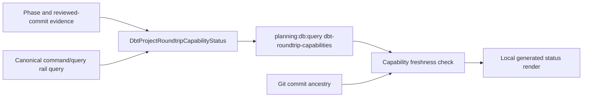
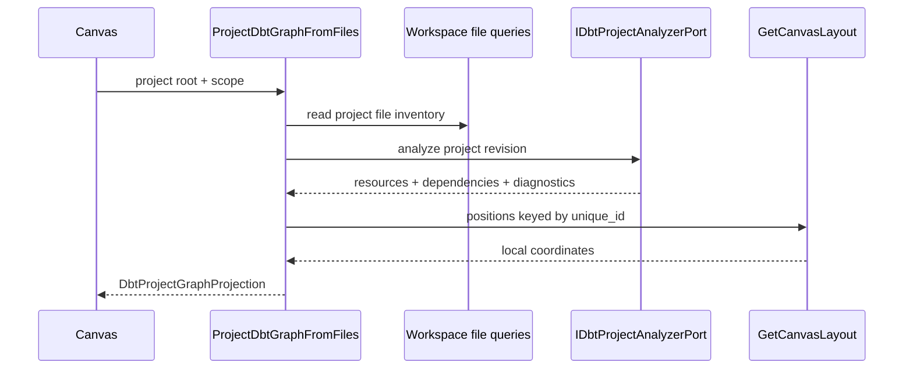

# DVT dbt Project Round-Trip

## Hard Fowler QA and Revised Architecture Specification

## 1. Executive verdict

The previous draft had the correct product instinct:

> DVT must not create a new user-facing language for dbt projects. A dbt user
> must see and edit normal dbt files, while Canvas acts as a visual projection
> and governed editing surface.

That direction is valid.

The draft was **not implementation-ready**, however, because it silently
overrode several accepted repository boundaries and proposed new commands,
routes, persistence locations, and transaction guarantees that do not match the
current codebase.

This revision keeps the product direction and changes the implementation model
to fit DVT's actual architecture.

### 1.1 Final target

For an explicitly file-backed dbt canvas:

```text
dbt project files
  -> dbt analysis adapter
  -> DbtProjectGraphProjection
  -> Canvas
  -> governed visual edits when lossless
  -> the same dbt project files
  -> persisted Execution Preview
  -> PlanRef
  -> StartRun
```

---

### 1.2 Active phase two: dbt analysis and read-only file projection

#### 1.2.1 Think-first analysis

**Problem.** The repository has no authoritative server-side path that turns a
scoped dbt project into the graph read model consumed by Canvas. The current
Canvas can only project `WorkspaceGraphAuthoringDraft.v1`, so treating workspace
files as authoritative would either require browser-owned dbt parsing or merge
file semantics with stale draft nodes and edges.

**Root cause.** Phase one closed conditional workspace-file mutation, but the
analysis boundary, project-revision model, file-backed graph query, and
authority-binding contract remain absent. `BuildDbtPlannerGraphSource` is an
execution projection and cannot own the authoring read model without mixing
reasons to change.

**Selected option.** Introduce the versioned
`CanvasAuthoringAuthorityBinding.v1` contract without changing
`WorkspaceGraphAuthoringDraft.v1`. Implement one protected query,
`ProjectDbtGraphFromFiles`, backed by an application service and an outbound
`IDbtProjectAnalyzerPort`. The production adapter runs `dbt parse` server-side,
reads the generated manifest from an isolated target directory, normalizes
resources, dependencies, diagnostics, capabilities, project revision, and
analysis hash, and removes temporary artifacts. Web consumes that query through
a typed port and projects nodes and edges by dbt `unique_id`; route-local layout
remains the only coordinate authority.

**Authority activation boundary.** Phase two implements and consumes the typed
binding but does not invent a public bind command. Persisting `none ->
dbt-project-files` belongs to the existing Canvas lifecycle during the phase
three open/import flow. Tests may construct a binding as contract input; product
runtime must not infer file authority from the presence of `dbt_project.yml`.

**Rejected alternatives.** Browser regex/Jinja parsing creates hidden authority.
Reusing `BuildDbtPlannerGraphSource` for the editor couples authoring to
execution. Persisting projected nodes in the graph draft creates a second
semantic authority. Reading a pre-existing `target/manifest.json` accepts stale
or user-controlled analysis. Creating `ValidateDbtProject` duplicates the
analysis query.

#### 1.2.2 Pre-implementation brief

- **Mode:** Full.
- **Scope:** authority-binding and graph-projection contracts; server analyzer
  port/adapter; protected query route; typed Web query port; read-only Canvas
  projection; route-local layout by `unique_id`; diagnostics and code-only
  posture; live vertical evidence.
- **Expected outcome:** a scoped, existing dbt project can be analyzed into a
  deterministic file-backed Canvas graph without reading or writing draft
  semantic nodes and without exposing credentials.
- **Risks and mitigations:** untrusted project code is constrained to `dbt
parse`, controlled profiles/target/log directories, disabled partial parse,
  bounded process output and timeout, scope-root validation, deterministic
  manifest normalization, and temporary-artifact cleanup. Analyzer failure
  returns an explicit invalid or unavailable projection and never changes
  authority.
- **Out of scope:** project import, binding persistence/transition command,
  Source Import mode split, visual mutation, planner projection, Preview/Run,
  bundle changes, export, graph-draft adoption, `.dvt/` sidecars, networked
  package installation, and browser-owned parsing.
- **Libraries evaluated:** dbt Core is the semantic analyzer required by the
  product decision; Node standard process/filesystem APIs and existing `zod`
  contracts are sufficient. No second parser library is introduced.
- **Command/query impact:** add only the accepted query
  `ProjectDbtGraphFromFiles`; reuse workspace scope authorization and
  `GetCanvasLayout`; no command is added.

#### 1.2.3 Fowler matrix

| Scenario                                  | Opportunity             | Fowler response                               | DDD owner                         | Rail                       | Required proof                         |
| ----------------------------------------- | ----------------------- | --------------------------------------------- | --------------------------------- | -------------------------- | -------------------------------------- |
| Browser would infer dbt refs and sources  | Boundary drift          | Separated Interface and server-side Gateway   | `DbtProjectAnalysis`              | `ProjectDbtGraphFromFiles` | analyzer and architecture tests        |
| Draft nodes can shadow file resources     | Hidden authority        | Explicit State plus read-model Strategy       | `CanvasAuthoringAuthorityBinding` | `ProjectDbtGraphFromFiles` | no-draft-merge architecture test       |
| Analysis and execution projection compete | Responsibility overload | Application Service plus dedicated read model | `DbtProjectGraphProjection`       | `ProjectDbtGraphFromFiles` | component/rail ownership query         |
| Display names are used as graph identity  | Primitive obsession     | Stable resource identity value                | dbt `unique_id`                   | `ProjectDbtGraphFromFiles` | identity and duplicate rejection tests |
| Stale target manifest is treated as truth | Hidden authority        | Fresh analysis Gateway                        | `DbtProjectAnalysis`              | `ProjectDbtGraphFromFiles` | isolated-target negative test          |
| Invalid projects make Canvas fall back    | Documentation drift     | Explicit unavailable/invalid states           | `DbtProjectGraphProjection`       | `ProjectDbtGraphFromFiles` | invalid project and no-fallback tests  |

#### 1.2.4 Phase-two definition of done

- `CanvasAuthoringAuthorityBinding.v1` is versioned and mutually exclusive;
- `WorkspaceGraphAuthoringDraft.v1` remains graph-draft only and unchanged;
- Planning DB exposes the query, components, files, relations, tests, gaps, and
  evidence relationally;
- the analyzer is an outbound port and production server adapter, not browser
  parsing or route logic;
- analysis is scoped to the authorized workspace and bound project root;
- project revision and analysis hashes are deterministic;
- nodes and edges use dbt `unique_id` and preserve source, model, seed,
  snapshot, test, exposure, and metric semantics when present;
- unsupported or dynamic constructs remain visible with `code_only` reasons;
- invalid/unavailable analysis preserves file authority and returns diagnostics;
- file-backed Canvas never merges draft semantic nodes or edges;
- layout coordinates remain route-local and keyed by stable resource identity;
- no `.dvt/` sidecar, dbt-specific save rail, generic visual-edit command, or
  file-backed Preview/Run path is added;
- contract, API, Web, architecture, and strict live vertical tests pass;
- ARC-2 evidence/risk, feature mechanization, governance refresh, and
  `pnpm verify:prepush` pass before closeout.

```feature-mechanization
version: 1
featureId: E-DBT-PROJECT-FILE-PROJECTION-PHASE2-20260713
mechanizationStatus: implemented
noHumanDecisionsRemaining: true
owner: dbt Project Analysis / Canvas Authoring
implementationPlan: docs/planning/proposals/mandatory/frontend-and-ux/dbt-project-roundtrip-product-plan-20260527.md
componentGuides:
  - docs/adr/ADR-0060-dbt-project-authoring-authority.md
userStories:
  - docs/planning/proposals/mandatory/frontend-and-ux/dbt-project-roundtrip-product-plan-20260527.md
governingSources:
  - AGENTS.md
  - docs/adr/ADR-0060-dbt-project-authoring-authority.md
  - docs/architecture/command-query-rail-governance.md
  - docs/architecture/fowler-opportunity-planning-governance.md
allowedImplementationSurfaces:
  - packages/@dvt/contracts/src/contracts/planner/CanvasAuthoringAuthorityBinding.v1.ts
  - packages/@dvt/contracts/src/contracts/planner/DbtProjectGraphProjection.v1.ts
  - packages/@dvt/contracts/src/index.ts
  - packages/@dvt/contracts/test/**
  - apps/api/src/application/ports/dbtProjectAnalysis.ts
  - apps/api/src/application/services/projectDbtGraphFromFilesUseCase.ts
  - apps/api/src/infrastructure/dbt/**
  - apps/api/src/entrypoints/http/dbtProjectGraphRoutes.ts
  - apps/api/src/entrypoints/http/dbtProjectGraphRouteGroup.ts
  - apps/api/src/entrypoints/http/registerProtectedRuntimeRoutes.ts
  - apps/api/src/entrypoints/http/httpErrorReasonCatalog.ts
  - apps/api/src/plugins/env.ts
  - apps/api/test/application/projectDbtGraphFromFilesUseCase.test.ts
  - apps/api/test/infrastructure/dbt/**
  - apps/api/test/entrypoints/http/dbtProjectGraphRoutes.test.ts
  - apps/web/src/app/ports/dbtProjectGraph.ts
  - apps/web/src/app/services/dbtProject/**
  - apps/web/src/app/queries/dbtProjectQueries.ts
  - apps/web/src/app/views/canvas/**
  - apps/web/src/app/plugins/dbt/**
  - apps/web/cypress/e2e/dbt/**
  - docs/architecture/components/web/**
  - docs/evidence/**
  - docs/risk-register/quality/**
  - docs/planning/proposals/mandatory/frontend-and-ux/dbt-project-roundtrip-product-plan-20260527.md
  - scripts/planning-db-migrate.test.cjs
  - tools/planning-db/migrations/644_dbt_project_file_projection_phase2_design.sql
  - tools/planning-db/migrations/645_dbt_project_file_projection_phase2_api_closeout.sql
  - tools/planning-db/migrations/646_dbt_project_file_projection_phase2_web_closeout.sql
  - tools/planning-db/migrations/647_dbt_project_file_projection_phase2_live_closeout.sql
forbiddenImplementationSurfaces:
  - packages/@dvt/contracts/src/contracts/planner/WorkspaceGraphAuthoringDraft.v1.ts
  - packages/@dvt/engine/**
  - packages/@dvt/planner/**
  - packages/@dvt/adapter-*/**
  - apps/api/src/application/services/importWarehouseSourcesUseCase.ts
  - apps/web/src/app/views/canvas/useCanvasExecutionActions.ts
commandQueryRails:
  - name: ProjectDbtGraphFromFiles
    type: query
    dddOwner: DbtProjectGraphProjection
domainObjects:
  - name: CanvasAuthoringAuthorityBinding
    type: value object
    owner: Canvas Authoring
  - name: DbtProjectAnalysis
    type: read model
    owner: dbt Project Analysis
  - name: DbtProjectGraphProjection
    type: projection
    owner: dbt Project Analysis
fowlerSignals:
  - Boundary drift
  - Hidden authority
  - Responsibility overload
  - Primitive obsession
  - Test-only confidence
architectureGuards:
  - pnpm --filter dvt-api test:arch
  - pnpm --filter @dvt/web test:architecture:run -- src/app/views/canvas/dbtProjectFileProjection.architecture.test.ts
cypressFlows:
  - apps/web/cypress/e2e/dbt/dbt-project-file-projection-live.cy.ts
completionGate:
  - pnpm --filter @dvt/contracts test
  - pnpm --filter dvt-api test
  - pnpm --filter dvt-api typecheck
  - pnpm --filter dvt-api lint
  - pnpm --filter @dvt/web test:unit:run
  - pnpm --filter @dvt/web test:presentation:run
  - pnpm --filter @dvt/web typecheck
  - pnpm --filter @dvt/web lint
  - node --test scripts/planning-db-migrate.test.cjs
  - pnpm docs:feature-mechanization:implementation -- --feature E-DBT-PROJECT-FILE-PROJECTION-PHASE2-20260713
  - pnpm verify:prepush
redGreenCycles:
  - id: dbt-project-analysis-contract
    redTest: pnpm --filter @dvt/contracts test -- CanvasAuthoringAuthorityBinding DbtProjectGraphProjection
    expectedFailure: Versioned authority binding and deterministic dbt projection contracts do not exist.
    patchSurfaces:
      - packages/@dvt/contracts/src/contracts/planner/CanvasAuthoringAuthorityBinding.v1.ts
      - packages/@dvt/contracts/src/contracts/planner/DbtProjectGraphProjection.v1.ts
    greenTest: pnpm --filter @dvt/contracts test -- CanvasAuthoringAuthorityBinding DbtProjectGraphProjection
  - id: dbt-server-analyzer
    redTest: pnpm --filter dvt-api exec vitest run test/infrastructure/dbt/DbtCliProjectAnalyzer.test.ts
    expectedFailure: No scoped server analyzer produces deterministic manifest-backed analysis or cleans isolated artifacts.
    patchSurfaces:
      - apps/api/src/application/ports/dbtProjectAnalysis.ts
      - apps/api/src/infrastructure/dbt/DbtCliProjectAnalyzer.ts
    greenTest: pnpm --filter dvt-api exec vitest run test/infrastructure/dbt/DbtCliProjectAnalyzer.test.ts
  - id: dbt-project-graph-query
    redTest: pnpm --filter dvt-api exec vitest run test/application/projectDbtGraphFromFilesUseCase.test.ts test/entrypoints/http/dbtProjectGraphRoutes.test.ts
    expectedFailure: The protected ProjectDbtGraphFromFiles query and explicit invalid/unavailable states do not exist.
    patchSurfaces:
      - apps/api/src/application/services/projectDbtGraphFromFilesUseCase.ts
      - apps/api/src/entrypoints/http/dbtProjectGraphRoutes.ts
    greenTest: pnpm --filter dvt-api exec vitest run test/application/projectDbtGraphFromFilesUseCase.test.ts test/entrypoints/http/dbtProjectGraphRoutes.test.ts
  - id: dbt-file-backed-canvas-projection
    redTest: pnpm --filter @dvt/web test:unit:run -- src/app/views/canvas/dbtProjectFileProjection.test.ts
    expectedFailure: Canvas has no authority-aware read-only projection keyed by dbt unique_id.
    patchSurfaces:
      - apps/web/src/app/views/canvas/dbtProjectFileProjection.ts
    greenTest: pnpm --filter @dvt/web test:unit:run -- src/app/views/canvas/dbtProjectFileProjection.test.ts
symbols:
  - name: CanvasAuthoringAuthorityBindingSchema
    path: packages/@dvt/contracts/src/contracts/planner/CanvasAuthoringAuthorityBinding.v1.ts
    dddOwner: CanvasAuthoringAuthorityBinding
    cqRails: [ProjectDbtGraphFromFiles]
    fowlerSignals: [Hidden authority]
    architectureGuard: pnpm --filter @dvt/contracts test -- CanvasAuthoringAuthorityBinding
    cypressCoverage: apps/web/cypress/e2e/dbt/dbt-project-file-projection-live.cy.ts
    unitTests: [packages/@dvt/contracts/test/dbt-project-file-projection.contract.test.ts]
  - name: DbtProjectGraphProjectionSchema
    path: packages/@dvt/contracts/src/contracts/planner/DbtProjectGraphProjection.v1.ts
    dddOwner: DbtProjectGraphProjection
    cqRails: [ProjectDbtGraphFromFiles]
    fowlerSignals: [Primitive obsession]
    architectureGuard: pnpm --filter @dvt/contracts test -- DbtProjectGraphProjection
    cypressCoverage: apps/web/cypress/e2e/dbt/dbt-project-file-projection-live.cy.ts
    unitTests: [packages/@dvt/contracts/test/dbt-project-file-projection.contract.test.ts]
  - name: IDbtProjectAnalyzerPort
    path: apps/api/src/application/ports/dbtProjectAnalysis.ts
    dddOwner: DbtProjectAnalysis
    cqRails: [ProjectDbtGraphFromFiles]
    fowlerSignals: [Boundary drift]
    architectureGuard: pnpm --filter dvt-api test:arch
    cypressCoverage: apps/web/cypress/e2e/dbt/dbt-project-file-projection-live.cy.ts
    unitTests: [apps/api/test/infrastructure/dbt/DbtCliProjectAnalyzer.test.ts]
  - name: ProjectDbtGraphFromFilesUseCase
    path: apps/api/src/application/services/projectDbtGraphFromFilesUseCase.ts
    dddOwner: DbtProjectGraphProjection
    cqRails: [ProjectDbtGraphFromFiles]
    fowlerSignals: [Responsibility overload]
    architectureGuard: pnpm --filter dvt-api test:arch
    cypressCoverage: apps/web/cypress/e2e/dbt/dbt-project-file-projection-live.cy.ts
    unitTests: [apps/api/test/application/projectDbtGraphFromFilesUseCase.test.ts]
  - name: DbtCliProjectAnalyzer
    path: apps/api/src/infrastructure/dbt/DbtCliProjectAnalyzer.ts
    dddOwner: DbtProjectAnalysis
    cqRails: [ProjectDbtGraphFromFiles]
    fowlerSignals: [Boundary drift]
    architectureGuard: pnpm --filter dvt-api test:arch
    cypressCoverage: apps/web/cypress/e2e/dbt/dbt-project-file-projection-live.cy.ts
    unitTests: [apps/api/test/infrastructure/dbt/DbtCliProjectAnalyzer.test.ts]
  - name: registerDbtProjectGraphRoutes
    path: apps/api/src/entrypoints/http/dbtProjectGraphRoutes.ts
    dddOwner: ProjectDbtGraphFromFiles HTTP adapter
    cqRails: [ProjectDbtGraphFromFiles]
    fowlerSignals: [Boundary drift]
    architectureGuard: pnpm --filter dvt-api test:arch
    cypressCoverage: apps/web/cypress/e2e/dbt/dbt-project-file-projection-live.cy.ts
    unitTests: [apps/api/test/entrypoints/http/dbtProjectGraphRoutes.test.ts]
  - name: buildDbtProjectFileProjection
    path: apps/web/src/app/views/canvas/dbtProjectFileProjection.ts
    dddOwner: DbtProjectGraphProjection
    cqRails: [ProjectDbtGraphFromFiles]
    fowlerSignals: [Hidden authority]
    architectureGuard: pnpm --filter @dvt/web test:architecture:run -- src/app/views/canvas/dbtProjectFileProjection.architecture.test.ts
    cypressCoverage: apps/web/cypress/e2e/dbt/dbt-project-file-projection-live.cy.ts
    unitTests: [apps/web/src/app/views/canvas/dbtProjectFileProjection.test.ts]
```

For the current graph-draft bootstrap dbt canvas:

```text
Canvas graph draft
  -> GenerateDbtWorkspaceArtifacts
  -> dbt project files
  -> adopt file-backed authority
```

The transition from graph-authored bootstrap to file-backed dbt authority must
be explicit and one-way. DVT must never switch between those authority models
silently.

### 1.3 Main corrections to the previous draft

1. File authority requires an explicit authority-mode decision and an ADR.
2. The existing graph-first draft contract cannot quietly become a projection.
3. `.dvt/` is removed from the MVP because Canvas layout already has an
   accepted route-local owner.
4. Existing workspace-file commands are reused and hardened instead of
   introducing a duplicate dbt file-save route.
5. `StartRun`, `PreviewExecutionPlan`, and `ObservePlanRunReadiness` remain the
   runtime rails; no dbt-specific run synonym is introduced.
6. dbt analysis is a new outbound adapter capability, not a new browser parser.
7. Imported arbitrary SQL is read/projected first; visual mutation is limited to
   provably lossless edits.
8. Source Import must follow the active authority mode instead of always writing
   both YAML and graph-draft semantics.
9. Workspace file revisions, conditional writes, and batch mutation are explicit
   infrastructure prerequisites.
10. The current runtime bundle must stop including `profiles.yml` and must bind
    to a specific dbt project root and project revision.

---

# 2. Review scope and source evidence

## 2.1 Governing repository sources

The review used:

- `AGENTS.md`
- `docs/planning/status/governance-document-rule-inventory.md`
- `docs/architecture/command-query-rail-governance.md`
- `docs/architecture/fowler-opportunity-planning-governance.md`
- `docs/planning/proposals/mandatory/frontend-and-ux/dbt-project-roundtrip-product-plan-20260527.md`
- `docs/planning/proposals/mandatory/frontend-and-ux/dbt-authoring-code-run-vertical-plan-20260526.md`
- `docs/architecture/components/web/graph/canvas-workbench-command-query-catalog.md`
- `docs/architecture/components/web/code-workbench-workspace-files-component.md`
- `docs/architecture/components/web/graph/canvas-layout-persistence-component.md`
- `docs/architecture/components/web/graph/canvas-plan-run-readiness-component.md`
- `docs/adr/ADR-0059-canonical-node-identity.md`

## 2.2 Current implementation surfaces inspected

### Canvas and dbt authoring

- `packages/@dvt/contracts/src/contracts/planner/WorkspaceGraphAuthoringDraft.v1.ts`
- `apps/web/src/app/views/canvas/canvasDbtAuthoringModel.ts`
- `apps/web/src/app/views/canvas/canvasDbtWorkspaceArtifacts.ts`
- `apps/web/src/app/views/canvas/canvasDbtPlannerGraphSource.ts`
- `apps/web/src/app/views/canvas/canvasPlanAction.ts`
- `apps/web/src/app/plugins/dbt/dbtContributions.ts`

### Code and workspace files

- `apps/web/src/app/views/CodeView.tsx`
- `apps/web/src/app/ports/workspace.ts`
- `apps/api/src/application/ports/workspaceFiles.ts`
- `apps/api/src/application/services/saveWorkspaceFileContentUseCase.ts`
- `apps/api/src/infrastructure/workspaceFiles/LocalWorkspaceFileRepository.ts`
- `apps/api/src/entrypoints/http/workspaceFilesRoutes.ts`

### Source Import

- `apps/api/src/application/services/importWarehouseSourcesUseCase.ts`
- `apps/web/src/app/components/sourceImportWizard/**`

### Preview and runtime binding

- `apps/web/src/app/views/canvas/canvasPlanReadiness.ts`
- `apps/api/src/application/services/DbtRunExecutionContextBindingUseCase.ts`
- current dbt live Cypress proofs.

---

# 3. Current-state truth

## 3.1 The graph draft is currently authoritative

`WorkspaceGraphAuthoringDraft.v1` describes itself as the graph-first editable
aggregate and says that planner and Canvas share one editable authoring truth.

It stores:

- semantic nodes;
- semantic edges;
- visible node IDs;
- node positions;
- canvas documents.

The current Canvas architecture also treats the protected semantic graph as the
first authority.

Therefore this statement from the previous draft:

```text
dbt files are authoritative and Canvas is only a projection
```

is a **target-state architectural change**, not a description of current code.

It requires:

- an authority-mode policy;
- canonical documentation changes;
- an ADR or accepted equivalent decision;
- contract and architecture guards;
- migration behavior for existing canvases.

## 3.2 Current dbt authoring generates files from Canvas

`canvasDbtWorkspaceArtifacts.ts`:

- reads canonical nodes and edges;
- reads `DbtNodeAuthoringMetadata`;
- generates `dbt_project.yml`;
- generates `models/<name>.sql`;
- generates `models/schema.yml`.

Generated SQL is deliberately simple:

```sql
{{ config(materialized='view') }}

select *
from {{ source('source_name', 'table_name') }}
```

This is a bootstrap generator, not a round-trip editor for arbitrary dbt code.

## 3.3 Preview currently rewrites files from the graph draft

For `planner_generic_preview`, `executeCanvasPlanAction(...)` currently:

1. resolves the execution scope from Canvas nodes;
2. calls `buildDbtWorkspaceArtifacts(...)`;
3. writes every generated file through `SaveWorkspaceFileContent`;
4. builds the planner graph source from Canvas nodes and edges;
5. requests the persisted preview.

That behavior is correct for the current graph-authored mode, but it would be
destructive for an imported file-backed project.

## 3.4 Code is currently a local editable buffer

`CodeView`:

- lists workspace files;
- reads file content;
- opens Monaco in editable mode;
- keeps edits in `CodeEditableBuffer`;
- does not expose a governed Save command.

The shared backend write rail exists, but the browser does not yet persist
manual edits.

## 3.5 Workspace file writes have no revision guard

`WorkspaceFileContent` currently exposes:

- path;
- name;
- language;
- content;
- lastModified.

`SaveWorkspaceFileContent` accepts only:

```text
path + content
```

`LocalWorkspaceFileRepository.saveFileContent(...)` performs an unconditional
write.

There is no:

- expected revision;
- expected content hash;
- compare-and-swap;
- conflict receipt;
- atomic multi-file mutation.

## 3.6 Source Import currently writes two authorities

`ImportWarehouseSourcesUseCase`:

1. writes dbt source YAML;
2. appends imported source nodes to the authoritative graph draft;
3. rolls back YAML when draft save fails.

This is correct for the current graph-authoritative model.

In a file-backed dbt model, that same command must not append semantic nodes to
the draft. The node must appear through file analysis and graph projection.

## 3.7 Runtime bundling is project-root unaware

`DbtRunExecutionContextBindingUseCase` currently:

- scans one configured workspace root;
- selects known dbt files/directories;
- builds a tarball;
- binds it to the run context.

It does not bind the bundle to:

- a declared dbt project root;
- a project revision;
- a manifest hash.

## 3.8 Runtime bundling currently includes profiles.yml

The runtime bundle allowlist includes `profiles.yml`.

That is incompatible with the intended security posture. dbt execution
credentials must remain server-owned and reference-based; they must not enter a
portable project bundle by default.

## 3.9 No dbt project analyzer currently exists

The reviewed source does not implement a repository-owned:

- `dbt parse` adapter;
- manifest projection service;
- project compatibility report;
- file-to-Canvas graph projector.

The target architecture therefore requires a real new outbound adapter and
application query path.

---

# 4. Hard Fowler QA findings

## 4.1 Severity model

- **P0** — blocks adoption of the specification or creates security/data-loss risk.
- **P1** — blocks a reliable implementation slice.
- **P2** — important maturity or maintainability issue.
- **P3** — improvement that can follow after the core boundary is safe.

## 4.2 Findings summary

| ID   | Severity | Finding                                                                                              |
| ---- | -------: | ---------------------------------------------------------------------------------------------------- |
| F-01 |       P0 | File authority contradicts the current graph-first public contract unless authority mode is explicit |
| F-02 |       P0 | Preview would overwrite imported dbt code through the current Canvas artifact generator              |
| F-03 |       P0 | Runtime project bundle currently includes `profiles.yml`                                             |
| F-04 |       P1 | The previous draft introduced duplicate file-save commands and routes                                |
| F-05 |       P1 | Workspace files lack revision/CAS semantics                                                          |
| F-06 |       P1 | The previous draft promised a dbt analyzer that does not exist                                       |
| F-07 |       P1 | `.dvt/` sidecar persistence conflicts with accepted route-local layout ownership                     |
| F-08 |       P1 | Visual SQL/Jinja mutation scope was materially overpromised                                          |
| F-09 |       P1 | Source Import is hard-wired to graph-draft authority                                                 |
| F-10 |       P1 | Planner graph source is derived from draft nodes, not a dbt manifest projection                      |
| F-11 |       P1 | Runtime bundle is not bound to project root or project revision                                      |
| F-12 |       P1 | Local workspace repository is not yet generally dbt-project compatible                               |
| F-13 |       P1 | Atomic import and multi-file visual edits have no repository transaction boundary                    |
| F-14 |       P2 | Current dbt authoring silently normalizes unsupported values                                         |
| F-15 |       P2 | Code initial-file selection favors DVT pipeline YAML over dbt project context                        |
| F-16 |       P2 | Several proposed query names duplicated the same analysis intent                                     |
| F-17 |       P2 | Several proposed command results were screen-shaped read models                                      |
| F-18 |       P2 | The previous draft did not define a safe graph-draft adoption transition                             |

---

## 4.3 Detailed findings

### F-01 — Hidden authority and contract contradiction

**Signal:** Hidden authority, duplicate semantics, documentation drift.

The public graph draft contract currently says the graph is the editable
authoring truth. The previous specification changed authority to files without
changing that contract.

**Required response:**

Introduce a typed authority policy:

```ts
type CanvasAuthoringAuthority =
  | { kind: 'graph-draft' }
  | {
      kind: 'dbt-project-files';
      projectRoot: string;
    };
```

This policy must be accepted before file-backed behavior is implemented.

**Pattern:**

- Policy Object
- Explicit State
- Read Model Projection
- Anti-Corruption Layer

**DDD owner:**

`CanvasAuthoringAuthorityPolicy`.

**Architecture guard:**

A file-backed canvas must not consume draft semantic nodes/edges as execution
truth.

---

### F-02 — Destructive Preview path

**Signal:** Hidden authority and destructive projection.

Current Preview writes generated dbt files from Canvas every time. If an
imported user file already exists, this can destroy arbitrary SQL, comments,
Jinja, CTEs, and project configuration.

**Required response:**

Branch Preview by authority:

```text
graph-draft authority
  -> GenerateDbtWorkspaceArtifacts
  -> Preview

dbt-project-files authority
  -> analyze existing project files
  -> BuildDbtPlannerGraphSource from projection
  -> Preview
```

`GenerateDbtWorkspaceArtifacts` must never run during normal Preview for a
file-backed project.

---

### F-03 — profiles.yml bundle leakage

**Signal:** Boundary drift and security leakage.

The current runtime bundle includes `profiles.yml`.

**Required response:**

- exclude `profiles.yml` from project bundles;
- resolve execution target through server-owned credential references;
- add a negative test that scans bundle entries;
- add a security/risk update when implementation begins.

**Pattern:**

- Anti-Corruption Layer
- Secret Reference
- Explicit Gateway

---

### F-04 — Duplicate file-save semantics

**Signal:** Duplicate semantics.

The previous specification proposed both:

- `SaveWorkspaceFileContent`;
- `SaveDbtProjectFileEdit`;
- a new dbt-specific file-save HTTP route.

The core user intent is still saving a workspace file.

**Required response:**

Evolve and reuse `SaveWorkspaceFileContent`:

```ts
type SaveWorkspaceFileContentInput = {
  path: string;
  content: string;
  expectedRevision: { kind: 'absent' } | { kind: 'content_sha256'; value: string };
};
```

The expected revision is mandatory. A retry is naturally idempotent when the
current content SHA already equals the requested content SHA; a separate
cross-store idempotency ledger would create a non-atomic database/filesystem
write and is therefore rejected for this single-file command.

After save, the dbt projection query is invalidated and refetched.

Do not add `/workspace/dbt/files/:path`.

No generic visual-edit exception is accepted in Phase 0. A concrete lossless
mutation may justify a distinct command later, after its DDD owner, file
mutation boundary, and preservation fixtures exist.

---

### F-05 — Missing concurrency policy

**Signal:** Anemic domain and unsafe gateway.

The current save use case delegates an unconditional write.

**Required response:**

Add:

- `WorkspaceFileRevision` value object;
- content SHA on reads;
- expected SHA on writes;
- `WorkspaceFileConflictError`;
- conditional atomic file replacement;
- conflict UI.

A stale Code buffer must never overwrite a newer file silently.

---

### F-06 — Missing analyzer adapter

**Signal:** Proposed architecture without implementation boundary.

The target requires a dbt analysis capability, but the repo has no such adapter.

**Required response:**

Add an outbound port:

```ts
interface IDbtProjectAnalyzerPort {
  analyze(input: AnalyzeDbtProjectInput): Promise<DbtProjectAnalysis>;
}
```

The adapter runs server-side in a constrained environment. Browser code must not
implement authoritative Jinja parsing.

The analyzer is an internal dependency of `ProjectDbtGraphFromFiles`; it is not
a separate product route by itself.

---

### F-07 — Unplanned `.dvt/` sidecar

**Signal:** Boundary drift and scope expansion.

Canvas layout already belongs to:

- `PersistCanvasLayout`;
- `GetCanvasLayout`;
- route-local frontend state.

Adding `.dvt/` would create a new shared-persistence rail and conflict with the
accepted component boundary.

**Required response:**

MVP keeps current route-local layout persistence and keys positions by stable dbt
resource identity.

A future collaborative/shared-layout feature needs a separate proposal and rail.

No `.dvt/` directory is introduced by this specification.

---

### F-08 — Unsafe visual mutation promise

**Signal:** Responsibility overload and false completeness.

Arbitrary dbt SQL/Jinja cannot be safely rewritten by replacing a dependency or
materialization string.

**Required response:**

Phase visual editing:

1. project and inspect arbitrary projects;
2. save code directly;
3. support only lossless, unambiguous visual edits;
4. mark everything else `code_only`.

MVP visual edits should prioritize CST-preserving YAML operations. SQL/Jinja
edits require an explicit mutation strategy and preservation proof.

---

### F-09 — Source Import authority mismatch

**Signal:** Duplicate authority.

Current Source Import writes both YAML and draft nodes.

**Required response:**

```text
graph-draft authority:
  current behavior remains

dbt-project-files authority:
  write/merge source YAML
  analyze project
  project source nodes into Canvas
  do not append semantic draft nodes
```

The same `ImportWarehouseSources` rail may branch through the authority policy;
no duplicate Source Import rail is needed.

---

### F-10 — Planner projection uses the draft graph

**Signal:** Feature envy and hidden authority.

`BuildDbtPlannerGraphSource` currently consumes Canvas nodes and edges.

**Required response:**

Keep the rail but change its file-backed input to `DbtProjectGraphProjection`.

The generic Canvas layer must not infer dbt dependencies independently of the
dbt analysis owner.

---

### F-11 — Bundle lacks project identity

**Signal:** Primitive obsession and broad workspace coupling.

The bundle builder scans one workspace root.

**Required response:**

Bind execution to:

```ts
type DbtProjectExecutionIdentity = {
  projectRoot: string;
  projectRevision: string;
  analysisSha256: string;
};
```

Only files beneath the bound project root enter the bundle.

---

### F-12 — Workspace repository compatibility gaps

**Signal:** Hidden constraints.

Current local repository:

- allows only a limited extension set;
- excludes `.csv` and `.py`;
- caps listed files at 500;
- caps file size at 1 MB;
- performs direct writes.

**Required response:**

Define explicit dbt compatibility limits and update the repository or add a
dbt-project repository adapter.

At minimum, preserve:

- SQL;
- YAML;
- CSV seeds;
- Python models when declared supported;
- Markdown docs;
- project/package files.

Limits must produce diagnostics, not silently omit resources.

---

### F-13 — Missing batch mutation boundary

**Signal:** Transaction Script without transaction ownership.

Import, rename, and some visual edits affect multiple files.

**Required response:**

Add an internal outbound port:

```ts
interface IWorkspaceFileBatchMutationPort {
  apply(input: WorkspaceFileBatchMutation): Promise<WorkspaceFileBatchReceipt>;
}
```

This is not a new UI rail. It is a Gateway used by:

- `ImportDbtProject`;
- any accepted future cross-file visual mutation;
- graph-draft adoption.

MVP visual edits may be restricted to one file until this port exists.

---

### F-14 — Silent normalization

**Signal:** Primitive obsession and data loss.

Current dbt authoring metadata normalizes identifiers and replaces unknown
materializations with `view`.

That behavior is acceptable only for generated bootstrap content.

It is not acceptable for imported projects.

**Required response:**

File-backed projection must preserve exact dbt values. Unsupported values become
`code_only`; they are not coerced.

---

### F-15 — Code selection policy is DVT-oriented

**Signal:** Context leakage.

Code currently prefers `pipelines/*.yaml|yml`.

**Required response:**

Selection policy must depend on canvas authority:

```text
DVT transformation -> pipelines first
dbt file-backed -> selected resource path, then dbt_project.yml, then first model
```

---

### F-16 — Duplicate analysis queries

**Signal:** Duplicate semantics.

The previous draft proposed:

- `GetDbtProjectCompatibility`;
- `ValidateDbtProject`;
- `ProjectDbtGraphFromFiles`.

All depend on the same project analysis.

**Required response:**

Use:

- `ValidateDbtProjectImport` before import;
- `ProjectDbtGraphFromFiles` for the active project, returning projection plus
  diagnostics and compatibility posture.

A UI “Validate” action forces a fresh projection query. It does not need another
product query name.

---

### F-17 — Screen-shaped command results

**Signal:** Command/query mixing.

The previous save command returned a full graph projection.

**Required response:**

Commands return receipts:

```ts
type SaveWorkspaceFileContentReceipt = {
  kind: 'saved' | 'unchanged';
  disposition: 'created' | 'updated' | null;
  path: string;
  contentSha256: string;
  projectRevisionHint?: string;
};
```

The UI then calls/refetches `ProjectDbtGraphFromFiles`.

---

### F-18 — Missing graph-draft transition

**Signal:** Incomplete lifecycle.

Existing dbt canvases depend on draft metadata and generated files.

**Required response:**

Define an explicit adoption flow:

```text
graph-draft-authored canvas
  -> generate bootstrap files
  -> validate files
  -> bind project root
  -> switch authority to dbt-project-files
  -> stop treating dbt node metadata as semantic authority
```

Failure leaves the canvas in graph-draft mode.

---

# 5. Fowler opportunity matrix

| Scenario                                         | Opportunity                      | Fowler response                             | DDD owner                        | Rail                                                          | Required proof                     |
| ------------------------------------------------ | -------------------------------- | ------------------------------------------- | -------------------------------- | ------------------------------------------------------------- | ---------------------------------- |
| Files and graph both claim dbt meaning           | Hidden authority                 | Explicit authority Policy Object            | `CanvasAuthoringAuthorityPolicy` | authority transition within existing Canvas lifecycle         | architecture guard + migration E2E |
| Preview overwrites imported SQL                  | Boundary drift                   | Strategy split by authority                 | `DbtPreviewSourcePolicy`         | `GenerateDbtWorkspaceArtifacts`, `BuildDbtPlannerGraphSource` | preservation test                  |
| Code save overwrites newer content               | Anemic command                   | CAS value object and conditional repository | `WorkspaceFileRevision`          | `SaveWorkspaceFileContent`                                    | stale-write integration test       |
| Browser parses Jinja                             | Boundary drift                   | Outbound analyzer port                      | `DbtProjectAnalysis`             | `ProjectDbtGraphFromFiles`                                    | architecture test                  |
| dbt-specific file save duplicates workspace save | Duplicate semantics              | Reuse existing command                      | `WorkspaceFileContent`           | `SaveWorkspaceFileContent`                                    | C&Q catalog guard                  |
| Visual edit rewrites arbitrary SQL               | Responsibility overload          | Conservative mutation policy                | `DbtVisualEditPolicy`            | deferred until a concrete lossless operation exists           | preservation fixtures              |
| Source Import writes two authorities             | Hidden authority                 | Authority-aware application service         | `WarehouseSourceImport`          | `ImportWarehouseSources`                                      | mode-specific integration tests    |
| Runtime bundles broad workspace                  | Data clump / primitive obsession | Project execution identity                  | `DbtProjectExecutionIdentity`    | existing `StartRun` binding                                   | bundle content tests               |
| profiles.yml enters bundle                       | Boundary drift                   | Secret-reference boundary                   | execution target policy          | existing StartRun binding                                     | secret leakage test                |
| `.dvt/` added for layout                         | Duplicate persistence            | Reuse local layout projection               | `CanvasLayoutProjection`         | `PersistCanvasLayout`                                         | no-sidecar architecture guard      |
| Import needs multi-file atomicity                | Transaction script               | Batch mutation Gateway                      | `WorkspaceFileBatchMutation`     | `ImportDbtProject`                                            | injected-failure rollback test     |
| Multiple validation query names                  | Duplicate semantics              | One analysis read model                     | `DbtProjectGraphProjection`      | `ProjectDbtGraphFromFiles`                                    | catalog test                       |

---

# 6. Revised product decision

## 6.1 No new DVT language

A dbt user edits normal dbt assets:

```text
dbt_project.yml
models/**/*.sql
models/**/*.yml
seeds/**
snapshots/**
macros/**
tests/**
packages.yml
dependencies.yml
```

DVT may maintain internal normalized objects, but they are not a user-facing
language or a second project definition.

## 6.2 Two explicit authority modes

```ts
type CanvasAuthoringAuthority =
  | {
      kind: 'graph-draft';
    }
  | {
      kind: 'dbt-project-files';
      projectRoot: string;
    };
```

### graph-draft

Current behavior:

- protected draft owns semantic nodes and edges;
- dbt files are generated for Preview/Run;
- intended for empty-canvas bootstrap and graph-draft canvases.

### dbt-project-files

Target behavior:

- workspace dbt files own dbt semantics;
- Canvas reads `DbtProjectGraphProjection`;
- Code edits workspace files;
- graph draft does not own projected dbt resources or dependencies;
- layout remains route-local.

## 6.3 Authority transition

Allowed transitions:

```text
none -> graph-draft
none -> dbt-project-files through import/open
graph-draft -> dbt-project-files through successful adoption
```

Forbidden transition:

```text
dbt-project-files -> graph-draft as an automatic fallback
```

If analysis fails, the file-backed project remains file-backed and enters an
invalid/degraded state.

---

# 7. Required architecture decision

Before implementation, create an accepted ADR or equivalent normative decision
covering:

1. authority modes;
2. ownership of dbt semantics;
3. treatment of the existing graph draft contract;
4. transition rules;
5. file-backed Canvas projection;
6. project-root binding;
7. Source Import behavior by mode;
8. Preview/Run provenance;
9. backward compatibility.

Because `WorkspaceGraphAuthoringDraft.v1` lives under `@dvt/contracts`, changing
its public semantics activates ARC-2 review requirements.

## 7.1 Contract approach

Accepted approach, governed by `ADR-0060`:

Introduce a versioned Canvas authoring authority binding:

```ts
type WorkspaceGraphAuthoringCanvasAuthority =
  | {
      kind: 'graph-draft';
    }
  | {
      kind: 'dbt-project-files';
      projectRoot: string;
    };
```

For `dbt-project-files`:

- `WorkspaceGraphAuthoringDraft.v1` is not used to persist shadow semantic
  nodes/edges;
- the route obtains nodes/edges from `ProjectDbtGraphFromFiles`;
- local layout maps positions by dbt `unique_id`.

`WorkspaceGraphAuthoringDraft.v1` remains graph-draft only. The authority
binding belongs to a versioned Canvas authoring document boundary so that a
file-backed Canvas does not carry ignored graph state. Contract implementation
still requires planner/contracts ARC-2 evidence before code changes.

---

# 8. Canonical command/query rail set

## 8.1 Reused rails

| Rail                            | Type    | Required change                                    |
| ------------------------------- | ------- | -------------------------------------------------- |
| `ListWorkspaceFiles`            | query   | expose dbt-compatible files and explicit limits    |
| `GetWorkspaceFileContent`       | query   | return content SHA/revision                        |
| `SaveWorkspaceFileContent`      | command | add mandatory expected SHA and conflict receipt    |
| `GenerateDbtWorkspaceArtifacts` | command | restrict to graph-draft bootstrap/adoption         |
| `BuildDbtPlannerGraphSource`    | query   | accept file-derived projection in file-backed mode |
| `ImportWarehouseSources`        | command | branch by authority mode                           |
| `PreviewExecutionPlan`          | command | reuse                                              |
| `ObservePlanRunReadiness`       | query   | reuse and map dbt analysis blockers                |
| `StartRun`                      | command | reuse                                              |
| `GetRunStatus`                  | query   | reuse                                              |
| `GetRunEvents`                  | query   | reuse                                              |

## 8.2 Acceptance-time product-intent baseline

The following table is the immutable acceptance-time baseline reviewed at
`800be353aee4bf85c03be671e142fe7d5dd11df1`. Its status cells explain the
implementation decisions that were still open when this plan was accepted;
they are historical evidence, not the current capability authority.

| Rail                       | Type    | Owner                           | Status          |
| -------------------------- | ------- | ------------------------------- | --------------- |
| `ValidateDbtProjectImport` | query   | dbt project import              | not implemented |
| `ImportDbtProject`         | command | dbt project import              | not implemented |
| `ProjectDbtGraphFromFiles` | query   | dbt project analysis/projection | not implemented |
| `ExportDbtProject`         | command | dbt project export              | not implemented |

At acceptance, the three historical import/export intents remained retired in
the executable catalog pending implementation slices with real ownership and
ports. `ProjectDbtGraphFromFiles` was a required future query intent, but it was
not yet an active rail or implemented capability in that baseline.

### 8.2.1 Current capability truth projection

Current state is owned by Planning DB and queried through
`ProjectDbtRoundtripCapabilityStatus`. The projection joins each phase/rail
expectation to the canonical command/query catalog rather than copying rail
status into another document. A reviewed Git commit is evidence, not status:
the checker proves that every recorded commit exists and is an ancestor of the
checked repository ref.



Invariants:

1. One row exists for every governed Phase 2-4 rail and for the deferred export
   boundary; duplicate phase/rail rows fail closed.
2. `rail_status` and `mechanization_status` come only from the canonical rail
   projection. The evidence relation stores no second copy of current status.
3. The expected posture is explicit and compared mechanically with current
   rail state. A missing, renamed, retired, or unexpectedly implemented rail
   makes the check fail.
4. Every row carries the reviewed commit and PR that justified its expected
   posture. Missing, unknown, or non-ancestor commits make the check fail.
5. The Markdown render is generated under `.generated-docs`; it is a reading
   surface and never a write authority.
6. The historical table above remains unchanged when current capability state
   evolves. Reviewers use:
   `pnpm planning:db:query dbt-roundtrip-capabilities --limit 20` and
   `pnpm docs:dbt-roundtrip-capabilities:check`.

### 8.2.2 Phase-four mechanization authority

The initial Phase 4 implementation incorrectly declared feature mechanization
inside migration `726` and completed it in migration `728`. Review of the slice
identified that this bypassed the mandatory proposal placement rule. Those
applied migrations remain immutable; migration `729` removes their local
manifest copy. The fenced manifest below is the reviewable authority imported
into Planning DB. This is a corrective append-only transition, not a second
source of feature truth.

```feature-mechanization
version: 1
featureId: E-DBT-PROJECT-ROUNDTRIP-P4-TRUTH-SYNC
mechanizationStatus: implemented
noHumanDecisionsRemaining: true
owner: Architecture / Planning DB
implementationPlan: docs/planning/proposals/mandatory/frontend-and-ux/dbt-project-roundtrip-product-plan-20260527.md
componentGuides:
  - docs/architecture/components/ci-governance/system-governance-generation-workflow-component.md
userStories:
  - Operators query current DBT round-trip rail posture without interpreting a historical plan table.
  - Reviewers receive a failing check when canonical rail posture or reviewed Git ancestry drifts.
  - Shallow-clone users can validate reviewed evidence without false missing-commit failures.
governingSources:
  - AGENTS.md
  - docs/planning/status/governance-document-rule-inventory.md
  - docs/guides/ai-work-protocol.md
  - docs/architecture/command-query-rail-governance.md
  - docs/architecture/fowler-opportunity-planning-governance.md
allowedImplementationSurfaces:
  - .github/workflows/pr-quality-gate.yml
  - docs/generated-docs-policy.json
  - docs/planning/proposals/mandatory/frontend-and-ux/dbt-project-roundtrip-product-plan-20260527.md
  - package.json
  - scripts/check-generated-docs-policy.cjs
  - scripts/check-generated-docs-policy.test.cjs
  - scripts/generate-dbt-project-roundtrip-capability-status.cjs
  - scripts/generate-dbt-project-roundtrip-capability-status.test.cjs
  - scripts/governance-refresh.cjs
  - scripts/governance-refresh.test.cjs
  - scripts/planning-db-dbt-roundtrip-capability-maturity.test.cjs
  - scripts/planning-db-dbt-roundtrip-capability-mechanization.test.cjs
  - scripts/planning-db-dbt-roundtrip-capability-status.test.cjs
  - scripts/planning-db-query-tests/dbt-roundtrip-capabilities.test.cjs
  - scripts/planning-db-query.cjs
  - scripts/planning-db-query.test.cjs
  - scripts/planning-db/queries/dbt-project-roundtrip-capability-status-query.cjs
  - tools/ci/repository-command-catalog.mjs
  - tools/ci/repository-command-catalog.test.mjs
  - tools/ci/workflow-pattern-parity.test.mjs
  - tools/planning-db/migrations/726_dbt_project_roundtrip_capability_truth_projection.sql
  - tools/planning-db/migrations/727_dbt_project_roundtrip_capability_maturity.sql
  - tools/planning-db/migrations/728_dbt_roundtrip_capability_mechanization_alignment.sql
  - tools/planning-db/migrations/729_dbt_roundtrip_manifest_authority_correction.sql
forbiddenImplementationSurfaces:
  - apps/**
  - packages/**
  - docs/**#manual_current_capability_table
  - scripts/**#parallel_command_query_catalog
commandQueryRails:
  - name: ProjectDbtRoundtripCapabilityStatus
    type: query
    dddOwner: DbtProjectRoundtripCapabilityStatus
domainObjects:
  - name: DbtProjectRoundtripCapabilityStatus
    type: read-model
    owner: Architecture / Planning DB
  - name: DbtProjectRoundtripPhaseRailEvidence
    type: entity
    owner: Architecture / Planning DB
fowlerSignals:
  - Hidden authority
  - Duplicated truth
  - Separated interface
  - Fail-closed evidence
architectureGuards:
  - node --test scripts/planning-db-query-tests/dbt-roundtrip-capabilities.test.cjs
  - node --test scripts/generate-dbt-project-roundtrip-capability-status.test.cjs
  - node --test scripts/planning-db-dbt-roundtrip-capability-mechanization.test.cjs
  - node --test tools/ci/workflow-pattern-parity.test.mjs
cypressFlows:
  - not_applicable:governance_read_model
completionGate:
  - pnpm planning:db:migrate
  - pnpm planning:db:query dbt-roundtrip-capabilities --limit 20
  - pnpm docs:dbt-roundtrip-capabilities:check
  - pnpm docs:feature-mechanization:implementation -- --feature E-DBT-PROJECT-ROUNDTRIP-P4-TRUTH-SYNC
  - pnpm governance:refresh
  - pnpm verify:prepush
redGreenCycles:
  - id: dbt-roundtrip-capability-truth
    redTest: node --test scripts/planning-db-query-tests/dbt-roundtrip-capabilities.test.cjs scripts/generate-dbt-project-roundtrip-capability-status.test.cjs scripts/planning-db-dbt-roundtrip-capability-status.test.cjs
    expectedFailure: No normalized DB projection, query adapter, Git evidence validator, or deterministic render exists.
    patchSurfaces:
      - scripts/planning-db/queries/dbt-project-roundtrip-capability-status-query.cjs
      - scripts/generate-dbt-project-roundtrip-capability-status.cjs
      - tools/planning-db/migrations/726_dbt_project_roundtrip_capability_truth_projection.sql
    greenTest: pnpm docs:dbt-roundtrip-capabilities:check
  - id: dbt-roundtrip-shallow-git-evidence
    redTest: node --test scripts/generate-dbt-project-roundtrip-capability-status.test.cjs
    expectedFailure: A shallow checkout reports valid reviewed commits as missing evidence.
    patchSurfaces:
      - scripts/generate-dbt-project-roundtrip-capability-status.cjs
      - scripts/generate-dbt-project-roundtrip-capability-status.test.cjs
    greenTest: node --test scripts/generate-dbt-project-roundtrip-capability-status.test.cjs
  - id: dbt-roundtrip-authoritative-closeout
    redTest: node --test scripts/planning-db-dbt-roundtrip-capability-mechanization.test.cjs tools/ci/workflow-pattern-parity.test.mjs
    expectedFailure: Mechanization is migration-owned and the authoritative CI workflow does not run the capability check.
    patchSurfaces:
      - docs/planning/proposals/mandatory/frontend-and-ux/dbt-project-roundtrip-product-plan-20260527.md
      - tools/planning-db/migrations/729_dbt_roundtrip_manifest_authority_correction.sql
      - .github/workflows/pr-quality-gate.yml
      - package.json
    greenTest: node --test scripts/planning-db-dbt-roundtrip-capability-mechanization.test.cjs tools/ci/workflow-pattern-parity.test.mjs
symbols:
  - name: createDbtProjectRoundtripCapabilityStatusReadModel
    path: scripts/planning-db/queries/dbt-project-roundtrip-capability-status-query.cjs
    dddOwner: DbtProjectRoundtripCapabilityStatus
    cqRails: [ProjectDbtRoundtripCapabilityStatus]
    fowlerSignals: [Query Model, Single Source of Truth]
    architectureGuard: scripts/planning-db-query-tests/dbt-roundtrip-capabilities.test.cjs
    cypressCoverage: not_applicable:governance_read_model
    unitTests: [scripts/planning-db-query-tests/dbt-roundtrip-capabilities.test.cjs]
  - name: readDbtProjectRoundtripCapabilityStatusRows
    path: scripts/planning-db/queries/dbt-project-roundtrip-capability-status-query.cjs
    dddOwner: DbtProjectRoundtripCapabilityStatus
    cqRails: [ProjectDbtRoundtripCapabilityStatus]
    fowlerSignals: [Query Model, Single Source of Truth]
    architectureGuard: scripts/planning-db-query-tests/dbt-roundtrip-capabilities.test.cjs
    cypressCoverage: not_applicable:governance_read_model
    unitTests: [scripts/planning-db-query-tests/dbt-roundtrip-capabilities.test.cjs]
  - name: railCommonFilterQueryNames
    path: scripts/planning-db-query.cjs
    dddOwner: PlanningDbQueryCli
    cqRails: [ProjectDbtRoundtripCapabilityStatus]
    fowlerSignals: [Published Language]
    architectureGuard: scripts/planning-db-query.test.cjs
    cypressCoverage: not_applicable:governance_read_model
    unitTests: [scripts/planning-db-query.test.cjs]
  - name: childProcess
    path: scripts/generate-dbt-project-roundtrip-capability-status.cjs
    dddOwner: DbtProjectRoundtripCapabilityStatusRenderer
    cqRails: [ProjectDbtRoundtripCapabilityStatus]
    fowlerSignals: [Separated Interface]
    architectureGuard: scripts/generate-dbt-project-roundtrip-capability-status.test.cjs
    cypressCoverage: not_applicable:governance_read_model
    unitTests: [scripts/generate-dbt-project-roundtrip-capability-status.test.cjs]
  - name: databaseUrl
    path: scripts/generate-dbt-project-roundtrip-capability-status.cjs
    dddOwner: DbtProjectRoundtripCapabilityStatusRenderer
    cqRails: [ProjectDbtRoundtripCapabilityStatus]
    fowlerSignals: [Separated Interface]
    architectureGuard: scripts/generate-dbt-project-roundtrip-capability-status.test.cjs
    cypressCoverage: not_applicable:governance_read_model
    unitTests: [scripts/generate-dbt-project-roundtrip-capability-status.test.cjs]
  - name: defaultOutputPath
    path: scripts/generate-dbt-project-roundtrip-capability-status.cjs
    dddOwner: DbtProjectRoundtripCapabilityStatusRenderer
    cqRails: [ProjectDbtRoundtripCapabilityStatus]
    fowlerSignals: [Separated Interface]
    architectureGuard: scripts/generate-dbt-project-roundtrip-capability-status.test.cjs
    cypressCoverage: not_applicable:governance_read_model
    unitTests: [scripts/generate-dbt-project-roundtrip-capability-status.test.cjs]
  - name: fs
    path: scripts/generate-dbt-project-roundtrip-capability-status.cjs
    dddOwner: DbtProjectRoundtripCapabilityStatusRenderer
    cqRails: [ProjectDbtRoundtripCapabilityStatus]
    fowlerSignals: [Separated Interface]
    architectureGuard: scripts/generate-dbt-project-roundtrip-capability-status.test.cjs
    cypressCoverage: not_applicable:governance_read_model
    unitTests: [scripts/generate-dbt-project-roundtrip-capability-status.test.cjs]
  - name: main
    path: scripts/generate-dbt-project-roundtrip-capability-status.cjs
    dddOwner: DbtProjectRoundtripCapabilityStatusRenderer
    cqRails: [ProjectDbtRoundtripCapabilityStatus]
    fowlerSignals: [Separated Interface]
    architectureGuard: scripts/generate-dbt-project-roundtrip-capability-status.test.cjs
    cypressCoverage: not_applicable:governance_read_model
    unitTests: [scripts/generate-dbt-project-roundtrip-capability-status.test.cjs]
  - name: markdownCell
    path: scripts/generate-dbt-project-roundtrip-capability-status.cjs
    dddOwner: DbtProjectRoundtripCapabilityStatusRenderer
    cqRails: [ProjectDbtRoundtripCapabilityStatus]
    fowlerSignals: [Separated Interface]
    architectureGuard: scripts/generate-dbt-project-roundtrip-capability-status.test.cjs
    cypressCoverage: not_applicable:governance_read_model
    unitTests: [scripts/generate-dbt-project-roundtrip-capability-status.test.cjs]
  - name: markdownTable
    path: scripts/generate-dbt-project-roundtrip-capability-status.cjs
    dddOwner: DbtProjectRoundtripCapabilityStatusRenderer
    cqRails: [ProjectDbtRoundtripCapabilityStatus]
    fowlerSignals: [Separated Interface]
    architectureGuard: scripts/generate-dbt-project-roundtrip-capability-status.test.cjs
    cypressCoverage: not_applicable:governance_read_model
    unitTests: [scripts/generate-dbt-project-roundtrip-capability-status.test.cjs]
  - name: normalizeDbtRoundtripCapabilityRow
    path: scripts/generate-dbt-project-roundtrip-capability-status.cjs
    dddOwner: DbtProjectRoundtripCapabilityStatusRenderer
    cqRails: [ProjectDbtRoundtripCapabilityStatus]
    fowlerSignals: [Separated Interface]
    architectureGuard: scripts/generate-dbt-project-roundtrip-capability-status.test.cjs
    cypressCoverage: not_applicable:governance_read_model
    unitTests: [scripts/generate-dbt-project-roundtrip-capability-status.test.cjs]
  - name: parseArgs
    path: scripts/generate-dbt-project-roundtrip-capability-status.cjs
    dddOwner: DbtProjectRoundtripCapabilityStatusRenderer
    cqRails: [ProjectDbtRoundtripCapabilityStatus]
    fowlerSignals: [Separated Interface]
    architectureGuard: scripts/generate-dbt-project-roundtrip-capability-status.test.cjs
    cypressCoverage: not_applicable:governance_read_model
    unitTests: [scripts/generate-dbt-project-roundtrip-capability-status.test.cjs]
  - name: path
    path: scripts/generate-dbt-project-roundtrip-capability-status.cjs
    dddOwner: DbtProjectRoundtripCapabilityStatusRenderer
    cqRails: [ProjectDbtRoundtripCapabilityStatus]
    fowlerSignals: [Separated Interface]
    architectureGuard: scripts/generate-dbt-project-roundtrip-capability-status.test.cjs
    cypressCoverage: not_applicable:governance_read_model
    unitTests: [scripts/generate-dbt-project-roundtrip-capability-status.test.cjs]
  - name: relativeOutputPath
    path: scripts/generate-dbt-project-roundtrip-capability-status.cjs
    dddOwner: DbtProjectRoundtripCapabilityStatusRenderer
    cqRails: [ProjectDbtRoundtripCapabilityStatus]
    fowlerSignals: [Separated Interface]
    architectureGuard: scripts/generate-dbt-project-roundtrip-capability-status.test.cjs
    cypressCoverage: not_applicable:governance_read_model
    unitTests: [scripts/generate-dbt-project-roundtrip-capability-status.test.cjs]
  - name: renderDbtRoundtripCapabilityStatus
    path: scripts/generate-dbt-project-roundtrip-capability-status.cjs
    dddOwner: DbtProjectRoundtripCapabilityStatusRenderer
    cqRails: [ProjectDbtRoundtripCapabilityStatus]
    fowlerSignals: [Separated Interface]
    architectureGuard: scripts/generate-dbt-project-roundtrip-capability-status.test.cjs
    cypressCoverage: not_applicable:governance_read_model
    unitTests: [scripts/generate-dbt-project-roundtrip-capability-status.test.cjs]
  - name: repoRoot
    path: scripts/generate-dbt-project-roundtrip-capability-status.cjs
    dddOwner: DbtProjectRoundtripCapabilityStatusRenderer
    cqRails: [ProjectDbtRoundtripCapabilityStatus]
    fowlerSignals: [Separated Interface]
    architectureGuard: scripts/generate-dbt-project-roundtrip-capability-status.test.cjs
    cypressCoverage: not_applicable:governance_read_model
    unitTests: [scripts/generate-dbt-project-roundtrip-capability-status.test.cjs]
  - name: reviewedPrLabel
    path: scripts/generate-dbt-project-roundtrip-capability-status.cjs
    dddOwner: DbtProjectRoundtripCapabilityStatusRenderer
    cqRails: [ProjectDbtRoundtripCapabilityStatus]
    fowlerSignals: [Separated Interface]
    architectureGuard: scripts/generate-dbt-project-roundtrip-capability-status.test.cjs
    cypressCoverage: not_applicable:governance_read_model
    unitTests: [scripts/generate-dbt-project-roundtrip-capability-status.test.cjs]
  - name: runDbtRoundtripCapabilityStatusGenerator
    path: scripts/generate-dbt-project-roundtrip-capability-status.cjs
    dddOwner: DbtProjectRoundtripCapabilityStatusRenderer
    cqRails: [ProjectDbtRoundtripCapabilityStatus]
    fowlerSignals: [Separated Interface]
    architectureGuard: scripts/generate-dbt-project-roundtrip-capability-status.test.cjs
    cypressCoverage: not_applicable:governance_read_model
    unitTests: [scripts/generate-dbt-project-roundtrip-capability-status.test.cjs]
  - name: runGit
    path: scripts/generate-dbt-project-roundtrip-capability-status.cjs
    dddOwner: DbtProjectRoundtripCapabilityStatusRenderer
    cqRails: [ProjectDbtRoundtripCapabilityStatus]
    fowlerSignals: [Separated Interface]
    architectureGuard: scripts/generate-dbt-project-roundtrip-capability-status.test.cjs
    cypressCoverage: not_applicable:governance_read_model
    unitTests: [scripts/generate-dbt-project-roundtrip-capability-status.test.cjs]
  - name: sortRows
    path: scripts/generate-dbt-project-roundtrip-capability-status.cjs
    dddOwner: DbtProjectRoundtripCapabilityStatusRenderer
    cqRails: [ProjectDbtRoundtripCapabilityStatus]
    fowlerSignals: [Separated Interface]
    architectureGuard: scripts/generate-dbt-project-roundtrip-capability-status.test.cjs
    cypressCoverage: not_applicable:governance_read_model
    unitTests: [scripts/generate-dbt-project-roundtrip-capability-status.test.cjs]
  - name: sourceView
    path: scripts/generate-dbt-project-roundtrip-capability-status.cjs
    dddOwner: DbtProjectRoundtripCapabilityStatusRenderer
    cqRails: [ProjectDbtRoundtripCapabilityStatus]
    fowlerSignals: [Separated Interface]
    architectureGuard: scripts/generate-dbt-project-roundtrip-capability-status.test.cjs
    cypressCoverage: not_applicable:governance_read_model
    unitTests: [scripts/generate-dbt-project-roundtrip-capability-status.test.cjs]
  - name: toBoolean
    path: scripts/generate-dbt-project-roundtrip-capability-status.cjs
    dddOwner: DbtProjectRoundtripCapabilityStatusRenderer
    cqRails: [ProjectDbtRoundtripCapabilityStatus]
    fowlerSignals: [Separated Interface]
    architectureGuard: scripts/generate-dbt-project-roundtrip-capability-status.test.cjs
    cypressCoverage: not_applicable:governance_read_model
    unitTests: [scripts/generate-dbt-project-roundtrip-capability-status.test.cjs]
  - name: toNumber
    path: scripts/generate-dbt-project-roundtrip-capability-status.cjs
    dddOwner: DbtProjectRoundtripCapabilityStatusRenderer
    cqRails: [ProjectDbtRoundtripCapabilityStatus]
    fowlerSignals: [Separated Interface]
    architectureGuard: scripts/generate-dbt-project-roundtrip-capability-status.test.cjs
    cypressCoverage: not_applicable:governance_read_model
    unitTests: [scripts/generate-dbt-project-roundtrip-capability-status.test.cjs]
  - name: validateDbtRoundtripCapabilityRows
    path: scripts/generate-dbt-project-roundtrip-capability-status.cjs
    dddOwner: DbtProjectRoundtripCapabilityStatusRenderer
    cqRails: [ProjectDbtRoundtripCapabilityStatus]
    fowlerSignals: [Fail Closed, Separated Interface]
    architectureGuard: scripts/generate-dbt-project-roundtrip-capability-status.test.cjs
    cypressCoverage: not_applicable:governance_read_model
    unitTests: [scripts/generate-dbt-project-roundtrip-capability-status.test.cjs]
  - name: verifyGitCommitAncestry
    path: scripts/generate-dbt-project-roundtrip-capability-status.cjs
    dddOwner: DbtProjectRoundtripCapabilityStatusRenderer
    cqRails: [ProjectDbtRoundtripCapabilityStatus]
    fowlerSignals: [Fail Closed, Separated Interface]
    architectureGuard: scripts/generate-dbt-project-roundtrip-capability-status.test.cjs
    cypressCoverage: not_applicable:governance_read_model
    unitTests: [scripts/generate-dbt-project-roundtrip-capability-status.test.cjs]
```

## 8.3 Deferred visual-edit rail decision

No generic visual-edit command is accepted in Phase 0. A command may be
cataloged only when a concrete lossless mutation has a DDD owner, file mutation
contract, conflict policy, and preservation fixtures. This prevents a broad
generic visual-edit transaction script from becoming an unbounded editing API.

## 8.4 Names rejected as duplicate or unnecessary

Do not add:

```text
GetDbtProjectCompatibility
ValidateDbtProject
RunPersistedDbtProject
POST /workspace/dbt/files/:path
```

Update the existing round-trip plan so that:

- `SaveDbtProjectFileEdit` is replaced by the enhanced
  `SaveWorkspaceFileContent`;
- `RunPersistedDbtProject` is replaced by the existing Preview/Readiness/StartRun
  rails.

---

# 9. Domain model

## 9.1 Authority

```ts
type CanvasAuthoringAuthority =
  | { kind: 'graph-draft' }
  | {
      kind: 'dbt-project-files';
      projectRoot: WorkspaceRelativePath;
    };
```

## 9.2 File revision

```ts
type WorkspaceFileRevision = {
  contentSha256: string;
  lastModified: string;
};
```

## 9.3 Project revision

```ts
type DbtProjectRevision = {
  projectRoot: string;
  contentSetSha256: string;
  analyzedAt: string;
  analyzerVersion: string;
  dbtVersion?: string;
};
```

The project revision is derived from the relevant file path/hash set. It is not
a mutable browser-generated ID.

## 9.4 Analysis read model

```ts
type DbtProjectAnalysis = {
  projectRoot: string;
  projectRevision: DbtProjectRevision;
  status: 'valid' | 'invalid' | 'unavailable';
  resources: readonly DbtProjectedResource[];
  dependencies: readonly DbtProjectedDependency[];
  diagnostics: readonly DbtDiagnostic[];
  capabilities: DbtProjectCapabilities;
};
```

## 9.5 Graph projection

```ts
type DbtProjectGraphProjection = {
  projectRevision: DbtProjectRevision;
  nodes: readonly DbtProjectedNode[];
  edges: readonly DbtProjectedEdge[];
  diagnostics: readonly DbtDiagnostic[];
};
```

## 9.6 Visual edit policy

```ts
type DbtVisualEditability =
  | {
      status: 'editable';
      operations: readonly DbtVisualEditKind[];
    }
  | {
      status: 'partially_editable';
      operations: readonly DbtVisualEditKind[];
      reasons: readonly string[];
    }
  | {
      status: 'code_only';
      reasons: readonly string[];
    };
```

## 9.7 Execution identity

```ts
type DbtProjectExecutionIdentity = {
  projectRoot: string;
  projectRevisionSha256: string;
  analysisSha256: string;
};
```

---

# 10. dbt analysis boundary

## 10.1 Outbound port

```ts
interface IDbtProjectAnalyzerPort {
  analyze(input: {
    workspaceScope: WorkspaceScope;
    projectRoot: string;
    expectedProjectRevision?: string;
  }): Promise<DbtProjectAnalysis>;
}
```

This is an outbound port, not a transport API.

## 10.2 Adapter behavior

The first production adapter should:

- execute server-side;
- operate under the active workspace scope;
- use a constrained temporary target/log path;
- prevent ungoverned network access;
- avoid importing credentials from project files;
- return normalized diagnostics;
- produce a deterministic analysis hash;
- clean temporary artifacts.

## 10.3 Analysis source

Preferred semantic source:

1. dbt-produced manifest when analysis succeeds;
2. structural project inspection for preflight/import diagnostics;
3. no authoritative browser regex parser.

## 10.4 Invalid project behavior

A file save may leave the project temporarily invalid.

That is an accepted IDE state:

```text
files remain saved
Canvas shows invalid/stale projection
Preview and Run are blocked
Code remains editable
Problems show diagnostics
```

Do not roll back a user's raw Code save only because dbt analysis fails.

---

# 11. Workspace file hardening

## 11.1 Read model change

```ts
type WorkspaceFileContent = {
  path: string;
  name: string;
  language: string;
  content: string;
  lastModified: string;
  contentSha256: string;
};
```

## 11.2 Command input

```ts
type SaveWorkspaceFileContentInput = {
  path: string;
  content: string;
  expectedRevision: { kind: 'absent' } | { kind: 'content_sha256'; value: string };
};
```

## 11.3 Command receipt

```ts
type SaveWorkspaceFileContentReceipt = {
  kind: 'saved' | 'unchanged';
  disposition: 'created' | 'updated' | null;
  path: string;
  contentSha256: string;
  lastModified: string;
};
```

## 11.4 Conflict

```text
workspace_file_revision_conflict
```

A conflict returns the current SHA but does not expose content unless the caller
is authorized to read it.

## 11.5 Atomic file write

The local adapter must:

1. write to a temporary sibling file;
2. flush/close;
3. conditionally verify expected SHA;
4. rename atomically;
5. return the new content hash.

## 11.6 dbt file compatibility

The project file layer must explicitly support or diagnose:

- `.sql`;
- `.yml`;
- `.yaml`;
- `.csv`;
- `.py` when Python models are supported;
- `.md`;
- `dbt_project.yml`;
- `packages.yml`;
- `dependencies.yml`;
- `selectors.yml`.

File-count and size limits must be part of the compatibility report.

Silent omission is forbidden.

---

# 12. Batch mutation gateway

## 12.1 Need

The current repository writes one file at a time.

Import and some visual edits need multiple-file consistency.

## 12.2 Port

```ts
interface IWorkspaceFileBatchMutationPort {
  apply(input: {
    expectedFiles: readonly {
      path: string;
      expectedContentSha256?: string;
    }[];
    writes: readonly {
      path: string;
      content: string;
    }[];
    deletes: readonly string[];
    idempotencyKey: string;
  }): Promise<WorkspaceFileBatchReceipt>;
}
```

## 12.3 Scope

This is an internal outbound Gateway, not a UI command/query rail.

## 12.4 MVP constraint

Until this port exists:

- import may target only an empty project root with full rollback;
- visual edits must affect one file;
- rename and cross-file dependency rewrites remain out of scope.

---

# 13. File-backed Canvas projection

## 13.1 Query flow



## 13.2 Identity

Use dbt `unique_id` when available:

```text
model.<package>.<name>
source.<package>.<source>.<table>
seed.<package>.<name>
snapshot.<package>.<name>
test.<package>.<name>
exposure.<package>.<name>
metric.<package>.<name>
```

Do not derive stable identity from display names.

## 13.3 Layout

MVP continues to use:

- `PersistCanvasLayout`;
- `GetCanvasLayout`;
- route-local storage.

Positions are keyed by stable resource identity.

No `.dvt/` directory is created.

## 13.4 Graph draft behavior

In file-backed mode:

- draft canvas identity and authority binding remain available;
- draft semantic dbt nodes and edges are not consumed;
- file projection owns visible dbt resources;
- route-local layout owns coordinates.

Architecture tests must prevent accidental merging of stale draft semantics into
the file projection.

---

# 14. Code workbench

## 14.1 Default content

For file-backed dbt canvases, Code shows actual project files.

It does not display a generated DVT language.

## 14.2 Context-aware initial selection

```text
selected Canvas resource path
  -> last selected dbt file
  -> dbt_project.yml
  -> first model file
  -> first reachable project file
```

The current `pipelines/` preference remains for DVT transformation canvases only.

## 14.3 Working-tree synchronization

```text
Edit
-> modified working-tree buffer
-> automatic SaveWorkspaceFileContent(expected SHA)
-> receipt
-> invalidate ProjectDbtGraphFromFiles
-> refetch projection
-> synchronized / invalid / conflict state
```

`SaveWorkspaceFileContent` is the internal command name, not a visible Save
action. Code synchronizes after a short debounce and flushes before changing
the selected file. The UI never equates a successful file mutation with Git
stage, commit, push, or remote synchronization.

## 14.4 States

```ts
type DbtCodeSyncState =
  | 'synchronized'
  | 'modified'
  | 'syncing'
  | 'analyzing'
  | 'synchronized_invalid'
  | 'conflict'
  | 'failed'
  | 'read_only';
```

## 14.5 Commands return receipts

Code does not receive a graph projection as the Save command response. It
refetches the graph query.

---

# 15. Visual editing policy

## 15.1 Principle

Canvas may mutate dbt files only when the operation is:

- semantically explicit;
- structurally unambiguous;
- lossless for unrelated content;
- covered by preservation fixtures;
- revision guarded.

## 15.2 MVP operations

Preferred initial operations:

1. YAML description changes through a comment-preserving YAML/CST editor.
2. YAML tags through the same mechanism.
3. `not_null` and `unique` generic tests.
4. Materialization changes only when one unambiguous editable source exists.

## 15.3 Deferred operations

Initially `code_only`:

- inserting/replacing arbitrary `ref()` calls;
- inserting/replacing arbitrary `source()` calls;
- CTE rewrites;
- join construction;
- macro edits;
- custom materializations;
- dynamic dependencies;
- Python model mutation;
- cross-file rename.

## 15.4 Materialization rules

A visual materialization edit is allowed only when the effective config source
is known and safely patchable.

If materialization is inherited or conflicted across:

- inline config;
- model YAML;
- `dbt_project.yml`;
- package defaults;

the UI must explain the effective source and remain code-only until an explicit
mutation policy exists.

## 15.5 Future command acceptance boundary

No generic visual mutation command is part of the current catalog. A concrete
operation can be proposed only when it names the exact lossless edit, expected
project revision, changed-file receipt, idempotency policy, and preservation
fixtures. The UI must refetch `ProjectDbtGraphFromFiles` after any future
accepted mutation.

---

# 16. Source Import integration

## 16.1 Existing rail

Reuse:

```text
ImportWarehouseSources
```

## 16.2 graph-draft mode

Current behavior remains:

- merge/write source YAML;
- append source nodes to draft;
- coordinate rollback.

## 16.3 file-backed mode

New behavior:

1. merge/write source YAML under the bound project root;
2. do not append semantic source nodes to the graph draft;
3. invalidate project analysis;
4. refetch file graph projection;
5. focus the newly projected source resources in Canvas.

## 16.4 Identity

The imported node identity in file-backed mode comes from dbt analysis, not from
the temporary warehouse-source draft node ID.

## 16.5 Atomicity

If Source Import changes several YAML files, it uses the batch mutation Gateway.

---

# 17. Preview and planner projection

## 17.1 graph-draft mode

Reuse current path:

```text
GenerateDbtWorkspaceArtifacts
-> BuildDbtPlannerGraphSource
-> PreviewExecutionPlan
```

## 17.2 file-backed mode

```text
ProjectDbtGraphFromFiles
-> select executable dbt unique_ids
-> BuildDbtPlannerGraphSource
-> PreviewExecutionPlan
```

No generated file overwrite occurs.

## 17.3 BuildDbtPlannerGraphSource

The rail remains, but its file-backed adapter input changes from authored draft
nodes to the normalized dbt projection.

Generic Canvas code must not reinterpret dbt manifest semantics.

## 17.4 Preview provenance

Persist:

```text
project root
project revision SHA
analysis SHA
dbt version
selected dbt unique_ids
adapter/provider identity
credential reference identity, never secret material
```

## 17.5 Readiness

Reuse `ObservePlanRunReadiness`.

Map:

| dbt condition              | readiness blocker      |
| -------------------------- | ---------------------- |
| invalid analysis           | `plan_integrity`       |
| stale project revision     | `plan_integrity`       |
| missing adapter capability | `capability_mismatch`  |
| target unavailable         | `adapter_degraded`     |
| denied execution           | `authorization_denied` |

---

# 18. Runtime bundle hardening

## 18.1 Bound root

Bundle only the active `projectRoot`.

## 18.2 Bound revision

Before bundling:

- recompute project revision;
- reject when it differs from Preview provenance;
- never bundle a different file set under an old PlanRef.

## 18.3 Included project material

Include supported dbt project source files beneath the root.

## 18.4 Excluded material

Always exclude:

```text
profiles.yml
logs/
target/
.dvt/
.git/
node_modules/
dist/
temporary editor files
credentials and tokens
```

## 18.5 Execution target

Resolve through a server-owned reference, such as:

```ts
type DbtExecutionTargetRef = {
  adapter: string;
  targetName: string;
  credentialRef: string;
};
```

The exact public contract placement requires a separate contract review if it
crosses existing runtime boundaries.

---

# 19. Import

## 19.1 ValidateDbtProjectImport

Returns a read model with:

- project name;
- root candidate;
- file inventory;
- resource counts when analysis is safe;
- diagnostics;
- unsupported/code-only features;
- size and file-count violations;
- adapter requirements;
- excluded sensitive files.

It does not write workspace state.

## 19.2 ImportDbtProject

Requirements:

- accepted validation receipt;
- explicit conflict policy;
- idempotency key;
- staging/batch mutation;
- no graph semantic write;
- authority binding after successful import;
- first projection query before presenting success.

## 19.3 MVP source

MVP may support:

- ZIP archive;
- existing workspace directory/project root.

Git and dbt Cloud imports are later adapters.

## 19.4 Security

Import validation must reject:

- path traversal;
- absolute paths;
- symlink escape;
- oversized archive;
- excessive files;
- binary/unapproved file classes;
- embedded secrets;
- attempts to make `profiles.yml` the credential authority.

Untrusted project analysis runs in a constrained environment.

---

# 20. Export

## 20.1 Export source

Export the authoritative project files.

Do not regenerate a simplified project from Canvas.

## 20.2 Exclusions

Exclude:

- runtime artifacts;
- temporary analysis output;
- local layout storage;
- credentials;
- profiles;
- project caches;
- Planning DB data;
- graph-draft internals.

## 20.3 Compatibility proof

Export result includes:

- project revision;
- archive SHA;
- validation level;
- diagnostics;
- resource inventory summary.

A test fixture must prove that the archive can be parsed by the supported dbt
toolchain under a safe test target.

## 20.4 ExportDbtProject receipt

Commands return an artifact receipt/reference, not the full compatibility screen
model.

---

# 21. Graph-draft canvas adoption

## 21.1 Purpose

Convert an existing graph-authored dbt canvas into a file-backed project without
losing its current bootstrap capability.

## 21.2 Flow

```text
graph-draft canvas
-> GenerateDbtWorkspaceArtifacts
-> write files with revision receipts
-> analyze generated project
-> verify projected graph parity
-> persist authority binding
-> switch to dbt-project-files
-> stop Preview regeneration
```

## 21.3 Failure

Any failure leaves the original graph-draft authority unchanged.

## 21.4 Parity gate

Before switching authority, compare:

- executable model/test/snapshot count;
- dependency count;
- selected source bindings;
- materialization values;
- generated file inventory.

## 21.5 Metadata retirement

After adoption:

- graph-draft dbt metadata may remain for compatibility reads during the
  atomic transition;
- it cannot overwrite file content;
- it is marked deprecated;
- removal is a separate migration slice.

---

# 22. HTTP adapter posture

## 22.1 Reuse existing workspace file routes

Continue using:

```text
GET  /workspace/files
GET  /workspace/files/:path
POST /workspace/files/:path
```

Extend the save body with the mandatory expected-revision field. The current
content hash provides retry idempotence for a single-file replacement; do not
add a second idempotency ledger for this rail.

## 22.2 New dbt project routes

Transport names are provisional adapter surfaces:

```text
POST /workspace/dbt/import/validate
POST /workspace/dbt/import
GET  /workspace/dbt/graph
POST /workspace/dbt/visual-edits
POST /workspace/dbt/export
```

No separate dbt file-content route is introduced.

## 22.3 Query freshness

`GET /workspace/dbt/graph` returns:

- project revision;
- analysis freshness;
- diagnostics;
- projection.

It may return:

```text
fresh
stale-last-valid
invalid
unavailable
```

---

# 23. Error vocabulary

Proposed errors:

```text
workspace_file_revision_conflict
dbt_project_not_found
dbt_project_invalid
dbt_project_analysis_failed
dbt_project_revision_conflict
dbt_project_read_only
dbt_project_root_invalid
dbt_visual_edit_unsupported
dbt_visual_edit_ambiguous
dbt_import_invalid_archive
dbt_import_path_traversal
dbt_import_limit_exceeded
dbt_export_validation_failed
dbt_export_sensitive_file_detected
dbt_adapter_unavailable
dbt_execution_project_revision_mismatch
```

Errors must use the existing canonical HTTP error envelope.

---

# 24. Architecture guards

Add semantic guards proving:

1. file-backed Preview does not call `buildDbtWorkspaceArtifacts`;
2. graph-draft Preview still may call it;
3. file-backed Canvas graph comes from `ProjectDbtGraphFromFiles`;
4. draft semantic nodes do not override file projection;
5. Code working-tree synchronization uses `SaveWorkspaceFileContent` without a
   visible Save action;
6. no `/workspace/dbt/files/:path` route exists;
7. no browser-owned dbt/Jinja parser becomes authority;
8. no generic visual-edit transaction script exists; any accepted concrete edit
   has losslessness and preservation evidence;
9. unsupported materializations are not normalized to `view`;
10. runtime project bundles exclude `profiles.yml`;
11. bundle root is the bound project root;
12. bundle project revision matches Preview provenance;
13. `.dvt/` is not created by this feature;
14. Source Import branches by authority mode;
15. command receipts do not return graph-shaped read models;
16. `StartRun` remains the run command;
17. `ObservePlanRunReadiness` remains the readiness query.

---

# 25. Required test fixtures

| Fixture                         | Purpose                              |
| ------------------------------- | ------------------------------------ |
| `dbt-basic`                     | sources, models, refs, generic tests |
| `dbt-comments-cte`              | SQL preservation                     |
| `dbt-inline-materialization`    | safe materialization mutation        |
| `dbt-inherited-materialization` | code-only ambiguity                  |
| `dbt-complex-jinja`             | analyzer and code-only degradation   |
| `dbt-custom-materialization`    | no silent normalization              |
| `dbt-seeds`                     | CSV preservation                     |
| `dbt-python-model`              | explicit support/unavailable posture |
| `dbt-snapshots`                 | resource projection                  |
| `dbt-exposures-metrics`         | non-executable projections           |
| `dbt-packages`                  | package identity                     |
| `dbt-invalid-yaml`              | diagnostics                          |
| `dbt-missing-ref`               | invalid dependency                   |
| `dbt-cycle`                     | cycle diagnostics                    |
| `dbt-large-project`             | repository and Canvas limits         |
| `dbt-sensitive-profile`         | profiles/secrets exclusion           |

---

# 26. Test plan

## 26.1 Unit/package tests

### Workspace file revision

- content SHA returned;
- expected SHA accepted;
- stale SHA rejected;
- idempotent retry;
- direct-write failure preserves original;
- temporary file cleanup.

### Analyzer

- resource identity;
- source/ref dependencies;
- diagnostics;
- code-only capability;
- invalid project;
- deterministic analysis hash.

### Visual edit policy

- safe YAML description;
- generic tests;
- unambiguous materialization;
- inherited materialization rejected;
- custom materialization preserved;
- unrelated SQL unchanged.

### Bundle

- project root scoping;
- revision mismatch rejection;
- profiles exclusion;
- target/log exclusion;
- deterministic bundle hash.

## 26.2 API/integration tests

- import validation;
- unauthorized scope;
- atomic import;
- project graph query;
- raw Code save conflict;
- invalid save remains persisted but blocks run;
- Source Import in both authority modes;
- visual edit receipt and projection refresh;
- export validation and sensitive-file scan.

## 26.3 Architecture tests

Use the guards in section 24.

## 26.4 E2E proofs

### RT-001 — Import and project

```text
validate ZIP
-> import
-> open Canvas
-> nodes and edges from files
-> Code shows original SQL
```

### RT-002 — Code to Canvas

```text
edit a ref in Code
-> save with expected SHA
-> analysis refresh
-> Canvas dependency changes
-> reload
-> same result
```

This proof may use a controlled fixture with analyzable static refs.

### RT-003 — Safe Canvas edit

```text
change an unambiguous inline materialization
-> review file diff
-> apply
-> Code shows preserved SQL
-> reload
-> same Canvas property
```

### RT-004 — Code-only degradation

```text
open custom materialization / complex Jinja
-> Canvas displays resource
-> visual edit disabled with reason
-> Code remains editable
```

### RT-005 — Source Import file-backed

```text
open file-backed project
-> Add Source
-> write YAML
-> analyzer refresh
-> new projected source appears
-> draft semantic node is not appended
```

### RT-006 — Preview and Run

```text
file-backed project
-> Preview without regeneration
-> provenance contains project revision
-> StartRun
-> bundle revision matches
-> terminal run evidence
```

### RT-007 — Export

```text
export
-> unzip
-> no profiles / secrets / runtime artifacts
-> supported dbt parse proof
-> resource inventory parity
```

### RT-008 — Conflict

```text
two Code sessions
-> A saves
-> B saves stale content
-> conflict
-> no overwrite
```

### RT-009 — Graph-draft adoption

```text
graph-draft canvas
-> generate
-> parity check
-> adopt
-> subsequent Preview does not regenerate
```

---

# 27. Implementation sequence

## Phase 0 — Canon and contract decision

Deliver:

- authority-mode ADR;
- revised round-trip product plan;
- revised C&Q catalogs;
- Planning DB architecture decision, scope, and gap records;
- contract migration decision;
- Planning DB records;
- red architecture guards.

No behavior change.

## Phase 1 — Workspace revision safety

Deliver:

- content SHA on reads;
- conditional workspace-file mutation;
- atomic local write;
- automatic Code working-tree synchronization;
- modified/syncing/synchronized/conflict UI;
- query invalidation.

Still graph-authored.

## Phase 2 — dbt analysis and read-only file projection

Deliver:

- analyzer port/adapter;
- `ProjectDbtGraphFromFiles`;
- file-backed Canvas read model;
- authority binding;
- route-local layout keyed by unique_id;
- diagnostics and code-only states.

No arbitrary visual mutation.

## Phase 3 — Import and file-backed Source Import

Deliver:

- import validation;
- batch/staging support;
- import command;
- Source Import mode split;
- import E2E.

## Phase 4 — File-backed Preview and Run

Deliver:

- no-regeneration Preview path;
- planner projection from dbt analysis;
- project-revision provenance;
- project-root bundle;
- profiles exclusion;
- run E2E.

## Phase 5 — Conservative visual edits

Order:

1. YAML descriptions;
2. tags;
3. generic tests;
4. unambiguous materialization.

Each operation is a separate governed slice if its mutation strategy differs.

## Phase 6 — Export

Deliver:

- authoritative-file export;
- exclusion policy;
- validation receipt;
- parse proof;
- sensitive-file negative tests.

## Phase 7 — Graph-draft adoption

Deliver explicit authority transition and retirement plan for graph-draft dbt
projection metadata.

---

# 28. Allowed implementation surfaces by phase

## Phase 0

```text
docs/adr/**
docs/architecture/components/web/**
docs/planning/proposals/mandatory/frontend-and-ux/**
tools/planning-db/migrations/**
packages/@dvt/contracts/** only after accepted contract decision
```

## Phase 1

```text
apps/api/src/application/ports/workspaceFiles.ts
apps/api/src/application/services/saveWorkspaceFileContentUseCase.ts
apps/api/src/infrastructure/workspaceFiles/**
apps/api/src/entrypoints/http/workspaceFilesRoutes.ts
apps/web/src/app/ports/workspace.ts
apps/web/src/app/services/workspace/**
apps/web/src/app/views/CodeView.tsx
apps/web/src/app/views/code/**
```

## Phase 2 onward

```text
apps/api/src/application/ports/dbtProject*.ts
apps/api/src/application/services/dbtProject/**
apps/api/src/infrastructure/dbt/**
apps/api/src/entrypoints/http/dbtProjectRoutes.ts
apps/web/src/app/ports/dbtProject*.ts
apps/web/src/app/services/dbtProject/**
apps/web/src/app/queries/dbtProjectQueries.ts
apps/web/src/app/views/canvas/**
apps/web/src/app/plugins/dbt/**
apps/web/cypress/e2e/dbt/**
```

Contract, adapter, or engine paths require the repository's ARC policy process.

---

# 29. Explicit out of scope

The first implementation does not include:

- a new DVT language;
- collaborative/shared Canvas layout persistence;
- arbitrary SQL AST editing;
- arbitrary Jinja mutation;
- macro mutation;
- custom materialization editing;
- Python model visual editing;
- cross-file rename;
- Git clone/push;
- dbt Cloud project management;
- automatic dependency installation with unrestricted network access;
- multiple dbt project roots in one workspace before project-root binding is
  proven;
- replacing dbt Core.

---

# 30. Global acceptance criteria

The round-trip capability is not complete until:

1. authority mode is explicit and accepted;
2. imported dbt files remain byte-preserved unless directly edited;
3. Code synchronizes working-tree edits with revision protection and no manual
   Save lifecycle;
4. Canvas derives dependencies from dbt analysis;
5. file-backed Preview never regenerates project files;
6. Source Import behaves correctly in both authority modes;
7. unsupported constructs are preserved and shown as code-only;
8. Preview records project revision and analysis hash;
9. runtime bundle uses the same project revision;
10. `profiles.yml` and secrets never enter the bundle/export;
11. export uses authoritative files;
12. the supported dbt validation proof passes;
13. graph-draft adoption is explicit and rollback-safe;
14. docs, Planning DB, code, and tests name the same rails;
15. no duplicate Save, readiness, or run rails are introduced;
16. `pnpm verify:prepush` passes on every implementation slice.

---

# 31. Required repository updates before implementation

The following current documents must be reconciled in Phase 0:

1. `dbt-project-roundtrip-product-plan-20260527.md`
   - remove duplicate save/run rail names;
   - add explicit authority transition;
   - add Source Import and runtime bundle constraints.

2. `dbt-authoring-code-run-vertical-plan-20260526.md`
   - classify existing generation as graph-draft bootstrap behavior;
   - record the file-backed migration path.

3. `canvas-workbench-command-query-catalog.md`
   - add authority-mode ownership;
   - refine `GenerateDbtWorkspaceArtifacts`;
   - keep generic visual mutation deferred until a concrete lossless operation
     is designed;
   - document file-backed `BuildDbtPlannerGraphSource`.

4. `code-workbench-workspace-files-component.md`
   - add revision/CAS;
   - add automatic Code working-tree synchronization and conflict posture;
   - make selection authority-aware.

5. `canvas-layout-persistence-component.md`
   - state that dbt round-trip reuses route-local layout;
   - explicitly reject `.dvt/` persistence in this slice.

6. `frontend-command-query-rail-inventory.md`
   - reconcile current and proposed rails.

7. runtime bundle component/evidence docs
   - exclude profiles;
   - bind root/revision.

---

# 32. QA verdict

## 32.1 What from the previous draft survives

- no new language;
- dbt files as target authority;
- Canvas as visual projection;
- Code shows real dbt files;
- server-side dbt analysis;
- code-only degradation;
- import/export compatibility proof;
- project revision and conflict handling;
- Preview/Run reuse.

## 32.2 What was rejected or changed

- `.dvt/` sidecar in MVP;
- silent replacement of graph-draft authority;
- duplicate dbt file-save endpoint;
- duplicate dbt run command;
- multiple overlapping analysis queries;
- full graph projection returned from commands;
- broad visual SQL mutation in the first phase;
- claims of atomicity without a batch mutation port;
- unrestricted project compatibility claims;
- bundling profiles with project files.

## 32.3 Final assessment

The revised specification fits the repository's actual boundaries and is
**Accepted**. ADR-0060 and the revisioned workspace-file contract complete the
Phase 0 authority prerequisites. Later phases remain independently gated by
their declared command/query rails and negative proof.

The correct architectural direction is:

```text
explicit authority mode
  + existing workspace-file rails with CAS
  + server-owned dbt analysis
  + Canvas projection
  + conservative semantic edits
  + existing Preview/PlanRef/StartRun
```

This gives DVT real dbt compatibility without creating a second language, a
second file-save system, or a hidden second source of truth.

---

# 33. Active slice: Code working-tree synchronization

## 33.1 Think-first analysis

**Problem.** Code currently edits a route-local buffer that is discarded on
navigation. Adding a Save button would create a second persistence lifecycle
even though the project working tree is already authoritative.

**Root cause.** The web route never consumes the implemented conditional
`SaveWorkspaceFileContent` command. Presentation state and command orchestration
are therefore disconnected.

**Selected option.** Reuse the existing command as an internal debounced,
serialized working-tree mutation. Keep state transitions in a pure presentation
model, orchestration in a hook, and status rendering in a presentation
component. Flush before file selection changes and fail closed on revision
conflict.

**Rejected options.** A manual Save action duplicates project persistence. A
browser-only Git client is fake authority. Adding stage/commit/push before a real
Git connector exists would introduce unimplemented rails.

## 33.2 Fowler matrix

| Scenario                                         | Opportunity              | Pattern                                     | DDD owner               | Rail                       | Required proof                            |
| ------------------------------------------------ | ------------------------ | ------------------------------------------- | ----------------------- | -------------------------- | ----------------------------------------- |
| Monaco edits disappear on navigation             | Hidden authority         | Presentation Model + Application Controller | `CodeWorkingTreeSync`   | `SaveWorkspaceFileContent` | model, hook, component, and browser tests |
| A later edit arrives while a write is running    | Anemic state machine     | Explicit State Model + serialized command   | `CodeWorkingTreeSync`   | `SaveWorkspaceFileContent` | no-lost-edit unit test                    |
| Workspace content changed elsewhere              | Stale write              | Compare-and-Swap                            | `WorkspaceFileRevision` | `SaveWorkspaceFileContent` | conflict test; no overwrite               |
| UI claims Git synchronization after a file write | Published-language drift | Honest status projection                    | `CodeWorkingTreeStatus` | none - presentation only   | no Save/stage/commit/push claim guard     |

## 33.3 Definition of done

- no user-facing Save action exists;
- edits synchronize to the working tree through the existing CAS command;
- later edits are not lost while a write is in flight;
- conflict and failed writes remain visible and do not change file selection;
- selection flushes modified content before opening another file;
- status copy is localized and does not claim stage, commit, push, or remote
  synchronization;
- Planning DB maps the component, files, rail, relationships, and evidence;
- focused web tests, typecheck, lint, feature mechanization, browser proof, and
  `pnpm verify:prepush` pass.

## 34. Active verification slice: live Code working-tree vertical

### 34.1 Think-first analysis

**Problem.** The browser proof for Code working-tree synchronization currently
stubs workspace-file reads and writes. It proves UI orchestration but does not
prove that a Monaco edit crosses the protected API, satisfies the CAS contract,
reaches the scoped filesystem, and is visible after a fresh browser read.

**Root cause.** The existing DBT authoring live spec is not wired to a dedicated
package command, and it inspects generated files through the API without editing
and reopening them through the Code workbench. The selected-closure runner also
hardcodes one Cypress spec, so reusing the live stack requires manual command
construction.

**Selected option.** Reuse the selected-closure protected-runtime harness and
make its spec selection an explicit validated runner input. Add a dedicated
repository command that runs the DBT author/Code/Run spec. Extend that live spec
to edit a generated model in Monaco, observe the synchronized posture, read the
persisted content through `GetWorkspaceFileContent`, reload the browser, reopen
the same file, and see the edited content. The proof owns an isolated workspace
root, so no restoration or shared-project mutation is required.

**Rejected options.** More API stubs would preserve test-only confidence. A
second live stack would duplicate process, auth, Temporal, Postgres, and cleanup
orchestration. Direct filesystem assertions from Cypress would bypass the query
rail and prove the adapter implementation rather than the product vertical.

### 34.2 Fowler matrix

| Scenario                                                           | Opportunity          | Pattern                                | DDD owner                   | Rail                           | Required proof                    |
| ------------------------------------------------------------------ | -------------------- | -------------------------------------- | --------------------------- | ------------------------------ | --------------------------------- |
| Stubbed browser write passes while API/filesystem wiring is broken | Test-only confidence | Vertical Slice Test                    | `CodeWorkingTreeSync`       | `SaveWorkspaceFileContent`     | live Monaco edit and CAS receipt  |
| Persisted API content is not visible after route reload            | Hidden authority     | Repository + Query Model               | `WorkspaceFileContent`      | `GetWorkspaceFileContent`      | API read plus browser reopen      |
| A second live stack repeats runtime boot logic                     | Duplicate semantics  | Parameter Object + reused Test Harness | `ProtectedRuntimeLiveProof` | `RunDbtAuthorCodeRunLiveProof` | runner unit test and live command |

### 34.3 Definition of done

- the existing protected-runtime runner accepts only a governed repo-local
  Cypress spec path;
- one package command runs the DBT author/Code/Run live vertical;
- the browser edits a real workspace file through Monaco with no Save action;
- the POST carries the real content SHA revision and the API accepts it;
- `GetWorkspaceFileContent` returns the edited content;
- after browser reload, the Code workbench reopens the same file and renders the
  persisted edit;
- the live proof uses no workspace-file intercepts, direct filesystem seeding,
  or fake success path;
- Planning DB records the runner, spec, rails, component relation, and live
  evidence status;
- focused runner tests, Cypress live proof, feature mechanization, governance,
  and `pnpm verify:prepush` pass.

```feature-mechanization
version: 1
featureId: E-DBT-CODE-WORKING-TREE-SYNC-20260712
mechanizationStatus: implemented
noHumanDecisionsRemaining: true
owner: Frontend / Project Workspace I/O
implementationPlan: docs/planning/proposals/mandatory/frontend-and-ux/dbt-project-roundtrip-product-plan-20260527.md
componentGuides:
  - docs/architecture/components/web/code-workbench-workspace-files-component.md
userStories:
  - docs/architecture/components/web/code-workbench-workspace-files-user-stories.md
governingSources:
  - AGENTS.md
  - docs/adr/ADR-0060-dbt-project-authoring-authority.md
  - docs/architecture/command-query-rail-governance.md
  - docs/architecture/fowler-opportunity-planning-governance.md
allowedImplementationSurfaces:
  - apps/web/src/app/views/CodeView.tsx
  - apps/web/src/app/views/CodeView.test.tsx
  - apps/web/src/app/views/code/**
  - apps/web/src/app/components/monaco/MonacoCodeEditor.tsx
  - apps/web/src/app/components/workbench/RouteWorkbenchFrame.tsx
  - apps/web/src/app/components/workbench/RouteWorkbenchFrame.test.tsx
  - apps/web/src/app/routes.ts
  - apps/web/src/app/routes.test.tsx
  - apps/web/src/app/routes/internalAlphaRouteGate.architecture.test.ts
  - apps/web/src/app/routes/internalAlphaRouteGate.test.fixtures.ts
  - apps/web/cypress/e2e/canvas/canvas-dbt-author-code-run-live.cy.ts
  - apps/web/cypress/e2e/canvas/code-workbench-workspace-files.cy.ts
  - apps/web/cypress/e2e/shell/route-workbench-slots.cy.ts
  - apps/web/package.json
  - package.json
  - docs/adr/ADR-0060-dbt-project-authoring-authority.md
  - docs/architecture/components/web/code-workbench-workspace-files-component.md
  - docs/architecture/components/web/code-workbench-workspace-files-user-stories.md
  - docs/architecture/components/web/git/git-mode-architecture.md
  - docs/architecture/components/web/internal-alpha-route-gate-user-stories.md
  - docs/planning/proposals/mandatory/frontend-and-ux/internal-alpha-product-route-plan-20260505.md
  - docs/planning/proposals/mandatory/frontend-and-ux/dbt-project-roundtrip-product-plan-20260527.md
  - scripts/planning-db-operate.cjs
  - scripts/planning-db-operate-tests/architecture-parse.test.cjs
  - scripts/planning-db-migrate.test.cjs
  - scripts/run-selected-closure-live-proof.cjs
  - scripts/run-selected-closure-live-proof.test.cjs
  - tools/planning-db/migrations/634_code_working_tree_sync_design.sql
  - tools/planning-db/migrations/635_code_working_tree_sync_implementation_closeout.sql
  - tools/planning-db/migrations/636_code_working_tree_sync_local_overlay.sql
  - tools/planning-db/migrations/637_code_working_tree_live_vertical_design.sql
  - tools/planning-db/migrations/638_code_working_tree_live_vertical_command_rail.sql
  - tools/planning-db/migrations/639_code_working_tree_live_vertical_closeout.sql
  - tools/planning-db/migrations/640_code_working_tree_read_rail_component_mapping.sql
  - tools/planning-db/migrations/641_code_working_tree_live_vertical_manifest_reconciliation.sql
  - tools/planning-db/migrations/642_code_working_tree_live_proof_single_spec_guard.sql
  - tools/planning-db/migrations/643_code_working_tree_live_proof_guard_surface_reconciliation.sql
forbiddenImplementationSurfaces:
  - packages/@dvt/contracts/**
  - packages/@dvt/engine/**
  - packages/@dvt/adapter-*/**
  - packages/@dvt/planner/**
commandQueryRails:
  - name: SaveWorkspaceFileContent
    type: command
    dddOwner: WorkspaceFileContent
  - name: CreateArchitectureDesign
    type: command
    dddOwner: ArchitectureDesign
  - name: GetWorkspaceFileContent
    type: query
    dddOwner: WorkspaceFileContentReadModel
  - name: RunDbtAuthorCodeRunLiveProof
    type: command
    dddOwner: ProtectedRuntimeLiveProof
domainObjects:
  - name: CodeWorkingTreeSync
    type: presentation model
    owner: apps/web
fowlerSignals:
  - Hidden authority
  - Anemic state machine
  - Published-language drift
  - Test-only confidence
architectureGuards:
  - pnpm --filter @dvt/web test:architecture:run -- src/app/views/code/codeMonacoEditableAccess.architecture.test.ts
  - pnpm --filter @dvt/web test:architecture:run -- src/app/routes/internalAlphaRouteGate.architecture.test.ts
cypressFlows:
  - apps/web/cypress/e2e/canvas/canvas-dbt-author-code-run-live.cy.ts
  - apps/web/cypress/e2e/canvas/code-workbench-workspace-files.cy.ts
  - apps/web/cypress/e2e/shell/route-workbench-slots.cy.ts
completionGate:
  - pnpm --filter @dvt/web test:unit:run -- src/app/views/code/codeWorkingTreeSyncModel.test.ts
  - pnpm --filter @dvt/web test:presentation:run -- src/app/views/code/useCodeWorkingTreeSync.test.tsx src/app/views/code/CodeWorkingTreeStatus.test.tsx src/app/views/CodeView.test.tsx
  - pnpm --filter @dvt/web typecheck
  - pnpm --filter @dvt/web lint
  - node --test scripts/planning-db-operate-tests/architecture-parse.test.cjs
  - node --test scripts/planning-db-migrate.test.cjs
  - node --test scripts/run-selected-closure-live-proof.test.cjs
  - pnpm test:web:e2e:dbt-author-code-run:live
  - pnpm docs:feature-mechanization:implementation -- --feature E-DBT-CODE-WORKING-TREE-SYNC-20260712
  - pnpm verify:prepush
redGreenCycles:
  - id: code-working-tree-state-model
    redTest: pnpm --filter @dvt/web test:unit:run -- src/app/views/code/codeWorkingTreeSyncModel.test.ts
    expectedFailure: Missing serialized synchronization state and no-lost-edit transitions.
    patchSurfaces:
      - apps/web/src/app/views/code/codeWorkingTreeSyncModel.ts
    greenTest: pnpm --filter @dvt/web test:unit:run -- src/app/views/code/codeWorkingTreeSyncModel.test.ts
  - id: code-working-tree-orchestration
    redTest: pnpm --filter @dvt/web test:presentation:run -- src/app/views/code/useCodeWorkingTreeSync.test.tsx src/app/views/CodeView.test.tsx
    expectedFailure: Code does not invoke the conditional workspace-file command or flush selection.
    patchSurfaces:
      - apps/web/src/app/views/code/useCodeWorkingTreeSync.ts
      - apps/web/src/app/views/CodeView.tsx
    greenTest: pnpm --filter @dvt/web test:presentation:run -- src/app/views/code/useCodeWorkingTreeSync.test.tsx src/app/views/CodeView.test.tsx
  - id: architecture-command-scope-vocabulary
    redTest: node --test scripts/planning-db-operate-tests/architecture-parse.test.cjs
    expectedFailure: Architecture design scopes reject the canonical command subject kind stored by Planning DB.
    patchSurfaces:
      - scripts/planning-db-operate.cjs
    greenTest: node --test scripts/planning-db-operate-tests/architecture-parse.test.cjs
  - id: code-working-tree-live-runner-selection
    redTest: node --test scripts/run-selected-closure-live-proof.test.cjs
    expectedFailure: The protected-runtime runner hardcodes the selected-closure spec and cannot execute the DBT Code vertical through a governed command.
    patchSurfaces:
      - scripts/run-selected-closure-live-proof.cjs
      - scripts/run-selected-closure-live-proof.test.cjs
      - apps/web/package.json
      - package.json
    greenTest: node --test scripts/run-selected-closure-live-proof.test.cjs
  - id: code-working-tree-live-browser-round-trip
    redTest: pnpm test:web:e2e:dbt-author-code-run:live
    expectedFailure: The live DBT spec does not edit, persist, reload, and reopen a workspace file through the Code workbench.
    patchSurfaces:
      - apps/web/cypress/e2e/canvas/canvas-dbt-author-code-run-live.cy.ts
    greenTest: pnpm test:web:e2e:dbt-author-code-run:live
symbols:
  - name: createCodeWorkingTreeSyncState
    path: apps/web/src/app/views/code/codeWorkingTreeSyncModel.ts
    dddOwner: CodeWorkingTreeSync
    cqRails: [SaveWorkspaceFileContent]
    fowlerSignals: [Anemic state machine]
    architectureGuard: pnpm --filter @dvt/web test:architecture:run -- src/app/views/code/codeMonacoEditableAccess.architecture.test.ts
    cypressCoverage: apps/web/cypress/e2e/canvas/code-workbench-workspace-files.cy.ts
    unitTests: [apps/web/src/app/views/code/codeWorkingTreeSyncModel.test.ts]
  - name: reduceCodeWorkingTreeSync
    path: apps/web/src/app/views/code/codeWorkingTreeSyncModel.ts
    dddOwner: CodeWorkingTreeSync
    cqRails: [SaveWorkspaceFileContent]
    fowlerSignals: [Anemic state machine]
    architectureGuard: pnpm --filter @dvt/web test:architecture:run -- src/app/views/code/codeMonacoEditableAccess.architecture.test.ts
    cypressCoverage: apps/web/cypress/e2e/canvas/code-workbench-workspace-files.cy.ts
    unitTests: [apps/web/src/app/views/code/codeWorkingTreeSyncModel.test.ts]
  - name: useCodeWorkingTreeSync
    path: apps/web/src/app/views/code/useCodeWorkingTreeSync.ts
    dddOwner: CodeWorkingTreeSync
    cqRails: [SaveWorkspaceFileContent]
    fowlerSignals: [Hidden authority]
    architectureGuard: pnpm --filter @dvt/web test:architecture:run -- src/app/views/code/codeMonacoEditableAccess.architecture.test.ts
    cypressCoverage: apps/web/cypress/e2e/canvas/code-workbench-workspace-files.cy.ts
    unitTests: [apps/web/src/app/views/code/useCodeWorkingTreeSync.test.tsx]
  - name: CodeWorkingTreeStatus
    path: apps/web/src/app/views/code/CodeWorkingTreeStatus.tsx
    dddOwner: CodeWorkingTreeSync
    cqRails: [SaveWorkspaceFileContent]
    fowlerSignals: [Published-language drift]
    architectureGuard: pnpm --filter @dvt/web test:architecture:run -- src/app/views/code/codeMonacoEditableAccess.architecture.test.ts
    cypressCoverage: apps/web/cypress/e2e/canvas/code-workbench-workspace-files.cy.ts
    unitTests: [apps/web/src/app/views/code/CodeWorkingTreeStatus.test.tsx]
  - name: CodeWorkingTreeSyncPhase
    path: apps/web/src/app/views/code/codeWorkingTreeSyncModel.ts
    dddOwner: CodeWorkingTreeSync state model
    cqRails: [SaveWorkspaceFileContent]
    fowlerSignals: [Anemic state machine]
    architectureGuard: pnpm --filter @dvt/web test:architecture:run -- src/app/views/code/codeMonacoEditableAccess.architecture.test.ts
    cypressCoverage: apps/web/cypress/e2e/canvas/code-workbench-workspace-files.cy.ts
    unitTests: [apps/web/src/app/views/code/codeWorkingTreeSyncModel.test.ts]
  - name: CodeWorkingTreeSyncState
    path: apps/web/src/app/views/code/codeWorkingTreeSyncModel.ts
    dddOwner: CodeWorkingTreeSync state model
    cqRails: [SaveWorkspaceFileContent]
    fowlerSignals: [Anemic state machine]
    architectureGuard: pnpm --filter @dvt/web test:architecture:run -- src/app/views/code/codeMonacoEditableAccess.architecture.test.ts
    cypressCoverage: apps/web/cypress/e2e/canvas/code-workbench-workspace-files.cy.ts
    unitTests: [apps/web/src/app/views/code/codeWorkingTreeSyncModel.test.ts]
  - name: CodeWorkingTreeSyncEvent
    path: apps/web/src/app/views/code/codeWorkingTreeSyncModel.ts
    dddOwner: CodeWorkingTreeSync state model
    cqRails: [SaveWorkspaceFileContent]
    fowlerSignals: [Anemic state machine]
    architectureGuard: pnpm --filter @dvt/web test:architecture:run -- src/app/views/code/codeMonacoEditableAccess.architecture.test.ts
    cypressCoverage: apps/web/cypress/e2e/canvas/code-workbench-workspace-files.cy.ts
    unitTests: [apps/web/src/app/views/code/codeWorkingTreeSyncModel.test.ts]
  - name: reduceEditedValue
    path: apps/web/src/app/views/code/codeWorkingTreeSyncModel.ts
    dddOwner: CodeWorkingTreeSync state model
    cqRails: [SaveWorkspaceFileContent]
    fowlerSignals: [Anemic state machine]
    architectureGuard: pnpm --filter @dvt/web test:architecture:run -- src/app/views/code/codeMonacoEditableAccess.architecture.test.ts
    cypressCoverage: apps/web/cypress/e2e/canvas/code-workbench-workspace-files.cy.ts
    unitTests: [apps/web/src/app/views/code/codeWorkingTreeSyncModel.test.ts]
  - name: CodeWorkingTreeSyncState
    path: apps/web/src/app/views/code/useCodeWorkingTreeSync.ts
    dddOwner: CodeWorkingTreeSync orchestration
    cqRails: [SaveWorkspaceFileContent]
    fowlerSignals: [Hidden authority]
    architectureGuard: pnpm --filter @dvt/web test:architecture:run -- src/app/views/code/codeMonacoEditableAccess.architecture.test.ts
    cypressCoverage: apps/web/cypress/e2e/canvas/code-workbench-workspace-files.cy.ts
    unitTests: [apps/web/src/app/views/code/useCodeWorkingTreeSync.test.tsx]
  - name: CodeWorkingTreeSyncEvent
    path: apps/web/src/app/views/code/useCodeWorkingTreeSync.ts
    dddOwner: CodeWorkingTreeSync orchestration
    cqRails: [SaveWorkspaceFileContent]
    fowlerSignals: [Hidden authority]
    architectureGuard: pnpm --filter @dvt/web test:architecture:run -- src/app/views/code/codeMonacoEditableAccess.architecture.test.ts
    cypressCoverage: apps/web/cypress/e2e/canvas/code-workbench-workspace-files.cy.ts
    unitTests: [apps/web/src/app/views/code/useCodeWorkingTreeSync.test.tsx]
  - name: DEFAULT_DEBOUNCE_MS
    path: apps/web/src/app/views/code/useCodeWorkingTreeSync.ts
    dddOwner: CodeWorkingTreeSync orchestration
    cqRails: [SaveWorkspaceFileContent]
    fowlerSignals: [Hidden authority]
    architectureGuard: pnpm --filter @dvt/web test:architecture:run -- src/app/views/code/codeMonacoEditableAccess.architecture.test.ts
    cypressCoverage: apps/web/cypress/e2e/canvas/code-workbench-workspace-files.cy.ts
    unitTests: [apps/web/src/app/views/code/useCodeWorkingTreeSync.test.tsx]
  - name: UseCodeWorkingTreeSyncInput
    path: apps/web/src/app/views/code/useCodeWorkingTreeSync.ts
    dddOwner: CodeWorkingTreeSync input contract
    cqRails: [SaveWorkspaceFileContent]
    fowlerSignals: [Hidden authority]
    architectureGuard: pnpm --filter @dvt/web test:architecture:run -- src/app/views/code/codeMonacoEditableAccess.architecture.test.ts
    cypressCoverage: apps/web/cypress/e2e/canvas/code-workbench-workspace-files.cy.ts
    unitTests: [apps/web/src/app/views/code/useCodeWorkingTreeSync.test.tsx]
  - name: CodeWorkingTreeStatusPhase
    path: apps/web/src/app/views/code/CodeWorkingTreeStatus.tsx
    dddOwner: CodeWorkingTreeSync presentation contract
    cqRails: [SaveWorkspaceFileContent]
    fowlerSignals: [Published-language drift]
    architectureGuard: pnpm --filter @dvt/web test:architecture:run -- src/app/views/code/codeMonacoEditableAccess.architecture.test.ts
    cypressCoverage: apps/web/cypress/e2e/canvas/code-workbench-workspace-files.cy.ts
    unitTests: [apps/web/src/app/views/code/CodeWorkingTreeStatus.test.tsx]
  - name: CodeWorkingTreeStatusCopy
    path: apps/web/src/app/views/code/CodeWorkingTreeStatus.tsx
    dddOwner: CodeWorkingTreeSync presentation contract
    cqRails: [SaveWorkspaceFileContent]
    fowlerSignals: [Published-language drift]
    architectureGuard: pnpm --filter @dvt/web test:architecture:run -- src/app/views/code/codeMonacoEditableAccess.architecture.test.ts
    cypressCoverage: apps/web/cypress/e2e/canvas/code-workbench-workspace-files.cy.ts
    unitTests: [apps/web/src/app/views/code/CodeWorkingTreeStatus.test.tsx]
  - name: STATUS_TONE
    path: apps/web/src/app/views/code/CodeWorkingTreeStatus.tsx
    dddOwner: CodeWorkingTreeSync presentation policy
    cqRails: [SaveWorkspaceFileContent]
    fowlerSignals: [Published-language drift]
    architectureGuard: pnpm --filter @dvt/web test:architecture:run -- src/app/views/code/codeMonacoEditableAccess.architecture.test.ts
    cypressCoverage: apps/web/cypress/e2e/canvas/code-workbench-workspace-files.cy.ts
    unitTests: [apps/web/src/app/views/code/CodeWorkingTreeStatus.test.tsx]
  - name: RouteWorkbenchPresentationMode
    path: apps/web/src/app/components/workbench/RouteWorkbenchFrame.tsx
    dddOwner: RouteWorkbenchFrame presentation contract
    cqRails: [SaveWorkspaceFileContent]
    fowlerSignals: [Responsibility overload]
    architectureGuard: pnpm --filter @dvt/web test:architecture:run -- src/app/views/code/codeMonacoEditableAccess.architecture.test.ts
    cypressCoverage: apps/web/cypress/e2e/shell/route-workbench-slots.cy.ts
    unitTests: [apps/web/src/app/components/workbench/RouteWorkbenchFrame.test.tsx]
  - name: INITIAL_REVISION
    path: apps/web/cypress/e2e/canvas/code-workbench-workspace-files.cy.ts
    dddOwner: Code working-tree Cypress fixture
    cqRails: [SaveWorkspaceFileContent]
    fowlerSignals: [Test-only confidence]
    architectureGuard: pnpm --filter @dvt/web test:architecture:run -- src/app/views/code/codeMonacoEditableAccess.architecture.test.ts
    cypressCoverage: apps/web/cypress/e2e/canvas/code-workbench-workspace-files.cy.ts
    unitTests: [apps/web/cypress/e2e/canvas/code-workbench-workspace-files.cy.ts]
  - name: SYNCHRONIZED_REVISION
    path: apps/web/cypress/e2e/canvas/code-workbench-workspace-files.cy.ts
    dddOwner: Code working-tree Cypress fixture
    cqRails: [SaveWorkspaceFileContent]
    fowlerSignals: [Test-only confidence]
    architectureGuard: pnpm --filter @dvt/web test:architecture:run -- src/app/views/code/codeMonacoEditableAccess.architecture.test.ts
    cypressCoverage: apps/web/cypress/e2e/canvas/code-workbench-workspace-files.cy.ts
    unitTests: [apps/web/cypress/e2e/canvas/code-workbench-workspace-files.cy.ts]
  - name: stubCodeWorkbenchBootstrapApis
    path: apps/web/cypress/e2e/canvas/code-workbench-workspace-files.cy.ts
    dddOwner: Code working-tree Cypress fixture
    cqRails: [SaveWorkspaceFileContent]
    fowlerSignals: [Test-only confidence]
    architectureGuard: pnpm --filter @dvt/web test:architecture:run -- src/app/views/code/codeMonacoEditableAccess.architecture.test.ts
    cypressCoverage: apps/web/cypress/e2e/canvas/code-workbench-workspace-files.cy.ts
    unitTests: [apps/web/cypress/e2e/canvas/code-workbench-workspace-files.cy.ts]
  - name: stubRetiredCodeRouteApis
    path: apps/web/cypress/e2e/canvas/code-workbench-workspace-files.cy.ts
    dddOwner: Code working-tree Cypress fixture
    cqRails: [SaveWorkspaceFileContent]
    fowlerSignals: [Test-only confidence]
    architectureGuard: pnpm --filter @dvt/web test:architecture:run -- src/app/routes/internalAlphaRouteGate.architecture.test.ts
    cypressCoverage: apps/web/cypress/e2e/canvas/code-workbench-workspace-files.cy.ts
    unitTests: [apps/web/cypress/e2e/canvas/code-workbench-workspace-files.cy.ts]
  - name: stubContextualCodeWorkbenchApis
    path: apps/web/cypress/e2e/canvas/code-workbench-workspace-files.cy.ts
    dddOwner: Code working-tree Cypress fixture
    cqRails: [SaveWorkspaceFileContent]
    fowlerSignals: [Test-only confidence]
    architectureGuard: pnpm --filter @dvt/web test:architecture:run -- src/app/views/code/codeMonacoEditableAccess.architecture.test.ts
    cypressCoverage: apps/web/cypress/e2e/canvas/code-workbench-workspace-files.cy.ts
    unitTests: [apps/web/cypress/e2e/canvas/code-workbench-workspace-files.cy.ts]
  - name: resolveLiveProofSpecPath
    path: scripts/run-selected-closure-live-proof.cjs
    dddOwner: ProtectedRuntimeLiveProof command input
    cqRails: [RunDbtAuthorCodeRunLiveProof]
    fowlerSignals: [Duplicate semantics]
    architectureGuard: node --test scripts/run-selected-closure-live-proof.test.cjs
    cypressCoverage: apps/web/cypress/e2e/canvas/canvas-dbt-author-code-run-live.cy.ts
    unitTests: [scripts/run-selected-closure-live-proof.test.cjs]
  - name: DEFAULT_SPEC_RELATIVE_PATH
    path: scripts/run-selected-closure-live-proof.cjs
    dddOwner: ProtectedRuntimeLiveProof command input
    cqRails: [RunDbtAuthorCodeRunLiveProof]
    fowlerSignals: [Duplicate semantics]
    architectureGuard: node --test scripts/run-selected-closure-live-proof.test.cjs
    cypressCoverage: apps/web/cypress/e2e/canvas/canvas-dbt-author-code-run-live.cy.ts
    unitTests: [scripts/run-selected-closure-live-proof.test.cjs]
  - name: openNodeWorkbench
    path: apps/web/cypress/e2e/canvas/canvas-dbt-author-code-run-live.cy.ts
    dddOwner: Canvas node workbench live proof
    cqRails: [RunDbtAuthorCodeRunLiveProof]
    fowlerSignals: [Test-only confidence]
    architectureGuard: pnpm --filter @dvt/web test:architecture:run -- src/app/routes/internalAlphaRouteGate.architecture.test.ts
    cypressCoverage: apps/web/cypress/e2e/canvas/canvas-dbt-author-code-run-live.cy.ts
    unitTests: [apps/web/cypress/e2e/canvas/canvas-dbt-author-code-run-live.cy.ts]
  - name: openLiveProjectCodeFile
    path: apps/web/cypress/e2e/canvas/canvas-dbt-author-code-run-live.cy.ts
    dddOwner: CodeWorkingTreeSync live browser proof
    cqRails: [GetWorkspaceFileContent, SaveWorkspaceFileContent]
    fowlerSignals: [Test-only confidence]
    architectureGuard: node --test scripts/run-selected-closure-live-proof.test.cjs
    cypressCoverage: apps/web/cypress/e2e/canvas/canvas-dbt-author-code-run-live.cy.ts
    unitTests: [apps/web/cypress/e2e/canvas/canvas-dbt-author-code-run-live.cy.ts]
  - name: waitForLiveWorkspaceFileContent
    path: apps/web/cypress/e2e/canvas/canvas-dbt-author-code-run-live.cy.ts
    dddOwner: WorkspaceFileContent live read model proof
    cqRails: [GetWorkspaceFileContent]
    fowlerSignals: [Hidden authority]
    architectureGuard: node --test scripts/run-selected-closure-live-proof.test.cjs
    cypressCoverage: apps/web/cypress/e2e/canvas/canvas-dbt-author-code-run-live.cy.ts
    unitTests: [apps/web/cypress/e2e/canvas/canvas-dbt-author-code-run-live.cy.ts]
```
