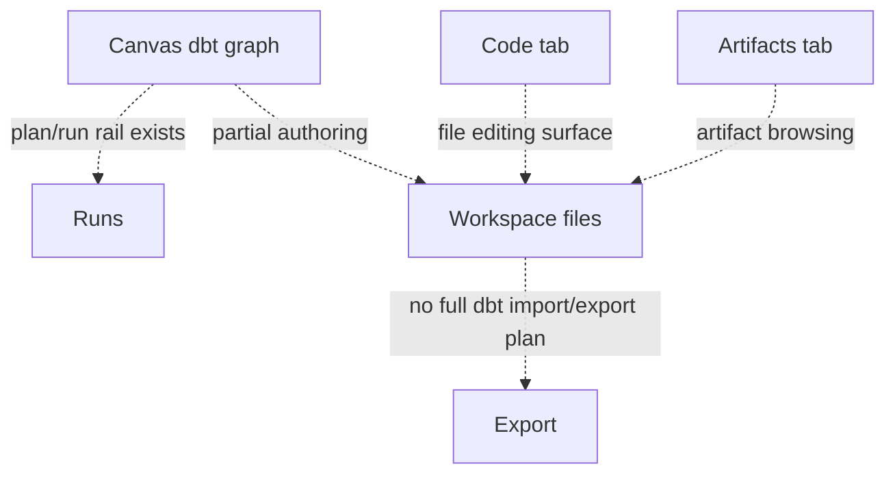
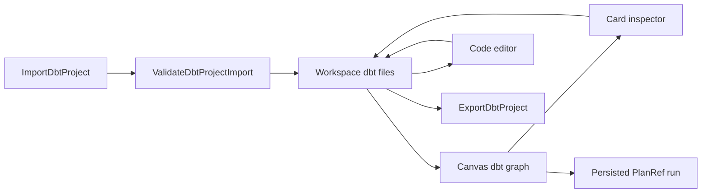

# dbt Project Round-Trip Product Plan

## Purpose

This plan canonizes the product requirement that a user can import an existing
dbt project, inspect and edit it in the workbench, save it through governed
workspace files and Canvas draft rails, execute it through the persisted PlanRef
path, and export a dbt-compatible project without DVT-only metadata leaking into
the exported dbt artifact.

The Planning DB remains the source of truth for execution state. This proposal
is the source document and user-story package for `E-DBT-PROJECT-ROUNDTRIP-1`
and its implementation slices.

## Governing Sources

- `AGENTS.md`
- `docs/planning/status/governance-document-rule-inventory.md`
- `docs/guides/ai-work-protocol.md`
- `docs/architecture/command-query-rail-governance.md`
- `docs/architecture/fowler-opportunity-planning-governance.md`
- `docs/architecture/components/web/graph/canvas-workbench-command-query-catalog.md`
- `docs/planning/proposals/mandatory/frontend-and-ux/dbt-authoring-code-run-vertical-plan-20260526.md`
- `docs/planning/proposals/mandatory/frontend-and-ux/canvas-workspace-explorer-console-theme-modeling-plan-20260527.md`
- `docs/planning/proposals/mandatory/frontend-and-ux/top-menu-templates-artifact-graph-flow-plan-20260527.md`

## User Role Pairing

Demanding user role:

The user does not care that dbt, Canvas, Code, Artifacts, Plan, Run, and Export
are separate implementation surfaces. The user expects one coherent project
workflow: choose a dbt project, see the files and graph, edit a model or source,
save, run, inspect events, and export something that a normal dbt tool accepts.

Architect/developer role:

The implementation must not fake the round trip. Import, edit, save, run, and
export must flow through named rails, have negative tests, preserve tenant and
project scope, and record out-of-scope findings as DB-linked tasks or risks.

## Mature-System Comparison

| Mature system behavior                                                                           | Product expectation for DVT                                                      | DVT convergence criterion                                                                |
| ------------------------------------------------------------------------------------------------ | -------------------------------------------------------------------------------- | ---------------------------------------------------------------------------------------- |
| dbt Cloud imports a project from Git and keeps files as project truth.                           | Imported dbt files become workspace files, not browser-only Canvas state.        | `ImportDbtProject` writes a scoped workspace-file projection with provenance.            |
| VS Code/dbt extensions let users edit files and see project artifacts.                           | Code, Artifacts, and Canvas describe the same dbt project.                       | `ListWorkspaceFiles` and Canvas graph projection use the same source import receipt.     |
| SQL Developer-style tools expose object properties and fields without hiding the underlying DDL. | dbt cards expose source/model properties and generated SQL/YAML.                 | Inspector changes persist to files or graph metadata through explicit commands.          |
| Mature build tools distinguish validation, compile, run, and export.                             | User can run full dbt graph or SQL-only work without ambiguous disabled buttons. | Plan/run readiness explains unavailable modes and offers a valid execution-capable path. |
| Exported projects do not contain editor-private state.                                           | DVT metadata remains in manifests, not in dbt-compatible exports.                | `ExportDbtProject` filters DVT-only fields and proves dbt file compatibility.            |

## Current State

## Target State

## Command And Query Rails

| Rail                       | Type    | Owner                  | DDD object or read model     | Scope and authorization                                        | Negative tests                                                                          |
| -------------------------- | ------- | ---------------------- | ---------------------------- | -------------------------------------------------------------- | --------------------------------------------------------------------------------------- |
| `ValidateDbtProjectImport` | query   | dbt project import     | `DbtProjectImportReport`     | Project-scoped read of a selected local/remote artifact source | Missing `dbt_project.yml`, unsupported version, malformed YAML, duplicate package names |
| `ImportDbtProject`         | command | dbt project import     | `DbtProjectImportReceipt`    | Project write permission and workspace-file write permission   | Read-only project, malformed source, stale workspace, unsupported file kind             |
| `ProjectDbtGraphFromFiles` | query   | Canvas dbt projection  | `DbtGraphProjection`         | Project-scoped read of imported workspace files                | Missing source file, invalid refs, cycle, unsupported macro expansion                   |
| `SaveDbtProjectFileEdit`   | command | workspace file editing | `WorkspaceDbtFileEdit`       | File write permission and expected file revision               | Stale revision, invalid path, invalid dbt YAML/SQL policy, read-only workspace          |
| `RunPersistedDbtProject`   | command | run execution          | `PersistedPlanRefRunRequest` | Execution-capable project scope and selected run mode          | Read-only mode, missing PlanRef, invalid selection, provider unavailable                |
| `ExportDbtProject`         | command | dbt project export     | `DbtProjectExportArtifact`   | Project read plus export permission                            | DVT metadata leak, missing required files, unsupported target adapter                   |

## User Stories

| Story         | Role                | Scenario                                                                                                              | Acceptance                                                                                                      |
| ------------- | ------------------- | --------------------------------------------------------------------------------------------------------------------- | --------------------------------------------------------------------------------------------------------------- |
| US-DBT-RT-001 | Demanding dbt user  | [Task: E-DBT-PROJECT-ROUNDTRIP-1B] I import an existing dbt project from a selected source.                           | The UI validates the source, shows file counts and warnings, and creates workspace files only after acceptance. |
| US-DBT-RT-002 | Demanding dbt user  | [Task: E-DBT-PROJECT-ROUNDTRIP-1B] I see sources, models, tests, macros, and seeds in the project explorer and graph. | Explorer rows, Canvas nodes, Code files, and Artifacts share the same import receipt.                           |
| US-DBT-RT-003 | Demanding dbt user  | [Task: E-DBT-PROJECT-ROUNDTRIP-1C] I edit a model SQL file in Code and see the graph/card reflect the change.         | Save uses file revision checks and updates graph projection without browser-only authority.                     |
| US-DBT-RT-004 | Demanding dbt user  | [Task: E-DBT-PROJECT-ROUNDTRIP-1C] I configure a dbt card origin and generated code remains inspectable.              | The card references workspace files and source origin explicitly; no hidden generated blob becomes truth.       |
| US-DBT-RT-005 | Demanding dbt user  | [Task: E-DBT-PROJECT-ROUNDTRIP-1D] I execute the imported project or selected SQL through an execution-capable mode.  | Read-only mode cannot execute; the UI offers a clear transition or unavailable reason before run.               |
| US-DBT-RT-006 | Demanding dbt user  | [Task: E-DBT-PROJECT-ROUNDTRIP-1D] I watch import, save, plan, run, and error events in the console.                  | Event entries are correlated by project, PlanRef, run id, and file/artifact receipt.                            |
| US-DBT-RT-007 | Demanding dbt user  | [Task: E-DBT-PROJECT-ROUNDTRIP-1E] I export the current project and open it with a normal dbt-compatible tool.        | Export contains dbt files and supported metadata only; DVT-private state remains outside the dbt artifact.      |
| US-DBT-RT-008 | Architect/developer | [Task: E-DBT-PROJECT-ROUNDTRIP-1A] I can trace every import/edit/save/run/export behavior to one rail.                | The command/query catalog names owner, port, scope, negative tests, and implementation surface before code.     |

## Fowler Opportunity Matrix

| Scenario                                          | Opportunity         | Fowler pattern         | DDD owner                    | Rail                       | Implementation surface                             | Unit or package test                     | Architecture test                | User-flow test                     | Out of scope                             |
| ------------------------------------------------- | ------------------- | ---------------------- | ---------------------------- | -------------------------- | -------------------------------------------------- | ---------------------------------------- | -------------------------------- | ---------------------------------- | ---------------------------------------- |
| Existing dbt project becomes UI-only graph state. | Hidden authority    | Repository and Gateway | `DbtProjectImportReceipt`    | `ImportDbtProject`         | Import adapter, workspace files, Canvas projection | Import rejection tests                   | No browser-only import authority | Import project and inspect files   | Git clone implementation unless selected |
| Code and Canvas drift after edits.                | Duplicate semantics | Read Model projection  | `DbtGraphProjection`         | `ProjectDbtGraphFromFiles` | Code save adapter, graph projection                | File revision and graph projection tests | No parallel dbt graph store      | Edit SQL and see graph/card update | Full dbt compiler                        |
| Run button is disabled without a work path.       | Hidden authority    | Policy Object          | `PersistedPlanRefRunRequest` | `RunPersistedDbtProject`   | Run readiness, console events                      | Read-only and unavailable tests          | Read-only cannot execute         | Enter execution mode and run       | Permission bypass                        |
| Export leaks DVT editor metadata.                 | Boundary drift      | Anti-corruption Layer  | `DbtProjectExportArtifact`   | `ExportDbtProject`         | Export adapter and artifact writer                 | Metadata filtering tests                 | Export cannot read UI-only state | Export and compatibility proof     | Provider-specific deploy                 |

## Delivery Slices

- [Task: E-DBT-PROJECT-ROUNDTRIP-1A] Design the accepted rail catalog, dbt compatibility proof, double-role QA protocol, and out-of-scope closeout template before implementation.
- [Task: E-DBT-PROJECT-ROUNDTRIP-1B] Import an existing dbt project into workspace files and a Canvas projection with malformed-source rejection.
- [Task: E-DBT-PROJECT-ROUNDTRIP-1C] Make Code, Canvas cards, and workspace files persist edits through one file/draft authority.
- [Task: E-DBT-PROJECT-ROUNDTRIP-1D] Execute imported and edited dbt projects through persisted PlanRef readiness and console events.
- [Task: E-DBT-PROJECT-ROUNDTRIP-1E] Export the workspace dbt project as a dbt-compatible artifact with metadata filtering proof.

## TDD And UX Proof

- [Task: E-DBT-PROJECT-ROUNDTRIP-1A] Red tests must fail first for missing rail catalog entries and missing user stories.
- [Task: E-DBT-PROJECT-ROUNDTRIP-1B] Red tests must fail first for dbt project validation and import rejection paths.
- [Task: E-DBT-PROJECT-ROUNDTRIP-1C] Red tests must fail first for stale file revisions and graph/file drift.
- [Task: E-DBT-PROJECT-ROUNDTRIP-1D] Red tests must fail first for read-only execution rejection and missing PlanRef.
- [Task: E-DBT-PROJECT-ROUNDTRIP-1E] Red tests must fail first for DVT metadata leakage in exported dbt artifacts.
- [Task: E-DBT-PROJECT-ROUNDTRIP-1] User-flow proof must demonstrate import -> edit -> save -> run -> export in the browser with console evidence.

## Archive And Canon Rules

This document is the canonical planning surface for dbt project round-trip work.
Older proposal fragments that describe dbt import/export without task lineage
must be updated to point here or archived with a backlink. They must not remain
active as separate product plans.
