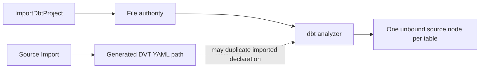

# dbt Source Connection Binding And Table Projection Plan

## Think-First Analysis

### Problem summary

Importing a file-authoritative dbt project already projects one dbt source
resource per table, but ordinary third-party source YAML carries no DVT
connection identity. The import dialog can therefore establish Canvas file
authority while leaving every imported table disconnected from the governed
warehouse catalog.

### Root cause

`ImportDbtProject` and `ImportWarehouseSources` are implemented as independent
product rails. The first owns file authority and dbt analysis. The second owns
verified connections and non-secret `ConnectedSourceRef` metadata. The Web
interaction does not carry the declared dbt source targets from the first rail
into the second, and the file-backed Source Import strategy only generates its
own canonical source paths instead of binding an already declared source table.

### Constraints and invariants

- ADR-0060 keeps file-backed dbt authoring and Graph Draft mutually exclusive.
- ADR-0061 keeps delivery state in GitHub and architecture/mechanization state
  in Planning DB.
- Source YAML must never contain a credential alias, URL, password, token, or
  other secret lookup capability.
- A database/schema/name match cannot itself create connection authority.
- Existing dbt source names, table names, identifiers, descriptions, columns,
  tests, freshness, tags, and user metadata must be preserved.
- One selected warehouse object must bind to one exact existing dbt table
  declaration. Missing, duplicate, ambiguous, cross-database, or stale targets
  fail closed before file mutation.
- A failed file-backed binding publication must roll back through the existing
  batch-mutation receipt and must not undo the independently completed project
  import or connection command.
- The dbt analyzer remains the authority that produces one node per manifest
  source resource; the browser does not parse YAML.

### Options considered

1. **Infer a connection by database name. Rejected.** This would create hidden
   authority and would alias distinct connections exposing the same database.
2. **Create a placeholder connection from YAML. Rejected.** YAML has no
   credential and a placeholder would be a fake product success.
3. **Add another source-file import endpoint. Rejected.** Existing dbt project
   and warehouse source rails already own the behavior.
4. **Generate a second DVT source YAML beside the imported file. Rejected.**
   dbt would expose duplicate logical sources/nodes or silently change names.
5. **Selected: chain the existing commands explicitly.** Project import
   completes first. When source declarations exist, the product opens the
   existing connection/source workflow with server-projected source targets.
   `ImportWarehouseSources` receives exact existing-file targets and adds only
   governed non-secret identity metadata before proving a fresh projection.

### Current and target flow

```mermaid
flowchart LR
  A[ValidateDbtProjectImport] --> B[Server source-table inventory]
  B --> C[ImportDbtProject]
  C --> D[File authority + one node per table]
  D --> E[Existing Source Import wizard]
  E --> F[List or Create governed connection]
  F --> G[Live source-object discovery]
  G --> H[Exact declaration-to-object match]
  H --> I[ImportWarehouseSources]
  I --> J[Existing YAML table gains non-secret DVT identity]
  J --> K[Fresh ProjectDbtGraphFromFiles]
  K --> L[Same nodes, now governed by explicit connection]
```





## Pre-Implementation Brief

- **Mode:** Full.
- **Scope:** one Postgres connection for the source declarations reported by
  one imported dbt project; one exact binding target per table.
- **Expected outcome:** a demanding user imports a dbt project containing a
  three-table source file, creates or selects one governed connection, and
  sees exactly three connected source cards after the binding command.
- **Risks:** rolling strict-contract clients, YAML metadata loss, partial
  command failure, wrong physical-table matching, duplicate nodes, and
  inaccessible multi-dialog focus.
- **Mitigations:** strict source-target DTOs, exact path/source/table matching,
  live object validation, batch CAS/rollback, fresh analyzer postcondition,
  feature-gated response expansion where required, and headed accessibility
  proof.
- **Out of scope:** standalone YAML without a dbt project, multiple warehouse
  connections in one import, other providers, inferred credentials, graph
  connection nodes, and a second importer.
- **Libraries evaluated:** none; `js-yaml`, the existing file batch gateway,
  Radix-backed dialog primitives, and Source Import components already cover
  the required work.

## Command And Query Rails

| Intent                                      | Rail                        | Type    | Owner                              |
| ------------------------------------------- | --------------------------- | ------- | ---------------------------------- |
| Report source declarations                  | `ValidateDbtProjectImport`  | query   | `DbtProjectImportValidationReport` |
| List/reuse connections                      | `ListWarehouseConnections`  | query   | warehouse connection catalog       |
| Create a verified connection                | `CreateWarehouseConnection` | command | warehouse connection catalog       |
| Establish file authority                    | `ImportDbtProject`          | command | dbt import process                 |
| Bind selected objects to exact declarations | `ImportWarehouseSources`    | command | authority-aware source import      |
| Project one node per table                  | `ProjectDbtGraphFromFiles`  | query   | dbt graph projection               |

No new rail is introduced.

## Fowler Opportunity Matrix

| Scenario                                              | Opportunity             | Fowler pattern                              | DDD owner                     | Implementation surfaces                 | Unit/package test               | Architecture test        | User-flow test     | Out of scope            |
| ----------------------------------------------------- | ----------------------- | ------------------------------------------- | ----------------------------- | --------------------------------------- | ------------------------------- | ------------------------ | ------------------ | ----------------------- |
| Imported table lacks connection identity              | Hidden authority        | Explicit Parameter / Value Object           | dbt source binding            | contracts, validation, Web presentation | contract and presentation tests | existing-rail guard      | headed import flow | inferred default        |
| File strategy generates a parallel source declaration | Duplicate semantics     | Consolidate Duplicate Conditional Fragments | warehouse source YAML binding | source plan and file strategy           | exact-target plan tests         | no second import rail    | three-table proof  | global YAML redesign    |
| Browser parses YAML to find tables                    | Boundary drift          | Gateway / Presentation Model                | validation read model         | API analyzer projection and Web DTO     | API/Web tests                   | browser-no-YAML guard    | same               | client parser           |
| Same physical locator appears twice                   | Primitive obsession     | Introduce Value Object / Guard Clause       | exact dbt source target       | contract and use case                   | ambiguity rejection             | qualified identity guard | negative flow      | multi-binding           |
| Import succeeds but binding fails                     | Responsibility overload | Separate Transaction / Saga receipt         | two existing commands         | controller and feedback                 | partial-result test             | command ownership guard  | retry proof        | distributed transaction |
| Three tables are reduced to one group node            | Test-only confidence    | Contract Test                               | graph projection              | analyzer/projection tests               | one-node-per-table assertion    | projection guard         | visible cards      | card redesign           |

## Definition Of Ready

- [x] GitHub issue #2397 owns the bounded task.
- [x] Planning DB design `PTH1-DBT-SOURCE-CONNECTION-BINDING-20260816`
      records the architecture authority.
- [x] Existing command/query rails were queried and selected for reuse.
- [x] Current import, analyzer, source YAML, batch, connection, Web, and Canvas
      paths were inspected.
- [x] Security, authority, recovery, matching, and out-of-scope decisions are
      fixed.
- [x] Fowler matrix and red/green sequence are fixed before production edits.

## Definition Of Done

- [ ] Validation reports source declarations deterministically without secret
      data.
- [ ] The Web shows the declared table count and continues into the existing
      connection workflow when sources exist.
- [ ] Connection selection and creation reuse existing ports and localized
      form behavior.
- [ ] Exact source targets select the corresponding live objects and reject
      missing, ambiguous, duplicate, cross-database, or stale matches.
- [ ] File-backed Source Import enriches the existing YAML table and does not
      create a parallel declaration or source file.
- [ ] Three declared tables produce exactly three distinct connected source
      nodes before and after reload.
- [ ] Retry reuses the connection and nodes without duplication.
- [ ] Project import success remains truthful if the later binding command
      fails, and the user can retry the binding.
- [ ] ES/EN, keyboard, focus, viewport, and axe proof pass.
- [ ] Contract, API, Web, architecture, Cypress, lint, type-check, ARC-2,
      mechanization, governance, and pre-push gates pass.
- [ ] No debt, stub, fake connection, migration, compatibility store, duplicate
      rail, or disabled rule is introduced.

## Microcommit Sequence

1. `docs(docs)` declare #2397 design and mechanization.
2. `test(contracts)` add red source declaration and exact-target contracts.
3. `feat(contracts)` expose the minimal source inventory and binding DTOs.
4. `test(api)` add red analyzer, validation, exact-target, rollback, and
   multi-table projection tests.
5. `feat(api)` implement server inventory and exact existing-file binding.
6. `test(web)` add red continuation, preselection, localization, and focus tests.
7. `feat(web)` connect the dbt import receipt to the reused Source Import flow.
8. `test(web)` add headed three-table acceptance and bounded review fixes.

## Validation Plan

- `pnpm docs:feature-mechanization -- --feature PTH1-DBT-SOURCE-CONNECTION-BINDING`
- `pnpm --filter @dvt/contracts test`
- focused API Vitest commands for dbt analysis/import and warehouse source import
- focused Web Vitest commands for dbt project import, Source Import, and Canvas
- package lint and type-check for contracts, API, and Web
- ARC check and required evidence/risk validation
- headed browser flow at ES/EN and governed viewport/zoom checks
- `pnpm docs:feature-mechanization:implementation`
- `pnpm governance:refresh`
- `pnpm verify:prepush`

```feature-mechanization
version: 1
featureId: PTH1-DBT-SOURCE-CONNECTION-BINDING
mechanizationStatus: closed
noHumanDecisionsRemaining: true
implementationPlan: docs/planning/proposals/mandatory/frontend-and-ux/dbt-source-connection-binding-plan-20260816.md
componentGuides:
  - docs/architecture/components/web/graph/dbt-project-import-and-source-authority-component.md
userStories:
  - https://github.com/dunay2/dvt/issues/2397
governingSources:
  - AGENTS.md
  - docs/planning/status/governance-document-rule-inventory.md
  - docs/architecture/command-query-rail-governance.md
  - docs/architecture/fowler-opportunity-planning-governance.md
  - docs/adr/ADR-0060-dbt-project-authoring-authority.md
  - docs/adr/ADR-0061-github-mvp-task-authority-and-planning-db-architecture-boundary.md
allowedImplementationSurfaces:
  - apps/api/src/application/ports/dbtProjectAnalysis.ts
  - apps/api/src/application/services/importWarehouseSourcesUseCase.ts
  - apps/api/src/application/services/validateDbtProjectImportUseCase.ts
  - apps/api/src/application/services/warehouseSourceImportPlan.ts
  - apps/api/src/application/services/dbtProjectFilesWarehouseSourceImportStrategy.ts
  - apps/api/src/infrastructure/dbt/dbtManifestProjection.ts
  - apps/api/test/application/importWarehouseSourcesUseCase.test.ts
  - apps/api/test/application/projectDbtGraphFromFilesUseCase.test.ts
  - apps/api/test/application/dbtProjectImportUseCases.test.ts
  - apps/api/test/application/dbtProjectImportSourceBinding.test.ts
  - apps/api/test/infrastructure/dbt/dbtManifestProjection.test.ts
  - apps/web/cypress/e2e/canvas/canvas-dbt-source-connection-binding.cy.ts
  - apps/web/src/app/components/SourceImportWizard.tsx
  - apps/web/src/app/components/SourceImportWizard.test.tsx
  - apps/web/src/app/components/dbtProjectImport/**
  - apps/web/src/app/components/sourceImportWizard/**
  - apps/web/src/app/views/canvas/CanvasShell.tsx
  - apps/web/src/app/views/canvas/CanvasShell.contextualDialogs.test.tsx
  - apps/web/src/app/views/canvas/CanvasSourceImportDialogHost.tsx
  - apps/web/src/app/views/canvas/canvasShell.types.ts
  - apps/web/src/app/views/canvas/useCanvasSourceImportDialogState.ts
  - packages/@dvt/contracts/src/contracts/dbt-project/DbtProjectImport.v1.ts
  - packages/@dvt/contracts/src/contracts/source-import/SourceImportOperations.v2.ts
  - packages/@dvt/contracts/test/dbt-project-import.contract.test.ts
  - packages/@dvt/contracts/test/source-import-operations-v2.contract.test.ts
  - docs/architecture/components/web/graph/dbt-project-import-and-source-authority-component.md
  - docs/evidence/**
  - docs/risk-register/quality/**
  - docs/planning/proposals/mandatory/frontend-and-ux/dbt-source-connection-binding-plan-20260816.md
  - docs/planning/status/**
  - docs/**/index.md
forbiddenImplementationSurfaces:
  - .github/**
  - packages/@dvt/engine/**
  - packages/@dvt/adapter-*/**
  - apps/api/src/entrypoints/http/**
commandQueryRails:
  - name: ValidateDbtProjectImport
    type: query
    dddOwner: DbtProjectImportValidationReport
  - name: ListWarehouseConnections
    type: query
    dddOwner: WarehouseConnectionCatalog
  - name: CreateWarehouseConnection
    type: command
    dddOwner: WarehouseConnectionCatalog
  - name: ImportDbtProject
    type: command
    dddOwner: CanvasAuthoringAuthorityBinding
  - name: ImportWarehouseSources
    type: command
    dddOwner: WarehouseSourceImport
  - name: ProjectDbtGraphFromFiles
    type: query
    dddOwner: DbtProjectGraphProjection
domainObjects:
  - name: DbtProjectSourceTableDeclaration
    type: read model
    owner: dbt Project Import
  - name: ExistingDbtSourceTarget
    type: value object
    owner: Warehouse Source Import
  - name: WarehouseSourceImportFilePlan
    type: application plan
    owner: Warehouse Source Import
fowlerSignals:
  - Hidden authority
  - Duplicate semantics
  - Boundary drift
  - Primitive obsession
  - Responsibility overload
  - Test-only confidence
architectureGuards:
  - pnpm docs:feature-mechanization:implementation
  - Source Import architecture tests keep browser YAML parsing and parallel commands absent.
cypressFlows:
  - apps/web/cypress/e2e/canvas/canvas-dbt-source-connection-binding.cy.ts
completionGate:
  - pnpm --filter @dvt/contracts test
  - pnpm --filter dvt-api test
  - pnpm --filter dvt-web test
  - pnpm --filter @dvt/contracts lint
  - pnpm --filter dvt-api lint
  - pnpm --filter dvt-web lint
  - pnpm --filter @dvt/contracts typecheck
  - pnpm --filter dvt-api typecheck
  - pnpm --filter dvt-web typecheck
  - pnpm docs:feature-mechanization:implementation
  - pnpm verify:prepush
redGreenCycles:
  - id: source-inventory-contract
    redTest: pnpm --filter @dvt/contracts test -- dbt-project-import.contract.test.ts
    expectedFailure: Validation reports do not expose deterministic dbt source table declarations.
    patchSurfaces:
      - packages/@dvt/contracts/src/contracts/dbt-project/DbtProjectImport.v1.ts
      - packages/@dvt/contracts/test/dbt-project-import.contract.test.ts
    greenTest: pnpm --filter @dvt/contracts test -- dbt-project-import.contract.test.ts
  - id: exact-existing-source-target
    redTest: pnpm --filter dvt-api test -- importWarehouseSourcesUseCase.test.ts dbtProjectImportSourceBinding.test.ts
    expectedFailure: File-backed Source Import generates a parallel YAML path instead of binding the declared table.
    patchSurfaces:
      - apps/api/src/application/services/importWarehouseSourcesUseCase.ts
      - apps/api/src/application/services/warehouseSourceImportPlan.ts
      - apps/api/src/application/services/dbtProjectFilesWarehouseSourceImportStrategy.ts
      - apps/api/test/application/importWarehouseSourcesUseCase.test.ts
      - apps/api/test/application/dbtProjectImportSourceBinding.test.ts
    greenTest: pnpm --filter dvt-api test -- importWarehouseSourcesUseCase.test.ts dbtProjectImportSourceBinding.test.ts
  - id: web-source-binding-continuation
    redTest: pnpm --filter dvt-web test -- DbtProjectImportDialog.test.tsx SourceImportWizard.test.tsx CanvasShell.contextualDialogs.test.tsx
    expectedFailure: Successful dbt import does not continue into an exact governed source-binding flow.
    patchSurfaces:
      - apps/web/src/app/components/SourceImportWizard.tsx
      - apps/web/src/app/components/dbtProjectImport/**
      - apps/web/src/app/components/sourceImportWizard/**
      - apps/web/src/app/views/canvas/CanvasShell.tsx
      - apps/web/src/app/views/canvas/CanvasShell.contextualDialogs.test.tsx
    greenTest: pnpm --filter dvt-web test -- DbtProjectImportDialog.test.tsx SourceImportWizard.test.tsx CanvasShell.contextualDialogs.test.tsx
symbols:
  - name: DbtProjectSourceTableDeclarationSchema
    path: packages/@dvt/contracts/src/contracts/dbt-project/DbtProjectImport.v1.ts
    dddOwner: DbtProjectImportValidationReport
    cqRails:
      - ValidateDbtProjectImport
    fowlerSignals:
      - Hidden authority
    architectureGuard: pnpm docs:feature-mechanization:implementation
    cypressCoverage: apps/web/cypress/e2e/canvas/canvas-dbt-source-connection-binding.cy.ts
    unitTests:
      - packages/@dvt/contracts/test/dbt-project-import.contract.test.ts
  - name: ExistingDbtSourceTargetSchema
    path: packages/@dvt/contracts/src/contracts/source-import/SourceImportOperations.v2.ts
    dddOwner: WarehouseSourceImport
    cqRails:
      - ImportWarehouseSources
    fowlerSignals:
      - Primitive obsession
    architectureGuard: pnpm docs:feature-mechanization:implementation
    cypressCoverage: apps/web/cypress/e2e/canvas/canvas-dbt-source-connection-binding.cy.ts
    unitTests:
      - packages/@dvt/contracts/test/source-import-operations-v2.contract.test.ts
  - name: projectSourceTableDeclaration
    path: apps/api/src/infrastructure/dbt/dbtManifestProjection.ts
    dddOwner: dbt Project Analysis
    cqRails:
      - ValidateDbtProjectImport
    fowlerSignals:
      - Boundary drift
    architectureGuard: pnpm docs:feature-mechanization:implementation
    cypressCoverage: apps/web/cypress/e2e/canvas/canvas-dbt-source-connection-binding.cy.ts
    unitTests:
      - apps/api/test/infrastructure/dbt/dbtManifestProjection.test.ts
  - name: buildExistingDbtSourceFilePlan
    path: apps/api/src/application/services/warehouseSourceImportPlan.ts
    dddOwner: WarehouseSourceImportFilePlan
    cqRails:
      - ImportWarehouseSources
    fowlerSignals:
      - Duplicate semantics
    architectureGuard: pnpm docs:feature-mechanization:implementation
    cypressCoverage: apps/web/cypress/e2e/canvas/canvas-dbt-source-connection-binding.cy.ts
    unitTests:
      - apps/api/test/application/dbtProjectImportSourceBinding.test.ts
  - name: matchRequestedDbtSourceTargets
    path: apps/web/src/app/components/sourceImportWizard/sourceImportWizardModel.ts
    dddOwner: SourceImportWizardPresentationModel
    cqRails:
      - ImportWarehouseSources
    fowlerSignals:
      - Feature envy
    architectureGuard: pnpm docs:feature-mechanization:implementation
    cypressCoverage: apps/web/cypress/e2e/canvas/canvas-dbt-source-connection-binding.cy.ts
    unitTests:
      - apps/web/src/app/components/sourceImportWizard/sourceImportWizardModel.test.ts
```
