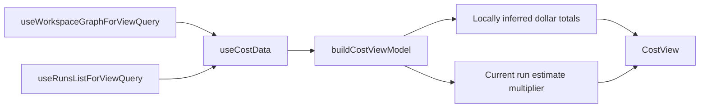
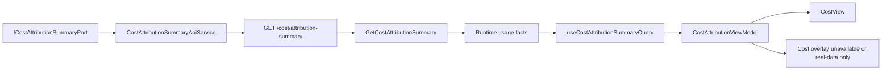

# DVT-21/2 Cost Attribution UI Hard-Cut Plan

## Governing Sources

- `AGENTS.md`
- `docs/planning/status/governance-document-rule-inventory.md`
- `docs/guides/ai-work-protocol.md`
- `docs/architecture/command-query-rail-governance.md`
- `docs/architecture/fowler-opportunity-planning-governance.md`
- `docs/planning/proposals/mandatory/runtime-and-contracts/cost-attribution-model-plan-20260524.md`
- `docs/architecture/components/api/cost-attribution-summary-component.md`
- `apps/api/src/application/ports/runtime.ts`
- `apps/api/src/application/services/getCostAttributionSummaryUseCase.ts`
- `apps/api/src/entrypoints/http/costAttributionSummaryRoute.ts`
- `apps/web/src/app/views/CostView.tsx`
- `apps/web/src/app/views/cost/useCostData.ts`
- `apps/web/src/app/views/cost/costViewModel.ts`
- `apps/web/src/app/plugins/cost/costContributions.ts`

## Task Classification

Task id: `DVT-21/2`.

Task type: `cross-cutting` because the slice starts from planning governance and then
changes web presentation behavior that consumes an already implemented runtime query.

Mode: `Full`.

Reason: the slice changes externally visible web behavior in the Cost route and Cost
overlay posture. It also removes hidden mock monetary semantics from a product-facing
view.

## Phase 0 Existing-Material Check

The repository already contains an implemented backend query rail for runtime cost
attribution facts:

- `GetCostAttributionSummary` is the canonical query rail.
- The API route is `GET /cost/attribution-summary`.
- The source is `IRunStateStoreRead` metadata, snapshots, and event streams.
- Monetary values are deliberately unavailable until a provider credit-capture rail
  exists.

The repository also contains a web Cost route and plugin contribution, but the web
route does not consume the backend query. The current web model derives cost from
workspace nodes and run counts, including local dollar values and a synthetic current
run estimate. That makes the UI more authoritative than the runtime read model.

Existing implementation facts:

- Backend usage facts are present in `GetCostAttributionSummaryUseCase`.
- The API component doc says monetary totals are unavailable by design.
- `CostView` renders a dashboard from `useCostData`.
- `useCostData` currently reads workspace graph nodes and run summaries.
- `buildCostViewModel` currently computes total cost from `node.lastCost`, average
  cost per run from local data, and a current-run estimate from a multiplier.
- Search evidence shows no `apps/web` consumer for `costAttributionSummary`.

## Phase 1 Think-First Analysis

### Problem Summary

The backend now exposes real runtime attribution facts, but the web Cost route still
renders locally inferred monetary values. This violates the product posture that the
UI reflects state and read models instead of inventing execution or finance truth.

### Root Cause

The first backend slice intentionally excluded web wiring. The earlier web Cost route
was built around graph-node presentation fields such as `lastCost`, which are useful
for visual decoration when real cost data exists but are not an authoritative finance
source. The boundary now drifts because the UI kept the pre-backend model after the
runtime query became available.

### Constraints And Invariants

- Reuse `GetCostAttributionSummary`; do not create a synonym query.
- Do not change `apps/api/**` in this slice unless a blocking contract mismatch is
  found and documented first.
- Do not touch `packages/@dvt/contracts/**`, `packages/@dvt/engine/**`,
  `packages/@dvt/planner/**`, or `packages/@dvt/adapter-*/**`.
- Do not infer dollars from duration, run counts, node counts, or status.
- Keep `costCaptureStatus: unavailable` visible when monetary capture is not present.
- Keep web views behind ports, services, and query hooks. Views must not call `fetch`
  directly.
- Use strict TypeScript. Do not introduce `any`.
- Negative paths are required for malformed payloads and unavailable monetary data.

### Options Considered

1. Keep current UI and relabel dollars as estimates.
   Rejected. It preserves hidden authority and fake finance semantics.

2. Wire the existing web Cost route to `GetCostAttributionSummary` and render usage
   facts while monetary capture is unavailable.
   Selected. It reuses the existing rail and aligns UI truth with runtime truth.

3. Implement Snowflake query-history and credit ingestion first.
   Rejected for this slice. The backend plan explicitly kept that out of scope until
   query tagging and ingestion are designed.

4. Remove the Cost route until monetary data exists.
   Rejected. Runtime usage facts are already valuable for operations, run diagnostics,
   and future billing readiness.

### Selected Option And Rationale

Add a web cost port, API service, decoder, query hook, and usage-first Cost view model
that consumes `GET /cost/attribution-summary`. The UI must render runtime usage facts
and an explicit monetary-unavailable state. It must not show dollar totals, current-run
estimates, or node heatmap colors unless the source data contains real monetary values.

## Command / Query Rail Posture

Reused query rail: `GetCostAttributionSummary`.

- Type: query.
- Owning bounded context: Runtime read model.
- Read model: `CostAttributionSummary`.
- Application port: `GetCostAttributionSummaryUseCase`.
- HTTP adapter: `GET /cost/attribution-summary`.
- Authorization: `run:list` on tenant/project/environment scope.
- Web role: adapter and presentation consumer only.

No new backend command or query rail is introduced by this slice.

## Current-State Flow



## Target Flow



## Fowler Opportunity Matrix

<!-- markdownlint-disable MD060 -->

| Scenario | Opportunity | Fowler pattern | DDD owner | Command/query rail | Implementation surfaces | Unit or package test | Architecture test | User-flow test | Out of scope |
| --- | --- | --- | --- | --- | --- | --- | --- | --- | --- |
| Cost route shows local dollar totals from graph node fields | Hidden authority | Replace Magic Number with Explicit Model | `CostAttributionViewModel` | `GetCostAttributionSummary` | `apps/web/src/app/views/cost/*`, `apps/web/src/app/views/CostView.tsx` | `costViewModel.test.ts` asserts unavailable money is not formatted as dollars | Guard that Cost view data source is the cost port/query, not workspace-node `lastCost` | Cost route render test for usage facts and unavailable money | Snowflake credit capture |
| Web has no typed cost API port for the backend read model | Boundary drift | Gateway + Data Mapper | `CostAttributionSummaryPort` | `GetCostAttributionSummary` | `apps/web/src/app/ports/cost.ts`, `apps/web/src/app/services/cost/*`, `apps/web/src/app/queries/costQueries.ts` | Decoder/service tests for valid and malformed payloads | Guard no direct `fetch` in Cost view/hook | N/A | New backend route |
| Cost heatmap can decorate nodes from stale or synthetic cost fields | Hidden authority | Null Object | `CostOverlayContext` | `GetCostAttributionSummary` or none when unavailable | `apps/web/src/app/plugins/cost/costContributions.ts`, `apps/web/src/app/views/canvas/useCanvasOverlayModel.ts` if needed | Overlay model test for unavailable cost capture | Guard heatmap requires real `NodeCostData` source | Canvas overlay proof if impacted | Cost policy engine |
| User needs operational value before monetary capture exists | Primitive obsession | Introduce Parameter Object | `RuntimeUsageSummary` presentation model | `GetCostAttributionSummary` | `apps/web/src/app/views/cost/costViewModel.ts`, cost cards/charts | Tests for run count, step counts, duration, observed window | N/A | Cost route render test | Billing invoices |
| Backend query can fail authorization or be unavailable | Test-only confidence | Fail-closed presentation state | `CostAttributionQueryState` | `GetCostAttributionSummary` | `apps/web/src/app/queries/costQueries.ts`, `CostView.tsx` | Query/view tests for loading and error states | Existing API-client boundary guard | Render error state | Offline mock semantics as product truth |

<!-- markdownlint-enable MD060 -->

## Implementation Structure

### 21/2.1 Planning And Tracking

- Add this mandatory proposal and feature mechanization block.
- Keep the first commit documentation-only.
- Do not start production code until the allowed surfaces and red/green cycles are
  declared here.

### 21/2.2 Web Port And API Adapter

Allowed surfaces:

- `apps/web/src/app/ports/cost.ts`
- `apps/web/src/app/services/cost/costApiDecoders.ts`
- `apps/web/src/app/services/cost/costService.api.ts`
- `apps/web/src/app/services/cost/costService.api.test.ts`
- `apps/web/src/app/queries/costQueries.ts`

Expected result:

- A strict DTO for `CostAttributionSummary`.
- A decoder that rejects malformed payloads.
- An API service that builds the endpoint from tenant/project/environment/limit.
- A TanStack query hook for the Cost route.

### 21/2.3 Usage-First Cost View Model

Allowed surfaces:

- `apps/web/src/app/views/cost/costViewModel.ts`
- `apps/web/src/app/views/cost/costViewModel.test.ts`
- `apps/web/src/app/views/cost/copy.ts`
- `apps/web/src/app/views/cost/copy.test.ts`
- `apps/web/src/app/views/cost/useCostData.ts`
- `apps/web/src/app/views/CostView.tsx`
- Existing Cost child components when copy or value props must be renamed.

Expected result:

- The view model is built from runtime usage facts.
- Monetary fields render as unavailable when the backend returns `null`.
- No local multiplier or node-derived dollar total remains.

### 21/2.4 Cost Overlay Hardening

Allowed surfaces:

- `apps/web/src/app/plugins/cost/costContributions.ts`
- `apps/web/src/app/views/canvas/canvasOverlayContext.ts`
- `apps/web/src/app/views/canvas/useCanvasOverlayModel.ts`
- Tests directly governing the overlay model.

Expected result:

- The heatmap only decorates nodes when there is real `NodeCostData` from an
  accepted source.
- If the cost capture status is unavailable, the UI does not imply monetary heat.

### 21/2.5 Architecture And Route Proof

Allowed surfaces:

- `apps/web/src/app/views/cost/*.test.tsx`
- `apps/web/src/app/views/cost/*.architecture.test.ts`
- `apps/web/src/app/services/cost/*.test.ts`
- `apps/web/src/app/queries/*.test.tsx` if query behavior needs a dedicated test.
- Optional Cypress spec only if the existing Cost route flow lacks render coverage.

Expected result:

- The tests prove valid payload mapping, invalid payload rejection, unavailable money,
  and no direct fetch from Cost view modules.

## Forbidden Surfaces

- `apps/api/**`
- `packages/@dvt/contracts/**`
- `packages/@dvt/engine/**`
- `packages/@dvt/planner/**`
- `packages/@dvt/adapter-*/**`
- `docs/archive/**`
- Generated planning views such as `execution-workboard.md` and
  `open-task-route.md`

## Tracking Checklist

- [x] 21/2.1 Create branch.
- [x] 21/2.1 Read governance startup inventory and task rules.
- [x] 21/2.1 Identify reused query rail and existing backend implementation.
- [x] 21/2.1 Add Fowler analysis, implementation structure, and tracking plan.
- [ ] 21/2.1 Run feature mechanization check for this plan.
- [ ] 21/2.2 Add red tests for cost API decoder and service endpoint.
- [ ] 21/2.2 Implement web cost port and API service.
- [ ] 21/2.3 Add red tests for usage-first view model.
- [ ] 21/2.3 Replace local dollar inference in Cost view model.
- [ ] 21/2.4 Harden cost overlay unavailable-money behavior.
- [ ] 21/2.5 Add architecture guard for no direct fetch and no `lastCost` authority.
- [ ] 21/2.5 Run web typecheck, tests, lint, docs refresh, and prepush validation.
- [ ] 21/2.6 Create closeout with validation and no-debt evidence.

## Validation Plan

Before production code:

```text
pnpm docs:feature-mechanization -- --feature DVT21-COST-ATTRIBUTION-UI-HARD-CUT-20260531
```

During implementation:

```text
pnpm --filter @dvt/web test -- src/app/services/cost/costService.api.test.ts
pnpm --filter @dvt/web test -- src/app/views/cost/costViewModel.test.ts
pnpm --filter @dvt/web test -- src/app/views/cost/costAttributionUi.architecture.test.ts
pnpm --filter @dvt/web typecheck
pnpm --filter @dvt/web lint
```

Before closeout:

```text
pnpm docs:sync
pnpm docs:status:generate
pnpm docs:feature-mechanization:implementation -- --feature DVT21-COST-ATTRIBUTION-UI-HARD-CUT-20260531
pnpm verify:prepush
```

## Feature Mechanization Manifest

```feature-mechanization
version: 1
featureId: DVT21-COST-ATTRIBUTION-UI-HARD-CUT-20260531
mechanizationStatus: planned
noHumanDecisionsRemaining: true
implementationPlan: docs/planning/proposals/mandatory/frontend-and-ux/dvt-21-2-cost-attribution-ui-hard-cut-plan-20260531.md
componentGuides:
  - docs/architecture/components/api/cost-attribution-summary-component.md
userStories:
  - docs/architecture/components/api/cost-attribution-summary-user-stories.md
governingSources:
  - AGENTS.md
  - docs/planning/status/governance-document-rule-inventory.md
  - docs/guides/ai-work-protocol.md
  - docs/architecture/command-query-rail-governance.md
  - docs/architecture/fowler-opportunity-planning-governance.md
  - docs/planning/proposals/mandatory/runtime-and-contracts/cost-attribution-model-plan-20260524.md
  - docs/architecture/components/api/cost-attribution-summary-component.md
allowedImplementationSurfaces:
  - docs/planning/proposals/mandatory/frontend-and-ux/dvt-21-2-cost-attribution-ui-hard-cut-plan-20260531.md
  - apps/web/src/app/ports/cost.ts
  - apps/web/src/app/services/cost/costApiDecoders.ts
  - apps/web/src/app/services/cost/costService.api.ts
  - apps/web/src/app/services/cost/costService.api.test.ts
  - apps/web/src/app/queries/costQueries.ts
  - apps/web/src/app/views/cost/costViewModel.ts
  - apps/web/src/app/views/cost/costViewModel.test.ts
  - apps/web/src/app/views/cost/copy.ts
  - apps/web/src/app/views/cost/copy.test.ts
  - apps/web/src/app/views/cost/useCostData.ts
  - apps/web/src/app/views/cost/costAttributionUi.architecture.test.ts
  - apps/web/src/app/views/CostView.tsx
  - apps/web/src/app/plugins/cost/costContributions.ts
  - apps/web/src/app/views/canvas/canvasOverlayContext.ts
  - apps/web/src/app/views/canvas/useCanvasOverlayModel.ts
forbiddenImplementationSurfaces:
  - apps/api/**
  - packages/@dvt/contracts/**
  - packages/@dvt/engine/**
  - packages/@dvt/planner/**
  - packages/@dvt/adapter-*/**
commandQueryRails:
  - name: GetCostAttributionSummary
    type: query
    dddOwner: CostAttributionSummary runtime read model
domainObjects:
  - name: CostAttributionSummary
    type: read model
    owner: Runtime read model
  - name: CostAttributionViewModel
    type: presentation model
    owner: apps/web
  - name: CostCaptureUnavailableState
    type: presentation value object
    owner: apps/web
fowlerSignals:
  - Hidden authority
  - Boundary drift
  - Primitive obsession
  - Test-only confidence
  - Documentation drift
architectureGuards:
  - pnpm --filter @dvt/web test -- src/app/views/cost/costAttributionUi.architecture.test.ts
cypressFlows:
  - optional - only if existing Cost route render coverage is insufficient
completionGate:
  - pnpm docs:feature-mechanization -- --feature DVT21-COST-ATTRIBUTION-UI-HARD-CUT-20260531
  - pnpm --filter @dvt/web test -- src/app/services/cost/costService.api.test.ts src/app/views/cost/costViewModel.test.ts src/app/views/cost/costAttributionUi.architecture.test.ts
  - pnpm --filter @dvt/web typecheck
  - pnpm --filter @dvt/web lint
  - pnpm docs:sync
  - pnpm docs:status:generate
  - pnpm docs:feature-mechanization:implementation -- --feature DVT21-COST-ATTRIBUTION-UI-HARD-CUT-20260531
  - pnpm verify:prepush
redGreenCycles:
  - id: dvt21-cost-api-decoder
    redTest: pnpm --filter @dvt/web test -- src/app/services/cost/costService.api.test.ts
    expectedFailure: Cost service and strict decoder do not exist.
    patchSurfaces:
      - apps/web/src/app/ports/cost.ts
      - apps/web/src/app/services/cost/costApiDecoders.ts
      - apps/web/src/app/services/cost/costService.api.ts
    greenTest: pnpm --filter @dvt/web test -- src/app/services/cost/costService.api.test.ts
  - id: dvt21-cost-view-model
    redTest: pnpm --filter @dvt/web test -- src/app/views/cost/costViewModel.test.ts
    expectedFailure: Cost view model still derives dollars from workspace node fields.
    patchSurfaces:
      - apps/web/src/app/views/cost/costViewModel.ts
      - apps/web/src/app/views/cost/copy.ts
      - apps/web/src/app/views/cost/useCostData.ts
      - apps/web/src/app/views/CostView.tsx
    greenTest: pnpm --filter @dvt/web test -- src/app/views/cost/costViewModel.test.ts
  - id: dvt21-cost-architecture-guard
    redTest: pnpm --filter @dvt/web test -- src/app/views/cost/costAttributionUi.architecture.test.ts
    expectedFailure: No guard prevents Cost UI from reusing hidden `lastCost` authority.
    patchSurfaces:
      - apps/web/src/app/views/cost/costAttributionUi.architecture.test.ts
      - apps/web/src/app/plugins/cost/costContributions.ts
    greenTest: pnpm --filter @dvt/web test -- src/app/views/cost/costAttributionUi.architecture.test.ts
```
