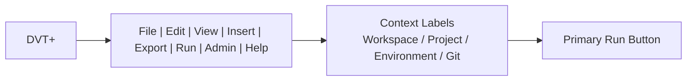
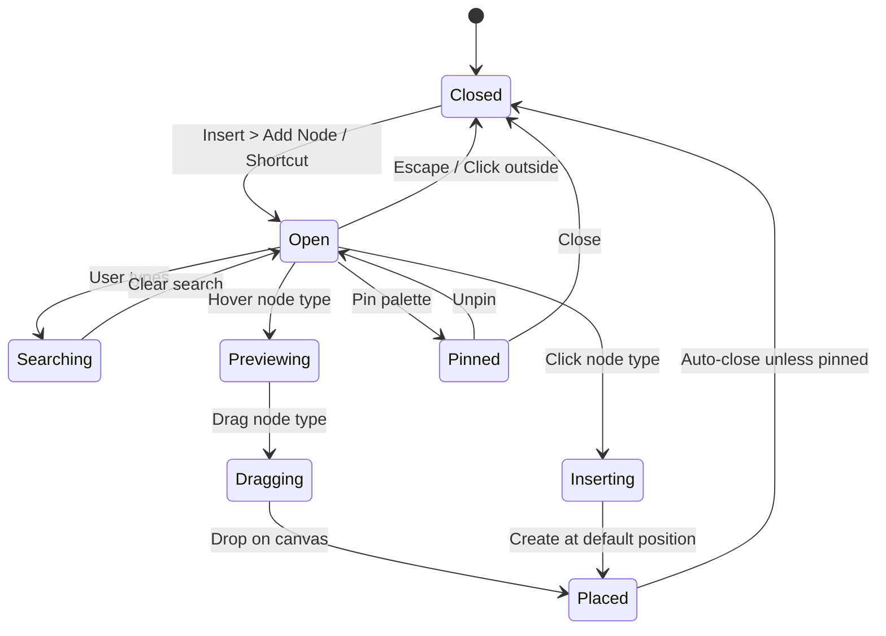
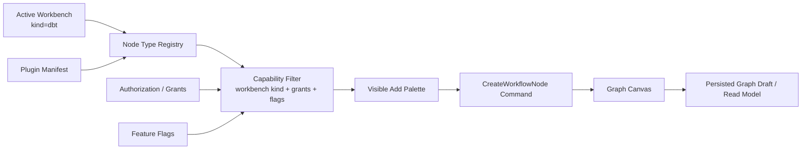
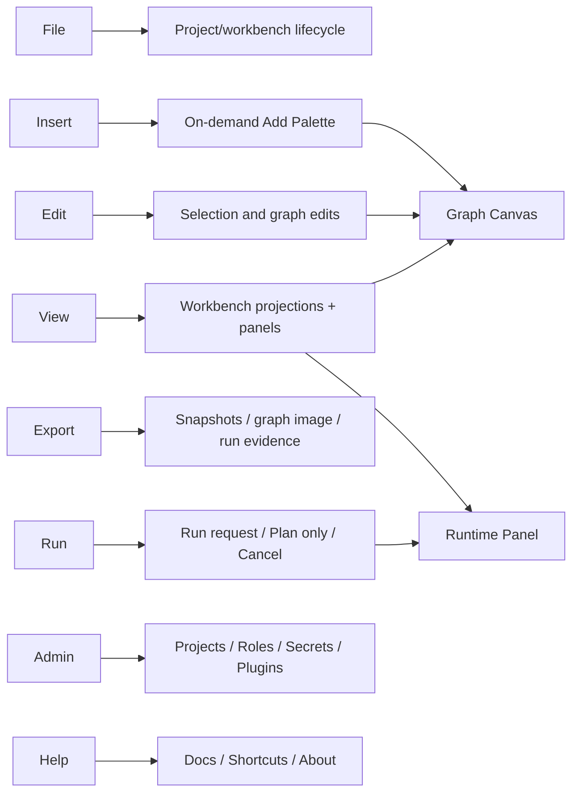
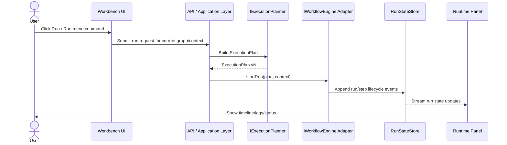
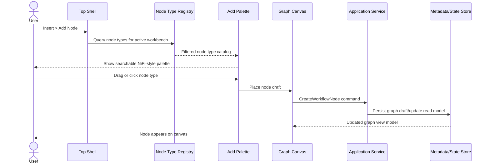
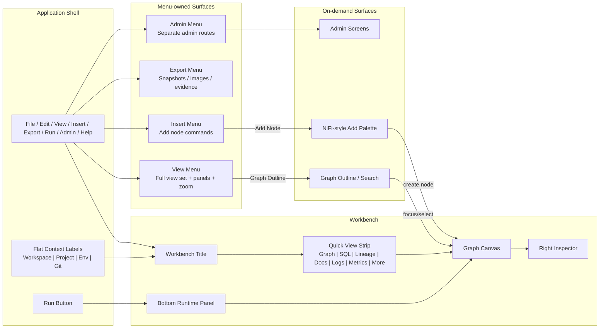

# DVT+ Workbench UX Specification

This draft is not the canonical implementation plan. The accepted subset for
the next executable slice is recorded in
[Canvas Workbench Shell Save Export Sequence Plan](./canvas-workbench-shell-save-export-sequence-plan-20260505.md).

## 1. Purpose

This specification defines the target UX for the DVT+ workbench after the latest design decisions.

DVT+ is a graph-first data workflow workbench. It is not a generic SaaS dashboard. The UI must behave like a disciplined developer tool:

- **VS Code / Visual Studio** for top-level command structure.
- **GitHub** for minimal chrome and restraint.
- **Apache NiFi / draw.io** for graph construction and add-node interaction.
- **DVT+ architecture** for strict separation between UI, planning, execution and persisted state.

The workbench must maximize canvas space, avoid permanent double-left navigation, expose Add/Insert as a command-driven on-demand surface, and make the top menus the canonical command entry point.

---

## 2. Non-negotiable UX Principles

1. **No permanent double-left-navigation.**
2. **No generic SaaS sidebar in the workbench.**
3. **The graph canvas is the dominant surface.**
4. **The UI reflects state but does not execute directly.**
5. **The planner decides execution plans.**
6. **The engine executes plans.**
7. **Persisted state/read models are the source of truth.**
8. **Runtime state is separated from authoring.**
9. **Add-node behavior is contextual and command-driven.**
10. **Workbench views are projections of the current workbench, not global navigation.**
11. **Workspace/project/environment/git are context labels, not primary selectors.**
12. **Export belongs to the top menu and may optionally expose a compact action only if needed.**
13. **Run is the only permanent primary action in the workbench shell.**
14. **The top menu is canonical for commands; the visible view strip is only a quick-access surface.**
15. **Canvas affordances must make creation, selection mode, graph edges and runtime state immediately understandable.**
16. **Runtime chrome should be present when useful and collapse when authoring is the primary activity.**

---

## 3. Final Layout Decision

The final structure is:

```text
+------------------------------------------------------------------------------+
| DVT+ | File Edit View Insert Export Run Admin Help      Context labels  Run |
+------------------------------------------------------------------------------+
| Sessionize Events Pipeline                                                   |
+------------------------------------------------------------------------------+
| Graph | SQL | Lineage | Docs | Logs | Metrics | More                         |
+--------------------------------------------------------------+---------------+
|                                                              |               |
|                         Graph Canvas                         | Inspector     |
|                                                              |               |
+--------------------------------------------------------------+---------------+
| Runtime Panel: Timeline | Logs | Tests | Artifacts | Metrics                 |
+------------------------------------------------------------------------------+
```

No permanent left navigation rail is allowed in this workbench view.

The full set of workbench views remains accessible from the **View** menu. The visible strip should prioritize frequent workbench views and collapse secondary views under **More** when space is constrained.

`SQL` is a product-facing label in this draft, not a route decision. The current
Canvas workbench tab contract owns route IDs such as `code`; any visible relabel
must be resolved by the Canvas workbench tab read model and capability registry.

---

## 4. Top Application Shell

### 4.1 Menu

The top application shell contains the global command menu:

```text
DVT+ | File | Edit | View | Insert | Export | Run | Admin | Help
```

### 4.2 Responsibilities

The top shell owns:

- global commands;
- workbench-level commands;
- application administration entry points;
- access to Insert/Add;
- access to Export;
- access to Run;
- context visibility;
- full access to workbench views through the View menu.

It must not become a graph editing panel.

### 4.3 Top Shell Structure



---

## 5. Context Labels

Context values are shown in the top row as flat reference labels.

Correct:

```text
Workspace: Acme Corp   Project: Analytics Core   Environment: prod   Git: main @ a73f9c1
```

Incorrect:

```text
Workspace v   Project v   Environment v   Git v
```

### Rules

- They are not primary selectors.
- They should not look like comboboxes.
- They may be clickable only as lightweight links to context details.
- They must not trigger broad context switching inside the active workbench.
- Context switching belongs to dedicated project/admin/context screens.

---

## 6. Workbench Title

The active workbench title is shown below the top shell:

```text
Sessionize Events Pipeline
```

This title identifies the open workbench/document. It should not be mixed with the context labels.

Recommended hierarchy:

```text
Top row:
DVT+ | File Edit View Insert Export Run Admin Help      Workspace / Project / Env / Git      Run

Second row:
Sessionize Events Pipeline

Third row:
Graph | SQL | Lineage | Docs | Logs | Metrics | More
```

---

## 7. Menu Specification

The top menu is the canonical command surface. Some commands may also have visible quick-access buttons or shortcuts, but the menu remains the complete command map.

### 7.1 File

Purpose: project/workbench lifecycle and snapshot-level file operations.

```text
File
  New Project...
  Open Project...
  Open Recent
  Import Project Snapshot...
  Close Workbench
```

Notes:

- Export operations are intentionally moved to the **Export** menu.
- File should not become an administration menu.
- Project creation may open a dedicated project screen or wizard; it must not be embedded inside the canvas.

### 7.2 Edit

Purpose: editing operations over the current graph/document selection.

```text
Edit
  Undo
  Redo
  Cut
  Copy
  Paste
  Duplicate
  Rename
  Delete
  Select All
  Clear Selection
```

Rules:

- Edit commands are scoped to the active workbench view.
- Commands that modify persisted graph structure must go through application command boundaries.
- Local-only view preferences must not be mixed with domain mutations.

### 7.3 View

Purpose: access all workbench projections and visual surfaces.

```text
View
  Graph
  SQL
  YAML
  JSON
  Diff
  Lineage
  Docs
  Logs
  Tests
  Metrics
  Artifacts
  ---
  Toggle Inspector
  Toggle Runtime Panel
  Open Graph Outline
  Command Palette
  ---
  Fit View
  Zoom In
  Zoom Out
  Reset View
```

Rules:

- View owns the full set of workbench projections.
- The visible view strip is only a quick-access subset.
- `Graph`, `SQL`, `Lineage`, `Docs`, `Logs`, and `Metrics` are preferred visible views.
- `YAML`, `JSON`, `Diff`, `Tests`, and `Artifacts` may collapse into `More`.
- View commands must not be duplicated as a left navigation rail.

### 7.4 Insert

Purpose: create new workbench elements.

```text
Insert
  Add Node...
  Add Source
  Add Seed
  Add Model
  Add Incremental Model
  Add Snapshot
  Add Generic Test
  Add Singular Test
  Add Macro
  ---
  Open Add Palette
```

Rules:

- The list is generated from the active workbench capability registry.
- In a dbt workbench, do not show Spark/Python/Webhook tools by default.
- Insert commands open the on-demand NiFi-style Add Palette or insert at a default canvas position.
- Insert must not become a permanent sidebar.

### 7.5 Export

Purpose: export project, workbench, graph, plan or runtime evidence artifacts.

```text
Export
  Export Project Snapshot...
  Export Current Workbench...
  Export Graph as PNG/SVG...
  Export Execution Plan...
  Export Run Evidence...
  Export Logs...
```

Rules:

- `Export Execution Plan` is available only when an execution plan exists or can be requested through the backend planning boundary.
- Export must not fabricate data from local UI state.
- Exported files should include explicit format/version metadata where applicable.
- Export can optionally appear as a compact top-right action if the product confirms it is a frequent action, but it is not the main primary button.

### 7.6 Run

Purpose: explicit user intent to plan and execute or plan-only.

```text
Run
  Run Selected
  Run Downstream
  Run Upstream
  Run Full Graph
  Dry Run / Plan Only
  Cancel Current Run
  Open Run History
```

Rules:

- The visible **Run** button maps to the safest default run command for the active workbench.
- UI does not execute workflows directly.
- Run creates a backend request that goes through planner and engine boundaries.
- `Dry Run / Plan Only` must produce plan evidence without execution.

### 7.7 Admin

Purpose: application-level administration screens.

```text
Admin
  Projects
  Environments
  Roles
  Users
  Secrets
  Plugins
  Audit Log
```

Rules:

- Admin screens are separate routes.
- Admin is not embedded in the graph canvas.
- Admin commands can leave the workbench after prompting when unsaved/draft risk exists.

### 7.8 Help

Purpose: documentation and discoverability.

```text
Help
  Documentation
  Keyboard Shortcuts
  About DVT+
```

---

## 8. Primary Actions

### 8.1 Run

`Run` remains visible as the main primary action.

Reason:

- It is the most important operational user intent.
- It starts a backend flow through planner and engine boundaries.
- It must never mean "execute locally in the UI".

### 8.2 Export

`Export` is available from the top menu.

It may also appear as a compact menu action if space allows, but it is not required as a permanent primary button.

### 8.3 Save

`Save` is not shown as a primary action unless explicit manual-save semantics are introduced.

If draft persistence is automatic or controlled by a protected draft authority, use status text instead:

```text
Draft saved
Unsaved draft
Persisting...
Conflict
```

---

## 9. Workbench View Strip

The workbench view strip shows fast access to frequent projections of the current workbench.

Recommended visible strip:

```text
Graph | SQL | Lineage | Docs | Logs | Metrics | More
```

Recommended `More` menu:

```text
More
  YAML
  JSON
  Diff
  Tests
  Artifacts
```

Full view set available from the View menu:

```text
Graph | SQL | YAML | JSON | Diff | Lineage | Docs | Logs | Tests | Metrics | Artifacts
```

### Rules

- `Graph` is the primary authoring view.
- Workbench views are projections of the same workbench state.
- Do not duplicate these as left navigation.
- Keep `View` menu as the complete access point.
- Keep the view strip as quick access only.
- Collapse secondary views into `More` responsively.

---

## 10. Graph Canvas

The graph canvas is the dominant surface.

### Requirements

- Dark technical theme.
- Subtle grid background.
- Directed edges with immediate readability.
- Minimal visible controls.
- Pan, zoom, fit-to-view, select.
- One canvas tool must always show an active state.
- No permanent toolbox consuming canvas width.
- Add/Insert discovery affordance is required on empty or first-use canvases.
- Optional tip for non-empty canvases: `Press I, Insert or / to insert nodes`.

### Edge Readability

Edges are part of the primary information architecture and must not visually disappear into the grid.

Default guidance:

```text
Edge stroke: #5a6470 or equivalent neutral high-contrast token
Edge width: 1.5px default
Grid tone: quieter than edges, e.g. #1a1f26 equivalent token
Selected edge: stronger accent token
Errored edge: semantic danger token
```

Rules:

- Edge contrast must be tested against the grid background.
- Arrows must remain readable at 100% zoom.
- Edges should remain visible when runtime panel and inspector are open.
- Do not rely only on color when representing runtime/error state.

### Selection Mode Indicator

The canvas toolbar must communicate the current interaction mode.

Required modes:

```text
Select | Pan | Zoom In | Zoom Out | Fit View
```

Rules:

- The default mode is `Select`.
- The active tool has a visible selected background and/or border.
- Keyboard-driven mode changes update the toolbar state.
- Pan mode must not appear active when the user is only temporarily panning via modifier key.

### Node Action Affordance

Each node may expose a contextual action menu, but it must not compete with node status.

Rules:

- Status indicator remains always visible.
- Three-dot node menu is hidden until hover, focus, or selection.
- Keyboard focus must still expose the node menu.
- Menu and status must not occupy the same visual priority.

### Minimap

A minimap is required for medium and large graphs.

Rules:

- Available from `View > Minimap`.
- Default visible when graph node count exceeds a configured threshold, initially recommended at 30 nodes.
- Can be toggled off by the user.
- Position: bottom-right of canvas, above runtime panel if expanded.
- Must not cover selected nodes or core canvas controls.

### Example Nodes

```text
raw_events
raw_users
stg_events
stg_users
int_events
int_sessions
fct_events
dim_users
fct_sessions
```

---

## 11. Insert / Add Experience

### 11.1 Decision

The Add surface is **not permanent**.

`Insert` or keyboard shortcut opens an on-demand NiFi-style add palette.

### 11.1.1 Discovery Affordance

Because Insert/Add is the primary creation path, it must be discoverable without a permanent sidebar.

Required affordances:

```text
Top menu: Insert shows its shortcut on hover/focus, e.g. Insert Cmd/Ctrl+I
Canvas empty state: Press Cmd/Ctrl+I, Insert or / to insert nodes
Canvas non-empty state: lightweight dismissible hint on first use only
Command palette: Add Node appears as a top-ranked command
```

Rules:

- Empty dbt workbench canvases must show the insert hint.
- The hint disappears once the user inserts the first node or dismisses it.
- The hint is a presentation preference, not persisted domain state.
- The shortcut must be documented under `Help > Keyboard Shortcuts`.

### 11.2 Invocation

Supported triggers:

```text
Top menu: Insert > Add Node
Keyboard: I or Insert
Command palette: Add Node
Canvas action: right click > Add Node
```

### 11.3 Palette Behavior

The Add palette:

- opens as a floating panel, temporary drawer, or command palette;
- is searchable;
- is grouped by workbench-aware categories;
- supports drag-to-canvas;
- supports click-to-insert;
- closes on Escape;
- closes after insert unless pinned;
- may be pinned only as a presentation preference;
- must not show invalid tools for the active workbench.

### 11.4 dbt Workbench Add Catalog

For a dbt workbench, visible items are:

```text
Sources
  Source
  Seed

Models
  Model
  Incremental Model

Snapshots
  Snapshot

Tests
  Generic Test
  Singular Test

Macros
  Macro
```

### 11.5 Forbidden by Default

A dbt workbench must not show these by default:

```text
Spark Job
PySpark Transformation
Python Tool
Webhook
Generic Pipeline Task
Airflow Task
```

These may only appear if a hybrid capability model explicitly enables them.

---

## 12. Add Palette State Machine



---

## 13. Workbench-aware Add Catalog



### Rules

- The palette is populated from a registry/capability query.
- No view-local hard-coded list should become the authority.
- Plugins may contribute node types.
- Plugin nodes are filtered by:
  - active workbench kind;
  - feature flags;
  - tenant/project/environment grants;
  - plugin permissions;
  - product capability rules.

---

## 14. Optional Graph Outline

The Graph Outline is not the Add palette.

It is used to find and focus existing nodes.

### Invocation

```text
View > Graph Outline
Command palette > Focus Node
Ctrl/Cmd + F when canvas is focused
```

### Responsibilities

| Surface       | Purpose                    |
| ------------- | -------------------------- |
| Add Palette   | Create new nodes           |
| Graph Outline | Find/focus existing nodes  |
| Canvas        | Edit graph structure       |
| Inspector     | Inspect/edit selected node |
| Runtime Panel | View run evidence          |

---

## 15. Right Inspector

The inspector displays selected node details.

For `fct_events`, show:

```text
Node: fct_events
Type: Model table
Package: marts
Materialization: table
Path: models/marts/fct_events.sql
Tags: mart, events, public
Description
Owner
Last run status
Rows
Size
Estimated cost
Columns
Tests
Depends On
```

### Rules

- The inspector does not own truth.
- It reads from persisted state/read models.
- Edits must go through command boundaries.
- It should remain collapsible if the user needs more canvas width.

---

## 16. Bottom Runtime Panel

The bottom runtime panel is for execution evidence. It must support active run monitoring without permanently stealing authoring space from the graph canvas.

Tabs:

```text
Timeline | Logs | Tests | Artifacts | Metrics
```

### Default State

The runtime panel should be **collapsed by default** when there is no active run and no explicitly selected runtime context.

Rules:

- Collapsed by default for pure authoring sessions.
- Expanded automatically while a run is active.
- Expanded automatically when a run fails or a user opens runtime evidence.
- Remembers explicit user toggle preference within the current workbench session.
- Toggle shortcut: `Cmd/Ctrl + J`, following the VS Code terminal mental model.
- When collapsed and a run produces a warning/error, expose a compact status affordance that can expand the panel.

### Status Coloring

Runtime status summaries must use conditional semantic styling.

Examples:

```text
32 success, 0 warning, 0 error   -> success text subdued; zero warning/error neutral
29 success, 1 warning, 2 error   -> warning amber; error red and visually prominent
```

Rules:

- Non-zero errors must be visually prominent.
- Non-zero warnings must be visible but lower priority than errors.
- Zero warning/error can remain subdued.
- Color must be paired with text and/or icon state for accessibility.

### Source Of Truth

- It reflects persisted run state.
- It must not be the source of truth.
- It should support tail logs and run timeline.
- It must not compete with graph authoring.

---

## 17. Command/Menu To Surface Map



---

## 18. Run Interaction Flow



---

## 19. Add Node Interaction Flow



---

## 20. Admin Navigation

Admin screens are reached from the top `Admin` menu.

```text
Admin
  Projects
  Environments
  Roles
  Users
  Secrets
  Plugins
  Audit Log
```

### Rules

- Admin screens are not embedded in the canvas.
- Admin screens use separate routes.
- Admin actions are not part of graph authoring.

Example routes:

```text
/admin/projects
/admin/environments
/admin/roles
/admin/users
/admin/secrets
/admin/plugins
/admin/audit-log
```

---

## 21. Routing Model

Workbench route:

```text
/t/:tenantId/p/:projectId/e/:environmentId/workbench/:workbenchId/view/:viewId
```

Examples:

```text
/t/acme/p/analytics-core/e/prod/workbench/sessionize-events/view/graph
/t/acme/p/analytics-core/e/prod/workbench/sessionize-events/view/sql
/t/acme/p/analytics-core/e/prod/workbench/sessionize-events/view/lineage
```

Admin routes:

```text
/admin/projects
/admin/roles
/admin/environments
/admin/plugins
```

---

## 22. Component Responsibility Map

| Component           | Responsibility                                  | Source of truth                  | Must not do                |
| ------------------- | ----------------------------------------------- | -------------------------------- | -------------------------- |
| TopApplicationShell | Commands, menus, admin entry, export/run access | Application shell state          | Become graph editor        |
| ContextLabels       | Show workspace/project/env/git                  | Session/read model               | Become primary selector    |
| WorkbenchTitle      | Identify active workbench                       | Workbench read model             | Mix with context selectors |
| WorkbenchViewStrip  | Quick access to common views                    | UI view state                    | Become global navigation   |
| ViewMenu            | Full access to all views and visual commands    | UI view state                    | Execute workflow           |
| GraphCanvas         | Author graph structure                          | Persisted graph draft/read model | Execute workflow           |
| AddPalette          | Create new nodes                                | Node registry/capability query   | Show invalid tools         |
| GraphOutline        | Find/focus existing nodes                       | Graph read model                 | Add new nodes              |
| RightInspector      | Inspect/edit selected element                   | Node read model + commands       | Store truth locally        |
| RuntimePanel        | Display run timeline/logs/evidence              | RunStateStore/read model         | Become source of truth     |
| AdminScreens        | Manage projects, roles, users, secrets, plugins | Admin APIs                       | Live inside canvas         |

---

## 23. Canvas Affordance Requirements

These interaction details are part of the UX contract, not visual polish. They protect discoverability and graph readability.

### 23.1 Insert Discoverability

- `Insert` exposes its shortcut on hover/focus.
- Empty canvases show a subtle creation hint.
- First-use non-empty canvases may show a dismissible hint.
- `Help > Keyboard Shortcuts` documents Insert/Add shortcuts.

### 23.2 Active Tool State

- One canvas mode is always active.
- `Select` is the default active mode.
- Active state is visually clear in the toolbar.

### 23.3 Edge Legibility

- Edges have higher contrast than the grid.
- Default edge stroke is at least 1.5px.
- Grid is visually quieter than graph relationships.

### 23.4 Node Menu Density

- Node status is always visible.
- Node contextual menu appears on hover/focus/selection.
- Status and menu affordances must not visually compete.

### 23.5 Minimap

- Minimap is available through `View > Minimap`.
- Minimap is recommended visible by default for graphs over 30 nodes.
- User can hide it.

### 23.6 Runtime Panel Defaults

- Bottom runtime panel is collapsed by default when no run is active.
- Bottom runtime panel expands during active run context.
- `Cmd/Ctrl + J` toggles the runtime panel.
- Non-zero warnings/errors use conditional semantic styling.

---

## 24. UX Acceptance Criteria

- No permanent double-left-navigation.
- No generic SaaS sidebar in the workbench.
- Context values are flat labels, not primary dropdowns.
- Top menu includes `File`, `Edit`, `View`, `Insert`, `Export`, `Run`, `Admin`, `Help`.
- `View` contains the full set of workbench views and visual commands.
- Visible view strip is a quick-access subset: `Graph`, `SQL`, `Lineage`, `Docs`, `Logs`, `Metrics`, `More`.
- `More` contains lower-frequency views such as `YAML`, `JSON`, `Diff`, `Tests`, `Artifacts`.
- `Run` is the only permanent primary action.
- `Export` is available from top menu.
- `Save` is not primary unless manual-save semantics exist.
- Workbench title is clearly visible.
- Workbench views are horizontal and route/view-scoped.
- `Insert/Add` opens an on-demand NiFi-style palette.
- `Insert` exposes its shortcut on hover/focus and in keyboard shortcut help.
- Empty canvases show a subtle Insert/Add hint.
- Add palette is workbench-aware.
- dbt workbench does not show Spark/Python/Webhook by default.
- Graph canvas remains dominant.
- Canvas toolbar shows an active mode, defaulting to Select.
- Edges remain readable against the grid at 100% zoom.
- Node status remains visible while node menu is hover/focus/selection-driven.
- Minimap is available from View and recommended for graphs over 30 nodes.
- Right inspector is selection-scoped.
- Bottom runtime panel is collapsible, read-model driven and collapsed by default when no run context is active.
- Runtime status summary applies conditional semantic styling for warnings/errors.
- Admin screens are separate from canvas.

---

## 25. Architecture Acceptance Criteria

- UI creation commands go through application command boundaries.
- UI does not execute workflows directly.
- Run command creates a backend run request.
- Planner builds the execution plan.
- Engine executes the plan.
- Runtime state is persisted before being reflected in UI.
- Add palette reads from a node registry/capability query.
- Plugin node types are filtered by workbench, authorization and feature flags.
- Graph/runtime/inspector views derive from persisted state/read models.
- Export commands read from persisted snapshots, artifacts, plans or run evidence.

---

## 26. Final UX Overview



---

## 27. Next Implementation Slice

Recommended order:

1. Remove permanent left navigation from the workbench.
2. Collapse context into top-row flat labels.
3. Move Export into the top menu.
4. Keep Run as permanent primary action.
5. Keep workbench title as second-row identity.
6. Replace the full view strip with the quick-access view strip: `Graph`, `SQL`, `Lineage`, `Docs`, `Logs`, `Metrics`, `More`.
7. Add full view access under the `View` menu.
8. Implement `Insert > Add Node`.
9. Implement Add Palette as temporary overlay/drawer.
10. Populate Add Palette from workbench-aware registry.
11. Add Graph Outline as optional on-demand view.
12. Ensure inspector and runtime are collapsible.
13. Add active tool visual state for Select/Pan/Zoom/Fit controls.
14. Adjust edge/grid contrast and edge stroke defaults.
15. Move node contextual menus to hover/focus/selection while keeping status always visible.
16. Add `View > Minimap` and graph-size based default visibility.
17. Make runtime panel collapsed by default when no run context is active and toggle via `Cmd/Ctrl + J`.
18. Add conditional semantic styling for runtime summary warnings/errors.
19. Add tests for shell, context labels, view menu, More menu, Add palette, Export menu, Run command flow, active toolbar mode, edge contrast tokens, minimap toggle and runtime panel default state.

---

## 28. Open Decisions

| Decision                     | Options                                           | Recommendation                                                                             |
| ---------------------------- | ------------------------------------------------- | ------------------------------------------------------------------------------------------ |
| Add palette presentation     | Floating panel, temporary drawer, command palette | Start with temporary drawer or floating panel                                              |
| Add palette pinning          | No pin, pin manually, remember per user           | Manual pin only, user preference                                                           |
| Context label click behavior | No click, details popover, context switch         | Details popover only                                                                       |
| View overflow                | Show all, More menu, responsive collapse          | Quick strip + responsive More                                                              |
| Graph outline                | Command palette only, temporary drawer            | Start command palette, add drawer if needed                                                |
| Runtime panel default        | Open, collapsed, remembered                       | Collapsed when no run context; open during active run; user preference after manual toggle |
| Export placement             | Menu only, compact button, both                   | Menu canonical; compact button only if validated as frequent                               |
| Insert hint                  | Empty only, first-use, always                     | Empty canvas + first-use dismissible hint                                                  |
| Active toolbar state         | Icon only, selected background, label             | Selected background/border, default Select                                                 |
| Edge contrast                | Neutral, high contrast, semantic                  | Neutral high-contrast edge over subdued grid                                               |
| Node menu visibility         | Always, hover only, hover/focus/selection         | Hover/focus/selection only; status always visible                                          |
| Minimap default              | Always, never, threshold                          | Available in View; default visible over 30 nodes                                           |

---

## 29. References

- React Flow: https://reactflow.dev/
- Apache NiFi: https://nifi.apache.org/
- Visual Studio Code UX: https://code.visualstudio.com/docs/getstarted/userinterface
- GitHub UI: https://github.com/
- dbt artifacts: https://docs.getdbt.com/reference/artifacts/dbt-artifacts
- OpenTelemetry: https://opentelemetry.io/
- Temporal: https://temporal.io/
- C4 Model: https://c4model.com/
