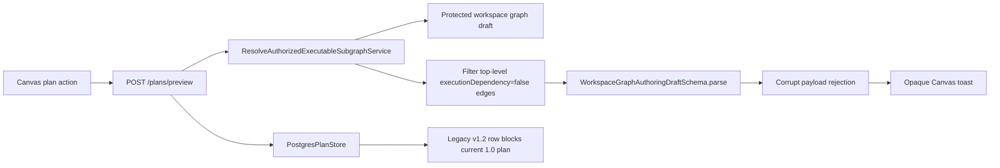

# E Canvas Workflow E2E Usability Plan

## User Stories

| ID                             | Story                                                                                                                                               | Acceptance                                                                                                                                             |
| ------------------------------ | --------------------------------------------------------------------------------------------------------------------------------------------------- | ------------------------------------------------------------------------------------------------------------------------------------------------------ |
| `E-CANVAS-WORKFLOW-PLAN-US`    | As a demanding analytics user, I can create a real workflow plan from the active Canvas without receiving opaque protected-draft errors.            | Reference-only Canvas edges do not corrupt multi-canvas executable-subgraph resolution; plan failures expose actionable user-facing causes.            |
| `E-CANVAS-WORKFLOW-STORE-US`   | As a demanding analytics user on a no-bypass dev stack, stale pre-alpha persisted plans do not block current plan creation after a schema hard-cut. | Plan-store migration removes legacy `schemaVersion = v1.2` rows before current `schemaVersion = 1.0` plans are stored for the same canonical `planId`. |
| `E-CANVAS-WORKFLOW-PROPS-US`   | As a demanding analytics user, I can inspect and edit dbt and SQL node properties, and see those changes reflected in graph and code surfaces.      | Edited dbt source/model and SQL transform properties persist through the protected draft and generated workspace files.                                |
| `E-CANVAS-WORKFLOW-SOURCES-US` | As a demanding analytics user, I can connect workflow nodes to real imported source metadata.                                                       | Source import uses governed workspace source rails and graph nodes can be connected without hidden fixture authority.                                  |
| `E-CANVAS-WORKFLOW-RUN-US`     | As a demanding analytics user, I can create a plan, verify plan details, start an execution, and inspect execution status/events.                   | `PreviewExecutablePlan` and `StartRun` succeed on the no-bypass dev stack for an executable authored graph.                                            |
| `E-CANVAS-WORKFLOW-QA-US`      | As architect-developer reviewer, I can prove the route is usable end to end.                                                                        | Browser validation covers graph, code, source import, plan, run, and error-state readability on the real local stack.                                  |

## Think-First Analysis

Problem summary: the Canvas route is visible but the user sees an opaque toast:
`Protected workspace graph draft payload failed semantic validation.` The graph
itself renders, so the screen gives no clear explanation of what action failed or
what must be fixed.

Root cause: the protected executable-subgraph resolver intentionally filters
authoring edges marked `executionDependency: false` before deriving execution
closure. The current implementation filters only the top-level draft edges. In a
multi-canvas draft, the active canvas workspace still contains the reference-only
edge, so the filtered top-level graph no longer mirrors the active canvas. The
contract parser rejects that internally-mutated shape, and the API reports a
corrupt payload even though the persisted draft is valid.

Second root cause found during browser validation: after the resolver fix,
`POST /plans/preview` reaches the plan store but fails with
`PLAN_STORE_CONFLICT`. The local no-bypass database contains a valid row for the
same canonical `planId` with legacy `schemaVersion = v1.2`. The active
pre-alpha hard-cut emits `schemaVersion = 1.0`; because `stored_plans.plan_id`
is tenant-neutral and primary-keyed by canonical plan core, the old row blocks
current plan creation. This is not a user-data conflict; it is a missing
hard-cut migration path for stale pre-alpha plan rows.

Additional root causes found by the demanding-user E2E loop:

- The local Temporal worker polled the base queue while the protected API
  scheduled tenant runs on the tenant queue.
- SQL-first execution steps reached Temporal, but the worker only had DBT step
  activity wiring.
- The Temporal step validator rejected canonical `retryPolicy` metadata.
- The authored default SQL used `public.source_1`, but the no-bypass local stack
  did not seed that real source relation or advertise it through the warehouse
  source catalog.
- Imported warehouse source nodes persisted with plugin identity
  `dvt.warehouse-source` while the web plugin registry only declared DVT
  tabular ports and authoring metadata for plugin `dvt`, so imported source
  nodes rendered as inert graph nodes without a compatible source-to-transform
  bridge or route-owned source configuration fields.
- Transformation preview required source payload data under
  `metadata.config.schema/table/alias`, but the governed import rail persists
  server-authoritative warehouse metadata as `metadata.sourceName`,
  `metadata.tableName`, `metadata.schema`, `metadata.database`, and
  `metadata.columns`. A user could import a real source and still fail preview
  unless they manually rewrote the node into a DVT-local config shape.
- The passive Inspector rendered only type, status, role, and a
  developer-facing "no plugin inspector panels" message. Source-import metadata,
  columns, tags, path, and graph dependencies already existed on the selected
  node, but the right panel did not project them into useful read-only context.
- The execution-plan preview modal rendered the final pre-run review as a
  narrow card stack where long plan identifiers could dominate or escape the
  surface, and missing estimate data appeared as an orphaned `$`.
- Local protected-runtime auth did not grant source-import/plugin scopes, so
  DataObject Registry could not become available from the real route.
- Partial node selection made the transformation planner validate a one-node
  scope instead of the valid three-node workspace graph.
- Run detail showed materialization evidence below plan provenance, hiding the
  most important post-run verification on laptop-sized viewports.
- Run detail did not expose the persisted plan summary that selected the source
  and sink, and it offered no direct path back to Canvas or the run list after a
  run was started. Users could reach a completed run without knowing which
  authored source/sink scope had executed.
- The Canvas workbench chrome still enforced a Stage 1 text-only tab posture
  and rendered route actions as disconnected pills. Mature graph tools use a
  compact icon+label workbench strip with actions grouped on the right; the
  existing contract made the poor posture a protected invariant.
- The right Inspector projected selected-node facts as a long stack of cards.
  Users need predictable Details, Columns, Depends On, and Code tabs, with
  editable route-owned properties visible inside Details instead of mixed after
  passive read-only fields.

Constraints and invariants:

- `docs/architecture/command-query-rail-governance.md` requires this work to
  reuse existing rails: `GetWorkspaceGraphDraft`, `SaveWorkspaceGraphDraft`,
  `PreviewExecutablePlan`, `StartRun`, workspace files, and warehouse source
  import rails.
- `docs/architecture/fowler-opportunity-planning-governance.md` requires root
  cause and test coverage before implementation.
- `docs/contracts/planner/workspace-graph-draft-persistence-v1.md` and
  `WorkspaceGraphAuthoringDraft` keep the protected draft as the authoritative
  editable aggregate.
- ADR-0035 governs planner public contract evolution; this slice must not change
  planner contracts to mask a runtime projection bug.
- `docs/planning/proposals/mandatory/runtime-and-contracts/execution-plan-prealpha-schema-version-hardcut-plan-20260601.md`
  declares `schemaVersion = v1.2` unsupported after the hard-cut.
- Local dev proof data may seed real Postgres relations and workspace catalog
  metadata, but it must not introduce fake execution adapters or bypass
  authorization.
- `AGENTS.md` forbids bypasses, fake adapters, stub flows, and hidden debt.

Options considered:

- Remove reference-only edge filtering. Rejected: it would make visual/reference
  authoring edges execution dependencies.
- Catch the parse error and show better copy only. Rejected: it masks the
  resolver producing an invalid internal draft shape.
- Filter reference-only edges consistently across the active multi-canvas
  workspace before planner derivation. Selected: it fixes the root cause within
  the executable-subgraph projection boundary and preserves the draft contract.
- Manually delete the stale `v1.2` row from the local DB. Rejected: it would make
  this workstation work while leaving the no-bypass dev stack broken for the
  next stale database.
- Add a plan-store migration that prunes pre-alpha `v1.2` plan records before
  the current store writes `1.0`. Selected: it implements the accepted hard-cut
  posture and prevents the same E2E failure from recurring.
- Add local proof source data/catalog and grant source-import scopes. Selected:
  this makes the real source-import rails usable without frontend fixtures.
- Wire SQL-first Postgres step activities into the worker. Selected: it makes
  the plan created by Canvas executable on the no-bypass Temporal stack.
- Add a generic passive node-summary projection to `InspectorPanel` for path,
  tags, source/dbt metadata, columns, and graph dependencies. Selected: it keeps
  write behavior in the route-owned authoring section while making selected
  nodes inspectable even when no plugin-specific passive panel exists.
- Recompose the execution-plan preview as a contained responsive review surface
  with wrapped identifiers, compact evidence sections, and explicit missing-cost
  presentation. Selected: it fixes the user-visible review defect without
  changing `PreviewExecutablePlan` or `StartRun`.
- Move completed-run materialization evidence above plan provenance. Selected:
  it aligns the run detail with the user's verification task.
- Project persisted plan summary from the plan record into the run snapshot read
  model, then render it as the first run-detail itinerary with explicit return
  links to Canvas and the run list. Selected: it keeps origin/sink evidence on
  the governed `GetRunStatus` read rail instead of inferring it from console
  events.
- Evolve Canvas workbench tabs from Stage 1 text-only labels to Canvas-owned
  semantic icon labels. Selected: it matches mature graph workspace affordances
  without leaking plugin icon components into the route read model.
- Recompose the selected-node Inspector around first-class Details, Columns,
  Depends On, and Code tabs. Selected: it keeps mutation semantics in the
  route-owned authoring section while making passive metadata scannable.
- Register the imported warehouse source plugin identity as a real tabular
  producer in the frontend plugin registry, and let the existing DVT
  transformation authoring model read the server-owned import metadata.
  Selected: it keeps the source import rail authoritative, avoids rewriting API
  identity as a frontend convenience, and makes imported nodes immediately
  connectable, inspectable, and previewable.

Selected option and rationale: normalize the execution-dependency projection so
top-level and active-canvas graph shapes remain mirrored after edge filtering,
prune legacy `v1.2` persisted plan rows during plan-store migration, align the
local source/import/runtime proof stack, then run the plan path against the real
local stack. Subsequent usability fixes must be driven by the demanding-user E2E
checklist and implemented through existing rails.

Rejected alternatives: UI-only error suppression, contract relaxation, changing
persisted draft data, or bypassing source/plan/run rails.

## Current-State Diagram



## Solution Diagram

```mermaid
flowchart LR
    UI[Canvas plan action] --> Preview[PreviewExecutablePlan rail]
    Preview --> Resolver[Executable-subgraph resolver]
    Resolver --> Draft[Protected workspace graph draft]
    Draft --> Projection[Execution-dependency draft projection]
    Projection --> Top[Filtered top-level graph]
    Projection --> Active[Filtered active canvas workspace]
    Top --> Planner[Planner deriveExecutableSubgraph]
    Active --> Planner
    Planner --> Store[Plan-store migration prunes v1.2 rows]
    Store --> Plan[Persisted current 1.0 plan or actionable rejection]
    Plan --> Worker[Temporal worker tenant queue]
    Worker --> Postgres[SQL-first Postgres activities]
    Postgres --> Evidence[Completed run materialization evidence]
```



## Fowler Opportunity Matrix

| Scenario                                                                                  | Opportunity                               | Fowler pattern                               | DDD owner                                          | Command/query rail                                                    | Implementation surfaces                                                   | Unit or package test                                    | Architecture/user-flow test          | Out of scope                   |
| ----------------------------------------------------------------------------------------- | ----------------------------------------- | -------------------------------------------- | -------------------------------------------------- | --------------------------------------------------------------------- | ------------------------------------------------------------------------- | ------------------------------------------------------- | ------------------------------------ | ------------------------------ |
| Multi-canvas reference-only edge turns a valid draft into an invalid internal projection. | Boundary drift, hidden authority          | Projection mapper behind service boundary    | WorkspaceGraphAuthoringDraft executable projection | `PreviewExecutablePlan`, `StartRun`                                   | `resolveAuthorizedExecutableSubgraph.ts`, focused API test                | `resolveAuthorizedExecutableSubgraph.test.ts`           | Browser plan flow on `/canvas`       | Contract version change        |
| Legacy `v1.2` stored plan blocks current `1.0` plan for the same canonical `planId`.      | Documentation drift, hidden authority     | Schema migration / hard-cut cleanup          | Postgres stored plan artifact                      | `PreviewExecutablePlan`, `StartRun`, `ValidateExecutionPlanAdmission` | `PostgresPlanStore` schema manager and SQL                                | `PostgresPlanStore.records-core.integration.test.ts`    | Browser plan flow on `/canvas`       | Multi-version compatibility    |
| Plan failure copy does not tell the user what happened.                                   | Primitive obsession, test-only confidence | Error translation / presentation model       | Canvas route feedback                              | Existing plan preview rail                                            | Web plan action/copy surfaces if still failing after resolver fix         | Focused web test if copy changes                        | Browser screenshot and console check | Global notification redesign   |
| User needs graph-code-property parity for dbt and SQL nodes.                              | Responsibility overload                   | Presentation model + command adapter         | Canvas node authoring draft                        | `SaveWorkspaceGraphDraft`, workspace files                            | Existing Canvas property/code tests plus new focused tests if gaps appear | `transformationGraphValidation.test.ts`                 | Browser graph/code/property loop     | New plugin runtime             |
| Selected nodes show a sparse or empty right panel despite carrying real metadata.         | Primitive obsession, hidden information   | Read model / presentation projection         | Canvas node properties                             | `GetWorkspaceGraphDraft`, `ImportWarehouseSources`                    | `InspectorPanel`, `CanvasInspectorPanel`, focused rendered test           | `CanvasInspectorPanel.test.tsx`                         | Browser select-node inspector check  | Plugin-owned mutation          |
| Canvas top chrome looks like disconnected controls instead of a graph workspace strip.    | Visual posture drift, documentation drift | Presentation model / semantic fitness guard  | Canvas workbench tabs                              | `ListCanvasWorkbenchTabs`, `VerifyCanvasWorkbenchVisualPosture`       | `CanvasWorkbenchTabStrip`, `CanvasShellMainPanel`, Cypress visual proof   | `canvasWorkbenchTabs.test.ts`, `CanvasShell.test.tsx`   | Browser workbench chrome check       | Global shell navigation        |
| Inspector data exists but is hard to navigate or edit in context.                         | Primitive obsession, review friction      | Tabbed presentation model                    | Canvas node properties                             | `GetWorkspaceGraphDraft`, `ImportWarehouseSources`                    | `InspectorPanel`, `CanvasInspectorPanel`, focused rendered test           | `CanvasInspectorPanel.test.tsx`                         | Browser select-node inspector check  | Plugin-owned mutation          |
| Execution-plan preview overflows and renders missing estimates as `$`.                    | Primitive obsession, review friction      | Presentation model / responsive review       | Executable plan preview                            | `PreviewExecutablePlan`, `StartRun`                                   | `PlanPreviewModal`, focused rendered test                                 | `Modals.test.tsx`                                       | Browser plan-preview modal check     | Plan contract changes          |
| Run detail traps the user and hides which source/sink selection executed.                 | Hidden authority, review friction         | Read model projection / orientation UI       | Run detail execution scope                         | GetRunSnapshot, ListRunEvents                                         | Run read model, runtime DTOs, RunWorkspaceStateView                       | getRunStatusUseCase.test.ts, RunStates.test.tsx         | Browser completed-run detail check   | Timeline-derived result truth  |
| User needs source import, plan, run, and inspect status as one usable flow.               | Hidden authority                          | Gateway-backed E2E workflow                  | Protected runtime rails                            | Source import, plan preview, start run, run status/events             | Existing API/web focused tests plus E2E proof                             | `canvas-preview-run-live.cy.ts`                         | Browser E2E on real stack            | External warehouse credentials |
| Local stack cannot prove source import or SQL execution without real seed data.           | Fixture leakage risk                      | Dev proof data as infrastructure composition | Local protected runtime                            | Source import, workspace files, run worker                            | `run-dev-stack` scripts and tests                                         | `run-dev-stack.test.cjs`, `run-dev-stack.auth.test.cjs` | Cypress live proof                   | Production seed behavior       |

## Pre-Implementation Brief

- Mode: Full.
- Scope: fix the current protected-draft semantic validation blocker, then use a
  demanding-user and architect-developer loop to verify the real Canvas workflow,
  including the plan-store hard-cut migration needed for the no-bypass stack, and
  add focused fixes only where evidence shows a failing DoD item.
- Expected outcome: the active Canvas can create a real plan from a dbt or SQL
  workflow on the no-bypass local stack, with understandable failure states.
- Risks and mitigations:
  - Multi-canvas contract invariants are strict: add a regression test that
    fails before the projection fix.
  - Adapter-store and Temporal adapter changes trigger ARC-2: add evidence and
    risk updates before PR closeout.
  - E2E runtime is slow: use focused tests first, then browser validation.
  - Broad feature request can expand silently: each additional fix must map to
    one story and one rail in this plan.
- Out of scope: new contract versions, external warehouse credentials, fake
  execution adapters, and bypass/degraded startup modes.
- Validation plan:
  - `pnpm docs:feature-mechanization -- --feature E-CANVAS-WORKFLOW-E2E-USABILITY-20260601`
  - `pnpm --filter dvt-api test -- test/application/services/resolveAuthorizedExecutableSubgraph.test.ts`
  - `pnpm --filter @dvt/adapter-postgres test -- PostgresPlanStore.records-core.integration.test.ts`
  - focused web tests for edited Canvas/run surfaces
  - live Cypress validation on `http://127.0.0.1:5173/canvas`
  - `pnpm docs:sync`
  - `pnpm docs:status:generate` if source files are added or removed
  - package lint/typecheck for touched scopes
  - `pnpm verify:prepush`

## Feature Mechanization

```feature-mechanization
version: 1
featureId: E-CANVAS-WORKFLOW-E2E-USABILITY-20260601
mechanizationStatus: implemented
noHumanDecisionsRemaining: true
implementationPlan: docs/planning/proposals/mandatory/frontend-and-ux/e-canvas-workflow-e2e-usability-plan-20260601.md
componentGuides:
  - docs/architecture/command-query-rail-governance.md
  - docs/architecture/fowler-opportunity-planning-governance.md
  - docs/contracts/planner/workspace-graph-draft-persistence-v1.md
  - docs/architecture/components/web/graph/canvas-inspector-authoring-component.md
  - docs/architecture/components/web/graph/canvas-authoring-draft-boundary-component.md
  - docs/architecture/components/web/graph/canvas-workbench-command-query-catalog.md
  - docs/architecture/components/web/graph/canvas-workbench-tabs-component.md
  - docs/architecture/components/web/graph/canvas-workbench-tab-strip-component.md
  - docs/architecture/components/web/graph/canvas-workbench-tabs-user-stories.md
userStories:
  - E-CANVAS-WORKFLOW-PLAN-US
  - E-CANVAS-WORKFLOW-STORE-US
  - E-CANVAS-WORKFLOW-PROPS-US
  - E-CANVAS-WORKFLOW-SOURCES-US
  - E-CANVAS-WORKFLOW-RUN-US
  - E-CANVAS-WORKFLOW-QA-US
governingSources:
  - AGENTS.md
  - docs/planning/status/governance-document-rule-inventory.md
  - docs/guides/ai-work-protocol.md
  - docs/architecture/command-query-rail-governance.md
  - docs/architecture/fowler-opportunity-planning-governance.md
  - docs/contracts/planner/workspace-graph-draft-persistence-v1.md
  - docs/planning/proposals/mandatory/runtime-and-contracts/execution-plan-prealpha-schema-version-hardcut-plan-20260601.md
  - apps/api/docs/executable-subgraph-resolution-component.md
allowedImplementationSurfaces:
  - docs/planning/proposals/mandatory/frontend-and-ux/e-canvas-workflow-e2e-usability-plan-20260601.md
  - docs/planning/proposals/index.md
  - docs/planning/proposals/mandatory/frontend-and-ux/index.md
  - docs/**/index.md
  - docs/.manifest.json
  - docs/architecture/components/web/graph/canvas-workbench-command-query-catalog.md
  - docs/architecture/components/web/graph/canvas-workbench-tabs-component.md
  - docs/architecture/components/web/graph/canvas-workbench-tab-strip-component.md
  - docs/architecture/components/web/graph/canvas-workbench-tabs-user-stories.md
  - docs/architecture/components/engine/ops/observability.md
  - docs/architecture/components/web/runs/frontend-runtime-contract-technical-manual.md
  - docs/architecture/components/web/runs/frontend-backend-mvp-contract.md
  - docs/evidence/**
  - docs/risk-register/quality/**
  - apps/api/src/application/services/resolveAuthorizedExecutableSubgraph.ts
  - apps/api/test/application/services/resolveAuthorizedExecutableSubgraph.test.ts
  - apps/api/src/application/ports/protectedRuntimeRunRailVocabulary.ts
  - apps/api/src/application/ports/runtime.ts
  - apps/api/src/application/services/getRunStatusUseCase.ts
  - apps/api/src/application/services/runReadEvidenceModel.ts
  - apps/api/test/application/services/getRunStatusUseCase.test.ts
  - packages/@dvt/observability/src/contracts/ObservabilityContext.ts
  - packages/@dvt/observability/src/policy/cardinalityPolicy.ts
  - packages/@dvt/observability/test/cardinalityPolicy.test.ts
  - packages/@dvt/observability-otel/README.md
  - packages/@dvt/observability-otel/src/OtelObservability.ts
  - packages/@dvt/observability-otel/test/OtelObservability.test.ts
  - packages/@dvt/adapter-postgres/src/PostgresPlanStore.sql.ts
  - packages/@dvt/adapter-postgres/src/PostgresPlanStore.schema-manager.ts
  - packages/@dvt/adapter-postgres/src/PostgresPlanStore.ts
  - packages/@dvt/adapter-postgres/src/PostgresPlanStore.mappers.ts
  - packages/@dvt/adapter-postgres/test/PostgresPlanStore.lifecycle.integration.test.ts
  - packages/@dvt/adapter-postgres/test/PostgresPlanStore.records-core.integration.test.ts
  - packages/@dvt/adapter-temporal/src/activities/stepActivityValidation.ts
  - packages/@dvt/adapter-temporal/test/activities.test.ts
  - apps/temporal-worker/src/runtime/**
  - apps/temporal-worker/test/runtime/createTemporalWorkerRuntime.test.ts
  - scripts/run-dev-stack.cjs
  - scripts/run-dev-stack.auth.cjs
  - scripts/run-dev-stack.auth.test.cjs
  - scripts/run-dev-stack.temporal.cjs
  - scripts/run-dev-stack.test.cjs
  - scripts/run-selected-closure-live-proof.cjs
  - scripts/run-selected-closure-live-proof.test.cjs
  - apps/web/src/app/views/canvas/**
  - apps/web/src/app/views/CodeView.tsx
  - apps/web/src/app/views/CodeView.test.tsx
  - apps/web/src/app/views/code/**
  - apps/web/src/app/views/runs/RunWorkspaceStateView.tsx
  - apps/web/src/app/views/runs/runStatesCopy.ts
  - apps/web/src/app/views/runs/RunStates.test.tsx
  - apps/web/src/app/plugins/dbt/DbtNodeRenderer.tsx
  - apps/web/src/app/plugins/dbt/DbtNodeRenderer.test.tsx
  - apps/web/src/app/plugins/registry.ts
  - apps/web/src/app/plugins/contracts/ConnectionRules.test.ts
  - apps/web/src/app/plugins/dvt/dvtContributions.ts
  - apps/web/src/app/plugins/dvt/dvtContributions.connectionRules.test.ts
  - apps/web/src/app/queries/queryKeys.ts
  - apps/web/src/app/queries/runsQueries.ts
  - apps/web/src/app/ports/runs.ts
  - apps/web/src/app/services/runs/runsApiDecoders.ts
  - apps/web/src/app/services/runs/runsApiSnapshotMapper.ts
  - apps/web/src/app/services/runs/runsService.test.ts
  - apps/web/src/app/components/**
  - apps/web/src/app/services/workspace/**
  - docs/architecture/components/web/frontend-query-boundary-component.md
  - apps/web/cypress/e2e/canvas/**
  - apps/web/cypress/support/**
forbiddenImplementationSurfaces:
  - specs/contracts/**
  - apps/api/src/entrypoints/http/**
  - apps/api/src/infrastructure/temporal/**
  - apps/web/src/app/plugins/**/runtime/**
commandQueryRails:
  - name: GetWorkspaceGraphDraft
    type: query
    dddOwner: Workspace draft read model
  - name: SaveWorkspaceGraphDraft
    type: command
    dddOwner: Workspace draft aggregate
  - name: PreviewExecutablePlan
    type: command
    dddOwner: Executable plan draft
  - name: StartRun
    type: command
    dddOwner: Run command admission
  - name: ValidateExecutionPlanAdmission
    type: query
    dddOwner: ExecutionPlanAdmissionPair
  - name: ListWarehouseConnections
    type: query
    dddOwner: Warehouse connection catalog read model
  - name: ListWarehouseConnectionSourceObjects
    type: query
    dddOwner: Warehouse table catalog read model
  - name: ImportWarehouseSources
    type: command
    dddOwner: Source registration aggregate
  - name: GetWorkspaceFileContent
    type: query
    dddOwner: Workspace file read model
  - name: SaveWorkspaceFileContent
    type: command
    dddOwner: Workspace file aggregate
  - name: GetRunSnapshot
    type: query
    dddOwner: Run snapshot read model
  - name: ListRunEvents
    type: query
    dddOwner: Run timeline read model
  - name: ListCanvasWorkbenchTabs
    type: query
    dddOwner: CanvasWorkbenchTabsReadModel
  - name: VerifyCanvasWorkbenchVisualPosture
    type: query
    dddOwner: CanvasWorkbenchVisualPostureReadModel
  - name: ResolveCanvasContextMenu
    type: query
    dddOwner: CanvasContextMenuReadModel
  - name: CreateCanvasAuthoringNode
    type: command
    dddOwner: CanvasGraphAuthoringDraft
  - name: RemoveCanvasEdgeFromContext
    type: command
    dddOwner: CanvasGraphAuthoringDraft
domainObjects:
  - name: WorkspaceGraphAuthoringDraft
    type: aggregate
    owner: Workspace graph drafting
  - name: ExecutableSubgraph
    type: read model
    owner: Planner boundary
  - name: Canvas node properties
    type: presentation model
    owner: Web Canvas
  - name: StoredPlanArtifact
    type: persisted artifact
    owner: Postgres plan store
  - name: TemporalWorkerStepCapability
    type: runtime capability
    owner: Temporal worker
  - name: WarehouseConnectionCatalog
    type: read model
    owner: Source import
  - name: RunMaterializationEvidence
    type: read model
    owner: Run detail
  - name: RunPlanExecutionScope
    type: read model
    owner: Run detail
  - name: CodeGraphFileScope
    type: read model
    owner: Web Code
  - name: DbtNodeRunHistory
    type: presentation model
    owner: Web dbt inspector
  - name: ExecutablePlanPreview
    type: presentation model
    owner: Web Canvas
  - name: CanvasContextMenuReadModel
    type: presentation model
    owner: Web Canvas
fowlerSignals:
  - Reference-only Canvas edges were being interpreted through an inconsistent execution projection.
  - Opaque protected-draft errors created test-only confidence instead of user-operable feedback.
  - The E2E workflow must prove graph, code, plan, and run rails together.
  - Legacy v1.2 persisted plan rows must not keep current 1.0 plan creation unusable.
  - Real source import and SQL execution require local proof data, catalog, and authorization to line up.
  - Completed-run evidence must be visible before lower-priority provenance.
  - Run detail must show the source/sink scope from persisted plan evidence and
    give the user a route back to Canvas and Runs.
  - Code file browsing must follow the active graph instead of stale workspace artifacts.
  - dbt Inspector history must consume runtime events instead of retaining a
    completed-run placeholder panel.
  - Imported warehouse source nodes must have a declared plugin port bridge and
    route-owned authoring fields instead of behaving as inert graph decorations.
  - Transformation preview must consume governed source-import metadata without
    requiring a manual config rewrite.
  - The passive Inspector must project existing node metadata and dependencies
    into useful read-only context instead of exposing internal plugin absence.
  - The plan preview must remain contained and readable for real plan IDs,
    references, proof hashes, and absent estimate values.
architectureGuards:
  - pnpm --filter dvt-api test -- test/application/services/resolveAuthorizedExecutableSubgraph.test.ts
  - pnpm --filter dvt-api test -- test/application/services/getRunStatusUseCase.test.ts
  - pnpm --filter @dvt/adapter-postgres test -- PostgresPlanStore.lifecycle.integration.test.ts PostgresPlanStore.records-core.integration.test.ts
  - pnpm --filter @dvt/adapter-temporal test -- test/activities.test.ts
  - pnpm --filter dvt-temporal-worker test -- test/runtime/createTemporalWorkerRuntime.test.ts
  - node --test scripts/run-dev-stack.test.cjs scripts/run-dev-stack.auth.test.cjs
  - pnpm --filter @dvt/web test -- src/app/views/code/codeViewFileSelection.test.ts src/app/views/CodeView.test.tsx
  - pnpm --filter @dvt/web test -- src/app/plugins/dbt/DbtNodeRenderer.test.tsx src/app/queries/queryKeyPolicy.architecture.test.ts
  - pnpm --filter @dvt/web test -- src/app/plugins/contracts/ConnectionRules.test.ts src/app/plugins/dvt/dvtContributions.connectionRules.test.ts src/app/views/canvas/canvasInspectorAuthoringModel.test.ts src/app/views/canvas/CanvasInspectorPanel.test.tsx src/app/views/canvas/useCanvasExecutionActions.planPreview.core.test.tsx
  - pnpm docs:feature-mechanization:implementation
cypressFlows:
  - apps/web/cypress/e2e/canvas/canvas-preview-run-live.cy.ts
  - apps/web/cypress/e2e/canvas/code-workbench-workspace-files.cy.ts
completionGate:
  - pnpm docs:sync
  - pnpm docs:status:generate
  - pnpm --filter dvt-api test -- test/application/services/resolveAuthorizedExecutableSubgraph.test.ts
  - pnpm --filter @dvt/adapter-postgres test -- PostgresPlanStore.lifecycle.integration.test.ts PostgresPlanStore.records-core.integration.test.ts
  - pnpm --filter @dvt/adapter-temporal test -- test/activities.test.ts
  - pnpm --filter dvt-temporal-worker test -- test/runtime/createTemporalWorkerRuntime.test.ts
  - pnpm --filter @dvt/web test -- src/app/views/canvas/transformationGraphValidation.test.ts src/app/views/canvas/useCanvasExecutionActions.planPreview.core.test.tsx src/app/views/runs/RunStates.test.tsx src/app/services/runs/runsService.test.ts
  - pnpm --filter @dvt/web test -- src/app/plugins/contracts/ConnectionRules.test.ts src/app/plugins/dvt/dvtContributions.connectionRules.test.ts src/app/views/canvas/canvasInspectorAuthoringModel.test.ts src/app/views/canvas/CanvasInspectorPanel.test.tsx src/app/views/canvas/useCanvasExecutionActions.planPreview.core.test.tsx
  - pnpm --filter @dvt/web test -- src/app/views/code/codeViewFileSelection.test.ts src/app/views/CodeView.test.tsx
  - pnpm --filter @dvt/web test -- src/app/plugins/dbt/DbtNodeRenderer.test.tsx src/app/queries/queryKeyPolicy.architecture.test.ts
  - pnpm --filter @dvt/web test
  - node --test scripts/run-dev-stack.test.cjs scripts/run-dev-stack.auth.test.cjs
  - pnpm --dir apps/web exec cypress run --config-file cypress.config.ts --config baseUrl=http://127.0.0.1:5173 --spec cypress/e2e/canvas/canvas-preview-run-live.cy.ts --browser electron
  - pnpm --filter @dvt/web exec cypress run --config-file cypress.config.ts --config baseUrl=http://127.0.0.1:5173 --spec cypress/e2e/canvas/code-workbench-workspace-files.cy.ts --browser electron
  - pnpm --filter dvt-api typecheck
  - pnpm --filter dvt-api lint
  - pnpm --filter @dvt/web typecheck
  - pnpm --filter @dvt/web lint
  - pnpm --filter @dvt/adapter-postgres typecheck
  - pnpm --filter @dvt/adapter-temporal typecheck
  - pnpm --filter dvt-temporal-worker typecheck
  - pnpm verify:prepush
redGreenCycles:
  - id: multicanvas-reference-edge-executable-projection
    redTest: pnpm --filter dvt-api test -- test/application/services/resolveAuthorizedExecutableSubgraph.test.ts
    expectedFailure: A valid multi-canvas draft with an active reference-only edge is rejected as workspace_graph_draft_corrupt_payload.
    patchSurfaces:
      - apps/api/src/application/services/resolveAuthorizedExecutableSubgraph.ts
      - apps/api/test/application/services/resolveAuthorizedExecutableSubgraph.test.ts
    greenTest: pnpm --filter dvt-api test -- test/application/services/resolveAuthorizedExecutableSubgraph.test.ts
  - id: prune-legacy-plan-schema-store-rows
    redTest: pnpm --filter @dvt/adapter-postgres test -- PostgresPlanStore.records-core.integration.test.ts
    expectedFailure: A legacy v1.2 stored plan remains after migrate and blocks storing the current 1.0 plan for the same planId.
    patchSurfaces:
      - packages/@dvt/adapter-postgres/src/PostgresPlanStore.sql.ts
      - packages/@dvt/adapter-postgres/src/PostgresPlanStore.schema-manager.ts
      - packages/@dvt/adapter-postgres/test/PostgresPlanStore.records-core.integration.test.ts
    greenTest: pnpm --filter @dvt/adapter-postgres test -- PostgresPlanStore.records-core.integration.test.ts
  - id: run-plan-record-created-at-idempotency
    redTest: pnpm --filter @dvt/adapter-postgres test -- PostgresPlanStore.lifecycle.integration.test.ts
    expectedFailure: A replayed plan with only metadata.createdAtIso drift raises PLAN_RECORD_CONFLICT.
    patchSurfaces:
      - packages/@dvt/adapter-postgres/src/PostgresPlanStore.ts
      - packages/@dvt/adapter-postgres/src/PostgresPlanStore.mappers.ts
      - packages/@dvt/adapter-postgres/test/PostgresPlanStore.lifecycle.integration.test.ts
    greenTest: pnpm --filter @dvt/adapter-postgres test -- PostgresPlanStore.lifecycle.integration.test.ts
  - id: temporal-sql-first-worker-runtime
    redTest: pnpm --filter dvt-temporal-worker test -- test/runtime/createTemporalWorkerRuntime.test.ts
    expectedFailure: SQL-first Postgres step kinds are unsupported when DBT is disabled.
    patchSurfaces:
      - apps/temporal-worker/src/runtime/temporalWorkerPostgresProfile.ts
      - apps/temporal-worker/src/runtime/temporalWorkerRuntimeResources.ts
      - apps/temporal-worker/test/runtime/createTemporalWorkerRuntime.test.ts
    greenTest: pnpm --filter dvt-temporal-worker test -- test/runtime/createTemporalWorkerRuntime.test.ts
  - id: local-source-import-proof-stack
    redTest: node --test scripts/run-dev-stack.test.cjs scripts/run-dev-stack.auth.test.cjs
    expectedFailure: The local stack has no source relation/catalog and no source-import authorization scopes.
    patchSurfaces:
      - scripts/run-dev-stack.cjs
      - scripts/run-dev-stack.auth.cjs
      - scripts/run-dev-stack.test.cjs
      - scripts/run-dev-stack.auth.test.cjs
    greenTest: node --test scripts/run-dev-stack.test.cjs scripts/run-dev-stack.auth.test.cjs
  - id: canvas-live-sql-run-and-source-import
    redTest: pnpm --dir apps/web exec cypress run --config-file cypress.config.ts --config baseUrl=http://127.0.0.1:5173 --spec cypress/e2e/canvas/canvas-preview-run-live.cy.ts --browser electron
    expectedFailure: The live route cannot complete a SQL-first run or import seeded warehouse metadata.
    patchSurfaces:
      - apps/web/cypress/e2e/canvas/canvas-preview-run-live.cy.ts
      - apps/web/cypress/support/liveProtectedRuntime.ts
      - apps/web/src/app/views/runs/RunWorkspaceStateView.tsx
    greenTest: pnpm --dir apps/web exec cypress run --config-file cypress.config.ts --config baseUrl=http://127.0.0.1:5173 --spec cypress/e2e/canvas/canvas-preview-run-live.cy.ts --browser electron
  - id: code-route-graph-file-scope
    redTest: pnpm --filter @dvt/web test -- src/app/views/code/codeViewFileSelection.test.ts src/app/views/CodeView.test.tsx
    expectedFailure: Code exposes persisted dbt files that are not part of the active graph and can open stale model SQL.
    patchSurfaces:
      - apps/web/src/app/views/CodeView.tsx
      - apps/web/src/app/views/CodeView.test.tsx
      - apps/web/src/app/views/code/codeViewFileSelection.ts
      - apps/web/src/app/views/code/codeViewFileSelection.test.ts
    greenTest: pnpm --filter @dvt/web test -- src/app/views/code/codeViewFileSelection.test.ts src/app/views/CodeView.test.tsx
  - id: dbt-inspector-node-run-history
    redTest: pnpm --filter @dvt/web test -- src/app/plugins/dbt/DbtNodeRenderer.test.tsx src/app/queries/queryKeyPolicy.architecture.test.ts
    expectedFailure: The dbt Inspector history panel reports runtime detail as unavailable even when ListRunEvents returns node-scoped step events.
    patchSurfaces:
      - apps/web/src/app/plugins/dbt/DbtNodeRenderer.tsx
      - apps/web/src/app/plugins/dbt/DbtNodeRenderer.test.tsx
      - apps/web/src/app/queries/queryKeys.ts
      - apps/web/src/app/queries/runsQueries.ts
      - docs/architecture/components/web/frontend-query-boundary-component.md
    greenTest: pnpm --filter @dvt/web test -- src/app/plugins/dbt/DbtNodeRenderer.test.tsx src/app/queries/queryKeyPolicy.architecture.test.ts
  - id: warehouse-source-plugin-authoring-bridge
    redTest: pnpm --filter @dvt/web test -- src/app/plugins/contracts/ConnectionRules.test.ts src/app/plugins/dvt/dvtContributions.connectionRules.test.ts src/app/views/canvas/canvasInspectorAuthoringModel.test.ts src/app/views/canvas/CanvasInspectorPanel.test.tsx src/app/views/canvas/useCanvasExecutionActions.planPreview.core.test.tsx
    expectedFailure: Imported `dvt.warehouse-source` nodes cannot connect to DVT SQL transforms, do not expose DVT source authoring fields, and cannot build a transformation preview from source-import metadata.
    patchSurfaces:
      - apps/web/src/app/plugins/registry.ts
      - apps/web/src/app/plugins/contracts/ConnectionRules.test.ts
      - apps/web/src/app/plugins/dvt/dvtContributions.ts
      - apps/web/src/app/plugins/dvt/dvtContributions.connectionRules.test.ts
      - apps/web/src/app/views/canvas/canvasDvtAuthoringModel.ts
      - apps/web/src/app/views/canvas/canvasInspectorAuthoringModel.test.ts
      - apps/web/src/app/views/canvas/CanvasInspectorPanel.test.tsx
      - apps/web/src/app/views/canvas/previewGraphNodePayloads.ts
      - apps/web/src/app/views/canvas/useCanvasExecutionActions.planPreview.core.test.tsx
    greenTest: pnpm --filter @dvt/web test -- src/app/plugins/contracts/ConnectionRules.test.ts src/app/plugins/dvt/dvtContributions.connectionRules.test.ts src/app/views/canvas/canvasInspectorAuthoringModel.test.ts src/app/views/canvas/CanvasInspectorPanel.test.tsx src/app/views/canvas/useCanvasExecutionActions.planPreview.core.test.tsx
  - id: canvas-inspector-readable-node-context
    redTest: pnpm --filter @dvt/web test -- src/app/views/canvas/CanvasInspectorPanel.test.tsx
    expectedFailure: Selecting an imported source node shows only sparse core fields plus a developer-facing no-plugin message, while source metadata, columns, and graph dependencies remain hidden.
    patchSurfaces:
      - apps/web/src/app/components/InspectorPanel.tsx
      - apps/web/src/app/views/canvas/CanvasInspectorPanel.tsx
      - apps/web/src/app/views/canvas/CanvasInspectorPanel.test.tsx
    greenTest: pnpm --filter @dvt/web test -- src/app/views/canvas/CanvasInspectorPanel.test.tsx
  - id: canvas-workbench-semantic-icon-chrome
    redTest: pnpm --filter @dvt/web test -- src/app/views/canvas/canvasWorkbenchTabs.test.ts src/app/views/canvas/canvasWorkbenchTabs.architecture.test.ts src/app/views/canvas/CanvasShell.test.tsx
    expectedFailure: Canvas workbench tabs still expose text-only posture and the shell chrome still allows wrapped, disconnected route controls.
    patchSurfaces:
      - docs/architecture/components/web/graph/canvas-workbench-command-query-catalog.md
      - docs/architecture/components/web/graph/canvas-workbench-tabs-component.md
      - docs/architecture/components/web/graph/canvas-workbench-tab-strip-component.md
      - docs/architecture/components/web/graph/canvas-workbench-tabs-user-stories.md
      - apps/web/src/app/views/canvas/canvasWorkbenchTabs.ts
      - apps/web/src/app/views/canvas/CanvasWorkbenchTabStrip.tsx
      - apps/web/src/app/views/canvas/CanvasShellMainPanel.tsx
      - apps/web/src/app/views/canvas/canvasChromeTokens.ts
      - apps/web/src/app/views/canvas/canvasWorkbenchTabs.test.ts
      - apps/web/src/app/views/canvas/canvasWorkbenchTabs.architecture.test.ts
      - apps/web/src/app/views/canvas/CanvasShell.test.tsx
      - apps/web/cypress/e2e/canvas/canvas-workbench-tabs.cy.ts
    greenTest: pnpm --filter @dvt/web test -- src/app/views/canvas/canvasWorkbenchTabs.test.ts src/app/views/canvas/canvasWorkbenchTabs.architecture.test.ts src/app/views/canvas/CanvasShell.test.tsx
  - id: inspector-tabbed-read-model
    redTest: pnpm --filter @dvt/web test -- src/app/views/canvas/CanvasInspectorPanel.test.tsx
    expectedFailure: Selected-node facts and editable properties render as one long stack instead of predictable Details, Columns, Depends On, and Code tabs.
    patchSurfaces:
      - apps/web/src/app/components/InspectorPanel.tsx
      - apps/web/src/app/views/canvas/CanvasInspectorPanel.test.tsx
    greenTest: pnpm --filter @dvt/web test -- src/app/views/canvas/CanvasInspectorPanel.test.tsx
  - id: plan-preview-contained-review-layout
    redTest: pnpm --filter @dvt/web test -- src/app/components/Modals.test.tsx
    expectedFailure: A persisted plan preview renders as an over-wide card stack with orphaned empty cost output instead of a contained responsive review surface.
    patchSurfaces:
      - apps/web/src/app/components/Modals.tsx
      - apps/web/src/app/components/Modals.test.tsx
    greenTest: pnpm --filter @dvt/web test -- src/app/components/Modals.test.tsx
  - id: run-detail-plan-execution-scope
    redTest: pnpm --filter dvt-api test -- test/application/services/getRunStatusUseCase.test.ts && pnpm --filter @dvt/web test -- src/app/views/runs/RunStates.test.tsx
    expectedFailure: Completed run detail cannot show source/sink plan scope or direct return actions from persisted run read evidence.
    patchSurfaces:
      - docs/architecture/components/engine/ops/observability.md
      - docs/architecture/components/web/runs/frontend-backend-mvp-contract.md
      - docs/architecture/components/web/runs/frontend-runtime-contract-technical-manual.md
      - apps/api/src/application/ports/protectedRuntimeRunRailVocabulary.ts
      - apps/api/src/application/ports/runtime.ts
      - apps/api/src/application/services/runReadEvidenceModel.ts
      - apps/api/test/application/services/getRunStatusUseCase.test.ts
      - packages/@dvt/observability/src/contracts/ObservabilityContext.ts
      - packages/@dvt/observability/src/policy/cardinalityPolicy.ts
      - packages/@dvt/observability/test/cardinalityPolicy.test.ts
      - packages/@dvt/observability-otel/README.md
      - packages/@dvt/observability-otel/src/OtelObservability.ts
      - packages/@dvt/observability-otel/test/OtelObservability.test.ts
      - apps/web/src/app/ports/runs.ts
      - apps/web/src/app/services/runs/runsApiDecoders.ts
      - apps/web/src/app/services/runs/runsApiSnapshotMapper.ts
      - apps/web/src/app/views/runs/RunWorkspaceStateView.tsx
      - apps/web/src/app/views/runs/RunStates.test.tsx
    greenTest: pnpm --filter dvt-api test -- test/application/services/getRunStatusUseCase.test.ts && pnpm --filter @dvt/web test -- src/app/views/runs/RunStates.test.tsx
symbols:
  - name: CanvasViewportContextMenu
    path: apps/web/src/app/views/canvas/CanvasViewport.tsx
    dddOwner: CanvasContextMenuReadModel
    cqRails: [ResolveCanvasContextMenu, CreateCanvasAuthoringNode, RemoveCanvasEdgeFromContext]
    fowlerSignals: [Context-menu gestures must render app-owned actions instead of leaking browser defaults.]
    architectureGuard: pnpm --filter @dvt/web test:architecture:run -- canvasInteractionCommandSurface.architecture.test.ts
    cypressCoverage: apps/web/cypress/e2e/canvas/canvas-preview-run-live.cy.ts
    unitTests:
      - apps/web/src/app/views/canvas/CanvasViewport.test.tsx
  - name: CanvasViewportContextMenuProps
    path: apps/web/src/app/views/canvas/CanvasViewport.tsx
    dddOwner: CanvasContextMenuReadModel
    cqRails: [ResolveCanvasContextMenu, CreateCanvasAuthoringNode, RemoveCanvasEdgeFromContext]
    fowlerSignals: [The contextual action contract must stay explicit at the viewport boundary.]
    architectureGuard: pnpm --filter @dvt/web test:architecture:run -- canvasInteractionCommandSurface.architecture.test.ts
    cypressCoverage: apps/web/cypress/e2e/canvas/canvas-preview-run-live.cy.ts
    unitTests:
      - apps/web/src/app/views/canvas/CanvasViewport.test.tsx
  - name: CanvasAuthoringNodePosition
    path: apps/web/src/app/views/canvas/canvasAuthoringNodeCommand.ts
    dddOwner: CanvasGraphAuthoringDraft
    cqRails: [CreateCanvasAuthoringNode]
    fowlerSignals: [Toolbar and context-menu node creation must share the same command shape.]
    architectureGuard: pnpm --filter @dvt/web test:architecture:run -- canvasInteractionCommandSurface.architecture.test.ts
    cypressCoverage: apps/web/cypress/e2e/canvas/canvas-preview-run-live.cy.ts
    unitTests:
      - apps/web/src/app/views/canvas/canvasAuthoringNodeCommand.test.ts
  - name: CreateCanvasAuthoringNode
    path: apps/web/src/app/views/canvas/canvasGraphHandlerContracts.ts
    dddOwner: CanvasGraphAuthoringDraft
    cqRails: [CreateCanvasAuthoringNode]
    fowlerSignals: [Graph node creation must stay behind the route-owned command seam.]
    architectureGuard: pnpm --filter @dvt/web test:architecture:run -- useCanvasGraphHandlers.architecture.test.ts
    cypressCoverage: apps/web/cypress/e2e/canvas/canvas-preview-run-live.cy.ts
    unitTests:
      - apps/web/src/app/views/canvas/CanvasStateViews.test.tsx
  - name: BuildCanvasContextMenuModelArgs
    path: apps/web/src/app/views/canvas/canvasInteractionCommandSurface.ts
    dddOwner: CanvasContextMenuReadModel
    cqRails: [ResolveCanvasContextMenu]
    fowlerSignals: [Context-menu read-model inputs must stay pure and testable.]
    architectureGuard: pnpm --filter @dvt/web test:architecture:run -- canvasInteractionCommandSurface.architecture.test.ts
    cypressCoverage: apps/web/cypress/e2e/canvas/canvas-preview-run-live.cy.ts
    unitTests:
      - apps/web/src/app/views/canvas/canvasInteractionCommandSurface.test.ts
  - name: CanvasContextMenuCreateNodeAction
    path: apps/web/src/app/views/canvas/canvasInteractionCommandSurface.ts
    dddOwner: CanvasContextMenuReadModel
    cqRails: [ResolveCanvasContextMenu, CreateCanvasAuthoringNode]
    fowlerSignals: [Pane context menus must advertise node creation without bypassing the node catalog.]
    architectureGuard: pnpm --filter @dvt/web test:architecture:run -- canvasInteractionCommandSurface.architecture.test.ts
    cypressCoverage: apps/web/cypress/e2e/canvas/canvas-preview-run-live.cy.ts
    unitTests:
      - apps/web/src/app/views/canvas/canvasInteractionCommandSurface.test.ts
  - name: CanvasContextMenuEdgeAction
    path: apps/web/src/app/views/canvas/canvasInteractionCommandSurface.ts
    dddOwner: CanvasContextMenuReadModel
    cqRails: [ResolveCanvasContextMenu, RemoveCanvasEdgeFromContext]
    fowlerSignals: [Edge context menus must expose deletion through the existing edge lifecycle.]
    architectureGuard: pnpm --filter @dvt/web test:architecture:run -- canvasInteractionCommandSurface.architecture.test.ts
    cypressCoverage: apps/web/cypress/e2e/canvas/canvas-preview-run-live.cy.ts
    unitTests:
      - apps/web/src/app/views/canvas/canvasInteractionCommandSurface.test.ts
  - name: CanvasContextMenuModel
    path: apps/web/src/app/views/canvas/canvasInteractionCommandSurface.ts
    dddOwner: CanvasContextMenuReadModel
    cqRails: [ResolveCanvasContextMenu]
    fowlerSignals: [The viewport must consume a read model, not infer commands inline.]
    architectureGuard: pnpm --filter @dvt/web test:architecture:run -- canvasInteractionCommandSurface.architecture.test.ts
    cypressCoverage: apps/web/cypress/e2e/canvas/canvas-preview-run-live.cy.ts
    unitTests:
      - apps/web/src/app/views/canvas/canvasInteractionCommandSurface.test.ts
  - name: CanvasContextMenuPosition
    path: apps/web/src/app/views/canvas/canvasInteractionCommandSurface.ts
    dddOwner: CanvasContextMenuReadModel
    cqRails: [ResolveCanvasContextMenu]
    fowlerSignals: [Context-menu placement must be explicit and independent of browser menu state.]
    architectureGuard: pnpm --filter @dvt/web test:architecture:run -- canvasInteractionCommandSurface.architecture.test.ts
    cypressCoverage: apps/web/cypress/e2e/canvas/canvas-preview-run-live.cy.ts
    unitTests:
      - apps/web/src/app/views/canvas/canvasInteractionCommandSurface.test.ts
  - name: CanvasContextMenuTarget
    path: apps/web/src/app/views/canvas/canvasInteractionCommandSurface.ts
    dddOwner: CanvasContextMenuReadModel
    cqRails: [ResolveCanvasContextMenu]
    fowlerSignals: [Pane and edge gestures must be discriminated before actions are built.]
    architectureGuard: pnpm --filter @dvt/web test:architecture:run -- canvasInteractionCommandSurface.architecture.test.ts
    cypressCoverage: apps/web/cypress/e2e/canvas/canvas-preview-run-live.cy.ts
    unitTests:
      - apps/web/src/app/views/canvas/canvasInteractionCommandSurface.test.ts
  - name: buildCanvasContextMenuModel
    path: apps/web/src/app/views/canvas/canvasInteractionCommandSurface.ts
    dddOwner: CanvasContextMenuReadModel
    cqRails: [ResolveCanvasContextMenu]
    fowlerSignals: [Contextual menu visibility must follow graph posture and selected target.]
    architectureGuard: pnpm --filter @dvt/web test:architecture:run -- canvasInteractionCommandSurface.architecture.test.ts
    cypressCoverage: apps/web/cypress/e2e/canvas/canvas-preview-run-live.cy.ts
    unitTests:
      - apps/web/src/app/views/canvas/canvasInteractionCommandSurface.test.ts
  - name: buildCanvasEdgeContextRemovalChange
    path: apps/web/src/app/views/canvas/canvasInteractionCommandSurface.ts
    dddOwner: CanvasGraphAuthoringDraft
    cqRails: [RemoveCanvasEdgeFromContext]
    fowlerSignals: [Edge deletion must reuse the React Flow removal lifecycle instead of mutating graph state directly.]
    architectureGuard: pnpm --filter @dvt/web test:architecture:run -- canvasInteractionCommandSurface.architecture.test.ts
    cypressCoverage: apps/web/cypress/e2e/canvas/canvas-preview-run-live.cy.ts
    unitTests:
      - apps/web/src/app/views/canvas/canvasInteractionCommandSurface.test.ts
  - name: PlanPreviewModal
    path: apps/web/src/app/components/Modals.tsx
    dddOwner: ExecutablePlanPreview
    cqRails: [PreviewExecutablePlan, StartRun]
    fowlerSignals: [The plan preview must stay readable and contained while preserving immutable plan semantics.]
    architectureGuard: pnpm --filter @dvt/web test -- src/app/components/Modals.test.tsx
    cypressCoverage: apps/web/cypress/e2e/canvas/canvas-preview-run-live.cy.ts
    unitTests:
      - apps/web/src/app/components/Modals.test.tsx
  - name: PlanPreviewSection
    path: apps/web/src/app/components/Modals.tsx
    dddOwner: ExecutablePlanPreview
    cqRails: [PreviewExecutablePlan, StartRun]
    fowlerSignals: [The preview review surface must use consistent contained sections instead of ad hoc overflowing cards.]
    architectureGuard: pnpm --filter @dvt/web test -- src/app/components/Modals.test.tsx
    cypressCoverage: apps/web/cypress/e2e/canvas/canvas-preview-run-live.cy.ts
    unitTests:
      - apps/web/src/app/components/Modals.test.tsx
  - name: PlanPreviewField
    path: apps/web/src/app/components/Modals.tsx
    dddOwner: ExecutablePlanPreview
    cqRails: [PreviewExecutablePlan, StartRun]
    fowlerSignals: [Plan preview values must wrap long identifiers without escaping the modal.]
    architectureGuard: pnpm --filter @dvt/web test -- src/app/components/Modals.test.tsx
    cypressCoverage: apps/web/cypress/e2e/canvas/canvas-preview-run-live.cy.ts
    unitTests:
      - apps/web/src/app/components/Modals.test.tsx
  - name: formatPlanCost
    path: apps/web/src/app/components/Modals.tsx
    dddOwner: ExecutablePlanPreview
    cqRails: [PreviewExecutablePlan, StartRun]
    fowlerSignals: [Missing estimated-cost data must be presented explicitly instead of as an orphaned currency symbol.]
    architectureGuard: pnpm --filter @dvt/web test -- src/app/components/Modals.test.tsx
    cypressCoverage: apps/web/cypress/e2e/canvas/canvas-preview-run-live.cy.ts
    unitTests:
      - apps/web/src/app/components/Modals.test.tsx
  - name: derivePlanSummary
    path: apps/api/src/application/services/runReadEvidenceModel.ts
    dddOwner: RunPlanExecutionScope
    cqRails: [GetRunSnapshot]
    fowlerSignals: [Run detail source and sink scope must come from persisted plan evidence, not timeline inference.]
    architectureGuard: pnpm --filter dvt-api test -- test/application/services/getRunStatusUseCase.test.ts
    cypressCoverage: apps/web/cypress/e2e/canvas/canvas-preview-run-live.cy.ts
    unitTests:
      - apps/api/test/application/services/getRunStatusUseCase.test.ts
  - name: RunDiagnosticPointer
    path: apps/api/src/application/ports/runtime.ts
    dddOwner: RunDiagnosticsReadModel
    cqRails: [GetRunSnapshot]
    fowlerSignals: [Trace and log pointers must be explicit runtime DTOs, not strings inferred by the view.]
    architectureGuard: pnpm --filter dvt-api test -- test/application/services/getRunStatusUseCase.test.ts
    cypressCoverage: apps/web/cypress/e2e/canvas/canvas-preview-run-live.cy.ts
    unitTests:
      - apps/api/test/application/services/getRunStatusUseCase.test.ts
  - name: RunDiagnostics
    path: apps/api/src/application/ports/runtime.ts
    dddOwner: RunDiagnosticsReadModel
    cqRails: [GetRunSnapshot]
    fowlerSignals: [Run diagnostics must carry run, plan, step, adapter, duration, status, and error evidence together.]
    architectureGuard: pnpm --filter dvt-api test -- test/application/services/getRunStatusUseCase.test.ts
    cypressCoverage: apps/web/cypress/e2e/canvas/canvas-preview-run-live.cy.ts
    unitTests:
      - apps/api/test/application/services/getRunStatusUseCase.test.ts
  - name: OtelObservability.withContext
    path: packages/@dvt/observability-otel/src/OtelObservability.ts
    dddOwner: RunDiagnosticsReadModel
    cqRails: [GetRunSnapshot]
    fowlerSignals: [Structured runtime logs inherit active run diagnostic context unless the log entry provides an explicit context.]
    architectureGuard: pnpm --filter @dvt/observability-otel test
    cypressCoverage: apps/web/cypress/e2e/canvas/canvas-preview-run-live.cy.ts
    unitTests:
      - packages/@dvt/observability-otel/test/OtelObservability.test.ts
  - name: deriveDiagnostics
    path: apps/api/src/application/services/runReadEvidenceModel.ts
    dddOwner: RunDiagnosticsReadModel
    cqRails: [GetRunSnapshot]
    fowlerSignals: [Runtime diagnostics must be projected from persisted run evidence instead of frontend timeline guesses.]
    architectureGuard: pnpm --filter dvt-api test -- test/application/services/getRunStatusUseCase.test.ts
    cypressCoverage: apps/web/cypress/e2e/canvas/canvas-preview-run-live.cy.ts
    unitTests:
      - apps/api/test/application/services/getRunStatusUseCase.test.ts
  - name: deriveDurationMs
    path: apps/api/src/application/services/runReadEvidenceModel.ts
    dddOwner: RunDiagnosticsReadModel
    cqRails: [GetRunSnapshot]
    fowlerSignals: [Run duration must be computed once at the read-model boundary.]
    architectureGuard: pnpm --filter dvt-api test -- test/application/services/getRunStatusUseCase.test.ts
    cypressCoverage: apps/web/cypress/e2e/canvas/canvas-preview-run-live.cy.ts
    unitTests:
      - apps/api/test/application/services/getRunStatusUseCase.test.ts
  - name: deriveLatestEventString
    path: apps/api/src/application/services/runReadEvidenceModel.ts
    dddOwner: RunDiagnosticsReadModel
    cqRails: [GetRunSnapshot]
    fowlerSignals: [Step, attempt, and error evidence must be extracted by named read-model helpers.]
    architectureGuard: pnpm --filter dvt-api test -- test/application/services/getRunStatusUseCase.test.ts
    cypressCoverage: apps/web/cypress/e2e/canvas/canvas-preview-run-live.cy.ts
    unitTests:
      - apps/api/test/application/services/getRunStatusUseCase.test.ts
  - name: deriveLatestStepId
    path: apps/api/src/application/services/runReadEvidenceModel.ts
    dddOwner: RunDiagnosticsReadModel
    cqRails: [GetRunSnapshot]
    fowlerSignals: [Step diagnostics must prefer persisted snapshot step evidence before falling back to events.]
    architectureGuard: pnpm --filter dvt-api test -- test/application/services/getRunStatusUseCase.test.ts
    cypressCoverage: apps/web/cypress/e2e/canvas/canvas-preview-run-live.cy.ts
    unitTests:
      - apps/api/test/application/services/getRunStatusUseCase.test.ts
  - name: formatDiagnosticPointer
    path: apps/api/src/application/services/runReadEvidenceModel.ts
    dddOwner: RunDiagnosticsReadModel
    cqRails: [GetRunSnapshot]
    fowlerSignals: [Trace and log pointers must stay provider-neutral until a concrete observability backend is configured.]
    architectureGuard: pnpm --filter dvt-api test -- test/application/services/getRunStatusUseCase.test.ts
    cypressCoverage: apps/web/cypress/e2e/canvas/canvas-preview-run-live.cy.ts
    unitTests:
      - apps/api/test/application/services/getRunStatusUseCase.test.ts
  - name: DEFAULT_FORBIDDEN
    path: packages/@dvt/observability/src/policy/cardinalityPolicy.ts
    dddOwner: ObservabilityCardinalityPolicy
    cqRails: [GetRunSnapshot]
    fowlerSignals: [High-cardinality plan and run identifiers must stay out of metrics labels.]
    architectureGuard: pnpm --filter @dvt/observability test
    cypressCoverage: apps/web/cypress/e2e/canvas/canvas-preview-run-live.cy.ts
    unitTests:
      - packages/@dvt/observability/test/cardinalityPolicy.test.ts
  - name: RunPlanExecutionSummary
    path: apps/web/src/app/ports/runs.ts
    dddOwner: RunPlanExecutionScope
    cqRails: [GetRunSnapshot]
    fowlerSignals: [The frontend run DTO must preserve persisted source and sink plan scope.]
    architectureGuard: pnpm --filter @dvt/web test -- src/app/services/runs/runsService.test.ts src/app/views/runs/RunStates.test.tsx
    cypressCoverage: apps/web/cypress/e2e/canvas/canvas-preview-run-live.cy.ts
    unitTests:
      - apps/web/src/app/services/runs/runsService.test.ts
      - apps/web/src/app/views/runs/RunStates.test.tsx
  - name: parseNonEmptyStringArray
    path: apps/web/src/app/services/runs/runsApiDecoders.ts
    dddOwner: RunPlanExecutionScope
    cqRails: [GetRunSnapshot]
    fowlerSignals: [Malformed source and sink arrays must not become caller-visible run scope.]
    architectureGuard: pnpm --filter @dvt/web test -- src/app/services/runs/runsService.test.ts
    cypressCoverage: apps/web/cypress/e2e/canvas/canvas-preview-run-live.cy.ts
    unitTests:
      - apps/web/src/app/services/runs/runsService.test.ts
  - name: parsePlanExecutionSummary
    path: apps/web/src/app/services/runs/runsApiDecoders.ts
    dddOwner: RunPlanExecutionScope
    cqRails: [GetRunSnapshot]
    fowlerSignals: [Run detail must decode plan scope only from the governed snapshot read model.]
    architectureGuard: pnpm --filter @dvt/web test -- src/app/services/runs/runsService.test.ts
    cypressCoverage: apps/web/cypress/e2e/canvas/canvas-preview-run-live.cy.ts
    unitTests:
      - apps/web/src/app/services/runs/runsService.test.ts
  - name: RunDiagnosticPointer
    path: apps/web/src/app/ports/runs.ts
    dddOwner: RunDiagnosticsReadModel
    cqRails: [GetRunSnapshot]
    fowlerSignals: [The frontend runtime port must carry trace and log pointers without view-side reconstruction.]
    architectureGuard: pnpm --filter @dvt/web test -- src/app/services/runs/runsService.test.ts src/app/views/runs/RunStates.test.tsx
    cypressCoverage: apps/web/cypress/e2e/canvas/canvas-preview-run-live.cy.ts
    unitTests:
      - apps/web/src/app/services/runs/runsService.test.ts
      - apps/web/src/app/views/runs/RunStates.test.tsx
  - name: RunDiagnostics
    path: apps/web/src/app/ports/runs.ts
    dddOwner: RunDiagnosticsReadModel
    cqRails: [GetRunSnapshot]
    fowlerSignals: [Run Detail must consume a cohesive diagnostics read model instead of separate ambient values.]
    architectureGuard: pnpm --filter @dvt/web test -- src/app/services/runs/runsService.test.ts src/app/views/runs/RunStates.test.tsx
    cypressCoverage: apps/web/cypress/e2e/canvas/canvas-preview-run-live.cy.ts
    unitTests:
      - apps/web/src/app/services/runs/runsService.test.ts
      - apps/web/src/app/views/runs/RunStates.test.tsx
  - name: parseRunDiagnosticPointer
    path: apps/web/src/app/services/runs/runsApiDecoders.ts
    dddOwner: RunDiagnosticsReadModel
    cqRails: [GetRunSnapshot]
    fowlerSignals: [Malformed diagnostics pointers must be rejected at the API decoder boundary.]
    architectureGuard: pnpm --filter @dvt/web test -- src/app/services/runs/runsService.test.ts
    cypressCoverage: apps/web/cypress/e2e/canvas/canvas-preview-run-live.cy.ts
    unitTests:
      - apps/web/src/app/services/runs/runsService.test.ts
  - name: parseRunDiagnosticPointers
    path: apps/web/src/app/services/runs/runsApiDecoders.ts
    dddOwner: RunDiagnosticsReadModel
    cqRails: [GetRunSnapshot]
    fowlerSignals: [Run diagnostics must expose at least one usable trace or log pointer before rendering.]
    architectureGuard: pnpm --filter @dvt/web test -- src/app/services/runs/runsService.test.ts
    cypressCoverage: apps/web/cypress/e2e/canvas/canvas-preview-run-live.cy.ts
    unitTests:
      - apps/web/src/app/services/runs/runsService.test.ts
  - name: parseRunDiagnostics
    path: apps/web/src/app/services/runs/runsApiDecoders.ts
    dddOwner: RunDiagnosticsReadModel
    cqRails: [GetRunSnapshot]
    fowlerSignals: [Run diagnostics must decode from the governed snapshot read model before entering the UI.]
    architectureGuard: pnpm --filter @dvt/web test -- src/app/services/runs/runsService.test.ts
    cypressCoverage: apps/web/cypress/e2e/canvas/canvas-preview-run-live.cy.ts
    unitTests:
      - apps/web/src/app/services/runs/runsService.test.ts
  - name: RunDiagnosticsCard
    path: apps/web/src/app/views/runs/RunWorkspaceStateView.tsx
    dddOwner: RunDiagnosticsReadModel
    cqRails: [GetRunSnapshot]
    fowlerSignals: [Run Detail must show trace and log pointers near persisted runtime evidence.]
    architectureGuard: pnpm --filter @dvt/web test -- src/app/views/runs/RunStates.test.tsx
    cypressCoverage: apps/web/cypress/e2e/canvas/canvas-preview-run-live.cy.ts
    unitTests:
      - apps/web/src/app/views/runs/RunStates.test.tsx
  - name: formatRunScopeList
    path: apps/web/src/app/views/runs/RunWorkspaceStateView.tsx
    dddOwner: RunPlanExecutionScope
    cqRails: [GetRunSnapshot]
    fowlerSignals: [Source and sink values must render as readable run scope instead of disappearing into the timeline.]
    architectureGuard: pnpm --filter @dvt/web test -- src/app/views/runs/RunStates.test.tsx
    cypressCoverage: apps/web/cypress/e2e/canvas/canvas-preview-run-live.cy.ts
    unitTests:
      - apps/web/src/app/views/runs/RunStates.test.tsx
  - name: RunItineraryCard
    path: apps/web/src/app/views/runs/RunWorkspaceStateView.tsx
    dddOwner: RunPlanExecutionScope
    cqRails: [GetRunSnapshot, ListRunEvents]
    fowlerSignals: [Run detail must orient the user with plan scope and direct return navigation.]
    architectureGuard: pnpm --filter @dvt/web test -- src/app/views/runs/RunStates.test.tsx
    cypressCoverage: apps/web/cypress/e2e/canvas/canvas-preview-run-live.cy.ts
    unitTests:
      - apps/web/src/app/views/runs/RunStates.test.tsx
  - name: CanvasInspectorPanel
    path: apps/web/src/app/views/canvas/CanvasInspectorPanel.tsx
    dddOwner: Canvas node properties
    cqRails: [GetWorkspaceGraphDraft, ImportWarehouseSources]
    fowlerSignals: [The route-owned wrapper must provide visible graph context to the passive inspector without moving mutation semantics.]
    architectureGuard: pnpm --filter @dvt/web test -- src/app/views/canvas/CanvasInspectorPanel.test.tsx
    cypressCoverage: apps/web/cypress/e2e/canvas/canvas-preview-run-live.cy.ts
    unitTests:
      - apps/web/src/app/views/canvas/CanvasInspectorPanel.test.tsx
  - name: CoreNodeDetails
    path: apps/web/src/app/components/InspectorPanel.tsx
    dddOwner: Canvas node properties
    cqRails: [GetWorkspaceGraphDraft, ImportWarehouseSources]
    fowlerSignals: [The passive inspector must project selected-node metadata, columns, and dependencies into useful read-only context.]
    architectureGuard: pnpm --filter @dvt/web test -- src/app/views/canvas/CanvasInspectorPanel.test.tsx
    cypressCoverage: apps/web/cypress/e2e/canvas/canvas-preview-run-live.cy.ts
    unitTests:
      - apps/web/src/app/views/canvas/CanvasInspectorPanel.test.tsx
  - name: CanvasWorkbenchTabIconName
    path: apps/web/src/app/views/canvas/canvasWorkbenchTabs.ts
    dddOwner: CanvasWorkbenchTabsReadModel
    cqRails: [ListCanvasWorkbenchTabs]
    fowlerSignals: [Canvas workbench tabs need semantic icon posture without leaking plugin icon components.]
    architectureGuard: pnpm --filter @dvt/web test -- src/app/views/canvas/canvasWorkbenchTabs.test.ts src/app/views/canvas/canvasWorkbenchTabs.architecture.test.ts
    cypressCoverage: apps/web/cypress/e2e/canvas/canvas-workbench-tabs.cy.ts
    unitTests:
      - apps/web/src/app/views/canvas/canvasWorkbenchTabs.test.ts
  - name: resolveCanvasWorkbenchTabIconName
    path: apps/web/src/app/views/canvas/canvasWorkbenchTabs.ts
    dddOwner: CanvasWorkbenchTabsReadModel
    cqRails: [ListCanvasWorkbenchTabs]
    fowlerSignals: [Tab icons must be controlled by Canvas tab identity instead of plugin placement components.]
    architectureGuard: pnpm --filter @dvt/web test -- src/app/views/canvas/canvasWorkbenchTabs.test.ts src/app/views/canvas/canvasWorkbenchTabs.architecture.test.ts
    cypressCoverage: apps/web/cypress/e2e/canvas/canvas-workbench-tabs.cy.ts
    unitTests:
      - apps/web/src/app/views/canvas/canvasWorkbenchTabs.test.ts
  - name: CANVAS_WORKBENCH_TAB_ICON_NAMES
    path: apps/web/src/app/views/canvas/canvasWorkbenchTabs.ts
    dddOwner: CanvasWorkbenchTabsReadModel
    cqRails: [ListCanvasWorkbenchTabs]
    fowlerSignals: [The Canvas tab icon vocabulary must be closed over route-owned tab identity.]
    architectureGuard: pnpm --filter @dvt/web test -- src/app/views/canvas/canvasWorkbenchTabs.test.ts src/app/views/canvas/canvasWorkbenchTabs.architecture.test.ts
    cypressCoverage: apps/web/cypress/e2e/canvas/canvas-workbench-tabs.cy.ts
    unitTests:
      - apps/web/src/app/views/canvas/canvasWorkbenchTabs.test.ts
  - name: CanvasWorkbenchTabStrip
    path: apps/web/src/app/views/canvas/CanvasWorkbenchTabStrip.tsx
    dddOwner: CanvasWorkbenchVisualPostureReadModel
    cqRails: [ListCanvasWorkbenchTabs, VerifyCanvasWorkbenchVisualPosture]
    fowlerSignals: [The top workbench strip must render compact icon labels in a route-local header, not disconnected text pills.]
    architectureGuard: pnpm --filter @dvt/web test -- src/app/views/canvas/canvasWorkbenchTabs.architecture.test.ts src/app/views/canvas/CanvasShell.test.tsx
    cypressCoverage: apps/web/cypress/e2e/canvas/canvas-workbench-tabs.cy.ts
    unitTests:
      - apps/web/src/app/views/canvas/canvasWorkbenchTabs.architecture.test.ts
      - apps/web/src/app/views/canvas/CanvasShell.test.tsx
  - name: renderCanvasWorkbenchTabIcon
    path: apps/web/src/app/views/canvas/CanvasWorkbenchTabStrip.tsx
    dddOwner: CanvasWorkbenchVisualPostureReadModel
    cqRails: [ListCanvasWorkbenchTabs, VerifyCanvasWorkbenchVisualPosture]
    fowlerSignals: [The renderer must translate semantic icon names into controlled visual icons.]
    architectureGuard: pnpm --filter @dvt/web test -- src/app/views/canvas/canvasWorkbenchTabs.architecture.test.ts src/app/views/canvas/CanvasShell.test.tsx
    cypressCoverage: apps/web/cypress/e2e/canvas/canvas-workbench-tabs.cy.ts
    unitTests:
      - apps/web/src/app/views/canvas/canvasWorkbenchTabs.architecture.test.ts
      - apps/web/src/app/views/canvas/CanvasShell.test.tsx
  - name: assertCanvasWorkbenchTabsUseControlledIcons
    path: apps/web/cypress/e2e/canvas/canvas-workbench-tabs.cy.ts
    dddOwner: CanvasWorkbenchVisualPostureReadModel
    cqRails: [VerifyCanvasWorkbenchVisualPosture]
    fowlerSignals: [Browser proof must assert a controlled SVG icon and one visible label per tab.]
    architectureGuard: pnpm --filter @dvt/web test -- src/app/views/canvas/canvasWorkbenchTabs.architecture.test.ts
    cypressCoverage: apps/web/cypress/e2e/canvas/canvas-workbench-tabs.cy.ts
    unitTests:
      - apps/web/src/app/views/canvas/canvasWorkbenchTabs.architecture.test.ts
  - name: ResolveAuthorizedExecutableSubgraphService
    path: apps/api/src/application/services/resolveAuthorizedExecutableSubgraph.ts
    dddOwner: ExecutableSubgraph
    cqRails: [PreviewExecutablePlan, StartRun]
    fowlerSignals: [Reference-only Canvas edges require a consistent execution projection.]
    architectureGuard: pnpm --filter dvt-api test -- test/application/services/resolveAuthorizedExecutableSubgraph.test.ts
    cypressCoverage: apps/web/cypress/e2e/canvas/canvas-dbt-author-code-run-live.cy.ts
    unitTests:
      - apps/api/test/application/services/resolveAuthorizedExecutableSubgraph.test.ts
  - name: PostgresPlanStoreSchemaManager
    path: packages/@dvt/adapter-postgres/src/PostgresPlanStore.schema-manager.ts
    dddOwner: StoredPlanArtifact
    cqRails: [PreviewExecutablePlan, StartRun, ValidateExecutionPlanAdmission]
    fowlerSignals: [Legacy v1.2 persisted rows must be pruned after the hard-cut.]
    architectureGuard: pnpm --filter @dvt/adapter-postgres test -- PostgresPlanStore.records-core.integration.test.ts
    cypressCoverage: apps/web/cypress/e2e/canvas/canvas-dbt-author-code-run-live.cy.ts
    unitTests:
      - packages/@dvt/adapter-postgres/test/PostgresPlanStore.records-core.integration.test.ts
  - name: createTemporalWorkerPostgresProfile
    path: apps/temporal-worker/src/runtime/temporalWorkerPostgresProfile.ts
    dddOwner: TemporalWorkerStepCapability
    cqRails: [StartRun]
    fowlerSignals: [SQL-first plans must execute through real worker activity wiring.]
    architectureGuard: pnpm --filter dvt-temporal-worker test -- test/runtime/createTemporalWorkerRuntime.test.ts
    cypressCoverage: apps/web/cypress/e2e/canvas/canvas-preview-run-live.cy.ts
    unitTests:
      - apps/temporal-worker/test/runtime/createTemporalWorkerRuntime.test.ts
  - name: buildLocalWarehouseConnectionCatalog
    path: scripts/run-dev-stack.cjs
    dddOwner: WarehouseConnectionCatalog
    cqRails: [ListWarehouseConnections, ListWarehouseConnectionSourceObjects, ImportWarehouseSources]
    fowlerSignals: [Local proof stack needs real source metadata without bypassing API rails.]
    architectureGuard: node --test scripts/run-dev-stack.test.cjs scripts/run-dev-stack.auth.test.cjs
    cypressCoverage: apps/web/cypress/e2e/canvas/canvas-preview-run-live.cy.ts
    unitTests:
      - scripts/run-dev-stack.test.cjs
      - scripts/run-dev-stack.auth.test.cjs
  - name: RunWorkspaceStateView
    path: apps/web/src/app/views/runs/RunWorkspaceStateView.tsx
    dddOwner: RunMaterializationEvidence
    cqRails: [GetRunSnapshot, ListRunEvents]
    fowlerSignals: [Completed-run materialization evidence must be visible before lower-priority provenance.]
    architectureGuard: pnpm --filter @dvt/web test -- src/app/views/runs/RunStates.test.tsx
    cypressCoverage: apps/web/cypress/e2e/canvas/canvas-preview-run-live.cy.ts
    unitTests:
      - apps/web/src/app/views/runs/RunStates.test.tsx
  - name: DVT_WAREHOUSE_SOURCE_PLUGIN_ID
    path: apps/web/src/app/plugins/dvt/dvtContributions.ts
    dddOwner: WarehouseConnectionCatalog
    cqRails: [ImportWarehouseSources, PreviewExecutablePlan]
    fowlerSignals: [Imported source plugin identity needs a declared tabular data-port bridge.]
    architectureGuard: pnpm --filter @dvt/web test -- src/app/plugins/contracts/ConnectionRules.test.ts src/app/plugins/dvt/dvtContributions.connectionRules.test.ts
    cypressCoverage: apps/web/cypress/e2e/canvas/canvas-preview-run-live.cy.ts
    unitTests:
      - apps/web/src/app/plugins/contracts/ConnectionRules.test.ts
      - apps/web/src/app/plugins/dvt/dvtContributions.connectionRules.test.ts
  - name: dvtWarehouseSourceContributions
    path: apps/web/src/app/plugins/dvt/dvtContributions.ts
    dddOwner: WarehouseConnectionCatalog
    cqRails: [ImportWarehouseSources, PreviewExecutablePlan]
    fowlerSignals: [Imported warehouse source nodes must be real plugin participants, not inert decorations.]
    architectureGuard: pnpm --filter @dvt/web test -- src/app/plugins/contracts/ConnectionRules.test.ts src/app/plugins/dvt/dvtContributions.connectionRules.test.ts
    cypressCoverage: apps/web/cypress/e2e/canvas/canvas-preview-run-live.cy.ts
    unitTests:
      - apps/web/src/app/plugins/contracts/ConnectionRules.test.ts
      - apps/web/src/app/plugins/dvt/dvtContributions.connectionRules.test.ts
  - name: DVT_AUTHORING_PLUGIN_ID
    path: apps/web/src/app/views/canvas/canvasDvtAuthoringModel.ts
    dddOwner: CanvasDvtAuthoringDraft
    cqRails: [ImportWarehouseSources, PreviewExecutablePlan]
    fowlerSignals: [Imported source nodes need DVT authoring metadata without changing their source plugin identity.]
    architectureGuard: pnpm --filter @dvt/web test -- src/app/views/canvas/canvasInspectorAuthoringModel.test.ts src/app/views/canvas/CanvasInspectorPanel.test.tsx
    cypressCoverage: apps/web/cypress/e2e/canvas/canvas-preview-run-live.cy.ts
    unitTests:
      - apps/web/src/app/views/canvas/canvasInspectorAuthoringModel.test.ts
      - apps/web/src/app/views/canvas/CanvasInspectorPanel.test.tsx
  - name: DVT_WAREHOUSE_SOURCE_PLUGIN_ID
    path: apps/web/src/app/views/canvas/canvasDvtAuthoringModel.ts
    dddOwner: CanvasDvtAuthoringDraft
    cqRails: [ImportWarehouseSources, PreviewExecutablePlan]
    fowlerSignals: [The inspector must recognize imported warehouse sources as configurable DVT source nodes.]
    architectureGuard: pnpm --filter @dvt/web test -- src/app/views/canvas/canvasInspectorAuthoringModel.test.ts src/app/views/canvas/CanvasInspectorPanel.test.tsx
    cypressCoverage: apps/web/cypress/e2e/canvas/canvas-preview-run-live.cy.ts
    unitTests:
      - apps/web/src/app/views/canvas/canvasInspectorAuthoringModel.test.ts
      - apps/web/src/app/views/canvas/CanvasInspectorPanel.test.tsx
  - name: readMetadataString
    path: apps/web/src/app/views/canvas/previewGraphNodePayloads.ts
    dddOwner: PreviewGraphNodePayload
    cqRails: [PreviewExecutablePlan]
    fowlerSignals: [Preview planning must read server-owned import metadata before asking users to restate it locally.]
    architectureGuard: pnpm --filter @dvt/web test -- src/app/views/canvas/useCanvasExecutionActions.planPreview.core.test.tsx
    cypressCoverage: apps/web/cypress/e2e/canvas/canvas-preview-run-live.cy.ts
    unitTests:
      - apps/web/src/app/views/canvas/useCanvasExecutionActions.planPreview.core.test.tsx
  - name: buildImportedWarehouseSourceNode
    path: apps/web/src/app/views/canvas/canvasInspectorAuthoringModel.test.ts
    dddOwner: CanvasDvtAuthoringDraft
    cqRails: [ImportWarehouseSources, PreviewExecutablePlan]
    fowlerSignals: [Imported source fixtures must carry the real source plugin identity.]
    architectureGuard: pnpm --filter @dvt/web test -- src/app/views/canvas/canvasInspectorAuthoringModel.test.ts
    cypressCoverage: apps/web/cypress/e2e/canvas/canvas-preview-run-live.cy.ts
    unitTests:
      - apps/web/src/app/views/canvas/canvasInspectorAuthoringModel.test.ts
  - name: buildImportedWarehouseSourceNode
    path: apps/web/src/app/views/canvas/CanvasInspectorPanel.test.tsx
    dddOwner: CanvasDvtAuthoringDraft
    cqRails: [ImportWarehouseSources, PreviewExecutablePlan]
    fowlerSignals: [Rendered inspector tests must cover imported source configuration, not only native DVT source nodes.]
    architectureGuard: pnpm --filter @dvt/web test -- src/app/views/canvas/CanvasInspectorPanel.test.tsx
    cypressCoverage: apps/web/cypress/e2e/canvas/canvas-preview-run-live.cy.ts
    unitTests:
      - apps/web/src/app/views/canvas/CanvasInspectorPanel.test.tsx
  - name: TemporalWorkerStepCapability
    path: apps/temporal-worker/src/runtime/runtimeTypes.ts
    dddOwner: TemporalWorkerStepCapability
    cqRails: [StartRun]
    fowlerSignals: [SQL-first step activities need explicit runtime capability ownership.]
    architectureGuard: pnpm --filter dvt-temporal-worker test -- test/runtime/createTemporalWorkerRuntime.test.ts
    cypressCoverage: apps/web/cypress/e2e/canvas/canvas-preview-run-live.cy.ts
    unitTests:
      - apps/temporal-worker/test/runtime/createTemporalWorkerRuntime.test.ts
  - name: POSTGRES_RELATIONAL_PLUGIN_ID
    path: apps/temporal-worker/src/runtime/temporalWorkerPostgresProfile.ts
    dddOwner: TemporalWorkerStepCapability
    cqRails: [StartRun]
    fowlerSignals: [SQL-first Postgres execution is a named worker capability.]
    architectureGuard: pnpm --filter dvt-temporal-worker test -- test/runtime/createTemporalWorkerRuntime.test.ts
    cypressCoverage: apps/web/cypress/e2e/canvas/canvas-preview-run-live.cy.ts
    unitTests:
      - apps/temporal-worker/test/runtime/createTemporalWorkerRuntime.test.ts
  - name: TemporalWorkerPostgresProfile
    path: apps/temporal-worker/src/runtime/temporalWorkerPostgresProfile.ts
    dddOwner: TemporalWorkerStepCapability
    cqRails: [StartRun]
    fowlerSignals: [SQL-first Postgres execution is a named worker capability.]
    architectureGuard: pnpm --filter dvt-temporal-worker test -- test/runtime/createTemporalWorkerRuntime.test.ts
    cypressCoverage: apps/web/cypress/e2e/canvas/canvas-preview-run-live.cy.ts
    unitTests:
      - apps/temporal-worker/test/runtime/createTemporalWorkerRuntime.test.ts
  - name: createDefaultPostgresRelationalCapability
    path: apps/temporal-worker/src/runtime/temporalWorkerPostgresProfile.ts
    dddOwner: TemporalWorkerStepCapability
    cqRails: [StartRun]
    fowlerSignals: [SQL-first Postgres execution is wired without DBT fallback.]
    architectureGuard: pnpm --filter dvt-temporal-worker test -- test/runtime/createTemporalWorkerRuntime.test.ts
    cypressCoverage: apps/web/cypress/e2e/canvas/canvas-preview-run-live.cy.ts
    unitTests:
      - apps/temporal-worker/test/runtime/createTemporalWorkerRuntime.test.ts
  - name: TRANSFORMATION_REQUIRED_NODE_COUNT
    path: apps/web/src/app/views/canvas/transformationGraphValidation.types.ts
    dddOwner: Canvas node properties
    cqRails: [PreviewExecutablePlan]
    fowlerSignals: [Partial edit selection must not shrink a valid workflow scope.]
    architectureGuard: pnpm --filter @dvt/web test -- src/app/views/canvas/transformationGraphValidation.test.ts
    cypressCoverage: apps/web/cypress/e2e/canvas/canvas-preview-run-live.cy.ts
    unitTests:
      - apps/web/src/app/views/canvas/transformationGraphValidation.test.ts
  - name: validateTransformationGraph
    path: apps/web/src/app/views/canvas/transformationGraphValidation.ts
    dddOwner: TransformationGraphValidationReadModel
    cqRails: [PreviewExecutablePlan, StartRun]
    fowlerSignals: [Readiness validates executable workflow scope instead of total canvas node count.]
    architectureGuard: pnpm --filter @dvt/web test -- transformationGraphValidation.test.ts useCanvasExecutionActions.planPreview.core.test.tsx useCanvasExecutionActions.runStart.test.tsx
    cypressCoverage: apps/web/cypress/e2e/canvas/canvas-preview-run-live.cy.ts
    unitTests:
      - apps/web/src/app/views/canvas/transformationGraphValidation.test.ts
      - apps/web/src/app/views/canvas/useCanvasExecutionActions.planPreview.core.test.tsx
      - apps/web/src/app/views/canvas/useCanvasExecutionActions.runStart.test.tsx
  - name: validateThreeNodeTransformationContext
    path: apps/web/src/app/views/canvas/transformationGraphValidation.ts
    dddOwner: TransformationGraphValidationReadModel
    cqRails: [PreviewExecutablePlan, StartRun]
    fowlerSignals: [The inferred executable path still reuses strict three-node validation rules.]
    architectureGuard: pnpm --filter @dvt/web test -- transformationGraphValidation.test.ts
    cypressCoverage: apps/web/cypress/e2e/canvas/canvas-preview-run-live.cy.ts
    unitTests:
      - apps/web/src/app/views/canvas/transformationGraphValidation.test.ts
  - name: ExecutableTransformationPath
    path: apps/web/src/app/views/canvas/transformationGraphValidationRules.ts
    dddOwner: TransformationGraphValidationReadModel
    cqRails: [PreviewExecutablePlan, StartRun]
    fowlerSignals: [Execution readiness can isolate one SQL-first path inside a larger authoring canvas.]
    architectureGuard: pnpm --filter @dvt/web test -- transformationGraphValidation.test.ts
    cypressCoverage: apps/web/cypress/e2e/canvas/canvas-preview-run-live.cy.ts
    unitTests:
      - apps/web/src/app/views/canvas/transformationGraphValidation.test.ts
  - name: ExecutableTransformationPathResolution
    path: apps/web/src/app/views/canvas/transformationGraphValidationRules.ts
    dddOwner: TransformationGraphValidationReadModel
    cqRails: [PreviewExecutablePlan, StartRun]
    fowlerSignals: [Missing or ambiguous executable paths remain plan-integrity blockers.]
    architectureGuard: pnpm --filter @dvt/web test -- transformationGraphValidation.test.ts
    cypressCoverage: apps/web/cypress/e2e/canvas/canvas-preview-run-live.cy.ts
    unitTests:
      - apps/web/src/app/views/canvas/transformationGraphValidation.test.ts
  - name: collectNodesByRole
    path: apps/web/src/app/views/canvas/transformationGraphValidationRules.ts
    dddOwner: TransformationGraphValidationReadModel
    cqRails: [PreviewExecutablePlan, StartRun]
    fowlerSignals: [Role mapping is centralized before executable-path discovery.]
    architectureGuard: pnpm --filter @dvt/web test -- transformationGraphValidation.test.ts
    cypressCoverage: apps/web/cypress/e2e/canvas/canvas-preview-run-live.cy.ts
    unitTests:
      - apps/web/src/app/views/canvas/transformationGraphValidation.test.ts
  - name: resolveExecutableTransformationPath
    path: apps/web/src/app/views/canvas/transformationGraphValidationRules.ts
    dddOwner: TransformationGraphValidationReadModel
    cqRails: [PreviewExecutablePlan, StartRun]
    fowlerSignals: [Extra authoring nodes are scoped out only when exactly one executable SQL-first path exists.]
    architectureGuard: pnpm --filter @dvt/web test -- transformationGraphValidation.test.ts
    cypressCoverage: apps/web/cypress/e2e/canvas/canvas-preview-run-live.cy.ts
    unitTests:
      - apps/web/src/app/views/canvas/transformationGraphValidation.test.ts
  - name: CODE_GRAPH_FILE_SCOPE_VIEW_ID
    path: apps/web/src/app/views/CodeView.tsx
    dddOwner: CodeGraphFileScope
    cqRails: [GetWorkspaceGraphDraft]
    fowlerSignals: [Code file browsing must use a stable graph-snapshot query identity.]
    architectureGuard: pnpm --filter @dvt/web test -- src/app/views/CodeView.test.tsx
    cypressCoverage: apps/web/cypress/e2e/canvas/code-workbench-workspace-files.cy.ts
    unitTests:
      - apps/web/src/app/views/CodeView.test.tsx
  - name: MODEL_ARTIFACT_PATH_PATTERN
    path: apps/web/src/app/views/code/codeViewFileSelection.ts
    dddOwner: CodeGraphFileScope
    cqRails: [GetWorkspaceFileContent]
    fowlerSignals: [Code should prefer graph model SQL over project configuration when no workflow artifact exists.]
    architectureGuard: pnpm --filter @dvt/web test -- src/app/views/code/codeViewFileSelection.test.ts
    cypressCoverage: apps/web/cypress/e2e/canvas/code-workbench-workspace-files.cy.ts
    unitTests:
      - apps/web/src/app/views/code/codeViewFileSelection.test.ts
  - name: DEFAULT_TRANSFORMATION_WORKFLOW_ARTIFACT_PATH
    path: apps/web/src/app/views/code/codeViewFileSelection.ts
    dddOwner: CodeGraphFileScope
    cqRails: [GetWorkspaceGraphDraft, GetWorkspaceFileContent]
    fowlerSignals: [Transformation canvases need a deterministic workflow artifact in Code.]
    architectureGuard: pnpm --filter @dvt/web test -- src/app/views/code/codeViewFileSelection.test.ts
    cypressCoverage: apps/web/cypress/e2e/canvas/code-workbench-workspace-files.cy.ts
    unitTests:
      - apps/web/src/app/views/code/codeViewFileSelection.test.ts
  - name: DBT_PROJECT_FILE_PATH
    path: apps/web/src/app/views/code/codeViewFileSelection.ts
    dddOwner: CodeGraphFileScope
    cqRails: [GetWorkspaceGraphDraft, GetWorkspaceFileContent]
    fowlerSignals: [DBT graph scope includes project configuration without making it the primary model code.]
    architectureGuard: pnpm --filter @dvt/web test -- src/app/views/code/codeViewFileSelection.test.ts
    cypressCoverage: apps/web/cypress/e2e/canvas/code-workbench-workspace-files.cy.ts
    unitTests:
      - apps/web/src/app/views/code/codeViewFileSelection.test.ts
  - name: DBT_SCHEMA_FILE_PATH
    path: apps/web/src/app/views/code/codeViewFileSelection.ts
    dddOwner: CodeGraphFileScope
    cqRails: [GetWorkspaceGraphDraft, GetWorkspaceFileContent]
    fowlerSignals: [DBT graph scope includes schema metadata beside generated model code.]
    architectureGuard: pnpm --filter @dvt/web test -- src/app/views/code/codeViewFileSelection.test.ts
    cypressCoverage: apps/web/cypress/e2e/canvas/code-workbench-workspace-files.cy.ts
    unitTests:
      - apps/web/src/app/views/code/codeViewFileSelection.test.ts
  - name: isModelArtifactFile
    path: apps/web/src/app/views/code/codeViewFileSelection.ts
    dddOwner: CodeGraphFileScope
    cqRails: [GetWorkspaceFileContent]
    fowlerSignals: [Code should select graph model SQL before lower-priority config files.]
    architectureGuard: pnpm --filter @dvt/web test -- src/app/views/code/codeViewFileSelection.test.ts
    cypressCoverage: apps/web/cypress/e2e/canvas/code-workbench-workspace-files.cy.ts
    unitTests:
      - apps/web/src/app/views/code/codeViewFileSelection.test.ts
  - name: normalizeIdentifier
    path: apps/web/src/app/views/code/codeViewFileSelection.ts
    dddOwner: CodeGraphFileScope
    cqRails: [GetWorkspaceGraphDraft, GetWorkspaceFileContent]
    fowlerSignals: [DBT model file identity must follow the current graph node name.]
    architectureGuard: pnpm --filter @dvt/web test -- src/app/views/code/codeViewFileSelection.test.ts
    cypressCoverage: apps/web/cypress/e2e/canvas/code-workbench-workspace-files.cy.ts
    unitTests:
      - apps/web/src/app/views/code/codeViewFileSelection.test.ts
  - name: addNonEmptyPath
    path: apps/web/src/app/views/code/codeViewFileSelection.ts
    dddOwner: CodeGraphFileScope
    cqRails: [GetWorkspaceGraphDraft, GetWorkspaceFileContent]
    fowlerSignals: [Explicit node paths must be preserved when scoping Code files to graph truth.]
    architectureGuard: pnpm --filter @dvt/web test -- src/app/views/code/codeViewFileSelection.test.ts
    cypressCoverage: apps/web/cypress/e2e/canvas/code-workbench-workspace-files.cy.ts
    unitTests:
      - apps/web/src/app/views/code/codeViewFileSelection.test.ts
  - name: isDbtNode
    path: apps/web/src/app/views/code/codeViewFileSelection.ts
    dddOwner: CodeGraphFileScope
    cqRails: [GetWorkspaceGraphDraft]
    fowlerSignals: [DBT and SQL transformation file scopes must not collapse into one artifact rule.]
    architectureGuard: pnpm --filter @dvt/web test -- src/app/views/code/codeViewFileSelection.test.ts
    cypressCoverage: apps/web/cypress/e2e/canvas/code-workbench-workspace-files.cy.ts
    unitTests:
      - apps/web/src/app/views/code/codeViewFileSelection.test.ts
  - name: isDbtModelNode
    path: apps/web/src/app/views/code/codeViewFileSelection.ts
    dddOwner: CodeGraphFileScope
    cqRails: [GetWorkspaceGraphDraft]
    fowlerSignals: [DBT model files are derived from graph model names, not stale node ids.]
    architectureGuard: pnpm --filter @dvt/web test -- src/app/views/code/codeViewFileSelection.test.ts
    cypressCoverage: apps/web/cypress/e2e/canvas/code-workbench-workspace-files.cy.ts
    unitTests:
      - apps/web/src/app/views/code/codeViewFileSelection.test.ts
  - name: isNonDbtModelNode
    path: apps/web/src/app/views/code/codeViewFileSelection.ts
    dddOwner: CodeGraphFileScope
    cqRails: [GetWorkspaceGraphDraft]
    fowlerSignals: [SQL transformation model files are derived from graph node ids.]
    architectureGuard: pnpm --filter @dvt/web test -- src/app/views/code/codeViewFileSelection.test.ts
    cypressCoverage: apps/web/cypress/e2e/canvas/code-workbench-workspace-files.cy.ts
    unitTests:
      - apps/web/src/app/views/code/codeViewFileSelection.test.ts
  - name: addGraphNodeFilePath
    path: apps/web/src/app/views/code/codeViewFileSelection.ts
    dddOwner: CodeGraphFileScope
    cqRails: [GetWorkspaceGraphDraft, GetWorkspaceFileContent]
    fowlerSignals: [Code explorer paths must be derived from active graph nodes.]
    architectureGuard: pnpm --filter @dvt/web test -- src/app/views/code/codeViewFileSelection.test.ts
    cypressCoverage: apps/web/cypress/e2e/canvas/code-workbench-workspace-files.cy.ts
    unitTests:
      - apps/web/src/app/views/code/codeViewFileSelection.test.ts
  - name: deriveCodeGraphFilePaths
    path: apps/web/src/app/views/code/codeViewFileSelection.ts
    dddOwner: CodeGraphFileScope
    cqRails: [GetWorkspaceGraphDraft, GetWorkspaceFileContent]
    fowlerSignals: [Code file browsing must follow the active graph instead of stale workspace artifacts.]
    architectureGuard: pnpm --filter @dvt/web test -- src/app/views/code/codeViewFileSelection.test.ts
    cypressCoverage: apps/web/cypress/e2e/canvas/code-workbench-workspace-files.cy.ts
    unitTests:
      - apps/web/src/app/views/code/codeViewFileSelection.test.ts
  - name: filterCodeWorkspaceFilesByPathScope
    path: apps/web/src/app/views/code/codeViewFileSelection.ts
    dddOwner: CodeGraphFileScope
    cqRails: [GetWorkspaceGraphDraft, GetWorkspaceFileContent]
    fowlerSignals: [Code explorer must hide stale workspace artifacts outside the active graph scope.]
    architectureGuard: pnpm --filter @dvt/web test -- src/app/views/code/codeViewFileSelection.test.ts
    cypressCoverage: apps/web/cypress/e2e/canvas/code-workbench-workspace-files.cy.ts
    unitTests:
      - apps/web/src/app/views/code/codeViewFileSelection.test.ts
  - name: hasCodeWorkspaceFilePath
    path: apps/web/src/app/views/code/codeViewFileSelection.ts
    dddOwner: CodeGraphFileScope
    cqRails: [GetWorkspaceFileContent]
    fowlerSignals: [A stale selected file must not remain active after graph scope changes.]
    architectureGuard: pnpm --filter @dvt/web test -- src/app/views/code/codeViewFileSelection.test.ts src/app/views/CodeView.test.tsx
    cypressCoverage: apps/web/cypress/e2e/canvas/code-workbench-workspace-files.cy.ts
    unitTests:
      - apps/web/src/app/views/code/codeViewFileSelection.test.ts
      - apps/web/src/app/views/CodeView.test.tsx
  - name: resolveGraphScopedCodeWorkspaceFileTree
    path: apps/web/src/app/views/code/codeViewFileSelection.ts
    dddOwner: CodeGraphFileScope
    cqRails: [GetWorkspaceGraphDraft, GetWorkspaceFileContent]
    fowlerSignals: [Code file browsing must follow the active graph instead of stale workspace artifacts.]
    architectureGuard: pnpm --filter @dvt/web test -- src/app/views/code/codeViewFileSelection.test.ts src/app/views/CodeView.test.tsx
    cypressCoverage: apps/web/cypress/e2e/canvas/code-workbench-workspace-files.cy.ts
    unitTests:
      - apps/web/src/app/views/code/codeViewFileSelection.test.ts
      - apps/web/src/app/views/CodeView.test.tsx
  - name: resolveCreatedAtIso
    path: packages/@dvt/adapter-postgres/src/PostgresPlanStore.mappers.ts
    dddOwner: StoredPlanArtifact
    cqRails: [PreviewExecutablePlan, StartRun]
    fowlerSignals: [Created-at drift alone must not make plan replay non-idempotent.]
    architectureGuard: pnpm --filter @dvt/adapter-postgres test -- PostgresPlanStore.lifecycle.integration.test.ts
    cypressCoverage: apps/web/cypress/e2e/canvas/canvas-preview-run-live.cy.ts
    unitTests:
      - packages/@dvt/adapter-postgres/test/PostgresPlanStore.lifecycle.integration.test.ts
  - name: sqlPruneLegacyExecutionPlanSchemaRows
    path: packages/@dvt/adapter-postgres/src/PostgresPlanStore.sql.ts
    dddOwner: StoredPlanArtifact
    cqRails: [PreviewExecutablePlan, StartRun, ValidateExecutionPlanAdmission]
    fowlerSignals: [Legacy v1.2 persisted rows must be pruned after the hard-cut.]
    architectureGuard: pnpm --filter @dvt/adapter-postgres test -- PostgresPlanStore.records-core.integration.test.ts
    cypressCoverage: apps/web/cypress/e2e/canvas/canvas-preview-run-live.cy.ts
    unitTests:
      - packages/@dvt/adapter-postgres/test/PostgresPlanStore.records-core.integration.test.ts
  - name: LOCAL_WAREHOUSE_CATALOG_RELATIVE_PATH
    path: scripts/run-dev-stack.cjs
    dddOwner: WarehouseConnectionCatalog
    cqRails: [ListWarehouseConnections, ListWarehouseConnectionSourceObjects]
    fowlerSignals: [Local proof stack needs governed source catalog metadata.]
    architectureGuard: node --test scripts/run-dev-stack.test.cjs
    cypressCoverage: apps/web/cypress/e2e/canvas/canvas-preview-run-live.cy.ts
    unitTests:
      - scripts/run-dev-stack.test.cjs
  - name: buildCoordinatedTemporalWorkerEnv
    path: scripts/run-dev-stack.cjs
    dddOwner: TemporalWorkerStepCapability
    cqRails: [StartRun]
    fowlerSignals: [Worker queue must match tenant-scoped API scheduling.]
    architectureGuard: node --test scripts/run-dev-stack.test.cjs
    cypressCoverage: apps/web/cypress/e2e/canvas/canvas-preview-run-live.cy.ts
    unitTests:
      - scripts/run-dev-stack.test.cjs
  - name: WORKSPACE_RUNTIME_DEPENDENCIES_BUILD_SCRIPT
    path: scripts/run-dev-stack.cjs
    dddOwner: TemporalWorkerStepCapability
    cqRails: [StartRun]
    fowlerSignals: [Worker startup must resolve its canonical runtime-closure builder explicitly.]
    architectureGuard: node --test scripts/run-dev-stack.test.cjs
    cypressCoverage: apps/web/cypress/e2e/canvas/canvas-preview-run-live.cy.ts
    unitTests:
      - scripts/run-dev-stack.test.cjs
  - name: prepareTemporalWorkerRuntimeDependencies
    path: scripts/run-dev-stack.cjs
    dddOwner: TemporalWorkerStepCapability
    cqRails: [StartRun]
    fowlerSignals: [Clean local startup must build worker runtime dependencies before exposing a partial stack.]
    architectureGuard: node --test scripts/run-dev-stack.test.cjs
    cypressCoverage: apps/web/cypress/e2e/canvas/canvas-preview-run-live.cy.ts
    unitTests:
      - scripts/run-dev-stack.test.cjs
  - name: buildLocalPostgresProofSeedSql
    path: scripts/run-dev-stack.cjs
    dddOwner: WarehouseConnectionCatalog
    cqRails: [ListWarehouseConnectionSourceObjects, StartRun]
    fowlerSignals: [Local SQL execution needs real source relations.]
    architectureGuard: node --test scripts/run-dev-stack.test.cjs
    cypressCoverage: apps/web/cypress/e2e/canvas/canvas-preview-run-live.cy.ts
    unitTests:
      - scripts/run-dev-stack.test.cjs
  - name: fs
    path: scripts/run-dev-stack.cjs
    dddOwner: WarehouseConnectionCatalog
    cqRails: [ListWarehouseConnections]
    fowlerSignals: [Local source catalog is written as a workspace-owned file.]
    architectureGuard: node --test scripts/run-dev-stack.test.cjs
    cypressCoverage: apps/web/cypress/e2e/canvas/canvas-preview-run-live.cy.ts
    unitTests:
      - scripts/run-dev-stack.test.cjs
  - name: resolveProcessStartupOrder
    path: scripts/run-dev-stack.cjs
    dddOwner: TemporalWorkerStepCapability
    cqRails: [StartRun]
    fowlerSignals: [API build must finish before worker startup to avoid dist-watch port churn.]
    architectureGuard: node --test scripts/run-dev-stack.test.cjs
    cypressCoverage: apps/web/cypress/e2e/canvas/canvas-preview-run-live.cy.ts
    unitTests:
      - scripts/run-dev-stack.test.cjs
  - name: seedLocalPostgresProofData
    path: scripts/run-dev-stack.cjs
    dddOwner: WarehouseConnectionCatalog
    cqRails: [ListWarehouseConnectionSourceObjects, StartRun]
    fowlerSignals: [Local SQL execution needs real source relations.]
    architectureGuard: node --test scripts/run-dev-stack.test.cjs
    cypressCoverage: apps/web/cypress/e2e/canvas/canvas-preview-run-live.cy.ts
    unitTests:
      - scripts/run-dev-stack.test.cjs
  - name: seedLocalWorkspaceWarehouseCatalog
    path: scripts/run-dev-stack.cjs
    dddOwner: WarehouseConnectionCatalog
    cqRails: [ListWarehouseConnections, ListWarehouseConnectionSourceObjects]
    fowlerSignals: [Local proof stack needs governed source catalog metadata.]
    architectureGuard: node --test scripts/run-dev-stack.test.cjs
    cypressCoverage: apps/web/cypress/e2e/canvas/canvas-preview-run-live.cy.ts
    unitTests:
      - scripts/run-dev-stack.test.cjs
  - name: DEFAULT_LOCAL_PROTECTED_RUNTIME_TENANT_ID
    path: scripts/run-dev-stack.temporal.cjs
    dddOwner: TemporalWorkerStepCapability
    cqRails: [StartRun]
    fowlerSignals: [Worker queue must match tenant-scoped API scheduling.]
    architectureGuard: node --test scripts/run-dev-stack.test.cjs
    cypressCoverage: apps/web/cypress/e2e/canvas/canvas-preview-run-live.cy.ts
    unitTests:
      - scripts/run-dev-stack.test.cjs
  - name: resolveLocalProtectedRuntimeTenantId
    path: scripts/run-dev-stack.temporal.cjs
    dddOwner: TemporalWorkerStepCapability
    cqRails: [StartRun]
    fowlerSignals: [Worker queue must match tenant-scoped API scheduling.]
    architectureGuard: node --test scripts/run-dev-stack.test.cjs
    cypressCoverage: apps/web/cypress/e2e/canvas/canvas-preview-run-live.cy.ts
    unitTests:
      - scripts/run-dev-stack.test.cjs
  - name: toTenantScopedTaskQueue
    path: scripts/run-dev-stack.temporal.cjs
    dddOwner: TemporalWorkerStepCapability
    cqRails: [StartRun]
    fowlerSignals: [Worker queue must match tenant-scoped API scheduling.]
    architectureGuard: node --test scripts/run-dev-stack.test.cjs
    cypressCoverage: apps/web/cypress/e2e/canvas/canvas-preview-run-live.cy.ts
    unitTests:
      - scripts/run-dev-stack.test.cjs
  - name: allocateFreePort
    path: scripts/run-dev-stack.temporal.cjs
    dddOwner: TemporalWorkerStepCapability
    cqRails: [StartRun]
    fowlerSignals: [Local Temporal bootstrap must avoid hidden port coupling.]
    architectureGuard: node --test scripts/run-dev-stack.test.cjs
    cypressCoverage: apps/web/cypress/e2e/canvas/canvas-preview-run-live.cy.ts
    unitTests:
      - scripts/run-dev-stack.test.cjs
  - name: buildTemporalCliStartDevArgs
    path: scripts/run-dev-stack.temporal.cjs
    dddOwner: TemporalWorkerStepCapability
    cqRails: [StartRun]
    fowlerSignals: [Local Temporal bootstrap must be hermetic and not inherit operator CLI config.]
    architectureGuard: node --test scripts/run-dev-stack.test.cjs
    cypressCoverage: apps/web/cypress/e2e/canvas/canvas-preview-run-live.cy.ts
    unitTests:
      - scripts/run-dev-stack.test.cjs
  - name: resolveTemporalCliExecutable
    path: scripts/run-dev-stack.temporal.cjs
    dddOwner: TemporalWorkerStepCapability
    cqRails: [StartRun]
    fowlerSignals: [Local Temporal bootstrap must not depend on SDK native dev-server spawn on Windows.]
    architectureGuard: node --test scripts/run-dev-stack.test.cjs
    cypressCoverage: apps/web/cypress/e2e/canvas/canvas-preview-run-live.cy.ts
    unitTests:
      - scripts/run-dev-stack.test.cjs
  - name: startTemporalCliDevServer
    path: scripts/run-dev-stack.temporal.cjs
    dddOwner: TemporalWorkerStepCapability
    cqRails: [StartRun]
    fowlerSignals: [Local Temporal bootstrap must use an owned process lifecycle.]
    architectureGuard: node --test scripts/run-dev-stack.test.cjs
    cypressCoverage: apps/web/cypress/e2e/canvas/canvas-preview-run-live.cy.ts
    unitTests:
      - scripts/run-dev-stack.test.cjs
  - name: terminateTemporalCliProcess
    path: scripts/run-dev-stack.temporal.cjs
    dddOwner: TemporalWorkerStepCapability
    cqRails: [StartRun]
    fowlerSignals: [Local Temporal bootstrap must cleanly own child process teardown.]
    architectureGuard: node --test scripts/run-dev-stack.test.cjs
    cypressCoverage: apps/web/cypress/e2e/canvas/canvas-preview-run-live.cy.ts
    unitTests:
      - scripts/run-dev-stack.test.cjs
  - name: waitForTcpPort
    path: scripts/run-dev-stack.temporal.cjs
    dddOwner: TemporalWorkerStepCapability
    cqRails: [StartRun]
    fowlerSignals: [Local Temporal readiness must be a real port probe, not process-spawn optimism.]
    architectureGuard: node --test scripts/run-dev-stack.test.cjs
    cypressCoverage: apps/web/cypress/e2e/canvas/canvas-preview-run-live.cy.ts
    unitTests:
      - scripts/run-dev-stack.test.cjs
  - name: TEMPORAL_CLI_CACHE_PREFIX
    path: scripts/run-dev-stack.temporal.cjs
    dddOwner: TemporalWorkerStepCapability
    cqRails: [StartRun]
    fowlerSignals: [Local Temporal bootstrap must locate the SDK-managed CLI deterministically.]
    architectureGuard: node --test scripts/run-dev-stack.test.cjs
    cypressCoverage: apps/web/cypress/e2e/canvas/canvas-preview-run-live.cy.ts
    unitTests:
      - scripts/run-dev-stack.test.cjs
  - name: TEMPORAL_CLI_ENV_PATH
    path: scripts/run-dev-stack.temporal.cjs
    dddOwner: TemporalWorkerStepCapability
    cqRails: [StartRun]
    fowlerSignals: [Local Temporal bootstrap must allow an explicit operator-owned CLI override.]
    architectureGuard: node --test scripts/run-dev-stack.test.cjs
    cypressCoverage: apps/web/cypress/e2e/canvas/canvas-preview-run-live.cy.ts
    unitTests:
      - scripts/run-dev-stack.test.cjs
  - name: TEMPORAL_CLI_POLL_INTERVAL_MS
    path: scripts/run-dev-stack.temporal.cjs
    dddOwner: TemporalWorkerStepCapability
    cqRails: [StartRun]
    fowlerSignals: [Temporal readiness polling must be explicit instead of hidden behind arbitrary sleeps.]
    architectureGuard: node --test scripts/run-dev-stack.test.cjs
    cypressCoverage: apps/web/cypress/e2e/canvas/canvas-preview-run-live.cy.ts
    unitTests:
      - scripts/run-dev-stack.test.cjs
  - name: TEMPORAL_CLI_READY_TIMEOUT_MS
    path: scripts/run-dev-stack.temporal.cjs
    dddOwner: TemporalWorkerStepCapability
    cqRails: [StartRun]
    fowlerSignals: [Temporal readiness timeout belongs to the local runtime composition seam.]
    architectureGuard: node --test scripts/run-dev-stack.test.cjs
    cypressCoverage: apps/web/cypress/e2e/canvas/canvas-preview-run-live.cy.ts
    unitTests:
      - scripts/run-dev-stack.test.cjs
  - name: fs
    path: scripts/run-dev-stack.temporal.cjs
    dddOwner: TemporalWorkerStepCapability
    cqRails: [StartRun]
    fowlerSignals: [Local Temporal CLI discovery must inspect filesystem candidates explicitly.]
    architectureGuard: node --test scripts/run-dev-stack.test.cjs
    cypressCoverage: apps/web/cypress/e2e/canvas/canvas-preview-run-live.cy.ts
    unitTests:
      - scripts/run-dev-stack.test.cjs
  - name: net
    path: scripts/run-dev-stack.temporal.cjs
    dddOwner: TemporalWorkerStepCapability
    cqRails: [StartRun]
    fowlerSignals: [Temporal readiness must probe TCP availability through the local runtime boundary.]
    architectureGuard: node --test scripts/run-dev-stack.test.cjs
    cypressCoverage: apps/web/cypress/e2e/canvas/canvas-preview-run-live.cy.ts
    unitTests:
      - scripts/run-dev-stack.test.cjs
  - name: os
    path: scripts/run-dev-stack.temporal.cjs
    dddOwner: TemporalWorkerStepCapability
    cqRails: [StartRun]
    fowlerSignals: [Temporal CLI cache lookup must be scoped to the host temp directory.]
    architectureGuard: node --test scripts/run-dev-stack.test.cjs
    cypressCoverage: apps/web/cypress/e2e/canvas/canvas-preview-run-live.cy.ts
    unitTests:
      - scripts/run-dev-stack.test.cjs
  - name: startLocalTemporalService
    path: scripts/run-dev-stack.temporal.cjs
    dddOwner: TemporalWorkerStepCapability
    cqRails: [StartRun]
    fowlerSignals: [Local protected runtime startup must expose one owned Temporal service seam.]
    architectureGuard: node --test scripts/run-dev-stack.test.cjs
    cypressCoverage: apps/web/cypress/e2e/canvas/canvas-preview-run-live.cy.ts
    unitTests:
      - scripts/run-dev-stack.test.cjs
  - name: SELECTED_CLOSURE_LIVE_PROOF_ROOT
    path: scripts/run-selected-closure-live-proof.cjs
    dddOwner: SelectedClosureLiveProofStack
    cqRails: [ImportWarehouseSources, PreviewExecutablePlan, StartRun, GetRunSnapshot]
    fowlerSignals: [Selected closure proof state must live in an explicit local proof root.]
    architectureGuard: node --test scripts/run-selected-closure-live-proof.test.cjs
    cypressCoverage: apps/web/cypress/e2e/canvas/canvas-preview-run-live.cy.ts
    unitTests:
      - scripts/run-selected-closure-live-proof.test.cjs
  - name: buildLiveProofApiEnv
    path: scripts/run-selected-closure-live-proof.cjs
    dddOwner: SelectedClosureLiveProofStack
    cqRails: [ImportWarehouseSources, PreviewExecutablePlan, StartRun]
    fowlerSignals: [Live proof API posture must compose real workspace files, catalog, and Temporal rails.]
    architectureGuard: node --test scripts/run-selected-closure-live-proof.test.cjs
    cypressCoverage: apps/web/cypress/e2e/canvas/canvas-preview-run-live.cy.ts
    unitTests:
      - scripts/run-selected-closure-live-proof.test.cjs
  - name: buildLiveProofTemporalEnvOverrides
    path: scripts/run-selected-closure-live-proof.cjs
    dddOwner: SelectedClosureLiveProofStack
    cqRails: [StartRun]
    fowlerSignals: [Live proof Temporal overrides must be derived at the orchestration boundary.]
    architectureGuard: node --test scripts/run-selected-closure-live-proof.test.cjs
    cypressCoverage: apps/web/cypress/e2e/canvas/canvas-preview-run-live.cy.ts
    unitTests:
      - scripts/run-selected-closure-live-proof.test.cjs
  - name: buildLiveProofTemporalOptions
    path: scripts/run-selected-closure-live-proof.cjs
    dddOwner: SelectedClosureLiveProofStack
    cqRails: [StartRun]
    fowlerSignals: [Live proof Temporal namespace and queue options must share one source of truth.]
    architectureGuard: node --test scripts/run-selected-closure-live-proof.test.cjs
    cypressCoverage: apps/web/cypress/e2e/canvas/canvas-preview-run-live.cy.ts
    unitTests:
      - scripts/run-selected-closure-live-proof.test.cjs
  - name: buildLiveProofTemporalWorkerEnv
    path: scripts/run-selected-closure-live-proof.cjs
    dddOwner: SelectedClosureLiveProofStack
    cqRails: [StartRun]
    fowlerSignals: [Live proof worker posture must derive from the same API runtime contract.]
    architectureGuard: node --test scripts/run-selected-closure-live-proof.test.cjs
    cypressCoverage: apps/web/cypress/e2e/canvas/canvas-preview-run-live.cy.ts
    unitTests:
      - scripts/run-selected-closure-live-proof.test.cjs
  - name: readNonEmptyEnv
    path: scripts/run-selected-closure-live-proof.cjs
    dddOwner: SelectedClosureLiveProofStack
    cqRails: [ImportWarehouseSources, StartRun]
    fowlerSignals: [Live proof environment defaults must distinguish absent values from empty overrides.]
    architectureGuard: node --test scripts/run-selected-closure-live-proof.test.cjs
    cypressCoverage: apps/web/cypress/e2e/canvas/canvas-preview-run-live.cy.ts
    unitTests:
      - scripts/run-selected-closure-live-proof.test.cjs
  - name: resolveLiveProofWorkspaceFilesRoot
    path: scripts/run-selected-closure-live-proof.cjs
    dddOwner: SelectedClosureLiveProofStack
    cqRails: [ImportWarehouseSources]
    fowlerSignals: [Workspace catalog discovery must use an explicit filesystem root.]
    architectureGuard: node --test scripts/run-selected-closure-live-proof.test.cjs
    cypressCoverage: apps/web/cypress/e2e/canvas/canvas-preview-run-live.cy.ts
    unitTests:
      - scripts/run-selected-closure-live-proof.test.cjs
  - name: seedSelectedClosureLocalWarehouseProof
    path: scripts/run-selected-closure-live-proof.cjs
    dddOwner: SelectedClosureLiveProofStack
    cqRails: [ImportWarehouseSources, StartRun]
    fowlerSignals: [Selected closure proof must seed real source tables and governed connection metadata.]
    architectureGuard: node --test scripts/run-selected-closure-live-proof.test.cjs
    cypressCoverage: apps/web/cypress/e2e/canvas/canvas-preview-run-live.cy.ts
    unitTests:
      - scripts/run-selected-closure-live-proof.test.cjs
  - name: assert
    path: scripts/run-selected-closure-live-proof.test.cjs
    dddOwner: SelectedClosureLiveProofStack
    cqRails: [ImportWarehouseSources, StartRun]
    fowlerSignals: [Live proof unit assertions must guard orchestration environment invariants.]
    architectureGuard: node --test scripts/run-selected-closure-live-proof.test.cjs
    cypressCoverage: apps/web/cypress/e2e/canvas/canvas-preview-run-live.cy.ts
    unitTests:
      - scripts/run-selected-closure-live-proof.test.cjs
  - name: test
    path: scripts/run-selected-closure-live-proof.test.cjs
    dddOwner: SelectedClosureLiveProofStack
    cqRails: [ImportWarehouseSources, StartRun]
    fowlerSignals: [Live proof orchestration tests must remain first-class mechanized coverage.]
    architectureGuard: node --test scripts/run-selected-closure-live-proof.test.cjs
    cypressCoverage: apps/web/cypress/e2e/canvas/canvas-preview-run-live.cy.ts
    unitTests:
      - scripts/run-selected-closure-live-proof.test.cjs
  - name: LiveMaterializationEvidence
    path: apps/web/cypress/e2e/canvas/canvas-preview-run-live.cy.ts
    dddOwner: RunMaterializationEvidence
    cqRails: [GetRunSnapshot]
    fowlerSignals: [Live proof must assert concrete materialization evidence.]
    architectureGuard: pnpm --filter @dvt/web lint
    cypressCoverage: apps/web/cypress/e2e/canvas/canvas-preview-run-live.cy.ts
    unitTests:
      - apps/web/cypress/e2e/canvas/canvas-preview-run-live.cy.ts
  - name: LiveRunEventResponse
    path: apps/web/cypress/e2e/canvas/canvas-preview-run-live.cy.ts
    dddOwner: RunMaterializationEvidence
    cqRails: [ListRunEvents]
    fowlerSignals: [Live proof must assert concrete run timeline events.]
    architectureGuard: pnpm --filter @dvt/web lint
    cypressCoverage: apps/web/cypress/e2e/canvas/canvas-preview-run-live.cy.ts
    unitTests:
      - apps/web/cypress/e2e/canvas/canvas-preview-run-live.cy.ts
  - name: LiveRunSnapshot
    path: apps/web/cypress/e2e/canvas/canvas-preview-run-live.cy.ts
    dddOwner: RunMaterializationEvidence
    cqRails: [GetRunSnapshot]
    fowlerSignals: [Live proof must assert concrete completed snapshots.]
    architectureGuard: pnpm --filter @dvt/web lint
    cypressCoverage: apps/web/cypress/e2e/canvas/canvas-preview-run-live.cy.ts
    unitTests:
      - apps/web/cypress/e2e/canvas/canvas-preview-run-live.cy.ts
  - name: assertCompletedMaterialization
    path: apps/web/cypress/e2e/canvas/canvas-preview-run-live.cy.ts
    dddOwner: RunMaterializationEvidence
    cqRails: [GetRunSnapshot]
    fowlerSignals: [Live proof must assert concrete materialization evidence.]
    architectureGuard: pnpm --filter @dvt/web lint
    cypressCoverage: apps/web/cypress/e2e/canvas/canvas-preview-run-live.cy.ts
    unitTests:
      - apps/web/cypress/e2e/canvas/canvas-preview-run-live.cy.ts
  - name: waitForCompletedLiveRun
    path: apps/web/cypress/e2e/canvas/canvas-preview-run-live.cy.ts
    dddOwner: RunMaterializationEvidence
    cqRails: [GetRunSnapshot]
    fowlerSignals: [Live proof must wait for real completion instead of route navigation only.]
    architectureGuard: pnpm --filter @dvt/web lint
    cypressCoverage: apps/web/cypress/e2e/canvas/canvas-preview-run-live.cy.ts
    unitTests:
      - apps/web/cypress/e2e/canvas/canvas-preview-run-live.cy.ts
  - name: showExplorerPanel
    path: apps/web/cypress/e2e/canvas/canvas-preview-run-live.cy.ts
    dddOwner: WarehouseConnectionCatalog
    cqRails: [ListWarehouseConnections]
    fowlerSignals: [Source import must be reachable through the real Canvas explorer.]
    architectureGuard: pnpm --filter @dvt/web lint
    cypressCoverage: apps/web/cypress/e2e/canvas/canvas-preview-run-live.cy.ts
    unitTests:
      - apps/web/cypress/e2e/canvas/canvas-preview-run-live.cy.ts
  - name: clickWizardNext
    path: apps/web/cypress/e2e/canvas/canvas-preview-run-live.cy.ts
    dddOwner: WarehouseConnectionCatalog
    cqRails: [ImportWarehouseSources]
    fowlerSignals: [Source import must complete through user-facing wizard steps.]
    architectureGuard: pnpm --filter @dvt/web lint
    cypressCoverage: apps/web/cypress/e2e/canvas/canvas-preview-run-live.cy.ts
    unitTests:
      - apps/web/cypress/e2e/canvas/canvas-preview-run-live.cy.ts
  - name: closeRunConsoleIfOpen
    path: apps/web/cypress/e2e/canvas/canvas-preview-run-live.cy.ts
    dddOwner: RunMaterializationEvidence
    cqRails: [GetRunSnapshot]
    fowlerSignals: [Completed evidence must remain inspectable when the console is open.]
    architectureGuard: pnpm --filter @dvt/web lint
    cypressCoverage: apps/web/cypress/e2e/canvas/canvas-preview-run-live.cy.ts
    unitTests:
      - apps/web/cypress/e2e/canvas/canvas-preview-run-live.cy.ts
  - name: useRunEventsQuery
    path: apps/web/src/app/queries/runsQueries.ts
    dddOwner: DbtNodeRunHistory
    cqRails: [ListRunEvents]
    fowlerSignals: [dbt Inspector history must consume runtime events through the governed query boundary.]
    architectureGuard: pnpm --filter @dvt/web test -- src/app/queries/queryKeyPolicy.architecture.test.ts
    cypressCoverage: apps/web/cypress/e2e/canvas/canvas-preview-run-live.cy.ts
    unitTests:
      - apps/web/src/app/plugins/dbt/DbtNodeRenderer.test.tsx
  - name: DbtNodeRunHistoryEntry
    path: apps/web/src/app/plugins/dbt/DbtNodeRenderer.tsx
    dddOwner: DbtNodeRunHistory
    cqRails: [ListRunEvents]
    fowlerSignals: [dbt Inspector history must render node-scoped runtime facts, not placeholder copy.]
    architectureGuard: pnpm --filter @dvt/web test -- src/app/plugins/dbt/DbtNodeRenderer.test.tsx
    cypressCoverage: apps/web/cypress/e2e/canvas/canvas-preview-run-live.cy.ts
    unitTests:
      - apps/web/src/app/plugins/dbt/DbtNodeRenderer.test.tsx
  - name: buildDbtNodeRunHistoryEntries
    path: apps/web/src/app/plugins/dbt/DbtNodeRenderer.tsx
    dddOwner: DbtNodeRunHistory
    cqRails: [ListRunEvents]
    fowlerSignals: [dbt Inspector history must filter runtime events by selected graph node.]
    architectureGuard: pnpm --filter @dvt/web test -- src/app/plugins/dbt/DbtNodeRenderer.test.tsx
    cypressCoverage: apps/web/cypress/e2e/canvas/canvas-preview-run-live.cy.ts
    unitTests:
      - apps/web/src/app/plugins/dbt/DbtNodeRenderer.test.tsx
```
