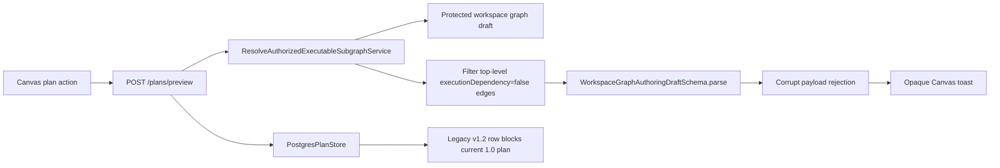

# E Canvas Workflow E2E Usability Plan

## User Stories

| ID                             | Story                                                                                                                                               | Acceptance                                                                                                                                             |
| ------------------------------ | --------------------------------------------------------------------------------------------------------------------------------------------------- | ------------------------------------------------------------------------------------------------------------------------------------------------------ |
| `E-CANVAS-WORKFLOW-PLAN-US`    | As a demanding analytics user, I can create a real workflow plan from the active Canvas without receiving opaque protected-draft errors.            | Reference-only Canvas edges do not corrupt multi-canvas executable-subgraph resolution; plan failures expose actionable user-facing causes.            |
| `E-CANVAS-WORKFLOW-STORE-US`   | As a demanding analytics user on a no-bypass dev stack, stale pre-alpha persisted plans do not block current plan creation after a schema hard-cut. | Plan-store migration removes legacy `schemaVersion = v1.2` rows before current `schemaVersion = 1.0` plans are stored for the same canonical `planId`. |
| `E-CANVAS-WORKFLOW-PROPS-US`   | As a demanding analytics user, I can inspect and edit dbt and SQL node properties, and see those changes reflected in graph and code surfaces.      | Edited dbt source/model and SQL transform properties persist through the protected draft and generated workspace files.                                |
| `E-CANVAS-WORKFLOW-SOURCES-US` | As a demanding analytics user, I can connect workflow nodes to real imported source metadata.                                                       | Source import uses governed workspace source rails and graph nodes can be connected without hidden fixture authority.                                  |
| `E-CANVAS-WORKFLOW-RUN-US`     | As a demanding analytics user, I can create a plan, verify plan details, start an execution, and inspect execution status/events.                   | `PreviewExecutablePlan` and `StartRun` succeed on the no-bypass dev stack for an executable authored graph.                                            |
| `E-CANVAS-WORKFLOW-QA-US`      | As architect-developer reviewer, I can prove the route is usable end to end.                                                                        | Browser validation covers graph, code, source import, plan, run, and error-state readability on the real local stack.                                  |

## Think-First Analysis

Problem summary: the Canvas route is visible but the user sees an opaque toast:
`Protected workspace graph draft payload failed semantic validation.` The graph
itself renders, so the screen gives no clear explanation of what action failed or
what must be fixed.

Root cause: the protected executable-subgraph resolver intentionally filters
authoring edges marked `executionDependency: false` before deriving execution
closure. The current implementation filters only the top-level draft edges. In a
multi-canvas draft, the active canvas workspace still contains the reference-only
edge, so the filtered top-level graph no longer mirrors the active canvas. The
contract parser rejects that internally-mutated shape, and the API reports a
corrupt payload even though the persisted draft is valid.

Second root cause found during browser validation: after the resolver fix,
`POST /plans/preview` reaches the plan store but fails with
`PLAN_STORE_CONFLICT`. The local no-bypass database contains a valid row for the
same canonical `planId` with legacy `schemaVersion = v1.2`. The active
pre-alpha hard-cut emits `schemaVersion = 1.0`; because `stored_plans.plan_id`
is tenant-neutral and primary-keyed by canonical plan core, the old row blocks
current plan creation. This is not a user-data conflict; it is a missing
hard-cut migration path for stale pre-alpha plan rows.

Additional root causes found by the demanding-user E2E loop:

- The local Temporal worker polled the base queue while the protected API
  scheduled tenant runs on the tenant queue.
- SQL-first execution steps reached Temporal, but the worker only had DBT step
  activity wiring.
- The Temporal step validator rejected canonical `retryPolicy` metadata.
- The authored default SQL used `public.source_1`, but the no-bypass local stack
  did not seed that real source relation or advertise it through the warehouse
  source catalog.
- Local protected-runtime auth did not grant source-import/plugin scopes, so
  DataObject Registry could not become available from the real route.
- Partial node selection made the transformation planner validate a one-node
  scope instead of the valid three-node workspace graph.
- Run detail showed materialization evidence below plan provenance, hiding the
  most important post-run verification on laptop-sized viewports.

Constraints and invariants:

- `docs/architecture/command-query-rail-governance.md` requires this work to
  reuse existing rails: `GetWorkspaceGraphDraft`, `SaveWorkspaceGraphDraft`,
  `PreviewExecutablePlan`, `StartRun`, workspace files, and warehouse source
  import rails.
- `docs/architecture/fowler-opportunity-planning-governance.md` requires root
  cause and test coverage before implementation.
- `docs/contracts/planner/workspace-graph-draft-persistence-v1.md` and
  `WorkspaceGraphAuthoringDraft` keep the protected draft as the authoritative
  editable aggregate.
- ADR-0035 governs planner public contract evolution; this slice must not change
  planner contracts to mask a runtime projection bug.
- `docs/planning/proposals/mandatory/runtime-and-contracts/execution-plan-prealpha-schema-version-hardcut-plan-20260601.md`
  declares `schemaVersion = v1.2` unsupported after the hard-cut.
- Local dev proof data may seed real Postgres relations and workspace catalog
  metadata, but it must not introduce fake execution adapters or bypass
  authorization.
- `AGENTS.md` forbids bypasses, fake adapters, stub flows, and hidden debt.

Options considered:

- Remove reference-only edge filtering. Rejected: it would make visual/reference
  authoring edges execution dependencies.
- Catch the parse error and show better copy only. Rejected: it masks the
  resolver producing an invalid internal draft shape.
- Filter reference-only edges consistently across the active multi-canvas
  workspace before planner derivation. Selected: it fixes the root cause within
  the executable-subgraph projection boundary and preserves the draft contract.
- Manually delete the stale `v1.2` row from the local DB. Rejected: it would make
  this workstation work while leaving the no-bypass dev stack broken for the
  next stale database.
- Add a plan-store migration that prunes pre-alpha `v1.2` plan records before
  the current store writes `1.0`. Selected: it implements the accepted hard-cut
  posture and prevents the same E2E failure from recurring.
- Add local proof source data/catalog and grant source-import scopes. Selected:
  this makes the real source-import rails usable without frontend fixtures.
- Wire SQL-first Postgres step activities into the worker. Selected: it makes
  the plan created by Canvas executable on the no-bypass Temporal stack.
- Move completed-run materialization evidence above plan provenance. Selected:
  it aligns the run detail with the user's verification task.

Selected option and rationale: normalize the execution-dependency projection so
top-level and active-canvas graph shapes remain mirrored after edge filtering,
prune legacy `v1.2` persisted plan rows during plan-store migration, align the
local source/import/runtime proof stack, then run the plan path against the real
local stack. Subsequent usability fixes must be driven by the demanding-user E2E
checklist and implemented through existing rails.

Rejected alternatives: UI-only error suppression, contract relaxation, changing
persisted draft data, or bypassing source/plan/run rails.

## Current-State Diagram



## Solution Diagram

```mermaid
flowchart LR
    UI[Canvas plan action] --> Preview[PreviewExecutablePlan rail]
    Preview --> Resolver[Executable-subgraph resolver]
    Resolver --> Draft[Protected workspace graph draft]
    Draft --> Projection[Execution-dependency draft projection]
    Projection --> Top[Filtered top-level graph]
    Projection --> Active[Filtered active canvas workspace]
    Top --> Planner[Planner deriveExecutableSubgraph]
    Active --> Planner
    Planner --> Store[Plan-store migration prunes v1.2 rows]
    Store --> Plan[Persisted current 1.0 plan or actionable rejection]
    Plan --> Worker[Temporal worker tenant queue]
    Worker --> Postgres[SQL-first Postgres activities]
    Postgres --> Evidence[Completed run materialization evidence]
```



## Fowler Opportunity Matrix

| Scenario                                                                                  | Opportunity                               | Fowler pattern                               | DDD owner                                          | Command/query rail                                                    | Implementation surfaces                                                   | Unit or package test                                    | Architecture/user-flow test          | Out of scope                   |
| ----------------------------------------------------------------------------------------- | ----------------------------------------- | -------------------------------------------- | -------------------------------------------------- | --------------------------------------------------------------------- | ------------------------------------------------------------------------- | ------------------------------------------------------- | ------------------------------------ | ------------------------------ |
| Multi-canvas reference-only edge turns a valid draft into an invalid internal projection. | Boundary drift, hidden authority          | Projection mapper behind service boundary    | WorkspaceGraphAuthoringDraft executable projection | `PreviewExecutablePlan`, `StartRun`                                   | `resolveAuthorizedExecutableSubgraph.ts`, focused API test                | `resolveAuthorizedExecutableSubgraph.test.ts`           | Browser plan flow on `/canvas`       | Contract version change        |
| Legacy `v1.2` stored plan blocks current `1.0` plan for the same canonical `planId`.      | Documentation drift, hidden authority     | Schema migration / hard-cut cleanup          | Postgres stored plan artifact                      | `PreviewExecutablePlan`, `StartRun`, `ValidateExecutionPlanAdmission` | `PostgresPlanStore` schema manager and SQL                                | `PostgresPlanStore.records-core.integration.test.ts`    | Browser plan flow on `/canvas`       | Multi-version compatibility    |
| Plan failure copy does not tell the user what happened.                                   | Primitive obsession, test-only confidence | Error translation / presentation model       | Canvas route feedback                              | Existing plan preview rail                                            | Web plan action/copy surfaces if still failing after resolver fix         | Focused web test if copy changes                        | Browser screenshot and console check | Global notification redesign   |
| User needs graph-code-property parity for dbt and SQL nodes.                              | Responsibility overload                   | Presentation model + command adapter         | Canvas node authoring draft                        | `SaveWorkspaceGraphDraft`, workspace files                            | Existing Canvas property/code tests plus new focused tests if gaps appear | `transformationGraphValidation.test.ts`                 | Browser graph/code/property loop     | New plugin runtime             |
| User needs source import, plan, run, and inspect status as one usable flow.               | Hidden authority                          | Gateway-backed E2E workflow                  | Protected runtime rails                            | Source import, plan preview, start run, run status/events             | Existing API/web focused tests plus E2E proof                             | `canvas-preview-run-live.cy.ts`                         | Browser E2E on real stack            | External warehouse credentials |
| Local stack cannot prove source import or SQL execution without real seed data.           | Fixture leakage risk                      | Dev proof data as infrastructure composition | Local protected runtime                            | Source import, workspace files, run worker                            | `run-dev-stack` scripts and tests                                         | `run-dev-stack.test.cjs`, `run-dev-stack.auth.test.cjs` | Cypress live proof                   | Production seed behavior       |

## Pre-Implementation Brief

- Mode: Full.
- Scope: fix the current protected-draft semantic validation blocker, then use a
  demanding-user and architect-developer loop to verify the real Canvas workflow,
  including the plan-store hard-cut migration needed for the no-bypass stack, and
  add focused fixes only where evidence shows a failing DoD item.
- Expected outcome: the active Canvas can create a real plan from a dbt or SQL
  workflow on the no-bypass local stack, with understandable failure states.
- Risks and mitigations:
  - Multi-canvas contract invariants are strict: add a regression test that
    fails before the projection fix.
  - Adapter-store and Temporal adapter changes trigger ARC-2: add evidence and
    risk updates before PR closeout.
  - E2E runtime is slow: use focused tests first, then browser validation.
  - Broad feature request can expand silently: each additional fix must map to
    one story and one rail in this plan.
- Out of scope: new contract versions, external warehouse credentials, fake
  execution adapters, and bypass/degraded startup modes.
- Validation plan:
  - `pnpm docs:feature-mechanization -- --feature E-CANVAS-WORKFLOW-E2E-USABILITY-20260601`
  - `pnpm --filter dvt-api test -- test/application/services/resolveAuthorizedExecutableSubgraph.test.ts`
  - `pnpm --filter @dvt/adapter-postgres test -- PostgresPlanStore.records-core.integration.test.ts`
  - focused web tests for edited Canvas/run surfaces
  - live Cypress validation on `http://127.0.0.1:5173/canvas`
  - `pnpm docs:sync`
  - `pnpm docs:status:generate` if source files are added or removed
  - package lint/typecheck for touched scopes
  - `pnpm verify:prepush`

## Feature Mechanization

```feature-mechanization
version: 1
featureId: E-CANVAS-WORKFLOW-E2E-USABILITY-20260601
mechanizationStatus: implemented
noHumanDecisionsRemaining: true
implementationPlan: docs/planning/proposals/mandatory/frontend-and-ux/e-canvas-workflow-e2e-usability-plan-20260601.md
componentGuides:
  - docs/architecture/command-query-rail-governance.md
  - docs/architecture/fowler-opportunity-planning-governance.md
  - docs/contracts/planner/workspace-graph-draft-persistence-v1.md
  - docs/architecture/components/web/graph/canvas-inspector-authoring-component.md
  - docs/architecture/components/web/graph/canvas-authoring-draft-boundary-component.md
userStories:
  - E-CANVAS-WORKFLOW-PLAN-US
  - E-CANVAS-WORKFLOW-STORE-US
  - E-CANVAS-WORKFLOW-PROPS-US
  - E-CANVAS-WORKFLOW-SOURCES-US
  - E-CANVAS-WORKFLOW-RUN-US
  - E-CANVAS-WORKFLOW-QA-US
governingSources:
  - AGENTS.md
  - docs/planning/status/governance-document-rule-inventory.md
  - docs/guides/ai-work-protocol.md
  - docs/architecture/command-query-rail-governance.md
  - docs/architecture/fowler-opportunity-planning-governance.md
  - docs/contracts/planner/workspace-graph-draft-persistence-v1.md
  - docs/planning/proposals/mandatory/runtime-and-contracts/execution-plan-prealpha-schema-version-hardcut-plan-20260601.md
  - apps/api/docs/executable-subgraph-resolution-component.md
allowedImplementationSurfaces:
  - docs/planning/proposals/mandatory/frontend-and-ux/e-canvas-workflow-e2e-usability-plan-20260601.md
  - docs/planning/proposals/index.md
  - docs/planning/proposals/mandatory/frontend-and-ux/index.md
  - docs/**/index.md
  - docs/.manifest.json
  - docs/evidence/**
  - docs/risk-register/quality/**
  - apps/api/src/application/services/resolveAuthorizedExecutableSubgraph.ts
  - apps/api/test/application/services/resolveAuthorizedExecutableSubgraph.test.ts
  - packages/@dvt/adapter-postgres/src/PostgresPlanStore.sql.ts
  - packages/@dvt/adapter-postgres/src/PostgresPlanStore.schema-manager.ts
  - packages/@dvt/adapter-postgres/src/PostgresPlanStore.ts
  - packages/@dvt/adapter-postgres/src/PostgresPlanStore.mappers.ts
  - packages/@dvt/adapter-postgres/test/PostgresPlanStore.lifecycle.integration.test.ts
  - packages/@dvt/adapter-postgres/test/PostgresPlanStore.records-core.integration.test.ts
  - packages/@dvt/adapter-temporal/src/activities/stepActivityValidation.ts
  - packages/@dvt/adapter-temporal/test/activities.test.ts
  - apps/temporal-worker/src/runtime/**
  - apps/temporal-worker/test/runtime/createTemporalWorkerRuntime.test.ts
  - scripts/run-dev-stack.cjs
  - scripts/run-dev-stack.auth.cjs
  - scripts/run-dev-stack.auth.test.cjs
  - scripts/run-dev-stack.temporal.cjs
  - scripts/run-dev-stack.test.cjs
  - apps/web/src/app/views/canvas/**
  - apps/web/src/app/views/CodeView.tsx
  - apps/web/src/app/views/CodeView.test.tsx
  - apps/web/src/app/views/code/**
  - apps/web/src/app/views/runs/RunWorkspaceStateView.tsx
  - apps/web/src/app/components/**
  - apps/web/src/app/services/workspace/**
  - apps/web/cypress/e2e/canvas/**
  - apps/web/cypress/support/**
forbiddenImplementationSurfaces:
  - specs/contracts/**
  - apps/api/src/entrypoints/http/**
  - apps/api/src/infrastructure/temporal/**
  - apps/web/src/app/plugins/**/runtime/**
commandQueryRails:
  - name: GetWorkspaceGraphDraft
    type: query
    dddOwner: Workspace draft read model
  - name: SaveWorkspaceGraphDraft
    type: command
    dddOwner: Workspace draft aggregate
  - name: PreviewExecutablePlan
    type: command
    dddOwner: Executable plan draft
  - name: StartRun
    type: command
    dddOwner: Run command admission
  - name: ValidateExecutionPlanAdmission
    type: query
    dddOwner: ExecutionPlanAdmissionPair
  - name: ListWarehouseConnections
    type: query
    dddOwner: Warehouse connection catalog read model
  - name: ListWarehouseConnectionTables
    type: query
    dddOwner: Warehouse table catalog read model
  - name: ImportWarehouseSources
    type: command
    dddOwner: Source registration aggregate
  - name: GetWorkspaceFileContent
    type: query
    dddOwner: Workspace file read model
  - name: SaveWorkspaceFileContent
    type: command
    dddOwner: Workspace file aggregate
  - name: GetRunSnapshot
    type: query
    dddOwner: Run snapshot read model
  - name: ListRunEvents
    type: query
    dddOwner: Run timeline read model
domainObjects:
  - name: WorkspaceGraphAuthoringDraft
    type: aggregate
    owner: Workspace graph drafting
  - name: ExecutableSubgraph
    type: read model
    owner: Planner boundary
  - name: Canvas node properties
    type: presentation model
    owner: Web Canvas
  - name: StoredPlanArtifact
    type: persisted artifact
    owner: Postgres plan store
  - name: TemporalWorkerStepCapability
    type: runtime capability
    owner: Temporal worker
  - name: WarehouseConnectionCatalog
    type: read model
    owner: Source import
  - name: RunMaterializationEvidence
    type: read model
    owner: Run detail
  - name: CodeGraphFileScope
    type: read model
    owner: Web Code
fowlerSignals:
  - Reference-only Canvas edges were being interpreted through an inconsistent execution projection.
  - Opaque protected-draft errors created test-only confidence instead of user-operable feedback.
  - The E2E workflow must prove graph, code, plan, and run rails together.
  - Legacy v1.2 persisted plan rows must not keep current 1.0 plan creation unusable.
  - Real source import and SQL execution require local proof data, catalog, and authorization to line up.
  - Completed-run evidence must be visible before lower-priority provenance.
  - Code file browsing must follow the active graph instead of stale workspace artifacts.
architectureGuards:
  - pnpm --filter dvt-api test -- test/application/services/resolveAuthorizedExecutableSubgraph.test.ts
  - pnpm --filter @dvt/adapter-postgres test -- PostgresPlanStore.lifecycle.integration.test.ts PostgresPlanStore.records-core.integration.test.ts
  - pnpm --filter @dvt/adapter-temporal test -- test/activities.test.ts
  - pnpm --filter dvt-temporal-worker test -- test/runtime/createTemporalWorkerRuntime.test.ts
  - node --test scripts/run-dev-stack.test.cjs scripts/run-dev-stack.auth.test.cjs
  - pnpm --filter @dvt/web test -- src/app/views/code/codeViewFileSelection.test.ts src/app/views/CodeView.test.tsx
  - pnpm docs:feature-mechanization:implementation
cypressFlows:
  - apps/web/cypress/e2e/canvas/canvas-preview-run-live.cy.ts
  - apps/web/cypress/e2e/canvas/code-workbench-workspace-files.cy.ts
completionGate:
  - pnpm docs:sync
  - pnpm docs:status:generate
  - pnpm --filter dvt-api test -- test/application/services/resolveAuthorizedExecutableSubgraph.test.ts
  - pnpm --filter @dvt/adapter-postgres test -- PostgresPlanStore.lifecycle.integration.test.ts PostgresPlanStore.records-core.integration.test.ts
  - pnpm --filter @dvt/adapter-temporal test -- test/activities.test.ts
  - pnpm --filter dvt-temporal-worker test -- test/runtime/createTemporalWorkerRuntime.test.ts
  - pnpm --filter @dvt/web test -- src/app/views/canvas/transformationGraphValidation.test.ts src/app/views/canvas/useCanvasExecutionActions.planPreview.core.test.tsx src/app/views/runs/RunStates.test.tsx
  - pnpm --filter @dvt/web test -- src/app/views/code/codeViewFileSelection.test.ts src/app/views/CodeView.test.tsx
  - pnpm --filter @dvt/web test
  - node --test scripts/run-dev-stack.test.cjs scripts/run-dev-stack.auth.test.cjs
  - pnpm --dir apps/web exec cypress run --config-file cypress.config.ts --config baseUrl=http://127.0.0.1:5173 --spec cypress/e2e/canvas/canvas-preview-run-live.cy.ts --browser electron
  - pnpm --filter @dvt/web exec cypress run --config-file cypress.config.ts --config baseUrl=http://127.0.0.1:5173 --spec cypress/e2e/canvas/code-workbench-workspace-files.cy.ts --browser electron
  - pnpm --filter dvt-api typecheck
  - pnpm --filter dvt-api lint
  - pnpm --filter @dvt/web typecheck
  - pnpm --filter @dvt/web lint
  - pnpm --filter @dvt/adapter-postgres typecheck
  - pnpm --filter @dvt/adapter-temporal typecheck
  - pnpm --filter dvt-temporal-worker typecheck
  - pnpm verify:prepush
redGreenCycles:
  - id: multicanvas-reference-edge-executable-projection
    redTest: pnpm --filter dvt-api test -- test/application/services/resolveAuthorizedExecutableSubgraph.test.ts
    expectedFailure: A valid multi-canvas draft with an active reference-only edge is rejected as workspace_graph_draft_corrupt_payload.
    patchSurfaces:
      - apps/api/src/application/services/resolveAuthorizedExecutableSubgraph.ts
      - apps/api/test/application/services/resolveAuthorizedExecutableSubgraph.test.ts
    greenTest: pnpm --filter dvt-api test -- test/application/services/resolveAuthorizedExecutableSubgraph.test.ts
  - id: prune-legacy-plan-schema-store-rows
    redTest: pnpm --filter @dvt/adapter-postgres test -- PostgresPlanStore.records-core.integration.test.ts
    expectedFailure: A legacy v1.2 stored plan remains after migrate and blocks storing the current 1.0 plan for the same planId.
    patchSurfaces:
      - packages/@dvt/adapter-postgres/src/PostgresPlanStore.sql.ts
      - packages/@dvt/adapter-postgres/src/PostgresPlanStore.schema-manager.ts
      - packages/@dvt/adapter-postgres/test/PostgresPlanStore.records-core.integration.test.ts
    greenTest: pnpm --filter @dvt/adapter-postgres test -- PostgresPlanStore.records-core.integration.test.ts
  - id: run-plan-record-created-at-idempotency
    redTest: pnpm --filter @dvt/adapter-postgres test -- PostgresPlanStore.lifecycle.integration.test.ts
    expectedFailure: A replayed plan with only metadata.createdAtIso drift raises PLAN_RECORD_CONFLICT.
    patchSurfaces:
      - packages/@dvt/adapter-postgres/src/PostgresPlanStore.ts
      - packages/@dvt/adapter-postgres/src/PostgresPlanStore.mappers.ts
      - packages/@dvt/adapter-postgres/test/PostgresPlanStore.lifecycle.integration.test.ts
    greenTest: pnpm --filter @dvt/adapter-postgres test -- PostgresPlanStore.lifecycle.integration.test.ts
  - id: temporal-sql-first-worker-runtime
    redTest: pnpm --filter dvt-temporal-worker test -- test/runtime/createTemporalWorkerRuntime.test.ts
    expectedFailure: SQL-first Postgres step kinds are unsupported when DBT is disabled.
    patchSurfaces:
      - apps/temporal-worker/src/runtime/temporalWorkerPostgresProfile.ts
      - apps/temporal-worker/src/runtime/temporalWorkerRuntimeResources.ts
      - apps/temporal-worker/test/runtime/createTemporalWorkerRuntime.test.ts
    greenTest: pnpm --filter dvt-temporal-worker test -- test/runtime/createTemporalWorkerRuntime.test.ts
  - id: local-source-import-proof-stack
    redTest: node --test scripts/run-dev-stack.test.cjs scripts/run-dev-stack.auth.test.cjs
    expectedFailure: The local stack has no source relation/catalog and no source-import authorization scopes.
    patchSurfaces:
      - scripts/run-dev-stack.cjs
      - scripts/run-dev-stack.auth.cjs
      - scripts/run-dev-stack.test.cjs
      - scripts/run-dev-stack.auth.test.cjs
    greenTest: node --test scripts/run-dev-stack.test.cjs scripts/run-dev-stack.auth.test.cjs
  - id: canvas-live-sql-run-and-source-import
    redTest: pnpm --dir apps/web exec cypress run --config-file cypress.config.ts --config baseUrl=http://127.0.0.1:5173 --spec cypress/e2e/canvas/canvas-preview-run-live.cy.ts --browser electron
    expectedFailure: The live route cannot complete a SQL-first run or import seeded warehouse metadata.
    patchSurfaces:
      - apps/web/cypress/e2e/canvas/canvas-preview-run-live.cy.ts
      - apps/web/cypress/support/liveProtectedRuntime.ts
      - apps/web/src/app/views/runs/RunWorkspaceStateView.tsx
    greenTest: pnpm --dir apps/web exec cypress run --config-file cypress.config.ts --config baseUrl=http://127.0.0.1:5173 --spec cypress/e2e/canvas/canvas-preview-run-live.cy.ts --browser electron
  - id: code-route-graph-file-scope
    redTest: pnpm --filter @dvt/web test -- src/app/views/code/codeViewFileSelection.test.ts src/app/views/CodeView.test.tsx
    expectedFailure: Code exposes persisted dbt files that are not part of the active graph and can open stale model SQL.
    patchSurfaces:
      - apps/web/src/app/views/CodeView.tsx
      - apps/web/src/app/views/CodeView.test.tsx
      - apps/web/src/app/views/code/codeViewFileSelection.ts
      - apps/web/src/app/views/code/codeViewFileSelection.test.ts
    greenTest: pnpm --filter @dvt/web test -- src/app/views/code/codeViewFileSelection.test.ts src/app/views/CodeView.test.tsx
symbols:
  - name: ResolveAuthorizedExecutableSubgraphService
    path: apps/api/src/application/services/resolveAuthorizedExecutableSubgraph.ts
    dddOwner: ExecutableSubgraph
    cqRails: [PreviewExecutablePlan, StartRun]
    fowlerSignals: [Reference-only Canvas edges require a consistent execution projection.]
    architectureGuard: pnpm --filter dvt-api test -- test/application/services/resolveAuthorizedExecutableSubgraph.test.ts
    cypressCoverage: apps/web/cypress/e2e/canvas/canvas-preview-run-persisted.cy.ts
    unitTests:
      - apps/api/test/application/services/resolveAuthorizedExecutableSubgraph.test.ts
  - name: PostgresPlanStoreSchemaManager
    path: packages/@dvt/adapter-postgres/src/PostgresPlanStore.schema-manager.ts
    dddOwner: StoredPlanArtifact
    cqRails: [PreviewExecutablePlan, StartRun, ValidateExecutionPlanAdmission]
    fowlerSignals: [Legacy v1.2 persisted rows must be pruned after the hard-cut.]
    architectureGuard: pnpm --filter @dvt/adapter-postgres test -- PostgresPlanStore.records-core.integration.test.ts
    cypressCoverage: apps/web/cypress/e2e/canvas/canvas-preview-run-persisted.cy.ts
    unitTests:
      - packages/@dvt/adapter-postgres/test/PostgresPlanStore.records-core.integration.test.ts
  - name: createTemporalWorkerPostgresProfile
    path: apps/temporal-worker/src/runtime/temporalWorkerPostgresProfile.ts
    dddOwner: TemporalWorkerStepCapability
    cqRails: [StartRun]
    fowlerSignals: [SQL-first plans must execute through real worker activity wiring.]
    architectureGuard: pnpm --filter dvt-temporal-worker test -- test/runtime/createTemporalWorkerRuntime.test.ts
    cypressCoverage: apps/web/cypress/e2e/canvas/canvas-preview-run-live.cy.ts
    unitTests:
      - apps/temporal-worker/test/runtime/createTemporalWorkerRuntime.test.ts
  - name: buildLocalWarehouseConnectionCatalog
    path: scripts/run-dev-stack.cjs
    dddOwner: WarehouseConnectionCatalog
    cqRails: [ListWarehouseConnections, ListWarehouseConnectionTables, ImportWarehouseSources]
    fowlerSignals: [Local proof stack needs real source metadata without bypassing API rails.]
    architectureGuard: node --test scripts/run-dev-stack.test.cjs scripts/run-dev-stack.auth.test.cjs
    cypressCoverage: apps/web/cypress/e2e/canvas/canvas-preview-run-live.cy.ts
    unitTests:
      - scripts/run-dev-stack.test.cjs
      - scripts/run-dev-stack.auth.test.cjs
  - name: RunWorkspaceStateView
    path: apps/web/src/app/views/runs/RunWorkspaceStateView.tsx
    dddOwner: RunMaterializationEvidence
    cqRails: [GetRunSnapshot, ListRunEvents]
    fowlerSignals: [Completed-run materialization evidence must be visible before lower-priority provenance.]
    architectureGuard: pnpm --filter @dvt/web test -- src/app/views/runs/RunStates.test.tsx
    cypressCoverage: apps/web/cypress/e2e/canvas/canvas-preview-run-live.cy.ts
    unitTests:
      - apps/web/src/app/views/runs/RunStates.test.tsx
  - name: TemporalWorkerStepCapability
    path: apps/temporal-worker/src/runtime/runtimeTypes.ts
    dddOwner: TemporalWorkerStepCapability
    cqRails: [StartRun]
    fowlerSignals: [SQL-first step activities need explicit runtime capability ownership.]
    architectureGuard: pnpm --filter dvt-temporal-worker test -- test/runtime/createTemporalWorkerRuntime.test.ts
    cypressCoverage: apps/web/cypress/e2e/canvas/canvas-preview-run-live.cy.ts
    unitTests:
      - apps/temporal-worker/test/runtime/createTemporalWorkerRuntime.test.ts
  - name: POSTGRES_RELATIONAL_PLUGIN_ID
    path: apps/temporal-worker/src/runtime/temporalWorkerPostgresProfile.ts
    dddOwner: TemporalWorkerStepCapability
    cqRails: [StartRun]
    fowlerSignals: [SQL-first Postgres execution is a named worker capability.]
    architectureGuard: pnpm --filter dvt-temporal-worker test -- test/runtime/createTemporalWorkerRuntime.test.ts
    cypressCoverage: apps/web/cypress/e2e/canvas/canvas-preview-run-live.cy.ts
    unitTests:
      - apps/temporal-worker/test/runtime/createTemporalWorkerRuntime.test.ts
  - name: TemporalWorkerPostgresProfile
    path: apps/temporal-worker/src/runtime/temporalWorkerPostgresProfile.ts
    dddOwner: TemporalWorkerStepCapability
    cqRails: [StartRun]
    fowlerSignals: [SQL-first Postgres execution is a named worker capability.]
    architectureGuard: pnpm --filter dvt-temporal-worker test -- test/runtime/createTemporalWorkerRuntime.test.ts
    cypressCoverage: apps/web/cypress/e2e/canvas/canvas-preview-run-live.cy.ts
    unitTests:
      - apps/temporal-worker/test/runtime/createTemporalWorkerRuntime.test.ts
  - name: createDefaultPostgresRelationalCapability
    path: apps/temporal-worker/src/runtime/temporalWorkerPostgresProfile.ts
    dddOwner: TemporalWorkerStepCapability
    cqRails: [StartRun]
    fowlerSignals: [SQL-first Postgres execution is wired without DBT fallback.]
    architectureGuard: pnpm --filter dvt-temporal-worker test -- test/runtime/createTemporalWorkerRuntime.test.ts
    cypressCoverage: apps/web/cypress/e2e/canvas/canvas-preview-run-live.cy.ts
    unitTests:
      - apps/temporal-worker/test/runtime/createTemporalWorkerRuntime.test.ts
  - name: TRANSFORMATION_REQUIRED_NODE_COUNT
    path: apps/web/src/app/views/canvas/transformationGraphValidation.types.ts
    dddOwner: Canvas node properties
    cqRails: [PreviewExecutablePlan]
    fowlerSignals: [Partial edit selection must not shrink a valid workflow scope.]
    architectureGuard: pnpm --filter @dvt/web test -- src/app/views/canvas/transformationGraphValidation.test.ts
    cypressCoverage: apps/web/cypress/e2e/canvas/canvas-preview-run-live.cy.ts
    unitTests:
      - apps/web/src/app/views/canvas/transformationGraphValidation.test.ts
  - name: CODE_GRAPH_FILE_SCOPE_VIEW_ID
    path: apps/web/src/app/views/CodeView.tsx
    dddOwner: CodeGraphFileScope
    cqRails: [GetWorkspaceGraphDraft]
    fowlerSignals: [Code file browsing must use a stable graph-snapshot query identity.]
    architectureGuard: pnpm --filter @dvt/web test -- src/app/views/CodeView.test.tsx
    cypressCoverage: apps/web/cypress/e2e/canvas/code-workbench-workspace-files.cy.ts
    unitTests:
      - apps/web/src/app/views/CodeView.test.tsx
  - name: MODEL_ARTIFACT_PATH_PATTERN
    path: apps/web/src/app/views/code/codeViewFileSelection.ts
    dddOwner: CodeGraphFileScope
    cqRails: [GetWorkspaceFileContent]
    fowlerSignals: [Code should prefer graph model SQL over project configuration when no workflow artifact exists.]
    architectureGuard: pnpm --filter @dvt/web test -- src/app/views/code/codeViewFileSelection.test.ts
    cypressCoverage: apps/web/cypress/e2e/canvas/code-workbench-workspace-files.cy.ts
    unitTests:
      - apps/web/src/app/views/code/codeViewFileSelection.test.ts
  - name: DEFAULT_TRANSFORMATION_WORKFLOW_ARTIFACT_PATH
    path: apps/web/src/app/views/code/codeViewFileSelection.ts
    dddOwner: CodeGraphFileScope
    cqRails: [GetWorkspaceGraphDraft, GetWorkspaceFileContent]
    fowlerSignals: [Transformation canvases need a deterministic workflow artifact in Code.]
    architectureGuard: pnpm --filter @dvt/web test -- src/app/views/code/codeViewFileSelection.test.ts
    cypressCoverage: apps/web/cypress/e2e/canvas/code-workbench-workspace-files.cy.ts
    unitTests:
      - apps/web/src/app/views/code/codeViewFileSelection.test.ts
  - name: DBT_PROJECT_FILE_PATH
    path: apps/web/src/app/views/code/codeViewFileSelection.ts
    dddOwner: CodeGraphFileScope
    cqRails: [GetWorkspaceGraphDraft, GetWorkspaceFileContent]
    fowlerSignals: [DBT graph scope includes project configuration without making it the primary model code.]
    architectureGuard: pnpm --filter @dvt/web test -- src/app/views/code/codeViewFileSelection.test.ts
    cypressCoverage: apps/web/cypress/e2e/canvas/code-workbench-workspace-files.cy.ts
    unitTests:
      - apps/web/src/app/views/code/codeViewFileSelection.test.ts
  - name: DBT_SCHEMA_FILE_PATH
    path: apps/web/src/app/views/code/codeViewFileSelection.ts
    dddOwner: CodeGraphFileScope
    cqRails: [GetWorkspaceGraphDraft, GetWorkspaceFileContent]
    fowlerSignals: [DBT graph scope includes schema metadata beside generated model code.]
    architectureGuard: pnpm --filter @dvt/web test -- src/app/views/code/codeViewFileSelection.test.ts
    cypressCoverage: apps/web/cypress/e2e/canvas/code-workbench-workspace-files.cy.ts
    unitTests:
      - apps/web/src/app/views/code/codeViewFileSelection.test.ts
  - name: isModelArtifactFile
    path: apps/web/src/app/views/code/codeViewFileSelection.ts
    dddOwner: CodeGraphFileScope
    cqRails: [GetWorkspaceFileContent]
    fowlerSignals: [Code should select graph model SQL before lower-priority config files.]
    architectureGuard: pnpm --filter @dvt/web test -- src/app/views/code/codeViewFileSelection.test.ts
    cypressCoverage: apps/web/cypress/e2e/canvas/code-workbench-workspace-files.cy.ts
    unitTests:
      - apps/web/src/app/views/code/codeViewFileSelection.test.ts
  - name: normalizeIdentifier
    path: apps/web/src/app/views/code/codeViewFileSelection.ts
    dddOwner: CodeGraphFileScope
    cqRails: [GetWorkspaceGraphDraft, GetWorkspaceFileContent]
    fowlerSignals: [DBT model file identity must follow the current graph node name.]
    architectureGuard: pnpm --filter @dvt/web test -- src/app/views/code/codeViewFileSelection.test.ts
    cypressCoverage: apps/web/cypress/e2e/canvas/code-workbench-workspace-files.cy.ts
    unitTests:
      - apps/web/src/app/views/code/codeViewFileSelection.test.ts
  - name: addNonEmptyPath
    path: apps/web/src/app/views/code/codeViewFileSelection.ts
    dddOwner: CodeGraphFileScope
    cqRails: [GetWorkspaceGraphDraft, GetWorkspaceFileContent]
    fowlerSignals: [Explicit node paths must be preserved when scoping Code files to graph truth.]
    architectureGuard: pnpm --filter @dvt/web test -- src/app/views/code/codeViewFileSelection.test.ts
    cypressCoverage: apps/web/cypress/e2e/canvas/code-workbench-workspace-files.cy.ts
    unitTests:
      - apps/web/src/app/views/code/codeViewFileSelection.test.ts
  - name: isDbtNode
    path: apps/web/src/app/views/code/codeViewFileSelection.ts
    dddOwner: CodeGraphFileScope
    cqRails: [GetWorkspaceGraphDraft]
    fowlerSignals: [DBT and SQL transformation file scopes must not collapse into one artifact rule.]
    architectureGuard: pnpm --filter @dvt/web test -- src/app/views/code/codeViewFileSelection.test.ts
    cypressCoverage: apps/web/cypress/e2e/canvas/code-workbench-workspace-files.cy.ts
    unitTests:
      - apps/web/src/app/views/code/codeViewFileSelection.test.ts
  - name: isDbtModelNode
    path: apps/web/src/app/views/code/codeViewFileSelection.ts
    dddOwner: CodeGraphFileScope
    cqRails: [GetWorkspaceGraphDraft]
    fowlerSignals: [DBT model files are derived from graph model names, not stale node ids.]
    architectureGuard: pnpm --filter @dvt/web test -- src/app/views/code/codeViewFileSelection.test.ts
    cypressCoverage: apps/web/cypress/e2e/canvas/code-workbench-workspace-files.cy.ts
    unitTests:
      - apps/web/src/app/views/code/codeViewFileSelection.test.ts
  - name: isNonDbtModelNode
    path: apps/web/src/app/views/code/codeViewFileSelection.ts
    dddOwner: CodeGraphFileScope
    cqRails: [GetWorkspaceGraphDraft]
    fowlerSignals: [SQL transformation model files are derived from graph node ids.]
    architectureGuard: pnpm --filter @dvt/web test -- src/app/views/code/codeViewFileSelection.test.ts
    cypressCoverage: apps/web/cypress/e2e/canvas/code-workbench-workspace-files.cy.ts
    unitTests:
      - apps/web/src/app/views/code/codeViewFileSelection.test.ts
  - name: addGraphNodeFilePath
    path: apps/web/src/app/views/code/codeViewFileSelection.ts
    dddOwner: CodeGraphFileScope
    cqRails: [GetWorkspaceGraphDraft, GetWorkspaceFileContent]
    fowlerSignals: [Code explorer paths must be derived from active graph nodes.]
    architectureGuard: pnpm --filter @dvt/web test -- src/app/views/code/codeViewFileSelection.test.ts
    cypressCoverage: apps/web/cypress/e2e/canvas/code-workbench-workspace-files.cy.ts
    unitTests:
      - apps/web/src/app/views/code/codeViewFileSelection.test.ts
  - name: deriveCodeGraphFilePaths
    path: apps/web/src/app/views/code/codeViewFileSelection.ts
    dddOwner: CodeGraphFileScope
    cqRails: [GetWorkspaceGraphDraft, GetWorkspaceFileContent]
    fowlerSignals: [Code file browsing must follow the active graph instead of stale workspace artifacts.]
    architectureGuard: pnpm --filter @dvt/web test -- src/app/views/code/codeViewFileSelection.test.ts
    cypressCoverage: apps/web/cypress/e2e/canvas/code-workbench-workspace-files.cy.ts
    unitTests:
      - apps/web/src/app/views/code/codeViewFileSelection.test.ts
  - name: filterCodeWorkspaceFilesByPathScope
    path: apps/web/src/app/views/code/codeViewFileSelection.ts
    dddOwner: CodeGraphFileScope
    cqRails: [GetWorkspaceGraphDraft, GetWorkspaceFileContent]
    fowlerSignals: [Code explorer must hide stale workspace artifacts outside the active graph scope.]
    architectureGuard: pnpm --filter @dvt/web test -- src/app/views/code/codeViewFileSelection.test.ts
    cypressCoverage: apps/web/cypress/e2e/canvas/code-workbench-workspace-files.cy.ts
    unitTests:
      - apps/web/src/app/views/code/codeViewFileSelection.test.ts
  - name: hasCodeWorkspaceFilePath
    path: apps/web/src/app/views/code/codeViewFileSelection.ts
    dddOwner: CodeGraphFileScope
    cqRails: [GetWorkspaceFileContent]
    fowlerSignals: [A stale selected file must not remain active after graph scope changes.]
    architectureGuard: pnpm --filter @dvt/web test -- src/app/views/code/codeViewFileSelection.test.ts src/app/views/CodeView.test.tsx
    cypressCoverage: apps/web/cypress/e2e/canvas/code-workbench-workspace-files.cy.ts
    unitTests:
      - apps/web/src/app/views/code/codeViewFileSelection.test.ts
      - apps/web/src/app/views/CodeView.test.tsx
  - name: resolveGraphScopedCodeWorkspaceFileTree
    path: apps/web/src/app/views/code/codeViewFileSelection.ts
    dddOwner: CodeGraphFileScope
    cqRails: [GetWorkspaceGraphDraft, GetWorkspaceFileContent]
    fowlerSignals: [Code file browsing must follow the active graph instead of stale workspace artifacts.]
    architectureGuard: pnpm --filter @dvt/web test -- src/app/views/code/codeViewFileSelection.test.ts src/app/views/CodeView.test.tsx
    cypressCoverage: apps/web/cypress/e2e/canvas/code-workbench-workspace-files.cy.ts
    unitTests:
      - apps/web/src/app/views/code/codeViewFileSelection.test.ts
      - apps/web/src/app/views/CodeView.test.tsx
  - name: resolveCreatedAtIso
    path: packages/@dvt/adapter-postgres/src/PostgresPlanStore.mappers.ts
    dddOwner: StoredPlanArtifact
    cqRails: [PreviewExecutablePlan, StartRun]
    fowlerSignals: [Created-at drift alone must not make plan replay non-idempotent.]
    architectureGuard: pnpm --filter @dvt/adapter-postgres test -- PostgresPlanStore.lifecycle.integration.test.ts
    cypressCoverage: apps/web/cypress/e2e/canvas/canvas-preview-run-live.cy.ts
    unitTests:
      - packages/@dvt/adapter-postgres/test/PostgresPlanStore.lifecycle.integration.test.ts
  - name: sqlPruneLegacyExecutionPlanSchemaRows
    path: packages/@dvt/adapter-postgres/src/PostgresPlanStore.sql.ts
    dddOwner: StoredPlanArtifact
    cqRails: [PreviewExecutablePlan, StartRun, ValidateExecutionPlanAdmission]
    fowlerSignals: [Legacy v1.2 persisted rows must be pruned after the hard-cut.]
    architectureGuard: pnpm --filter @dvt/adapter-postgres test -- PostgresPlanStore.records-core.integration.test.ts
    cypressCoverage: apps/web/cypress/e2e/canvas/canvas-preview-run-live.cy.ts
    unitTests:
      - packages/@dvt/adapter-postgres/test/PostgresPlanStore.records-core.integration.test.ts
  - name: LOCAL_WAREHOUSE_CATALOG_RELATIVE_PATH
    path: scripts/run-dev-stack.cjs
    dddOwner: WarehouseConnectionCatalog
    cqRails: [ListWarehouseConnections, ListWarehouseConnectionTables]
    fowlerSignals: [Local proof stack needs governed source catalog metadata.]
    architectureGuard: node --test scripts/run-dev-stack.test.cjs
    cypressCoverage: apps/web/cypress/e2e/canvas/canvas-preview-run-live.cy.ts
    unitTests:
      - scripts/run-dev-stack.test.cjs
  - name: buildCoordinatedTemporalWorkerEnv
    path: scripts/run-dev-stack.cjs
    dddOwner: TemporalWorkerStepCapability
    cqRails: [StartRun]
    fowlerSignals: [Worker queue must match tenant-scoped API scheduling.]
    architectureGuard: node --test scripts/run-dev-stack.test.cjs
    cypressCoverage: apps/web/cypress/e2e/canvas/canvas-preview-run-live.cy.ts
    unitTests:
      - scripts/run-dev-stack.test.cjs
  - name: buildLocalPostgresProofSeedSql
    path: scripts/run-dev-stack.cjs
    dddOwner: WarehouseConnectionCatalog
    cqRails: [ListWarehouseConnectionTables, StartRun]
    fowlerSignals: [Local SQL execution needs real source relations.]
    architectureGuard: node --test scripts/run-dev-stack.test.cjs
    cypressCoverage: apps/web/cypress/e2e/canvas/canvas-preview-run-live.cy.ts
    unitTests:
      - scripts/run-dev-stack.test.cjs
  - name: fs
    path: scripts/run-dev-stack.cjs
    dddOwner: WarehouseConnectionCatalog
    cqRails: [ListWarehouseConnections]
    fowlerSignals: [Local source catalog is written as a workspace-owned file.]
    architectureGuard: node --test scripts/run-dev-stack.test.cjs
    cypressCoverage: apps/web/cypress/e2e/canvas/canvas-preview-run-live.cy.ts
    unitTests:
      - scripts/run-dev-stack.test.cjs
  - name: resolveProcessStartupOrder
    path: scripts/run-dev-stack.cjs
    dddOwner: TemporalWorkerStepCapability
    cqRails: [StartRun]
    fowlerSignals: [API build must finish before worker startup to avoid dist-watch port churn.]
    architectureGuard: node --test scripts/run-dev-stack.test.cjs
    cypressCoverage: apps/web/cypress/e2e/canvas/canvas-preview-run-live.cy.ts
    unitTests:
      - scripts/run-dev-stack.test.cjs
  - name: seedLocalPostgresProofData
    path: scripts/run-dev-stack.cjs
    dddOwner: WarehouseConnectionCatalog
    cqRails: [ListWarehouseConnectionTables, StartRun]
    fowlerSignals: [Local SQL execution needs real source relations.]
    architectureGuard: node --test scripts/run-dev-stack.test.cjs
    cypressCoverage: apps/web/cypress/e2e/canvas/canvas-preview-run-live.cy.ts
    unitTests:
      - scripts/run-dev-stack.test.cjs
  - name: seedLocalWorkspaceWarehouseCatalog
    path: scripts/run-dev-stack.cjs
    dddOwner: WarehouseConnectionCatalog
    cqRails: [ListWarehouseConnections, ListWarehouseConnectionTables]
    fowlerSignals: [Local proof stack needs governed source catalog metadata.]
    architectureGuard: node --test scripts/run-dev-stack.test.cjs
    cypressCoverage: apps/web/cypress/e2e/canvas/canvas-preview-run-live.cy.ts
    unitTests:
      - scripts/run-dev-stack.test.cjs
  - name: DEFAULT_LOCAL_PROTECTED_RUNTIME_TENANT_ID
    path: scripts/run-dev-stack.temporal.cjs
    dddOwner: TemporalWorkerStepCapability
    cqRails: [StartRun]
    fowlerSignals: [Worker queue must match tenant-scoped API scheduling.]
    architectureGuard: node --test scripts/run-dev-stack.test.cjs
    cypressCoverage: apps/web/cypress/e2e/canvas/canvas-preview-run-live.cy.ts
    unitTests:
      - scripts/run-dev-stack.test.cjs
  - name: resolveLocalProtectedRuntimeTenantId
    path: scripts/run-dev-stack.temporal.cjs
    dddOwner: TemporalWorkerStepCapability
    cqRails: [StartRun]
    fowlerSignals: [Worker queue must match tenant-scoped API scheduling.]
    architectureGuard: node --test scripts/run-dev-stack.test.cjs
    cypressCoverage: apps/web/cypress/e2e/canvas/canvas-preview-run-live.cy.ts
    unitTests:
      - scripts/run-dev-stack.test.cjs
  - name: toTenantScopedTaskQueue
    path: scripts/run-dev-stack.temporal.cjs
    dddOwner: TemporalWorkerStepCapability
    cqRails: [StartRun]
    fowlerSignals: [Worker queue must match tenant-scoped API scheduling.]
    architectureGuard: node --test scripts/run-dev-stack.test.cjs
    cypressCoverage: apps/web/cypress/e2e/canvas/canvas-preview-run-live.cy.ts
    unitTests:
      - scripts/run-dev-stack.test.cjs
  - name: LiveMaterializationEvidence
    path: apps/web/cypress/e2e/canvas/canvas-preview-run-live.cy.ts
    dddOwner: RunMaterializationEvidence
    cqRails: [GetRunSnapshot]
    fowlerSignals: [Live proof must assert concrete materialization evidence.]
    architectureGuard: pnpm --filter @dvt/web lint
    cypressCoverage: apps/web/cypress/e2e/canvas/canvas-preview-run-live.cy.ts
    unitTests:
      - apps/web/cypress/e2e/canvas/canvas-preview-run-live.cy.ts
  - name: LiveRunEventResponse
    path: apps/web/cypress/e2e/canvas/canvas-preview-run-live.cy.ts
    dddOwner: RunMaterializationEvidence
    cqRails: [ListRunEvents]
    fowlerSignals: [Live proof must assert concrete run timeline events.]
    architectureGuard: pnpm --filter @dvt/web lint
    cypressCoverage: apps/web/cypress/e2e/canvas/canvas-preview-run-live.cy.ts
    unitTests:
      - apps/web/cypress/e2e/canvas/canvas-preview-run-live.cy.ts
  - name: LiveRunSnapshot
    path: apps/web/cypress/e2e/canvas/canvas-preview-run-live.cy.ts
    dddOwner: RunMaterializationEvidence
    cqRails: [GetRunSnapshot]
    fowlerSignals: [Live proof must assert concrete completed snapshots.]
    architectureGuard: pnpm --filter @dvt/web lint
    cypressCoverage: apps/web/cypress/e2e/canvas/canvas-preview-run-live.cy.ts
    unitTests:
      - apps/web/cypress/e2e/canvas/canvas-preview-run-live.cy.ts
  - name: assertCompletedMaterialization
    path: apps/web/cypress/e2e/canvas/canvas-preview-run-live.cy.ts
    dddOwner: RunMaterializationEvidence
    cqRails: [GetRunSnapshot]
    fowlerSignals: [Live proof must assert concrete materialization evidence.]
    architectureGuard: pnpm --filter @dvt/web lint
    cypressCoverage: apps/web/cypress/e2e/canvas/canvas-preview-run-live.cy.ts
    unitTests:
      - apps/web/cypress/e2e/canvas/canvas-preview-run-live.cy.ts
  - name: waitForCompletedLiveRun
    path: apps/web/cypress/e2e/canvas/canvas-preview-run-live.cy.ts
    dddOwner: RunMaterializationEvidence
    cqRails: [GetRunSnapshot]
    fowlerSignals: [Live proof must wait for real completion instead of route navigation only.]
    architectureGuard: pnpm --filter @dvt/web lint
    cypressCoverage: apps/web/cypress/e2e/canvas/canvas-preview-run-live.cy.ts
    unitTests:
      - apps/web/cypress/e2e/canvas/canvas-preview-run-live.cy.ts
  - name: showExplorerPanel
    path: apps/web/cypress/e2e/canvas/canvas-preview-run-live.cy.ts
    dddOwner: WarehouseConnectionCatalog
    cqRails: [ListWarehouseConnections]
    fowlerSignals: [Source import must be reachable through the real Canvas explorer.]
    architectureGuard: pnpm --filter @dvt/web lint
    cypressCoverage: apps/web/cypress/e2e/canvas/canvas-preview-run-live.cy.ts
    unitTests:
      - apps/web/cypress/e2e/canvas/canvas-preview-run-live.cy.ts
  - name: clickWizardNext
    path: apps/web/cypress/e2e/canvas/canvas-preview-run-live.cy.ts
    dddOwner: WarehouseConnectionCatalog
    cqRails: [ImportWarehouseSources]
    fowlerSignals: [Source import must complete through user-facing wizard steps.]
    architectureGuard: pnpm --filter @dvt/web lint
    cypressCoverage: apps/web/cypress/e2e/canvas/canvas-preview-run-live.cy.ts
    unitTests:
      - apps/web/cypress/e2e/canvas/canvas-preview-run-live.cy.ts
  - name: closeRunConsoleIfOpen
    path: apps/web/cypress/e2e/canvas/canvas-preview-run-live.cy.ts
    dddOwner: RunMaterializationEvidence
    cqRails: [GetRunSnapshot]
    fowlerSignals: [Completed evidence must remain inspectable when the console is open.]
    architectureGuard: pnpm --filter @dvt/web lint
    cypressCoverage: apps/web/cypress/e2e/canvas/canvas-preview-run-live.cy.ts
    unitTests:
      - apps/web/cypress/e2e/canvas/canvas-preview-run-live.cy.ts
```
