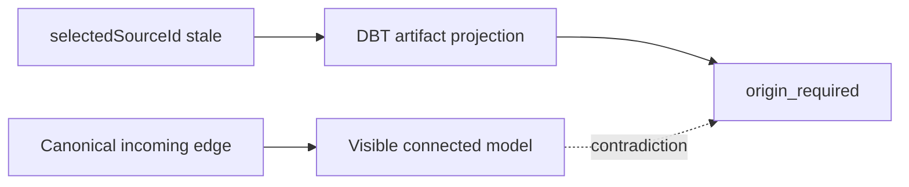
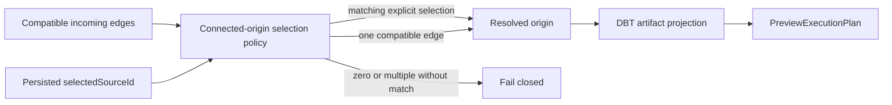

# Execution Preview Connected Origin Resolution Plan

## Think-First Analysis

### Problem and root cause

The Canvas shows a valid Source-to-Model-to-Model topology, but
`PreviewExecutionPlan` can reject the terminal model as originless. The artifact
projection treats a persisted `dbt.selectedSourceId` as stronger than the current
incoming edge. When that duplicated identifier is stale, it suppresses the single
unambiguous connected origin even though the Canvas topology is canonical.



### Constraints and invariants

- `PreviewExecutionPlan` remains the execution-preview command rail.
- `ProjectSelectedExecutableSubgraph` remains the selected topology query rail.
- Current canonical edges determine which origins are connected.
- A matching explicit selection wins when multiple compatible origins are connected.
- Exactly one compatible incoming origin is unambiguous and must be selected even
  if duplicated model metadata is absent or stale.
- Zero compatible origins and ambiguous multi-origin input continue to fail closed.
- No API, planner, engine, contract, adapter, or database behavior changes.
- `docs/architecture/fowler-opportunity-planning-governance.md` governs the
  explicit duplicate-semantics and hidden-authority analysis below.

### Options considered

1. Rewrite persisted metadata before every Preview. Rejected: it makes a query depend
   on a hidden mutation and still leaves other projections able to interpret stale
   data differently.
2. Trust `selectedSourceId` even when disconnected. Rejected: that preserves the
   visible-topology contradiction reported in issue #2911.
3. Pick the first incoming edge. Rejected: edge order is not a semantic selection and
   would make multi-origin execution nondeterministic.
4. Selected: centralize connected-origin selection and reuse it from authoring
   reconciliation and artifact projection. A matching explicit selection wins;
   otherwise a unique compatible edge wins; ambiguity fails closed.



### Fowler opportunity matrix

| Scenario              | Opportunity          | Pattern / owner                                | Rail                                | Tests                            | Out of scope              |
| --------------------- | -------------------- | ---------------------------------------------- | ----------------------------------- | -------------------------------- | ------------------------- |
| Stale selected origin | Duplicate semantics  | Extract function / DBT connected-origin policy | `ProjectSelectedExecutableSubgraph` | stale selection plus unique edge | Persisting cleanup        |
| Multiple origins      | Hidden authority     | Explicit deterministic policy                  | `PreviewExecutionPlan`              | ambiguity remains rejected       | Set-operation authoring   |
| Chained models        | Test-only confidence | Artifact integration proof                     | `PreviewExecutionPlan`              | Source -> Model 1 -> Model 2     | Runtime execution changes |

## Pre-Implementation Brief

- **Mode:** Slim bug fix with one shared pure policy and focused regression tests.
- **Expected outcome:** the connected `Model 2` in issue #2911 produces Preview
  artifacts from `Model 1` even when its duplicate selection metadata is stale.
- **Risk:** an incorrect fallback could silently choose among multiple inputs;
  negative coverage preserves fail-closed ambiguity.
- **Libraries:** none; this is a bounded policy correction.
- **Validation:** red/green unit tests, Web lint/typecheck, live visible-browser proof,
  governance refresh, and pre-push gate.

```feature-mechanization
version: 1
featureId: GH-2911-EXECUTION-PREVIEW-CONNECTED-ORIGIN
mechanizationStatus: implemented
noHumanDecisionsRemaining: true
implementationPlan: docs/planning/proposals/mandatory/frontend-and-ux/execution-preview-connected-origin-plan-20260904.md
componentGuides:
  - docs/architecture/components/web/frontend-command-query-rail-inventory.md
  - docs/planning/execution-model/dvt-execution-model.md
userStories:
  - https://github.com/dunay2/dvt/issues/2911
governingSources:
  - AGENTS.md
  - docs/planning/status/governance-document-rule-inventory.md
  - docs/guides/ai-work-protocol.md
  - docs/architecture/command-query-rail-governance.md
  - docs/architecture/fowler-opportunity-planning-governance.md
  - docs/planning/state/github-mvp-issue-workflow.md
  - docs/planning/proposals/mandatory/frontend-and-ux/canvas-edge-execution-gate-plan-20260902.md
allowedImplementationSurfaces:
  - docs/.manifest.json
  - docs/**/index.md
  - docs/planning/proposals/mandatory/frontend-and-ux/execution-preview-connected-origin-plan-20260904.md
  - docs/planning/closeouts/gh-2911-execution-preview-connected-origin-closeout.md
  - apps/web/src/app/views/canvas/canvasDbtAuthoringModel.ts
  - apps/web/src/app/views/canvas/canvasDbtAuthoringModel.test.ts
  - apps/web/src/app/views/canvas/canvasDbtModelArtifactProjection.ts
  - apps/web/src/app/views/canvas/canvasDbtModelArtifactProjection.test.ts
  - apps/web/src/app/views/canvas/canvasDbtPlannerGraphSource.ts
  - apps/web/src/app/views/canvas/canvasDbtPlannerGraphSource.test.ts
  - apps/web/src/app/views/canvas/useCanvasExecutionActions.dbtPreviewRun.test.tsx
forbiddenImplementationSurfaces:
  - packages/@dvt/contracts/**
  - packages/@dvt/engine/**
  - packages/@dvt/planner/**
  - packages/@dvt/adapter-*/**
  - apps/api/**
  - infra/db/**
commandQueryRails:
  - name: PreviewExecutionPlan
    type: command
    dddOwner: Execution preview application service
  - name: ProjectSelectedExecutableSubgraph
    type: query
    dddOwner: ExecutableSubgraph read model
domainObjects:
  - name: DbtModelConnectedOriginSelection
    type: domain policy
    owner: Canvas Web DBT authoring
  - name: DbtModelArtifactProjection
    type: projection
    owner: Canvas Web DBT execution
fowlerSignals:
  - Duplicate semantics
  - Hidden authority
  - Test-only confidence
architectureGuards:
  - pnpm docs:feature-mechanization:implementation --feature GH-2911-EXECUTION-PREVIEW-CONNECTED-ORIGIN
cypressFlows:
  - N/A - no UI surface changed; the action integration test covers Preview publication and planner submission
completionGate:
  - pnpm --filter @dvt/web exec vitest run --config vitest.unit.config.ts src/app/views/canvas/canvasDbtAuthoringModel.test.ts src/app/views/canvas/canvasDbtModelArtifactProjection.test.ts
  - pnpm --filter @dvt/web exec vitest run --config vitest.unit.config.ts src/app/views/canvas/canvasDbtPlannerGraphSource.test.ts
  - pnpm --filter @dvt/web exec vitest run --config vitest.canvas.config.ts src/app/views/canvas/useCanvasExecutionActions.dbtPreviewRun.test.tsx
  - pnpm --filter @dvt/web lint
  - pnpm --filter @dvt/web typecheck
  - pnpm governance:refresh
  - pnpm verify:prepush
redGreenCycles:
  - id: unique-connected-origin-wins-over-stale-selection
    redTest: pnpm --filter @dvt/web exec vitest run --config vitest.unit.config.ts src/app/views/canvas/canvasDbtModelArtifactProjection.test.ts
    expectedFailure: A stale selectedSourceId suppresses the sole compatible incoming edge and returns origin_required.
    patchSurfaces:
      - apps/web/src/app/views/canvas/canvasDbtAuthoringModel.ts
      - apps/web/src/app/views/canvas/canvasDbtAuthoringModel.test.ts
      - apps/web/src/app/views/canvas/canvasDbtModelArtifactProjection.ts
      - apps/web/src/app/views/canvas/canvasDbtModelArtifactProjection.test.ts
      - apps/web/src/app/views/canvas/canvasDbtPlannerGraphSource.ts
      - apps/web/src/app/views/canvas/canvasDbtPlannerGraphSource.test.ts
    greenTest: pnpm --filter @dvt/web exec vitest run --config vitest.unit.config.ts src/app/views/canvas/canvasDbtAuthoringModel.test.ts src/app/views/canvas/canvasDbtModelArtifactProjection.test.ts
symbols:
  - { name: resolveDbtModelConnectedOrigin, path: apps/web/src/app/views/canvas/canvasDbtAuthoringModel.ts, dddOwner: DbtModelConnectedOriginSelection, cqRails: [ProjectSelectedExecutableSubgraph, PreviewExecutionPlan], fowlerSignals: [Duplicate semantics, Hidden authority], architectureGuard: pnpm docs:feature-mechanization:implementation --feature GH-2911-EXECUTION-PREVIEW-CONNECTED-ORIGIN, cypressCoverage: N/A - no UI surface changed, unitTests: [apps/web/src/app/views/canvas/canvasDbtAuthoringModel.test.ts, apps/web/src/app/views/canvas/canvasDbtModelArtifactProjection.test.ts, apps/web/src/app/views/canvas/canvasDbtPlannerGraphSource.test.ts, apps/web/src/app/views/canvas/useCanvasExecutionActions.dbtPreviewRun.test.tsx] }
```
