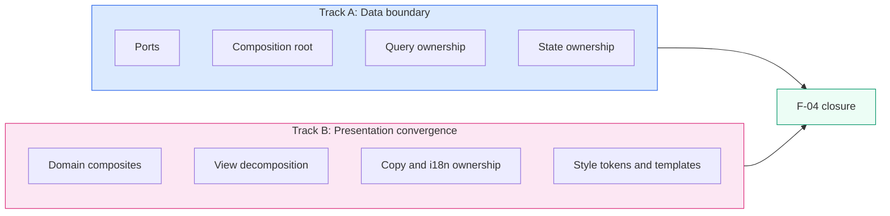
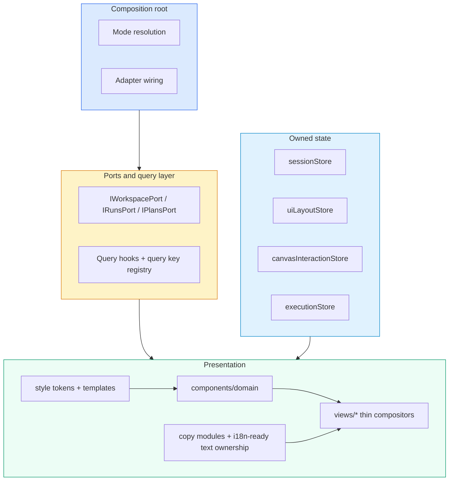
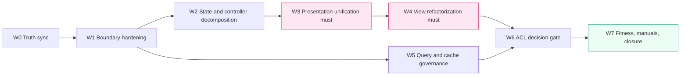

# F-04 Frontend Data Boundary Hexagonal Convergence Plan

## Summary

This proposal defines the correction path for the DVT+ frontend so that two
outcomes become non-optional:

1. the frontend data boundary converges to a real hexagonal model with a single
   composition root, explicit ports, and governed query/state ownership
2. the presentation layer is refactored and unified so that monolithic views,
   duplicated UI patterns, hardcoded copy, and inconsistent styling stop being
   treated as acceptable drift

This proposal does not treat refactorization and UI unification as "nice to
have". They are mandatory closure criteria for F-04 because without them the
frontend remains structurally non-hexagonal even if the service boundary looks
clean on paper.

## Governing sources

- `docs/architecture/reference-architecture.md`
- `ADR-0003`
- `ADR-0034`
- `docs/guides/dvt-code-style-solid-hexagonal-cqrs.md`
- `docs/planning/templates/qa/TEMPLATE_QA_GLOBAL_CHECK_PROMPT.md`
- `docs/planning/templates/qa/TEMPLATE_QA_ARTIFACT_EXAMPLE.md`

## Problem statement

The frontend has already started moving toward a hexagonal boundary, but the
system is still split between:

- real ports and composition-root wiring in some areas
- inline orchestration, large view files, duplicated view patterns, and uneven
  copy/style ownership in others

That split creates two risks:

- architectural drift: the code claims hexagonal direction while the view layer
  still owns too much policy and composition
- product drift: similar screens behave and read differently because there is
  no enforced presentation vocabulary, template system, or consistent copy
  ownership

## Reality snapshot

### Already implemented or materially underway

- explicit frontend ports exist under `apps/web/src/app/ports/`
- `AppServicesProvider` is already the effective composition root for adapter
  selection and service exposure
- typed query-key registry already exists in `apps/web/src/app/queries/queryKeys.ts`
- state is already partly decomposed into `sessionStore`, `uiLayoutStore`,
  `canvasInteractionStore`, and `executionStore`
- architecture checks already enforce some boundary rules
- `TopAppBar` has now been moved to a composition-root plus subcomponent model,
  with extracted copy and style tokens

### Drift that still remains

- some plan text still describes old `appStore` and ad hoc query ownership as
  if they were current truth
- large view files still mix data orchestration, transformations, business
  rules, and deep JSX layout
- view-level UI patterns are still duplicated instead of being encoded in a
  shared domain composite layer
- copy ownership and i18n readiness are still inconsistent across screens
- style tokens and view templates are still unevenly applied
- `useCanvasController` and related orchestration paths still carry too much
  breadth
- the anti-corruption layer decision is not yet justified enough to be treated
  as unconditional mandatory work

## Architectural position

F-04 has two mandatory tracks, not one:

### Track A: data-boundary convergence

This is the hexagonal work:

- ports are explicit
- composition-root wiring is unique
- views consume ports and query hooks, not adapters
- state ownership is explicit
- query ownership is explicit

### Track B: presentation convergence

This is also required architectural work, not cosmetics:

- repeated UI patterns move into reusable domain composites
- oversized views are decomposed
- copy ownership becomes explicit and locale-ready
- style tokens and templates stop being ad hoc

If Track A is completed without Track B, the frontend remains structurally
incoherent. If Track B is completed without Track A, the UI becomes cleaner but
still non-hexagonal. F-04 requires both.



## Target model

### Data-boundary target

- one composition root owns runtime mode resolution and adapter wiring
- ports define frontend needs without infrastructure leakage
- query hooks and registries own server-state access rules
- views and view subcomponents never construct adapters or resolve mode
- stores have bounded ownership and do not duplicate session context

### Presentation target

- `components/ui/` remains primitive-only
- `components/domain/` becomes the reusable application vocabulary layer
- `views/**` become thin screen compositors with extracted hooks and
  subcomponents
- shared copy lives in dedicated copy modules, not scattered JSX literals
- repeated style decisions move to tokens/templates, not copy-paste class lists



## Planning corrections

The previous version of this plan overstated some unfinished work and mixed it
with work that is already in place. This corrected version applies these
decisions:

- `W0`, `W1`, `W2`, and `W4` are treated as tighten-and-verify waves, not
  greenfield waves
- refactorization and UI unification remain mandatory, not optional follow-up
- anti-corruption layer work becomes a gated decision, not an automatic must
- architecture fitness checks start before final closeout, not only at the end

## Execution waves

### `F04-W0` Current-truth correction

Purpose:

- align documentation and wave sequencing with the actual codebase state

Deliverables:

- correct the `as-is` section
- mark already-implemented structures as baseline, not pending promises
- split mandatory work into data-boundary and presentation tracks

Validation:

- `pnpm docs:sync`
- `pnpm verify:prepush`

### `F04-W1` Boundary hardening

Purpose:

- close remaining drift in composition-root ownership, port exposure, and
  frontend service access rules

Deliverables:

- keep `AppServicesProvider` as the only runtime wiring owner
- remove any remaining adapter or mode resolution leakage from views/plugins
- tighten port ownership and tests around provider usage

Validation:

- `pnpm --filter @dvt/web typecheck`
- `pnpm --filter @dvt/web test`
- architecture tests proving mode resolution ownership

### `F04-W2` State and controller decomposition

Purpose:

- complete real ownership separation for session, UI layout, canvas
  interaction, and execution state

Deliverables:

- remove residual duplication or legacy coupling
- narrow broad orchestrators such as `useCanvasController`
- ensure cross-store access happens through explicit facades where needed

Validation:

- `pnpm --filter @dvt/web typecheck`
- `pnpm --filter @dvt/web test`
- negative tests for hydration and orchestration regression where applicable

### `F04-W3` Presentation unification must

Purpose:

- establish a reusable presentation vocabulary and stop repeated one-off
  markup, copy, and style drift

Deliverables:

- create `components/domain/` composites such as `ViewHeader`, `StatCard`,
  `StatusIndicator`, and `ViewStateOverlay`
- extract copy ownership into dedicated modules
- introduce app-level style tokens/templates for repeated shell and view
  structures
- ensure new and touched screens consume these templates instead of duplicating
  layout structures

Validation:

- `pnpm --filter @dvt/web typecheck`
- `pnpm --filter @dvt/web test`
- render tests for domain composites

### `F04-W4` View refactorization must

Purpose:

- enforce SRP at screen level by decomposing monolithic views and moving logic
  to hooks/utilities/subcomponents

Deliverables:

- decompose the largest views and route panels
- extract pure algorithms and parser logic to testable utilities
- keep screen files as thin compositors
- enforce the no-view-over-200-lines fitness rule for targeted view-level files
- create a `W4 decomposition manifest` Markdown artifact that preserves the
  execution baseline for each targeted view and repeated UI pattern

The `W4 decomposition manifest` MUST include:

- targeted view inventory with current line count, target line count, target
  extracted files, and decomposition status
- repeated-pattern inventory with concrete counts where known at execution
  time, for example duplicated view headers, stat cards, status indicators, and
  empty/loading/error states
- ownership mapping from each extracted file to its final layer:
  `components/domain`, `views/<feature>`, `hooks`, or pure utility module
- explicit before/after traceability so the refactor cannot erase the original
  rationale or success criteria

Validation:

- `pnpm --filter @dvt/web typecheck`
- `pnpm --filter @dvt/web test`
- architecture fitness test for file-size and dependency rules

### `F04-W5` Query and cache governance

Purpose:

- finish query-key normalization and invalidation ownership

Deliverables:

- expand the shared query-key registry where needed
- forbid inline query keys outside the registry
- document invalidation policy per domain

Validation:

- `pnpm --filter @dvt/web typecheck`
- `pnpm --filter @dvt/web test`
- architecture test for inline-query-key prohibition

### `F04-W6` Frontend anti-corruption layer decision gate

Purpose:

- decide whether a frontend-specific mapping layer is justified

Decision rule:

- implement only where frontend semantics genuinely diverge from shared
  contracts or where shared contracts expose more instability than the frontend
  should absorb
- do not create blanket mapping boilerplate just to satisfy a pattern

Deliverables:

- decision note identifying which frontend types require mapping and why
- if justified, narrow ACL implementations at the adapter boundary
- if not justified, document the accepted direct-contract usage zones

Validation:

- `pnpm --filter @dvt/web typecheck`
- `pnpm --filter @dvt/web test`
- architecture test for allowed import zones

### `F04-W7` Fitness checks, manuals, and closure

Purpose:

- lock the architecture in place and close with evidence

Deliverables:

- architecture fitness checks for import direction, view-size policy, and
  composition-root ownership
- technical manual and user manual updated to current truth
- closeout evidence and planning alignment

Validation:

- `pnpm docs:sync`
- `pnpm --filter @dvt/web typecheck`
- `pnpm --filter @dvt/web test`
- `pnpm verify:prepush`



## Why refactorization and unification stay mandatory

The user direction is correct here. In this repo, refactorization and
unification are not optional polish because:

- oversized views hide mixed responsibilities
- repeated UI patterns create product inconsistency and maintenance cost
- missing copy ownership blocks credible multi-language support
- style drift makes the product surface harder to evolve coherently

Therefore the plan locks these as must-have closure gates, not stretch goals.

## Risks and tradeoffs

| Decision                                  | Benefit                                                            | Cost                                     |
| ----------------------------------------- | ------------------------------------------------------------------ | ---------------------------------------- |
| Treat refactorization as mandatory        | Prevents structural drift from surviving under a "hexagonal" label | More up-front slicing and review effort  |
| Introduce domain composites and templates | Consistent UX and less copy-paste                                  | New abstraction layer to maintain        |
| Enforce line and dependency fitness tests | Stops regression automatically                                     | Requires disciplined decomposition       |
| Make ACL conditional instead of automatic | Avoids unnecessary mapping busywork                                | Requires explicit decision and rationale |

## Non-goals

- backend API redesign
- engine-side refactors outside frontend consumption boundaries
- replacing React Query
- replacing shadcn/ui
- introducing fake placeholder abstractions just to satisfy the plan

## Definition of Done

F-04 is only complete when all of the following are true:

- composition-root ownership is explicit and enforced
- ports, query ownership, and store ownership are aligned to current code
- refactorization and unification have been applied to the targeted screens
- no targeted view-level component file exceeds 200 lines
- `W4 decomposition manifest` exists and preserves before/after traceability
- shared domain composites exist for repeated patterns
- copy ownership is extracted for targeted screens and is locale-ready
- manuals describe current truth, not aspirational future state
- architecture fitness checks run and stay green
- `pnpm verify:prepush` passes

## Action artifact

### Task checklist

- [ ] `F04-W0` Correct the plan so it matches current code truth
- [ ] `F04-W1` Harden composition-root and port ownership
- [ ] `F04-W2` Finish state and controller decomposition
- [ ] `F04-W3` Implement mandatory presentation unification
- [ ] `F04-W4` Implement mandatory view refactorization
- [ ] `F04-W5` Finish query and cache governance
- [ ] `F04-W6` Resolve the anti-corruption layer decision with rationale
- [ ] `F04-W7` Add fitness checks, manuals, and validated closeout evidence

### Task details

#### `F04-W1` Harden composition-root and port ownership

- Objective: keep all runtime data wiring under one owner
- Scope: `AppServicesProvider`, port consumers, architecture tests
- Dependencies: `F04-W0`
- Documentation impact: architecture and manual updates
- Comment with rationale: without a single owner, `mock` and `api` modes drift
- DoD:
  - no mode resolution outside approved modules
  - no view constructs adapters directly
  - provider and boundary tests are green

#### `F04-W3` Mandatory presentation unification

- Objective: remove repeated view structures, copy sprawl, and style drift
- Scope: `components/domain/`, copy modules, style tokens, templates
- Dependencies: `F04-W2`
- Documentation impact: technical manual and user manual
- Comment with rationale: product consistency is a structural requirement
- DoD:
  - repeated patterns are encoded once
  - targeted screens use shared composites/templates
  - copy ownership is extracted for touched screens

#### `F04-W4` Mandatory view refactorization

- Objective: reduce view-level mixed responsibility and enforce SRP
- Scope: high-line-count screens and controller chains
- Dependencies: `F04-W3`
- Documentation impact: decomposition map and closeout notes
- Comment with rationale: without decomposition, hexagonal claims remain shallow
- DoD:
  - targeted view files are under 200 lines
  - algorithms and transforms are extracted and tested
  - subcomponents do not access stores/services directly
  - a `W4 decomposition manifest` records targeted views, baseline size,
    extracted modules, repeated-pattern counts, and final status

#### `F04-W6` Anti-corruption layer decision gate

- Objective: make the ACL choice explicit and evidence-based
- Scope: frontend type boundaries at adapter edges
- Dependencies: `F04-W4`, `F04-W5`
- Documentation impact: decision note in architecture docs or closeout
- Comment with rationale: ACL is valuable only where it reduces real coupling
- DoD:
  - justified mapping zones are explicit
  - unjustified blanket mapping is avoided
  - import-boundary tests match the decision

## Validation baseline

```bash
pnpm --filter @dvt/web typecheck
pnpm --filter @dvt/web test
pnpm docs:sync
pnpm verify:prepush
```
