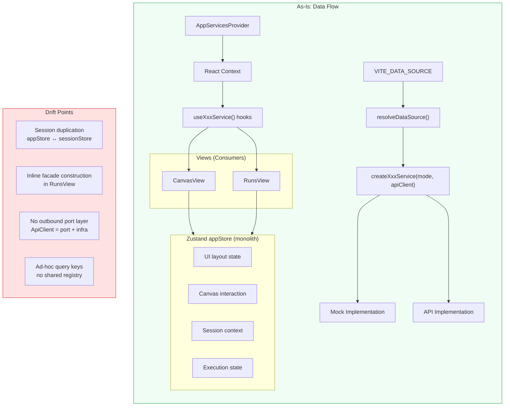
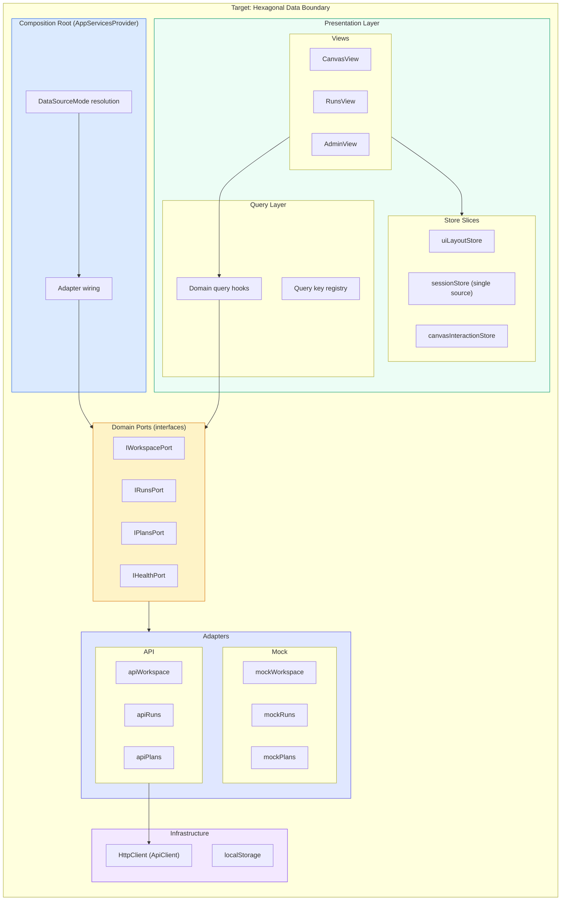
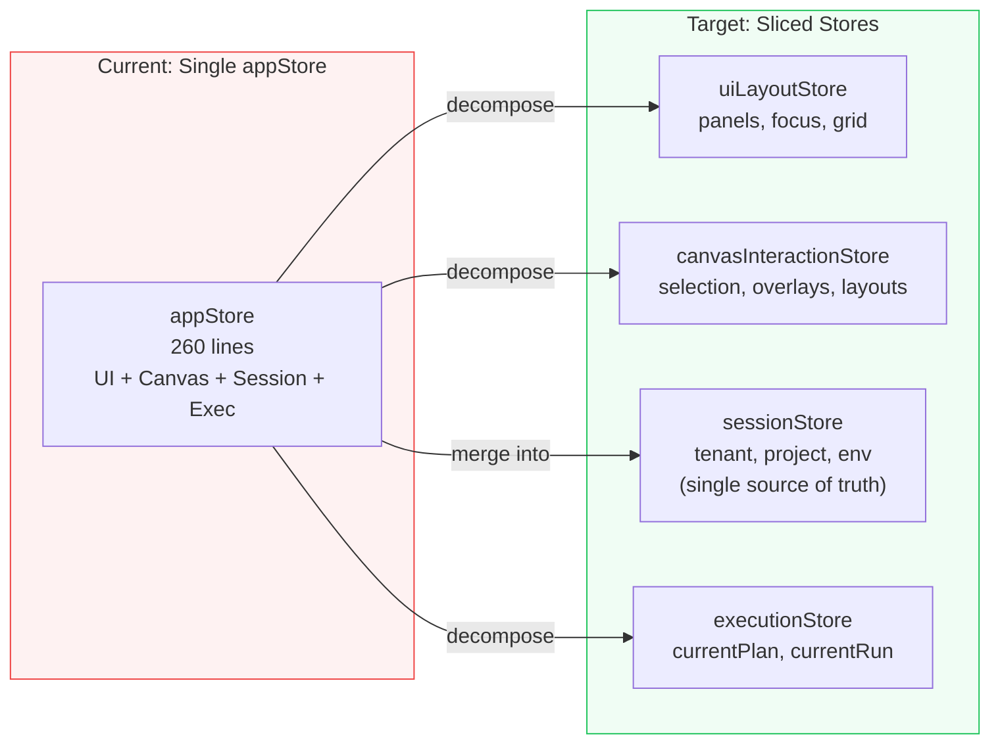
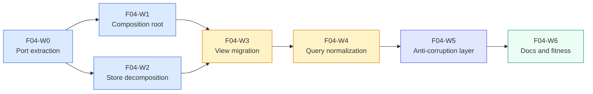
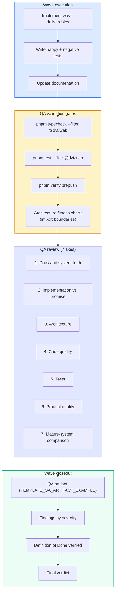

# F-04 Frontend Data Boundary Hexagonal Convergence Mandatory Plan

## Summary

This proposal defines the execution plan for converging the DVT+ frontend data
boundaries to a hexagonal architecture model. The goal is to centralize mode
selection and adapter wiring in a single composition root, enforce port-based
service access throughout the view layer, and align the frontend data flow with
the backend's hexagonal principles already established in the engine subsystem.

## Governing sources

- `docs/architecture/reference-architecture.md` — hexagonal architecture, ports
  and adapters, replaceable infrastructure
- `ADR-0003` — execution model sovereignty, adapter translation boundaries
- `ADR-0034` — bounded context boundaries and communication rules
- `docs/guides/dvt-code-style-solid-hexagonal-cqrs.md` — SOLID and hexagonal
  code-style baseline
- `docs/planning/proposals/frontend-f04-scope-and-slicing-20260404.md` — F-04
  scope and slicing reference
- `docs/planning/templates/qa/TEMPLATE_QA_GLOBAL_CHECK_PROMPT.md` — QA quality
  bar

## As-is findings

### What is already strong

- **Service adapter pattern exists**: `RunsService`, `PlansService`, and
  `WorkspaceService` each define an abstract interface with `mock` and `api`
  implementations selected by factory functions.
- **Composition root partially in place**: `AppServicesProvider` in
  `src/app/services/AppServicesContext.tsx` wires services via React Context and
  exposes typed hooks (`useRunsService`, `usePlansService`,
  `useWorkspaceService`).
- **Mode selection centralized**: `resolveDataSource()` reads
  `VITE_DATA_SOURCE` with a clean `mock | api` discriminant.
- **Clean layered capability exists**: `src/capabilities/platform-health/` uses
  explicit `domain → application → infrastructure → presentation` layers with
  proper port isolation.
- **Test override mechanism**: `AppServicesProvider` accepts `overrides` prop for
  test-time dependency injection.

### What is still drifting

- **Fat Zustand store mixes concerns**: `appStore.ts` blends UI layout state
  (panel widths, focus mode, grid size), canvas interaction state (selected
  nodes, overlays), session-derived context (tenant, project, environment), and
  execution state (currentPlan, currentRun) into a single 260-line store with
  persistence middleware.
- **Session store duplication**: `sessionStore` and `appStore` both hold
  `tenantId`, `projectId`, `environmentId` with manual sync in setters.
- **Canvas controller as mega-hook**: `useCanvasController` orchestrates 8+
  sub-hooks, 3 services, and the store facade in one function — blending data
  fetching, UI state, graph model, overlay logic, execution actions, and layout
  persistence.
- **Views construct domain logic inline**: `RunsView` builds a
  `RunWorkspaceFacade` instance inside the component via `useMemo`, mixes query
  orchestration with store side effects (`setCurrentRun`), and maps DTOs to UI
  models inline.
- **No explicit outbound port layer**: Services call `ApiClient` directly
  without an intermediate outbound port definition — the `ApiClient` type serves
  as both HTTP infrastructure and port contract.
- **Plugin data ports are declared but not wired**: `PluginContributions`
  declares `produces` and `consumes` data ports, but no runtime data bus
  connects them.
- **Query key management is ad-hoc**: Each view defines its own query keys
  inline (e.g., `['runs', 'summaries', workspaceLayoutKey]`) with no shared
  registry or invalidation policy.
- **Types re-export without boundary**: `src/app/types/engine.ts` re-exports
  from `@dvt/contracts` without a frontend-specific anti-corruption layer.



## Target model

### Hexagonal target architecture

The target model enforces three concentric boundaries:

1. **Domain ports** — typed interfaces that define what the frontend needs from
   external systems (read models, commands, queries), without knowledge of HTTP,
   mocks, or infrastructure.
2. **Adapters** — concrete implementations (mock, API, future: WebSocket,
   gRPC) that satisfy port contracts.
3. **Composition root** — a single wiring point (`AppServicesProvider`) that
   selects adapters based on mode and injects them into the React tree.

Views and hooks consume only ports (via typed context hooks). No view constructs
services, selects modes, or imports infrastructure directly.



### Store decomposition target



## Gap closure waves

### `F04-W0` Port contract extraction

**Depends on**: nothing (can start immediately)

Deliverables:

- Extract `IWorkspacePort`, `IRunsPort`, `IPlansPort` as pure TypeScript
  interfaces in `src/app/ports/`.
- Each port defines only the operations the presentation layer needs — no
  HTTP details, no error classification internals.
- Existing service interfaces (`RunsService`, etc.) become the adapter-side
  implementation type that satisfies the port.
- Add port-level JSDoc documenting each operation's contract.

Validation:

- `pnpm typecheck --filter @dvt/web`
- Existing tests remain green (no runtime change)

### `F04-W1` Composition root hardening

**Depends on**: `F04-W0`

Deliverables:

- Refactor `AppServicesProvider` to wire ports (not service implementations)
  into context.
- Remove `resolveDataSource()` calls from any location outside the composition
  root.
- Enforce that `buildAppServicesContextValue` is the single point where mode
  resolution and adapter selection occur.
- Update `AppServicesContext.test.tsx` to validate port-based wiring.

Validation:

- `pnpm typecheck --filter @dvt/web`
- `pnpm test --filter @dvt/web`
- No import of `resolveDataSource` or `createXxxService` outside
  `AppServicesContext.tsx` and adapter files.

### `F04-W2` Store decomposition

**Depends on**: `F04-W0` (can run in parallel with `F04-W1`)

Deliverables:

- Split `appStore.ts` into:
  - `uiLayoutStore.ts` — panel widths, visibility, focus mode, grid size
  - `canvasInteractionStore.ts` — selected nodes, overlays, canvas layouts
  - `executionStore.ts` — currentPlan, currentRun
- Merge session-related fields from `appStore` into `sessionStore` as single
  source of truth — remove duplicate tenant/project/env fields.
- Each store retains its own persistence partialize config.
- Create `useCanvasStoreFacade` (already exists) as the canonical aggregation
  point for canvas hooks that need cross-store data.

Validation:

- `pnpm typecheck --filter @dvt/web`
- `pnpm test --filter @dvt/web`
- Persistence behavior verified (localStorage keys, hydration)

### `F04-W3` View consumer migration

**Depends on**: `F04-W1`, `F04-W2`

Deliverables:

- Refactor `RunsView` to consume `IRunsPort` via hook and delegate facade
  construction to a domain-level use-case hook (not inline `useMemo`).
- Refactor `useCanvasController` to reduce orchestration breadth:
  - Extract `useCanvasDataModel` (graph + overlay) as a self-contained hook
    that depends only on ports and the canvas interaction store.
  - Extract `useCanvasExecutionBridge` (plan + run actions) that depends only
    on ports and the execution store.
  - `useCanvasController` becomes a thin composition of these two plus
    layout/navigation hooks.
- Remove any direct `createXxxService()` calls from views or plugins.
- Any unsupported API path in `api` mode surfaces an explicit "not wired yet"
  state instead of silently returning mock data.

Validation:

- `pnpm typecheck --filter @dvt/web`
- `pnpm test --filter @dvt/web`
- Negative-path tests for "not wired yet" states

### `F04-W4` Query infrastructure normalization

**Depends on**: `F04-W3`

Deliverables:

- Create `src/app/queries/queryKeys.ts` with a typed query key registry.
- Migrate all inline query key definitions to the registry.
- Define invalidation policies per domain (runs, plans, workspace, health).
- Document query key conventions in a short technical reference.

Validation:

- `pnpm typecheck --filter @dvt/web`
- `pnpm test --filter @dvt/web`
- No inline query key arrays outside the registry

### `F04-W5` Anti-corruption layer for contract types

**Depends on**: `F04-W4`

Deliverables:

- Replace raw `@dvt/contracts` re-exports in `src/app/types/engine.ts` with
  frontend-specific mapped types that serve as an anti-corruption layer.
- Frontend types may be narrower than contract types (omitting fields the UI
  never uses) or may add UI-specific computed properties.
- Port interfaces use frontend types, not contract types directly.
- Adapter implementations perform the mapping from contract DTOs to frontend
  types.

Validation:

- `pnpm typecheck --filter @dvt/web`
- `pnpm test --filter @dvt/web`
- No direct `@dvt/contracts` imports outside `src/app/ports/` and adapter files

### `F04-W6` Documentation, fitness checks, and acceptance

**Depends on**: `F04-W5`

Deliverables:

- Write `docs/architecture/components/web/frontend-hexagonal-boundary.md` describing
  the achieved architecture with diagrams.
- Update `DVT_FRONTEND_PLUGIN_ARCHITECTURE.md` to reflect the hexagonal data
  flow.
- Add an architecture fitness test that asserts:
  - no view file imports from adapter or infrastructure directories
  - no adapter file imports from view directories
  - port interfaces have no infrastructure dependencies
- Update the frontend user manual and frontend roadmap.
- Create closeout evidence doc under `docs/evidence/`.

Validation:

- `pnpm typecheck --filter @dvt/web`
- `pnpm test --filter @dvt/web`
- `pnpm verify:prepush`
- Architecture fitness test green

## Wave dependency graph



## Lane mapping

This proposal maps to **Lane E** (Frontend) or a new frontend-specific lane if
one is created. Task structure:

- Create umbrella task `F-04` with child tasks `F04-W0..W6`
- Reference this proposal and:
  - `docs/planning/proposals/frontend-f04-scope-and-slicing-20260404.md`
  - `docs/architecture/reference-architecture.md`
- `F04-W0` and `F04-W2` can execute in parallel
- `F04-W3` is the critical convergence point requiring both `W1` and `W2`

## Risks and tradeoffs

### Key tradeoffs

| Decision                                         | Benefit                                      | Cost                                 |
| ------------------------------------------------ | -------------------------------------------- | ------------------------------------ |
| Port interfaces as separate files                | Clean dependency direction, testability      | Additional indirection layer         |
| Store decomposition into 4 slices                | SRP, independent persistence                 | Cross-store coordination overhead    |
| Anti-corruption layer for contracts              | Frontend insulated from backend schema drift | Mapping boilerplate per DTO          |
| Keeping `useCanvasController` as thin compositor | Preserves existing test harness              | Requires careful sub-hook extraction |

### Primary risks

| Risk                                                   | Probability | Severity | Mitigation                                                                                  |
| ------------------------------------------------------ | ----------- | -------- | ------------------------------------------------------------------------------------------- |
| Store decomposition breaks persistence hydration       | Medium      | High     | Migrate localStorage keys with backward-compatible fallback; test hydration explicitly      |
| Canvas controller extraction introduces regressions    | Medium      | Medium   | Existing negative-path and core test harness covers current behavior; extract incrementally |
| Anti-corruption layer becomes stale mapping busywork   | Low         | Medium   | Start narrow (only types the UI actually uses); generate mappings where possible            |
| Partial completion leaves two architectures coexisting | Medium      | High     | Wave sequencing enforces convergence; `F04-W6` fitness test blocks drift                    |

### Mitigation strategy

- Execute waves sequentially (except `W0` ∥ `W2`)
- Each wave must pass `pnpm test --filter @dvt/web` before proceeding
- `F04-W6` fitness test becomes a permanent CI guard against regression

## Non-goals

- Changing the backend API contract or engine subsystem
- Implementing a runtime plugin data bus (declared ports only; wiring is future
  work)
- Replacing React Query with a different server-state library
- Introducing a new UI component library or design system
- Real-time WebSocket adapter implementation (future wave beyond F-04)
- Retirement of `GraphCanvas` legacy component (separate task)

## Quality bar and QA validation framework

Reference templates:

- `docs/planning/templates/qa/TEMPLATE_QA_GLOBAL_CHECK_PROMPT.md`
- `docs/planning/templates/qa/TEMPLATE_QA_CURRENT_TASK_CHECK_PROMPT.md`
- `docs/planning/templates/qa/TEMPLATE_QA_ARTIFACT_EXAMPLE.md`

### Minimum quality bar per wave

Every wave MUST satisfy:

- Happy-path AND negative-path tests for new behavior
- No `as any`, unjustified type assertions, or magic values
- Lint and typecheck green in the `@dvt/web` workspace
- `pnpm verify:prepush` green before wave is presented as ready
- No behavior changed outside declared scope
- Documentation reflects shipped behavior
- No stubs, placeholders, fake implementations, or TODO markers
- No hidden debt or silent rule downgrades

### Mandatory review axes per wave

Each wave closeout review MUST evaluate the 7 QA axes defined in the global QA
prompt. Reviewers MUST produce findings ordered by severity across:

#### 1. Documentation and system truth

- Documentation is correct, consistent, traceable, and aligned with real code
- No documentation drift, promises without implementation, or implementation
  without documentation
- No aspirational claims presented as current truth
- Evidence docs and risk-register updates exist when governance requires them

#### 2. Implementation vs promise

- Code implements exactly what the wave declares
- No overpromising, under-implementation, or undocumented implicit behavior
- No narrative claiming a bigger change than the actual code
- Cases not covered are explicitly stated, not silently omitted

#### 3. Architecture

- SRP, SOLID, DDD, hexagonal architecture evaluated explicitly
- Ports and adapters respect dependency direction
- Separation between application, domain, infrastructure, and presentation
- Clear ownership of invariants
- No fake modularity — real boundaries, not renamed directories

#### 4. Code quality

- Readability, naming, modularization, cohesion, coupling
- No accidental complexity or equivalent reimplementation
- Correct use of types, value objects, and data flow
- Passes prettier, lint, ESLint, and type-check

#### 5. Tests

- Happy paths, negative tests, edge cases, regressions
- Public-boundary coverage and invariant coverage
- No weak tests that only validate superficial shape
- No tests coupled to incidental ordering or implementation details
- Global system view applied, not just local file assertions
- Evaluate whether a harness or shared fixtures are needed for boundary
  behavior validation
- Tests grouped by type (`unit`, `integration`, `contract`, `e2e`, regression)
  when that improves clarity, confidence, or maintenance

#### 6. Product quality

- Behavior risks, UX and operational errors evaluated
- Sufficient observability and diagnostics
- No hidden debt, placeholders, or fake implementations
- Runbook, manual, or closeout exists when the wave needs one

#### 7. Comparison with mature systems

- Compare with mature-system practices only when the comparison changes the
  recommendation
- Evaluate benefit of: test harnesses, test matrices, architecture tests,
  seam-extraction patterns, golden fixtures, deterministic diagnostics

### Wave closeout artifact requirements

Each wave closeout MUST produce a reusable Markdown artifact following
`TEMPLATE_QA_ARTIFACT_EXAMPLE.md` as the baseline output shape. The artifact
MUST include:

- **Findings** ordered by severity (Blocker / High / Medium / Low)
- Each finding with: severity, short title, why it matters, exact evidence
  (file and line or command), real risk, concrete recommendation
- **Alignment section**: doc vs code, promise vs implementation, tests vs
  claims, current truth vs planned truth, documentation update status, evidence
  and risk-doc status
- **Architecture assessment**: SRP, DDD, hexagonal, CQRS (if relevant),
  complexity, modularity
- **Test assessment**: negative paths present/missing, regression status,
  determinism, harness/fixture needs, test grouping by type with rationale
- **Quality gates**: commands executed, what passed, what failed, what could not
  be verified
- **Action artifact** with:
  - Task checklist with GitHub-style checkboxes
  - Per task: objective, scope, owner, dependencies, documentation impact,
    evidence/risk-doc impact, comment with rationale, Definition of Done
- **At least one Mermaid diagram** explaining the current state, risk, flow, or
  remediation map
- **Final verdict**: Ready / Ready with follow-ups / Not ready

### Per-wave Definition of Done

| Wave       | Definition of Done                                                                                                                                                                                                          |
| ---------- | --------------------------------------------------------------------------------------------------------------------------------------------------------------------------------------------------------------------------- |
| **F04-W0** | Port interfaces exist in `src/app/ports/`; no runtime change; existing tests green; port-level JSDoc present; no infrastructure types leak into port signatures                                                             |
| **F04-W1** | `AppServicesProvider` wires ports; no `resolveDataSource` import outside composition root and adapters; context test validates port-based wiring; negative test for missing provider                                        |
| **F04-W2** | `appStore` replaced by 4 sliced stores; session duplication eliminated; localStorage migration verified; hydration behavior tested with happy and negative paths; `useCanvasStoreFacade` aggregates cross-store access      |
| **F04-W3** | No view or plugin constructs services locally; `RunsView` uses domain hook; `useCanvasController` is thin compositor; "not wired yet" states have explicit UI and negative tests; no mock data imported in `api` mode views |
| **F04-W4** | Query key registry exists; no inline query key arrays outside registry; invalidation policies documented; domain query hooks use registry                                                                                   |
| **F04-W5** | No direct `@dvt/contracts` import outside ports and adapters; frontend mapped types exist; adapter mapping tests cover happy and negative paths; anti-corruption boundary verified by architecture test                     |
| **F04-W6** | Architecture doc written with diagrams; fitness tests green in CI; `pnpm verify:prepush` passes; closeout evidence doc created under `docs/evidence/`; portfolio map updated                                                |

### Wave QA validation flow



## Validation baseline

Every wave closes with this command sequence:

```bash
pnpm typecheck --filter @dvt/web
pnpm test --filter @dvt/web
pnpm docs:sync
pnpm verify:prepush
```

Additionally, from `F04-W6` onward, the architecture fitness test becomes a
permanent CI guard:

```bash
pnpm test --filter @dvt/web -- --grep "architecture fitness"
```

## Action Artifact

### Task Details

#### `F04-W0` Port contract extraction

- Objective: Define explicit frontend outbound ports as the only consumer-facing service contracts.
- Scope: `apps/web/src/app/ports/**` and service typing boundaries.
- In current task scope: Yes.
- Dependencies: None.
- Documentation impact: Update architecture docs with port ownership references.
- Evidence / risk-doc impact: None expected for this planning-first slice.
- Comment with rationale: Hexagonal convergence is not credible without explicit ports.
- Definition of Done:
  - `IWorkspacePort`, `IRunsPort`, `IPlansPort` are defined and used by consumers.
  - Port signatures are infrastructure-agnostic.
  - Type-check and web tests remain green.

#### `F04-W1` Composition root hardening

- Objective: Centralize mode selection and adapter wiring in one composition root.
- Scope: `AppServicesProvider` and data-source resolution ownership.
- In current task scope: Yes.
- Dependencies: `F04-W0`.
- Documentation impact: Composition-root ownership diagrams and notes.
- Evidence / risk-doc impact: None expected for this planning-first slice.
- Comment with rationale: Multiple wiring points create drift between mock and API behavior.
- Definition of Done:
  - Only composition root resolves data source mode.
  - Views do not call adapter factories directly.
  - Provider wiring tests validate mode and adapter binding.

#### `F04-W2` Store decomposition

- Objective: Split monolithic store into bounded slices with explicit ownership.
- Scope: UI, canvas, execution, and session state boundaries.
- In current task scope: Yes.
- Dependencies: `F04-W0`.
- Documentation impact: Store-boundary map and ownership table.
- Evidence / risk-doc impact: Evaluate if implementation touches governed ARC paths.
- Comment with rationale: SRP and deterministic behavior require state ownership boundaries.
- Definition of Done:
  - Monolithic concerns are removed from `appStore`.
  - Session duplication is removed.
  - Hydration and persistence behavior is tested.

#### `F04-W3` View consumer migration

- Objective: Ensure views consume ports and facades, not infrastructure or mode logic.
- Scope: `RunsView`, canvas controller chain, and route-level data consumption.
- In current task scope: Yes.
- Dependencies: `F04-W1`, `F04-W2`.
- Documentation impact: Current-vs-target view dependency diagrams.
- Evidence / risk-doc impact: Evaluate if behavior changes require evidence updates.
- Comment with rationale: View-level orchestration of infrastructure breaks hexagonal boundaries.
- Definition of Done:
  - No route-level service factory creation.
  - Canvas controller is reduced to thin composition.
  - Unsupported API paths are explicit and tested.

#### `F04-W4` Query infrastructure normalization

- Objective: Normalize query key ownership and invalidation policies.
- Scope: Query key registry, query hooks, invalidation policy.
- In current task scope: Yes.
- Dependencies: `F04-W3`.
- Documentation impact: Query policy section and key naming conventions.
- Evidence / risk-doc impact: None expected for planning slice.
- Comment with rationale: Ad-hoc query keys hide cache bugs and invalidate confidence.
- Definition of Done:
  - Shared query key registry exists.
  - Inline keys are removed from views.
  - Invalidation policy is explicit and test-backed.

#### `F04-W5` Frontend anti-corruption layer

- Objective: Decouple UI domain types from raw shared-kernel contracts.
- Scope: Frontend mapping layer between `@dvt/contracts` DTOs and UI models.
- In current task scope: Yes.
- Dependencies: `F04-W4`.
- Documentation impact: Contract mapping table and ownership note.
- Evidence / risk-doc impact: Evaluate ARC requirements if contracts package is touched.
- Comment with rationale: Direct contract re-export increases cross-context coupling and drift risk.
- Definition of Done:
  - Frontend mapped types are canonical in presentation and application layers.
  - Contract imports are limited to ports and adapter implementations.
  - Mapping behavior has positive and negative tests.

#### `F04-W6` Fitness checks and closure

- Objective: Lock architecture boundaries with automated checks and close with evidence.
- Scope: Architecture fitness tests, docs alignment, closeout evidence.
- In current task scope: Yes.
- Dependencies: `F04-W5`.
- Documentation impact: Architecture and manual updates aligned to shipped model.
- Evidence / risk-doc impact: Create evidence/risk docs if governance requires.
- Comment with rationale: Without fitness tests, boundary drift reappears after first refactor.
- Definition of Done:
  - Import-boundary fitness checks run in CI for web workspace.
  - Docs reflect current truth, not target-only claims.
  - Validation baseline is green and closure evidence is recorded.

### Task Checklist

- [ ] `F04-W0` Extract and adopt port contracts for workspace, runs, and plans
- [ ] `F04-W1` Harden composition root as single mode and adapter wiring owner
- [ ] `F04-W2` Decompose monolithic store into bounded ownership slices
- [ ] `F04-W3` Migrate views and controllers to port-driven consumption only
- [ ] `F04-W4` Normalize query keys and invalidation policy with shared registry
- [ ] `F04-W5` Introduce anti-corruption mapping layer for frontend domain types
- [ ] `F04-W6` Add architecture fitness checks and close with validated evidence
