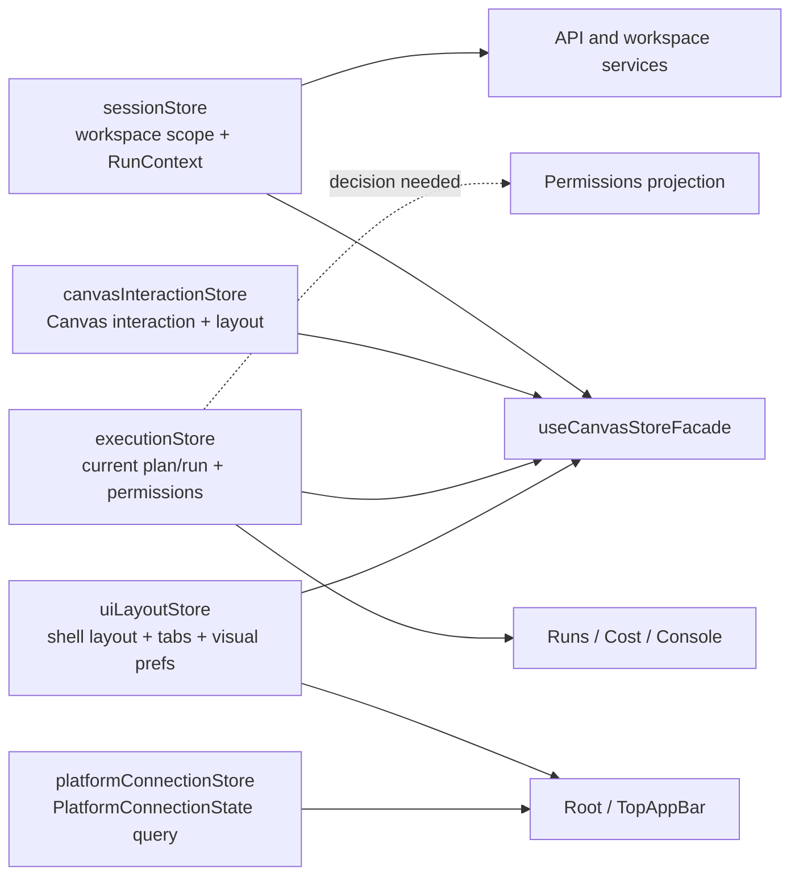
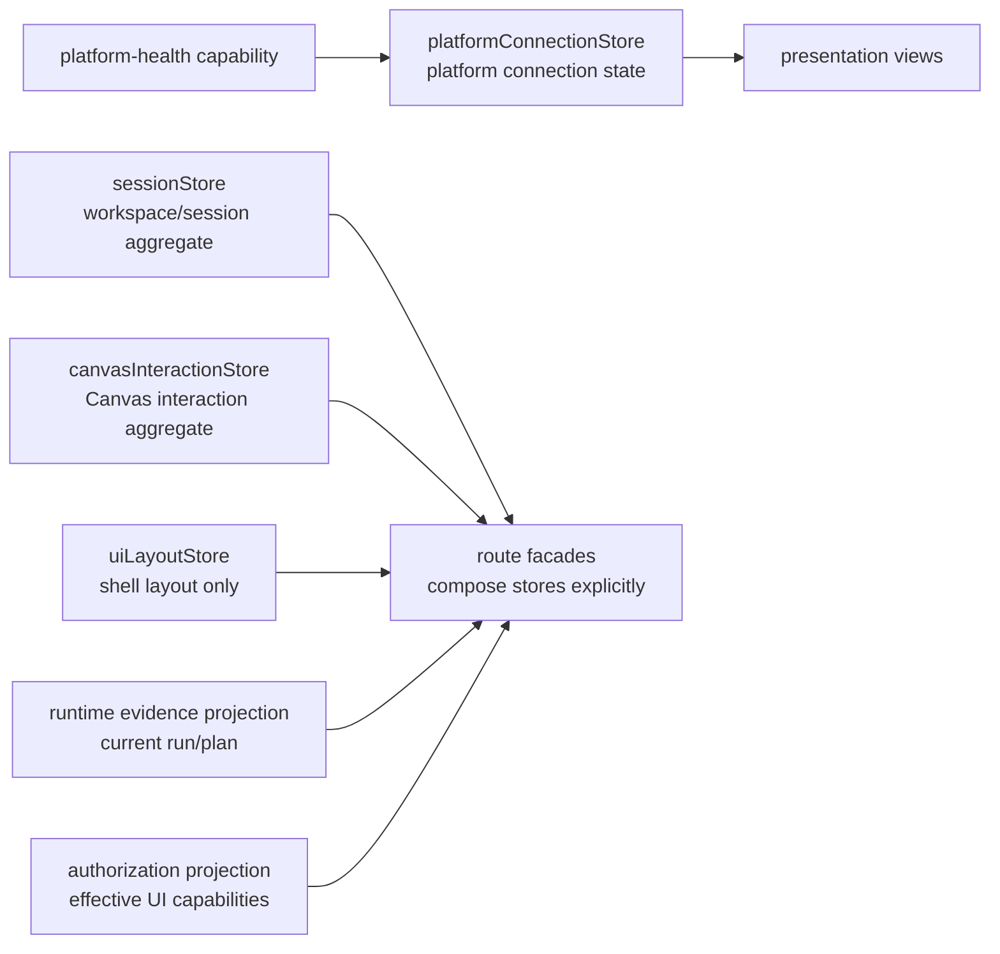

# F-05 Store Domain Ownership Closure Plan

## Purpose

F-05 no longer starts from a live `appStore.ts` monolith. The file has already
been removed from active `apps/web` code and an architecture test now guards
that removal. The remaining work is to close the product and architecture truth
around the stores that actually exist, remove stale documentation claims, and
finish the domain ownership cuts that are still mixed.

This plan is the governed entry point for that closure. No store rename,
extraction, or cross-store behavior change should land under F-05 unless it is
represented here first.

The current component truth is maintained in
`docs/architecture/components/web/web-store-domain-ownership-component.md`.

## Current State

Active store files under `apps/web/src/app/stores`:

| Store                        | Current responsibility                                         | Primary consumers                                                                | Current verdict                                                                            |
| ---------------------------- | -------------------------------------------------------------- | -------------------------------------------------------------------------------- | ------------------------------------------------------------------------------------------ |
| `sessionStore.ts`            | Workspace scope and run context construction.                  | `TopAppBar`, session context port, API client, workspace services, dbt renderer. | Canonical owner for tenant/project/environment selection.                                  |
| `canvasInteractionStore.ts`  | Route-local Canvas interaction and persisted workspace layout. | `useCanvasStoreFacade`, Canvas controller tests.                                 | Canonical owner for Canvas selection, inspector, overlays, viewport, and node positions.   |
| `executionStore.ts`          | Current plan, current run, and user permissions.               | Canvas facade, Runs, Cost, console log stream.                                   | Mixed runtime evidence and authorization projection; needs explicit domain split decision. |
| `uiLayoutStore.ts`           | Shell panels, tabs, focus, and Canvas visual preferences.      | Root, TopAppBar, Console, Canvas facade.                                         | Canonical owner for shell layout only; platform status moved to its own query projection.  |
| `platformConnectionStore.ts` | Platform health connection projection for shell presentation.  | Root, TopAppBar.                                                                 | Canonical query read model for platform connection state.                                  |

Architecture guards already assert that `appStore.ts` is not part of active
runtime ownership:

- `apps/web/src/app/views/canvas/canvasStartupAndDraftRecovery.architecture.test.ts`
- `apps/web/src/app/queries/queryKeyPolicy.architecture.test.ts`

## Drift Register

| Drift id       | Surface                                 | Current status                                                                                              | Closure target                                                                                                  |
| -------------- | --------------------------------------- | ----------------------------------------------------------------------------------------------------------- | --------------------------------------------------------------------------------------------------------------- |
| `F05-DRIFT-01` | `docs/planning/state/agent-lane-e.yaml` | Closed in this slice: F-05 now points at the actual four-store topology and this plan.                      | Keep Lane E aligned when store ownership changes.                                                               |
| `F05-DRIFT-02` | generated workboard views               | Closed in this slice: generated views were regenerated from Lane E.                                         | Regenerate workboard after future Lane E changes.                                                               |
| `F05-DRIFT-03` | `lane-e-shell-baseline-target-guide.md` | Closed in this slice: active baseline now lists the current stores, not `useAppStore`.                      | Keep the guide current with the component map.                                                                  |
| `F05-DRIFT-04` | `executionStore.ts`                     | Open design item: runtime evidence (`currentPlan`, `currentRun`) and permission projection share one store. | Decide whether `runStore` and `authorizationStore` are separate or if execution remains the bounded projection. |
| `F05-DRIFT-05` | `uiLayoutStore.ts`                      | Closed in this slice: `connectionStatus` moved out of shell layout ownership.                               | `platformConnectionStore.ts` owns the `ProjectPlatformConnectionStatus` query projection.                       |
| `F05-DRIFT-06` | historical planning/review docs         | Informational only: old reviews and closeouts may describe `appStore` because they captured earlier states. | Do not rewrite historical evidence; active docs route to this plan and the component map.                       |

## Command And Query Rail

F-05 store ownership is not an externally observable product workflow by itself.
It governs presentation-state ownership behind existing UI commands and queries:

| Rail                              | Type    | Owning bounded context        | Store impact                                                                                        |
| --------------------------------- | ------- | ----------------------------- | --------------------------------------------------------------------------------------------------- |
| Workspace scope selection         | command | Web shell / workspace session | `sessionStore` remains the command-side owner for local scope selection.                            |
| Build run context                 | query   | Web shell / workspace session | `sessionStore.buildRunContext` remains the read projection for run commands.                        |
| Canvas interaction updates        | command | Canvas authoring session      | `canvasInteractionStore` owns selected nodes, inspector node, overlays, and layout persistence.     |
| Shell panel/layout updates        | command | Workbench shell               | `uiLayoutStore` owns panels, focus mode, tabs, and visual preferences only.                         |
| `ProjectPlatformConnectionStatus` | query   | Platform health               | `platformConnectionStore` owns the `PlatformConnectionState` read model used by shell presentation. |
| Current run/plan display          | query   | Runtime evidence              | Must be named as execution read model or split into a dedicated run/evidence store.                 |

If a future implementation changes externally visible behavior, the owning rail
must be updated before code changes.

## Current Topology



## Target Topology



The target does not require every conceptual box to become a new Zustand file.
The required result is stronger ownership: each store field has one declared
bounded context, one reason to change, and tests that prevent reintroducing a
mixed `appStore`-style surface.

## Implementation Sequence

### Phase 0 - Truth Reconciliation

Status: completed by this documentation slice.

1. `docs/planning/state/agent-lane-e.yaml` describes the current four-store
   topology instead of a live `appStore`.
2. Planning views are regenerated from Lane E.
3. Active docs route readers to the current component map.
4. Historical reviews remain historical; they are not rewritten as if produced
   today.

### Phase 1 - Status Ownership Cut

Status: implemented by this slice.

1. Platform connection state is a Platform Health query projection named
   `ProjectPlatformConnectionStatus`.
2. `platformConnectionStore` owns `PlatformConnectionState` for shell
   presentation.
3. `uiLayoutStore` no longer owns or hydrates `connectionStatus`.
4. Negative tests prove persisted layout storage does not revive legacy
   platform connectivity fields.
5. `Root` writes the projection from the authoritative platform-health query,
   and `TopAppBar` reads the projection or a direct health override.

### Phase 2 - Execution And Authorization Ownership

1. Classify `currentPlan` and `currentRun` as runtime evidence read models or
   split them into a dedicated run/evidence store.
2. Classify `userPermissions` as authorization projection, not general
   execution state.
3. Add tests for default permissions, permission updates, and negative cases
   where Canvas actions are not enabled by stale defaults.
4. Keep route facades explicit; do not recreate a monolithic facade under a new
   name.

### Phase 3 - Guardrails

1. Keep the no-`appStore.ts` architecture guard.
2. Add store-field ownership tests or static checks for fields known to drift:
   `connectionStatus`, `userPermissions`, `currentPlan`, `currentRun`.
3. Ensure query and mutation ownership remains under the F-06 query-key policy.
4. Run the web test slice plus `pnpm verify:prepush` before claiming closure.

## Required Tests

| Area               | Required proof                                                                           |
| ------------------ | ---------------------------------------------------------------------------------------- |
| Store topology     | Architecture test still fails if `apps/web/src/app/stores/appStore.ts` returns.          |
| Layout persistence | `uiLayoutStore` persists layout preferences only, not runtime health.                    |
| Status projection  | Offline/degraded/connected UI renders from platform-health authority.                    |
| Runtime evidence   | Current run/plan display remains correct after store ownership changes.                  |
| Authorization      | UI actions do not become enabled from stale permission defaults.                         |
| Canvas facade      | `useCanvasStoreFacade` composes stores explicitly and does not become a hidden monolith. |

## Exit Criteria

F-05 is closure-ready only when:

1. Active planning docs no longer claim `appStore.ts` is live.
2. Every active store field is classified by bounded context and command/query
   role.
3. Remaining mixed fields are either moved or explicitly documented as read
   projections with tests.
4. Generated planning views match Lane E.
5. Web validation and repository pre-push validation have been run and reported.

## Feature Mechanization Manifest

```feature-mechanization
version: 1
featureId: F05-STORE-DOMAIN-OWNERSHIP
mechanizationStatus: implemented
noHumanDecisionsRemaining: true
implementationPlan: docs/planning/proposals/mandatory/frontend-and-ux/f05-store-domain-ownership-closure-plan-20260503.md
componentGuides:
  - docs/architecture/components/web/web-store-domain-ownership-component.md
  - docs/architecture/components/web/web-store-domain-ownership-local-guide.md
userStories:
  - docs/planning/state/lane-e-shell-baseline-target-guide.md
  - docs/architecture/components/web/web-store-domain-ownership-user-stories.md
governingSources:
  - AGENTS.md
  - docs/planning/status/governance-document-rule-inventory.md
  - docs/guides/ai-work-protocol.md
  - docs/architecture/command-query-rail-governance.md
  - docs/architecture/fowler-opportunity-planning-governance.md
  - docs/architecture/components/web/web-store-domain-ownership-component.md
  - docs/planning/state/agent-lane-e.yaml
allowedImplementationSurfaces:
  - docs/architecture/components/web/index.md
  - docs/architecture/components/web/web-store-domain-ownership-component.md
  - docs/architecture/components/web/web-store-domain-ownership-local-guide.md
  - docs/architecture/components/web/web-store-domain-ownership-user-stories.md
  - buzon/20260503-codex-fowler-web-store-domain-ownership-analysis-and-remediation.md
  - docs/planning/proposals/mandatory/frontend-and-ux/f05-store-domain-ownership-closure-plan-20260503.md
  - docs/planning/state/agent-lane-e.yaml
  - docs/planning/state/agent-lane-e.md
  - docs/planning/state/lane-e-shell-baseline-target-guide.md
  - docs/planning/state/execution-workboard.md
  - docs/planning/state/open-task-route.md
  - docs/planning/status/**
  - apps/web/src/app/Root.tsx
  - apps/web/src/app/Root.test.support.tsx
  - apps/web/src/app/components/Console.test.tsx
  - apps/web/src/app/components/TopAppBar.tsx
  - apps/web/src/app/stores/canvasInteractionStore.ts
  - apps/web/src/app/stores/executionStore.ts
  - apps/web/src/app/stores/platformConnectionStore.ts
  - apps/web/src/app/stores/platformConnectionStore.test.ts
  - apps/web/src/app/stores/sessionStore.ts
  - apps/web/src/app/stores/uiLayoutStore.ts
  - apps/web/src/app/stores/uiLayoutStore.test.ts
  - apps/web/src/app/stores/webStoreDomainOwnership.architecture.test.ts
forbiddenImplementationSurfaces:
  - apps/api/**
  - packages/**
  - specs/contracts/**
commandQueryRails:
  - name: ClassifyWebStoreDomainOwnership
    type: query
    dddOwner: Web store domain ownership map
  - name: ProjectPlatformConnectionStatus
    type: query
    dddOwner: PlatformConnectionState
  - name: AcceptF05StoreOwnershipPlan
    type: command
    dddOwner: F-05 planning state
domainObjects:
  - name: WebStoreDomainOwnershipMap
    type: component map
    owner: Web / Architecture
  - name: StoreOwnershipDrift
    type: planning finding
    owner: Lane E
  - name: F05StoreOwnershipPlan
    type: planning aggregate
    owner: Lane E
fowlerSignals:
  - Documentation drift
  - Boundary drift
  - Shotgun surgery risk
  - Hidden aggregate store risk
architectureGuards:
  - pnpm --filter @dvt/web test -- canvasStartupAndDraftRecovery.architecture.test.ts
  - pnpm --filter @dvt/web test -- queryKeyPolicy.architecture.test.ts
  - pnpm --filter @dvt/web test -- webStoreDomainOwnership.architecture.test.ts
  - pnpm docs:feature-mechanization --feature F05-STORE-DOMAIN-OWNERSHIP
cypressFlows:
  - none: documentation and ownership-map slice only
completionGate:
  - pnpm docs:feature-mechanization --feature F05-STORE-DOMAIN-OWNERSHIP
  - pnpm docs:feature-mechanization:implementation
  - pnpm docs:governance:file-component-index:check
  - pnpm docs:governance:coverage-report:check
  - pnpm docs:governance:file-fingerprint-baseline:check
  - pnpm verify:prepush
redGreenCycles:
  - id: f05-store-component-map
    redTest: pnpm docs:feature-mechanization --feature F05-STORE-DOMAIN-OWNERSHIP
    expectedFailure: F-05 store ownership has no current component guide or mechanized allowed surfaces.
    patchSurfaces:
      - docs/architecture/components/web/web-store-domain-ownership-component.md
      - docs/architecture/components/web/index.md
      - docs/planning/proposals/mandatory/frontend-and-ux/f05-store-domain-ownership-closure-plan-20260503.md
    greenTest: pnpm docs:feature-mechanization --feature F05-STORE-DOMAIN-OWNERSHIP
  - id: f05-lane-truth-reconciliation
    redTest: pnpm docs:workboard:check
    expectedFailure: Lane E still describes the retired appStore surface as current implementation truth.
    patchSurfaces:
      - docs/planning/state/agent-lane-e.yaml
      - docs/planning/state/lane-e-shell-baseline-target-guide.md
      - docs/planning/state/agent-lane-e.md
      - docs/planning/state/execution-workboard.md
      - docs/planning/state/open-task-route.md
    greenTest: pnpm docs:workboard:check
  - id: f05-store-semantic-architecture
    redTest: pnpm --filter @dvt/web test -- webStoreDomainOwnership.architecture.test.ts
    expectedFailure: Store ownership lacks branch Fowler analysis, local component guide, user stories, owned-concern docblocks, and semantic drift guards.
    patchSurfaces:
      - buzon/20260503-codex-fowler-web-store-domain-ownership-analysis-and-remediation.md
      - docs/architecture/components/web/web-store-domain-ownership-component.md
      - docs/architecture/components/web/web-store-domain-ownership-local-guide.md
      - docs/architecture/components/web/web-store-domain-ownership-user-stories.md
      - apps/web/src/app/stores/sessionStore.ts
      - apps/web/src/app/stores/canvasInteractionStore.ts
      - apps/web/src/app/stores/executionStore.ts
      - apps/web/src/app/stores/uiLayoutStore.ts
      - apps/web/src/app/stores/platformConnectionStore.ts
      - apps/web/src/app/stores/webStoreDomainOwnership.architecture.test.ts
    greenTest: pnpm --filter @dvt/web test -- webStoreDomainOwnership.architecture.test.ts
symbols:
  - name: WebStoreDomainOwnershipMap
    path: docs/architecture/components/web/web-store-domain-ownership-component.md
    dddOwner: Web store domain ownership map
    cqRails:
      - ClassifyWebStoreDomainOwnership
    fowlerSignals:
      - Documentation drift
      - Boundary drift
    architectureGuard: canvasStartupAndDraftRecovery.architecture.test.ts
    cypressCoverage: none
    unitTests:
      - canvasInteractionStore.test.ts
      - uiLayoutStore.test.ts
      - platformConnectionStore.test.ts
      - webStoreDomainOwnership.architecture.test.ts
  - name: WebStoreDomainOwnershipLocalGuide
    path: docs/architecture/components/web/web-store-domain-ownership-local-guide.md
    dddOwner: Web store domain ownership map
    cqRails:
      - ClassifyWebStoreDomainOwnership
    fowlerSignals:
      - Documentation drift
      - Boundary drift
    architectureGuard: webStoreDomainOwnership.architecture.test.ts
    cypressCoverage: none
    unitTests:
      - webStoreDomainOwnership.architecture.test.ts
  - name: WebStoreDomainOwnershipUserStories
    path: docs/architecture/components/web/web-store-domain-ownership-user-stories.md
    dddOwner: Web store domain ownership map
    cqRails:
      - ClassifyWebStoreDomainOwnership
    fowlerSignals:
      - Documentation drift
      - Test-only confidence
    architectureGuard: webStoreDomainOwnership.architecture.test.ts
    cypressCoverage: none
    unitTests:
      - webStoreDomainOwnership.architecture.test.ts
  - name: WebStoreDomainOwnershipFowlerAnalysis
    path: buzon/20260503-codex-fowler-web-store-domain-ownership-analysis-and-remediation.md
    dddOwner: Web store domain ownership map
    cqRails:
      - ClassifyWebStoreDomainOwnership
    fowlerSignals:
      - Responsibility overload
      - Documentation drift
    architectureGuard: webStoreDomainOwnership.architecture.test.ts
    cypressCoverage: none
    unitTests:
      - webStoreDomainOwnership.architecture.test.ts
  - name: PlatformConnectionState
    path: apps/web/src/app/stores/platformConnectionStore.ts
    dddOwner: Platform health
    cqRails:
      - ProjectPlatformConnectionStatus
    fowlerSignals:
      - Boundary drift
      - Hidden aggregate store risk
    architectureGuard: uiLayoutStore.test.ts
    cypressCoverage: none
    unitTests:
      - platformConnectionStore.test.ts
      - uiLayoutStore.test.ts
      - webStoreDomainOwnership.architecture.test.ts
  - name: PlatformConnectionStoreState
    path: apps/web/src/app/stores/platformConnectionStore.ts
    dddOwner: Platform health
    cqRails:
      - ProjectPlatformConnectionStatus
    fowlerSignals:
      - Boundary drift
      - Hidden aggregate store risk
    architectureGuard: webStoreDomainOwnership.architecture.test.ts
    cypressCoverage: none
    unitTests:
      - platformConnectionStore.test.ts
      - webStoreDomainOwnership.architecture.test.ts
  - name: usePlatformConnectionStore
    path: apps/web/src/app/stores/platformConnectionStore.ts
    dddOwner: Platform health
    cqRails:
      - ProjectPlatformConnectionStatus
    fowlerSignals:
      - Boundary drift
      - Hidden aggregate store risk
    architectureGuard: webStoreDomainOwnership.architecture.test.ts
    cypressCoverage: none
    unitTests:
      - platformConnectionStore.test.ts
      - webStoreDomainOwnership.architecture.test.ts
  - name: PersistedUiLayoutState
    path: apps/web/src/app/stores/uiLayoutStore.ts
    dddOwner: Web shell layout aggregate
    cqRails:
      - Shell panel/layout updates
    fowlerSignals:
      - Boundary drift
      - Hidden aggregate store risk
    architectureGuard: uiLayoutStore.test.ts
    cypressCoverage: none
    unitTests:
      - uiLayoutStore.test.ts
      - webStoreDomainOwnership.architecture.test.ts
  - name: StoreOwnedConcernDocblocks
    path: apps/web/src/app/stores/webStoreDomainOwnership.architecture.test.ts
    dddOwner: Web store domain ownership map
    cqRails:
      - ClassifyWebStoreDomainOwnership
    fowlerSignals:
      - Test-only confidence
      - Documentation drift
    architectureGuard: webStoreDomainOwnership.architecture.test.ts
    cypressCoverage: none
    unitTests:
      - webStoreDomainOwnership.architecture.test.ts
  - name: setRootShellConsoleDrawer
    path: apps/web/src/app/Root.test.support.tsx
    dddOwner: Web shell layout aggregate
    cqRails:
      - Shell panel/layout updates
    fowlerSignals:
      - Boundary drift
    architectureGuard: webStoreDomainOwnership.architecture.test.ts
    cypressCoverage: none
    unitTests:
      - Root.shellChrome.test.tsx
  - name: F05StoreOwnershipPlan
    path: docs/planning/proposals/mandatory/frontend-and-ux/f05-store-domain-ownership-closure-plan-20260503.md
    dddOwner: F-05 planning state
    cqRails:
      - AcceptF05StoreOwnershipPlan
    fowlerSignals:
      - Documentation drift
      - Hidden aggregate store risk
    architectureGuard: queryKeyPolicy.architecture.test.ts
    cypressCoverage: none
    unitTests:
      - docs feature mechanization
```
