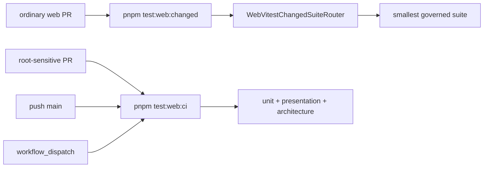

# F-14-B Web Vitest PR Changed Suite Routing Plan

## Think-First Analysis

Problem summary: ordinary `@dvt/web` pull requests still paid the full web
primary-suite cost even when the changed-file router could select a smaller
governed lane.

Root cause: F-14-A created the `WebVitestChangedSuiteRouter`, but the `Web
Frontend Tests` workflow kept using only `pnpm test:web:ci`.

Selected approach: reuse the existing changed-suite query in the pull-request
web lane when the diff is web-scoped and not root-build-sensitive. Keep
`pnpm test:web:ci` for pushes to `main`, manual workflow runs, and
root-build-sensitive pull requests.

ADR decision: no new ADR is required. This is a workflow-policy refinement of
F-14/F-14-A, not a new architectural decision.

## Fowler Opportunity Matrix

<!-- markdownlint-disable MD060 -->

| Scenario                  | Opportunity       | Pattern              | DDD owner                | Rail                       | Tests                               |
| ------------------------- | ----------------- | -------------------- | ------------------------ | -------------------------- | ----------------------------------- |
| Two-file web PR           | Feedback drag     | Change-set query     | Frontend test governance | WebVitestChangedSuiteRoute | `vitestSuites.architecture.test.ts` |
| Root-sensitive PR         | False confidence  | Fail-closed route    | CI governance            | WebVitestSuitePartition    | Workflow guard assertions           |
| Main/manual full coverage | Coverage cadence  | Full-suite fallback  | Frontend test governance | WebVitestSuitePartition    | Workflow guard assertions           |
| Docs/CI drift             | Documentation gap | Component guide sync | Web component docs       | Docs governance            | Markdown/docs gates                 |

<!-- markdownlint-enable MD060 -->

## Current And Target Flow



## Invariants

- No new web test taxonomy is introduced.
- Pull-request changed routing uses the existing
  `resolveWebVitestChangedSuitePlan` query.
- Root-build-sensitive changes remain fail-closed and run `test:web:ci`.
- Full web primary-suite coverage still runs on `main` and manual workflows.
- `pnpm test:web` remains the local full web suite.

## Red-Green Plan

1. Add an architecture assertion that the `Web Frontend Tests` workflow contains
   `pnpm test:web:changed` for the pull-request route.
2. Run the architecture test and observe failure because the workflow only runs
   `pnpm test:web:ci`.
3. Change `.github/workflows/test.yml` to route ordinary web PRs through
   `pnpm test:web:changed` and keep `pnpm test:web:ci` for full routes.
4. Update component guides and test-capability documentation.
5. Run targeted architecture tests, changed-suite proof, docs gates, and
   pre-push validation.

```feature-mechanization
version: 1
featureId: F14B-WEB-VITEST-PR-CHANGED-SUITE-ROUTING-20260520
mechanizationStatus: implemented
noHumanDecisionsRemaining: true
implementationPlan: docs/planning/proposals/mandatory/frontend-and-ux/f14b-web-vitest-pr-changed-suite-routing-plan-20260520.md
componentGuides:
  - docs/architecture/components/web/frontend-test-governance-component.md
  - docs/architecture/components/web/web-vitest-changed-suite-router-component.md
userStories:
  - docs/architecture/components/web/frontend-test-governance-user-stories.md
  - docs/architecture/components/web/web-vitest-changed-suite-router-user-stories.md
governingSources:
  - AGENTS.md
  - docs/planning/status/governance-document-rule-inventory.md
  - docs/architecture/command-query-rail-governance.md
  - docs/architecture/fowler-opportunity-planning-governance.md
  - docs/guides/ai-work-protocol.md
  - docs/guides/test-architecture.md
  - docs/guides/testing-and-ci-capabilities.md
allowedImplementationSurfaces:
  - .github/workflows/test.yml
  - apps/web/src/testing/vitestSuites.architecture.test.ts
  - buzon/20260520-f14b-fowler-web-vitest-pr-changed-suite-routing-analysis.md
  - docs/architecture/components/web/frontend-test-governance-component.md
  - docs/architecture/components/web/frontend-test-governance-user-stories.md
  - docs/architecture/components/web/web-vitest-changed-suite-router-component.md
  - docs/architecture/components/web/web-vitest-changed-suite-router-user-stories.md
  - docs/guides/test-architecture.md
  - docs/guides/testing-and-ci-capabilities.md
  - docs/planning/proposals/mandatory/frontend-and-ux/f14b-web-vitest-pr-changed-suite-routing-plan-20260520.md
forbiddenImplementationSurfaces:
  - packages/@dvt/contracts/**
  - packages/@dvt/engine/**
  - packages/@dvt/adapter-*/**
  - packages/@dvt/planner/**
  - apps/api/**
commandQueryRails:
  - name: WebVitestChangedSuiteRoute
    type: query
    dddOwner: Frontend test governance
  - name: WebVitestSuitePartition
    type: command
    dddOwner: Frontend test governance
domainObjects:
  - name: WebVitestChangedSuiteRouter
    type: changed-file query
    owner: apps/web
fowlerSignals:
  - Feedback-loop drag
  - Boundary drift
  - Documentation drift
architectureGuards:
  - pnpm --filter @dvt/web test -- src/testing/vitestSuites.architecture.test.ts
cypressFlows:
  - N/A - F-14-B governs Vitest workflow routing and does not change browser behavior.
completionGate:
  - pnpm --filter @dvt/web test -- src/testing/vitestSuites.architecture.test.ts
  - pnpm test:web:changed -- --files apps/web/src/app/views/canvas/CanvasToolbar.tsx
  - pnpm docs:feature-mechanization:implementation
  - pnpm docs:sync
  - pnpm governance:refresh
  - pnpm verify:prepush
redGreenCycles:
  - id: f14b-web-pr-changed-routing
    redTest: pnpm --filter @dvt/web test -- src/testing/vitestSuites.architecture.test.ts
    expectedFailure: Workflow does not contain the `pnpm test:web:changed` PR route.
    patchSurfaces:
      - .github/workflows/test.yml
      - apps/web/src/testing/vitestSuites.architecture.test.ts
    greenTest: pnpm --filter @dvt/web test -- src/testing/vitestSuites.architecture.test.ts
symbols:
  - name: Web Frontend Tests PR changed route
    path: .github/workflows/test.yml
    dddOwner: Frontend test governance
    cqRails: [WebVitestChangedSuiteRoute]
    fowlerSignals: [Feedback-loop drag, Boundary drift]
    architectureGuard: pnpm --filter @dvt/web test -- src/testing/vitestSuites.architecture.test.ts
    cypressCoverage: N/A - workflow test routing only.
    unitTests: [pnpm --filter @dvt/web test -- src/testing/vitestSuites.architecture.test.ts]
```
